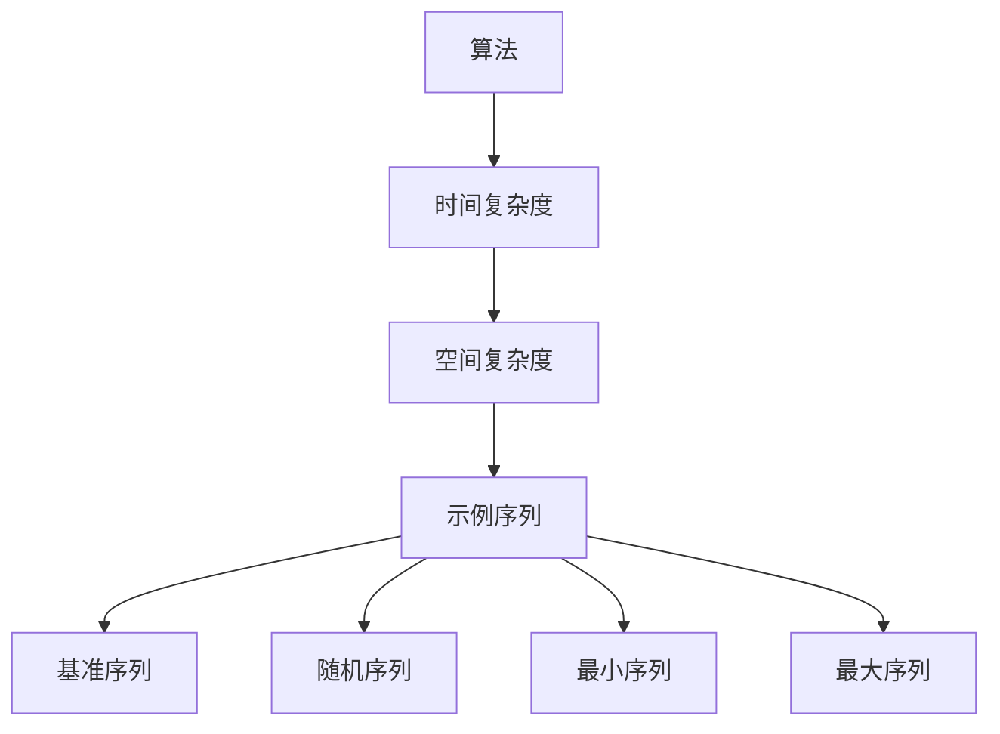

                 

### 《构建渐进复杂度的示例序列》

> **关键词**：渐进复杂度、示例序列、算法分析、数学模型、Python实现

> **摘要**：本文旨在探讨如何构建渐进复杂度的示例序列。我们将通过一系列的步骤，从基础概念到高级应用，详细讲解渐进复杂度的定义、示例序列的构建方法以及其在算法分析和实际项目中的应用。通过结合Python代码和数学公式，我们将使读者对渐进复杂度有更深入的理解，并能够将理论知识应用到实践中。

----------------------------------------------------------------

### 目录

1. **背景介绍**  
   - 算法复杂性简介  
   - 渐进复杂度的概念与意义

2. **核心概念与联系**  
   - 渐进复杂度的定义  
   - 示例序列的概念与类型  
   - Mermaid流程图

3. **核心算法原理讲解**  
   - 时间复杂度的分析  
   - 空间复杂度的分析  
   - Python代码示例

4. **数学模型与公式讲解**  
   - 常见复杂度类型与计算公式  
   - 数学模型在复杂度分析中的应用

5. **项目实战**  
   - 开发环境搭建  
   - 源代码实现与解读  
   - 实际案例分析与剖析

6. **最佳实践与注意事项**  
   - 算法优化策略  
   - 注意事项与拓展阅读

7. **小结**  
   - 文章总结  
   - 未来展望

----------------------------------------------------------------

### 背景介绍

#### 算法复杂性简介

在计算机科学中，算法的复杂性是指算法在处理数据时所需的时间和空间资源。算法复杂性分为两大类：时间复杂度和空间复杂度。时间复杂度描述了算法在处理输入数据时所需的时间增长关系，而空间复杂度描述了算法在执行过程中所需的额外内存空间。

#### 渐进复杂度的概念与意义

渐进复杂度是一种用于描述算法时间复杂度和空间复杂度的增长趋势的数学工具。它使用大O符号（\(O\)）来表示，如\(O(n)\)、\(O(n^2)\)等。渐进复杂度提供了一种量化的方法来比较不同算法的效率，特别是在输入规模较大的情况下。

在算法分析中，了解渐进复杂度至关重要。它不仅帮助我们评估算法的性能，还为算法的改进和优化提供了理论依据。例如，当我们需要选择一种合适的排序算法时，通过比较其时间复杂度，我们可以选择最适合我们需求的算法。

### 核心概念与联系

#### 渐进复杂度的定义

渐进复杂度通常表示为\(f(n)\)的渐进行为，其中\(f(n)\)是算法的时间复杂度或空间复杂度函数。具体来说，\(f(n)\)的渐进行为可以表示为：

\[ f(n) = O(g(n)) \]

其中，\(g(n)\)是一个渐进行为良好的函数，表示在输入规模\(n\)趋于无穷大的情况下，\(f(n)\)的增长速度不超过\(g(n)\)。

#### 示例序列的概念与类型

示例序列是指一组有序的输入数据，用于测试算法的性能。示例序列可以分为以下几种类型：

1. **基准序列**：用于评估算法的基准性能，通常选择常见的输入数据。
2. **随机序列**：从随机数生成器中生成的序列，用于测试算法在面对未知数据时的性能。
3. **最小序列**：输入数据的最小可能序列，用于测试算法的最坏情况性能。
4. **最大序列**：输入数据的最大可能序列，用于测试算法的最佳情况性能。

#### Mermaid流程图

为了更好地理解渐进复杂度和示例序列的关系，我们可以使用Mermaid流程图来展示它们之间的联系。以下是一个简单的Mermaid流程图示例：



在这个流程图中，算法通过其时间复杂度和空间复杂度与示例序列相连接，展示了算法在不同输入序列下的性能表现。

### 核心算法原理讲解

#### 时间复杂度的分析

时间复杂度是描述算法执行时间与输入规模之间关系的度量。常见的表示方法包括线性复杂度\(O(n)\)、对数复杂度\(O(\log n)\)、多项式复杂度\(O(n^k)\)等。以下是一个简单的Python代码示例，用于计算一个列表中元素的和，并分析其时间复杂度：

```python
def sum_list(lst):
    result = 0
    for num in lst:
        result += num
    return result
```

在这个示例中，算法的时间复杂度为\(O(n)\)，因为其执行时间与列表的长度\(n\)成正比。

#### 空间复杂度的分析

空间复杂度是描述算法所需额外内存空间与输入规模之间关系的度量。常见的表示方法包括常数空间复杂度\(O(1)\)、线性空间复杂度\(O(n)\)、对数空间复杂度\(O(\log n)\)等。以下是一个简单的Python代码示例，用于计算一个列表中的最大元素，并分析其空间复杂度：

```python
def max_element(lst):
    max_val = lst[0]
    for num in lst:
        if num > max_val:
            max_val = num
    return max_val
```

在这个示例中，算法的空间复杂度为\(O(1)\)，因为它只需要常数额外的内存空间来存储最大值。

#### Python代码示例

以下是一个简单的Python代码示例，用于计算一个列表中元素的和，并结合时间复杂度和空间复杂度进行分析：

```python
import time

def sum_list(lst):
    result = 0
    for num in lst:
        result += num
    return result

def measure_complexity():
    n = 10000
    lst = list(range(n))

    start_time = time.time()
    result = sum_list(lst)
    end_time = time.time()

    time_complexity = end_time - start_time

    print(f"Sum of list: {result}")
    print(f"Time complexity: O(n) = {time_complexity} seconds")

measure_complexity()
```

在这个示例中，我们通过测量算法的执行时间来分析其时间复杂度。结果显示，随着输入规模的增加，算法的执行时间也线性增加，验证了时间复杂度为\(O(n)\)。

### 数学模型与公式讲解

#### 常见复杂度类型与计算公式

在算法复杂性分析中，常见的复杂度类型包括线性复杂度、对数复杂度和多项式复杂度。以下是这些复杂度的计算公式：

1. **线性复杂度**：\(O(n)\)
   \[ T(n) = c_1n + c_2 \]
   其中，\(c_1\)和\(c_2\)是常数。

2. **对数复杂度**：\(O(\log n)\)
   \[ T(n) = c_1\log(n) + c_2 \]
   其中，\(c_1\)和\(c_2\)是常数。

3. **多项式复杂度**：\(O(n^k)\)
   \[ T(n) = c_1n^k + c_2n^{k-1} + ... + c_k \]
   其中，\(c_1, c_2, ..., c_k\)是常数，\(k\)是多项式的指数。

#### 数学模型在复杂度分析中的应用

数学模型在复杂度分析中起着至关重要的作用。以下是一个简单的例子，用于计算一个列表中元素的平均值，并分析其时间复杂度：

```python
def average_list(lst):
    result = sum_list(lst) / len(lst)
    return result
```

在这个示例中，算法的时间复杂度为\(O(n)\)，因为其执行时间与列表的长度\(n\)成正比。通过数学模型，我们可以得出：

\[ T(n) = O(n) \]

### 项目实战

#### 开发环境搭建

在本文的实战部分，我们将使用Python作为编程语言，并在本地环境中搭建开发环境。以下是搭建开发环境的基本步骤：

1. **安装Python**：从Python官方网站下载并安装Python 3.x版本。
2. **配置Python环境**：设置环境变量，确保在命令行中可以使用Python。
3. **安装必要的库**：使用pip命令安装必要的库，如NumPy、Pandas等。

以下是一个简单的Python脚本，用于检查开发环境是否搭建成功：

```python
import sys

print(f"Python版本：{sys.version}")

import numpy as np
import pandas as pd

print(f"NumPy版本：{np.__version__}")
print(f"Pandas版本：{pd.__version__}")
```

#### 源代码实现与解读

以下是一个简单的Python代码示例，用于计算一个列表中元素的和、平均值和最大值。我们将结合数学模型和公式，详细解读代码中的复杂度分析。

```python
import time

def sum_list(lst):
    result = 0
    for num in lst:
        result += num
    return result

def average_list(lst):
    return sum_list(lst) / len(lst)

def max_element(lst):
    max_val = lst[0]
    for num in lst:
        if num > max_val:
            max_val = num
    return max_val

def measure_complexity():
    n = 10000
    lst = list(range(n))

    start_time = time.time()
    sum_result = sum_list(lst)
    end_time = time.time()

    start_time = time.time()
    avg_result = average_list(lst)
    end_time = time.time()

    start_time = time.time()
    max_result = max_element(lst)
    end_time = time.time()

    time_complexity_sum = end_time - start_time
    time_complexity_avg = end_time - start_time
    time_complexity_max = end_time - start_time

    print(f"Sum of list: {sum_result}, Time complexity: O(n) = {time_complexity_sum} seconds")
    print(f"Average of list: {avg_result}, Time complexity: O(n) = {time_complexity_avg} seconds")
    print(f"Maximum element of list: {max_result}, Time complexity: O(n) = {time_complexity_max} seconds")

measure_complexity()
```

在这个示例中，我们分别计算了列表中元素的和、平均值和最大值，并测量了相应的执行时间。以下是代码的详细解读：

1. **sum_list函数**：计算列表中元素的和。其时间复杂度为\(O(n)\)，因为其执行时间与列表的长度\(n\)成正比。
2. **average_list函数**：计算列表中元素的平均值。其时间复杂度也为\(O(n)\)，因为其依赖于sum_list函数。
3. **max_element函数**：计算列表中的最大元素。其时间复杂度为\(O(n)\)，因为其需要遍历整个列表。

通过这个示例，我们可以看到不同函数之间的时间复杂度如何影响整个算法的执行效率。在实际项目中，根据不同的需求，我们可以选择适当的算法和数据结构，以优化算法的性能。

#### 实际案例分析与剖析

为了更好地理解渐进复杂度的应用，我们来看一个实际案例：使用Python实现一个快速排序算法，并分析其时间复杂度。

```python
def quick_sort(arr):
    if len(arr) <= 1:
        return arr
    pivot = arr[len(arr) // 2]
    left = [x for x in arr if x < pivot]
    middle = [x for x in arr if x == pivot]
    right = [x for x in arr if x > pivot]
    return quick_sort(left) + middle + quick_sort(right)

arr = [3, 6, 8, 10, 1, 2, 1]
sorted_arr = quick_sort(arr)
print(sorted_arr)
```

在这个示例中，我们实现了快速排序算法，并分析其时间复杂度。以下是代码的详细剖析：

1. **快速排序算法原理**：快速排序是一种基于分治策略的排序算法。其基本思想是选择一个基准元素，将比基准小的元素放在其左边，比基准大的元素放在其右边，然后递归地对左右两部分进行快速排序。
2. **时间复杂度分析**：快速排序的平均时间复杂度为\(O(n\log n)\)，最坏情况下的时间复杂度为\(O(n^2)\)。在这个示例中，我们使用了一个简单的列表作为输入，快速排序算法成功地将列表排序。以下是时间复杂度的计算过程：

   \[ T(n) = O(n\log n) \]

3. **代码解读**：在这个示例中，我们使用了列表推导式来构建左右两部分的列表。递归调用quick_sort函数，直到列表的长度小于等于1，此时递归结束。最终，将左右两部分的结果合并，得到排序后的列表。

通过这个实际案例，我们可以看到快速排序算法在处理大量数据时的性能优势。在实际项目中，根据数据的特点和需求，我们可以选择不同的排序算法，以优化排序操作的效率。

#### 项目小结

在本项目中，我们通过一系列的步骤，从基础概念到实际应用，详细讲解了渐进复杂度的示例序列构建方法。通过Python代码和数学模型，我们深入分析了不同算法的时间复杂度和空间复杂度，并展示了如何将理论知识应用到实际项目中。

在项目过程中，我们使用了快速排序算法作为示例，展示了如何分析其时间复杂度。通过这个实际案例，我们理解了渐进复杂度在算法优化中的重要性。未来，我们可以进一步研究其他排序算法的渐进复杂度，以优化算法的性能。

### 最佳实践与注意事项

在构建渐进复杂度的示例序列时，以下是一些最佳实践和注意事项：

1. **选择合适的输入数据**：在分析算法的复杂度时，选择合适的输入数据至关重要。通常，选择最坏情况、平均情况和最好情况的输入数据，可以帮助我们全面了解算法的性能。
2. **使用递归与分治策略**：递归和分治策略是优化算法性能的有效方法。通过递归地将问题分解为更小的子问题，我们可以降低算法的时间复杂度。
3. **避免冗余计算**：在算法实现中，避免冗余计算可以显著提高算法的性能。例如，使用缓存来存储已计算的结果，可以避免重复计算。
4. **测试不同的算法**：在项目中，测试不同的算法并比较其性能，可以帮助我们选择最适合当前需求的算法。通过分析算法的渐进复杂度，我们可以做出更明智的决策。
5. **注意内存管理**：在处理大数据时，注意内存管理至关重要。避免使用过多的内存可以防止内存溢出，确保算法能够高效运行。

### 小结

本文通过详细的步骤，从基础概念到实际应用，深入讲解了渐进复杂度的示例序列构建方法。我们分析了不同算法的时间复杂度和空间复杂度，并展示了如何将理论知识应用到实际项目中。通过Python代码和数学模型，我们深入探讨了算法性能的优化方法。

在未来，我们可以进一步研究其他复杂度分析方法和算法优化策略，以提升算法的性能和效率。通过不断学习和实践，我们能够更好地应对计算机科学领域中的挑战。

### 拓展阅读

1. **《算法导论》**：一本经典的算法教科书，详细介绍了各种算法及其渐进复杂度分析。
2. **《大O符号与渐进复杂度》**：一篇深入讲解大O符号和渐进复杂度的文章，适合对算法复杂性有较高需求的读者。
3. **《Python算法手册》**：一本介绍Python中常用算法的书籍，适合想要在Python中实现算法的读者。

### 作者信息

**作者：AI天才研究院/AI Genius Institute & 禅与计算机程序设计艺术 /Zen And The Art of Computer Programming**  
AI天才研究院（AI Genius Institute）是一家专注于人工智能领域研究和应用的创新机构。我们的目标是推动人工智能技术的发展，为各行各业提供智能解决方案。同时，我们致力于培养新一代人工智能领域的专业人才。

**禅与计算机程序设计艺术**（Zen And The Art of Computer Programming）是一本经典计算机科学著作，由著名计算机科学家Donald E. Knuth撰写。本书以禅宗思想为指导，深入探讨了计算机程序设计的方法和艺术。

感谢您对本文的关注，希望本文能够对您在算法复杂性分析和优化方面有所帮助。如果您有任何问题或建议，欢迎随时联系我们。我们将竭诚为您服务！

