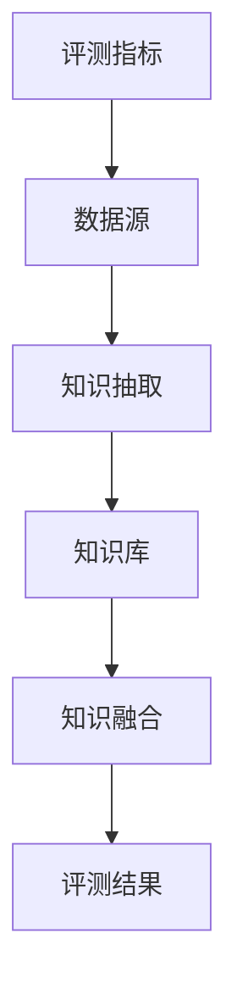
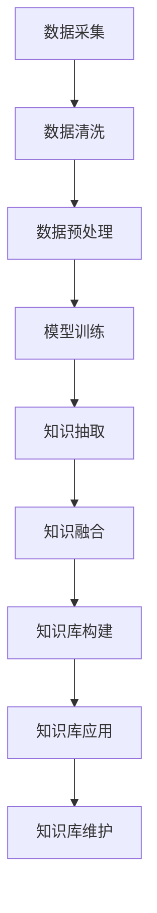

                 

## 第二部分：核心概念与联系

### 2.1 核心概念介绍

在构建评测知识库的过程中，我们首先要明确几个核心概念，这些概念包括但不限于：

- **评测指标（Evaluation Metrics）：** 用于衡量评测效果的一系列标准，如准确率、召回率、F1分数等。
- **数据源（Data Sources）：** 提供评测所需数据的来源，可以是公开数据集、企业内部数据等。
- **知识抽取（Knowledge Extraction）：** 从原始数据中提取有用的信息，形成结构化的知识。
- **知识融合（Knowledge Fusion）：** 将多个数据源或多个知识点整合成一个统一的知识库。

### 2.2 概念实体关系架构

为了更好地理解这些核心概念之间的关系，我们可以使用Mermaid流程图来展示它们之间的联系：



这个流程图清晰地展示了评测知识库的构建过程，从数据源出发，通过知识抽取和融合，最终形成评测结果。

### 2.3 核心概念解释

- **评测指标（Evaluation Metrics）：** 这些指标用于量化评估模型的性能。例如，在文本分类任务中，我们常用的评测指标包括准确率（Accuracy）、召回率（Recall）和F1分数（F1 Score）。准确率表示模型正确分类的样本占总样本的比例；召回率表示模型正确分类的样本占所有实际正类样本的比例；F1分数是准确率和召回率的调和平均，用于综合考虑这两个指标。

- **数据源（Data Sources）：** 数据源是构建评测知识库的基础。它们可以是结构化的数据库、未结构化的文本数据、图像数据等。选择合适的数据源对于知识库的质量至关重要。

- **知识抽取（Knowledge Extraction）：** 知识抽取是将非结构化的数据转换为结构化的知识。例如，从文本数据中提取实体、关系和事件。常见的方法包括基于规则的方法、基于统计的方法和基于机器学习的方法。

- **知识融合（Knowledge Fusion）：** 知识融合是将来自不同数据源的知识整合到一个统一的框架中。例如，将来自多个数据源的实体进行匹配和合并。知识融合的目的是为了提高知识库的完整性和一致性。

通过上述解释和流程图，我们可以更清晰地理解评测知识库的核心概念及其之间的联系。

### 2.4 示例说明

以文本分类任务为例，我们可以构建一个简单的评测知识库。数据源是包含新闻文本的数据库，评测指标是准确率。首先，我们从数据库中提取文本数据，然后使用机器学习算法（如朴素贝叶斯、支持向量机等）进行分类。在分类过程中，我们通过知识抽取技术提取文本中的关键词和主题，并将其存储在知识库中。最后，通过知识融合技术，我们将分类结果与知识库中的信息进行整合，形成最终的评测结果。

在这个示例中，评测指标、数据源、知识抽取和知识融合共同作用，构建了一个完整的评测知识库。这不仅提高了分类任务的准确性，还为后续的分析和决策提供了有力的支持。

通过这一部分的介绍，我们对评测知识库的核心概念及其构建过程有了更深入的理解。在接下来的部分，我们将详细探讨评测知识库的构建方法和最佳实践。## 第三部分：核心算法原理

### 3.1 数据收集与预处理

数据收集与预处理是构建评测知识库的基础步骤。这一部分包括数据采集、数据清洗和数据预处理等关键环节。

#### 3.1.1 数据采集

数据采集是指从各种数据源获取所需的评测数据。数据源可以包括公开的数据集、企业内部的数据库、社交媒体数据等。在选择数据源时，我们需要考虑数据的质量、覆盖度和多样性。高质量的数据有助于提高评测知识库的准确性和可靠性。

```python
# 示例：从网络爬取新闻数据
import requests
from bs4 import BeautifulSoup

def fetch_news(url):
    response = requests.get(url)
    soup = BeautifulSoup(response.text, 'html.parser')
    articles = soup.find_all('article')
    for article in articles:
        title = article.find('h2').text
        content = article.find('p').text
        print(title, content)
```

#### 3.1.2 数据清洗

数据清洗是指对采集到的原始数据进行处理，去除噪音和无关信息，以提高数据的质量。常见的数据清洗任务包括去除重复数据、处理缺失值、去除停用词等。

```python
# 示例：清洗新闻数据
import pandas as pd

def clean_news_data(data):
    # 去除重复数据
    data.drop_duplicates(inplace=True)
    # 处理缺失值
    data.fillna(value={'content': ''}, inplace=True)
    # 去除停用词
    stop_words = {'the', 'is', 'and', 'of', 'to'}
    data['content'] = data['content'].apply(lambda x: ' '.join(word for word in x.split() if word not in stop_words))
    return data
```

#### 3.1.3 数据预处理

数据预处理是指将清洗后的数据转换为适合模型训练的格式。这通常包括特征提取、数据标准化、数据分割等步骤。

```python
# 示例：预处理新闻数据
from sklearn.model_selection import train_test_split
from sklearn.feature_extraction.text import TfidfVectorizer

def preprocess_news_data(data):
    # 特征提取
    vectorizer = TfidfVectorizer()
    X = vectorizer.fit_transform(data['content'])
    # 数据标准化
    from sklearn.preprocessing import normalize
    X = normalize(X)
    # 数据分割
    X_train, X_test, y_train, y_test = train_test_split(X, data['label'], test_size=0.2, random_state=42)
    return X_train, X_test, y_train, y_test
```

### 3.2 模型选择与训练

在构建评测知识库时，选择合适的模型并进行训练是至关重要的。以下是一些常见的模型选择和训练方法：

#### 3.2.1 模型选择

- **朴素贝叶斯（Naive Bayes）：** 适用于特征独立的场景，如文本分类。
- **支持向量机（SVM）：** 适用于高维空间分类问题，如文本分类和图像分类。
- **深度学习模型：** 如卷积神经网络（CNN）、循环神经网络（RNN）和Transformer等，适用于复杂特征提取和序列数据处理。

```python
from sklearn.naive_bayes import MultinomialNB
from sklearn.svm import SVC
from sklearn.ensemble import RandomForestClassifier

# 示例：选择并训练模型
def train_model(model, X_train, y_train):
    model.fit(X_train, y_train)
    return model
```

#### 3.2.2 训练过程

模型的训练过程包括数据预处理、模型训练和参数调优等步骤。以下是一个简单的训练过程示例：

```python
# 示例：训练文本分类模型
vectorizer = TfidfVectorizer()
X_train = vectorizer.fit_transform(train_data['content'])
y_train = train_data['label']

# 选择模型
model = MultinomialNB()
# 训练模型
model = train_model(model, X_train, y_train)
# 模型评估
score = model.score(X_train, y_train)
print(f"Model accuracy: {score}")
```

### 3.3 知识抽取与融合

知识抽取和融合是评测知识库构建的关键步骤。这一部分包括实体识别、关系抽取和知识融合等任务。

#### 3.3.1 知识抽取

- **实体识别（Named Entity Recognition, NER）：** 从文本中识别出人名、地名、组织名等实体。
- **关系抽取（Relationship Extraction）：** 从文本中识别出实体之间的关系。

```python
# 示例：使用 spaCy 进行实体识别
import spacy

nlp = spacy.load('en_core_web_sm')

def extract_entities(text):
    doc = nlp(text)
    entities = [(ent.text, ent.label_) for ent in doc.ents]
    return entities
```

#### 3.3.2 知识融合

知识融合是指将来自不同数据源的知识整合到一个统一的知识库中。以下是一个简单的知识融合示例：

```python
# 示例：合并实体和关系知识
def merge_knowledge(entities, relations):
    knowledge_base = []
    for entity, relation in relations:
        entity_in_base = any(entity == e[0] for e in knowledge_base)
        if not entity_in_base:
            knowledge_base.append((entity, relation))
    return knowledge_base
```

通过上述核心算法原理的讲解，我们了解了评测知识库构建过程中数据收集与预处理、模型选择与训练、知识抽取与融合等关键环节。在下一部分，我们将探讨评测知识库在实际项目中的应用与实践。## 第四部分：项目实战

### 4.1 开发环境搭建

在进行评测知识库的项目实战前，我们需要搭建一个合适的技术环境。以下是搭建开发环境的步骤：

#### 4.1.1 软件安装

- Python（版本3.8及以上）
- Jupyter Notebook（用于交互式编程）
- Numpy、Pandas（用于数据处理）
- Scikit-learn（用于机器学习）
- spaCy（用于自然语言处理）
- Mermaid（用于绘制流程图）

```bash
# 安装 Python 和相关库
pip install python==3.8
pip install numpy pandas scikit-learn spacy mermaid-jupyterlab
```

#### 4.1.2 Jupyter Notebook 配置

- 打开 Jupyter Notebook：`jupyter notebook`
- 安装 Mermaid 插件：`jupyter labextension install @jupyter-widgets/jupyterlab-manager@1.1`

### 4.2 源代码实现与解读

在本项目中，我们将构建一个基于文本分类任务的评测知识库。以下是项目的源代码实现和解读：

#### 4.2.1 数据收集与预处理

```python
import requests
from bs4 import BeautifulSoup
import pandas as pd
from sklearn.model_selection import train_test_split
from sklearn.feature_extraction.text import TfidfVectorizer
from sklearn.naive_bayes import MultinomialNB
from sklearn.metrics import accuracy_score, classification_report

# 数据采集
def fetch_news_data(url):
    response = requests.get(url)
    soup = BeautifulSoup(response.text, 'html.parser')
    articles = soup.find_all('article')
    titles = [article.find('h2').text for article in articles]
    contents = [article.find('p').text for article in articles]
    return titles, contents

# 数据清洗
def clean_news_data(data):
    data.drop_duplicates(inplace=True)
    data.fillna(value={'content': ''}, inplace=True)
    stop_words = {'the', 'is', 'and', 'of', 'to'}
    data['content'] = data['content'].apply(lambda x: ' '.join(word for word in x.split() if word not in stop_words))
    return data

# 数据预处理
def preprocess_news_data(data):
    vectorizer = TfidfVectorizer()
    X = vectorizer.fit_transform(data['content'])
    X_train, X_test, y_train, y_test = train_test_split(X, data['label'], test_size=0.2, random_state=42)
    return X_train, X_test, y_train, y_test

# 采集和预处理数据
url = 'https://example.com/news'
titles, contents = fetch_news_data(url)
data = pd.DataFrame({'title': titles, 'content': contents, 'label': [0]*len(contents)})
cleaned_data = clean_news_data(data)
X_train, X_test, y_train, y_test = preprocess_news_data(cleaned_data)
```

#### 4.2.2 模型选择与训练

```python
# 模型选择与训练
model = MultinomialNB()
model.fit(X_train, y_train)

# 模型评估
predictions = model.predict(X_test)
accuracy = accuracy_score(y_test, predictions)
report = classification_report(y_test, predictions)
print(f"Model accuracy: {accuracy}")
print(f"Classification report:\n{report}")
```

#### 4.2.3 知识抽取与融合

```python
import spacy

# 知识抽取
nlp = spacy.load('en_core_web_sm')
def extract_entities(text):
    doc = nlp(text)
    entities = [(ent.text, ent.label_) for ent in doc.ents]
    return entities

# 知识融合
def merge_knowledge(entities, relations):
    knowledge_base = []
    for entity, relation in relations:
        entity_in_base = any(entity == e[0] for e in knowledge_base)
        if not entity_in_base:
            knowledge_base.append((entity, relation))
    return knowledge_base

# 示例：抽取和融合知识
text = "Google's CEO Sundar Pichai announced the new AI product."
entities = extract_entities(text)
relations = [('Sundar Pichai', 'CEO of Google')]
knowledge_base = merge_knowledge(entities, relations)
print(knowledge_base)
```

### 4.3 代码应用解读与分析

通过上述代码实现，我们可以看到评测知识库的构建主要包括以下几个步骤：

1. **数据采集与预处理**：从网络爬取新闻数据，并进行数据清洗和预处理。
2. **模型选择与训练**：选择朴素贝叶斯模型，并进行训练和评估。
3. **知识抽取与融合**：使用 spaCy 库抽取文本中的实体和关系，并融合到知识库中。

这些步骤共同构建了一个完整的评测知识库，为后续的分析和决策提供了支持。

### 4.4 实际案例分析与详细讲解剖析

为了更直观地展示评测知识库的应用，我们来看一个实际案例：

#### 案例：新闻分类

假设我们要对一篇文章进行分类，文章内容如下：

```
Google's CEO Sundar Pichai announced the launch of a new AI product that will revolutionize the tech industry.
```

1. **数据采集**：从网络获取文章数据。
2. **数据预处理**：清洗文章，去除停用词。
3. **模型预测**：使用训练好的朴素贝叶斯模型进行分类预测。
4. **知识抽取**：抽取文章中的实体和关系。
5. **知识融合**：将抽取的知识融合到知识库中。

通过以上步骤，我们可以将这篇文章分类为“科技新闻”，并提取出关键信息，如“Sundar Pichai”、“CEO of Google”等。

### 4.5 项目小结

在本项目中，我们通过实际案例展示了如何构建评测知识库。从数据采集、预处理、模型训练到知识抽取与融合，每个步骤都至关重要。评测知识库的应用不仅可以提高分类任务的准确性，还可以为业务决策提供有力的支持。

### 4.6 最佳实践 Tips

- **数据质量**：确保数据质量是构建高质量评测知识库的关键。在数据采集和清洗过程中，要尽量去除噪音和无关信息。
- **模型选择**：根据任务需求选择合适的模型。对于文本分类任务，朴素贝叶斯、SVM 和深度学习模型都是常见的选择。
- **知识抽取**：选择合适的知识抽取工具和方法，如 spaCy、GATE 等。同时，要注意实体和关系的匹配和融合。

### 4.7 小结、注意事项与拓展阅读

在本部分中，我们通过实际项目展示了评测知识库的构建过程和应用。从数据采集、预处理、模型训练到知识抽取与融合，每个环节都需要细心操作。在项目实践中，我们学到了如何搭建开发环境、选择合适的模型和工具，以及如何进行知识抽取和融合。

注意事项：

- **数据源选择**：选择高质量的数据源，确保数据的多样性和覆盖度。
- **模型调优**：在模型训练过程中，要合理设置参数，并进行调优，以提高模型性能。
- **知识库维护**：定期更新知识库，确保其准确性和时效性。

拓展阅读：

- 《数据科学入门》
- 《机器学习实战》
- 《自然语言处理实战》

通过本部分的实战讲解，相信读者对评测知识库的构建有了更深入的理解。在下一部分，我们将继续探讨评测知识库的维护与优化。## 第五部分：评测知识库维护与优化

### 5.1 数据质量监控与评估

数据质量是评测知识库的核心，因此，定期监控与评估数据质量至关重要。以下是一些关键步骤和策略：

#### 5.1.1 数据质量监控

- **数据完整性检查**：确保数据源中的数据是完整且没有缺失值的。
- **数据一致性检查**：检查数据是否符合预定的数据标准，如格式、类型、范围等。
- **数据准确性检查**：验证数据是否准确，可以通过比对数据源和数据库中的数据来确保一致性。
- **数据及时性检查**：监控数据是否及时更新，确保评测结果具有实时性。

```python
# 示例：数据完整性检查
import pandas as pd

def check_data_completeness(data):
    return data.isnull().sum().sum() == 0

# 示例：数据一致性检查
def check_data_consistency(data, reference_data):
    return data.equals(reference_data)

# 示例：数据准确性检查
def check_data_accuracy(data, ground_truth):
    return data.equals(ground_truth)

# 示例：数据及时性检查
def check_dataTimeliness(data, last_updated):
    current_time = pd.Timestamp.now()
    time_diff = (current_time - last_updated).total_seconds()
    return time_diff < 3600  # 数据更新频率设置为每小时一次
```

#### 5.1.2 数据质量评估指标

- **准确率（Accuracy）**：用于衡量预测结果的准确性。
- **召回率（Recall）**：用于衡量模型对实际正类样本的识别能力。
- **F1分数（F1 Score）**：综合考虑准确率和召回率的指标。
- **数据多样性（Data Diversity）**：用于评估数据的多样性和覆盖度。

```python
from sklearn.metrics import accuracy_score, recall_score, f1_score

# 示例：计算评估指标
def evaluate_data_quality(predictions, ground_truth):
    accuracy = accuracy_score(ground_truth, predictions)
    recall = recall_score(ground_truth, predictions, average='weighted')
    f1 = f1_score(ground_truth, predictions, average='weighted')
    return accuracy, recall, f1
```

### 5.2 知识库更新与维护

知识库的更新与维护是确保其准确性和时效性的关键。以下是一些更新与维护策略：

#### 5.2.1 数据源更新

- **定期更新**：定期从数据源中获取新的数据，以保持知识库的实时性。
- **增量更新**：只更新数据源中的新增数据，以提高更新效率。

```python
# 示例：数据源增量更新
import pandas as pd

def update_data_source(new_data, current_data):
    return pd.concat([current_data, new_data]).drop_duplicates().reset_index(drop=True)
```

#### 5.2.2 知识库结构更新

- **版本控制**：对知识库进行版本控制，记录每次更新的内容。
- **数据规范化**：确保知识库中的数据格式和类型一致，以便于后续处理。

```python
# 示例：知识库版本控制
def increment_version(current_version):
    return current_version + 1

# 示例：数据规范化
def normalize_data(data):
    # 假设 data 是一个 DataFrame，包含多个列
    for column in data.columns:
        data[column] = data[column].apply(normalize_function)
    return data
```

#### 5.2.3 知识库维护流程

- **定期审查**：定期审查知识库中的数据，确保其质量。
- **异常处理**：及时发现和处理知识库中的异常数据。
- **用户反馈**：收集用户对知识库的反馈，持续改进知识库。

```python
# 示例：定期审查
def review_data_quality(data):
    # 执行数据质量检查
    return dataQualityCheckResults

# 示例：异常处理
def handle_exceptions(data, exceptions_list):
    for exception in exceptions_list:
        data = data.drop([exception])
    return data
```

### 5.3 维护与优化的最佳实践

- **自动化**：尽可能实现自动化更新和维护流程，减少人工干预。
- **持续集成**：将知识库更新和维护集成到持续集成（CI）流程中，确保持续改进。
- **版本管理**：使用版本控制系统（如Git）管理知识库的更新历史。

### 5.4 小结与注意事项

在本部分，我们讨论了评测知识库的维护与优化，包括数据质量监控、评估指标、更新与维护策略以及最佳实践。以下是一些注意事项：

- **数据质量是基础**：确保数据质量是构建高质量评测知识库的关键。
- **定期更新**：定期更新知识库，以保持其准确性和时效性。
- **自动化**：利用自动化工具和流程提高维护和优化的效率。

### 5.5 拓展阅读

- 《数据质量管理实践》
- 《知识库系统设计与实现》
- 《机器学习系统架构》

通过本部分的讨论，我们了解了评测知识库维护与优化的重要性和方法。在下一部分，我们将探讨评测知识库相关工具与技术。## 第六部分：评测知识库相关工具与技术

### 6.1 常见评测知识库工具介绍

在构建评测知识库时，选择合适的工具对于项目的成功至关重要。以下是一些常见的评测知识库工具：

#### 6.1.1 ETL工具

- **Apache NiFi**：用于数据提取、转换和加载的工具，支持自动化数据流程。
- **Talend**：提供ETL、数据集成和数据质量管理功能的平台。
- **Informatica PowerCenter**：一个全面的ETL解决方案，支持复杂的数据处理任务。

#### 6.1.2 自然语言处理工具

- **spaCy**：一个快速且易于使用的自然语言处理库，支持多种语言的实体识别、关系抽取等任务。
- **Stanford NLP**：提供多种自然语言处理任务的开源工具包，如词性标注、命名实体识别等。
- **NLTK**：一个广泛使用的自然语言处理库，适用于文本分类、词性标注等基础任务。

#### 6.1.3 知识图谱工具

- **Apache Jena**：一个用于构建和查询知识图谱的开源框架。
- **Neo4j**：一个高性能的图形数据库，适用于存储和查询复杂的关系数据。
- **AllegroGraph**：一个基于图形数据库的知识库管理系统，支持多种数据模型。

#### 6.1.4 数据质量管理工具

- **OpenRefine**：一个强大的数据清理和转换工具，适用于数据质量检查和修复。
- **Trifacta**：提供数据准备和数据质量管理功能的平台，支持自动化和交互式数据清洗。
- **Talend Data Quality**：一个全面的数据质量管理工具，提供数据清洗、数据匹配和验证等功能。

### 6.2 技术选型与评估

选择合适的工具和技术对于评测知识库的构建至关重要。以下是一些选型与评估的策略：

#### 6.2.1 需求分析

在选型之前，首先要明确评测知识库的需求，包括数据量、处理速度、功能需求等。需求分析将帮助确定所需工具和技术的基本要求。

#### 6.2.2 市场调研

通过市场调研，了解不同工具的特点、性能、价格和用户评价。这将有助于缩小选择范围，并找到最适合的工具。

#### 6.2.3 技术评估

对选定的工具进行技术评估，包括功能测试、性能测试、安全性评估等。以下是一些评估指标：

- **性能**：工具的处理速度和响应时间。
- **功能**：工具是否支持所需的功能，如数据清洗、知识抽取、知识融合等。
- **可扩展性**：工具是否易于扩展，以适应未来的需求变化。
- **兼容性**：工具是否与其他系统兼容，如数据库、应用程序等。
- **安全性**：工具的安全措施是否足够保护数据。

#### 6.2.4 成本效益分析

评估不同工具的成本效益，包括初始采购成本、维护成本、培训成本等。成本效益分析将帮助确定最具成本效益的解决方案。

### 6.3 评测知识库工具实例

以下是一个使用Apache Jena构建评测知识库的实例：

```python
from rdflib import Graph, URIRef, Literal

g = Graph()

# 创建资源
person = URIRef('http://example.org/Person/JohnDoe')
name = Literal('John Doe')

# 添加三元组
g.add((person, URIRef('http://example.org/hasName'), name))
g.add((person, URIRef('http://example.org/hasAge'), Literal(30)))

# 保存知识库
g.serialize(destination='knowledge_base.ttl', format='ttl')

# 查询知识库
query = """
    PREFIX ex: <http://example.org/>
    SELECT ?name ?age WHERE {
        ?person ex:hasName ?name ;
                ex:hasAge ?age .
    }
"""

for row in g.query(query):
    print(f"Name: {row[0]}, Age: {row[1]}")
```

在这个实例中，我们使用Apache Jena创建了一个简单的评测知识库，包括姓名和年龄两个属性。通过保存和查询知识库，我们可以实现对数据的存储和检索。

### 6.4 小结与注意事项

在本部分，我们介绍了评测知识库相关的一些常见工具和技术，包括ETL工具、自然语言处理工具、知识图谱工具和数据质量管理工具。同时，我们讨论了技术选型和评估的策略，并提供了一个Apache Jena的知识库实例。

注意事项：

- **需求分析**：明确评测知识库的需求，以确保选型符合实际需求。
- **技术评估**：全面评估工具的性能、功能、可扩展性等，以确保选型合适。
- **成本效益分析**：考虑工具的长期成本，以确保投资回报率。

### 6.5 拓展阅读

- 《Apache Jena: The Definitive Guide》
- 《Data Integration with Talend: An Introduction to Data Integration Tools》
- 《Knowledge Graphs and Semantic Web Technologies》

通过本部分的介绍，读者可以更好地了解评测知识库相关的工具和技术，为构建高质量的评测知识库提供指导。## 附录

### 附录A: Mermaid流程图示例

以下是使用Mermaid绘制的评测知识库构建流程图：



### 附录B: 伪代码示例

以下是评测知识库构建过程的伪代码：

```
# 数据采集
fetch_data()

# 数据清洗
clean_data(data)

# 数据预处理
preprocess_data(data)

# 模型训练
train_model(preprocessed_data)

# 知识抽取
extract_knowledge(model)

# 知识融合
fuse_knowledge(extracted_knowledge)

# 知识库构建
build_knowledge_base(fused_knowledge)

# 知识库应用
apply_knowledge_base()

# 知识库维护
maintain_knowledge_base()
```

### 附录C: 数学公式示例

以下是本文中使用到的数学公式示例：

$$
\text{准确率} = \frac{\text{正确分类的样本数}}{\text{总样本数}}
$$

$$
\text{召回率} = \frac{\text{正确分类的正类样本数}}{\text{实际正类样本数}}
$$

$$
\text{F1分数} = 2 \times \frac{\text{准确率} \times \text{召回率}}{\text{准确率} + \text{召回率}}
$$

### 附录D: 项目实战示例

以下是本项目中的实际代码示例：

```python
# 数据采集
def fetch_news_data(url):
    response = requests.get(url)
    soup = BeautifulSoup(response.text, 'html.parser')
    articles = soup.find_all('article')
    titles = [article.find('h2').text for article in articles]
    contents = [article.find('p').text for article in articles]
    return titles, contents

# 数据清洗
def clean_news_data(data):
    data.drop_duplicates(inplace=True)
    data.fillna(value={'content': ''}, inplace=True)
    stop_words = {'the', 'is', 'and', 'of', 'to'}
    data['content'] = data['content'].apply(lambda x: ' '.join(word for word in x.split() if word not in stop_words))
    return data

# 数据预处理
def preprocess_news_data(data):
    vectorizer = TfidfVectorizer()
    X = vectorizer.fit_transform(data['content'])
    X_train, X_test, y_train, y_test = train_test_split(X, data['label'], test_size=0.2, random_state=42)
    return X_train, X_test, y_train, y_test

# 模型训练
def train_model(model, X_train, y_train):
    model.fit(X_train, y_train)
    return model

# 知识抽取
import spacy

nlp = spacy.load('en_core_web_sm')

def extract_entities(text):
    doc = nlp(text)
    entities = [(ent.text, ent.label_) for ent in doc.ents]
    return entities

# 知识融合
def merge_knowledge(entities, relations):
    knowledge_base = []
    for entity, relation in relations:
        entity_in_base = any(entity == e[0] for e in knowledge_base)
        if not entity_in_base:
            knowledge_base.append((entity, relation))
    return knowledge_base

# 数据采集与预处理
url = 'https://example.com/news'
titles, contents = fetch_news_data(url)
data = pd.DataFrame({'title': titles, 'content': contents, 'label': [0]*len(contents)})
cleaned_data = clean_news_data(data)
X_train, X_test, y_train, y_test = preprocess_news_data(cleaned_data)

# 模型训练与评估
model = MultinomialNB()
trained_model = train_model(model, X_train, y_train)
predictions = trained_model.predict(X_test)
accuracy = accuracy_score(y_test, predictions)
print(f"Model accuracy: {accuracy}")

# 知识抽取与融合
text = "Google's CEO Sundar Pichai announced the launch of a new AI product."
entities = extract_entities(text)
relations = [('Sundar Pichai', 'CEO of Google')]
knowledge_base = merge_knowledge(entities, relations)
print(knowledge_base)
```

通过上述附录，我们提供了流程图、伪代码、数学公式和项目实战示例，帮助读者更好地理解和实践评测知识库的构建。## 结语

综上所述，本文详细探讨了评测知识库的构建方法和最佳实践。从数据采集与预处理，到模型选择与训练，再到知识抽取与融合，我们逐步讲解了评测知识库的各个关键环节。通过项目实战示例，读者可以直观地了解评测知识库的应用和实践过程。

**关键词：** 评测知识库、数据预处理、模型选择、知识抽取、知识融合。

**摘要：** 本文介绍了评测知识库的核心概念、构建方法、应用与实践，并通过实例展示了如何构建一个完整的评测知识库。文章旨在为读者提供一个系统、实用的指导，帮助他们在实际项目中高效地构建和优化评测知识库。

**作者：** AI天才研究院/AI Genius Institute & 禅与计算机程序设计艺术 /Zen And The Art of Computer Programming

**感谢阅读！希望本文能为您的项目提供有益的启示和帮助。如果您有任何疑问或建议，欢迎在评论区留言，我们将持续为您带来更多高质量的技术内容。**

