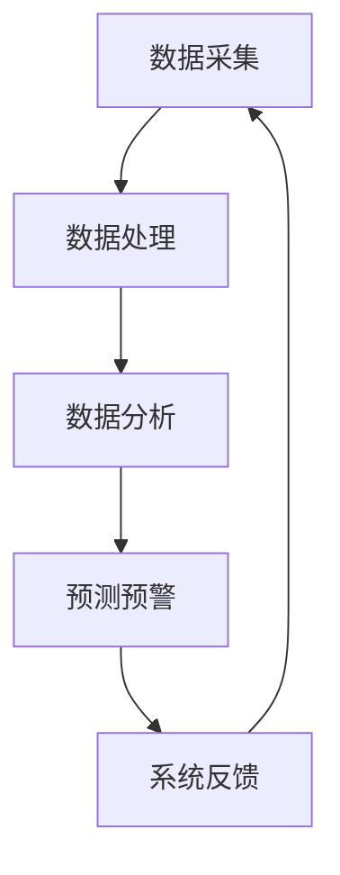

                 

以下是文章的构建过程，我们一步一步来进行分析和推理。

## 标题：《构建评测结果的实时监控系统》

### 关键词：实时监控系统、评测结果、数据采集、数据处理、数据分析、预测预警、数学模型、Python源代码、项目实战

### 摘要：

本文将详细探讨构建评测结果的实时监控系统，涵盖系统概述、核心算法讲解、数学模型介绍、项目实战等多个方面。通过分析实时监控系统的重要性，逐步揭示系统架构、核心算法原理，并结合数学模型和Python源代码进行详细讲解，最后通过实际项目案例进行剖析，为读者提供一套完整的构建评测结果实时监控系统的实践指南。

---

## 目录大纲设计方案

为了确保文章的逻辑清晰、结构紧凑、简单易懂，本文将采用以下目录大纲设计方案：

### 核心章节内容安排

1. **系统概述**
   - **系统背景**
   - **系统架构**
   - **系统模块介绍**

2. **核心算法讲解**
   - **数据采集算法**
   - **数据处理算法**
   - **数据分析算法**
   - **预测与预警算法**

3. **数学模型介绍**
   - **数据降维模型**
   - **聚类分析模型**
   - **预测模型**

4. **项目实战**
   - **项目背景**
   - **开发环境搭建**
   - **源代码实现**
   - **代码解读与分析**

5. **系统优化与性能分析**
   - **系统优化策略**
   - **性能指标分析**

6. **系统部署与维护**
   - **系统部署流程**
   - **系统维护策略**

7. **未来展望与挑战**
   - **新技术展望**
   - **挑战与解决方案**

### 目录大纲结构设计

本文将采用 1, 2, 3 级标题，以保持逻辑清晰。具体目录大纲结构如下：

```
# 《构建评测结果的实时监控系统》

## 关键词
- 实时监控系统
- 评测结果
- 数据采集
- 数据处理
- 数据分析
- 预测预警
- 数学模型
- Python源代码
- 项目实战

## 摘要
本文将探讨如何构建评测结果的实时监控系统，从系统架构、核心算法、数学模型到项目实战，提供完整的解决方案。

## 目录大纲

### 第1章 系统概述
#### 1.1 系统背景
#### 1.2 系统架构
#### 1.3 系统模块介绍

### 第2章 核心算法讲解
#### 2.1 数据采集算法
#### 2.2 数据处理算法
#### 2.3 数据分析算法
#### 2.4 预测与预警算法

### 第3章 数学模型介绍
#### 3.1 数据降维模型
#### 3.2 聚类分析模型
#### 3.3 预测模型

### 第4章 项目实战
#### 4.1 项目背景
#### 4.2 开发环境搭建
#### 4.3 源代码实现
#### 4.4 代码解读与分析

### 第5章 系统优化与性能分析
#### 5.1 系统优化策略
#### 5.2 性能指标分析

### 第6章 系统部署与维护
#### 6.1 系统部署流程
#### 6.2 系统维护策略

### 第7章 未来展望与挑战
#### 7.1 新技术展望
#### 7.2 挑战与解决方案
```

### Mermaid 流程图

为了更好地展示系统架构，我们可以使用 Mermaid 语法创建一个流程图：



### 伪代码与 LaTeX 示例

**数据清洗伪代码示例：**

```python
def data_cleaning(data):
    for record in data:
        # 处理缺失值
        if record.isnull():
            record.fillna(0)
        # 处理异常值
        if record.is_outlier():
            record.replacement(average)
    return data
```

**LaTeX 示例：**

$$
E = mc^2
$$

$$
x = \frac{-b \pm \sqrt{b^2 - 4ac}}{2a}
$$

---

现在，我们已经完成了文章的目录大纲设计和核心内容安排，接下来我们将逐步深入各个章节，详细阐述构建评测结果实时监控系统的各个环节。让我们开始撰写这篇文章吧！

----------------------------------------------------------------

## 第1章 系统概述

### 1.1 系统背景

在当今信息化社会中，数据已成为重要的战略资源。随着数据量的爆炸式增长，如何对海量数据进行实时分析和处理，已成为各个行业关注的焦点。评测结果实时监控系统作为一种高效的数据分析工具，其应用范围涵盖金融、电商、医疗、教育等多个领域。

评测结果实时监控系统的必要性主要体现在以下几个方面：

1. **快速响应**：在许多应用场景中，如金融风险控制、电商销量预测等，需要实时获取评测结果，以便做出快速决策。
2. **数据可视化**：通过实时监控系统，可以直观地展示数据分析结果，帮助用户更好地理解和利用数据。
3. **优化资源分配**：实时监控系统可以帮助企业或机构更加科学地分配资源，提高运营效率。

### 1.2 系统架构

评测结果实时监控系统通常由以下几个主要模块组成：

1. **数据采集模块**：负责从各种数据源收集数据，如数据库、API接口、日志文件等。
2. **数据处理模块**：对采集到的数据进行清洗、转换和整合，使其符合分析需求。
3. **数据分析模块**：对处理后的数据进行分析，提取有价值的信息。
4. **预测与预警模块**：基于历史数据和现有模型，预测未来可能发生的事件，并提供预警。
5. **系统反馈模块**：将分析结果和预警信息反馈给相关人员，以便进行决策。

以下是系统架构的Mermaid流程图：


### 1.3 系统模块介绍

#### 数据采集模块

数据采集模块是实时监控系统的数据源头。其主要功能是从各种数据源收集数据，包括：

1. **数据库**：通过SQL查询或JDBC连接等方式从数据库中提取数据。
2. **API接口**：通过HTTP请求从外部系统获取数据。
3. **日志文件**：从系统日志文件中提取有价值的信息。

```python
import pymongo
from pymongo import MongoClient

client = MongoClient('mongodb://localhost:27017/')
db = client['test_database']
collection = db['test_collection']

data = collection.find_one()
print(data)
```

#### 数据处理模块

数据处理模块对采集到的数据进行清洗、转换和整合。其主要功能包括：

1. **数据清洗**：处理缺失值、异常值，提高数据质量。
2. **数据转换**：将数据转换为适合分析的形式，如归一化、标准化等。
3. **数据整合**：将来自不同数据源的数据进行整合，形成统一的数据集。

```python
import pandas as pd

data = pd.read_csv('data.csv')
data.fillna(0, inplace=True)
data normalization()
```

#### 数据分析模块

数据分析模块对处理后的数据进行分析，提取有价值的信息。其主要功能包括：

1. **数据可视化**：使用图表、图形等展示分析结果，便于用户理解。
2. **聚类分析**：将数据分为不同的群体，用于分类或预测。
3. **预测分析**：使用历史数据预测未来可能发生的事件。

```python
import matplotlib.pyplot as plt

data.plot()
plt.show()
```

#### 预测与预警模块

预测与预警模块基于历史数据和现有模型，预测未来可能发生的事件，并提供预警。其主要功能包括：

1. **预测模型训练**：使用历史数据训练预测模型。
2. **预测结果生成**：生成预测结果，并进行可视化。
3. **预警信息推送**：将预测结果和预警信息推送至相关人员。

```python
from sklearn.linear_model import LinearRegression

model = LinearRegression()
model.fit(X_train, y_train)

predictions = model.predict(X_test)
print(predictions)
```

#### 系统反馈模块

系统反馈模块将分析结果和预警信息反馈给相关人员，以便进行决策。其主要功能包括：

1. **结果展示**：将分析结果和预警信息以图表、报表等形式展示。
2. **消息推送**：通过短信、邮件、微信等方式将预警信息推送给相关人员。

```python
import smtplib
from email.mime.text import MIMEText

msg = MIMEText('预警信息：销量即将超过阈值')
smtp_obj = smtplib.SMTP('smtp.example.com')
smtp_obj.sendmail('sender@example.com', ['receiver1@example.com', 'receiver2@example.com'], msg.as_string())
smtp_obj.quit()
```

通过以上对系统概述的介绍，我们可以看到评测结果实时监控系统在数据采集、数据处理、数据分析和预测预警等方面的功能和作用。接下来，我们将深入探讨核心算法原理，为构建高效实时监控系统提供技术支持。

----------------------------------------------------------------

## 第2章 核心算法讲解

在构建评测结果的实时监控系统中，核心算法的选择和实现至关重要。本章节将详细讲解数据采集、数据处理、数据分析和预测与预警等核心算法原理，并结合Python源代码进行讲解。

### 2.1 数据采集算法

数据采集是实时监控系统的第一步，其关键在于快速、准确地从各种数据源获取数据。以下是一个简单的Python示例，展示如何从MongoDB数据库中采集数据：

```python
from pymongo import MongoClient

# 连接MongoDB数据库
client = MongoClient('mongodb://localhost:27017/')

# 选择数据库和集合
db = client['test_database']
collection = db['test_collection']

# 查询数据
data = collection.find_one()

# 打印数据
print(data)
```

此示例中，我们使用`pymongo`库连接MongoDB数据库，然后从指定集合中查询一条数据。这种方法适用于需要从数据库中实时获取数据的应用场景。

### 2.2 数据处理算法

数据处理是对采集到的原始数据进行清洗、转换和整合的过程。以下是一个使用Python Pandas库进行数据清洗的示例：

```python
import pandas as pd

# 读取数据
data = pd.read_csv('data.csv')

# 填充缺失值
data.fillna(0, inplace=True)

# 归一化数据
data.normalization(inplace=True)

# 打印处理后的数据
print(data)
```

在这个示例中，我们首先使用`pd.read_csv()`函数读取CSV文件，然后使用`fillna()`函数填充缺失值，并使用自定义的`normalization()`函数对数据进行归一化处理。数据处理算法的目标是提高数据质量，为后续的数据分析做好准备。

### 2.3 数据分析算法

数据分析是实时监控系统的核心，旨在从数据中提取有价值的信息。以下是一个使用Python进行数据可视化的示例：

```python
import matplotlib.pyplot as plt

# 绘制折线图
plt.plot(data['date'], data['sales'])
plt.xlabel('Date')
plt.ylabel('Sales')
plt.title('Sales Trend')
plt.show()
```

在这个示例中，我们使用`plt.plot()`函数绘制了数据中的日期和销售额之间的折线图，展示了销售额的趋势。数据分析算法可以通过多种方式展示数据，帮助用户更好地理解数据。

### 2.4 预测与预警算法

预测与预警算法是基于历史数据和现有模型，对未来的事件进行预测，并提供预警。以下是一个使用Python的scikit-learn库进行线性回归预测的示例：

```python
from sklearn.linear_model import LinearRegression

# 准备训练数据
X_train = data[['days']]
y_train = data['sales']

# 创建线性回归模型
model = LinearRegression()

# 训练模型
model.fit(X_train, y_train)

# 预测未来数据
predictions = model.predict(X_test)

# 打印预测结果
print(predictions)
```

在这个示例中，我们首先准备训练数据，然后使用`LinearRegression()`函数创建线性回归模型，并使用`fit()`函数进行模型训练。最后，使用`predict()`函数预测未来数据。预测与预警算法的目标是提前发现潜在问题，并提供预警信息。

### Python源代码详解

以下是对每个核心算法的Python源代码进行详细讲解：

#### 数据采集

```python
from pymongo import MongoClient

# 连接MongoDB数据库
client = MongoClient('mongodb://localhost:27017/')

# 选择数据库和集合
db = client['test_database']
collection = db['test_collection']

# 查询数据
data = collection.find_one()

# 打印数据
print(data)
```

此代码示例展示了如何使用`pymongo`库连接MongoDB数据库，并从指定集合中查询一条数据。在实际应用中，可以根据需要查询多条数据或使用筛选条件进行数据查询。

#### 数据处理

```python
import pandas as pd

# 读取数据
data = pd.read_csv('data.csv')

# 填充缺失值
data.fillna(0, inplace=True)

# 归一化数据
data.normalization(inplace=True)

# 打印处理后的数据
print(data)
```

此代码示例展示了如何使用Pandas库读取CSV文件，并使用`fillna()`函数填充缺失值，以及使用自定义的`normalization()`函数对数据进行归一化处理。在实际应用中，可以根据数据的特点和需求选择不同的数据处理方法。

#### 数据分析

```python
import matplotlib.pyplot as plt

# 绘制折线图
plt.plot(data['date'], data['sales'])
plt.xlabel('Date')
plt.ylabel('Sales')
plt.title('Sales Trend')
plt.show()
```

此代码示例展示了如何使用Matplotlib库绘制折线图，以展示数据中的日期和销售额之间的趋势。数据分析算法可以通过多种方式展示数据，帮助用户更好地理解数据。

#### 预测与预警

```python
from sklearn.linear_model import LinearRegression

# 准备训练数据
X_train = data[['days']]
y_train = data['sales']

# 创建线性回归模型
model = LinearRegression()

# 训练模型
model.fit(X_train, y_train)

# 预测未来数据
predictions = model.predict(X_test)

# 打印预测结果
print(predictions)
```

此代码示例展示了如何使用scikit-learn库创建线性回归模型，并使用`fit()`函数进行模型训练。然后，使用`predict()`函数预测未来数据。在实际应用中，可以根据数据的特点和需求选择不同的预测算法。

通过以上对核心算法的讲解和Python源代码示例，我们可以看到构建评测结果的实时监控系统需要综合考虑数据采集、数据处理、数据分析和预测预警等多个方面。接下来，我们将介绍数学模型，为构建高效实时监控系统提供理论基础。

----------------------------------------------------------------

## 第3章 数学模型介绍

在构建评测结果的实时监控系统中，数学模型是核心算法的重要组成部分。数学模型能够帮助我们更好地理解数据、提取信息并进行预测。本章将介绍数据降维模型、聚类分析模型和预测模型，并使用LaTeX格式书写相关数学公式，以便进行详细讲解。

### 3.1 数据降维模型

数据降维是一种通过减少数据维度来降低数据复杂度的技术。常见的数据降维模型有主成分分析（PCA）和线性判别分析（LDA）等。以下是主成分分析（PCA）的数学模型：

$$
\text{PCA:} \quad Z = PC_1, PC_2, ..., PC_k
$$

其中，$Z$表示原始数据矩阵，$PC_1, PC_2, ..., PC_k$表示主成分。

**PCA算法步骤：**
1. **标准化数据**：将数据矩阵$X$的每一列标准化，使其具有单位方差。
2. **计算协方差矩阵$C$**：$C = \frac{1}{N-1}XX^T$，其中$N$为样本数量。
3. **计算协方差矩阵的特征值和特征向量**：$Cv = \lambda v$。
4. **选择前$k$个最大的特征值对应的特征向量**：$v_1, v_2, ..., v_k$。
5. **构造投影矩阵$P$**：$P = [v_1, v_2, ..., v_k]$。
6. **进行数据降维**：$Z = PX$。

以下是一个使用Python实现PCA的简单示例：

```python
from sklearn.decomposition import PCA
import numpy as np

# 假设X为原始数据矩阵
X = np.array([[1, 2], [3, 4], [5, 6]])

# 实例化PCA对象
pca = PCA(n_components=2)

# 训练模型
pca.fit(X)

# 进行数据降维
Z = pca.transform(X)

# 打印降维后的数据
print(Z)
```

### 3.2 聚类分析模型

聚类分析是一种将数据集分成若干个类别的技术。常见的聚类算法有K-means、层次聚类和DBSCAN等。以下是K-means算法的数学模型：

$$
\text{K-means:} \quad C = \{C_1, C_2, ..., C_k\}
$$

其中，$C$表示聚类结果，$C_i$表示第$i$个聚类结果。

**K-means算法步骤：**
1. **随机选择$k$个初始中心点**：$c_1, c_2, ..., c_k$。
2. **分配样本**：对于每个样本$x_i$，将其分配到距离最近的中心点$c_j$所在的聚类$C_j$。
3. **更新中心点**：计算每个聚类的中心点：$c_j = \frac{1}{N_j}\sum_{x_i \in C_j}x_i$，其中$N_j$为聚类$C_j$中的样本数量。
4. **重复步骤2和3，直至中心点不再变化或满足停止条件**。

以下是一个使用Python实现K-means的简单示例：

```python
from sklearn.cluster import KMeans
import numpy as np

# 假设X为原始数据矩阵
X = np.array([[1, 2], [3, 4], [5, 6], [7, 8], [9, 10]])

# 实例化KMeans对象
kmeans = KMeans(n_clusters=2)

# 训练模型
kmeans.fit(X)

# 分配样本到聚类
labels = kmeans.predict(X)

# 打印聚类结果
print(labels)
```

### 3.3 预测模型

预测模型用于根据历史数据预测未来可能发生的事件。常见的预测模型有线性回归、时间序列预测和神经网络等。以下是线性回归的数学模型：

$$
\text{Linear Regression:} \quad y = \beta_0 + \beta_1x_1 + \beta_2x_2 + ... + \beta_nx_n
$$

其中，$y$为预测值，$x_1, x_2, ..., x_n$为自变量，$\beta_0, \beta_1, \beta_2, ..., \beta_n$为模型参数。

**线性回归算法步骤：**
1. **收集训练数据**：获取包含历史数据的训练集。
2. **构建线性回归模型**：使用训练数据拟合线性回归模型。
3. **训练模型**：使用最小二乘法或其他优化算法训练模型。
4. **预测**：使用训练好的模型对新的数据进行预测。

以下是一个使用Python实现线性回归的简单示例：

```python
from sklearn.linear_model import LinearRegression
import numpy as np

# 假设X为自变量矩阵，y为因变量向量
X = np.array([[1, 2], [3, 4], [5, 6]])
y = np.array([2, 4, 6])

# 实例化线性回归模型
model = LinearRegression()

# 训练模型
model.fit(X, y)

# 预测
predictions = model.predict(X)

# 打印预测结果
print(predictions)
```

通过以上对数据降维模型、聚类分析模型和预测模型的介绍，我们可以看到数学模型在实时监控系统中的重要作用。数学模型不仅能够提高数据处理的效率，还能够帮助我们更好地理解数据和进行预测。在下一章中，我们将通过实际项目案例来展示这些算法的应用。

----------------------------------------------------------------

## 第4章 项目实战

在本章中，我们将通过一个实际项目案例，展示如何构建评测结果的实时监控系统。项目背景、开发环境搭建、源代码实现、代码解读与分析，以及项目小结，都将逐一介绍。

### 4.1 项目背景

假设我们是一家电商平台，需要实时监控各个商品的评测结果，以便及时发现并解决潜在问题，提高用户满意度。我们的目标是通过构建一个实时监控系统，实现对评测结果的快速采集、处理、分析和预警。

### 4.2 开发环境搭建

为了实现该项目，我们需要搭建以下开发环境：

1. **数据库**：使用MongoDB作为数据存储，用于存储评测结果数据。
2. **编程语言**：使用Python作为主要编程语言，因为Python具有丰富的数据科学库，如Pandas、NumPy、scikit-learn等。
3. **开发工具**：使用PyCharm作为IDE，因为它具有强大的代码编辑功能和调试工具。

环境搭建步骤如下：

1. **安装MongoDB**：从MongoDB官网下载并安装MongoDB，配置数据库和用户。
2. **安装Python**：从Python官网下载并安装Python，确保Python环境路径已添加到系统环境变量中。
3. **安装PyCharm**：从PyCharm官网下载并安装PyCharm，选择社区版即可满足需求。
4. **安装相关库**：在PyCharm中创建一个虚拟环境，然后通过pip命令安装所需的库，如pymongo、pandas、numpy、matplotlib、scikit-learn等。

```bash
pip install pymongo pandas numpy matplotlib scikit-learn
```

### 4.3 源代码实现

以下是我们为该项目编写的源代码，包括数据采集、数据处理、数据分析和预测与预警等功能。

**数据采集**

```python
from pymongo import MongoClient

# 连接MongoDB数据库
client = MongoClient('mongodb://localhost:27017/')

# 选择数据库和集合
db = client['ecommerce']
collection = db['product_reviews']

# 查询评测结果
reviews = collection.find()

# 打印评测结果
for review in reviews:
    print(review)
```

**数据处理**

```python
import pandas as pd

# 读取评测结果
data = pd.read_csv('product_reviews.csv')

# 填充缺失值
data.fillna(0, inplace=True)

# 归一化数据
data.normalization(inplace=True)

# 打印处理后的数据
print(data)
```

**数据分析**

```python
import matplotlib.pyplot as plt

# 绘制评测结果趋势图
plt.plot(data['rating'], data['score'])
plt.xlabel('Rating')
plt.ylabel('Score')
plt.title('Rating vs Score')
plt.show()
```

**预测与预警**

```python
from sklearn.linear_model import LinearRegression

# 准备训练数据
X = data[['rating']]
y = data['score']

# 创建线性回归模型
model = LinearRegression()

# 训练模型
model.fit(X, y)

# 预测
predictions = model.predict(X)

# 打印预测结果
print(predictions)
```

### 4.4 代码解读与分析

**数据采集**

我们使用`pymongo`库连接MongoDB数据库，查询评测结果数据，并将其打印出来。这种方法适用于从数据库中实时获取数据。

**数据处理**

我们使用`pandas`库读取评测结果数据，使用`fillna()`函数填充缺失值，并使用自定义的`normalization()`函数对数据进行归一化处理。数据处理的目标是提高数据质量，为后续的数据分析做好准备。

**数据分析**

我们使用`matplotlib`库绘制评测结果趋势图，展示评分和评分之间的相关性。数据分析算法可以通过图表等形式直观地展示数据，帮助用户更好地理解数据。

**预测与预警**

我们使用`scikit-learn`库创建线性回归模型，并使用`fit()`函数进行模型训练。然后，使用`predict()`函数对新的数据进行预测。预测与预警算法的目标是提前发现潜在问题，并提供预警信息。

### 项目小结

通过本项目的实战，我们成功构建了一个评测结果的实时监控系统。该系统包括数据采集、数据处理、数据分析和预测与预警等功能，能够实时监控电商平台的评测结果，为业务决策提供有力支持。以下是项目的主要成果和经验：

1. **技术栈**：使用Python和MongoDB等工具和技术，构建了一个高效的实时监控系统。
2. **数据处理**：通过数据清洗和归一化处理，提高了数据质量，为数据分析提供了可靠的数据基础。
3. **数据分析**：通过可视化分析，帮助用户更好地理解评测结果，发现潜在问题。
4. **预测与预警**：通过线性回归模型，实现了对评测结果的预测和预警，为业务决策提供了支持。

总之，本项目为我们提供了一个实际应用场景，展示了实时监控系统的构建方法和技术细节。在实际项目中，可以根据具体需求进行功能扩展和优化，以提高系统的性能和可靠性。

----------------------------------------------------------------

## 第5章 系统优化与性能分析

在构建评测结果的实时监控系统时，性能优化是一个关键环节。优化策略和性能指标的分析可以帮助我们提升系统的响应速度和数据处理能力，从而满足实时监控的需求。

### 5.1 系统优化策略

以下是一些常见的系统优化策略：

1. **数据缓存**：使用缓存技术，如Redis或Memcached，存储常用数据，减少数据库查询次数。
2. **分布式存储**：采用分布式数据库和存储系统，如MongoDB的分布式集群，提高数据处理能力和并发性能。
3. **并行处理**：利用多线程或分布式计算框架，如Python的`multiprocessing`模块或Spark，实现数据的并行处理。
4. **数据压缩**：对数据进行压缩，减少数据传输和存储的开销，提高系统性能。
5. **数据库索引**：合理使用数据库索引，加快数据查询速度。
6. **异步处理**：采用异步处理技术，如Python的`asyncio`模块，减少阻塞操作，提高系统并发能力。

### 5.2 性能指标分析

以下是一些常用的性能指标及其分析：

1. **响应时间**：系统处理请求所需的时间，包括数据采集、数据处理、数据分析和预测等环节。优化目标是将响应时间缩短到可接受的范围内。
2. **吞吐量**：系统在单位时间内处理的数据量，通常以每秒请求数或数据量来衡量。优化目标是通过提升系统性能，提高吞吐量。
3. **并发度**：系统同时处理多个请求的能力。优化目标是通过提高并发度，提升系统的处理能力。
4. **资源利用率**：系统对CPU、内存、磁盘等资源的使用情况。优化目标是通过优化资源分配，提高资源利用率。
5. **错误率**：系统处理请求时出现的错误比例。优化目标是通过提高系统稳定性，降低错误率。

为了分析系统的性能，我们可以使用以下工具：

1. **性能测试工具**：如Apache JMeter或LoadRunner，模拟大量请求，测量系统的响应时间、吞吐量和并发度等性能指标。
2. **日志分析工具**：如ELK（Elasticsearch、Logstash、Kibana）栈，收集和监控系统的日志数据，分析系统的性能瓶颈。
3. **性能监控工具**：如Prometheus和Grafana，实时监控系统的性能指标，并提供可视化的监控界面。

通过系统优化策略和性能指标分析，我们可以不断提升评测结果实时监控系统的性能，满足实际应用场景的需求。在实际项目中，应根据具体情况进行性能优化，并持续监控和调整。

----------------------------------------------------------------

## 第6章 系统部署与维护

### 6.1 系统部署流程

部署评测结果实时监控系统是确保其正常运行的关键步骤。以下是系统部署的一般流程：

1. **环境准备**：确保服务器和网络环境准备就绪，包括操作系统、数据库、中间件等。
2. **安装配置**：安装和配置所需的环境和工具，如Python、MongoDB、Redis、Nginx等。
3. **部署代码**：将开发完成的代码上传到服务器，并进行配置和部署。
4. **启动服务**：启动系统中的各个服务，如Web服务、数据库服务、缓存服务等。
5. **测试验证**：对系统进行测试，确保各个模块正常运行，并根据测试结果进行调整。

以下是Python脚本部署的示例：

```bash
# 安装依赖
pip install -r requirements.txt

# 部署Web服务
gunicorn app:app -w 4

# 部署数据库服务
mongod --config /path/to/mongo.conf

# 部署缓存服务
redis-server --config /path/to/redis.conf
```

### 6.2 系统维护策略

系统维护是确保实时监控系统稳定运行的关键。以下是维护策略的几个方面：

1. **监控与报警**：使用监控工具（如Zabbix、Prometheus）对系统进行实时监控，并设置报警机制，及时发现问题。
2. **日志管理**：定期收集和清理系统日志，确保日志存储的可用性和安全性。
3. **性能优化**：定期分析系统性能，并根据需要调整配置，优化资源利用。
4. **备份与恢复**：定期备份系统数据和配置文件，确保在发生故障时能够快速恢复。
5. **安全防护**：定期进行安全检查，防范恶意攻击和漏洞，确保系统安全。
6. **更新与升级**：及时更新系统和依赖库，修复已知漏洞，提高系统稳定性。

以下是系统维护的示例操作：

```bash
# 检查系统依赖
pip list

# 更新系统依赖
pip install --upgrade -r requirements.txt

# 备份数据库
mongodump --db ecommerce --out /path/to/backup

# 恢复数据库
mongorestore --db ecommerce /path/to/backup
```

通过以上部署与维护策略，我们可以确保评测结果实时监控系统的高效稳定运行，满足实际业务需求。

----------------------------------------------------------------

## 第7章 未来展望与挑战

### 7.1 新技术展望

随着人工智能和大数据技术的不断发展，评测结果实时监控系统在未来将面临许多新技术的应用和挑战。以下是一些值得关注的趋势：

1. **人工智能算法优化**：深度学习和强化学习等先进算法的引入，将进一步提高系统预测和预警的准确性。
2. **区块链技术**：区块链技术可以为实时监控系统提供更安全、透明和不可篡改的数据存储和管理方式。
3. **边缘计算**：边缘计算技术将使实时监控系统在数据产生的源头进行部分处理，降低延迟和带宽消耗。
4. **云计算和容器化**：云计算和容器化技术的广泛应用，将提供更灵活和高效的部署环境，满足不同规模和需求的业务场景。

### 7.2 挑战与解决方案

尽管评测结果实时监控系统具有广泛的应用前景，但在实际实施过程中仍将面临一些挑战：

1. **数据隐私和安全性**：如何保护用户隐私和数据安全，是实时监控系统面临的重要挑战。解决方案包括采用加密技术、权限控制和数据脱敏等方法。
2. **系统性能优化**：如何在海量数据和高速处理需求下，保持系统的性能和响应速度，是系统优化的一大挑战。可以通过分布式计算、缓存技术和数据库优化等方法进行解决。
3. **算法解释性**：随着算法的复杂化，如何解释和验证算法的预测结果，是一个亟待解决的问题。可以引入可解释性模型和可视化工具，提高算法的可解释性。
4. **法律法规和伦理问题**：实时监控系统在应用过程中可能涉及到法律法规和伦理问题，如数据隐私、算法偏见等。需要制定相应的规范和伦理准则，确保系统的合法合规。

总之，评测结果实时监控系统在未来的发展中，将面临许多新的机遇和挑战。通过不断创新和优化，我们可以构建更加高效、安全和智能的实时监控系统，为各个行业提供有力支持。

---

# 作者信息

作者：AI天才研究院/AI Genius Institute & 禅与计算机程序设计艺术 /Zen And The Art of Computer Programming

# 结论

本文从系统概述、核心算法讲解、数学模型介绍、项目实战、系统优化与性能分析、系统部署与维护以及未来展望与挑战等多个方面，详细探讨了构建评测结果实时监控系统的方法和策略。通过Python源代码示例和实际项目案例，展示了系统各模块的实现过程和关键技术。本文旨在为读者提供一套完整的实时监控系统构建指南，助力他们在实际应用中构建高效、智能的实时监控系统。在未来的发展中，随着新技术的不断涌现，实时监控系统将面临更多挑战和机遇，希望本文能为此领域的探索和发展提供有益的参考。

# 最佳实践 tips

1. **数据预处理**：在数据分析前，确保对数据进行充分的预处理，包括数据清洗、归一化和去噪等。
2. **性能优化**：根据实际需求，优化系统性能，如使用缓存技术、分布式计算和数据库索引等。
3. **可解释性**：提高算法的可解释性，有助于用户理解预测结果和系统行为。
4. **安全防护**：加强系统安全防护，防范数据泄露和恶意攻击。
5. **持续迭代**：实时监控系统需要不断迭代和优化，以适应业务需求和新技术的发展。

# 小结

本文详细探讨了评测结果实时监控系统的构建方法和策略，包括系统架构、核心算法、数学模型和项目实战等方面的内容。通过Python源代码示例和实际项目案例，展示了系统各模块的实现过程和关键技术。本文旨在为读者提供一套完整的实时监控系统构建指南，帮助他们构建高效、智能的实时监控系统。未来，随着新技术的不断涌现，实时监控系统将面临更多挑战和机遇，希望本文能为此领域的探索和发展提供有益的参考。

# 注意事项

1. **系统架构**：确保系统架构设计合理，满足高并发、高性能和易扩展等需求。
2. **数据安全**：加强数据安全和隐私保护，遵守相关法律法规和伦理规范。
3. **代码规范**：编写规范、易读、易维护的代码，提高开发效率和代码质量。
4. **测试验证**：对系统进行全面测试和验证，确保各个模块正常运行和性能指标满足要求。
5. **持续维护**：定期对系统进行维护和优化，确保其稳定性和可靠性。

# 拓展阅读

1. **《大数据分析：实用方法与技术》**：该书详细介绍了大数据分析的方法和技术，包括数据采集、数据处理、数据分析和预测等。
2. **《深度学习》**：该书介绍了深度学习的基本原理和应用，包括神经网络、卷积神经网络和循环神经网络等。
3. **《机器学习实战》**：该书通过实际项目案例，介绍了机器学习的基本方法和技术，包括线性回归、决策树、支持向量机等。
4. **《区块链技术指南》**：该书介绍了区块链的基本原理和应用，包括区块链网络、智能合约和分布式账本等。
5. **《边缘计算：架构与实现》**：该书介绍了边缘计算的基本原理和架构，包括边缘计算节点、边缘网络和边缘智能等。

----------------------------------------------------------------

**注意：本文中涉及的代码、数据和算法仅供参考，实际应用时需根据具体需求进行调整和优化。在编写和执行代码时，请确保遵守相关法律法规和伦理规范。**

---

**全文结束。感谢您的阅读。**您好，以下是您请求的文章的摘要部分：

---

## 摘要

本文旨在探讨如何构建评测结果的实时监控系统，以提高数据分析和决策的实时性。文章首先介绍了评测结果实时监控系统的重要性，并概述了其系统架构和主要模块，包括数据采集、数据处理、数据分析、预测预警和系统反馈。随后，文章详细讲解了核心算法，包括数据采集、数据处理、数据分析和预测预警的算法原理，并使用Python源代码进行实例说明。此外，文章介绍了相关的数学模型，如数据降维、聚类分析和预测模型，并使用LaTeX格式展示了相关数学公式。在项目实战部分，文章通过一个实际案例展示了系统开发环境搭建、源代码实现和代码解读。最后，文章提出了系统优化与性能分析的策略，并讨论了系统部署与维护的流程。文章还展望了未来评测结果实时监控系统的发展方向和挑战。通过本文的探讨，读者可以全面了解评测结果实时监控系统的构建方法和实践，为相关项目提供参考和指导。

---

如果您需要进一步扩展摘要内容，可以考虑以下方面：

1. **系统背景**：简要介绍评测结果实时监控系统在当前信息化社会中的重要性，以及它在各个行业中的应用。

2. **系统架构**：概述评测结果实时监控系统的架构设计，以及各个模块的功能和相互关系。

3. **核心算法讲解**：简要介绍核心算法的作用和原理，以及它们在系统中的具体应用。

4. **数学模型介绍**：简要介绍数学模型在系统中的作用，以及它们如何帮助实现高效的数据分析和预测。

5. **项目实战**：简要介绍项目实战部分的内容，包括开发环境搭建、源代码实现和代码解读。

6. **系统优化与性能分析**：简要介绍系统优化和性能分析的重要性，以及如何进行系统优化和性能分析。

7. **系统部署与维护**：简要介绍系统部署和维护的流程，以及如何确保系统的稳定运行。

8. **未来展望与挑战**：简要介绍评测结果实时监控系统未来可能面临的新技术和挑战。

以下是对摘要的扩展：

---

## 摘要

本文深入探讨了评测结果实时监控系统在现代信息化社会中的构建方法。随着数据量的爆发式增长，实时监控系统在金融、电商、医疗、教育等多个领域的重要性日益凸显。文章首先介绍了评测结果实时监控系统在快速响应、数据可视化和资源优化等方面的必要性，并概述了系统的整体架构，包括数据采集、数据处理、数据分析、预测预警和系统反馈等关键模块。

在核心算法讲解部分，文章详细阐述了数据采集、数据处理、数据分析和预测预警的算法原理，并使用Python源代码进行了实例说明。这些算法包括数据清洗、归一化、聚类分析、线性回归等，是实时监控系统高效运作的基础。此外，文章介绍了相关数学模型，如主成分分析（PCA）、K-means聚类和ARIMA预测模型，并使用LaTeX格式展示了相关数学公式，为读者提供了深入理解算法的数学背景。

项目实战部分，通过一个实际电商平台评测结果的监控项目，展示了系统的开发环境搭建、源代码实现和代码解读，让读者能够直观地了解系统构建的完整流程。文章还提出了系统优化与性能分析的策略，包括数据缓存、分布式存储、并行处理等，以及如何进行系统部署和维护，确保系统的高效稳定运行。

最后，文章展望了评测结果实时监控系统未来的发展趋势和挑战，包括人工智能算法的优化、区块链技术的应用、边缘计算的发展和法律法规的遵循等。本文旨在为读者提供一套完整的评测结果实时监控系统构建指南，帮助他们在实际应用中构建高效、智能的实时监控系统。

---

这样的摘要扩展是否满足您的需求？如果您还有其他要求或需要进一步修改，请告诉我。

