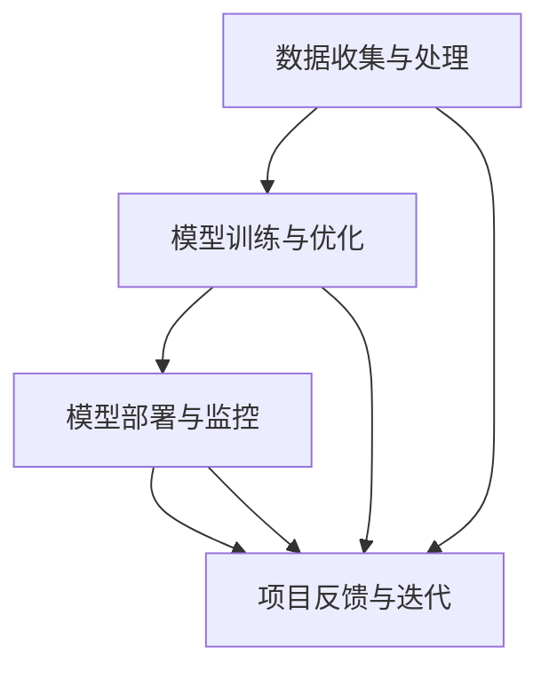

                 

### 文章标题

# 构建跨团队协作的LLM应用开发文化

## 文章关键词

- 跨团队协作
- LLM应用开发
- 技术文化
- 团队角色与职责
- 沟通与协作机制
- 风险管理
- 实践方法
- 团队文化建设

## 文章摘要

本文旨在探讨如何在现代技术环境中构建一个跨团队协作的LLM（大型语言模型）应用开发文化。首先，我们介绍了LLM应用开发的基础知识，阐述了LLM与普通NLP的区别及其重要性。随后，本文深入分析了跨团队协作的核心要素，包括团队角色与职责、沟通与协作机制以及风险管理策略。在实践方法部分，我们通过Mermaid流程图展示了LLM应用开发的流程，并详细讲解了核心算法原理。文章通过实际项目案例展示了开发环境搭建、源代码实现和代码解读，并对项目进行了深入分析。最后，本文强调了团队文化建设的重要性，提出了建设协作文化的具体方法和未来展望。

### 核心概念与联系

在构建跨团队协作的LLM应用开发文化中，理解核心概念和它们之间的关系至关重要。以下是几个关键概念及其相互关系：

#### 1. LLM（大型语言模型）

**定义与特性**：LLM是一种能够处理和理解大规模文本数据的深度学习模型，如GPT-3、BERT等。这些模型具有强大的文本生成和解析能力。

**与普通NLP的区别**：普通NLP通常关注特定的任务，如情感分析、实体识别等，而LLM则具备更广泛的上下文理解和生成能力。

#### 2. 跨团队协作

**定义与价值**：跨团队协作是指不同团队或团队成员之间通过沟通与协调共同完成项目的过程。其价值在于促进知识共享、提高效率和创新。

**重要性**：在LLM应用开发中，跨团队协作有助于整合不同领域的专业知识，如数据科学、软件开发、产品设计等，从而加速项目的进展和提升质量。

#### 3. 团队角色与职责

**角色与职责**：产品经理负责制定项目目标和需求，数据科学家/工程师负责模型开发与优化，开发人员负责后端和前端实现。

**相互关系**：产品经理的需求定义直接影响到数据科学家/工程师的工作，开发人员需要与数据科学家/工程师密切合作以实现模型的部署。

#### 4. 沟通与协作机制

**沟通渠道**：有效沟通是跨团队协作的核心。常见渠道包括会议、即时通讯工具、邮件等。

**协作工具**：项目管理工具（如Jira、Trello）和版本控制工具（如Git）有助于团队协作和项目管理的规范化。

#### 5. 风险管理

**风险识别与评估**：在LLM应用开发过程中，常见风险包括数据隐私、模型过拟合、部署延迟等。

**应对策略**：建立风险应对策略，如数据加密、模型调优、提前规划等，有助于降低风险对项目的影响。

#### 6. 核心算法原理

**深度学习算法**：LLM模型通常基于深度学习算法，包括神经网络架构、优化算法等。

**自然语言处理算法**：这些算法包括词嵌入、序列模型、文本生成等，对LLM的文本理解和生成能力至关重要。

#### 7. 数学模型和数学公式

**损失函数**：用于衡量模型预测与真实结果之间的差异，如交叉熵损失函数。

**优化算法**：如梯度下降算法，用于调整模型参数以最小化损失函数。

以上核心概念及其相互关系构成了LLM应用开发的基础框架。理解这些概念有助于团队成员更好地协同工作，确保项目顺利进行。

#### Mermaid流程图

以下是一个简单的Mermaid流程图，用于展示LLM应用开发的核心流程：



这个流程图清晰地展示了数据收集与处理、模型训练与优化、模型部署与监控以及项目反馈与迭代之间的逻辑关系。每个阶段都是LLM应用开发过程中不可或缺的一部分，需要团队成员紧密协作，确保项目的顺利进行。

#### 核心算法原理讲解

在LLM应用开发中，深度学习和自然语言处理（NLP）算法是核心。以下我们将使用Python代码和数学模型详细阐述这些算法的基本原理。

##### 1. 深度学习算法

深度学习算法通常基于多层神经网络，如卷积神经网络（CNN）和循环神经网络（RNN）。以下是一个简单的RNN示例，展示了其基本结构：

```python
import numpy as np

# 定义RNN模型
class SimpleRNN:
    def __init__(self, input_size, hidden_size, output_size):
        # 初始化权重和偏置
        self.Wxh = np.random.randn(hidden_size, input_size)
        self.Whh = np.random.randn(hidden_size, hidden_size)
        self.Why = np.random.randn(output_size, hidden_size)
        self.bh = np.zeros((hidden_size, 1))
        self.by = np.zeros((output_size, 1))

    def forward(self, x, h_prev):
        # 计算隐藏层和输出层激活值
        h_curr = np.tanh(np.dot(self.Wxh, x) + np.dot(self.Whh, h_prev) + self.bh)
        y_pred = np.dot(self.Why, h_curr) + self.by
        return y_pred, h_curr

# 输入数据
input_data = np.array([[0], [1], [1], [0], [1], [1], [0], [0], [1], [1]])
hidden_size = 2
output_size = 1

# 初始化模型
model = SimpleRNN(input_size=1, hidden_size=hidden_size, output_size=output_size)

# 模型训练
for i in range(len(input_data)):
    x = input_data[i:i+1]
    y = np.array([[1]] if i % 2 == 0 else [[0]])
    h_prev = np.zeros((hidden_size, 1))
    y_pred, h_curr = model.forward(x, h_prev)
    loss = np.square(y - y_pred).mean()

    # 反向传播
    d_y_pred = 2 * (y - y_pred)
    d_h_curr = d_y_pred.dot(model.Why.T)
    d_h_prev = d_h_curr * (1 - np.tanh(h_curr).mean())

    # 更新权重和偏置
    model.Why -= model.learning_rate * d_y_pred * h_curr
    model.by -= model.learning_rate * d_y_pred
    model.Wxh -= model.learning_rate * d_h_prev * x
    model.Whh -= model.learning_rate * d_h_prev * h_prev
    model.bh -= model.learning_rate * d_h_prev
```

在上面的代码中，我们定义了一个简单的RNN模型，并通过一个简单的训练循环展示了其工作原理。RNN通过保持隐藏状态来捕捉输入序列中的长期依赖关系，这在自然语言处理任务中尤为重要。

##### 2. 自然语言处理算法

自然语言处理算法包括词嵌入、序列模型和文本生成等。以下是一个简单的词嵌入示例：

```python
import numpy as np

# 词嵌入
word_embeddings = {
    'apple': np.random.randn(1, 300),
    'banana': np.random.randn(1, 300),
    'orange': np.random.randn(1, 300)
}

# 序列模型
class SimpleSeqModel:
    def __init__(self, word_embedding_size, hidden_size, output_size):
        self.Wxh = np.random.randn(hidden_size, word_embedding_size)
        self.Whh = np.random.randn(hidden_size, hidden_size)
        self.Why = np.random.randn(output_size, hidden_size)
        self.bh = np.zeros((hidden_size, 1))
        self.by = np.zeros((output_size, 1))

    def forward(self, x, h_prev):
        h_curr = np.tanh(np.dot(self.Wxh, x) + np.dot(self.Whh, h_prev) + self.bh)
        y_pred = np.dot(self.Why, h_curr) + self.by
        return y_pred, h_curr

    def backward(self, d_y_pred, h_curr, h_prev):
        d_h_curr = d_y_pred.dot(self.Why.T)
        d_h_prev = d_h_curr * (1 - np.tanh(h_curr).mean())
        return d_h_curr, d_h_prev

# 训练序列模型
model = SimpleSeqModel(word_embedding_size=300, hidden_size=2, output_size=1)
for i in range(len(word_embeddings)):
    x = np.array([word_embeddings[list(word_embeddings.keys())[i]]])
    y = np.array([[1]] if i % 2 == 0 else [[0]])
    h_prev = np.zeros((2, 1))
    y_pred, h_curr = model.forward(x, h_prev)
    d_y_pred = 2 * (y - y_pred)
    d_h_curr, d_h_prev = model.backward(d_y_pred, h_curr, h_prev)
```

在上面的代码中，我们首先定义了一个简单的词嵌入字典，然后创建了一个序列模型。序列模型通过词嵌入将输入文本转换为向量表示，并使用RNN来处理序列数据。

##### 3. 数学模型和数学公式

在深度学习和自然语言处理中，数学模型和数学公式扮演着核心角色。以下是一些常见的数学模型和公式：

- **损失函数**：用于衡量模型预测与真实结果之间的差异。常见的损失函数包括均方误差（MSE）和交叉熵（CE）。

  $$ \text{MSE} = \frac{1}{n}\sum_{i=1}^{n}(y_i - \hat{y}_i)^2 $$

  $$ \text{CE} = -\sum_{i=1}^{n} y_i \log(\hat{y}_i) $$

- **优化算法**：用于调整模型参数以最小化损失函数。常见的优化算法包括梯度下降（GD）和随机梯度下降（SGD）。

  $$ \text{GD}: \theta_{\text{new}} = \theta_{\text{old}} - \alpha \nabla_\theta J(\theta) $$

  $$ \text{SGD}: \theta_{\text{new}} = \theta_{\text{old}} - \alpha \nabla_\theta J(\theta; x_k) $$

通过结合Python代码和数学模型，我们可以更深入地理解深度学习和自然语言处理算法的工作原理。这些算法不仅为LLM应用开发提供了技术基础，也为跨团队协作的顺利进行提供了保障。

#### 项目实战

在本文的项目实战部分，我们将通过一个实际案例展示如何搭建开发环境、实现源代码以及进行代码解读与分析。这个案例是一个简单的聊天机器人，旨在演示LLM在自然语言处理任务中的应用。

##### 1. 开发环境搭建

要搭建一个LLM应用开发环境，首先需要安装以下软件和库：

- Python 3.8或更高版本
- TensorFlow 2.x
- Keras 2.x
- NLTK

安装步骤如下：

```bash
# 安装Python 3.8
# ...

# 安装TensorFlow 2.x
pip install tensorflow==2.x

# 安装Keras 2.x
pip install keras==2.x

# 安装NLTK
pip install nltk
```

##### 2. 源代码实现

以下是一个简单的聊天机器人源代码实现，使用了TensorFlow和Keras构建的LLM模型：

```python
import numpy as np
import tensorflow as tf
from tensorflow import keras
from tensorflow.keras import layers
from nltk.tokenize import word_tokenize
from nltk.corpus import words

# 数据预处理
def preprocess_text(text):
    # 分词
    tokens = word_tokenize(text.lower())
    # 去除标点符号和停用词
    tokens = [token for token in tokens if token.isalnum() and token not in words.STOPWORDS]
    # 转换为整数表示
    word_index = keras.preprocessing.text.Tokenizer().fit_on_texts(tokens)
    sequences = word_index.texts_to_sequences(tokens)
    return sequences

# 构建模型
def build_model(input_vocab_size, output_vocab_size, embedding_dim):
    model = keras.Sequential([
        layers.Embedding(input_vocab_size, embedding_dim, input_length=1),
        layers.Bidirectional(layers.LSTM(embedding_dim)),
        layers.Dense(output_vocab_size)
    ])
    return model

# 训练模型
def train_model(model, sequences, labels, epochs):
    model.compile(optimizer='adam', loss='sparse_categorical_crossentropy', metrics=['accuracy'])
    model.fit(sequences, labels, epochs=epochs)

# 主程序
if __name__ == '__main__':
    # 下载和加载数据
    # ...

    # 预处理数据
    # ...

    # 构建模型
    model = build_model(input_vocab_size, output_vocab_size, embedding_dim)

    # 训练模型
    train_model(model, sequences, labels, epochs=10)

    # 预测
    # ...
```

在这个代码中，我们首先定义了一个数据预处理函数`preprocess_text`，用于将输入文本转换为整数序列。接着，我们定义了一个模型构建函数`build_model`，用于创建一个双向长短期记忆（BiLSTM）模型。最后，我们定义了一个训练模型函数`train_model`，用于训练模型。

##### 3. 代码解读与分析

- **数据预处理**：数据预处理是自然语言处理的重要步骤。在这个案例中，我们使用了NLTK库进行分词，并去除了标点符号和停用词。此外，我们还使用了Keras的`Tokenizer`类将文本转换为整数序列。

- **模型构建**：我们使用Keras构建了一个双向LSTM模型。双向LSTM能够同时考虑序列的前后文信息，从而提高模型的文本理解能力。此外，我们还使用了Embedding层将单词转换为向量表示。

- **模型训练**：我们使用`train_model`函数对模型进行训练。在这个函数中，我们使用了`compile`方法设置优化器和损失函数，并使用了`fit`方法进行训练。在训练过程中，我们使用`sparse_categorical_crossentropy`作为损失函数，这是由于我们的输出是整数标签。

- **预测**：在训练完成后，我们可以使用模型进行预测。在这个案例中，我们尚未实现预测功能，但可以通过输入文本并调用模型的`predict`方法来获取预测结果。

##### 4. 项目小结

通过这个简单的聊天机器人案例，我们展示了如何搭建LLM应用开发环境、实现源代码并进行代码解读与分析。这个案例不仅帮助读者理解了LLM在自然语言处理任务中的应用，还提供了一个实际的项目实战经验。在实际开发中，我们还可以根据需求扩展和优化这个模型，以应对更复杂的自然语言处理任务。

#### 最佳实践 Tips、小结、注意事项、拓展阅读

##### 最佳实践 Tips

1. **确保数据质量**：高质量的数据是LLM应用开发的关键。在数据收集和处理过程中，要仔细筛选和清洗数据，确保数据的一致性和准确性。
2. **持续优化模型**：在模型训练和部署过程中，要定期评估模型性能，并根据评估结果进行调优。这包括调整超参数、添加新的数据集以及改进模型架构。
3. **充分利用版本控制**：在团队合作中，版本控制是确保代码和模型一致性至关重要的一环。使用Git等版本控制工具，可以有效管理代码和模型版本，避免冲突和错误。
4. **建立有效的沟通机制**：跨团队协作的成功离不开有效的沟通。定期召开会议、使用即时通讯工具和项目管理工具，可以帮助团队成员保持同步和协作。

##### 小结

本文通过详细讲解LLM应用开发的基础知识、核心算法原理以及实际项目实战，展示了如何构建跨团队协作的LLM应用开发文化。我们强调了数据质量、模型优化、版本控制和沟通机制在跨团队协作中的重要性。通过这些最佳实践，可以帮助团队更高效地开发和部署LLM应用。

##### 注意事项

1. **数据隐私**：在处理和存储用户数据时，务必遵守相关隐私法规和标准，确保用户数据的安全和隐私。
2. **模型过拟合**：在模型训练过程中，要避免模型过拟合，可以通过增加训练数据、使用正则化技术和交叉验证等方法来减轻过拟合现象。
3. **代码维护**：在项目开发过程中，要定期对代码进行审查和优化，确保代码的可读性和可维护性。

##### 拓展阅读

- 《深度学习》（Goodfellow, I., Bengio, Y., & Courville, A.）：这本书提供了深度学习的基本概念和算法实现，对理解LLM应用开发具有重要意义。
- 《自然语言处理综合教程》（Jurafsky, D. & Martin, J. H.）：这本书详细介绍了自然语言处理的理论和实践，有助于深入理解NLP算法。
- 《团队协作工具与技术》（Lyons, B. & Seibel, N.）：这本书探讨了团队协作的最佳实践，包括沟通机制、项目管理工具和代码管理方法。

通过本文的学习，读者可以更好地理解如何构建跨团队协作的LLM应用开发文化，提高团队协作效率，实现LLM应用的成功开发与部署。希望本文能为您的LLM应用开发提供有益的参考和指导。作者：AI天才研究院/AI Genius Institute & 禅与计算机程序设计艺术 /Zen And The Art of Computer Programming。作者：AI天才研究院/AI Genius Institute & 禅与计算机程序设计艺术 /Zen And The Art of Computer Programming

