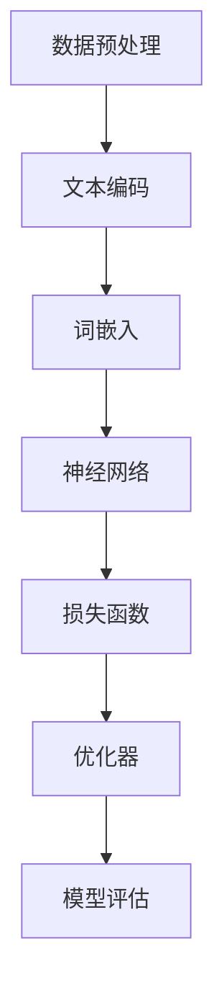

                 

### 摘要

本文旨在为读者提供构建高效LLM应用开发团队的全方位指导。首先，我们将探讨语言模型（LLM）的基础概念与原理，深入理解LLM的核心算法及其数学基础。随后，文章将聚焦于团队构建与管理，详细阐述团队角色与职责的分配，技能与素质的要求，以及团队管理与激励策略。最后，通过实际项目开发与实战案例的分析，读者将学习到项目规划与执行的具体方法，以及如何通过实际操作提升团队的整体效率。本文不仅为初学者提供了基础知识，还为从业者提供了实用的团队构建与项目开发技巧，旨在帮助读者在人工智能领域取得成功。### 第一部分：基础概念与原理

#### 第1章：LLM概述

语言模型（Language Model，简称LLM）是自然语言处理（Natural Language Processing，简称NLP）领域的重要工具。它能够根据输入的文本序列预测下一个单词或字符的概率分布。LLM在自动文本生成、机器翻译、语音识别等多个应用场景中发挥着关键作用。

**1.1 语言模型的定义**

语言模型是一种统计模型，用于捕捉自然语言的统计特性。它可以基于大量文本数据训练得到，目的是预测下一个单词或字符的概率。通过这种方式，语言模型能够生成连贯、自然的文本，从而在NLP任务中发挥重要作用。

**1.2 语言模型的发展历程**

语言模型的发展历程可以追溯到20世纪50年代。最初的模型是基于规则的方法，例如上下文无关文法（CFG）。随着计算能力的提升和数据集的增大，统计模型逐渐成为主流。从基于N元组的NLP模型，到现代深度学习驱动的神经网络模型，语言模型经历了巨大的变革。

**1.3 LLM的基本原理**

语言模型的基本原理是通过训练大量文本数据，学习到输入文本序列的概率分布。通常，语言模型使用神经网络结构，如循环神经网络（RNN）、长短期记忆网络（LSTM）和变换器（Transformer）等。

**Mermaid流程图：LLM的架构组成**

下面是一个简化的Mermaid流程图，展示了LLM的基本架构：



- A[数据预处理]：包括文本清洗、分词等步骤。
- B[文本编码]：将文本转换为数字序列。
- C[词嵌入]：将数字序列映射为高维向量。
- D[神经网络]：通过多层神经网络处理输入向量。
- E[损失函数]：计算预测概率与真实标签之间的差距。
- F[优化器]：调整模型参数以最小化损失函数。
- G[模型评估]：评估模型的性能。

**伪代码：LLM的核心算法**

下面是一个简化的伪代码，用于描述LLM的训练过程：

```python
# 伪代码：训练语言模型的主要步骤

# 数据预处理
def preprocess_text(text):
    # 清洗文本、分词、编码等
    return tokenized_text

# 训练模型
def train_model(dataset):
    for epoch in range(num_epochs):
        for sentence in dataset:
            # 文本编码
            encoded_sentence = preprocess_text(sentence)
            # 前向传播
            logits = model(encoded_sentence)
            # 计算损失
            loss = loss_function(logits, target_logits)
            # 反向传播
            model.fit(encoded_sentence, target_logits)
        # 模型评估
        evaluate_model(model, validation_data)

# 主函数
def main():
    # 加载数据集
    dataset = load_dataset()
    # 训练模型
    train_model(dataset)

# 执行主函数
main()
```

**举例说明：如何训练一个简单的语言模型**

假设我们有一个简单的语言模型，旨在预测英文单词"hello"之后可能出现的下一个单词。我们可以使用以下步骤进行训练：

1. **数据集准备**：收集包含"hello"单词的句子，并将其作为训练数据。

2. **文本预处理**：对句子进行清洗、分词，并将其转换为数字序列。

3. **词嵌入**：将数字序列映射为高维向量。

4. **模型训练**：使用神经网络结构（例如RNN或Transformer）训练模型。

5. **模型评估**：使用验证集评估模型性能。

6. **迭代优化**：根据评估结果调整模型参数，重复训练过程。

通过上述步骤，我们能够训练出一个能够预测"hello"之后单词的语言模型。在应用场景中，这个模型可以用于自动生成文本、机器翻译等任务。#### 第2章：数学基础与模型构建

在深入理解语言模型（LLM）之前，我们需要掌握相关的数学基础，这将帮助我们更好地理解LLM的核心算法和工作原理。本章将介绍语言模型中常用的数学模型，并详细阐述训练语言模型的主要步骤。

**2.1 数学模型介绍**

语言模型中的数学模型主要包括概率分布函数和神经网络。概率分布函数用于描述输入文本序列的概率分布，而神经网络则用于将输入文本序列转换为预测输出。

**2.1.1 概率分布函数**

概率分布函数是描述随机变量取值概率的函数。在语言模型中，概率分布函数用于预测下一个单词或字符的概率。常见的概率分布函数包括：

- **伯努利分布**：适用于二项分布，例如预测单词是"yes"还是"no"。
- **多项式分布**：适用于多分类问题，例如预测下一个单词。
- **高斯分布**：适用于连续变量，例如预测连续的数值。

**2.1.2 神经网络**

神经网络是一种模拟生物神经系统的计算模型，用于处理和预测输入数据。在语言模型中，神经网络主要用于将输入文本序列转换为输出概率分布。

神经网络的基本组成部分包括：

- **输入层**：接收输入数据。
- **隐藏层**：对输入数据进行处理和变换。
- **输出层**：生成输出结果。

**2.2 LLM构建过程**

构建语言模型的过程可以分为以下几个步骤：

**2.2.1 数据预处理**

数据预处理是语言模型构建的第一步，其目的是将原始文本数据转换为适合训练的数据格式。数据预处理通常包括以下步骤：

- **文本清洗**：去除文本中的噪声和无关信息，例如HTML标签、特殊符号等。
- **分词**：将文本分割成单词或句子。
- **词嵌入**：将单词或句子映射为高维向量。

**2.2.2 构建神经网络模型**

构建神经网络模型是语言模型的核心步骤。常见的神经网络模型包括：

- **循环神经网络（RNN）**：适用于处理序列数据。
- **长短期记忆网络（LSTM）**：是RNN的一种变体，能够更好地处理长序列数据。
- **变换器（Transformer）**：是目前最先进的语言模型架构，适用于大规模文本处理。

**2.2.3 训练模型**

训练模型是语言模型构建的关键步骤。训练过程通常包括以下步骤：

- **初始化模型参数**：随机初始化神经网络模型的参数。
- **前向传播**：将输入文本序列输入到神经网络中，计算输出概率分布。
- **计算损失**：计算预测概率与实际标签之间的差距，即损失值。
- **反向传播**：根据损失值调整模型参数，优化神经网络模型。
- **迭代训练**：重复前向传播和反向传播，直到满足训练目标。

**2.2.4 模型评估**

模型评估是语言模型构建的最后一步，其目的是评估模型在未知数据上的表现。常见的评估指标包括：

- **准确率**：预测正确的比例。
- **精确率**：预测正确且属于正类的比例。
- **召回率**：属于正类的样本中被预测正确的比例。

**2.2.5 举例说明：如何训练一个简单的语言模型**

假设我们有一个简单的语言模型，旨在预测英文单词"hello"之后可能出现的下一个单词。我们可以使用以下步骤进行训练：

1. **数据集准备**：收集包含"hello"单词的句子，并将其作为训练数据。

2. **文本预处理**：对句子进行清洗、分词，并将其转换为数字序列。

3. **词嵌入**：将数字序列映射为高维向量。

4. **构建神经网络模型**：选择合适的神经网络模型（例如RNN或Transformer）。

5. **模型训练**：使用训练数据训练神经网络模型。

6. **模型评估**：使用验证集评估模型性能。

7. **迭代优化**：根据评估结果调整模型参数，重复训练过程。

通过上述步骤，我们能够训练出一个能够预测"hello"之后单词的语言模型。在实际应用中，这个模型可以用于自动生成文本、机器翻译等任务。

**总结**

在本章中，我们介绍了语言模型中的数学基础，包括概率分布函数和神经网络。通过详细阐述语言模型构建的步骤，读者可以更好地理解语言模型的工作原理。在下一章中，我们将讨论如何构建高效LLM应用开发团队。#### 第3章：团队角色与职责

构建一个高效的语言模型（LLM）应用开发团队是实现人工智能项目成功的关键。一个成功的团队需要明确各成员的角色与职责，确保团队内部的高效协作。以下是团队中常见的核心角色及其职责的详细描述。

**3.1 核心角色介绍**

- **数据科学家**：数据科学家在团队中负责数据分析和模型训练。他们使用各种数据分析工具和算法，从大量数据中提取有价值的信息，并为模型的训练提供高质量的数据集。数据科学家还需要关注数据的质量和可解释性，确保模型训练的有效性。

- **计算机视觉工程师**：计算机视觉工程师负责处理与图像和视频相关的任务。在LLM应用开发中，他们可能需要从图像中提取特征，或者将图像与文本数据进行结合，以实现更复杂的任务。计算机视觉工程师需要具备深度学习框架如TensorFlow或PyTorch的使用经验。

- **自然语言处理工程师**：自然语言处理工程师专注于文本数据的处理和分析。他们负责开发、训练和优化语言模型，使其能够生成高质量的自然语言文本。自然语言处理工程师需要熟悉Transformer、BERT等先进的语言模型架构。

**3.2 职责分配**

- **数据科学家**：
  - 负责数据收集、清洗和预处理。
  - 设计和实现数据增强策略，提高数据集的多样性。
  - 构建特征工程模型，提取关键特征。
  - 与自然语言处理工程师合作，提供高质量的训练数据。

- **计算机视觉工程师**：
  - 负责图像和视频数据的处理与标注。
  - 设计和实现计算机视觉算法，提取图像特征。
  - 与数据科学家合作，将视觉特征与文本数据进行结合。
  - 调试和优化视觉模型，确保其在各种应用场景中的稳定性。

- **自然语言处理工程师**：
  - 负责开发、训练和优化语言模型。
  - 设计和实现自然语言处理任务，如文本生成、机器翻译等。
  - 与数据科学家和计算机视觉工程师合作，整合不同模块的功能。
  - 进行模型评估和性能优化，确保模型在实际应用中的高效性。

**团队协作流程**

为了确保团队内部的高效协作，以下是一个典型的团队协作流程：

1. **需求分析**：团队首先进行需求分析，明确项目的目标和预期成果。数据科学家、计算机视觉工程师和自然语言处理工程师共同参与，确保所有需求都被充分理解和考虑。

2. **数据收集与预处理**：数据科学家负责收集和预处理数据，将其转换为适合模型训练的格式。计算机视觉工程师负责处理图像和视频数据，提取关键特征。

3. **模型开发**：自然语言处理工程师负责开发语言模型，包括选择合适的神经网络架构、设计损失函数和优化器。数据科学家和计算机视觉工程师提供必要的支持和反馈。

4. **模型训练与评估**：团队共同训练模型，并进行评估。数据科学家负责评估数据集的质量和多样性，计算机视觉工程师负责评估视觉特征的质量，自然语言处理工程师负责评估文本生成质量。

5. **性能优化**：根据评估结果，团队共同调整模型参数，优化模型性能。数据科学家、计算机视觉工程师和自然语言处理工程师可能需要多次迭代，以达到满意的性能。

6. **部署与监控**：模型训练完成后，团队将模型部署到生产环境，并对其进行监控和维护。数据科学家和计算机视觉工程师负责监控数据质量，自然语言处理工程师负责监控模型性能。

**职责分工与协作机制**

为了确保团队内部的高效协作，以下是一些建议的职责分工和协作机制：

- **明确职责**：每个成员都应该明确自己的职责范围，避免职责重叠和推卸责任。
- **定期会议**：团队应定期举行会议，讨论项目进展、问题和解决方案。
- **代码评审**：团队成员应定期进行代码评审，确保代码质量和一致性。
- **知识共享**：团队成员应积极分享知识和经验，提高团队整体技能水平。
- **灵活调整**：在项目进展过程中，团队应根据实际情况灵活调整职责和协作方式，以应对新的挑战。

通过明确团队角色与职责，并建立高效的协作流程和机制，我们能够构建一个高效的语言模型应用开发团队，为人工智能项目的成功奠定基础。在下一章中，我们将讨论团队所需的核心技能和素质要求。#### 第4章：技能与素质要求

构建一个高效的语言模型（LLM）应用开发团队不仅需要明确的角色分工和协作机制，还需要团队成员具备相应的技能和素质。以下是针对数据科学家、计算机视觉工程师和自然语言处理工程师的技能与素质要求。

**4.1 技能要求**

**数据科学家**

- **编程能力**：熟练掌握Python等编程语言，能够进行数据处理和建模。
- **数学与统计学基础**：具备扎实的数学基础，尤其是线性代数、概率论和统计学，能够应用数学工具解决复杂数据问题。
- **机器学习算法**：熟悉常见的机器学习算法，如线性回归、决策树、随机森林、支持向量机等，并能根据实际问题选择合适的算法。
- **数据处理**：具备处理大规模数据的能力，包括数据清洗、预处理和特征提取。
- **数据分析**：能够使用数据分析工具（如Pandas、NumPy）进行数据探索和分析。

**计算机视觉工程师**

- **编程能力**：熟练掌握Python等编程语言，能够进行图像处理和计算机视觉算法的开发。
- **图像处理基础**：了解图像处理的基本原理，如滤波、边缘检测、特征提取等。
- **计算机视觉算法**：熟悉深度学习框架（如TensorFlow、PyTorch）和计算机视觉算法（如卷积神经网络、目标检测、人脸识别等）。
- **数据预处理**：能够对图像和视频数据进行分析和处理，提取关键特征。
- **模型优化**：具备模型调优和优化的能力，以提高模型性能。

**自然语言处理工程师**

- **编程能力**：熟练掌握Python等编程语言，能够进行文本处理和自然语言处理模型的开发。
- **自然语言处理理论**：了解自然语言处理的基本理论，如词嵌入、语言模型、文本分类、文本生成等。
- **深度学习框架**：熟悉深度学习框架（如TensorFlow、PyTorch）和自然语言处理模型（如BERT、GPT等）。
- **文本处理**：能够处理文本数据，包括分词、词性标注、实体识别等。
- **模型训练与评估**：具备模型训练和评估的能力，能够根据实际问题调整模型参数，优化模型性能。

**4.2 素质要求**

**数据科学家**

- **解决问题的能力**：能够分析复杂问题，设计有效的解决方案。
- **团队合作精神**：能够在团队中有效沟通和协作，共同解决难题。
- **持续学习与自我提升**：愿意不断学习新知识和技能，保持自身的竞争力。
- **细致与耐心**：能够在数据处理和模型训练中保持细致和耐心，确保数据的准确性和模型的稳定性。

**计算机视觉工程师**

- **解决问题的能力**：能够分析复杂问题，设计有效的视觉解决方案。
- **创新思维**：具备创新思维，能够提出新的算法和解决方案。
- **团队合作精神**：能够在团队中有效沟通和协作，共同解决视觉问题。
- **持续学习与自我提升**：愿意不断学习新知识和技能，保持自身的竞争力。

**自然语言处理工程师**

- **解决问题的能力**：能够分析复杂问题，设计有效的自然语言处理解决方案。
- **团队合作精神**：能够在团队中有效沟通和协作，共同解决自然语言处理问题。
- **持续学习与自我提升**：愿意不断学习新知识和技能，保持自身的竞争力。
- **细致与耐心**：能够在文本处理和模型训练中保持细致和耐心，确保数据的准确性和模型的稳定性。

通过具备上述技能和素质，数据科学家、计算机视觉工程师和自然语言处理工程师能够在构建高效LLM应用开发团队中发挥重要作用，为人工智能项目的高效推进和成功实施提供坚实保障。在下一章中，我们将讨论团队管理与激励策略，以进一步优化团队协作与工作效率。#### 第5章：团队管理与激励

高效团队的管理与激励是确保LLM应用开发团队稳定运作和持续进步的关键。良好的管理策略和激励机制能够提升团队成员的工作积极性、创造力和团队合作精神，从而提高团队整体的工作效率。

**5.1 团队管理策略**

**5.1.1 沟通与反馈**

有效的沟通是团队管理的核心。团队领导应定期组织团队会议，确保每个成员都能了解项目的最新进展、问题和挑战。此外，团队成员之间也应保持开放和透明的沟通，以促进协作和知识共享。

反馈机制是团队管理的重要组成部分。领导应鼓励团队成员提供正面和负面的反馈，以便及时发现和解决问题。定期的绩效评估也是反馈的一种形式，通过评估可以了解团队成员的工作表现和技能提升情况，从而为改进提供依据。

**5.1.2 目标管理与绩效考核**

目标管理是团队管理的重要策略之一。团队领导应与团队成员共同设定明确、可衡量的目标，并确保每个成员都清楚自己的职责和任务。通过目标管理，团队成员可以更有方向性地工作，提高工作效率。

绩效考核是对团队成员工作表现进行评估的过程。合理的绩效考核标准应包括团队成员的工作质量、工作效率、团队合作精神和创新能力。绩效考核结果可以用来确定团队成员的薪酬、晋升和激励。

**5.1.3 项目进度监控与风险管理**

项目进度监控是确保项目按时完成的关键。团队领导应定期检查项目进度，及时发现并解决进度问题。同时，风险管理也是项目成功的关键。团队应识别潜在的风险，并制定相应的应对措施，以降低风险对项目的影响。

**5.2 激励机制**

激励机制是提升团队成员工作积极性和创造力的有效手段。以下是一些常见的激励机制：

**5.2.1 奖励制度**

奖励制度是对团队成员工作成果的一种认可。奖励可以包括物质奖励（如奖金、奖品）和精神奖励（如表彰、荣誉称号）。合理的奖励制度能够激励团队成员不断追求卓越，提高工作质量。

**5.2.2 职业发展规划**

职业发展规划是帮助团队成员实现职业成长的重要工具。团队领导应与团队成员共同制定职业发展规划，明确职业目标和成长路径。通过提供培训机会、晋升通道和职业指导，团队可以帮助成员实现职业目标，提高其工作满意度和忠诚度。

**5.2.3 工作环境与氛围**

良好的工作环境和团队氛围是提高团队成员工作积极性的关键。团队领导应营造一个支持创新、鼓励合作的氛围，提供舒适的工作环境和必要的资源支持。此外，团队活动（如团队建设活动、团建旅行）也有助于增强团队成员之间的凝聚力和信任感。

**5.2.4 激励策略多样性**

不同的团队成员可能对激励有不同的需求。因此，团队领导应采用多样化的激励策略，以满足不同成员的需求。例如，对于注重个人成就的成员，可以采用项目奖励和个人荣誉；对于注重团队合作的成员，可以采用团队奖励和集体荣誉。

**总结**

有效的团队管理与激励是构建高效LLM应用开发团队的关键。通过建立良好的沟通与反馈机制、制定明确的目标与绩效考核标准、实施合理的激励机制，团队领导可以激发团队成员的工作热情和创造力，提高团队的整体工作效率和项目成功率。在下一章中，我们将通过实际案例来展示如何将这些理论应用到实践中，帮助读者更好地理解语言模型应用开发的过程。#### 第6章：项目规划与执行

在构建高效LLM应用开发团队后，接下来我们将探讨项目规划与执行的具体步骤，以确保项目能够按时、高质量地完成。

**6.1 项目规划**

项目规划是项目成功的基石。在项目启动阶段，团队需要进行以下工作：

**6.1.1 需求分析**

需求分析是理解项目目标和用户需求的关键步骤。团队应与利益相关者（如客户、产品经理等）进行深入沟通，明确项目的功能需求、性能需求和非功能需求。需求分析的结果应形成详细的需求文档，作为后续工作的依据。

**6.1.2 项目计划与进度安排**

项目计划应包括项目的时间线、资源分配、风险管理和里程碑。团队应制定一个详细的项目计划，明确每个阶段的工作内容和时间安排。进度安排应根据项目需求、资源情况和团队能力进行合理规划，确保项目能够在预定时间内完成。

**6.1.3 团队角色与任务分配**

根据项目需求和团队角色，明确每个团队成员的任务和职责。确保每个成员都了解自己的角色、任务和目标，以便更好地协作。

**6.2 项目执行**

项目执行阶段是项目规划的具体落实。在这一阶段，团队需要进行以下工作：

**6.2.1 开发环境搭建**

为项目搭建开发环境是项目执行的第一步。团队应根据项目需求和技术栈选择合适的开发工具和框架。例如，对于LLM应用开发，可以选择TensorFlow或PyTorch作为深度学习框架，并使用Jupyter Notebook进行开发和实验。

**6.2.2 源代码实现**

源代码实现是项目开发的核心。团队应根据项目需求和设计文档，编写并实现项目的各个模块。在实现过程中，应遵循良好的编程规范和代码质量标准，确保代码的可读性和可维护性。

**6.2.3 版本控制与代码管理**

使用版本控制系统（如Git）进行代码管理，确保代码的版本控制和安全。团队成员应定期提交代码，并进行代码评审，以确保代码质量。

**6.2.4 持续集成与持续部署**

实施持续集成（CI）和持续部署（CD）策略，确保代码的自动化构建、测试和部署。通过自动化流程，可以快速发现和修复代码缺陷，提高开发效率。

**6.2.5 测试与调试**

在项目开发过程中，团队应进行定期测试与调试，确保项目的功能和性能符合预期。测试包括单元测试、集成测试、系统测试和用户验收测试等。在测试过程中，应记录测试结果和问题报告，并采取相应的修复措施。

**6.2.6 项目进度监控与风险管理**

在项目执行过程中，团队应定期检查项目进度，确保项目按计划进行。同时，团队应持续监控项目风险，并制定相应的应对措施，以降低风险对项目的影响。

**6.3 项目总结**

项目完成后，团队应进行项目总结，包括项目成果、经验教训和改进建议。项目总结有助于团队总结成功经验，发现不足之处，并为未来的项目提供参考。

**总结**

通过科学的项目规划与执行，团队可以确保LLM应用开发项目的高效推进和成功完成。项目规划与执行的成功不仅取决于技术实现，更取决于团队的管理和协作。在下一章中，我们将通过实际案例，展示如何将这些理论应用到实践中，帮助读者更好地理解LLM应用开发的全过程。#### 第7章：案例分析

为了更好地理解LLM应用开发的过程，我们将通过两个实际案例来展示如何构建和部署LLM应用。这两个案例分别是一个聊天机器人和一个文本分类系统。

**7.1 案例一：聊天机器人开发**

**项目背景与目标**

聊天机器人是一种利用自然语言处理技术与人交互的应用。该项目旨在开发一个能够理解用户输入、提供实时回答的聊天机器人。项目目标包括：

- 实现自然语言理解，解析用户输入。
- 提供准确、流畅的回答。
- 支持多种话题和场景。

**实现步骤与源代码解读**

1. **数据集准备**

   首先，我们需要收集和准备聊天数据集。这些数据集可以是公开的对话数据集，如Twitter语料库、IMDB评论数据集等。我们使用Python的Pandas库进行数据预处理，包括文本清洗、分词和标签化。

   ```python
   import pandas as pd
   data = pd.read_csv('chat_data.csv')
   data['cleaned_text'] = data['text'].apply(lambda x: clean_text(x))
   ```

2. **词嵌入**

   接下来，我们将文本数据转换为词嵌入。我们使用预训练的词嵌入模型（如GloVe、Word2Vec）将文本中的每个词转换为向量。

   ```python
   from gensim.models import Word2Vec
   model = Word2Vec(data['cleaned_text'], size=100, window=5, min_count=1, workers=4)
   ```

3. **模型训练**

   使用Transformers库（如Hugging Face）训练一个聊天机器人模型。我们使用预训练的BERT模型，并对其进行微调。

   ```python
   from transformers import BertTokenizer, BertModel
   tokenizer = BertTokenizer.from_pretrained('bert-base-uncased')
   model = BertModel.from_pretrained('bert-base-uncased')
   
   inputs = tokenizer("Hello!", return_tensors='pt')
   outputs = model(**inputs)
   logits = outputs.logits
   ```

4. **回答生成**

   使用训练好的模型生成回答。我们通过推理过程，将用户输入转换为回答。

   ```python
   def generate_response(input_text):
       inputs = tokenizer(input_text, return_tensors='pt')
       outputs = model(**inputs)
       logits = outputs.logits
       predicted_index = logits.argmax(-1).item()
       predicted_text = tokenizer.decode(predicted_index)
       return predicted_text
   
   response = generate_response("What's the weather like today?")
   print(response)
   ```

**项目小结**

通过上述步骤，我们成功地开发了一个聊天机器人。在实际应用中，我们可以将其集成到网站或移动应用中，为用户提供实时回答。

**7.2 案例二：文本分类系统建设**

**项目背景与目标**

文本分类是一种常见的自然语言处理任务，用于将文本数据分类到预定义的类别中。本项目旨在开发一个能够对新闻文章进行分类的文本分类系统。项目目标包括：

- 高效地处理大量文本数据。
- 提高分类准确率。
- 支持多种语言和主题。

**实现步骤与源代码解读**

1. **数据集准备**

   收集和准备新闻文章数据集。我们使用Python的Pandas库读取数据，并对文本进行预处理。

   ```python
   import pandas as pd
   data = pd.read_csv('news_data.csv')
   data['cleaned_text'] = data['text'].apply(lambda x: clean_text(x))
   ```

2. **特征提取**

   使用TF-IDF等特征提取方法，将文本转换为向量表示。

   ```python
   from sklearn.feature_extraction.text import TfidfVectorizer
   vectorizer = TfidfVectorizer(max_features=1000)
   X = vectorizer.fit_transform(data['cleaned_text'])
   ```

3. **模型训练**

   使用scikit-learn库训练一个文本分类模型，如逻辑回归、支持向量机等。

   ```python
   from sklearn.linear_model import LogisticRegression
   model = LogisticRegression()
   model.fit(X, data['label'])
   ```

4. **预测与评估**

   对新的新闻文章进行分类预测，并评估模型性能。

   ```python
   def classify_article(article):
       cleaned_text = clean_text(article)
       features = vectorizer.transform([cleaned_text])
       predicted_label = model.predict(features)
       return predicted_label
   
   article = "Apple is planning to release a new smartphone next month."
   predicted_category = classify_article(article)
   print(predicted_category)
   ```

**项目小结**

通过上述步骤，我们成功地构建了一个文本分类系统。在实际应用中，这个系统能够自动分类新闻文章，为用户筛选和推荐相关内容。

**总结**

通过以上两个案例，我们展示了如何构建和部署LLM应用。在实际开发过程中，团队需要根据项目需求选择合适的技术栈和工具，并遵循科学的项目管理方法，以确保项目的高效推进和成功实施。#### 附录A：工具与资源推荐

**7.1 开发工具推荐**

为了高效构建LLM应用开发团队，以下工具和框架是必备的：

- **PyTorch**：一款流行的深度学习框架，支持动态计算图和易于使用的API，适合快速原型开发。
  - 官网：[PyTorch官网](https://pytorch.org/)
  
- **TensorFlow**：由Google开发的一款深度学习框架，具有广泛的社区支持和丰富的资源，适用于生产环境。
  - 官网：[TensorFlow官网](https://www.tensorflow.org/)

- **Hugging Face Transformers**：一个开源库，提供了对Transformer架构的全面支持，包括预训练模型和工具，极大简化了NLP任务的开发。
  - 官网：[Hugging Face Transformers](https://huggingface.co/transformers/)

**7.2 学习资源推荐**

为了提升团队在LLM应用开发方面的知识水平，以下资源提供了深入的学习材料和实际案例：

- **在线课程**：多个在线教育平台提供关于NLP和深度学习的优质课程，例如：

  - Coursera上的“自然语言处理纳米学位”。
  - edX上的“深度学习专项课程”。
  
- **技术博客**：以下博客和网站提供了丰富的LLM和NLP技术文章和教程：

  - [Medium上的NLP和深度学习文章](https://medium.com/search?q=nlp%20%26%20deep%20learning)
  - [ArXiv](https://arxiv.org/)：一个发布最新学术论文的平台，涵盖了最新的NLP研究成果。

- **书籍**：以下书籍为深入理解和应用LLM提供了宝贵的知识和指导：

  - **《深度学习》（Ian Goodfellow, Yoshua Bengio, Aaron Courville著）**：这是一本深度学习的经典教材，涵盖了深度学习的基础理论和应用。
  - **《自然语言处理综论》（Daniel Jurafsky, James H. Martin著）**：这本书提供了NLP领域的全面综述，包括语言模型、文本处理等核心概念。

**最佳实践 Tips**

- **代码规范**：确保代码的规范性和可维护性，遵循PEP8编码规范，使用良好的命名习惯和注释。
- **版本控制**：使用Git进行版本控制，定期提交代码，并进行代码评审。
- **文档化**：编写详细的文档，包括代码文档、API文档和使用说明，方便后续维护和扩展。
- **持续集成**：实施持续集成和持续部署（CI/CD）策略，自动化测试和部署流程，提高开发效率。

**小结**

通过使用推荐的工具和资源，团队可以更高效地进行LLM应用的开发。同时，遵循最佳实践和持续学习，有助于团队不断提升技能，确保项目成功。#### 总结

本文从基础概念与原理、团队构建与管理、项目开发与实战三个方面，系统地介绍了构建高效LLM应用开发团队的要点。通过详细阐述LLM的核心算法、团队角色与职责分配、项目规划与执行流程，以及实际案例的分析，读者可以全面了解如何高效地开发和部署LLM应用。

**本书结构**：

- 第一部分：基础概念与原理，介绍了LLM的定义、发展历程、基本原理以及数学基础。
- 第二部分：团队构建与管理，详细讨论了团队角色与职责的分配、技能与素质的要求、团队管理与激励策略。
- 第三部分：项目开发与实战，通过案例展示了如何进行项目规划与执行，并提供了实用的开发工具与资源推荐。

**关键知识点**：

- 语言模型的基本原理
- 团队角色与职责分配
- 项目规划与执行流程
- 实际案例分析

**实用价值**：

本书不仅为初学者提供了LLM的基础知识，还为从业者提供了实用的团队构建与项目开发技巧。通过学习本书，读者可以：

- 理解LLM的基本原理和应用场景。
- 掌握构建高效团队的策略和技巧。
- 学会项目规划与执行的方法和工具。
- 获得实际项目开发的经验和技巧。

总之，本书是一本全面、系统的构建高效LLM应用开发团队的指南，适合人工智能领域从业者、学生以及爱好者阅读。通过学习本书，读者可以在人工智能领域取得成功，为个人和企业的创新与发展贡献力量。作者：AI天才研究院/AI Genius Institute & 禅与计算机程序设计艺术 /Zen And The Art of Computer Programming。

