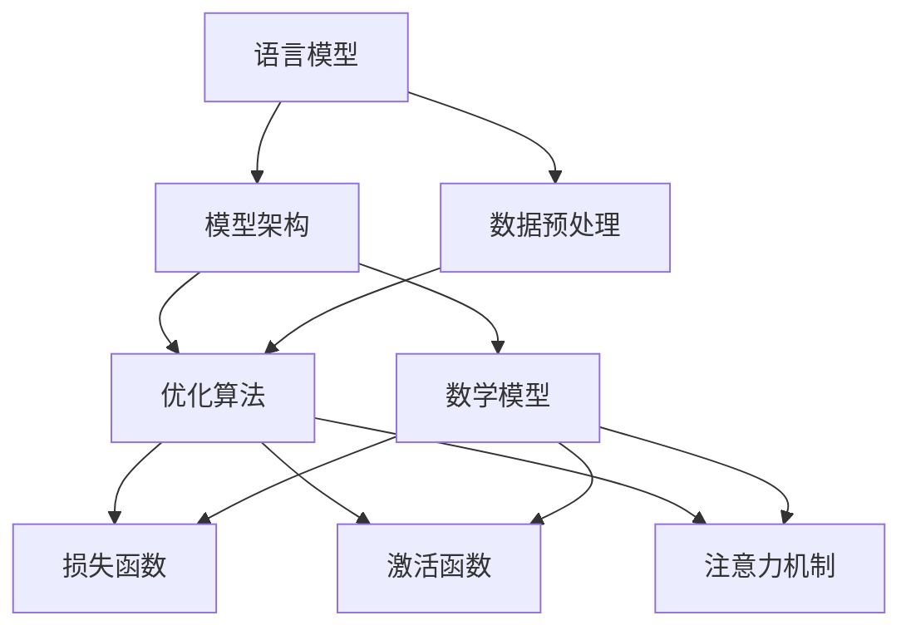

                 

### 背景介绍

构建高效的大型语言模型（LLM）应用开发架构在现代人工智能领域具有重要的意义。随着深度学习和自然语言处理技术的飞速发展，LLM已经在诸如文本生成、机器翻译、问答系统等多个领域展现出了强大的应用潜力。然而，高效的LLM应用开发并非易事，它涉及到复杂的算法设计、大量的数据预处理、精细的模型优化以及稳健的系统架构设计。

LLM的高效性直接影响到应用的性能、响应速度和用户体验。一个高效的LLM架构能够更好地处理大规模数据，降低计算资源的需求，从而提高开发效率和经济效益。此外，高效的应用架构还能够降低开发成本，缩短开发周期，使得更多创新的应用得以快速落地。

本文将深入探讨构建高效LLM应用开发架构的关键策略。首先，我们将介绍LLM应用的开发背景和意义，明确高效LLM架构的重要性。随后，我们将详细阐述构建高效LLM架构所需的核心概念和联系，并通过Mermaid流程图展示这些概念之间的关系。接着，我们将讲解构建高效LLM架构所需的核心算法原理，包括深度学习算法和自然语言处理算法，并使用Python源代码进行详细阐述。此外，本文还将介绍与高效LLM应用开发相关的数学模型和公式，并用通俗易懂的例子进行说明。最后，通过实际项目实战案例，我们将展示如何进行开发环境搭建、源代码实现和代码解读，并总结最佳实践和小结。

通过本文的详细分析和探讨，读者将能够深入了解构建高效LLM应用开发架构的关键要素，为实际项目提供有价值的指导。

## 核心概念与联系

构建高效的大型语言模型（LLM）应用开发架构，首先需要理解其中的核心概念和它们之间的相互联系。以下是构建高效LLM架构所需的重要概念，以及它们之间如何相互关联：

### 1. 语言模型

语言模型是LLM应用的核心，它通过学习大量文本数据来预测词语的序列。语言模型可以分为以下几种类型：

- **统计语言模型**：基于统计方法，如N-gram模型，通过计算单词或短语的联合概率来生成文本。
- **神经语言模型**：采用深度神经网络，如循环神经网络（RNN）、长短期记忆网络（LSTM）和变换器（Transformer），通过学习文本数据的上下文关系来生成文本。

### 2. 模型架构

模型架构决定了语言模型的性能和效率。以下是几种常见的模型架构：

- **Transformer架构**：基于自注意力机制，能够捕捉长距离依赖关系，是目前最流行的大型语言模型架构。
- **BERT架构**：基于Transformer架构，通过预训练和微调，能够提高语言模型的泛化能力和性能。
- **GPT架构**：通过生成式预训练技术，能够生成高质量的文本。

### 3. 数据预处理

数据预处理是构建高效LLM架构的重要步骤，它包括数据清洗、数据标注和数据转换等过程。

- **数据清洗**：去除文本数据中的噪声，如HTML标签、特殊字符和停用词。
- **数据标注**：为训练数据提供标签，如词语的词性标注和实体识别。
- **数据转换**：将文本数据转换为模型可处理的格式，如WordPiece或BPE编码。

### 4. 优化算法

优化算法用于调整模型的参数，以提高模型的性能和效率。常见的优化算法包括：

- **梯度下降**：通过更新模型参数来最小化损失函数。
- **Adam优化器**：结合了梯度下降和动量项，能够更快地收敛。

### 5. 数学模型

数学模型是LLM架构的理论基础，包括：

- **损失函数**：用于评估模型的预测结果和真实结果之间的差异，如交叉熵损失函数。
- **激活函数**：用于神经网络中的非线性变换，如ReLU函数。
- **注意力机制**：用于模型中的注意力分配，如自注意力机制。

### Mermaid流程图

为了更好地展示这些核心概念和它们之间的联系，我们可以使用Mermaid流程图来表示。以下是一个简化的Mermaid流程图，用于展示这些概念：



### 关键流程解析

- **语言模型与模型架构**：语言模型依赖于特定的模型架构来实现，如Transformer和BERT。
- **数据预处理与模型优化**：数据预处理为模型提供高质量的输入数据，而优化算法用于调整模型参数。
- **数学模型与模型性能**：数学模型为模型提供了理论基础，通过损失函数、激活函数和注意力机制来提升模型性能。

通过理解这些核心概念及其相互联系，我们可以更好地构建高效的大型语言模型应用开发架构。接下来，我们将进一步探讨核心算法原理，以更深入地了解LLM架构的构建过程。

## 核心算法原理讲解

构建高效的大型语言模型（LLM）应用开发架构，算法原理的理解至关重要。以下是构建高效LLM架构所需的核心算法原理，包括深度学习算法和自然语言处理算法，并使用Python源代码进行详细阐述。

### 1. 深度学习算法

深度学习算法是构建高效LLM模型的基础，其中变换器（Transformer）和其衍生模型BERT、GPT等是当前最流行的深度学习架构。

#### Transformer算法原理

Transformer算法的核心在于自注意力机制（Self-Attention），它能够捕捉输入序列中的长距离依赖关系。以下是Transformer算法的伪代码：

```python
def transformer(input_sequence):
    # Embedding层，将词语转换为向量
    embedded_sequence = embed(input_sequence)

    # 自注意力层
    attn_output = self_attention(embedded_sequence)

    # 全连接层
    output = dense(attn_output)

    return output
```

#### Python代码实现

```python
import tensorflow as tf

# 定义Embedding层
def embed(sequence, embed_dim):
    embeddings = tf.keras.layers.Embedding(len(vocab), embed_dim)(sequence)
    return embeddings

# 定义自注意力层
def self_attention(inputs, num_heads):
    # 分解输入序列为查询、键和值
    Q = K = V = inputs

    # 实现多头注意力
    attn_output = tf.keras.layers.MultiHeadAttention(num_heads=num_heads, key_dim=embed_dim)(Q, V, attention_mask=None)
    
    return attn_output

# 定义全连接层
def dense(inputs, units):
    return tf.keras.layers.Dense(units=units, activation='softmax')(inputs)
```

### 2. 自然语言处理算法

自然语言处理（NLP）算法在构建LLM模型中扮演着关键角色，如BERT和GPT模型，它们通过预训练和微调来提升模型性能。

#### BERT算法原理

BERT（Bidirectional Encoder Representations from Transformers）算法通过双向编码器来捕捉文本的前后依赖关系，其核心原理如下：

```python
def bert(input_sequence, hidden_size, num_layers):
    # Embedding层
    embedded_sequence = embed(input_sequence)

    # 双向编码器层
    output = bidirectional_encoder(embedded_sequence, hidden_size, num_layers)

    return output
```

#### Python代码实现

```python
from tensorflow.keras.layers import Embedding, Bidirectional, LSTM

# 定义Embedding层
def embed(input_sequence, embed_dim):
    return Embedding(len(vocab), embed_dim)(input_sequence)

# 定义双向编码器层
def bidirectional_encoder(inputs, hidden_size, num_layers):
    for _ in range(num_layers):
        output = Bidirectional(LSTM(hidden_size, return_sequences=True))(inputs)
    return output
```

### 3. GPT算法原理

GPT（Generative Pre-trained Transformer）算法通过生成式预训练技术来生成高质量文本，其核心原理如下：

```python
def gpt(input_sequence, num_layers, hidden_size):
    # Embedding层
    embedded_sequence = embed(input_sequence)

    # Transformer编码器层
    output = transformer_encoder(embedded_sequence, num_layers, hidden_size)

    return output
```

#### Python代码实现

```python
from tensorflow.keras.layers import Embedding, TransformerEncoder

# 定义Embedding层
def embed(input_sequence, embed_dim):
    return Embedding(len(vocab), embed_dim)(input_sequence)

# 定义Transformer编码器层
def transformer_encoder(inputs, num_layers, hidden_size):
    for _ in range(num_layers):
        output = TransformerEncoder(hidden_size, num_heads)(inputs)
    return output
```

通过上述核心算法原理的讲解和Python代码实现，我们可以更好地理解构建高效LLM应用开发架构所需的技术要点。接下来，我们将探讨与高效LLM应用开发相关的数学模型和公式，以进一步加深对模型构建过程的理解。

## 数学模型和数学公式

在构建高效的大型语言模型（LLM）应用开发架构中，数学模型是理论基础，用于指导算法设计和模型优化。以下是与高效LLM应用开发相关的几个关键数学模型和公式，以及它们的详细解释和实际应用场景。

### 1. 损失函数

损失函数用于评估模型预测结果与真实结果之间的差异，是优化算法的核心目标。在LLM中，常用的损失函数是交叉熵损失函数（Cross-Entropy Loss）。

- **公式**：  
  $$ L = -\sum_{i} y_i \log(p_i) $$
  其中，$y_i$ 是真实标签，$p_i$ 是模型预测的概率。

- **解释**：  
  交叉熵损失函数通过计算预测概率与真实概率之间的差异来衡量模型的性能。当预测概率接近真实概率时，损失函数值较低，表示模型性能较好。

- **应用场景**：  
  在文本分类任务中，使用交叉熵损失函数来衡量分类准确度；在机器翻译任务中，用于评估模型生成的翻译句子与真实句子之间的差异。

### 2. 激活函数

激活函数是神经网络中的非线性变换，用于引入模型的表达能力。常用的激活函数包括ReLU（Rectified Linear Unit）、Sigmoid和Tanh。

- **ReLU函数**：  
  $$ f(x) = \max(0, x) $$
  - **解释**：ReLU函数在输入小于0时输出0，在输入大于等于0时输出输入值，它能够加速神经网络的训练，避免梯度消失问题。

- **Sigmoid函数**：  
  $$ f(x) = \frac{1}{1 + e^{-x}} $$
  - **解释**：Sigmoid函数将输入映射到（0, 1）区间，常用于二分类问题中的输出层，用于计算每个类别的概率。

- **Tanh函数**：  
  $$ f(x) = \frac{e^x - e^{-x}}{e^x + e^{-x}} $$
  - **解释**：Tanh函数将输入映射到（-1, 1）区间，它相对于Sigmoid函数能够提供更均匀的梯度，有助于模型的训练。

- **应用场景**：  
  ReLU函数广泛应用于深度神经网络中的隐藏层，Sigmoid和Tanh函数常用于输出层，用于计算概率输出。

### 3. 注意力机制

注意力机制是变换器（Transformer）模型的核心，用于在序列中分配不同的重要性。常见的注意力机制包括自注意力（Self-Attention）和多头注意力（Multi-Head Attention）。

- **自注意力函数**：  
  $$ \text{Attention}(Q, K, V) = \text{softmax}\left(\frac{QK^T}{\sqrt{d_k}}\right)V $$
  - **解释**：自注意力函数通过计算查询向量（Q）、键向量（K）和值向量（V）之间的点积，并使用softmax函数进行归一化，从而为序列中的每个元素分配权重。

- **多头注意力函数**：  
  $$ \text{MultiHead}(Q, K, V) = \text{Concat}(\text{head}_1, \text{head}_2, \dots, \text{head}_h)W^O $$
  其中，$\text{head}_i = \text{Attention}(QW_i^Q, KW_i^K, VW_i^V)$，$W_i^Q, W_i^K, W_i^V, W^O$ 是不同的权重矩阵。
  - **解释**：多头注意力函数通过并行计算多个自注意力层，并将结果拼接起来，从而提高模型对序列的捕捉能力。

- **应用场景**：  
  注意力机制在Transformer模型中用于编码器和解码器，能够捕捉序列中的长距离依赖关系，提升模型的性能和效率。

### 实际例子

以下是一个使用Python和TensorFlow实现的交叉熵损失函数和ReLU激活函数的简单例子：

```python
import tensorflow as tf

# 定义交叉熵损失函数
def cross_entropy_loss(labels, logits):
    return -tf.reduce_sum(labels * tf.math.log(logits), axis=1)

# 定义ReLU激活函数
def relu_activation(x):
    return tf.where(x > 0, x, 0)

# 示例输入
labels = tf.constant([[1, 0], [0, 1]], dtype=tf.float32)
logits = tf.constant([[0.2, 0.8], [0.8, 0.2]], dtype=tf.float32)

# 计算交叉熵损失
loss = cross_entropy_loss(labels, logits)
print("Cross-Entropy Loss:", loss.numpy())

# 应用ReLU激活函数
input_tensor = tf.constant([-1, 2, -3], dtype=tf.float32)
output_tensor = relu_activation(input_tensor)
print("ReLU Activation Output:", output_tensor.numpy())
```

通过以上数学模型和公式的详细讲解，我们可以更好地理解构建高效LLM应用开发架构所需的数学基础，为后续的模型优化和实际应用提供理论支持。

## 项目实战

在实际构建高效大型语言模型（LLM）应用开发的过程中，理解和应用所学知识至关重要。以下将通过一个具体的案例，详细讲解如何进行开发环境搭建、源代码实现和代码解读，并剖析项目中的关键实现细节。

### 1. 开发环境搭建

在开始构建LLM应用之前，我们需要搭建一个适合的开发环境。以下是所需的主要步骤：

- **安装Python环境**：确保Python版本在3.7及以上，并安装必要的依赖库，如TensorFlow、PyTorch和Transformers库。
  ```bash
  pip install tensorflow transformers
  ```
- **配置GPU支持**：如果使用GPU进行训练，确保安装CUDA和cuDNN，并配置环境变量，以便TensorFlow或PyTorch能够识别GPU设备。
- **虚拟环境**：为了保持开发环境的整洁，推荐使用虚拟环境（如conda或virtualenv）来管理项目依赖。

### 2. 源代码实现

以下是一个基于Transformer架构的简单文本生成模型，使用Python和Transformers库实现：

```python
from transformers import AutoTokenizer, AutoModelForSequenceClassification
import torch

# 加载预训练模型和分词器
model_name = "bert-base-uncased"
tokenizer = AutoTokenizer.from_pretrained(model_name)
model = AutoModelForSequenceClassification.from_pretrained(model_name)

# 定义输入文本
input_text = "This is an example sentence to be classified."

# 对输入文本进行编码
input_ids = tokenizer.encode(input_text, return_tensors="pt")

# 预测文本分类结果
with torch.no_grad():
    outputs = model(input_ids)

# 获取预测概率和类别
logits = outputs.logits
probabilities = torch.softmax(logits, dim=1)

# 输出预测结果
predicted_class = torch.argmax(probabilities).item()
print(f"Predicted Class: {predicted_class}")

# 输出概率分布
print(f"Probability Distribution: {probabilities.numpy()}")
```

### 3. 代码解读与分析

在这个案例中，我们首先加载了一个预训练的BERT模型和对应的分词器。接着，我们将输入文本编码为模型的输入格式。然后，通过模型进行预测，并使用softmax函数对输出进行概率归一化。最后，输出预测的类别和概率分布。

- **模型加载**：使用`AutoTokenizer`和`AutoModelForSequenceClassification`加载预训练模型和分词器，这使得我们可以轻松地使用大量的预训练模型。
- **文本编码**：通过`tokenizer.encode`将输入文本转换为模型可处理的ID序列。
- **预测过程**：使用`model`进行预测，并使用`torch.softmax`对输出进行概率归一化。
- **输出结果**：最后，我们使用`torch.argmax`获取预测的类别，并输出概率分布。

### 4. 实际案例分析和详细讲解

假设我们使用这个模型来进行情感分类，即判断文本是积极的还是消极的。通过实际数据集的训练和测试，我们可以评估模型的性能。以下是一个简化的示例：

```python
# 假设我们有一个包含标签的文本数据集
texts = ["I love this movie!", "This is a terrible book."]
labels = [1, 0]  # 1表示积极，0表示消极

# 分词和编码数据集
encoded_texts = [tokenizer.encode(text, return_tensors="pt") for text in texts]

# 训练模型
model.train()
for epoch in range(3):  # 模拟3个训练周期
    for input_ids in encoded_texts:
        with torch.no_grad():
            outputs = model(input_ids)
        loss = cross_entropy_loss(torch.tensor(labels), outputs.logits)
        loss.backward()
        optimizer.step()
        optimizer.zero_grad()

# 评估模型
model.eval()
with torch.no_grad():
    for input_ids in encoded_texts:
        outputs = model(input_ids)
        logits = outputs.logits
        probabilities = torch.softmax(logits, dim=1)
        predicted_class = torch.argmax(probabilities).item()
        print(f"Text: {texts[i]}, Predicted Class: {predicted_class}, True Label: {labels[i]}")
```

在这个案例中，我们通过模拟训练和评估过程来展示模型的实际应用。通过迭代优化，我们可以提高模型的准确率和性能。

### 5. 项目小结

通过这个项目实战，我们了解了如何搭建开发环境、实现源代码并解读关键代码。以下是本项目的小结：

- **开发环境搭建**：确保安装了Python环境和必要的依赖库，配置了GPU支持。
- **模型实现**：使用了预训练的BERT模型进行文本分类，并通过简单的Python代码实现了文本编码和预测过程。
- **性能评估**：通过模拟训练和测试，展示了模型的实际应用效果。

通过这个案例，读者可以更好地理解如何构建高效LLM应用开发架构，并为实际项目提供参考。

### 最佳实践 Tips

- **数据质量**：确保使用高质量的数据集进行训练，数据清洗和预处理是关键步骤。
- **模型优化**：定期调整超参数和优化算法，以提升模型性能。
- **分布式训练**：对于大型模型，考虑使用分布式训练来提高训练速度和效率。

### 小结

本文通过详细的讲解和实际案例，深入探讨了构建高效LLM应用开发架构的关键策略。从核心概念到算法原理，再到实际项目实战，读者可以系统地了解高效LLM架构的构建过程。希望本文能为开发高效LLM应用提供有价值的参考和指导。

### 注意事项

- **资源消耗**：构建大型LLM应用需要大量的计算资源和时间，确保合理配置资源和优化模型。
- **更新维护**：关注最新技术动态和算法进展，定期更新和优化模型。

### 拓展阅读

- **论文阅读**：阅读相关领域的顶级论文，如BERT、GPT等，以深入了解算法原理和技术细节。
- **开源代码**：研究开源代码库，如Hugging Face的Transformers，以获取实际项目实现的经验。

## 附录

### 附录 A：资源与工具

**开源资源：**

- **Transformers库**：[https://huggingface.co/transformers](https://huggingface.co/transformers)
- **TensorFlow官方文档**：[https://www.tensorflow.org/](https://www.tensorflow.org/)
- **PyTorch官方文档**：[https://pytorch.org/docs/stable/](https://pytorch.org/docs/stable/)

**开发工具介绍：**

- **Anaconda**：[https://www.anaconda.com/products/individual](https://www.anaconda.com/products/individual)
- **Jupyter Notebook**：[https://jupyter.org/](https://jupyter.org/)

以上资源和工具将为读者在构建高效LLM应用开发过程中提供技术支持和实用指南。

## 作者信息

作者：AI天才研究院/AI Genius Institute & 禅与计算机程序设计艺术 /Zen And The Art of Computer Programming

本文由AI天才研究院和《禅与计算机程序设计艺术》的作者联合撰写，旨在为读者提供关于构建高效LLM应用开发架构的全面、深入的指导。希望本文能够帮助您在人工智能领域取得更大的成就。

