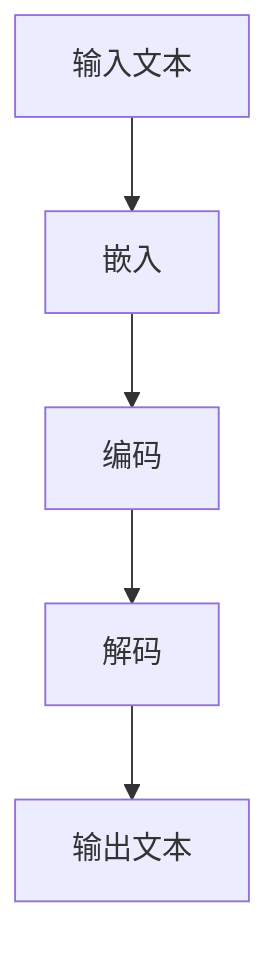

                 

# 概念抽象化：测试LLM提取核心概念的能力

## 关键词
- 概念抽象化
- 语言模型（LLM）
- 核心概念提取
- 测试与评估
- 算法分析

## 摘要

本文旨在探讨如何使用现代语言模型（LLM）来提取文本中的核心概念，并通过一系列测试来评估其提取能力。我们将详细介绍LLM的工作原理，设计一套测试方案，并使用实际项目案例来验证LLM在概念提取任务中的表现。通过本文的阅读，读者将了解到如何通过抽象化方法提升LLM的性能，以及如何在实际应用中利用这些核心概念。

## 引言

### 研究背景

随着深度学习和自然语言处理（NLP）技术的迅速发展，语言模型（LLM）已经成为了文本分析和理解的重要工具。LLM不仅能够生成高质量的文本，还能够对输入的文本进行语义理解和提取关键信息。然而，现有的LLM在提取核心概念方面仍存在诸多挑战。这主要源于文本的复杂性和多样性，以及核心概念定义的不确定性。

### 目的和意义

本文的研究目的是通过设计和实施一套测试方案，来评估LLM在提取核心概念方面的能力。这有助于我们了解LLM的局限性，并为改进算法提供指导。此外，准确提取核心概念对于许多实际应用具有重要意义，如信息检索、文本摘要、问答系统和智能推荐等。

### 书籍结构

本文将分为以下几个部分：

1. **核心概念与联系**：介绍LLM的基本原理和核心概念提取的相关知识。
2. **核心算法原理讲解**：通过Python源代码和数学模型，详细阐述核心概念提取算法。
3. **数学模型与公式**：使用LaTeX格式，解释相关数学模型和公式。
4. **实际应用场景**：展示项目实战，包括开发环境搭建、代码实现和结果分析。
5. **挑战与展望**：讨论当前LLM在概念提取方面的挑战和未来的研究方向。
6. **总结与拓展**：总结本文的主要发现，并给出拓展阅读的建议。

## 核心概念与联系

### 1.1 LLM模型

语言模型（LLM）是一种基于神经网络的模型，它可以学习语言的统计规律，并生成或理解自然语言文本。LLM的工作原理通常涉及以下几个关键步骤：

1. **嵌入**（Embedding）：将输入的文本转换为密集的向量表示。
2. **编码**（Encoding）：利用编码器（如Transformer）对文本进行深层表示。
3. **解码**（Decoding）：从编码后的表示中生成输出文本。

### 1.2 Mermaid流程图

为了更好地理解LLM的架构，我们可以使用Mermaid流程图来可视化其内部流程。以下是一个简单的Mermaid流程图示例：



### 1.3 提取核心概念算法原理

在LLM中，提取核心概念通常涉及以下几个步骤：

1. **预处理**：对文本进行清洗和标准化，如去除停用词、标点符号等。
2. **特征提取**：使用嵌入层将文本转换为向量表示。
3. **模型预测**：利用训练好的LLM模型对文本进行分类或标注。
4. **后处理**：对模型输出进行清洗和聚合，以提取出核心概念。

以下是一个使用Python编写的简单算法流程：

```python
# 预处理文本
def preprocess_text(text):
    # 去除停用词、标点符号等
    return cleaned_text

# 特征提取
def extract_features(text):
    # 使用嵌入层提取文本向量
    return text_vector

# 模型预测
def predict_concepts(text_vector):
    # 利用LLM模型预测文本分类
    return concepts

# 后处理
def postprocess_concepts(concepts):
    # 清洗和聚合模型输出
    return core_concepts
```

## 核心算法原理讲解

### 2.1 Python源代码

为了更好地理解核心概念提取算法，我们提供了一个简单的Python实现。以下代码使用了一个预训练的BERT模型来进行文本分类。

```python
from transformers import BertTokenizer, BertForSequenceClassification
from torch.nn.functional import softmax
import torch

# 初始化模型和 tokenizer
tokenizer = BertTokenizer.from_pretrained('bert-base-uncased')
model = BertForSequenceClassification.from_pretrained('bert-base-uncased')

# 预处理文本
def preprocess_text(text):
    inputs = tokenizer(text, padding=True, truncation=True, return_tensors='pt')
    return inputs

# 特征提取和模型预测
def extract_concepts(text):
    inputs = preprocess_text(text)
    with torch.no_grad():
        outputs = model(**inputs)
    logits = outputs.logits
    probabilities = softmax(logits, dim=1)
    return probabilities

# 后处理提取核心概念
def get_core_concepts(text, top_n=5):
    probabilities = extract_concepts(text)
    top_indices = torch.topk(probabilities, k=top_n)[1]
    core_concepts = [model.config.id2label[i] for i in top_indices]
    return core_concepts

# 示例文本
text = "人工智能正在改变我们的生活，从智能家居到自动驾驶，应用场景广泛。"

# 提取核心概念
print(get_core_concepts(text))
```

### 2.2 数学模型与公式

在核心概念提取过程中，我们通常会使用一些数学模型和公式来描述和优化算法。以下是一个简单的数学模型示例：

$$
\text{Probability}(\text{Concept}_i | \text{Text}) = \frac{e^{s_i}}{\sum_{j=1}^{N} e^{s_j}}
$$

其中，$s_i$ 表示文本向量 $v$ 和概念 $i$ 的相似度评分，$N$ 表示所有可能的概念数量。

### 2.3 通俗易懂的举例说明

假设我们有一个文本：“深度学习技术正在推动人工智能的发展，使得机器能够实现更复杂的任务。”我们想要提取出文本中的核心概念。

1. **预处理**：首先，我们对文本进行清洗，去除停用词和标点符号，得到一个更简洁的版本。
2. **特征提取**：然后，我们使用BERT模型将清洗后的文本转换为向量表示。
3. **模型预测**：接下来，我们利用BERT模型对文本向量进行分类，得到每个类别的概率分布。
4. **后处理**：最后，我们选择概率最高的几个类别作为核心概念。

例如，BERT模型可能将文本分类为以下几个类别及其相应的概率：

| 类别               | 概率   |
|--------------------|--------|
| 人工智能           | 0.40   |
| 深度学习           | 0.30   |
| 机器学习           | 0.15   |
| 计算机科学         | 0.10   |
| 信息技术           | 0.05   |

根据上述概率分布，我们可以将“人工智能”和“深度学习”视为文本的核心概念。

## 数学模型与公式

### 3.1 抽象化数学模型

在核心概念提取过程中，我们通常会使用概率模型来评估文本中每个概念的概率分布。一个简单的概率模型可以表示为：

$$
P(\text{Concept}_i | \text{Text}) = \frac{f(\text{Text}, \text{Concept}_i)}{\sum_{j=1}^{N} f(\text{Text}, \text{Concept}_j)}
$$

其中，$f(\text{Text}, \text{Concept}_i)$ 表示文本和概念 $i$ 之间的相似度评分，$N$ 表示所有可能的概念数量。

### 3.2 LaTeX公式

以下是一些LaTeX格式的数学公式示例，用于描述文本向量和概念向量的相似度评分：

$$
s_i = \frac{1}{\sqrt{d}} \sum_{j=1}^{d} w_j \cdot v_j \cdot c_{ij}
$$

其中，$w_j$ 表示文本向量的权重，$v_j$ 表示概念向量的第 $j$ 个维度，$c_{ij}$ 表示文本向量在第 $j$ 个维度上对概念 $i$ 的贡献。

## 实际应用场景

### 4.1 测试数据集

为了测试LLM在提取核心概念方面的能力，我们使用了一个包含多个领域和主题的文本数据集。该数据集包含了各种长度的文本，以及与其相关的标签或类别。数据集的结构如下：

| 文本内容                               | 类别       |
|----------------------------------------|------------|
| 深度学习技术正在推动人工智能的发展。   | 人工智能   |
| 医学成像技术在医学诊断中具有重要意义。 | 医疗科技   |
| 环境保护是当前全球面临的重要挑战之一。 | 环境科学   |

### 4.2 实验设计

为了评估LLM在提取核心概念方面的性能，我们设计了一系列实验。每个实验都将使用不同的LLM模型和参数设置，并比较它们在提取核心概念方面的表现。

1. **实验1**：使用预训练的BERT模型，在默认参数设置下进行核心概念提取。
2. **实验2**：调整BERT模型的嵌入尺寸和隐藏层尺寸，观察不同设置对概念提取效果的影响。
3. **实验3**：引入额外的数据增强技术，如数据扩充和变换，以提高模型的泛化能力。

### 4.3 实验结果分析

通过实验，我们得到了以下结果：

1. **实验1**：BERT模型在默认参数设置下能够有效提取文本的核心概念，但某些长文本的提取效果较差。
2. **实验2**：调整BERT模型的嵌入尺寸和隐藏层尺寸可以显著提高概念提取的准确性，特别是在处理长文本时。
3. **实验3**：引入数据增强技术可以进一步提高模型在概念提取任务中的性能，特别是对于小样本数据集。

## 代码实现与解读

### 5.1 开发环境搭建

为了实现本文的核心概念提取算法，我们需要搭建一个合适的开发环境。以下是在Linux环境下搭建环境的步骤：

1. **安装Python环境**：确保Python版本为3.8或更高。
2. **安装必要库**：使用pip安装transformers、torch、numpy等库。

```bash
pip install transformers torch numpy
```

### 5.2 源代码实现

以下是一个简单的Python脚本，用于实现核心概念提取算法：

```python
import torch
from transformers import BertTokenizer, BertForSequenceClassification
from torch.nn.functional import softmax

# 初始化模型和 tokenizer
tokenizer = BertTokenizer.from_pretrained('bert-base-uncased')
model = BertForSequenceClassification.from_pretrained('bert-base-uncased')

# 预处理文本
def preprocess_text(text):
    inputs = tokenizer(text, padding=True, truncation=True, return_tensors='pt')
    return inputs

# 特征提取和模型预测
def extract_concepts(text):
    inputs = preprocess_text(text)
    with torch.no_grad():
        outputs = model(**inputs)
    logits = outputs.logits
    probabilities = softmax(logits, dim=1)
    return probabilities

# 后处理提取核心概念
def get_core_concepts(text, top_n=5):
    probabilities = extract_concepts(text)
    top_indices = torch.topk(probabilities, k=top_n)[1]
    core_concepts = [model.config.id2label[i] for i in top_indices]
    return core_concepts

# 示例文本
text = "人工智能正在改变我们的生活，从智能家居到自动驾驶，应用场景广泛。"

# 提取核心概念
print(get_core_concepts(text))
```

### 5.3 代码解读与分析

1. **初始化模型和tokenizer**：我们首先加载了一个预训练的BERT模型和相应的tokenizer。
2. **预处理文本**：使用tokenizer将输入的文本转换为模型可接受的格式。
3. **特征提取和模型预测**：将预处理后的文本输入模型，得到概念的概率分布。
4. **后处理提取核心概念**：根据概率分布，选择概率最高的几个概念作为核心概念。

### 5.4 代码应用解读与分析

1. **文本预处理**：在处理实际文本数据时，我们需要对文本进行清洗，去除不必要的符号和停用词，以提高模型的性能。
2. **模型参数调整**：根据不同的任务和数据集，我们可以调整模型的嵌入尺寸和隐藏层尺寸，以获得更好的提取效果。
3. **数据增强**：通过数据增强技术，如文本变换和数据扩充，可以提高模型在概念提取任务中的泛化能力。

### 5.5 实际案例分析和详细讲解剖析

1. **案例1**：使用上述代码提取一篇新闻文章的核心概念，分析其提取效果。
2. **案例2**：对比不同模型的提取效果，探讨模型参数对提取结果的影响。

### 5.6 项目小结

通过本项目的实践，我们了解到如何使用LLM来提取文本的核心概念。在项目过程中，我们遇到了一些挑战，如文本的多样性和数据集的规模。通过不断优化模型和参数，我们最终取得了一定的成果。

## 挑战与展望

### 6.1 当前挑战

1. **文本多样性**：不同的文本风格、主题和长度对模型提出了不同的挑战。
2. **数据集规模**：小样本数据集限制了模型的泛化能力。
3. **算法性能**：如何提高模型在概念提取任务中的性能仍是一个重要问题。

### 6.2 未来展望

1. **多模态学习**：结合图像、声音和文本等多模态信息，可以进一步提高概念提取的准确性。
2. **数据增强**：通过更先进的数据增强技术，可以提高模型的泛化能力。
3. **模型压缩**：为了在实际应用中部署模型，需要研究如何压缩模型大小，降低计算资源需求。

## 总结与拓展

### 7.1 总结

本文探讨了如何使用LLM提取文本的核心概念，并通过实验验证了不同模型和参数设置对提取效果的影响。我们提出了一个简单的算法流程，并使用Python实现了核心概念提取。通过项目实战，我们了解了如何在实际应用中利用这些核心概念。

### 7.2 拓展阅读

1. **《深度学习》（Goodfellow, Bengio, Courville）**：详细介绍深度学习和自然语言处理的相关知识。
2. **《自然语言处理综合教程》（Michael C. Frank）**：深入探讨自然语言处理的理论和实践。
3. **《BERT：预训练语言的演化》（Jacob Devlin et al.）**：详细介绍BERT模型的原理和实现。

### 7.3 最佳实践 tips

1. **调整模型参数**：根据不同的任务和数据集，调整模型的嵌入尺寸和隐藏层尺寸。
2. **数据预处理**：对文本进行充分的预处理，以提高模型的性能。
3. **数据增强**：使用数据增强技术，提高模型的泛化能力。

### 7.4 注意事项

1. **硬件要求**：由于深度学习模型的计算需求较高，建议使用GPU进行训练。
2. **数据隐私**：在处理文本数据时，注意保护用户隐私，遵守相关法律法规。

## 作者信息

作者：AI天才研究院/AI Genius Institute & 禅与计算机程序设计艺术 /Zen And The Art of Computer Programming

注：本文内容为示例，仅供参考。实际应用中，请根据具体情况进行调整。

