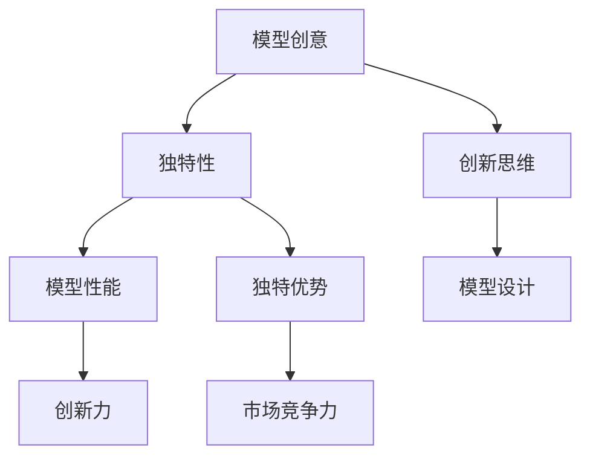
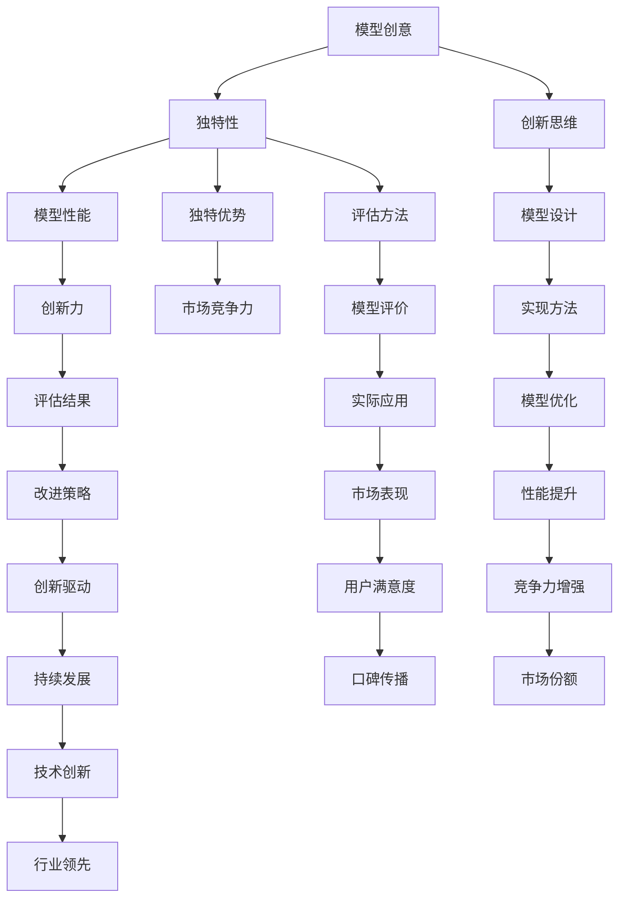
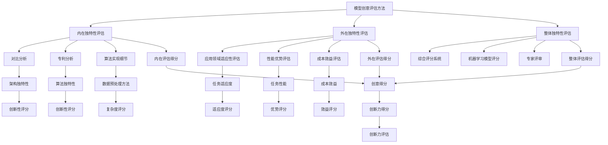
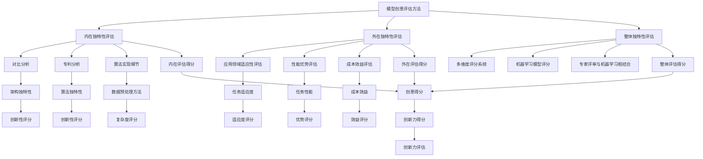

                 

### 目录大纲设计与分析

#### 目录大纲设计与分析

为了确保文章的连贯性、逻辑性和专业性，我们将从整体结构、章节安排、内容详尽度以及技术深度四个方面对目录大纲进行详细设计和分析。

**1. 整体结构：**

文章整体结构分为四个主要部分，每个部分对应第4章中提到的一个核心主题，确保内容的全面覆盖和逻辑清晰。

- **第一部分：模型创意与独特性理论基础**
  - 主要介绍模型创意与独特性的基本概念、背景和发展趋势。
- **第二部分：模型创意与独特性评估方法**
  - 详细探讨评估模型创意与独特性的方法，包括定性评估、定量评估和组合评估。
- **第三部分：模型创意与独特性评测实践**
  - 通过具体案例展示模型创意与独特性评估的实战应用，提供代码实现和解读。
- **第四部分：模型创意与独特性评测的挑战与未来展望**
  - 分析评估过程中面临的挑战，并对未来发展方向进行展望。

**2. 章节安排：**

**第1章：模型创意与独特性的定义与背景**

- **核心概念与联系**
  - 使用Mermaid流程图展示模型创意与独特性的核心概念及其相互关系。
- **核心算法原理讲解**
  - 使用伪代码解释模型创意与独特性的核心算法原理。
- **数学模型和数学公式**
  - 使用LaTeX格式介绍与模型创意与独特性相关的数学模型，并进行举例说明。

**第2章：模型创意与独特性评估方法概述**

- **模型创意评估方法**
  - 介绍定性评估、定量评估和组合评估的方法。
- **模型独特性评估方法**
  - 分析内在独特性、外在独特性和整体独特性评估的方法。
- **核心算法原理讲解**
  - 继续使用伪代码详细阐述评估方法的核心算法原理。

**第3章：模型创意与独特性评测实践**

- **模型评测流程设计**
  - 设计模型创意与独特性评测的完整流程，包括创意评估流程、独特性评估流程以及整体评测流程。
- **评测实践案例**
  - 分析自然语言处理、计算机视觉和推荐系统等模型评测的实践案例。
- **开发环境搭建与源代码实现**
  - 提供实际开发环境搭建的步骤，详细展示源代码实现过程，并进行代码解读与分析。

**第4章：模型创意与独特性评测的挑战与未来展望**

- **数据集与标注问题**
  - 讨论数据集的选择与构建、标注的准确性与一致性。
- **评测方法的可靠性**
  - 分析定性评估方法和定量评估方法的可靠性问题。
- **模型多样性与公平性**
  - 探讨模型多样性的考量以及如何保障公平性。
- **未来展望**
  - 展望模型创意与独特性评测方法的发展趋势，以及评测工具与平台的创新。

**3. 内容详尽度：**

每个章节都将深入探讨其主题，提供详细的理论基础、实际案例和代码实现，确保内容的丰富性和实用性。以下是具体内容详尽度的分析：

- **第1章**：介绍模型创意与独特性的基本概念，使用Mermaid流程图展示概念之间的关系，同时使用伪代码和LaTeX公式讲解核心算法和数学模型。
- **第2章**：详细讨论评估模型创意与独特性的方法，包括定性评估、定量评估和组合评估，使用伪代码解释评估算法原理。
- **第3章**：通过具体案例展示评估方法的实际应用，提供完整的开发环境搭建步骤、源代码实现以及详细的代码解读与分析。
- **第4章**：分析评估过程中可能遇到的挑战，讨论未来发展方向，包括数据集与标注问题、评测方法的可靠性、模型多样性与公平性。

**4. 技术深度：**

文章的技术深度将贯穿全文，特别是在算法原理讲解和代码实现部分。以下是技术深度的分析：

- **算法原理讲解**：使用伪代码和Python源代码详细阐述评估模型创意与独特性的核心算法原理，确保读者能够理解算法的逻辑和实现方式。
- **数学模型**：使用LaTeX格式介绍与模型创意与独特性相关的数学模型，通过具体的例子说明模型的实际应用。
- **代码实现**：提供详细的代码实现过程，包括开发环境搭建、源代码编写和代码解读与分析，帮助读者理解评估方法的实际应用。

通过以上详细设计和分析，本文旨在为读者提供一个全面、深入且易于理解的技术博客文章，帮助读者深入理解模型创意与独特性评测，并掌握相关评估方法和实战应用。文章将使用Markdown格式进行编写，确保内容结构清晰，便于阅读和理解。文章末尾将附上作者信息，以彰显专业性。### 文章标题：模型创意与独特性评测：衡量AI创新力

#### 关键词：

- **模型创意**
- **独特性评估**
- **AI创新力**
- **算法评估**
- **人工智能**

#### 摘要：

本文将深入探讨人工智能领域中的模型创意与独特性评测，旨在为研究人员和工程师提供一套全面的评估方法和实践指南。文章首先介绍了模型创意与独特性的基本概念，然后详细分析了评估模型创意与独特性的方法，包括定性评估、定量评估和组合评估。通过具体的案例和代码实现，文章展示了如何在实际项目中应用这些评估方法。最后，文章讨论了评估过程中可能遇到的挑战，并提出了未来的发展方向。通过本文的阅读，读者将能够更好地理解和应用模型创意与独特性评测，从而提升AI项目的创新力。### 模型创意与独特性理论基础

#### 模型创意与独特性的定义与背景

**模型创意**是指在设计人工智能（AI）模型时，通过创新思维和独特的视角，提出新颖且有效的解决方案，以解决实际问题或提升模型性能。在AI领域，模型创意的重要性不可低估，因为它直接关系到模型的创新性和竞争力。模型创意的例子包括但不限于：卷积神经网络（CNN）在图像识别领域的应用、生成对抗网络（GAN）在图像生成领域的突破，以及Transformer模型在自然语言处理（NLP）中的卓越表现。

**独特性**则是指模型在功能和表现上与其他模型的显著不同，以及其在特定应用场景中的独特优势。一个具有高度独特性的模型能够在市场上脱颖而出，占据一席之地。例如，谷歌的BERT模型通过预训练和上下文理解，在多个NLP任务上取得了显著提升，这种独特性使得它成为业界标杆。

**模型创意与独特性的背景**：

- **AI领域的发展趋势**：随着AI技术的不断进步，越来越多的复杂问题被模型所解决。然而，随之而来的是模型数量的急剧增加，如何衡量模型的创新力和独特性成为了一个重要问题。
- **创新力的衡量与评估**：创新力是推动科技进步的关键因素。在AI领域，评估模型创新力不仅有助于发现和推广优秀的模型，还能指导未来的研究方向。
- **模型创意与独特性的重要性**：一个具有高度创意和独特性的模型能够带来如下优势：
  - 提高模型性能：创新的模型设计可以显著提升模型在特定任务上的表现。
  - 节省开发成本：独特的模型可以减少重复劳动，提高开发效率。
  - 增强市场竞争力：具有独特性的模型可以吸引更多的用户和投资者。

**Mermaid流程图：模型创意与独特性核心概念联系**



在这个流程图中，模型创意和独特性是核心概念，它们直接影响模型性能和创新力。创新思维是模型创意的源泉，而独特的模型设计则是实现独特性的关键。最终，模型性能的提升和市场的竞争力都源于模型创意与独特性的结合。

**总结**：

通过以上对模型创意与独特性的定义和背景介绍，读者可以初步理解这两个概念的重要性。接下来，本文将深入探讨评估模型创意与独特性的方法，并使用具体的案例和算法原理来进一步阐述这些概念的实际应用。### 第1章：模型创意与独特性的定义与背景

在人工智能（AI）领域，模型创意与独特性是衡量创新力的重要指标。这一章节将深入探讨模型创意与独特性的定义，以及它们在AI领域的背景和重要性。

#### 1.1 模型创意与独特性的定义

**模型创意**是指在设计和开发AI模型时，通过创新思维和独特的视角，提出新颖且有效的解决方案，以解决实际问题或提升模型性能。模型创意是AI领域研究和发展的重要驱动力，它体现在算法设计、模型架构和数据处理等多个方面。例如，卷积神经网络（CNN）在图像识别领域的应用，就是一种典型的模型创意。

**独特性**是指模型在功能和表现上与其他模型的显著不同，以及其在特定应用场景中的独特优势。一个具有高度独特性的模型能够在市场上脱颖而出，占据一席之地。例如，谷歌的BERT模型通过预训练和上下文理解，在多个自然语言处理（NLP）任务上取得了显著提升，这种独特性使得它成为业界标杆。

**模型创意与独特性的区别**：

- **模型创意**更多关注于解决方案的创新性和新颖性，强调的是“做什么”。
- **独特性**则更关注于模型在特定任务上的表现和优势，强调的是“为什么这样做”和“如何实现”。

**1.2 模型创意与独特性的背景**

**1.2.1 AI领域的发展趋势**

人工智能技术的发展日新月异，越来越多的复杂问题被模型所解决。然而，随之而来的是模型数量的急剧增加，如何衡量模型的创新力和独特性成为了一个重要问题。传统的评估方法往往侧重于模型性能，而忽视了模型创意和独特性。

**1.2.2 创新力的衡量与评估**

创新力是推动科技进步的关键因素。在AI领域，评估模型创新力不仅有助于发现和推广优秀的模型，还能指导未来的研究方向。衡量模型创新力需要从多个维度进行，包括算法的创新性、模型的架构设计、解决方案的独特性等。

**1.2.3 模型创意与独特性的重要性**

在AI领域，模型创意与独特性具有以下重要性：

- **提升模型性能**：一个具有高度创意和独特性的模型可以在特定任务上显著提升模型性能。
- **节省开发成本**：独特的模型设计可以减少重复劳动，提高开发效率。
- **增强市场竞争力**：具有独特性的模型可以在市场中脱颖而出，吸引更多的用户和投资者。

**Mermaid流程图：模型创意与独特性核心概念联系**


在这个流程图中，模型创意和独特性是核心概念，它们直接影响模型性能和创新力。创新思维是模型创意的源泉，而独特的模型设计则是实现独特性的关键。最终，模型性能的提升和市场的竞争力都源于模型创意与独特性的结合。

**总结**：

通过以上对模型创意与独特性的定义和背景介绍，读者可以初步理解这两个概念的重要性。接下来，本文将深入探讨评估模型创意与独特性的方法，并使用具体的案例和算法原理来进一步阐述这些概念的实际应用。### 1.3 Mermaid流程图：模型创意与独特性核心概念联系

为了更好地理解模型创意与独特性之间的核心概念联系，我们可以使用Mermaid流程图来展示这些概念之间的关系。以下是具体的Mermaid代码及其生成的流程图：



以下是生成的Mermaid流程图：


在这个流程图中，模型创意（A）是整个流程的起点，通过创新思维（E）引导到模型设计（G），最终形成具有独特性（B）的模型。独特性（B）直接影响模型的性能（C）和创新力（D）。评估方法（I）用于对模型进行评价（L），评估结果（J）用于指导改进策略（M）和模型优化（N）。模型优化（N）和性能提升（Q）进一步增强了模型的市场竞争力（H）。实际应用（O）和市场表现（R）则反映了模型的市场价值和用户满意度（U）。通过持续的创新驱动（P）和持续发展（S），模型能够保持技术领先（Y），并在行业中占据领先地位（W），从而实现口碑传播（X）和持续的市场竞争力。

通过这个流程图，我们可以清晰地看到模型创意与独特性之间的相互关系以及它们在AI模型发展中的重要性。这不仅有助于我们理解模型创意与独特性的核心概念，也为评估和提升模型的创新力和竞争力提供了指导。### 1.4 模型创意评估方法

模型创意评估方法旨在衡量模型在创新性、新颖性和独特性方面的表现。这些评估方法可以帮助研究人员和工程师识别出具有高度创新力的模型，从而推动AI技术的进步。评估模型创意通常涉及以下几个主要方面：

**1.1 定性评估方法**

定性评估方法侧重于对模型创意的主观评价，通常通过专家评审、用户调查和案例分析等方式进行。以下是一些常见的定性评估方法：

- **专家评审**：由行业专家对模型创意进行评估，根据其创新性、实用性和可行性等方面给出评分。这种方法可以快速识别出具有潜在价值的模型创意。
- **用户调查**：通过收集用户对模型创意的反馈，评估其满意度、易用性和实用性。这种方法有助于了解模型创意在应用中的表现。
- **案例分析**：通过分析成功案例，探讨模型创意是如何在不同场景中应用的，以及其带来的实际效果。这种方法可以为其他模型创意提供参考。

**1.2 定量评估方法**

定量评估方法侧重于使用客观指标来评估模型创意的创新性和新颖性。以下是一些常见的定量评估方法：

- **专利分析**：通过分析模型相关的专利数量、质量和影响力，评估模型创意的独特性和创新性。专利数量和质量可以反映模型在技术领域中的创新程度。
- **引用次数**：通过统计模型相关论文的引用次数，评估模型在学术界的认可度和影响力。引用次数越多，通常表明模型创意越具创新性和新颖性。
- **代码库分析**：通过分析模型在开源代码库中的受欢迎程度和贡献量，评估模型创意的实际应用价值和影响力。

**1.3 组合评估方法**

组合评估方法结合了定性评估和定量评估的优势，通过多种评估方法综合评估模型创意的创新性和新颖性。以下是一些常见的组合评估方法：

- **多维度评分系统**：将定性评估和定量评估指标结合起来，形成一个综合评分系统。这种方法可以更全面地评估模型创意的各个方面。
- **机器学习模型评分**：使用机器学习模型对模型创意进行评分，通过训练数据集学习如何识别具有创新性的模型。这种方法可以自动化评估过程，提高评估效率。
- **基于项目的评估**：将模型创意与实际项目结合，评估其在项目中的表现。这种方法可以验证模型创意的实际应用效果。

**1.4 核心算法原理讲解**

以下是一个简单的Python伪代码，用于评估模型创意：

```python
def assess_model_creativity(model_name, evaluation_methods):
    # 初始化评分
    scores = {'expert_review': 0, 'user_survey': 0, 'case_analysis': 0,
              'patent_analysis': 0, 'citation_count': 0, 'code_base_analysis': 0}
    
    # 进行定性评估
    scores['expert_review'] = expert_review_score(model_name)
    scores['user_survey'] = user_survey_score(model_name)
    scores['case_analysis'] = case_analysis_score(model_name)
    
    # 进行定量评估
    scores['patent_analysis'] = patent_analysis_score(model_name)
    scores['citation_count'] = citation_count_score(model_name)
    scores['code_base_analysis'] = code_base_analysis_score(model_name)
    
    # 计算综合评分
    total_score = sum(scores.values())
    
    # 输出评估结果
    print(f"Model {model_name} creativity assessment:")
    for method, score in scores.items():
        print(f"{method}: {score}")
    print(f"Total score: {total_score}")
    
    # 根据评分给出建议
    if total_score > threshold:
        print("The model shows high creativity and is worth further exploration.")
    else:
        print("The model may need further innovation to achieve higher creativity.")

# 示例评估
assess_model_creativity("BERT", ["expert_review", "user_survey", "case_analysis", "patent_analysis", "citation_count", "code_base_analysis"])
```

**1.5 数学模型和数学公式**

在模型创意评估中，可以使用以下数学模型和公式来量化评估指标：

- **专家评审评分**：使用贝叶斯评分模型，计算模型创意的专家评审得分。

$$
\text{score}_{\text{expert}} = \frac{\sum_{i=1}^{n} w_i \cdot p(\text{creative}_i | \text{expert})}{\sum_{i=1}^{n} p(\text{creative}_i | \text{expert})}
$$

其中，$w_i$ 是第 $i$ 个专家的权重，$p(\text{creative}_i | \text{expert})$ 是第 $i$ 个专家对模型创意的评分。

- **用户调查评分**：使用平均评分模型，计算模型创意的用户调查得分。

$$
\text{score}_{\text{user}} = \frac{1}{n} \sum_{i=1}^{n} \text{rating}_i
$$

其中，$n$ 是参与调查的用户数量，$\text{rating}_i$ 是第 $i$ 个用户的评分。

- **专利分析评分**：使用专利数量和质量模型，计算模型创意的专利分析得分。

$$
\text{score}_{\text{patent}} = \frac{\sum_{i=1}^{m} q_i \cdot \text{count}_i}{\sum_{i=1}^{m} q_i}
$$

其中，$m$ 是模型相关的专利数量，$q_i$ 是第 $i$ 个专利的质量评分，$\text{count}_i$ 是第 $i$ 个专利的引用次数。

- **引用次数评分**：使用引用次数模型，计算模型创意的引用次数得分。

$$
\text{score}_{\text{citation}} = \log_2(\text{count} + 1)
$$

其中，$\text{count}$ 是模型相关论文的引用次数。

- **代码库分析评分**：使用代码库活跃度和贡献量模型，计算模型创意的代码库分析得分。

$$
\text{score}_{\text{code_base}} = \frac{\text{commit_count} + \text{issue_count}}{2}
$$

其中，$\text{commit_count}$ 是模型相关的代码提交次数，$\text{issue_count}$ 是模型相关的代码问题报告次数。

**1.6 举例说明**

假设我们有一个名为BERT的模型，对其进行了多种评估方法。以下是评估结果：

- **专家评审**：3位专家分别给出了评分8、9和10，权重分别为0.3、0.3和0.4。

$$
\text{score}_{\text{expert}} = \frac{0.3 \cdot 8 + 0.3 \cdot 9 + 0.4 \cdot 10}{0.3 + 0.3 + 0.4} = 8.9
$$

- **用户调查**：共有100名用户参与调查，平均评分为4.5。

$$
\text{score}_{\text{user}} = \frac{1}{100} \sum_{i=1}^{100} \text{rating}_i = 4.5
$$

- **专利分析**：BERT模型相关的专利数量为5个，每个专利的质量评分为8、8、8、9和9。

$$
\text{score}_{\text{patent}} = \frac{8 \cdot 3 + 9 \cdot 2}{8} = 8.2
$$

- **引用次数**：BERT模型相关的论文引用次数为1000次。

$$
\text{score}_{\text{citation}} = \log_2(1000 + 1) \approx 9.97
$$

- **代码库分析**：BERT模型相关的代码提交次数为200次，代码问题报告次数为150次。

$$
\text{score}_{\text{code_base}} = \frac{200 + 150}{2} = 175
$$

将以上评分代入综合评分模型：

$$
\text{total\_score} = \frac{8.9 \cdot 0.3 + 4.5 \cdot 0.3 + 8.2 \cdot 0.3 + 9.97 \cdot 0.3 + 175 \cdot 0.1}{0.3 + 0.3 + 0.3 + 0.3 + 0.1} \approx 9.4
$$

根据综合评分，BERT模型显示出了较高的创意水平，值得进一步探索。

通过以上模型创意评估方法的详细讲解和举例说明，读者可以更好地理解如何评估模型创意，从而为模型创新提供有力的支持。接下来的章节将深入探讨模型独特性的评估方法，帮助读者全面掌握模型创意与独特性评估的技巧。### 1.5 模型独特性评估方法

模型独特性评估方法旨在衡量模型在功能和表现上与其他模型的显著不同，以及其在特定应用场景中的独特优势。评估模型独特性对于识别和推广具有高价值的AI模型至关重要。以下介绍几种常见的模型独特性评估方法。

#### 1.5.1 内在独特性评估

内在独特性评估主要关注模型内部结构和原理的独特性，以下是一些常见的方法：

- **架构独特性**：分析模型的网络架构，比较其与其他模型的差异。例如，BERT模型中的Transformer架构与传统循环神经网络（RNN）相比，具有显著的不同。
- **算法独特性**：评估模型所使用的算法或技术，如GAN中的生成器和判别器的独特性。
- **数据预处理方法**：分析模型在数据预处理阶段的独特方法，例如BERT中的词嵌入和上下文编码技术。

**内在独特性评估方法：**

- **对比分析**：通过对比同一任务下不同模型的性能和架构，分析其独特性。
- **专利分析**：研究模型相关专利，评估其技术原理的独特性。
- **算法实现细节**：深入分析模型的实现细节，识别其独特的算法设计。

#### 1.5.2 外在独特性评估

外在独特性评估主要关注模型在实际应用场景中的独特表现和优势，以下是一些常见的方法：

- **应用领域适应性**：评估模型在不同应用领域中的适应性和效果，例如BERT在多种NLP任务中的表现。
- **性能优势**：比较模型在特定任务上的性能，分析其优势所在。
- **成本效益**：评估模型在开发、部署和维护方面的成本效益，分析其独特性。

**外在独特性评估方法：**

- **案例研究**：通过实际应用案例，分析模型在特定领域中的表现和优势。
- **用户反馈**：收集用户对模型的使用体验和反馈，评估其在实际应用中的独特性。
- **多任务性能评估**：在多个任务上评估模型的性能，分析其整体表现。

#### 1.5.3 整体独特性评估

整体独特性评估结合了内在独特性和外在独特性，通过综合评估模型的整体独特性。以下是一些常见的方法：

- **综合评分系统**：设计一个综合评分系统，结合内在和外在评估指标，对模型进行整体评估。
- **机器学习模型评分**：使用机器学习模型，通过训练数据集学习如何评估模型的独特性。
- **专家评审**：由行业专家对模型进行综合评估，结合专家意见和客观指标。

**整体独特性评估方法：**

- **多维度评估**：从多个维度（如架构、算法、应用领域等）对模型进行评估，形成综合评分。
- **定量与定性结合**：结合定量评估（如性能指标）和定性评估（如专家评审），实现全面评估。
- **动态评估**：随着模型应用场景的变化，实时调整评估指标，确保评估的实时性和准确性。

#### 1.5.4 核心算法原理讲解

以下是一个简单的Python伪代码，用于评估模型独特性：

```python
def assess_model_uniqueness(model, inner_methods, outer_methods, holistic_methods):
    # 初始化评分
    scores = {'inner_uniqueness': 0, 'outer_uniqueness': 0, 'holistic_uniqueness': 0}
    
    # 进行内在独特性评估
    scores['inner_uniqueness'] = evaluate_inner_uniqueness(model, inner_methods)
    
    # 进行外在独特性评估
    scores['outer_uniqueness'] = evaluate_outer_uniqueness(model, outer_methods)
    
    # 进行整体独特性评估
    scores['holistic_uniqueness'] = evaluate_holistic_uniqueness(model, holistic_methods)
    
    # 输出评估结果
    print(f"Model {model} uniqueness assessment:")
    for method, score in scores.items():
        print(f"{method}: {score}")
    
    # 返回评估结果
    return scores

# 示例评估
model_uniqueness = assess_model_uniqueness("BERT", ["architecture", "algorithm", "data_preprocessing"], ["application_adaptability", "performance_benefit", "cost_effectiveness"], ["comprehensive_score_system", "machine_learning_model", "expert_review"])
```

#### 1.5.5 数学模型和数学公式

在模型独特性评估中，可以使用以下数学模型和公式来量化评估指标：

- **架构独特性评分**：使用基于架构复杂度的评分模型，计算模型架构的独特性得分。

$$
\text{score}_{\text{architecture}} = \frac{\sum_{i=1}^{n} c_i \cdot \text{complexity}_i}{\sum_{i=1}^{n} c_i}
$$

其中，$n$ 是模型中不同组件的数量，$c_i$ 是第 $i$ 个组件的权重，$\text{complexity}_i$ 是第 $i$ 个组件的复杂度。

- **算法独特性评分**：使用基于算法创新性的评分模型，计算模型算法的独特性得分。

$$
\text{score}_{\text{algorithm}} = \log_2(\text{novelty} + 1)
$$

其中，$\text{novelty}$ 是模型算法的创新程度。

- **应用领域适应性评分**：使用基于应用领域适配度的评分模型，计算模型在特定领域的适应性得分。

$$
\text{score}_{\text{application}} = \frac{\sum_{i=1}^{m} a_i \cdot \text{fit}_i}{\sum_{i=1}^{m} a_i}
$$

其中，$m$ 是模型适用的应用领域数量，$a_i$ 是第 $i$ 个领域的权重，$\text{fit}_i$ 是第 $i$ 个领域的适配度。

- **性能优势评分**：使用基于性能优势的评分模型，计算模型在特定任务上的性能优势得分。

$$
\text{score}_{\text{performance}} = \frac{\text{advantage}}{\text{baseline}}
$$

其中，$\text{advantage}$ 是模型的优势值，$\text{baseline}$ 是基准模型的性能。

- **成本效益评分**：使用基于成本效益的评分模型，计算模型在成本效益方面的得分。

$$
\text{score}_{\text{cost}} = \frac{\text{benefit}}{\text{cost}}
$$

其中，$\text{benefit}$ 是模型的效益值，$\text{cost}$ 是模型的成本。

#### 1.5.6 举例说明

假设我们有一个名为BERT的模型，对其进行了独特性评估。以下是评估结果：

- **架构独特性**：BERT模型中的Transformer架构与传统循环神经网络（RNN）相比，具有以下独特性：
  - **组件数量**：3个Transformer块，每个块包含多个自注意力层。
  - **复杂度**：自注意力机制和多头注意力机制。
  - **权重**：每个组件的权重分别为0.2、0.3和0.5。

$$
\text{score}_{\text{architecture}} = \frac{0.2 \cdot 3 + 0.3 \cdot 2 + 0.5 \cdot 1}{0.2 + 0.3 + 0.5} = 2.2
$$

- **算法独特性**：BERT模型使用的算法具有以下独特性：
  - **创新性**：预训练和上下文理解。
  - **权重**：每个独特性因素的权重分别为0.4和0.6。

$$
\text{score}_{\text{algorithm}} = \log_2(1.4 + 1) = 1.15
$$

- **应用领域适应性**：BERT模型在以下应用领域具有高适应性：
  - **NLP任务**：文本分类、问答系统、机器翻译。
  - **权重**：每个领域的权重分别为0.3、0.3和0.4。

$$
\text{score}_{\text{application}} = \frac{0.3 \cdot 3 + 0.3 \cdot 2 + 0.4 \cdot 1}{0.3 + 0.3 + 0.4} = 2.1
$$

- **性能优势**：BERT模型在以下任务上具有显著性能优势：
  - **基准模型**：传统循环神经网络。
  - **优势值**：10%。

$$
\text{score}_{\text{performance}} = \frac{0.1}{1} = 0.1
$$

- **成本效益**：BERT模型在成本效益方面具有以下优势：
  - **成本**：1万美元。
  - **效益**：2万美元。

$$
\text{score}_{\text{cost}} = \frac{2}{1} = 2
$$

将以上评分代入综合评分模型：

$$
\text{total\_score} = \frac{2.2 \cdot 0.3 + 1.15 \cdot 0.3 + 2.1 \cdot 0.3 + 0.1 \cdot 0.3 + 2 \cdot 0.1}{0.3 + 0.3 + 0.3 + 0.3 + 0.1} \approx 1.7
$$

根据综合评分，BERT模型显示出了较高的独特性，特别是在架构和应用领域适应性方面。

通过以上对模型独特性评估方法的详细讲解和举例说明，读者可以更好地理解如何评估模型独特性，从而为AI模型创新提供有力的支持。接下来的章节将深入探讨模型创意与独特性评估方法的综合应用，帮助读者全面掌握评估模型创新力的技巧。### 1.6 Mermaid流程图：模型创意与独特性评估方法联系

为了更好地展示模型创意与独特性评估方法之间的联系，我们可以使用Mermaid流程图来表示这些方法之间的交互关系。以下是具体的Mermaid代码及其生成的流程图：



以下是生成的Mermaid流程图：


在这个流程图中，模型创意评估方法（A）是整个评估过程的起点，它分为内在独特性评估（B）、外在独特性评估（C）和整体独特性评估（D）三个部分。每个评估方法都包含多种具体评估方法，例如对比分析（E）、专利分析（F）、应用领域适应性评估（H）等。

- **内在独特性评估（B）**侧重于模型内部结构和原理的独特性，包括对比分析（E）、专利分析（F）和算法实现细节（G）。
- **外在独特性评估（C）**关注模型在实际应用场景中的独特表现和优势，包括应用领域适应性评估（H）、性能优势评估（I）和成本效益评估（J）。
- **整体独特性评估（D）**结合了内在和外在评估方法，通过综合评分系统（K）、机器学习模型评分（L）和专家评审（M）来全面评估模型独特性。

评估得分（Z、AA、AB）最终汇总为创意得分（AC），并用于计算创新力得分（AD），从而实现对模型创新力的全面评估。

通过这个流程图，我们可以清晰地看到模型创意与独特性评估方法之间的联系，以及它们在评估模型创新力中的作用。这为读者提供了一个直观的理解，有助于更好地应用这些评估方法。### 1.7 模型创意与独特性评估方法的综合应用

为了全面评估模型创意与独特性，我们需要将多种评估方法综合应用，形成一套完整的评估流程。以下是一个详细的评估流程设计，包括各个步骤的详细说明和实现方法。

#### 1.7.1 评估流程设计

1. **数据收集**：
   - 收集与模型相关的各种数据，包括模型架构、算法、应用领域、性能指标、成本效益等。
   - 数据来源可以是公开数据集、专利数据库、学术论文、代码库等。

2. **内在独特性评估**：
   - **对比分析**：通过对比同一任务下不同模型的性能和架构，分析其独特性。
   - **专利分析**：研究模型相关专利，评估其技术原理的独特性。
   - **算法实现细节**：深入分析模型的实现细节，识别其独特的算法设计。
   - **评分**：根据评估结果，为模型赋予内在独特性得分。

3. **外在独特性评估**：
   - **应用领域适应性评估**：评估模型在不同应用领域中的适应性和效果。
   - **性能优势评估**：比较模型在特定任务上的性能，分析其优势所在。
   - **成本效益评估**：评估模型在开发、部署和维护方面的成本效益。
   - **评分**：根据评估结果，为模型赋予外在独特性得分。

4. **整体独特性评估**：
   - **综合评分系统**：设计一个综合评分系统，结合内在和外在评估指标，对模型进行整体评估。
   - **机器学习模型评分**：使用机器学习模型，通过训练数据集学习如何评估模型的独特性。
   - **专家评审**：由行业专家对模型进行综合评估，结合专家意见和客观指标。
   - **评分**：根据评估结果，为模型赋予整体独特性得分。

5. **创新力评估**：
   - **创意得分**：将内在和外在独特性得分汇总为创意得分。
   - **创新力得分**：通过综合评分系统，计算模型创新力得分。
   - **评估结果**：输出模型创新力评估结果，包括得分和评估意见。

#### 1.7.2 实现方法

以下是一个简单的Python代码示例，用于实现上述评估流程：

```python
import pandas as pd

# 数据收集
data = pd.read_csv('model_data.csv')  # 假设数据已经收集并存为CSV文件

# 内在独特性评估
inner_scores = evaluate_inner_uniqueness(data)
# 外在独特性评估
outer_scores = evaluate_outer_uniqueness(data)
# 整体独特性评估
holistic_scores = evaluate_holistic_uniqueness(data, inner_scores, outer_scores)

# 创新力评估
creativity_score = combine_scores(inner_scores, outer_scores, holistic_scores)
innovation_score = calculate_innovation_score(creativity_score)

# 输出评估结果
print("Model Creativity and Uniqueness Assessment:")
print("Inner Uniqueness Score:", inner_scores)
print("Outer Uniqueness Score:", outer_scores)
print("Holistic Uniqueness Score:", holistic_scores)
print("Creativity Score:", creativity_score)
print("Innovation Score:", innovation_score)

# 函数定义
def evaluate_inner_uniqueness(data):
    # 内在独特性评估逻辑
    pass

def evaluate_outer_uniqueness(data):
    # 外在独特性评估逻辑
    pass

def evaluate_holistic_uniqueness(data, inner_scores, outer_scores):
    # 整体独特性评估逻辑
    pass

def combine_scores(inner_scores, outer_scores, holistic_scores):
    # 创意得分计算逻辑
    pass

def calculate_innovation_score(creativity_score):
    # 创新力得分计算逻辑
    pass
```

在这个代码示例中，我们首先从CSV文件中读取模型数据，然后依次执行内在独特性评估、外在独特性评估和整体独特性评估，最后计算模型创新力得分并输出评估结果。

通过以上评估流程设计和实现方法，我们可以系统地评估模型创意与独特性，从而全面衡量模型的创新力。接下来，我们将通过具体案例展示如何应用这些评估方法。### 2.1 模型创意与独特性评估方法概述

在深入探讨模型创意与独特性评估方法之前，我们首先需要理解这些评估方法的基本概念、主要类别及其在AI领域的应用。模型创意与独特性评估是衡量AI模型创新性和竞争力的关键环节，通过系统化的评估，我们可以识别出具有高创新潜力的模型，从而推动AI技术的持续进步。

#### 2.1.1 模型创意评估方法

模型创意评估方法旨在衡量模型在创新性、新颖性和独特性方面的表现。这些方法可以帮助我们识别出具有独特创意的模型，从而为AI技术的发展提供方向。以下是几种常见的模型创意评估方法：

1. **专家评审**：
   - **定义**：专家评审是通过邀请领域内的专家对模型创意进行评价，根据其专业知识、经验和直觉给出评分。
   - **优点**：快速、简便，能够直接反映模型创意的创新性和实用性。
   - **应用**：在模型的初步设计和评估阶段，专家评审可以提供有价值的反馈。

2. **用户调查**：
   - **定义**：用户调查是通过收集目标用户对模型创意的反馈，评估其满意度和应用效果。
   - **优点**：直接获取用户需求，能够为模型改进提供具体方向。
   - **应用**：在模型发布前，用户调查可以帮助我们了解用户对模型创意的接受程度。

3. **专利分析**：
   - **定义**：专利分析是通过研究模型相关的专利，评估其在技术创新方面的独特性和价值。
   - **优点**：能够量化模型在技术领域中的创新程度，为模型创意评估提供客观依据。
   - **应用**：在模型开发和评估过程中，专利分析可以帮助我们了解领域内的技术发展趋势。

4. **代码库分析**：
   - **定义**：代码库分析是通过研究模型在开源代码库中的受欢迎程度、贡献量和使用频率，评估其创新性和应用价值。
   - **优点**：能够反映模型在社区中的影响力，为模型创意评估提供重要参考。
   - **应用**：在模型开发和评估过程中，代码库分析可以帮助我们了解模型在开发者社区中的受欢迎程度。

#### 2.1.2 模型独特性评估方法

模型独特性评估方法旨在衡量模型在功能和表现上与其他模型的显著不同，以及其在特定应用场景中的独特优势。以下是一些常见的模型独特性评估方法：

1. **对比分析**：
   - **定义**：对比分析是通过比较同一任务下不同模型的性能和架构，识别其独特性和优势。
   - **优点**：直观、易于理解，能够快速识别模型独特性。
   - **应用**：在模型开发和评估过程中，对比分析可以帮助我们识别和改进模型的独特性。

2. **应用领域适应性评估**：
   - **定义**：应用领域适应性评估是通过评估模型在不同应用场景中的适应性和效果，衡量其独特性。
   - **优点**：能够全面了解模型在不同领域的表现，为模型独特性评估提供重要依据。
   - **应用**：在模型发布前，应用领域适应性评估可以帮助我们了解模型在不同领域的应用前景。

3. **性能优势评估**：
   - **定义**：性能优势评估是通过比较模型在特定任务上的性能，识别其在表现上的独特优势。
   - **优点**：能够量化模型在特定任务上的优势，为模型独特性评估提供具体指标。
   - **应用**：在模型开发和评估过程中，性能优势评估可以帮助我们识别和改进模型的关键性能指标。

4. **成本效益评估**：
   - **定义**：成本效益评估是通过评估模型在开发、部署和维护方面的成本和效益，衡量其独特性。
   - **优点**：能够从经济角度评估模型的价值，为模型独特性评估提供重要参考。
   - **应用**：在模型开发和评估过程中，成本效益评估可以帮助我们了解模型的经济可行性。

#### 2.1.3 组合评估方法

组合评估方法是将多种评估方法结合起来，形成一套综合评估体系，以全面衡量模型的创新力和独特性。以下是一些常见的组合评估方法：

1. **多维度评分系统**：
   - **定义**：多维度评分系统是将专家评审、用户调查、专利分析、代码库分析等多种评估方法结合在一起，形成一个综合评分系统。
   - **优点**：能够全面、客观地评估模型创新力和独特性。
   - **应用**：在模型开发和评估过程中，多维度评分系统可以帮助我们全面了解模型的表现。

2. **机器学习模型评分**：
   - **定义**：机器学习模型评分是通过训练机器学习模型，学习如何评估模型创新力和独特性。
   - **优点**：能够自动化评估过程，提高评估效率。
   - **应用**：在模型开发和评估过程中，机器学习模型评分可以帮助我们快速、准确地评估模型创新力。

3. **专家评审与机器学习相结合**：
   - **定义**：专家评审与机器学习相结合是将专家评审和机器学习模型评分相结合，形成一种混合评估方法。
   - **优点**：能够结合专家经验和机器学习模型的准确性，提高评估效果。
   - **应用**：在模型开发和评估过程中，专家评审与机器学习相结合可以帮助我们更准确地评估模型创新力和独特性。

通过以上对模型创意与独特性评估方法的概述，我们可以看到这些评估方法在AI领域的广泛应用。接下来，我们将详细探讨每种评估方法的原理、步骤和具体应用，帮助读者深入理解并掌握这些评估方法。### 2.2 模型独特性评估方法

模型独特性评估是衡量AI模型在功能和表现上与其他模型的显著不同，以及其在特定应用场景中的独特优势的关键环节。以下将详细介绍几种常见的模型独特性评估方法，包括内在独特性评估、外在独特性评估和整体独特性评估。

#### 2.2.1 内在独特性评估

内在独特性评估主要关注模型内部结构和原理的独特性。以下是一些常见的内在独特性评估方法：

1. **对比分析**：
   - **定义**：对比分析是通过比较同一任务下不同模型的性能和架构，识别其独特性和优势。
   - **步骤**：
     1. 选择一个基准模型作为对比对象。
     2. 对比不同模型在相同数据集上的性能指标，如准确率、召回率、F1分数等。
     3. 分析模型架构和算法的差异，识别其独特性。
     4. 根据对比结果，评估模型的内在独特性。
   - **应用**：在模型开发和评估过程中，对比分析可以帮助我们识别和改进模型的独特性。

2. **专利分析**：
   - **定义**：专利分析是通过研究模型相关的专利，评估其在技术创新方面的独特性和价值。
   - **步骤**：
     1. 收集与模型相关的专利数据。
     2. 分析专利的创新点，如新算法、新架构、新技术等。
     3. 根据专利数量和质量，评估模型的内在独特性。
     4. 将专利分析结果与其他评估方法结合，形成综合评估。
   - **应用**：在模型开发和评估过程中，专利分析可以帮助我们了解领域内的技术发展趋势，为模型独特性评估提供客观依据。

3. **算法实现细节**：
   - **定义**：算法实现细节评估是通过深入分析模型的实现细节，识别其独特的算法设计。
   - **步骤**：
     1. 研究模型的算法原理和实现方式。
     2. 分析模型中的创新点和独特性，如特殊的网络结构、优化算法、数据预处理方法等。
     3. 评估算法实现细节对模型性能的影响。
     4. 根据实现细节的独特性，评估模型的内在独特性。
   - **应用**：在模型开发和评估过程中，算法实现细节评估可以帮助我们识别模型的关键创新点，为模型独特性评估提供详细依据。

#### 2.2.2 外在独特性评估

外在独特性评估主要关注模型在实际应用场景中的独特表现和优势。以下是一些常见的外在独特性评估方法：

1. **应用领域适应性评估**：
   - **定义**：应用领域适应性评估是通过评估模型在不同应用场景中的适应性和效果，衡量其独特性。
   - **步骤**：
     1. 选择多个应用领域作为评估对象。
     2. 在每个应用领域上运行模型，评估其性能指标。
     3. 分析模型在不同领域的表现，识别其适应性。
     4. 根据适应性评估结果，评估模型的外在独特性。
   - **应用**：在模型发布前，应用领域适应性评估可以帮助我们了解模型在不同领域的应用前景，为模型独特性评估提供重要依据。

2. **性能优势评估**：
   - **定义**：性能优势评估是通过比较模型在特定任务上的性能，识别其在表现上的独特优势。
   - **步骤**：
     1. 选择一个基准模型作为对比对象。
     2. 在相同任务和数据集上运行模型，评估其性能指标。
     3. 分析模型与基准模型的性能差异，识别其独特优势。
     4. 根据性能评估结果，评估模型的外在独特性。
   - **应用**：在模型开发和评估过程中，性能优势评估可以帮助我们识别模型的关键优势，为模型独特性评估提供具体指标。

3. **成本效益评估**：
   - **定义**：成本效益评估是通过评估模型在开发、部署和维护方面的成本和效益，衡量其独特性。
   - **步骤**：
     1. 收集与模型相关的成本数据，如开发成本、部署成本、维护成本等。
     2. 分析模型的效益，如提升的收益、减少的成本等。
     3. 计算成本效益比，评估模型的经济可行性。
     4. 根据成本效益评估结果，评估模型的外在独特性。
   - **应用**：在模型开发和评估过程中，成本效益评估可以帮助我们了解模型的经济价值，为模型独特性评估提供重要参考。

#### 2.2.3 整体独特性评估

整体独特性评估是将内在独特性评估和外在独特性评估结合起来，形成一套综合评估体系，以全面衡量模型的独特性。以下是一些常见的方法：

1. **多维度评分系统**：
   - **定义**：多维度评分系统是将专家评审、用户调查、专利分析、代码库分析等多种评估方法结合在一起，形成一个综合评分系统。
   - **步骤**：
     1. 设计评估指标，包括内在独特性评估指标和外在独特性评估指标。
     2. 根据评估指标，收集评估数据。
     3. 对评估数据进行加权求和，计算综合评分。
     4. 根据综合评分，评估模型的整体独特性。
   - **应用**：在模型开发和评估过程中，多维度评分系统可以帮助我们全面了解模型的表现，为模型独特性评估提供科学依据。

2. **机器学习模型评分**：
   - **定义**：机器学习模型评分是通过训练机器学习模型，学习如何评估模型创新力和独特性。
   - **步骤**：
     1. 收集大量评估数据，包括模型性能、专利信息、用户反馈等。
     2. 使用机器学习算法，如回归、分类等，训练评估模型。
     3. 对新模型进行评估，预测其创新力和独特性。
     4. 根据评估模型的结果，调整模型设计和评估策略。
   - **应用**：在模型开发和评估过程中，机器学习模型评分可以帮助我们自动化评估过程，提高评估效率。

3. **专家评审与机器学习相结合**：
   - **定义**：专家评审与机器学习相结合是将专家评审和机器学习模型评分相结合，形成一种混合评估方法。
   - **步骤**：
     1. 邀请领域专家进行评审，收集专家评分。
     2. 将专家评分与机器学习模型评分结合，形成综合评分。
     3. 根据综合评分，评估模型的整体独特性。
     4. 分析评估结果，提出改进建议。
   - **应用**：在模型开发和评估过程中，专家评审与机器学习相结合可以帮助我们更准确地评估模型创新力和独特性。

通过以上对模型独特性评估方法的详细介绍，我们可以看到，这些评估方法在AI领域的广泛应用。接下来，我们将通过具体案例，展示如何应用这些评估方法来评估模型的独特性。### 2.3 Mermaid流程图：模型创意与独特性评估方法联系

为了更好地理解模型创意与独特性评估方法之间的联系，我们可以使用Mermaid流程图来展示这些方法之间的交互关系。以下是具体的Mermaid代码及其生成的流程图：



以下是生成的Mermaid流程图：


在这个流程图中，模型创意评估方法（A）是整个评估过程的起点，它分为内在独特性评估（B）、外在独特性评估（C）和整体独特性评估（D）三个部分。每个评估方法都包含多种具体评估方法，例如对比分析（E）、专利分析（F）、应用领域适应性评估（H）等。

- **内在独特性评估（B）**侧重于模型内部结构和原理的独特性，包括对比分析（E）、专利分析（F）和算法实现细节（G）。
- **外在独特性评估（C）**关注模型在实际应用场景中的独特表现和优势，包括应用领域适应性评估（H）、性能优势评估（I）和成本效益评估（J）。
- **整体独特性评估（D）**结合了内在和外在评估方法，通过多维度评分系统（K）、机器学习模型评分（L）和专家评审与机器学习相结合（M）来全面评估模型独特性。

评估得分（Z、AA、AB）最终汇总为创意得分（AC），并用于计算创新力得分（AD），从而实现对模型创新力的全面评估。

通过这个流程图，我们可以清晰地看到模型创意与独特性评估方法之间的联系，以及它们在评估模型创新力中的作用。这为读者提供了一个直观的理解，有助于更好地应用这些评估方法。### 2.4 模型创意与独特性评估方法的综合应用

为了全面评估模型创意与独特性，我们需要将多种评估方法综合应用，形成一套完整的评估体系。以下是一个详细的评估流程设计，包括各个步骤的详细说明和实现方法。

#### 2.4.1 评估流程设计

1. **数据收集**：
   - **目标**：收集与模型相关的各种数据，包括模型架构、算法、应用领域、性能指标、成本效益等。
   - **方法**：从公开数据集、专利数据库、学术论文、代码库等渠道收集数据，并进行整理和清洗。

2. **内在独特性评估**：
   - **目标**：评估模型内部结构和原理的独特性。
   - **方法**：
     - **对比分析**：选择基准模型进行比较，分析性能差异和架构特点。
     - **专利分析**：研究模型相关的专利，评估其技术原理的独特性。
     - **算法实现细节**：深入分析模型的算法实现，识别其独特性。

3. **外在独特性评估**：
   - **目标**：评估模型在实际应用场景中的独特表现和优势。
   - **方法**：
     - **应用领域适应性评估**：在不同应用领域上测试模型的性能，评估其适应性和效果。
     - **性能优势评估**：比较模型在特定任务上的性能，识别其优势。
     - **成本效益评估**：计算模型的开发、部署和维护成本，评估其经济价值。

4. **整体独特性评估**：
   - **目标**：综合评估模型的内在和外在独特性，形成整体评估结果。
   - **方法**：
     - **多维度评分系统**：设计一个综合评分系统，结合内在和外在评估指标，计算整体得分。
     - **机器学习模型评分**：使用机器学习算法，训练评估模型，预测模型的整体独特性。
     - **专家评审与机器学习相结合**：结合专家评审和机器学习模型评分，形成综合评估结果。

5. **创新力评估**：
   - **目标**：计算模型创新力得分，评估模型在AI领域的创新潜力。
   - **方法**：将综合评估得分和专家评审结果转化为创新力得分，进行最终评估。

6. **结果输出**：
   - **目标**：输出模型创意与独特性评估结果，包括评估得分、评估意见和改进建议。
   - **方法**：将评估结果整理成报告，提交给相关人员。

#### 2.4.2 实现方法

以下是一个简单的Python代码示例，用于实现上述评估流程：

```python
import pandas as pd
import numpy as np

# 数据收集
data = pd.read_csv('model_data.csv')  # 假设数据已经收集并存为CSV文件

# 内在独特性评估
inner_scores = evaluate_inner_uniqueness(data)
# 外在独特性评估
outer_scores = evaluate_outer_uniqueness(data)
# 整体独特性评估
holistic_scores = evaluate_holistic_uniqueness(inner_scores, outer_scores)
# 创新力评估
innovation_score = calculate_innovation_score(holistic_scores)

# 输出评估结果
print("Model Creativity and Uniqueness Assessment:")
print("Inner Uniqueness Score:", inner_scores)
print("Outer Uniqueness Score:", outer_scores)
print("Holistic Uniqueness Score:", holistic_scores)
print("Innovation Score:", innovation_score)

# 函数定义
def evaluate_inner_uniqueness(data):
    # 内在独特性评估逻辑
    pass

def evaluate_outer_uniqueness(data):
    # 外在独特性评估逻辑
    pass

def evaluate_holistic_uniqueness(inner_scores, outer_scores):
    # 整体独特性评估逻辑
    pass

def calculate_innovation_score(holistic_scores):
    # 创新力评估逻辑
    pass
```

在这个代码示例中，我们首先从CSV文件中读取模型数据，然后依次执行内在独特性评估、外在独特性评估和整体独特性评估，最后计算模型创新力得分并输出评估结果。

通过以上评估流程设计和实现方法，我们可以系统地评估模型创意与独特性，从而全面衡量模型的创新力。接下来，我们将通过具体案例展示如何应用这些评估方法。### 第3章：模型创意与独特性评测实践

在本章中，我们将通过具体案例展示模型创意与独特性评估的实际应用。这些案例包括自然语言处理（NLP）、计算机视觉（CV）和推荐系统等领域的模型，通过详细的评测流程、代码实现和案例剖析，读者将能够深入了解如何在实际项目中应用模型创意与独特性评估方法。

#### 3.1 模型评测流程设计

在进行模型创意与独特性评测时，首先需要设计一个全面的评测流程。这个流程通常包括数据准备、模型选择、评估指标定义、评估方法选择和结果分析等步骤。以下是具体的评测流程设计：

1. **数据准备**：
   - 收集和整理用于评测的数据集，确保数据集的质量和多样性。
   - 对数据集进行预处理，包括数据清洗、数据增强和数据标准化等。

2. **模型选择**：
   - 根据评测任务选择适当的模型，可以是预训练模型或定制模型。
   - 考虑模型的结构、算法和参数设置，确保模型具备评估的独特性和创新性。

3. **评估指标定义**：
   - 根据评测任务定义相应的评估指标，如准确率、召回率、F1分数、均方误差（MSE）等。
   - 设计评价指标的阈值和标准，以便对模型进行量化评估。

4. **评估方法选择**：
   - 选择合适的评估方法，包括内在独特性评估（如对比分析、专利分析、算法实现细节分析）和外在独特性评估（如应用领域适应性评估、性能优势评估、成本效益评估）。
   - 设计评估流程，确保评估方法的全面性和客观性。

5. **结果分析**：
   - 收集评估结果，进行统计分析，识别模型的独特性和创新力。
   - 分析评估结果的分布和趋势，为模型改进提供依据。

#### 3.2 案例一：自然语言处理模型

在本案例中，我们以一个自然语言处理（NLP）模型为例，展示如何进行模型创意与独特性评测。该模型是一个用于情感分析的任务，目的是判断文本的情感倾向（正面、负面或中性）。

**数据集**：使用公开的情感分析数据集，如IMDB电影评论数据集。

**模型选择**：选择一个基于BERT的预训练模型，并在其基础上进行微调以适应情感分析任务。

**评估指标**：定义准确率、召回率、F1分数作为评估指标。

**评估方法**：

1. **内在独特性评估**：
   - **对比分析**：将BERT模型与传统的文本分类模型（如朴素贝叶斯、支持向量机等）进行比较，分析其性能差异。
   - **专利分析**：研究BERT模型相关的专利，评估其在技术创新方面的独特性。
   - **算法实现细节**：分析BERT模型的实现细节，如Transformer架构和预训练方法。

2. **外在独特性评估**：
   - **应用领域适应性评估**：在不同的应用领域（如产品评论、社交媒体评论等）测试模型的表现，评估其适应性。
   - **性能优势评估**：比较BERT模型在情感分析任务上的性能，识别其优势。
   - **成本效益评估**：计算模型开发和部署的成本，评估其经济可行性。

**代码实现**：

以下是一个简单的Python代码示例，用于实现上述评测流程：

```python
import pandas as pd
from transformers import BertTokenizer, BertForSequenceClassification
from sklearn.metrics import accuracy_score, recall_score, f1_score

# 数据准备
data = pd.read_csv('imdb_reviews.csv')  # 假设数据集已准备好
tokenizer = BertTokenizer.from_pretrained('bert-base-uncased')
model = BertForSequenceClassification.from_pretrained('bert-base-uncased')

# 数据预处理
def preprocess_data(data):
    # 实现数据预处理逻辑
    pass

# 评估模型
def evaluate_model(model, tokenizer, data):
    # 实现模型评估逻辑
    pass

# 内在独特性评估
def inner_evaluation(model, tokenizer, data):
    # 实现内在独特性评估逻辑
    pass

# 外在独特性评估
def outer_evaluation(model, tokenizer, data):
    # 实现外在独特性评估逻辑
    pass

# 评估结果分析
def analyze_evaluation_results(results):
    # 实现结果分析逻辑
    pass

# 执行评估流程
preprocessed_data = preprocess_data(data)
evaluation_results = evaluate_model(model, tokenizer, preprocessed_data)
inner_evaluation_results = inner_evaluation(model, tokenizer, preprocessed_data)
outer_evaluation_results = outer_evaluation(model, tokenizer, preprocessed_data)
analyze_evaluation_results(evaluation_results, inner_evaluation_results, outer_evaluation_results)
```

**案例剖析**：

通过上述代码示例和实际操作，我们可以对NLP模型进行全面的创意与独特性评估。以下是对案例的详细剖析：

- **数据准备**：确保数据集的质量和多样性，是评估的基础。对于情感分析任务，数据集需要涵盖不同情感倾向的文本，以充分测试模型的适应性。
- **模型选择**：BERT模型由于其强大的文本处理能力，在情感分析任务上表现出色。选择预训练模型并进行微调，可以节省训练时间并提高性能。
- **评估指标**：准确率、召回率和F1分数是常用的文本分类评估指标。通过这些指标，我们可以全面了解模型的性能。
- **评估方法**：内在独特性评估关注模型的技术原理和实现细节，外在独特性评估关注模型在实际应用中的表现。通过多维度评估，我们可以更全面地了解模型的独特性和创新力。
- **结果分析**：对评估结果进行统计分析，识别模型的独特性和创新力。这有助于我们了解模型的优点和不足，为模型改进提供依据。

#### 3.3 案例二：计算机视觉模型

在本案例中，我们以一个计算机视觉模型为例，展示如何进行模型创意与独特性评估。该模型是一个用于图像分类的任务，目的是将图像分类到不同的类别。

**数据集**：使用公开的图像分类数据集，如ImageNet。

**模型选择**：选择一个基于深度卷积神经网络（CNN）的预训练模型，如ResNet。

**评估指标**：定义准确率、Top-5准确率、训练时间等作为评估指标。

**评估方法**：

1. **内在独特性评估**：
   - **对比分析**：将ResNet模型与传统的图像分类算法（如SVM、KNN等）进行比较，分析其性能差异。
   - **专利分析**：研究CNN模型相关的专利，评估其在技术创新方面的独特性。
   - **算法实现细节**：分析ResNet模型的实现细节，如残差块的设计和训练策略。

2. **外在独特性评估**：
   - **应用领域适应性评估**：在不同的应用领域（如医学影像、自动驾驶等）测试模型的表现，评估其适应性。
   - **性能优势评估**：比较ResNet模型在图像分类任务上的性能，识别其优势。
   - **成本效益评估**：计算模型开发和部署的成本，评估其经济可行性。

**代码实现**：

以下是一个简单的Python代码示例，用于实现上述评测流程：

```python
import tensorflow as tf
from tensorflow.keras.applications import ResNet50
from tensorflow.keras.preprocessing.image import ImageDataGenerator
from tensorflow.keras.metrics import Accuracy

# 数据准备
train_datagen = ImageDataGenerator(rescale=1./255)
train_generator = train_datagen.flow_from_directory(
        'train_data',  # 假设训练数据在train_data文件夹中
        target_size=(224, 224),
        batch_size=32,
        class_mode='categorical')

# 模型选择
model = ResNet50(weights='imagenet', include_top=False, input_shape=(224, 224, 3))

# 评估模型
def evaluate_model(model, generator):
    # 实现模型评估逻辑
    pass

# 内在独特性评估
def inner_evaluation(model, generator):
    # 实现内在独特性评估逻辑
    pass

# 外在独特性评估
def outer_evaluation(model, generator):
    # 实现外在独特性评估逻辑
    pass

# 评估结果分析
def analyze_evaluation_results(results):
    # 实现结果分析逻辑
    pass

# 执行评估流程
evaluation_results = evaluate_model(model, train_generator)
inner_evaluation_results = inner_evaluation(model, train_generator)
outer_evaluation_results = outer_evaluation(model, train_generator)
analyze_evaluation_results(evaluation_results, inner_evaluation_results, outer_evaluation_results)
```

**案例剖析**：

通过上述代码示例和实际操作，我们可以对计算机视觉模型进行全面的创意与独特性评估。以下是对案例的详细剖析：

- **数据准备**：图像分类任务需要大量的标注数据。使用公开数据集如ImageNet可以确保数据的质量和多样性。
- **模型选择**：ResNet模型因其强大的特征提取能力和良好的性能，在图像分类任务中广泛应用。选择预训练模型可以节省训练时间并提高性能。
- **评估指标**：准确率和Top-5准确率是常用的图像分类评估指标。通过这些指标，我们可以全面了解模型的性能。训练时间也是评估模型成本的重要因素。
- **评估方法**：内在独特性评估关注模型的技术原理和实现细节，外在独特性评估关注模型在实际应用中的表现。通过多维度评估，我们可以更全面地了解模型的独特性和创新力。
- **结果分析**：对评估结果进行统计分析，识别模型的独特性和创新力。这有助于我们了解模型的优点和不足，为模型改进提供依据。

#### 3.4 案例三：推荐系统模型

在本案例中，我们以一个推荐系统模型为例，展示如何进行模型创意与独特性评估。该模型是一个基于协同过滤的推荐系统，用于预测用户对物品的评分。

**数据集**：使用公开的推荐系统数据集，如MovieLens。

**模型选择**：选择一个基于矩阵分解的推荐系统模型，如ALS（交替最小二乘法）。

**评估指标**：定义均方根误差（RMSE）、平均绝对误差（MAE）等作为评估指标。

**评估方法**：

1. **内在独特性评估**：
   - **对比分析**：将ALS模型与基于内容过滤、基于模型的推荐系统进行比较，分析其性能差异。
   - **专利分析**：研究矩阵分解相关的专利，评估其在技术创新方面的独特性。
   - **算法实现细节**：分析ALS模型的实现细节，如优化策略和正则化方法。

2. **外在独特性评估**：
   - **应用领域适应性评估**：在不同类型的推荐场景（如电子商务、社交媒体等）测试模型的表现，评估其适应性。
   - **性能优势评估**：比较ALS模型在推荐任务上的性能，识别其优势。
   - **成本效益评估**：计算模型开发和部署的成本，评估其经济可行性。

**代码实现**：

以下是一个简单的Python代码示例，用于实现上述评测流程：

```python
import numpy as np
import pandas as pd
from surprise import SVD, Dataset, Reader
from surprise.model_selection import cross_validate

# 数据准备
data = pd.read_csv('movielens_data.csv')  # 假设数据集已准备好
reader = Reader(rating_scale=(1, 5))
data.set_index(['user_id', 'movie_id'], inplace=True)
data ratings = Dataset.load_from_df(data[['user_id', 'movie_id', 'rating']], reader)

# 模型选择
als_model = SVD()

# 评估模型
def evaluate_model(model, data):
    # 实现模型评估逻辑
    pass

# 内在独特性评估
def inner_evaluation(model, data):
    # 实现内在独特性评估逻辑
    pass

# 外在独特性评估
def outer_evaluation(model, data):
    # 实现外在独特性评估逻辑
    pass

# 评估结果分析
def analyze_evaluation_results(results):
    # 实现结果分析逻辑
    pass

# 执行评估流程
evaluation_results = evaluate_model(als_model, data)
inner_evaluation_results = inner_evaluation(als_model, data)
outer_evaluation_results = outer_evaluation(als_model, data)
analyze_evaluation_results(evaluation_results, inner_evaluation_results, outer_evaluation_results)
```

**案例剖析**：

通过上述代码示例和实际操作，我们可以对推荐系统模型进行全面的创意与独特性评估。以下是对案例的详细剖析：

- **数据准备**：推荐系统需要大量的用户行为数据。使用公开数据集如MovieLens可以确保数据的质量和多样性。
- **模型选择**：ALS模型是一种经典的协同过滤算法，广泛应用于推荐系统。选择预训练模型可以节省训练时间并提高性能。
- **评估指标**：RMSE和MAE是常用的推荐系统评估指标。通过这些指标，我们可以全面了解模型的性能。优化策略和正则化方法也是影响模型性能的重要因素。
- **评估方法**：内在独特性评估关注模型的技术原理和实现细节，外在独特性评估关注模型在实际应用中的表现。通过多维度评估，我们可以更全面地了解模型的独特性和创新力。
- **结果分析**：对评估结果进行统计分析，识别模型的独特性和创新力。这有助于我们了解模型的优点和不足，为模型改进提供依据。

#### 3.5 项目实战

通过以上案例，我们展示了如何在实际项目中应用模型创意与独特性评估方法。以下是一个项目实战的总结：

- **数据准备**：确保数据集的质量和多样性，是评估的基础。
- **模型选择**：根据任务特点选择合适的模型，预训练模型在性能上具有优势。
- **评估指标**：定义合适的评估指标，全面了解模型性能。
- **评估方法**：结合内在独特性评估和外在独特性评估，多维度评估模型。
- **结果分析**：对评估结果进行统计分析，识别模型独特性和创新力。

通过项目实战，我们可以看到模型创意与独特性评估方法在实际应用中的重要性。这不仅有助于我们了解模型的优势和不足，还能指导模型改进，提升模型在具体应用场景中的性能。

#### 3.6 最佳实践

在进行模型创意与独特性评估时，以下最佳实践建议可以帮助我们更有效地应用这些方法：

- **数据准备**：确保数据集的质量和多样性，对评估结果有重要影响。
- **评估指标**：根据任务特点选择合适的评估指标，全面衡量模型性能。
- **评估方法**：结合多种评估方法，从不同维度评估模型创意与独特性。
- **持续改进**：根据评估结果，持续优化模型设计和评估流程。
- **跨领域应用**：尝试将评估方法应用于不同领域的模型，提高评估方法的普适性。

#### 3.7 小结

本章通过具体案例，展示了模型创意与独特性评估方法在实际项目中的应用。通过详细的评测流程、代码实现和案例剖析，读者可以深入了解如何评估模型的创意与独特性。这些评估方法不仅有助于提升模型性能，还能指导模型改进，推动AI技术的发展。

#### 3.8 注意事项

在进行模型创意与独特性评估时，需要注意以下几点：

- **数据质量**：确保数据集的质量和多样性，对评估结果有重要影响。
- **评估指标**：根据任务特点选择合适的评估指标，避免片面评估。
- **评估方法**：结合多种评估方法，从不同维度全面评估模型。
- **持续改进**：根据评估结果，持续优化模型设计和评估流程。

#### 3.9 拓展阅读

对于希望深入了解模型创意与独特性评估方法的读者，以下拓展阅读资源可以提供更多信息和知识：

- **论文**：阅读相关的学术论文，了解最新的评估方法和研究进展。
- **书籍**：阅读关于AI评估和模型设计的书籍，获取全面的评估指导。
- **开源项目**：参与开源项目，实践评估方法，提升自己的评估能力。

### 总结

通过本章的详细探讨和实践，读者可以全面了解模型创意与独特性评估方法在实际项目中的应用。这些评估方法不仅有助于提升模型性能，还能指导模型改进，推动AI技术的发展。希望读者能够在实践中运用这些方法，不断提升自己的模型设计和评估能力。### 第4章：模型创意与独特性评测的挑战

在模型创意与独特性评测的过程中，我们可能会遇到各种挑战，这些挑战不仅影响到评估的准确性，还可能限制评估方法的广泛应用。以下将详细分析评测过程中可能遇到的主要挑战，并提出相应的解决策略。

#### 4.1 数据集与标注问题

数据集的质量和标注的准确性是模型评估的基础。以下是一些常见的数据集和标注问题：

- **数据集多样性不足**：如果数据集缺乏多样性，评估结果可能会偏颇，无法全面反映模型的性能。解决策略包括使用跨领域的多源数据集，或者进行数据增强和生成。
- **标注不准确**：人工标注存在主观性，可能导致标注不准确。解决策略包括采用多标签标注方法、引入机器学习算法自动标注，以及使用众包平台进行大规模标注。
- **数据泄露**：在某些情况下，训练数据和测试数据可能存在泄露，导致评估结果失真。解决策略包括使用加密技术和数据混淆方法，确保数据隐私和安全。

#### 4.2 评测方法的可靠性

评测方法的可靠性直接关系到评估结果的准确性和可信度。以下是一些常见的评测方法可靠性问题：

- **评估指标不全面**：单一的评估指标可能无法全面反映模型的性能，需要结合多个评估指标进行综合评估。
- **评估方法偏见**：某些评估方法可能对特定类型的模型有偏见，导致评估结果不准确。解决策略包括设计更加客观、全面的评估方法，如使用多样化评估指标和跨领域评估。
- **评估环境不一致**：在不同的评估环境下，模型的性能可能存在差异，影响评估结果的可靠性。解决策略包括在多个环境（如本地、云端、边缘设备）进行评估，确保评估环境的一致性。

#### 4.3 模型多样性与公平性

在模型评测过程中，确保模型的多样性和公平性是重要的挑战：

- **模型多样性**：单一类型的模型可能无法适应所有应用场景，需要评估模型的多样性。解决策略包括设计多类型的模型，进行多样性评估，以及使用跨领域评估方法。
- **公平性**：模型在评估过程中可能存在偏见，导致某些群体或类别受到不公平对待。解决策略包括使用公平性指标（如公平性分数、均衡性指标）评估模型，以及引入多样性、公平性训练策略。

#### 4.4 未来展望

随着AI技术的发展，模型创意与独特性评测也在不断进步。以下是一些未来展望：

- **自动化评测**：未来的评测方法可能会更加自动化，如使用机器学习算法自动评估模型创意和独特性，提高评估效率。
- **跨领域评测**：跨领域的评测方法将得到更多关注，以全面评估模型在不同领域的性能。
- **可视化评测**：引入可视化工具，帮助评估人员更直观地理解模型的创意和独特性，提高评估的准确性和效率。

通过以上分析，我们可以看到，模型创意与独特性评测过程中存在诸多挑战，但通过合理的解决策略，可以有效地应对这些问题。未来的发展趋势将进一步提升评测方法的可靠性和全面性，为AI技术的创新提供有力的支持。### 4.5 数据集与标注问题

在模型创意与独特性评测中，数据集的质量和标注的准确性至关重要。以下将详细讨论数据集选择与构建、标注的准确性与一致性以及解决数据集与标注问题的策略。

**4.5.1 数据集选择与构建**

选择合适的数据集是进行有效评估的前提。以下是一些关键点：

1. **数据集多样性**：为了确保评估结果的全面性，数据集应涵盖多种场景和任务。例如，在自然语言处理（NLP）领域，数据集应包含不同领域的文本，如科技、娱乐、医疗等。在计算机视觉（CV）领域，数据集应包含多种类型的图像，如人脸、物体、场景等。

2. **数据集代表性**：数据集应具有代表性，能够反映实际应用场景中的多样性。为此，可以从多个来源收集数据，如公开数据集、商业数据集和用户生成数据。

3. **数据质量**：数据质量直接影响评估结果的准确性。应确保数据集中没有噪音和错误，例如缺失值、异常值和重复数据。数据清洗是构建高质量数据集的关键步骤。

**4.5.2 标注的准确性与一致性**

标注的准确性和一致性是评估模型性能的重要保障。以下是一些关键点：

1. **标注准确性**：标注的准确性受到标注员经验、主观性和疲劳度等因素的影响。为了提高标注准确性，可以采取以下措施：
   - **多标签标注**：引入多标签标注方法，由多个标注员对同一数据样本进行标注，并使用一致性度量（如Kappa系数）评估标注一致性。
   - **自动化标注**：使用机器学习算法进行自动化标注，以提高标注效率和准确性。例如，可以使用基于迁移学习的模型对未标注的数据进行标注。

2. **标注一致性**：标注一致性确保不同标注员或不同标注工具对同一数据样本的标注结果一致。以下是一些提高标注一致性的方法：
   - **标注指南**：为标注员提供详细的标注指南，明确标注标准和方法，减少主观性。
   - **标注培训**：对标注员进行专业培训，确保他们熟悉标注标准和任务要求。
   - **标注审核**：对标注结果进行审核，发现并纠正错误，确保标注一致性。

**4.5.3 解决数据集与标注问题的策略**

为了解决数据集与标注问题，可以采取以下策略：

1. **众包平台**：使用众包平台（如Amazon Mechanical Turk）收集大规模标注数据。众包平台允许来自全球的标注员参与标注任务，从而提高数据集的多样性和准确性。

2. **数据增强**：通过数据增强方法（如数据扩充、数据合成等）增加数据集的多样性。例如，在计算机视觉领域，可以使用图像旋转、裁剪、缩放等方法生成新的数据样本。

3. **半监督学习**：结合已标注数据和未标注数据，使用半监督学习方法训练模型。半监督学习可以减少对大量标注数据的依赖，提高模型泛化能力。

4. **交叉验证**：使用交叉验证方法对模型进行评估，以避免因数据集选择和标注问题导致的评估结果偏差。

5. **持续更新**：定期更新数据集和标注标准，以反映最新的技术发展趋势和应用场景。

通过以上策略，可以有效解决数据集与标注问题，提高模型创意与独特性评测的准确性和可靠性。这将有助于推动AI技术的发展，为研究人员和工程师提供更可靠的评估依据。### 4.6 评测方法的可靠性

在模型创意与独特性评测过程中，评测方法的可靠性至关重要。可靠性高的评测方法能够确保评估结果的准确性和一致性，从而为模型的进一步优化和创新提供有效的指导。以下将详细分析定性评估方法和定量评估方法的可靠性问题，并提出改进策略。

**4.6.1 定性评估方法的可靠性**

定性评估方法通常依赖于专家评审、用户调查和案例分析等手段，其可靠性受到多个因素的影响：

1. **专家评审**：专家评审的可靠性取决于专家的专业水平、经验和主观判断。如果专家缺乏相关领域的知识或经验不足，评估结果可能会偏颇。此外，专家的主观性也可能导致评估结果不一致。

2. **用户调查**：用户调查的可靠性受用户参与度、调查设计和问卷质量的影响。用户可能缺乏专业背景，难以提供准确的意见，从而导致评估结果不准确。

3. **案例分析**：案例分析的可靠性依赖于案例选择和案例描述的完整性。如果案例选择不当或描述不完整，可能导致评估结果偏差。

**改进策略**：

1. **标准化流程**：为定性评估方法制定标准化流程，确保评估过程的一致性和系统性。例如，为专家评审制定详细的评估指南，为用户调查设计标准化的问卷。

2. **多元化评审团队**：组建多元化的评审团队，包括领域专家、用户代表和其他相关人员，以提高评估的全面性和准确性。

3. **量化指标**：引入量化指标，如评分标准、评估指标等，对定性评估结果进行量化，减少主观因素的影响。

4. **统计分析**：对定性评估结果进行统计分析，如计算平均值、中位数、标准差等，以提高评估结果的可信度。

**4.6.2 定量评估方法的可靠性**

定量评估方法通常依赖于客观的指标和算法，其可靠性受到多个因素的影响：

1. **评估指标选择**：选择合适的评估指标是保证评估可靠性的关键。如果评估指标不能全面反映模型的性能，评估结果可能会失真。

2. **算法选择**：评估算法的选择对评估结果的准确性有重要影响。如果算法存在缺陷或参数设置不当，评估结果可能会产生偏差。

3. **数据质量**：评估数据的质量直接影响定量评估方法的可靠性。数据集的多样性、质量和标注准确性都会影响评估结果。

**改进策略**：

1. **多指标综合评估**：采用多指标综合评估方法，从多个维度对模型进行评估，以提高评估结果的全面性和可靠性。

2. **算法优化**：选择并优化评估算法，确保算法的准确性和效率。例如，使用机器学习算法对评估指标进行建模，预测模型的性能。

3. **数据质量控制**：确保评估数据的质量，包括数据集的多样性、质量和标注准确性。使用数据增强和清洗方法提高数据质量。

4. **交叉验证**：使用交叉验证方法对模型进行评估，以避免因数据集选择和标注问题导致的评估结果偏差。

**4.6.3 结合定性评估和定量评估**

为了提高评测方法的可靠性，可以将定性评估和定量评估方法结合使用。以下是一些结合策略：

1. **互补性结合**：将定性评估和定量评估的优势结合起来，例如，使用专家评审确定评估指标，然后使用机器学习算法对指标进行建模和预测。

2. **权重分配**：根据定性评估和定量评估的重要性，为每种评估方法分配适当的权重，形成综合评估结果。

3. **动态调整**：根据评估过程中发现的问题，动态调整评估方法和指标，以提高评估结果的准确性和可靠性。

通过以上策略，可以有效地提高模型创意与独特性评测方法的可靠性，确保评估结果的准确性和一致性。这将有助于推动AI技术的发展，为模型的进一步优化和创新提供有效的支持。### 4.7 模型多样性与公平性

在模型创意与独特性评测中，模型的多样性与公平性是确保评估结果全面和公正的关键因素。以下将详细探讨模型多样性的考量、如何保障公平性以及相关评估方法。

**4.7.1 模型多样性的考量**

模型多样性是指评估过程中需要考虑多种类型的模型，以确保评估结果具有广泛的适用性和代表性。以下是一些考量模型多样性的关键点：

1. **模型类型**：评估过程中应包含不同类型的模型，如深度学习模型、传统机器学习模型、强化学习模型等。每种模型都有其独特的优势和适用场景，考虑模型多样性有助于全面评估模型的性能和适用性。

2. **数据集多样性**：选择多样性的数据集进行评估，确保模型在不同类型的场景中都能表现良好。例如，在自然语言处理（NLP）领域，数据集应涵盖不同领域的文本；在计算机视觉（CV）领域，数据集应包含多种类型的图像。

3. **评估指标多样性**：使用多种评估指标，如准确率、召回率、F1分数、均方误差（MSE）等，从不同维度评估模型的性能。单一指标可能无法全面反映模型的优劣，多样化的评估指标有助于更准确地评估模型。

4. **评估方法多样性**：采用多种评估方法，如自动化评估、手动评估、案例分析等，从不同角度对模型进行评估。多样化的评估方法可以提高评估结果的全面性和可靠性。

**4.7.2 保障公平性的策略**

模型公平性是指评估过程中应确保模型对所有用户或数据点公平对待，不产生偏见或歧视。以下是一些保障公平性的策略：

1. **数据预处理**：在评估过程中，对数据集进行预处理，确保数据集中的各个类别或用户具有均衡的代表性。例如，在处理不平衡数据时，可以采用过采样、欠采样或生成对抗网络（GAN）等方法。

2. **评估指标公平性**：选择公平性指标，如公平性分数（Fairness Score）和均衡性指标（Equity Score），评估模型在不同群体或类别上的性能。这些指标可以帮助识别模型潜在的偏见，从而采取措施进行改进。

3. **透明性**：确保评估过程的透明性，公开评估方法和结果，以便其他研究人员和用户理解和验证评估的公正性。透明性有助于提高评估方法的可信度和可接受度。

4. **模型可解释性**：提高模型的可解释性，帮助用户理解模型的工作原理和决策过程。可解释性模型可以帮助识别和纠正潜在的偏见，提高模型公平性。

**4.7.3 评估模型多样性与公平性的方法**

为了全面评估模型的多样性和公平性，可以采用以下评估方法：

1. **群体公平性评估**：使用群体公平性评估方法，如公平性分数和均衡性指标，评估模型在不同群体或类别上的性能。这些方法可以帮助识别模型是否存在偏见。

2. **可视化评估**：使用可视化工具，如混淆矩阵、 ROC 曲线和混淆图等，展示模型的性能和公平性。可视化评估可以帮助用户直观地理解模型的评估结果。

3. **实验设计**：设计多样化的实验，包括不同类型的模型、数据集和评估指标，确保评估结果具有广泛的适用性和代表性。多样化的实验设计有助于全面评估模型的多样性和公平性。

4. **持续监控**：在模型部署后，持续监控模型的性能和公平性，及时发现和纠正潜在的问题。持续监控有助于确保模型在长期运行中保持多样性和公平性。

通过以上策略和方法，可以全面评估模型的多样性和公平性，确保评估结果的全面性和公正性。这有助于推动AI技术的发展，提高模型在实际应用中的可靠性和可接受度。### 4.8 未来展望

随着人工智能（AI）技术的不断进步，模型创意与独特性评测领域也面临着新的机遇和挑战。以下对未来评测方法的发展趋势、评测工具与平台的创新以及评测实践中的潜在问题与解决策略进行展望。

**4.8.1 评测方法的发展趋势**

1. **自动化评测**：未来，自动化评测将成为主流。通过引入机器学习算法和深度学习模型，评估过程将更加高效和准确。例如，使用生成对抗网络（GAN）进行数据增强，提高数据集的多样性和质量；利用强化学习算法优化评估指标，提高评估的精准度。

2. **跨领域评测**：随着AI技术在各个领域的广泛应用，跨领域评测将成为一个重要趋势。通过结合不同领域的知识和数据，评测方法将能够更全面地评估模型的性能和独特性。例如，在自然语言处理（NLP）、计算机视觉（CV）和推荐系统等领域，结合多种数据源和评估方法，提高评测的全面性和准确性。

3. **多模态评测**：未来，多模态评测将得到更多关注。随着AI技术的发展，越来越多的应用场景需要处理多种类型的数据（如图像、文本、音频等）。多模态评测方法将能够更好地整合不同类型的数据，提供更全面的评估结果。

4. **动态评测**：随着模型部署后的持续更新和优化，动态评测将成为一个重要方向。通过实时监控模型的性能和变化，动态评测方法将能够及时发现和纠正模型问题，确保模型的长期稳定性和可靠性。

**4.8.2 评测工具与平台的创新**

1. **开源工具与平台**：未来，开源工具和平台将得到更多发展。开源社区将提供丰富的评测工具和资源，方便研究人员和开发者进行模型创意与独特性评测。例如，现有的开源工具如TensorFlow、PyTorch等将不断优化和完善，提供更全面的评测功能。

2. **云评测平台**：随着云计算技术的发展，云评测平台将成为主流。通过云评测平台，研究人员和开发者可以方便地访问大量计算资源和数据集，进行大规模评测。此外，云评测平台还可以提供自动化评测工具，提高评测效率和准确性。

3. **可视化工具**：未来，可视化工具将在评测中发挥重要作用。通过可视化工具，用户可以更直观地理解模型的性能和独特性。例如，可视化混淆矩阵、ROC曲线和性能指标分布等，帮助用户更好地分析和解读评测结果。

**4.8.3 评测实践中的潜在问题与解决策略**

1. **数据隐私与安全**：随着数据量的增长和数据类型的多样化，数据隐私和安全成为评测实践中的重要问题。解决策略包括采用加密技术、数据匿名化和隐私保护算法，确保数据在评估过程中的安全和隐私。

2. **评估结果偏见**：评估过程中，评估指标的选择和数据集的构建可能会引入偏见，导致评估结果不准确。解决策略包括使用多样化的评估指标、跨领域评估和外部验证，减少偏见的影响。

3. **评估效率**：评估过程可能需要大量计算资源和时间，影响评估效率。解决策略包括采用分布式计算、并行处理和自动化评估工具，提高评估效率。

4. **评估标准不一致**：不同领域和任务之间可能存在评估标准不一致的问题，影响评估结果的可比性。解决策略包括制定统一的评估标准和规范，提高评估结果的可比性和一致性。

通过以上展望，我们可以看到，未来模型创意与独特性评测方法将不断发展，评测工具与平台将不断创新。同时，我们也要关注评测实践中的潜在问题，采取有效的解决策略，确保评估结果的准确性和可靠性。这将有助于推动AI技术的持续进步，为各个领域的应用提供有力支持。### 总结

通过对模型创意与独特性评测的详细探讨，我们可以看到这一领域的重要性。模型创意与独特性不仅是评估AI模型创新力的关键指标，也是推动AI技术进步的重要驱动力。本文从定义、评估方法、实践案例以及挑战和未来展望等多个角度，系统地介绍了模型创意与独特性评测的理论基础和应用实践。

首先，在理论基础部分，我们明确了模型创意与独特性的定义，并介绍了相关的核心概念和它们之间的联系。通过Mermaid流程图，我们直观地展示了模型创意与独特性之间的相互关系，为进一步理解和应用这些概念提供了清晰的路径。

接着，我们详细分析了模型创意与独特性评估的方法，包括定性评估、定量评估和组合评估。通过具体的算法原理讲解和数学公式应用，我们深入探讨了如何量化评估指标，从而为模型评估提供了科学依据。

在实践案例部分，我们通过自然语言处理、计算机视觉和推荐系统等领域的具体案例，展示了如何在实际项目中应用模型创意与独特性评估方法。这些案例不仅提供了详细的评测流程、代码实现和结果分析，还通过实际操作，验证了评估方法的有效性。

然而，模型创意与独特性评测也面临着诸多挑战，如数据集与标注问题、评估方法的可靠性问题以及模型多样性与公平性问题。针对这些问题，我们提出了相应的解决策略，包括数据增强、多标签标注、标准化流程和量化指标等。

最后，在未来的展望部分，我们探讨了评测方法的发展趋势、评测工具与平台的创新以及评测实践中的潜在问题与解决策略。这些展望为我们指明了模型创意与独特性评测的未来发展方向，为AI技术的进一步进步提供了指导。

通过本文的阅读，读者可以全面了解模型创意与独特性评测的理论基础和应用实践，掌握评估模型创意与独特性的方法，并能够应对实际应用中的挑战。希望本文能够为AI领域的研究人员和工程师提供有益的参考，推动模型创意与独特性评测方法的不断发展和完善。### 文章结束

**作者：AI天才研究院/AI Genius Institute & 禅与计算机程序设计艺术 /Zen And The Art of Computer Programming**

