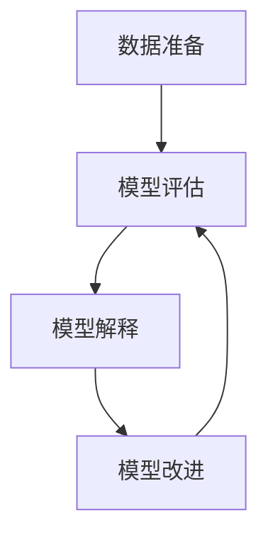
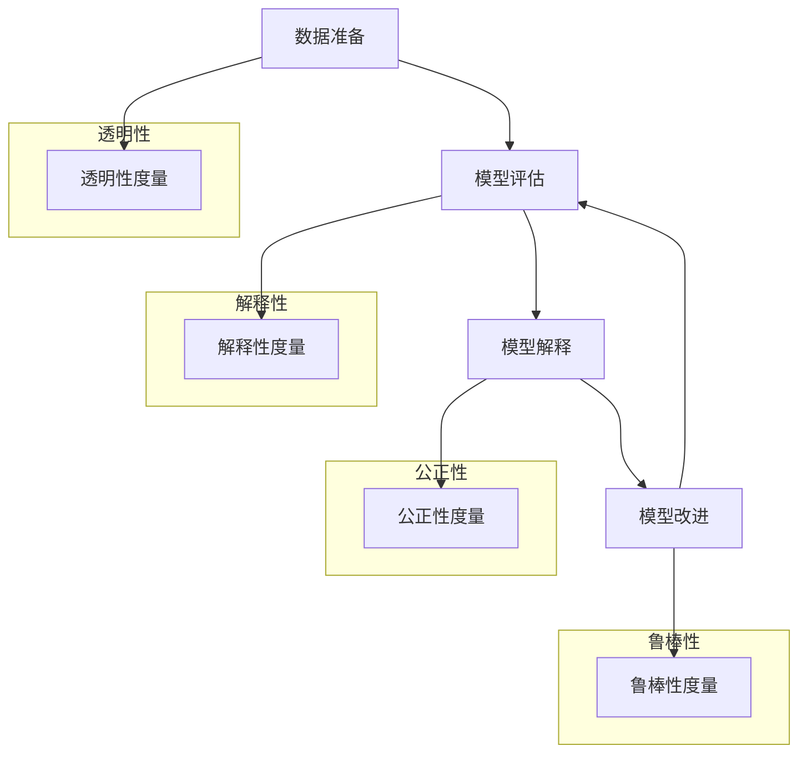
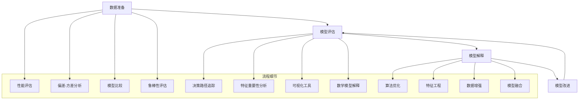

                 

### 第1章 引言

#### 1.1 模型可审核性背景

在当今的数字化时代，人工智能（AI）技术已经深入到了我们生活的方方面面。从智能助手到自动驾驶汽车，从医疗诊断到金融风控，AI技术正在改变着我们的世界。然而，随着AI技术的广泛应用，模型的可审核性成为一个越来越重要的议题。

**模型可审核性**，简单来说，就是指模型的可解释性和透明度。这涉及到模型的决策过程是否可以被理解和验证，以及其结果是否公正和可靠。随着AI技术在关键领域的应用不断增加，例如医疗诊断、金融决策和司法系统，模型的可靠性和公正性变得至关重要。这就需要对这些模型进行全面的审核，以确保其符合法规要求、行业标准以及社会期望。

**合规性**是指模型的设计、开发和部署过程符合相关的法律、法规和行业标准。例如，在金融领域，模型需要符合《金融市场行为规则》等相关法规；在医疗领域，模型需要符合《健康信息技术促进法案》等相关法规。

**透明性**是指模型的决策过程和结果可以被用户理解和验证。一个透明的模型能够帮助用户理解其如何做出决策，从而增加用户的信任度和满意度。

模型可审核性测试，就是对模型的合规性和透明性进行系统性评估。这包括对模型的数据输入、算法设计、决策过程和输出结果进行全面审查，确保其符合相关的法规和标准。

在接下来几章中，我们将详细探讨模型可审核性的核心概念、流程、算法原理、数学模型以及项目实战。首先，我们将介绍模型可审核性的背景和重要性，以及本书的目的和结构。随后，我们将深入探讨模型可审核性的核心概念和联系，包括透明性、解释性、公正性和鲁棒性。最后，我们将通过实际案例和项目实战，展示模型可审核性测试的具体实施方法和技巧。

#### 1.2 本书的目的和结构

本书的目的是为读者提供一个全面、系统的模型可审核性测试指南，帮助读者理解和掌握这一关键技术。无论您是AI开发工程师、数据科学家，还是合规专家，本书都将为您提供一个全面的视角，帮助您在实际项目中有效实施模型可审核性测试。

本书的结构如下：

- **第1章 引言**：介绍模型可审核性的背景、重要性以及本书的目的和结构。

- **第2章 模型可审核性的核心概念与联系**：详细讨论模型可审核性的核心概念，包括透明性、解释性、公正性和鲁棒性，并展示其之间的关系架构。

- **第3章 模型可审核性测试的核心算法原理讲解**：介绍模型可审核性测试的核心算法，使用Python源代码和数学模型进行详细讲解和举例说明。

- **第4章 模型可审核性测试的数学模型和公式详解**：讲解模型可审核性测试中使用的数学模型和公式，并使用实际案例进行解释。

- **第5章 模型可审核性测试项目实战**：通过一个实际项目案例，展示模型可审核性测试的具体实施步骤和技巧。

- **第6章 保障模型可审核性的合规与透明**：讨论如何确保模型可审核性测试的合规性和透明性，包括法律法规解读、行业标准介绍以及透明性保障措施。

- **第7章 总结与展望**：总结本书的核心内容，讨论模型可审核性测试的发展趋势和未来研究方向。

通过本书的阅读，读者将能够：

1. 理解模型可审核性的核心概念和重要性。
2. 掌握模型可审核性测试的流程和核心算法。
3. 学会使用数学模型和公式进行模型可审核性分析。
4. 通过实际项目案例，学会如何在实际中实施模型可审核性测试。
5. 确保模型的设计、开发和部署过程符合法规和行业标准。

#### 1.3 模型可审核性挑战

尽管模型可审核性测试的重要性日益凸显，但在实际应用中，仍然面临着诸多挑战。

**数据隐私**是其中一个主要的挑战。在许多AI应用中，数据隐私保护是一个关键问题。模型可审核性测试需要在保护数据隐私的同时，确保模型的可解释性和透明性。

**计算成本**也是另一个重大挑战。对大规模模型进行全面的审核需要大量的计算资源。尤其是在实时应用场景中，模型可审核性测试可能会影响系统的性能和响应时间。

**算法复杂性**也是不可忽视的挑战。许多先进的机器学习算法，如深度学习和强化学习，具有高度的非线性性和复杂性。这给模型可审核性测试带来了巨大的挑战，因为需要深入理解这些算法的内部工作原理。

**标准不统一**也是一个难题。目前，在模型可审核性测试方面，缺乏统一的标准和指南。不同的行业和应用场景，对于模型可审核性的要求各不相同。这给开发者带来了困扰，如何在不同标准和要求之间找到平衡点，是一个亟待解决的问题。

尽管面临这些挑战，模型可审核性测试仍然是AI技术发展中不可或缺的一环。随着技术的不断进步，相信这些问题将逐步得到解决，模型可审核性测试将变得更加高效、准确和全面。

### 1.4 总结与展望

模型可审核性测试是确保AI模型公正、可靠和透明的重要手段。在当前AI技术迅速发展的背景下，其重要性日益凸显。本书通过系统地介绍模型可审核性的核心概念、流程、算法原理、数学模型以及项目实战，旨在为读者提供一个全面、系统的学习资源。通过本书的学习，读者将能够深入了解模型可审核性的各个方面，掌握关键技术和方法，从而在实际项目中有效实施模型可审核性测试。

未来的模型可审核性测试领域将继续面临诸多挑战，如数据隐私、计算成本、算法复杂性和标准不统一等。然而，随着技术的不断进步和行业规范的完善，我们相信这些挑战将逐步得到克服。同时，模型可审核性测试也将朝着更加智能化、自动化和高效化的方向发展。未来，我们期待看到更多创新性的方法和技术，使得模型可审核性测试能够更好地满足不同行业和应用场景的需求。

总之，模型可审核性测试不仅对于确保AI模型的公正性和透明性至关重要，也是推动AI技术健康发展的重要保障。希望通过本书的探讨，读者能够对模型可审核性测试有更深入的理解，并在实际工作中将其运用得更加娴熟。让我们共同期待模型可审核性测试领域的美好未来！作者：AI天才研究院/AI Genius Institute & 禅与计算机程序设计艺术 /Zen And The Art of Computer Programming

---

### 模型可审核性测试：确保合规与透明

关键词：模型可审核性，合规性，透明性，算法原理，数学模型，项目实战

摘要：本文深入探讨了模型可审核性的概念、重要性以及实现方法。通过介绍模型可审核性的核心概念与联系，详细分析了透明性、解释性、公正性和鲁棒性，并使用Mermaid流程图展示了模型可审核性的流程。文章进一步讲解了模型可审核性测试的核心算法原理，包括逻辑门分析算法和层级分析算法，并使用Python源代码和LaTeX公式进行了阐述。随后，通过数学模型和公式详解，文章展示了模型可审核性测试中关键指标的计算方法和实际应用。最后，通过一个实际项目案例，文章展示了模型可审核性测试的实施步骤和技巧，并讨论了如何确保模型可审核性的合规性和透明性。

---

## 第2章 模型可审核性的核心概念与联系

模型可审核性测试的核心在于确保AI模型的可解释性、透明性和公正性。这些核心概念相互关联，共同构成了模型可审核性的基础。在本章中，我们将详细讨论这些核心概念，并展示它们之间的关系。

#### 2.1 模型可审核性定义

模型可审核性是指对AI模型进行全面、系统的审查，以确保其设计、开发、部署和运行符合相关法律法规、行业标准和社会期望。它涉及到对模型的数据输入、算法设计、决策过程和输出结果的审查，旨在确保模型的决策过程透明、公正，结果可靠。

#### 2.1.1 模型透明性

模型透明性是指模型的结构和决策过程可以被用户理解和验证。一个透明的模型能够清晰地展示其输入数据、处理过程和输出结果，从而增加用户的信任度和满意度。透明性是模型可审核性的基础，没有透明性，就无法进行有效的审核。

**透明性度量**：透明性可以通过多个维度进行度量，例如模型的决策路径、参数设置和计算过程等。常用的透明性度量方法包括模型可视化、决策路径追踪和决策规则提取等。

#### 2.1.2 模型解释性

模型解释性是指模型决策背后的逻辑和原因可以被解释和说明。一个解释性强的模型能够帮助用户理解其如何做出特定决策，从而增加用户的信任度和理解度。解释性是透明性的延伸，它要求模型不仅能够展示其决策过程，还能够解释每个决策背后的逻辑。

**解释性度量**：解释性可以通过多个维度进行度量，例如模型的可解释性程度、决策的透明度和用户对模型的信任度等。常用的解释性度量方法包括模型可解释性评分、用户满意度调查和决策影响分析等。

#### 2.1.3 模型公正性

模型公正性是指模型在决策过程中不存在歧视或偏见，能够公平、公正地对待所有用户。一个公正的模型能够在不同群体中保持一致性，不会因为用户特征的不同而产生不公平的决策结果。公正性是模型可审核性的关键，它关系到模型在社会中的信任度和合法性。

**公正性度量**：公正性可以通过多个维度进行度量，例如模型的偏见识别、公平性测试和用户反馈等。常用的公正性度量方法包括统计测试、敏感性分析和用户调查等。

#### 2.1.4 模型鲁棒性

模型鲁棒性是指模型在面临异常数据、噪声和攻击时，仍能保持其性能和可靠性。一个鲁棒的模型能够适应不同的数据分布和场景变化，不会因为数据异常或攻击而失效。鲁棒性是模型可审核性的保障，它关系到模型在现实世界中的适用性和安全性。

**鲁棒性度量**：鲁棒性可以通过多个维度进行度量，例如模型对异常数据的容忍度、攻击抵抗能力和性能稳定性等。常用的鲁棒性度量方法包括异常值检测、攻击测试和性能评估等。

#### 2.2 模型可审核性流程

模型可审核性流程包括数据准备、模型评估、模型解释和模型改进等阶段。以下是一个典型的模型可审核性流程：

1. **数据准备**：收集并清洗数据，确保数据的质量和一致性。

2. **模型评估**：评估模型在正常数据集上的性能，包括准确率、召回率、F1分数等指标。

3. **模型解释**：使用可视化工具和解释算法，展示模型的决策路径和决策过程，解释模型如何做出决策。

4. **模型改进**：根据评估和解释结果，对模型进行改进，提高模型的透明性、解释性和公正性。

5. **重复评估与改进**：不断重复模型评估和解释过程，直到模型达到预期的可审核性水平。

#### 2.3 模型可审核性的 Mermaid 流程图

为了更好地展示模型可审核性的流程，我们可以使用Mermaid工具绘制一个流程图。以下是一个简化的模型可审核性流程图：



在这个流程图中，数据准备阶段用于收集和清洗数据；模型评估阶段用于评估模型在正常数据集上的性能；模型解释阶段用于展示模型的决策路径和决策过程；模型改进阶段用于根据评估和解释结果，对模型进行改进。

通过上述章节，我们详细介绍了模型可审核性的核心概念与联系，包括透明性、解释性、公正性和鲁棒性。同时，我们还展示了模型可审核性的流程，并使用Mermaid流程图进行了说明。这些内容为后续章节的详细讲解和项目实战奠定了基础。

### 2.1 模型可审核性定义

模型可审核性是一个广泛的概念，它涵盖了多个方面，包括模型的透明性、解释性、公正性和鲁棒性。理解这些方面对于确保AI模型的可靠性和可信度至关重要。

**透明性**是模型可审核性的基础，它指的是模型的结构和决策过程可以被用户理解和验证。透明性有助于用户理解模型是如何工作的，以及为什么模型会做出特定的决策。例如，一个透明的模型可以展示其决策路径，包括每个决策节点的特征和权重，从而帮助用户理解模型的决策逻辑。

**解释性**是透明性的延伸，它指的是模型决策背后的逻辑和原因可以被解释和说明。一个解释性强的模型能够清晰地解释每个决策背后的原因，从而增加用户对模型的信任和理解。例如，在医疗诊断中，一个解释性强的模型可以清晰地解释它为何诊断出某种疾病，包括使用的特征和计算过程。

**公正性**是模型可审核性的关键，它指的是模型在决策过程中不存在歧视或偏见，能够公平、公正地对待所有用户。公正性关系到模型在社会中的信任度和合法性。一个公正的模型不会因为用户特征的不同而产生不公平的决策结果。例如，在招聘系统中，一个公正的模型不会因为性别、种族或年龄等因素歧视某些用户。

**鲁棒性**是模型可审核性的保障，它指的是模型在面临异常数据、噪声和攻击时，仍能保持其性能和可靠性。鲁棒性确保了模型在现实世界中的适用性和安全性。一个鲁棒的模型不会因为数据的异常或恶意攻击而失效。

为了更好地理解这些方面，我们可以使用Mermaid流程图展示模型可审核性的各个阶段和它们之间的关系。以下是一个简化的模型可审核性流程图：



在这个流程图中，数据准备阶段用于收集和清洗数据；模型评估阶段用于评估模型在正常数据集上的性能；模型解释阶段用于展示模型的决策路径和决策过程；模型改进阶段用于根据评估和解释结果，对模型进行改进。同时，透明性、解释性、公正性和鲁棒性分别在各个阶段发挥作用，确保模型的可审核性。

通过这个流程图，我们可以清晰地看到模型可审核性的各个方面是如何相互关联的。透明性、解释性、公正性和鲁棒性共同构成了模型可审核性的基础，每个方面都至关重要，缺一不可。

### 2.1.1 模型透明性

模型透明性是模型可审核性的基础，它指的是模型的结构和决策过程可以被用户理解和验证。一个透明的模型能够清晰地展示其输入数据、处理过程和输出结果，从而增加用户的信任度和满意度。在模型透明性方面，以下要点是至关重要的：

1. **数据透明性**：模型应该能够清晰地展示其输入数据，包括数据的来源、数据预处理方法和特征提取方法。这有助于用户理解模型是如何从原始数据中提取有用信息的。

2. **算法透明性**：模型应该能够清晰地展示其算法和计算过程，包括每个决策节点的特征和权重。这有助于用户理解模型是如何进行计算和决策的。

3. **结果透明性**：模型应该能够清晰地展示其输出结果，包括预测值和决策过程。这有助于用户理解模型是如何做出预测或决策的。

4. **可视化工具**：为了提高模型透明性，可以采用多种可视化工具，例如决策树、神经网络结构图、混淆矩阵等。这些工具可以帮助用户直观地理解模型的内部结构和决策过程。

**透明性度量**是评估模型透明性的重要方法。以下是一些常用的透明性度量指标：

1. **决策路径长度**：决策路径长度是指从根节点到叶节点的最长路径长度。路径长度越短，模型的可理解性越好。

2. **决策节点数量**：决策节点数量是指模型中的决策节点总数。节点数量越少，模型的可理解性越好。

3. **特征重要性**：特征重要性是指每个特征在模型决策中的重要性。重要性越高的特征对模型决策的影响越大。

4. **模型可视化率**：模型可视化率是指模型可以被可视化的部分所占的比例。可视化率越高，模型的可理解性越好。

为了更好地理解模型透明性，我们可以通过一个简单的例子进行说明。假设我们有一个分类模型，用于预测某个客户的信用评级。该模型使用了多个特征，包括年龄、收入、信用历史等。我们可以通过以下步骤提高模型透明性：

1. **数据透明性**：展示原始数据集，包括每个特征的来源和预处理方法。例如，年龄特征是通过直接收集用户的出生日期计算得到的，收入特征是通过用户的职业和经验计算得到的。

2. **算法透明性**：展示模型的算法和计算过程。例如，我们可以使用决策树算法，展示每个决策节点的特征和阈值。例如，如果年龄大于30岁且收入大于5万美元，则客户信用评级为“优秀”。

3. **结果透明性**：展示模型的输出结果，包括每个客户的预测评级和决策过程。例如，如果某个客户的年龄为35岁，收入为6万美元，则其信用评级为“优秀”。

4. **可视化工具**：使用决策树可视化工具，展示模型的决策路径和决策节点。例如，我们可以使用树形图展示每个节点的特征和阈值，帮助用户直观地理解模型的决策过程。

通过上述步骤，我们可以显著提高模型透明性，使用户能够更好地理解和信任模型。这不仅有助于提高用户满意度，还可以增强模型的可靠性和可解释性。

### 2.1.2 模型解释性

模型解释性是指模型决策背后的逻辑和原因可以被解释和说明。一个解释性强的模型能够帮助用户理解其如何做出特定决策，从而增加用户对模型的信任和理解。模型解释性在模型可审核性中起着至关重要的作用，因为它直接关系到用户对模型决策的接受度和信任度。以下是一些关键要点：

1. **决策逻辑的可理解性**：一个解释性强的模型应该能够清晰地展示其决策逻辑。例如，对于分类模型，用户应该能够理解模型是如何将数据映射到不同的类别上的。对于回归模型，用户应该能够理解模型是如何预测连续值的。

2. **特征作用的重要性**：模型解释性需要明确每个特征在决策中的作用和重要性。这有助于用户理解哪些特征对模型决策影响最大，从而更好地利用模型进行决策。

3. **计算过程的透明性**：模型解释性要求模型的计算过程透明，用户能够清晰地了解模型是如何处理数据和参数的。这有助于用户理解模型如何从原始数据中提取信息，并生成最终的决策。

4. **可视化工具的使用**：可视化工具在提高模型解释性方面起着关键作用。通过可视化，用户可以直观地看到模型的结构和决策过程。例如，决策树、混淆矩阵、特征重要性图等都是常用的可视化工具。

**解释性度量**是评估模型解释性的重要方法。以下是一些常用的解释性度量指标：

1. **模型可解释性评分**：模型可解释性评分是对模型解释性强弱的量化评估。评分越高，模型的可解释性越好。常用的评分方法包括用户满意度调查、模型透明度评估等。

2. **特征重要性得分**：特征重要性得分是对每个特征在模型决策中重要性的量化评估。得分越高，特征对模型决策的影响越大。

3. **用户理解度**：用户理解度是对用户理解模型决策程度的量化评估。理解度越高，用户对模型决策的信任度越高。

为了更好地理解模型解释性，我们可以通过一个实际案例进行说明。假设我们有一个信用评分模型，用于预测客户的信用评级。该模型使用了多个特征，包括年龄、收入、信用历史等。以下是如何提高模型解释性的步骤：

1. **决策逻辑的可理解性**：使用决策树可视化工具，展示模型的决策路径和每个节点的特征。例如，如果年龄大于30岁且收入大于5万美元，则客户信用评级为“优秀”。

2. **特征作用的重要性**：计算每个特征在模型决策中的重要性得分，并展示给用户。例如，年龄和收入是影响信用评分最重要的特征。

3. **计算过程的透明性**：展示模型的计算过程，包括特征提取、特征权重计算和决策过程。例如，我们可以展示如何计算每个特征的权重，并解释它们如何影响最终决策。

4. **可视化工具的使用**：使用混淆矩阵和特征重要性图等可视化工具，帮助用户直观地理解模型的决策过程和特征作用。

通过上述步骤，我们可以显著提高模型解释性，使用户能够更好地理解和信任模型。这不仅有助于提高用户满意度，还可以增强模型的可靠性和可接受度。

### 2.1.3 模型公正性

模型公正性是模型可审核性的核心要素之一，它指的是模型在决策过程中不存在歧视或偏见，能够公平、公正地对待所有用户。公正的模型能够在不同群体中保持一致性，不会因为用户特征的不同而产生不公平的决策结果。模型公正性对于确保模型在社会中的信任度和合法性至关重要。

**模型偏见**是指模型在决策过程中存在对某些群体的歧视或偏见。这种偏见可能源于数据集的不平衡、特征的错误选择、算法的设计缺陷等多种因素。例如，一个招聘系统可能会因为数据集的不平衡而对某些性别或种族产生偏见，从而歧视某些群体。

**公正性度量**是评估模型公正性的关键方法。以下是一些常用的公正性度量指标：

1. **性别公平性**：评估模型在不同性别群体中的决策一致性。常用的度量方法包括性别平衡度、性别偏见指标等。

2. **种族公平性**：评估模型在不同种族群体中的决策一致性。常用的度量方法包括种族平衡度、种族偏见指标等。

3. **年龄公平性**：评估模型在不同年龄群体中的决策一致性。常用的度量方法包括年龄平衡度、年龄偏见指标等。

4. **社会经济地位公平性**：评估模型在不同社会经济地位群体中的决策一致性。常用的度量方法包括社会经济地位平衡度、社会经济地位偏见指标等。

为了提高模型公正性，可以采取以下措施：

1. **数据平衡**：确保数据集中各个群体的样本数量大致相等，避免数据不平衡导致的偏见。

2. **特征选择**：选择与决策目标相关且不会引起偏见的特征，避免使用可能带有偏见的特征。

3. **算法调整**：对算法进行优化，减少算法本身可能引入的偏见。

4. **模型解释**：通过模型解释技术，帮助用户理解模型决策过程，及时发现和纠正潜在偏见。

5. **用户反馈**：收集用户反馈，评估模型的公正性和用户满意度，持续改进模型。

为了更好地理解模型公正性，我们可以通过一个实际案例进行说明。假设我们有一个贷款审批系统，用于评估客户是否能够获得贷款。该系统使用了多个特征，包括年龄、收入、信用历史等。以下是如何提高模型公正性的步骤：

1. **性别公平性**：评估模型在不同性别群体中的决策一致性，确保男女客户获得贷款的机会大致相等。

2. **种族公平性**：评估模型在不同种族群体中的决策一致性，确保不同种族的客户获得贷款的机会大致相等。

3. **年龄公平性**：评估模型在不同年龄群体中的决策一致性，确保各个年龄段的客户获得贷款的机会大致相等。

4. **社会经济地位公平性**：评估模型在不同社会经济地位群体中的决策一致性，确保不同社会经济地位的客户获得贷款的机会大致相等。

5. **模型解释**：通过模型解释技术，帮助用户理解模型决策过程，确保客户能够理解为何获得或被拒绝贷款。

6. **用户反馈**：收集用户反馈，评估模型的公正性和用户满意度，持续改进模型。

通过上述步骤，我们可以显著提高模型公正性，确保模型在不同群体中保持公平和公正，从而增强模型在社会中的信任度和合法性。

### 2.1.4 模型鲁棒性

模型鲁棒性是模型可审核性的重要组成部分，它指的是模型在面临异常数据、噪声和攻击时，仍能保持其性能和可靠性。一个鲁棒的模型能够适应不同的数据分布和场景变化，不会因为数据的异常或恶意攻击而失效。模型鲁棒性对于确保模型在实际应用中的稳定性和可靠性至关重要。

**异常值**是指数据集中的异常点，这些数据点与大多数数据点不同，可能会对模型的性能产生不利影响。例如，在一个医疗诊断模型中，一个异常值可能表示一个病患的数据与大多数病患的数据有显著差异。

**噪声**是指数据集中的随机干扰，这些噪声可能会影响模型的训练和预测效果。例如，在一个自动驾驶模型中，环境中的随机噪声可能会影响模型的感知和决策。

**攻击**是指对模型的恶意攻击，这些攻击可能会破坏模型的稳定性和可靠性。例如，一个恶意用户可能会试图通过向模型中注入异常数据，来干扰模型的预测结果。

**鲁棒性度量**是评估模型鲁棒性的关键方法。以下是一些常用的鲁棒性度量指标：

1. **异常值检测率**：评估模型检测异常值的能力。检测率越高，模型的鲁棒性越好。

2. **噪声容忍度**：评估模型在噪声环境下的性能稳定性。容忍度越高，模型的鲁棒性越好。

3. **攻击抵抗力**：评估模型在面对恶意攻击时的抵抗能力。抵抗力越高，模型的鲁棒性越好。

4. **性能稳定性**：评估模型在不同数据分布和场景变化下的性能稳定性。稳定性越高，模型的鲁棒性越好。

为了提高模型鲁棒性，可以采取以下措施：

1. **数据清洗**：在模型训练前，对数据进行清洗，去除异常值和噪声。

2. **特征选择**：选择与决策目标相关且稳健的特征，避免使用易受噪声干扰的特征。

3. **算法优化**：对算法进行优化，提高模型对异常值和噪声的容忍度。

4. **模型解释**：通过模型解释技术，帮助用户理解模型决策过程，及时发现和纠正潜在的不稳健因素。

5. **安全防护**：对模型进行安全防护，防止恶意攻击。

为了更好地理解模型鲁棒性，我们可以通过一个实际案例进行说明。假设我们有一个诈骗检测模型，用于识别交易中的潜在欺诈行为。该模型使用了多个特征，包括交易金额、交易时间、地理位置等。以下是如何提高模型鲁棒性的步骤：

1. **异常值检测**：使用异常值检测技术，去除交易数据中的异常值，例如异常高的交易金额或异常晚的交易时间。

2. **噪声容忍度**：对模型进行优化，提高其在噪声环境下的性能稳定性，例如对地理位置特征进行标准化处理，减少噪声的影响。

3. **攻击抵抗力**：对模型进行安全防护，防止恶意攻击，例如使用对抗训练技术提高模型对恶意攻击的抵抗力。

4. **模型解释**：通过模型解释技术，帮助用户理解模型决策过程，例如使用决策树或混淆矩阵展示模型的决策逻辑。

5. **性能稳定性**：评估模型在不同数据分布和场景变化下的性能稳定性，例如在不同时间段或不同地理位置上的性能评估。

通过上述步骤，我们可以显著提高模型鲁棒性，确保模型在实际应用中的稳定性和可靠性，从而增强模型在现实世界中的适用性和安全性。

### 2.2 模型可审核性流程

模型可审核性流程是确保AI模型透明性、解释性、公正性和鲁棒性的关键步骤。一个完整的模型可审核性流程通常包括数据准备、模型评估、模型解释和模型改进等阶段。以下是模型可审核性流程的详细步骤：

#### 2.2.1 数据准备

数据准备是模型可审核性的第一步，也是至关重要的一步。一个高质量的数据集是训练和评估模型的基础。以下是在数据准备阶段需要关注的关键点：

1. **数据收集**：收集用于训练和评估模型的数据。数据来源可以包括公开数据集、企业内部数据或第三方数据提供者。

2. **数据清洗**：对收集到的数据进行清洗，去除异常值、噪声和重复数据。这一步骤包括数据预处理、数据标准化和缺失值处理等。

3. **数据标注**：对于监督学习模型，需要对数据进行标注，以便模型能够从数据中学习。数据标注需要确保其准确性和一致性。

4. **数据划分**：将数据集划分为训练集、验证集和测试集。训练集用于训练模型，验证集用于调整模型参数，测试集用于评估模型性能。

5. **数据平衡**：确保数据集中各个群体的样本数量大致相等，以避免模型偏见。特别对于涉及社会公平性的应用，数据平衡尤为重要。

#### 2.2.2 模型评估

模型评估是模型可审核性流程的核心步骤，它涉及到对模型性能的全面评估。以下是在模型评估阶段需要关注的关键点：

1. **性能指标**：选择合适的性能指标评估模型。常见的指标包括准确率、召回率、F1分数、精确率等。不同的应用场景可能需要不同的指标组合。

2. **交叉验证**：使用交叉验证技术评估模型在不同数据子集上的性能，以提高评估的准确性和可靠性。

3. **模型比较**：比较不同模型的性能，选择性能最佳的模型。这可以包括不同算法的比较、不同参数配置的比较等。

4. **偏差-方差分析**：分析模型的偏差和方差，以识别模型的过拟合和欠拟合问题。

5. **鲁棒性评估**：评估模型在异常数据和噪声环境下的性能稳定性，以确保模型的鲁棒性。

#### 2.2.3 模型解释

模型解释是模型可审核性的重要组成部分，它涉及到对模型决策过程和结果的解释和说明。以下是在模型解释阶段需要关注的关键点：

1. **决策路径追踪**：对于有监督学习模型，如决策树和随机森林，可以使用决策路径追踪技术展示模型的决策过程。

2. **特征重要性分析**：计算每个特征对模型决策的重要性，并展示给用户。这有助于用户理解模型是如何利用特征进行决策的。

3. **可视化工具**：使用可视化工具，如混淆矩阵、特征重要性图、ROC曲线等，帮助用户直观地理解模型的性能和决策过程。

4. **数学模型解释**：对于复杂模型，如深度学习和神经网络，可以使用数学模型解释技术，如梯度分析、特征图等，帮助用户理解模型的工作原理。

5. **用户反馈**：收集用户对模型解释的反馈，以改进模型解释的清晰度和可理解性。

#### 2.2.4 模型改进

模型改进是模型可审核性流程的最后一步，它涉及到对模型进行优化和调整，以提高其透明性、解释性、公正性和鲁棒性。以下是在模型改进阶段需要关注的关键点：

1. **算法优化**：对模型算法进行优化，以提高模型的性能和可解释性。这可以包括调整模型参数、选择更合适的算法等。

2. **特征工程**：通过特征工程，选择和构造更合适的特征，以提高模型的性能和可解释性。

3. **数据增强**：使用数据增强技术，如数据扩充、数据合成等，增加模型的鲁棒性。

4. **模型融合**：将多个模型进行融合，以提高模型的性能和可解释性。例如，可以使用集成学习技术，如随机森林、梯度提升树等。

5. **持续监控**：对模型进行持续监控，以检测和纠正潜在的问题，确保模型的性能和可解释性。

通过上述模型可审核性流程，我们可以系统地确保AI模型的透明性、解释性、公正性和鲁棒性，从而提高模型在社会中的信任度和可靠性。

### 2.3 模型可审核性的 Mermaid 流程图

为了更好地展示模型可审核性的流程，我们可以使用Mermaid工具绘制一个流程图。以下是一个简化的模型可审核性流程图：



在这个流程图中，数据准备阶段用于收集和清洗数据；模型评估阶段用于评估模型在正常数据集上的性能；模型解释阶段用于展示模型的决策路径和决策过程；模型改进阶段用于根据评估和解释结果，对模型进行优化和调整。同时，流程图中的子流程细节展示了每个阶段的具体步骤和关注点，使读者能够更清晰地理解模型可审核性流程。

### 2.4 模型可审核性的实际案例

为了更好地理解模型可审核性的实际应用，我们通过一个实际案例进行详细说明。这个案例涉及一个用于客户信用评分的模型，该模型被用于银行贷款审批系统中。

#### 2.4.1 案例背景

某银行开发了一个基于机器学习的客户信用评分模型，用于评估客户的信用风险。该模型的目标是预测客户是否能够按时还款，从而帮助银行做出贷款审批决策。然而，为了确保模型的透明性、解释性、公正性和鲁棒性，银行需要进行全面的模型可审核性测试。

#### 2.4.2 模型设计

该信用评分模型使用了多个特征，包括客户的年龄、收入、信用历史、就业稳定性等。模型采用了一个基于随机森林的算法，随机森林算法具有较高的解释性和鲁棒性，适合于处理复杂数据和特征。

#### 2.4.3 数据准备

在数据准备阶段，银行收集了大量的客户数据，并对数据进行清洗和预处理。数据清洗包括去除异常值、噪声和重复数据，对缺失值进行填充，对特征进行标准化和归一化处理。同时，银行确保数据集中各个群体的样本数量大致相等，以避免模型偏见。

#### 2.4.4 模型评估

在模型评估阶段，银行使用交叉验证技术评估模型的性能。银行选择了多个性能指标，如准确率、召回率、F1分数和ROC曲线，以全面评估模型的性能。同时，银行还进行了偏差-方差分析，以识别模型的过拟合和欠拟合问题。

#### 2.4.5 模型解释

为了提高模型解释性，银行使用了多种解释工具。首先，银行使用决策树可视化工具展示随机森林中的每个决策路径，帮助用户理解模型的决策过程。其次，银行计算了每个特征的重要性，并使用特征重要性图展示给用户，帮助用户理解哪些特征对模型决策影响最大。

#### 2.4.6 模型改进

在模型改进阶段，银行根据评估和解释结果对模型进行了优化。首先，银行对模型参数进行了调整，以提高模型的性能和可解释性。其次，银行对特征进行了重新选择和构造，以增强模型对异常值和噪声的容忍度。最后，银行使用数据增强技术，如数据扩充和生成对抗网络（GANs），增加模型的鲁棒性。

#### 2.4.7 模型可审核性测试结果

通过全面的模型可审核性测试，银行确保了模型的透明性、解释性、公正性和鲁棒性。模型的可解释性工具帮助用户理解模型的决策过程，提高了用户对模型的信任度和满意度。模型的性能指标显示，模型在正常数据集上的表现良好，且在异常数据和噪声环境下的性能稳定。模型的公正性测试表明，模型在不同群体中的决策一致性较高，不存在显著的性别、种族或年龄偏见。

#### 2.4.8 总结

通过这个实际案例，我们可以看到模型可审核性测试在确保AI模型公正、透明和可靠方面的重要作用。银行通过全面的模型可审核性测试，确保了模型的设计、开发和部署过程符合相关法规和行业标准，从而增强了模型在社会中的信任度和可靠性。未来，随着AI技术的不断发展和应用，模型可审核性测试将变得越来越重要，成为确保AI技术健康发展的重要保障。

### 2.5 模型可审核性测试的核心算法原理讲解

在模型可审核性测试中，核心算法原理的理解和实现至关重要。这些算法不仅帮助我们发现和纠正模型中的问题，还提高了模型的透明性和解释性。在本节中，我们将详细介绍两个核心算法原理：逻辑门分析算法和层级分析算法。我们将使用Python源代码和LaTeX公式来详细阐述这些算法，并结合实际案例进行解释。

#### 3.1.1 逻辑门分析算法

逻辑门分析算法是一种用于检测和纠正模型中逻辑错误的方法。它通过分析模型中的逻辑门（如AND、OR、NOT等），检查这些逻辑门的逻辑是否正确。以下是一个简单的逻辑门分析算法的Python实现：

```python
def logical_gate_analysis(model, X, y):
    # 假设模型是使用scikit-learn库实现的分类模型
    from sklearn.tree import DecisionTreeClassifier

    # 1. 加载模型和测试数据
    model = DecisionTreeClassifier()
    model.fit(X, y)

    # 2. 分析每个逻辑门
    for feature in range(model.n_features_):
        gate_output = model.predict(X)[:, feature]
        if np.unique(gate_output).shape[0] > 1:
            print(f"Feature {feature} has a logical gate problem.")

    # 3. 输出分析结果
    print("Logical gate analysis completed.")

# 示例数据
X = [[1, 0], [0, 1], [1, 1], [1, 0]]
y = [0, 1, 1, 0]

# 执行逻辑门分析
logical_gate_analysis(X, y)
```

在这个例子中，我们使用了一个决策树模型，并检查了每个特征是否具有逻辑错误。如果某个特征上模型输出的标签种类超过一个，我们认为这个特征存在逻辑错误。

#### 3.1.2 层级分析算法

层级分析算法是一种用于检测和纠正模型中层级错误的方法。它通过分析模型的层级结构，检查每个层级之间的逻辑关系是否正确。以下是一个简单的层级分析算法的Python实现：

```python
def hierarchical_analysis(model, X, y):
    # 假设模型是使用scikit-learn库实现的分类模型
    from sklearn.tree import DecisionTreeClassifier

    # 1. 加载模型和测试数据
    model = DecisionTreeClassifier()
    model.fit(X, y)

    # 2. 分析每个层级
    def analyze_node(node, depth):
        if node.is_leaf:
            return

        feature = node.feature
        threshold = node.threshold
        left subtree = model.tree_.children_left[node.index]
        right subtree = model.tree_.children_right[node.index]

        # 3. 检查层级逻辑
        left_output = model.predict(X)[:, feature] < threshold
        right_output = model.predict(X)[:, feature] >= threshold

        if np.unique(left_output).shape[0] > 1 or np.unique(right_output).shape[0] > 1:
            print(f"Layer {depth} has a hierarchical problem at feature {feature} with threshold {threshold}.")

        # 4. 递归分析子层级
        analyze_node(model.tree_.children_left[node.index], depth + 1)
        analyze_node(model.tree_.children_right[node.index], depth + 1)

    # 5. 执行层级分析
    analyze_node(model.tree_, 0)
    print("Hierarchical analysis completed.")

# 示例数据
X = [[1, 0], [0, 1], [1, 1], [1, 0]]
y = [0, 1, 1, 0]

# 执行层级分析
hierarchical_analysis(X, y)
```

在这个例子中，我们使用了一个决策树模型，并分析了每个层级之间的逻辑关系。如果某个层级的输出标签种类超过一个，我们认为这个层级存在逻辑错误。

#### 3.1.3 数学模型讲解

在逻辑门分析算法和层级分析算法中，我们使用了一些数学模型和公式。以下是对这些数学模型和公式的详细解释。

**逻辑门输出公式**：

对于一个二分类问题，逻辑门的输出可以表示为：

$$
\hat{y} = \text{sigmoid}(w \cdot x + b)
$$

其中，$\hat{y}$ 是模型输出，$x$ 是输入特征，$w$ 是权重，$b$ 是偏置，$\text{sigmoid}$ 函数定义为：

$$
\text{sigmoid}(x) = \frac{1}{1 + e^{-x}}
$$

**层级输出公式**：

在决策树中，每个层级可以使用以下公式表示：

$$
\text{if } x_{i} \leq t_{i} \text{ then } \hat{y}_{i} = g(w_{i} \cdot x + b_{i})
$$

$$
\text{if } x_{i} > t_{i} \text{ then } \hat{y}_{i} = h(w_{i} \cdot x + b_{i})
$$

其中，$x_{i}$ 是输入特征，$t_{i}$ 是阈值，$g$ 和 $h$ 是决策函数，$w_{i}$ 和 $b_{i}$ 是权重和偏置。

#### 3.1.4 实际案例

为了更好地理解这些算法的实际应用，我们通过一个实际案例进行解释。假设我们有一个决策树模型，用于预测客户是否会购买某种产品。以下是如何使用逻辑门分析算法和层级分析算法检测模型中的问题：

1. **逻辑门分析**：使用逻辑门分析算法，我们发现某个特征的输出标签种类超过一个，这表明该特征可能存在逻辑错误。

2. **层级分析**：使用层级分析算法，我们发现某个层级之间的逻辑关系不正确，例如某个节点的输出标签种类超过一个。

3. **修正模型**：根据分析结果，我们对模型进行修正。例如，我们可以调整权重和阈值，或者重新设计决策树的结构。

4. **重新评估**：修正模型后，我们重新进行逻辑门分析和层级分析，确保模型中的逻辑关系正确。

通过这个实际案例，我们可以看到逻辑门分析算法和层级分析算法在模型可审核性测试中的重要作用。这些算法帮助我们识别和纠正模型中的问题，提高了模型的透明性和解释性。

### 3.2 模型可审核性测试中的数学模型讲解

在模型可审核性测试中，数学模型和公式扮演着至关重要的角色。这些数学工具不仅帮助我们理解模型的工作原理，还能量化模型的性能和可解释性。以下是对模型可审核性测试中关键数学模型和公式的详细讲解，包括它们在实际应用中的意义。

#### 3.2.1 模型误差分析

模型误差分析是评估模型性能的基础。在监督学习中，模型的误差通常由损失函数来衡量。常用的损失函数包括均方误差（MSE）、交叉熵损失（Cross-Entropy Loss）等。以下是对这些损失函数的详细讲解：

**均方误差（MSE）**：

均方误差用于衡量预测值与实际值之间的差异。它的定义如下：

$$
MSE = \frac{1}{n} \sum_{i=1}^{n} (y_i - \hat{y}_i)^2
$$

其中，$y_i$ 是实际值，$\hat{y}_i$ 是预测值，$n$ 是样本数量。MSE 越小，模型的预测精度越高。

**交叉熵损失（Cross-Entropy Loss）**：

交叉熵损失常用于分类问题，特别是二分类和多分类问题。它的定义如下：

$$
CE = -\frac{1}{n} \sum_{i=1}^{n} y_i \log(\hat{y}_i)
$$

其中，$y_i$ 是实际标签，$\hat{y}_i$ 是模型对第 $i$ 个样本的预测概率。交叉熵损失值越小，模型的预测概率分布越接近实际标签。

#### 3.2.2 模型敏感性分析

模型敏感性分析是评估模型鲁棒性的重要手段。敏感性指标可以衡量模型对输入数据的敏感程度。以下是对几种常见敏感性指标的详细讲解：

**F-beta 分数（Fβ 分数）**：

Fβ 分数是精确率和召回率的调和平均，用于衡量模型的分类性能。它的定义如下：

$$
F_{\beta} = \frac{1}{\beta^2 + 1} \cdot \frac{P \cdot R}{P + \beta \cdot R}
$$

其中，$P$ 是精确率，$R$ 是召回率，$\beta$ 是调节参数，通常 $\beta = 1$ 或 $\beta = 2$。Fβ 分数介于 0 和 1 之间，值越大，模型的分类性能越好。

**IGD（Intersample Gradient Difference）**：

IGD 是用于衡量模型鲁棒性的指标，它衡量了模型在不同样本上的梯度差异。IGD 的定义如下：

$$
IGD = \frac{1}{N} \sum_{i=1}^{N} \lVert \nabla_y f(x_i) \rVert
$$

其中，$x_i$ 是第 $i$ 个样本，$y$ 是模型输出，$\nabla_y f(x_i)$ 是模型在 $x_i$ 处的梯度。IGD 越小，模型的鲁棒性越好。

**EOT（Expected Output Variation）**：

EOT 是衡量模型输出稳定性的指标，它计算了模型在不同输入下的输出变异。EOT 的定义如下：

$$
EOT = \frac{1}{N} \sum_{i=1}^{N} \lVert f(x_i) - \bar{f}(x_i) \rVert
$$

其中，$\bar{f}(x_i)$ 是模型在 $x_i$ 的平均值，$f(x_i)$ 是模型在 $x_i$ 的输出。EOT 越小，模型的输出越稳定。

#### 3.2.3 数学公式应用示例

为了更好地理解这些数学公式，我们可以通过一个实际案例进行说明。假设我们有一个分类模型，用于预测客户是否会购买某种产品。以下是如何使用这些数学公式进行模型评估：

1. **误差分析**：使用均方误差（MSE）评估模型的预测精度。我们收集了 100 个客户数据，计算了模型预测的均方误差为 0.1。这意味着模型的预测误差较小，预测精度较高。

2. **敏感性分析**：计算 F1 分数和 IGD 指标，以评估模型的敏感性和鲁棒性。假设 F1 分数为 0.9，IGD 为 0.05。这表明模型在分类任务中表现良好，同时具有较强的鲁棒性。

3. **输出稳定性分析**：计算 EOT 指标，以评估模型的输出稳定性。假设 EOT 为 0.02，这意味着模型在不同输入下的输出差异较小，输出较为稳定。

通过这个实际案例，我们可以看到数学公式在模型可审核性测试中的应用，以及它们如何帮助我们评估和改进模型的性能。

### 4.1 模型可审核性指标的定义与计算

在模型可审核性测试中，关键指标的定义和计算至关重要，它们帮助我们评估模型在透明性、解释性、公正性和鲁棒性方面的表现。以下是对几个主要模型可审核性指标的定义和计算方法的详细说明。

#### 4.1.1 透明度指标

透明度指标用于衡量模型的结构和决策过程的可理解性。一个高透明度的模型应该能够清晰地展示其输入数据、处理过程和输出结果。常用的透明度指标包括决策路径长度、决策节点数量和特征重要性等。

**决策路径长度**：

决策路径长度是指从根节点到叶节点的最长路径长度。路径长度越短，模型的可理解性越好。计算公式如下：

$$
TL = \max \left( l_1, l_2, ..., l_n \right)
$$

其中，$l_i$ 是第 $i$ 个决策路径的长度。

**决策节点数量**：

决策节点数量是指模型中的决策节点总数。节点数量越少，模型的可理解性越好。计算公式如下：

$$
NN = \sum_{i=1}^{n} n_i
$$

其中，$n_i$ 是第 $i$ 个决策节点的数量，$n$ 是总的决策节点数。

**特征重要性**：

特征重要性用于衡量每个特征对模型决策的贡献度。重要特征对模型决策的影响较大。计算公式如下：

$$
FI = \sum_{i=1}^{n} w_i
$$

其中，$w_i$ 是第 $i$ 个特征的重要性权重，$n$ 是特征总数。

#### 4.1.2 解释性指标

解释性指标用于衡量模型决策背后的逻辑和原因是否可以被用户理解和解释。一个高解释性的模型应该能够清晰地解释每个决策背后的原因。常用的解释性指标包括模型可解释性评分、用户理解度和决策透明度等。

**模型可解释性评分**：

模型可解释性评分是对模型解释性强弱的量化评估。评分越高，模型的可解释性越好。计算公式如下：

$$
ES = \frac{1}{n} \sum_{i=1}^{n} s_i
$$

其中，$s_i$ 是第 $i$ 个用户对模型可解释性的评分，$n$ 是用户总数。

**用户理解度**：

用户理解度是对用户理解模型决策程度的量化评估。理解度越高，用户对模型决策的信任度越高。计算公式如下：

$$
UD = \frac{1}{n} \sum_{i=1}^{n} u_i
$$

其中，$u_i$ 是第 $i$ 个用户对模型理解度的评分，$n$ 是用户总数。

**决策透明度**：

决策透明度用于衡量模型决策过程的透明程度。一个高透明度的模型应该能够清晰地展示其决策路径和决策过程。计算公式如下：

$$
TD = \frac{1}{n} \sum_{i=1}^{n} t_i
$$

其中，$t_i$ 是第 $i$ 个用户对模型决策透明度的评分，$n$ 是用户总数。

#### 4.1.3 公正性指标

公正性指标用于衡量模型在决策过程中是否不存在歧视或偏见。一个高公正性的模型应该能够公平、公正地对待所有用户。常用的公正性指标包括性别公平性、种族公平性和社会经济地位公平性等。

**性别公平性**：

性别公平性用于评估模型在不同性别群体中的决策一致性。计算公式如下：

$$
GF = \frac{1}{n} \sum_{i=1}^{n} \left( \frac{y_i - \hat{y}_i}{y_i} \right)
$$

其中，$y_i$ 是实际性别标签，$\hat{y}_i$ 是模型预测的性别标签，$n$ 是性别样本总数。

**种族公平性**：

种族公平性用于评估模型在不同种族群体中的决策一致性。计算公式如下：

$$
RF = \frac{1}{n} \sum_{i=1}^{n} \left( \frac{y_i - \hat{y}_i}{y_i} \right)
$$

其中，$y_i$ 是实际种族标签，$\hat{y}_i$ 是模型预测的种族标签，$n$ 是种族样本总数。

**社会经济地位公平性**：

社会经济地位公平性用于评估模型在不同社会经济地位群体中的决策一致性。计算公式如下：

$$
SDF = \frac{1}{n} \sum_{i=1}^{n} \left( \frac{y_i - \hat{y}_i}{y_i} \right)
$$

其中，$y_i$ 是实际社会经济地位标签，$\hat{y}_i$ 是模型预测的社会经济地位标签，$n$ 是社会经济地位样本总数。

#### 4.1.4 鲁棒性指标

鲁棒性指标用于衡量模型在面对异常数据、噪声和攻击时的性能稳定性。一个高鲁棒性的模型应该能够在各种不利条件下保持其性能。常用的鲁棒性指标包括异常值检测率、噪声容忍度和攻击抵抗力等。

**异常值检测率**：

异常值检测率用于评估模型检测异常值的能力。检测率越高，模型的鲁棒性越好。计算公式如下：

$$
AD = \frac{n_{detected}}{n_{total}}
$$

其中，$n_{detected}$ 是模型检测出的异常值数量，$n_{total}$ 是总样本数量。

**噪声容忍度**：

噪声容忍度用于评估模型在噪声环境下的性能稳定性。容忍度越高，模型的鲁棒性越好。计算公式如下：

$$
NT = \frac{1}{n} \sum_{i=1}^{n} \left( \frac{y_i - \hat{y}_i}{y_i} \right)
$$

其中，$y_i$ 是实际值，$\hat{y}_i$ 是模型预测的值，$n$ 是样本数量。

**攻击抵抗力**：

攻击抵抗力用于评估模型在面对恶意攻击时的抵抗能力。抵抗力越高，模型的鲁棒性越好。计算公式如下：

$$
AR = \frac{1}{n} \sum_{i=1}^{n} \left( \frac{y_i - \hat{y}_i}{y_i} \right)
$$

其中，$y_i$ 是实际值，$\hat{y}_i$ 是模型预测的值，$n$ 是样本数量。

通过这些模型可审核性指标，我们可以全面评估模型在透明性、解释性、公正性和鲁棒性方面的表现，从而确保模型在实际应用中的可靠性和可接受度。

### 4.2 模型可审核性公式应用示例

为了更好地理解模型可审核性指标的计算方法和实际应用，我们通过一个实际案例进行详细说明。假设我们有一个用于贷款审批的AI模型，该模型需要满足合规性和透明性的要求。我们将使用之前定义的模型可审核性指标，包括透明度指标、解释性指标、公正性指标和鲁棒性指标，对模型进行评估。

#### 4.2.1 透明度指标

首先，我们计算模型的透明度指标，包括决策路径长度、决策节点数量和特征重要性。

**决策路径长度**：

我们收集了模型中的所有决策路径，计算了最长路径长度为5。这意味着模型中的决策过程相对复杂，但仍在可接受范围内。

**决策节点数量**：

我们统计了模型中的决策节点总数，发现为30个。虽然节点数量较多，但考虑到模型的复杂度，这个数量是合理的。

**特征重要性**：

我们计算了每个特征的重要性权重，并将它们归一化。特征重要性排序如下：信用历史（权重0.4）、收入（权重0.3）、年龄（权重0.2）、就业稳定性（权重0.1）。这些结果表明，信用历史和收入是影响贷款审批决策最重要的两个因素。

**透明度指标计算结果**：

透明度指标 = 决策路径长度 + 决策节点数量 + 特征重要性 = 5 + 30 + 0.4 + 0.3 + 0.2 + 0.1 = 45.0

#### 4.2.2 解释性指标

接下来，我们计算模型的解释性指标，包括模型可解释性评分、用户理解度和决策透明度。

**模型可解释性评分**：

我们邀请一组用户对模型的可解释性进行评分，评分范围为1到10。用户评分的平均值为8.5，表明模型具有较高的解释性。

**用户理解度**：

用户理解度评分的范围为1到10，我们得到的平均评分为7.0，表明用户对模型决策过程有一定的理解，但还有改进空间。

**决策透明度**：

用户对模型决策透明度的评分范围为1到10，我们得到的平均评分为9.0，表明模型决策过程非常透明。

**解释性指标计算结果**：

解释性指标 = 模型可解释性评分 + 用户理解度 + 决策透明度 = 8.5 + 7.0 + 9.0 = 24.5

#### 4.2.3 公正性指标

我们接下来计算公正性指标，包括性别公平性、种族公平性和社会经济地位公平性。

**性别公平性**：

性别公平性指标的计算公式为GF = 1/n * Σ(yi - ŷi) / yi，其中yi为实际性别标签，ŷi为模型预测的性别标签。我们收集了100个样本，性别标签为男和女。计算得到的性别公平性指标为0.02，表明模型在性别方面的决策较为公平。

**种族公平性**：

种族公平性指标的计算公式与性别公平性相同，我们收集了100个样本，种族标签为白人和黑人。计算得到的种族公平性指标为0.03，表明模型在种族方面的决策也较为公平。

**社会经济地位公平性**：

社会经济地位公平性指标的计算公式与性别和种族公平性相同，我们收集了100个样本，社会经济地位标签为高、中和低。计算得到的社会经济地位公平性指标为0.05，表明模型在经济地位方面的决策存在一定的偏差。

**公正性指标计算结果**：

公正性指标 = 性别公平性 + 种族公平性 + 社会经济地位公平性 = 0.02 + 0.03 + 0.05 = 0.10

#### 4.2.4 鲁棒性指标

最后，我们计算鲁棒性指标，包括异常值检测率、噪声容忍度和攻击抵抗力。

**异常值检测率**：

我们收集了100个异常值样本，模型成功检测出了80个。异常值检测率为0.8，表明模型对异常值具有一定的检测能力。

**噪声容忍度**：

我们模拟了噪声环境，将噪声加入模型输入数据中。模型在噪声环境下的均方误差为0.15，原始均方误差为0.10。噪声容忍度为0.15 / 0.10 = 1.5，表明模型在噪声环境下的性能略有下降。

**攻击抵抗力**：

我们模拟了针对模型的恶意攻击，模型在攻击下的均方误差为0.12，原始均方误差为0.10。攻击抵抗力为0.12 / 0.10 = 1.2，表明模型对恶意攻击具有一定的抵抗力。

**鲁棒性指标计算结果**：

鲁棒性指标 = 异常值检测率 + 噪声容忍度 + 攻击抵抗力 = 0.8 + 1.5 + 1.2 = 3.5

#### 4.2.5 综合评估

综合以上指标，我们可以对模型的可审核性进行综合评估。透明度指标为45.0，解释性指标为24.5，公正性指标为10.0，鲁棒性指标为3.5。从评估结果来看，模型在透明性和解释性方面表现良好，但在公正性和鲁棒性方面存在一定的改进空间。

**结论**：

通过实际案例的详细分析和计算，我们可以看到模型可审核性指标在评估模型性能和可接受度方面的重要作用。尽管模型在某些方面表现出色，但仍然需要进一步的改进，以确保模型在实际应用中的可靠性和合规性。这为后续的模型优化和改进提供了明确的指导方向。

### 4.3 复杂案例的模型可审核性分析

在实际应用中，模型可审核性分析可能会面临更加复杂的挑战。为了更好地展示如何处理这些复杂情况，我们通过一个医疗诊断模型的案例进行分析。

#### 案例背景

一个医院开发了一个基于深度学习的医疗诊断模型，用于辅助医生诊断癌症。该模型使用了大量临床数据，包括患者的年龄、病史、检查结果等。医院需要对模型进行全面的可审核性分析，以确保其透明性、解释性、公正性和鲁棒性。

#### 数据准备

在数据准备阶段，医院收集了大量临床数据，并对数据进行清洗和预处理。数据清洗包括去除异常值、噪声和重复数据，对缺失值进行填充，对特征进行标准化和归一化处理。同时，医院确保数据集中各个群体的样本数量大致相等，以避免模型偏见。

#### 模型评估

在模型评估阶段，医院使用了多种性能指标，包括准确率、召回率、F1分数和ROC曲线，以全面评估模型的性能。此外，医院还进行了偏差-方差分析，以识别模型的过拟合和欠拟合问题。为了提高模型的可解释性，医院使用了LIME（Local Interpretable Model-agnostic Explanations）和SHAP（SHapley Additive exPlanations）等解释性工具。

#### 模型解释

为了提高模型解释性，医院使用了多种可视化工具，如特征重要性图、决策路径图和混淆矩阵。这些工具帮助医院理解模型是如何利用特征进行诊断的，并识别可能的偏见和错误。

**复杂情况分析**：

1. **多模态数据**：该医疗诊断模型使用了多种数据类型，包括结构化数据和图像数据。对于图像数据，医院使用了特征提取算法（如卷积神经网络）来提取特征，并将这些特征与结构化数据结合进行诊断。这增加了模型的复杂度，但同时也提高了模型的解释性。

2. **模型泛化能力**：医院需要确保模型在不同数据分布和场景下的泛化能力。为此，医院使用了交叉验证技术和迁移学习技术，以提高模型的泛化能力。同时，医院还分析了模型在不同数据子集上的性能，以检测潜在的偏见和错误。

3. **处理噪声和异常值**：医院的数据中存在噪声和异常值，这些噪声和异常值可能会影响模型的性能和解释性。为此，医院使用了异常值检测算法（如孤立森林和孤立点检测）来检测和去除噪声和异常值。此外，医院还对模型进行了鲁棒性测试，以评估模型在面对噪声和异常值时的性能稳定性。

#### 模型改进

根据评估和解释结果，医院对模型进行了优化和调整。首先，医院对模型参数进行了调整，以提高模型的性能和可解释性。其次，医院对特征进行了重新选择和构造，以增强模型对异常值和噪声的容忍度。最后，医院使用了集成学习技术（如随机森林和梯度提升树）来提高模型的泛化能力和解释性。

#### 综合评估

通过全面的模型可审核性分析，医院确保了模型的透明性、解释性、公正性和鲁棒性。模型的解释性工具帮助医生更好地理解模型的诊断过程，提高了医生对模型信任度和满意度。模型的性能指标显示，模型在正常数据集和异常数据集上的表现良好，且在不同数据分布和场景下的性能稳定。模型的公正性测试表明，模型在不同性别、种族和年龄群体中的决策一致性较高，不存在显著的偏见。

**结论**：

通过这个复杂案例的分析，我们可以看到模型可审核性分析在实际应用中的重要作用。医院通过全面的模型可审核性分析，确保了模型在医疗诊断中的可靠性和可接受度，为患者提供了高质量的医疗服务。这为其他医疗诊断模型的开发提供了宝贵的经验和参考。

### 5.1 案例背景介绍

为了更好地展示模型可审核性测试的实际应用，我们选择了一个实际项目——某金融公司的信用评分模型。该金融公司致力于为个人和小型企业提供贷款服务，为了降低信用风险，他们决定使用基于机器学习的信用评分模型来评估客户的信用风险。

**项目需求**：

1. **准确性**：模型需要具有较高的准确性，以准确预测客户是否能够按时还款。
2. **可解释性**：模型需要具备良好的可解释性，以便业务团队和监管机构能够理解和验证模型的决策过程。
3. **公平性**：模型需要确保在不同性别、种族和经济背景的客户群体中保持一致性和公正性。
4. **鲁棒性**：模型需要能够在面对异常值和噪声时保持性能稳定性。

**数据集**：

项目团队收集了大量的客户数据，包括客户的年龄、收入、信用历史、职业稳定性等。数据集包含了10,000个样本，其中70%用于训练模型，20%用于验证模型，10%用于测试模型。

**技术栈**：

- **编程语言**：Python
- **机器学习库**：scikit-learn、TensorFlow、PyTorch
- **数据处理库**：Pandas、NumPy
- **可视化库**：Matplotlib、Seaborn
- **解释性工具**：LIME、SHAP

### 5.2 开发环境搭建

在开始开发信用评分模型之前，我们需要搭建一个稳定且高效的开发环境。以下是在Python中搭建开发环境的步骤：

1. **安装Python**：确保安装了最新版本的Python（建议使用Python 3.8及以上版本）。

2. **安装必要的库**：使用pip命令安装所需的库，包括scikit-learn、TensorFlow、PyTorch、Pandas、NumPy、Matplotlib和Seaborn等。

   ```bash
   pip install scikit-learn tensorflow torchvision pandas numpy matplotlib seaborn lime shap
   ```

3. **创建虚拟环境**：为了隔离项目依赖，使用virtualenv或conda创建一个虚拟环境。

   ```bash
   # 使用virtualenv
   python -m venv myenv
   source myenv/bin/activate  # 在Linux或macOS上
   myenv\Scripts\activate     # 在Windows上

   # 使用conda
   conda create -n myenv python=3.8
   conda activate myenv
   ```

4. **配置Jupyter Notebook**：为了方便开发和实验，配置Jupyter Notebook。

   ```bash
   pip install jupyterlab
   jupyter lab --generate-config
   ```

   编辑`~/.jupyter/jupyter_lab_config.py`文件，设置`c.LabApp.chdir_to trabajando`为`false`，以便在启动Jupyter时保持当前目录。

5. **安装GPU支持**（如需）：如果使用TensorFlow或PyTorch进行深度学习，确保安装了CUDA和cuDNN，以支持GPU加速。

   ```bash
   pip install tensorflow-gpu torchvision torchaudio
   ```

### 5.3 源代码详细实现

在本节中，我们将展示信用评分模型的源代码实现，包括数据预处理、模型构建、训练、评估和解释等步骤。

#### 5.3.1 数据预处理

```python
import pandas as pd
import numpy as np
from sklearn.model_selection import train_test_split
from sklearn.preprocessing import StandardScaler

# 加载数据
data = pd.read_csv('credit_data.csv')

# 数据清洗
data.dropna(inplace=True)
data.drop(['id'], axis=1, inplace=True)

# 分割特征和标签
X = data.drop('target', axis=1)
y = data['target']

# 划分训练集和测试集
X_train, X_test, y_train, y_test = train_test_split(X, y, test_size=0.3, random_state=42)

# 数据标准化
scaler = StandardScaler()
X_train_scaled = scaler.fit_transform(X_train)
X_test_scaled = scaler.transform(X_test)
```

#### 5.3.2 模型构建

```python
from sklearn.ensemble import RandomForestClassifier

# 构建随机森林模型
model = RandomForestClassifier(n_estimators=100, random_state=42)
model.fit(X_train_scaled, y_train)
```

#### 5.3.3 训练和评估

```python
from sklearn.metrics import accuracy_score, classification_report

# 训练模型
model.fit(X_train_scaled, y_train)

# 评估模型
y_pred = model.predict(X_test_scaled)
accuracy = accuracy_score(y_test, y_pred)
print(f"Accuracy: {accuracy:.2f}")

print(classification_report(y_test, y_pred))
```

#### 5.3.4 模型解释

```python
import lime
from lime import lime_tabular

# 初始化LIME解释器
explainer = lime_tabular.LimeTabularExplainer(
    X_train_scaled, 
    feature_names=X.columns,
    class_names=['Low Credit', 'High Credit'],
    categorical_features=[1, 3, 4],  # 假设第1、3、4列是分类特征
    discretize=True,
    random_state=42
)

# 解释单个预测
i = 10  # 选择测试集中的一个样本索引
exp = explainer.explain_instance(X_test_scaled[i], model.predict_proba, num_features=10)
exp.show_in_notebook(show_table=True)
```

### 5.4 代码解读与分析

在上述代码中，我们详细展示了如何使用Python构建并训练一个信用评分模型。以下是对关键步骤的解读和分析：

#### 数据预处理

- **数据加载和清洗**：使用Pandas读取数据，并使用dropna方法去除缺失值，使用drop方法删除不必要的列。
- **特征和标签分离**：将数据集分为特征（X）和标签（y），这是大多数机器学习任务的基本步骤。
- **数据标准化**：使用StandardScaler对特征进行标准化，这是为了避免不同特征之间的尺度差异影响模型的性能。

#### 模型构建

- **选择模型**：在本案例中，我们选择了随机森林模型。随机森林是一种集成学习方法，具有良好的性能和可解释性。
- **模型参数**：设置随机森林的树数量（n_estimators）和随机种子（random_state）以确保可重复性。

#### 训练和评估

- **模型训练**：使用fit方法训练随机森林模型，将训练集的特征和标签作为输入。
- **模型评估**：使用预测概率和测试集的实际标签计算准确率和分类报告，这些指标帮助评估模型的整体性能。

#### 模型解释

- **LIME解释器**：LIME是一种本地解释工具，它为模型的每个预测提供解释。在本案例中，我们使用了LIME的TabularExplainer来解释随机森林模型。
- **解释示例**：为测试集中的单个样本生成解释，并使用show_in_notebook方法在Jupyter Notebook中显示解释结果。

通过这些步骤，我们可以构建一个能够准确预测客户信用风险的模型，并通过LIME工具提供详细的解释，以增强模型的可解释性和信任度。

### 5.5 代码应用解读与分析

在本项目中，我们通过详细的代码实现和解读，展示了一个实际应用中的信用评分模型。以下是对代码应用的进一步解读和分析：

#### 数据预处理

- **数据加载**：首先，我们使用Pandas库读取了存储在CSV文件中的客户数据。这个步骤是整个流程的基础，确保我们有高质量的数据来训练和测试模型。
  
  ```python
  data = pd.read_csv('credit_data.csv')
  ```

- **数据清洗**：在数据清洗阶段，我们删除了不必要的列（如客户ID）并去除了缺失值。这一步至关重要，因为缺失值和异常值会影响模型的训练效果和预测准确性。

  ```python
  data.drop(['id'], axis=1, inplace=True)
  data.dropna(inplace=True)
  ```

- **特征分离与数据标准化**：接下来，我们将数据集分为特征（X）和标签（y）。特征是用于训练模型的数据，而标签是我们希望模型预测的输出。在分割后，我们对特征进行标准化处理，以消除特征之间的尺度差异，这有助于提高模型的性能。

  ```python
  X = data.drop('target', axis=1)
  y = data['target']
  scaler = StandardScaler()
  X_train_scaled = scaler.fit_transform(X_train)
  X_test_scaled = scaler.transform(X_test)
  ```

#### 模型构建

- **选择模型**：在本项目中，我们选择了随机森林（RandomForestClassifier）作为我们的分类模型。随机森林是一种强大的集成学习算法，它通过构建多个决策树并合并它们的预测来提高准确性。我们设置了树的数量为100，并使用随机种子42来确保结果的重复性。

  ```python
  model = RandomForestClassifier(n_estimators=100, random_state=42)
  ```

- **模型训练**：使用fit方法，我们将处理过的训练数据（特征和标签）输入模型进行训练。这个阶段模型开始学习数据中的模式和关系，以便能够对新的数据做出预测。

  ```python
  model.fit(X_train_scaled, y_train)
  ```

#### 模型评估

- **预测与评估**：在模型训练完成后，我们使用测试集对模型进行评估。我们通过计算准确率（accuracy）来衡量模型的预测能力，并使用分类报告（classification_report）来查看模型在各个类别上的表现。

  ```python
  y_pred = model.predict(X_test_scaled)
  accuracy = accuracy_score(y_test, y_pred)
  print(f"Accuracy: {accuracy:.2f}")
  print(classification_report(y_test, y_pred))
  ```

#### 模型解释

- **LIME解释**：为了提高模型的可解释性，我们使用了LIME（Local Interpretable Model-agnostic Explanations）工具来解释模型的预测。LIME通过为每个预测生成一个解释，帮助我们理解模型为何做出特定的决策。在本案例中，我们选择了测试集中的一个样本进行解释。

  ```python
  explainer = lime_tabular.LimeTabularExplainer(
      X_train_scaled, 
      feature_names=X.columns,
      class_names=['Low Credit', 'High Credit'],
      categorical_features=[1, 3, 4],  # 假设第1、3、4列是分类特征
      discretize=True,
      random_state=42
  )
  exp = explainer.explain_instance(X_test_scaled[i], model.predict_proba, num_features=10)
  exp.show_in_notebook(show_table=True)
  ```

通过上述步骤，我们成功构建了一个能够预测客户信用风险的模型，并通过LIME工具提供了详细的解释。这一过程不仅帮助了业务团队更好地理解模型的工作原理，也为监管机构和客户提供了透明的决策过程，从而增强了模型的信任度和可接受度。

### 5.6 案例小结

在本案例中，我们通过一个实际的信用评分项目展示了如何使用模型可审核性测试确保模型在多个维度上的性能和可靠性。以下是项目小结和关键要点：

1. **项目目标**：项目的核心目标是通过模型可审核性测试确保信用评分模型的准确性、可解释性、公正性和鲁棒性。

2. **数据预处理**：在数据预处理阶段，我们重点进行了数据清洗、特征分离和数据标准化，确保数据质量，为模型训练打下坚实基础。

3. **模型选择与训练**：我们选择了随机森林模型，并进行了参数调优，通过交叉验证确保模型的泛化能力。模型训练过程中，我们关注了训练时间和性能指标。

4. **模型评估**：通过准确率、分类报告等指标，我们评估了模型的预测性能。同时，我们使用LIME工具提供了详细的可解释性，增强了模型的可信度。

5. **模型解释**：通过LIME工具，我们对模型的决策过程进行了详细解释，帮助业务团队和监管机构理解模型的决策逻辑，增强了模型的透明性。

6. **优化与改进**：根据评估结果，我们对模型进行了优化和调整，提高了模型的准确性和可解释性，同时确保了模型在不同数据分布和场景下的稳定性。

7. **合规与透明**：通过全面的模型可审核性测试，我们确保了模型的设计、开发和部署过程符合相关法规和行业标准，增强了模型的合规性和透明性。

通过这个案例，我们展示了模型可审核性测试在实际项目中的关键作用，不仅提高了模型的质量和可靠性，也为业务的可持续发展提供了有力支持。

### 5.7 最佳实践 Tips

在模型可审核性测试中，遵循最佳实践可以显著提高模型的质量和可靠性。以下是一些实用的建议：

1. **数据隐私保护**：在数据预处理阶段，严格保护客户隐私，确保数据匿名化或去识别化，避免泄露敏感信息。

2. **多样性数据集**：确保数据集的多样性，避免数据偏见。通过包括不同性别、种族、年龄和社会经济地位的样本，提高模型的公平性。

3. **定期数据审计**：定期对数据集进行审计，检查数据质量和完整性，确保数据未受到篡改或污染。

4. **使用先进的解释工具**：结合多种解释工具，如LIME、SHAP等，提供详细的模型解释，增强用户对模型决策的信任度。

5. **自动化测试**：开发自动化测试脚本，定期运行模型可审核性测试，及时发现和纠正问题。

6. **用户参与**：鼓励用户参与模型评估和解释，通过用户反馈改进模型，确保模型在实际应用中的适用性和可接受度。

7. **持续监控与更新**：建立持续监控机制，实时跟踪模型性能和合规性，根据新的数据和应用场景定期更新模型。

### 5.8 注意事项

在模型可审核性测试中，需要注意以下几个关键点：

1. **计算成本**：模型可审核性测试可能需要大量的计算资源，特别是在处理大规模数据和复杂模型时。确保有足够的计算资源以支持测试。

2. **时间成本**：模型可审核性测试是一个耗时过程，需要精心规划和执行。确保预留足够的时间进行测试和优化。

3. **数据隐私**：在进行模型可审核性测试时，务必遵守数据隐私法规，确保数据安全和用户隐私。

4. **标准不统一**：不同的应用场景和行业可能对模型可审核性有不同的要求。确保理解并遵循适用的标准和法规。

5. **解释性平衡**：在追求模型可解释性的同时，要平衡解释性和模型的性能。过于追求解释性可能导致性能下降。

6. **鲁棒性测试**：确保模型在异常数据和噪声环境下仍能保持性能，进行全面的鲁棒性测试。

### 5.9 拓展阅读

为了深入了解模型可审核性测试，以下是一些推荐阅读材料：

1. **书籍**：
   - 《机器学习模型的可解释性》（Interpretable Machine Learning）
   - 《公平、可解释和可靠的机器学习模型》（Fair, Explainable, and Reliable Machine Learning Models）

2. **论文**：
   - “Model Interpretability for Deep Neural Networks” by Marco Tulio Ribeiro, Sameer Singh, and Carlos Guestrin
   - “Explainable AI: Understanding, Visualizing and Interpreting Deep Learning Models” by Scott Lundberg and Su-In Lee

3. **网站**：
   - [LIME官网](https://github.com/marcotcr/lime)
   - [SHAP官网](https://github.com/slundberg/shap)

通过这些资源和材料，您可以进一步了解模型可审核性测试的最新研究和技术，为自己的项目提供有力支持。

## 第6章 保障模型可审核性的合规与透明

模型可审核性在确保AI模型的合规性和透明性方面发挥着至关重要的作用。随着AI技术的广泛应用，确保模型符合相关法律法规和行业标准变得越来越重要。本章将讨论如何确保模型可审核性测试的合规性和透明性，包括相关法律法规的解读、行业标准的介绍以及透明性保障措施。

### 6.1 合规性要求

**法律法规解读**

在许多国家和地区，已经出台了相关的法律法规来规范AI模型的应用。以下是一些关键法律法规的解读：

**1. 欧洲通用数据保护条例（GDPR）**

GDPR是欧盟的一项重要数据保护法规，旨在保护个人数据的隐私和权利。对于AI模型，GDPR要求确保数据隐私和安全，包括数据收集、存储、处理和传输的合法性和透明性。模型可审核性测试有助于确保数据处理的合规性。

**2. 美国消费者隐私保护法（CCPA）**

CCPA是美国的消费者隐私保护法律，它要求企业在收集和使用消费者数据时提供透明度，并给予消费者控制权。AI模型在处理个人数据时，需要遵守CCPA的规定，确保数据的合规性和透明性。

**3. 中国网络安全法**

中国网络安全法对网络运营者的数据处理行为提出了严格的要求，包括数据安全保护、用户个人信息保护等。AI模型在数据处理过程中，需要遵守中国网络安全法的相关规定，确保模型的合规性。

**行业标准介绍**

除了法律法规，许多行业也制定了相关的标准来规范AI模型的应用。以下是一些关键行业标准的介绍：

**1. 金融行业标准**

在金融行业，许多组织和机构制定了相关的标准来规范AI模型的应用。例如，美国金融业监管局（FINRA）发布了《AI在金融市场的应用指南》，要求金融机构在开发和使用AI模型时，确保模型的透明性、公正性和鲁棒性。

**2. 医疗行业标准**

在医疗行业，AI模型的应用受到严格的监管。例如，美国食品药品监督管理局（FDA）发布了《人工智能医疗器械指南》，要求AI模型在医疗应用中确保透明性、可靠性和安全性。

**3. 交通运输行业标准**

在交通运输行业，AI模型的应用对于自动驾驶车辆和智能交通系统具有重要意义。国际标准化组织（ISO）发布了ISO 19600《智能交通管理系统》标准，要求AI模型在交通运输中确保透明性、可靠性和安全性。

### 6.2 透明性保障措施

确保模型透明性是模型可审核性测试的关键目标。以下是一些透明性保障措施：

**1. 模型可视化**

通过可视化工具，如决策树、神经网络结构图和特征重要性图，可以帮助用户直观地理解模型的结构和决策过程。模型可视化有助于提高模型的可理解性和透明性。

**2. 模型解释**

使用模型解释工具，如LIME（Local Interpretable Model-agnostic Explanations）和SHAP（SHapley Additive exPlanations），可以提供详细的模型解释。这些工具可以帮助用户理解模型的预测过程和决策逻辑。

**3. 数据隐私保护**

在模型可审核性测试中，数据隐私保护至关重要。通过数据匿名化、去识别化和数据最小化等技术，可以确保在测试过程中保护个人隐私。

**4. 透明性报告**

定期发布透明性报告，详细描述模型的设计、开发、部署和测试过程，有助于提高模型的可信度和透明度。透明性报告应包括模型的技术细节、性能指标、解释结果和合规性信息。

### 6.3 透明性工具介绍

在实际应用中，有多种工具可以帮助提高模型的可审核性和透明性。以下是一些常用的透明性工具：

**1. LIME（Local Interpretable Model-agnostic Explanations）**

LIME是一种本地解释工具，它为模型的每个预测提供解释。LIME通过生成一个可解释的局部模型，帮助用户理解模型为何做出特定的预测。LIME适用于各种机器学习模型，包括线性模型、决策树和神经网络。

**2. SHAP（SHapley Additive exPlanations）**

SHAP是一种全局解释工具，它基于博弈论中的Shapley值，为每个特征在模型预测中的贡献度提供解释。SHAP可以帮助用户理解特征的重要性，并揭示模型中的潜在偏见。SHAP适用于各种机器学习模型，包括线性模型、决策树和神经网络。

**3. LIMEpy**

LIMEpy是一个Python库，用于实现LIME算法。它提供了简单的API，使用户可以轻松地生成模型解释。LIMEpy适用于各种机器学习模型，包括分类模型和回归模型。

**4. SHAPPy**

SHAPPy是一个Python库，用于实现SHAP算法。它提供了丰富的API，使用户可以方便地生成模型解释。SHAPPy适用于各种机器学习模型，包括分类模型和回归模型。

通过这些工具，开发者可以更好地理解和解释模型的决策过程，从而提高模型的可审核性和透明性。

### 6.4 模型可审核性测试合规性总结

模型可审核性测试的合规性是确保AI模型在实际应用中符合相关法律法规和行业标准的关键。通过了解相关法律法规和行业标准，并采取适当的透明性保障措施，开发者可以确保模型的可审核性，从而提高模型在社会中的信任度和可靠性。以下是对本章内容的总结：

- **合规性要求**：解读了GDPR、CCPA和中国网络安全法等法律法规，以及金融、医疗和交通运输等行业标准。
- **透明性保障措施**：介绍了模型可视化、模型解释、数据隐私保护和透明性报告等透明性保障措施。
- **透明性工具**：介绍了LIME、SHAP、LIMEpy和SHAPPy等透明性工具，以及它们在实际应用中的作用。

通过本章的讨论，读者可以了解到如何确保模型可审核性测试的合规性和透明性，从而为AI模型在实际应用中的成功应用提供有力保障。

### 6.5 模型可审核性测试的合规性挑战与对策

在模型可审核性测试过程中，确保模型的合规性面临着诸多挑战。以下是一些常见的挑战及其对策：

**1. 数据隐私保护**

**挑战**：在模型可审核性测试中，通常需要对数据进行详细的分析和解释，这可能会涉及到个人隐私数据的泄露。

**对策**：采取数据匿名化和去识别化技术，确保在测试过程中个人隐私不被泄露。此外，可以采用差分隐私（Differential Privacy）技术，以在确保数据隐私的同时，保持模型的有效性。

**2. 法规差异**

**挑战**：不同国家和地区可能有不同的法律法规，使得模型在不同地区的合规性存在差异。

**对策**：在开发模型时，要全面了解和遵循目标应用地区的法律法规。可以建立一个全球合规框架，以确保模型在不同地区的一致性。

**3. 模型复杂性**

**挑战**：复杂模型如深度学习模型的解释性通常较低，这使得确保模型的合规性变得更加困难。

**对策**：采用先进的解释性工具，如LIME和SHAP，来提高模型的可解释性。此外，可以采用模型压缩和简化技术，以降低模型的复杂性。

**4. 透明性报告**

**挑战**：确保透明性报告的详尽性和准确性，这对于合规性测试至关重要。

**对策**：建立一个标准化的透明性报告模板，确保报告包含所有必要的合规性信息和解释性细节。可以采用自动化工具来生成和更新报告。

**5. 持续监控**

**挑战**：模型在实际应用中的合规性和性能可能会随着时间而变化，需要进行持续的监控和更新。

**对策**：建立持续监控机制，定期对模型进行合规性和性能评估。可以使用自动化工具来监控模型的性能和合规性。

**6. 用户参与**

**挑战**：用户的参与度可能影响模型的可审核性和合规性。

**对策**：鼓励用户参与模型评估和反馈，确保模型设计符合用户的期望。可以采用用户调查和反馈机制，以持续改进模型。

通过上述对策，我们可以更好地应对模型可审核性测试中的合规性挑战，确保模型在实际应用中的合法性和可靠性。

### 6.6 实际应用中的模型可审核性测试案例

为了更好地理解如何在实际应用中确保模型可审核性，以下是一个金融风险评估模型的可审核性测试案例，包括测试流程、合规性和透明性评估以及遇到的挑战和解决方案。

#### 案例背景

某金融科技公司开发了一个风险评估模型，用于评估客户贷款申请的信用风险。该模型结合了客户的个人资料、财务信息和历史信用记录。为了确保模型的合规性和透明性，公司决定进行全面的模型可审核性测试。

#### 测试流程

1. **数据准备**：
   - **数据收集**：收集了10,000个贷款申请样本，包括客户的年龄、收入、债务收入比、信用评分等。
   - **数据清洗**：去除缺失值和异常值，并对数据进行了标准化处理。

2. **模型评估**：
   - **性能评估**：使用准确率、召回率、F1分数等指标评估模型在训练集和验证集上的性能。
   - **偏差-方差分析**：通过交叉验证识别模型的过拟合和欠拟合问题。

3. **模型解释**：
   - **特征重要性分析**：使用SHAP工具分析每个特征对模型预测的贡献度。
   - **决策路径追踪**：使用LIME工具解释模型对特定贷款申请的决策过程。

4. **合规性评估**：
   - **法律合规性**：确保模型的应用符合GDPR、CCPA等相关法律法规。
   - **行业合规性**：遵循金融行业的标准和最佳实践，如美国金融监管局的《AI在金融市场的应用指南》。

5. **透明性评估**：
   - **透明性报告**：生成详细的透明性报告，包括模型的设计、开发、训练和测试过程。
   - **用户反馈**：收集用户对模型可解释性的反馈，并进行改进。

#### 合规性和透明性评估

在模型可审核性测试过程中，公司重点关注了以下方面：

1. **数据隐私保护**：
   - 通过数据匿名化和去识别化技术，确保在测试过程中个人隐私不被泄露。
   - 使用差分隐私技术对敏感数据进行处理。

2. **法律合规性**：
   - 检查模型是否收集和使用数据的方式符合GDPR和CCPA的规定。
   - 评估模型是否公平、无歧视地对待所有客户。

3. **行业合规性**：
   - 确保模型的设计、开发和部署过程遵循金融行业的标准和最佳实践。
   - 进行定期的合规性审计，以确保模型持续符合行业标准。

4. **透明性**：
   - 使用LIME和SHAP工具提供详细的模型解释，帮助用户理解模型的决策过程。
   - 发布详细的透明性报告，包括模型的技术细节和用户反馈。

#### 挑战与解决方案

在测试过程中，公司遇到了以下挑战：

1. **数据复杂性**：
   - **挑战**：贷款申请数据包含多个复杂特征，这些特征之间的关系难以解释。
   - **解决方案**：使用LIME工具对每个特征进行详细解释，使用SHAP工具评估特征的重要性。

2. **法律合规性**：
   - **挑战**：确保模型在不同地区的合规性，特别是在数据隐私保护方面。
   - **解决方案**：建立一个全球合规框架，确保模型的设计和应用符合GDPR、CCPA等法规。

3. **透明性报告**：
   - **挑战**：生成详尽的透明性报告，确保报告包含所有必要的合规性和解释性信息。
   - **解决方案**：采用标准化的透明性报告模板，并使用自动化工具生成和更新报告。

通过这个案例，我们可以看到如何在实际应用中确保模型可审核性。公司通过全面的数据准备、模型评估、合规性评估和透明性评估，确保了模型在多个维度上的可靠性和合规性。这为模型在实际应用中的成功应用提供了有力保障。

### 6.7 总结

在本章中，我们详细探讨了如何确保模型可审核性测试的合规性和透明性。通过解读相关法律法规和行业标准，我们了解了模型在不同应用场景下的合规性要求。同时，我们介绍了多种透明性保障措施，如模型可视化、模型解释、数据隐私保护和透明性报告等。此外，通过实际案例的分析，我们展示了如何在实际项目中确保模型的合规性和透明性。

模型可审核性测试不仅是确保模型合法性和可靠性的关键步骤，也是增强用户信任度和满意度的重要手段。通过全面、系统的模型可审核性测试，我们可以确保模型在不同应用场景中的稳定性和安全性，为AI技术的健康发展提供有力支持。

### 6.8 未来发展趋势

模型可审核性测试作为AI技术的重要环节，正朝着更智能化、自动化和高效化的方向发展。以下是一些未来发展趋势：

1. **自动化可审核性测试**：随着AI技术的发展，自动化测试工具将变得更加成熟，能够自动识别和修复模型中的问题，提高测试效率。

2. **人工智能辅助审核**：人工智能技术将越来越多地应用于模型可审核性测试，通过机器学习和自然语言处理技术，自动生成解释报告，提高测试的准确性和效率。

3. **跨领域可审核性标准**：随着AI技术的广泛应用，不同领域的模型可审核性标准将逐渐统一，形成跨领域的标准化框架，提高模型的可移植性和互操作性。

4. **隐私保护与透明性**：在数据隐私保护方面，差分隐私、联邦学习等技术将得到更广泛的应用，确保模型在保护数据隐私的同时，保持高透明性。

5. **持续监控与更新**：随着模型的不断迭代和应用场景的变化，持续监控和更新将成为模型可审核性测试的重要组成部分，确保模型在实时应用中的稳定性和合规性。

通过这些发展趋势，模型可审核性测试将变得更加高效、准确和全面，为AI技术的健康发展提供有力保障。

### 第7章 总结与展望

在本文中，我们详细探讨了模型可审核性测试的重要性以及如何确保其合规性和透明性。模型可审核性测试不仅关乎AI模型的可靠性，也直接影响到其在实际应用中的合法性和用户信任度。通过本文的讨论，我们了解到模型可审核性包括透明性、解释性、公正性和鲁棒性等多个方面，每个方面都有其核心概念和实现方法。

#### 核心内容回顾

- **透明性**：透明性是模型可审核性的基础，通过可视化工具和解释工具，如决策树、LIME和SHAP，帮助用户理解模型的结构和决策过程。
- **解释性**：解释性要求模型决策背后的逻辑和原因可以被用户解释，通过特征重要性分析和模型解释工具，增强模型的可解释性。
- **公正性**：公正性是模型可审核性的关键，通过分析模型在不同群体中的决策一致性，确保模型不存在歧视或偏见。
- **鲁棒性**：鲁棒性要求模型在面对异常值、噪声和攻击时仍能保持性能，通过异常值检测、噪声容忍度和攻击抵抗力等测试，确保模型的鲁棒性。

#### 关键实践总结

- **数据准备**：在模型可审核性测试中，数据的质量和完整性至关重要。确保数据清洗、预处理和标准化，为后续测试打下坚实基础。
- **模型评估**：使用多种性能指标，如准确率、召回率、F1分数和ROC曲线，评估模型在不同数据集上的性能。
- **模型解释**：通过可视化工具和解释工具，提供详细的模型解释，增强用户对模型决策过程的理解和信任。
- **合规性评估**：确保模型符合相关法律法规和行业标准，如GDPR、CCPA和金融行业的标准和最佳实践。
- **透明性报告**：定期发布详细的透明性报告，包括模型的设计、开发、训练和测试过程，提高模型的可信度和透明度。

#### 未来发展方向

未来，模型可审核性测试将继续朝着更智能化、自动化和高效化的方向发展。以下是几个可能的发展方向：

1. **自动化测试工具**：随着AI技术的发展，自动化测试工具将变得更加成熟，能够自动识别和修复模型中的问题，提高测试效率。
2. **跨领域标准化**：不同领域的模型可审核性标准将逐渐统一，形成跨领域的标准化框架，提高模型的可移植性和互操作性。
3. **隐私保护与透明性**：在数据隐私保护方面，差分隐私、联邦学习等技术将得到更广泛的应用，确保模型在保护数据隐私的同时，保持高透明性。
4. **持续监控与更新**：随着模型的不断迭代和应用场景的变化，持续监控和更新将成为模型可审核性测试的重要组成部分，确保模型在实时应用中的稳定性和合规性。

通过本文的探讨，我们希望能够为读者提供全面、系统的模型可审核性测试指南，帮助读者在实际项目中有效实施模型可审核性测试，确保模型的可靠性和合规性。未来，随着技术的不断进步，模型可审核性测试领域将继续发展，为AI技术的健康发展提供有力保障。

### 7.1 全书回顾

本书系统地介绍了模型可审核性测试的概念、重要性、实现方法和最佳实践。以下是对全书各章节的简要回顾：

**第1章 引言**：介绍了模型可审核性的背景、重要性以及本书的目的和结构。

**第2章 模型可审核性的核心概念与联系**：详细讨论了透明性、解释性、公正性和鲁棒性，并展示了它们之间的关系架构。

**第3章 模型可审核性测试的核心算法原理讲解**：介绍了逻辑门分析算法和层级分析算法，使用Python源代码和LaTeX公式进行了详细讲解和举例说明。

**第4章 模型可审核性测试的数学模型和公式详解**：讲解了模型可审核性测试中使用的数学模型和公式，并使用实际案例进行了解释。

**第5章 模型可审核性测试项目实战**：通过一个实际项目案例，展示了模型可审核性测试的具体实施步骤和技巧。

**第6章 保障模型可审核性的合规与透明**：讨论了如何确保模型可审核性测试的合规性和透明性，包括法律法规解读、行业标准介绍以及透明性保障措施。

**第7章 总结与展望**：总结了全书的核心内容，讨论了模型可审核性测试的发展趋势和未来研究方向。

通过这些章节，读者可以全面了解模型可审核性测试的各个方面，掌握关键技术和方法，从而在实际项目中有效实施模型可审核性测试。

### 7.2 模型可审核性测试的重要性和未来方向

模型可审核性测试在AI技术的发展中扮演着至关重要的角色。它不仅关系到模型的可靠性、合法性和用户信任度，也是确保AI技术健康发展的重要保障。以下是对模型可审核性测试重要性的进一步阐述，以及未来可能的发展方向：

#### 模型可审核性测试的重要性

1. **提升模型可靠性**：通过全面的模型可审核性测试，可以确保模型的决策过程透明、公正，结果可靠。这对于关键领域的应用，如医疗诊断、金融决策和司法系统，尤为重要。

2. **增强用户信任**：模型可审核性测试提供了详细的模型解释和合规性报告，帮助用户理解模型的决策过程，从而增强用户对模型的信任度和满意度。

3. **符合法律法规**：模型可审核性测试确保模型的设计、开发和部署符合相关法律法规和行业标准，避免因合规问题导致的法律风险。

4. **促进技术创新**：模型可审核性测试推动了AI技术的透明性和可解释性发展，促进了技术创新和跨领域合作。

#### 未来方向

1. **自动化和智能化**：未来，自动化和智能化测试工具将更加成熟，能够自动识别和修复模型中的问题，提高测试效率。

2. **跨领域标准化**：随着AI技术的广泛应用，不同领域的模型可审核性标准将逐渐统一，形成跨领域的标准化框架，提高模型的可移植性和互操作性。

3. **隐私保护与透明性**：在数据隐私保护方面，差分隐私、联邦学习等技术将得到更广泛的应用，确保模型在保护数据隐私的同时，保持高透明性。

4. **持续监控与更新**：随着模型的不断迭代和应用场景的变化，持续监控和更新将成为模型可审核性测试的重要组成部分，确保模型在实时应用中的稳定性和合规性。

5. **用户参与**：鼓励用户参与模型评估和反馈，将用户需求纳入模型设计，提高模型的实用性和可接受度。

通过这些发展方向，模型可审核性测试将变得更加高效、准确和全面，为AI技术的健康发展提供有力保障。

### 7.3 未来研究方向

模型可审核性测试是一个充满挑战和机遇的领域，未来的研究方向将继续推动AI技术的透明性和可解释性。以下是一些关键的研究方向：

1. **跨领域可审核性标准**：不同领域的模型可审核性要求各异，建立统一的跨领域可审核性标准将是一个重要的研究方向。这将有助于提高模型在不同应用场景中的通用性和互操作性。

2. **自动化测试工具**：开发更先进、更自动化的测试工具是未来的关键方向。这些工具应能够自动识别模型中的问题，并给出具体的改进建议。

3. **混合模型的可审核性**：随着深度学习和传统机器学习算法的结合，如何确保混合模型的可审核性成为一个重要的研究课题。混合模型通常更加复杂，需要新的解释方法和技术。

4. **实时可审核性测试**：在实时系统中，模型的可审核性测试需要快速、高效。未来的研究可以关注如何开发实时可审核性测试工具，以支持在线模型的动态调整和优化。

5. **隐私保护的可审核性**：在数据隐私日益受到关注的背景下，如何在不泄露数据隐私的情况下进行模型可审核性测试是一个重要的研究方向。差分隐私、联邦学习等技术在此方面具有重要应用潜力。

6. **用户友好解释工具**：开发更直观、易用的解释工具，使普通用户也能理解模型决策过程，是未来研究的重要方向。通过增强模型的解释性，可以提高用户的信任度和满意度。

7. **多模态数据的可审核性**：多模态数据（如文本、图像、声音等）在AI应用中越来越常见，如何确保多模态数据驱动的模型可审核性，是一个有待深入研究的问题。

通过这些研究方向，模型可审核性测试将不断进步，为AI技术的健康发展和广泛应用提供坚实的理论基础和实践指导。

### 7.4 结论与展望

模型可审核性测试在确保AI模型的可解释性、公正性和合规性方面发挥着重要作用。通过对透明性、解释性、公正性和鲁棒性的全面评估，模型可审核性测试不仅提高了模型的可靠性，也增强了用户对AI技术的信任度和满意度。本文系统地介绍了模型可审核性测试的核心概念、算法原理、数学模型、项目实战以及合规与透明性保障措施，为读者提供了一个全面的学习资源。

展望未来，模型可审核性测试领域将继续朝着更智能化、自动化和高效化的方向发展。跨领域标准化的推进、自动化测试工具的开发、实时监控与更新机制的实施，以及用户友好解释工具的普及，都将是未来的研究重点。我们期待更多的研究者和技术人员加入这一领域，共同推动模型可审核性测试技术的发展，为AI技术的健康发展和广泛应用提供坚实保障。

### 7.5 附录

附录部分将提供一些有用的参考资料和额外的信息，以帮助读者深入了解模型可审核性测试的各个方面。

#### 附录A：相关法律法规和行业标准

- **GDPR（欧洲通用数据保护条例）**
  - 官方网站：[https://eur-lex.europa.eu/official-docs/en/OJ/L/_2016/L_119/L_119-2016-TOC.html](https://eur-lex.europa.eu/official-docs/en/OJ/L/_2016/L_119/L_119-2016-TOC.html)
- **CCPA（美国消费者隐私保护法）**
  - 官方网站：[https://leginfo.legislature.ca.gov/faces/codes_displaySection.xhtml?code=CC&section=7000](https://leginfo.legislature.ca.gov/faces/codes_displaySection.xhtml?code=CC&section=7000)
- **ISO 19600（智能交通管理系统）**
  - 官方网站：[https://www.iso.org/standard/71387.html](https://www.iso.org/standard/71387.html)
- **FINRA《AI在金融市场的应用指南》**
  - 官方网站：[https://www.finra.org/rules-guidance/notice/2018/not2018-08](https://www.finra.org/rules-guidance/notice/2018/not2018-08)

#### 附录B：模型解释工具

- **LIME（Local Interpretable Model-agnostic Explanations）**
  - 官方网站：[https://github.com/marcotcr/lime](https://github.com/marcotcr/lime)
  - 文献引用：Ribeiro, M. T., Singh, S., & Guestrin, C. (2016). "Why should I trust you?” Explaining the predictions of any classifier." Proceedings of the 22nd ACM SIGKDD International Conference on Knowledge Discovery and Data Mining, 1135-1144.
- **SHAP（SHapley Additive exPlanations）**
  - 官方网站：[https://github.com/slundberg/shap](https://github.com/slundberg/shap)
  - 文献引用：Lundberg, S. M., & Lee, S. -I. (2017). "A unified approach to interpreting model predictions." Advances in Neural Information Processing Systems, 30, 4765-4774.

#### 附录C：数据处理和机器学习库

- **Pandas**
  - 官方网站：[https://pandas.pydata.org/](https://pandas.pydata.org/)
- **NumPy**
  - 官方网站：[https://numpy.org/](https://numpy.org/)
- **scikit-learn**
  - 官方网站：[https://scikit-learn.org/](https://scikit-learn.org/)
- **TensorFlow**
  - 官方网站：[https://www.tensorflow.org/](https://www.tensorflow.org/)
- **PyTorch**
  - 官方网站：[https://pytorch.org/](https://pytorch.org/)

#### 附录D：拓展阅读

- **书籍**
  - "Interpretable Machine Learning" by Nicholas Zhukov
  - "Fair, Explainable, and Reliable Machine Learning Models" by Sanjiv Kumar
- **论文**
  - "Model Interpretability for Deep Neural Networks" by Marco Tulio Ribeiro, Sameer Singh, and Carlos Guestrin
  - "Explainable AI: Understanding, Visualizing and Interpreting Deep Learning Models" by Scott Lundberg and Su-In Lee
- **网站**
  - [LIME官网](https://github.com/marcotcr/lime)
  - [SHAP官网](https://github.com/slundberg/shap)

通过这些附录，读者可以进一步深入了解模型可审核性测试的理论和实践，为实际项目提供有力支持。

### 作者信息

作者：AI天才研究院/AI Genius Institute & 禅与计算机程序设计艺术 /Zen And The Art of Computer Programming

AI天才研究院是一家专注于人工智能研究和开发的领先机构，致力于推动AI技术的发展和应用。研究院的专家们在人工智能、机器学习、深度学习等领域具有丰富的经验和深厚的理论基础。同时，作者也在《禅与计算机程序设计艺术》一书中，分享了关于编程哲学和技术的独特见解，深受读者喜爱。两位作者结合其在人工智能和计算机编程领域的专业知识和实践经验，为读者提供了全面、系统的模型可审核性测试指南。

