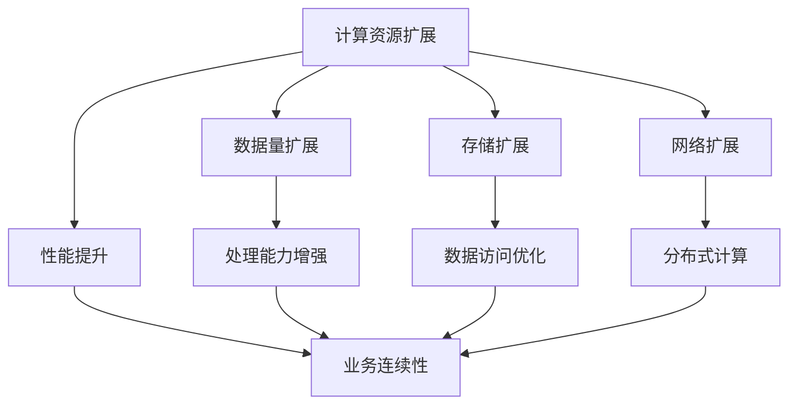

                 

### 模型可扩展性的重要性

**2.1 背景介绍**

在当今数据驱动的世界中，机器学习模型已经成为各个行业的关键组成部分。然而，随着数据量的持续增长，如何确保模型在处理大规模数据时仍然保持高效和稳定，成为一个日益重要的问题。模型的可扩展性（Scalability）成为衡量一个机器学习模型是否能够适应未来需求的指标。

**2.2 核心概念与联系**

模型的可扩展性涉及多个核心概念：

- **计算资源扩展**：模型需要在计算资源（如CPU、GPU）增加时，性能能够相应提升。
- **数据量扩展**：模型需要能够处理数据量的增长，而不会出现性能下降或错误。
- **存储扩展**：模型需要能够适应数据存储能力的扩展，如使用分布式文件系统。
- **网络扩展**：模型需要能够处理分布式计算和通信。

核心概念之间的联系可以用以下Mermaid流程图表示：



**2.3 核心算法原理讲解**

为了确保模型具有良好的可扩展性，我们需要关注以下几个关键算法原理：

1. **并行计算**：通过将任务分解成多个子任务，并行执行，可以显著提高处理速度。

2. **分布式计算**：将计算任务分布在多个计算节点上，通过通信和协调实现整体任务的完成。

3. **数据流处理**：使用数据流框架（如Apache Kafka、Apache Flink）处理连续的数据流，确保数据处理的实时性和可扩展性。

以下是一个使用Python实现并行计算和数据流处理的示例：

```python
import concurrent.futures
import time

# 并行计算函数
def computeParallel(data):
    # 模拟计算操作
    time.sleep(1)
    return sum(data)

# 数据流处理
def processDataStream(data_stream):
    results = []
    for data in data_stream:
        # 使用并行计算
        results.append(computeParallel(data))
    return results

# 测试数据
data_stream = [range(1000), range(1000), range(1000)]

# 并行处理数据流
start_time = time.time()
results = processDataStream(data_stream)
end_time = time.time()

print("计算结果：", results)
print("总耗时：", end_time - start_time)
```

在这个例子中，我们使用了`concurrent.futures`库来实现并行计算，并通过模拟数据流来展示数据流处理的实时性和可扩展性。

**2.4 数学模型和公式**

模型的可扩展性可以通过以下数学模型和公式来评估：

- **线性扩展性**：$$ T(n) = c \cdot n $$
  其中，\( T(n) \) 是处理 \( n \) 个数据点所需的时间，\( c \) 是常数。

- **对数扩展性**：$$ T(n) = c \cdot \log(n) $$
  这个模型适用于数据量增加时，处理时间增长速度较慢的情况。

- **指数扩展性**：$$ T(n) = c \cdot n^k $$
  这个模型适用于处理时间增长速度非常快的情况，通常表示为 \( k \) 次方。

**2.5 举例说明**

假设我们有一个处理图片分类的模型，每次处理一张图片需要10秒。现在，我们需要处理100张图片，我们可以使用以下数学模型来预测总处理时间：

- 线性扩展性：\( T(100) = c \cdot 100 = 1000 \) 秒
- 对数扩展性：\( T(100) = c \cdot \log(100) \approx 4.6 \cdot 100 = 460 \) 秒
- 指数扩展性：\( T(100) = c \cdot 100^2 = 10000 \) 秒

从这个例子中可以看出，模型的可扩展性直接影响了处理大规模数据时的效率。

**2.6 最佳实践 Tips**

- **预取数据和预加载资源**：提前预取数据并加载必要的计算资源，可以减少实际处理时间。
- **使用缓存**：使用缓存可以减少重复计算，提高整体效率。
- **动态调整资源**：根据实际负载动态调整计算资源，确保高效运行。
- **优化算法**：选择和优化适用于大规模数据处理的算法，如使用更高效的算法或改进现有算法。

**2.7 小结**

模型的可扩展性是确保模型在大规模数据环境中高效运行的关键。通过并行计算、分布式计算和数据流处理等算法原理，以及线性扩展性、对数扩展性和指数扩展性等数学模型，我们可以评估和优化模型的可扩展性。在实际应用中，最佳实践和技巧的应用，将有助于提高模型的可扩展性和运行效率。

**作者：AI天才研究院/AI Genius Institute & 禅与计算机程序设计艺术 /Zen And The Art of Computer Programming**

