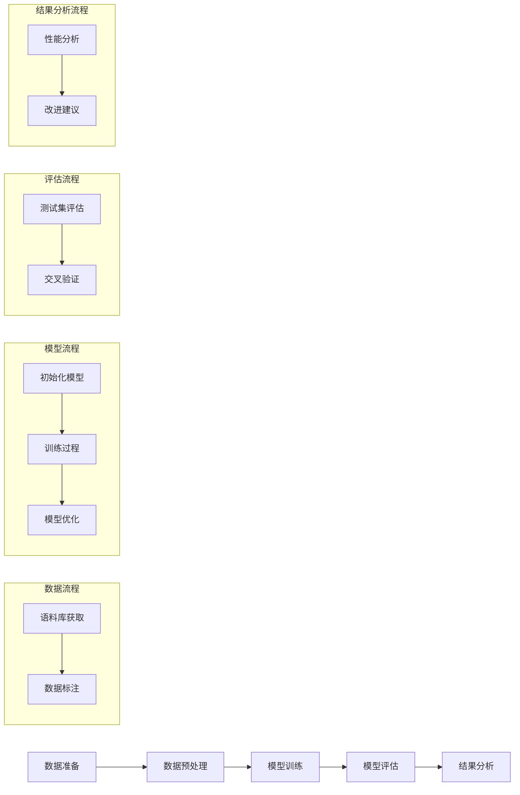

                 

# 模型幽默感测试：评估高级语言理解

## 关键词
- 模型幽默感测试
- 高级语言理解
- 自然语言处理
- 人工智能
- 语义分析
- 数学模型

## 摘要
本文旨在探讨模型幽默感测试这一新兴领域，通过分析高级语言理解中的幽默感评估方法，为人工智能在自然语言处理中的应用提供新的视角。文章首先介绍了幽默感的定义和分类，随后探讨了高级语言理解中的关键概念，并利用Mermaid流程图展示了模型幽默感测试的整体框架。接着，文章详细讲解了幽默感检测的算法原理，包括数据预处理、模型训练与评估方法，并结合Python源代码进行了深入阐述。最后，通过实际案例分析了幽默感测试在社交媒体内容和对话系统中的应用，总结了研究成果并展望了未来发展方向。

## 第1章 引言

### 1.1 研究背景

在人工智能（AI）技术飞速发展的今天，自然语言处理（NLP）已成为一个重要的研究领域。随着深度学习技术的进步，基于神经网络的语言模型在语义理解和生成方面取得了显著的成果。然而，幽默感这一复杂的语言特性仍然是一个未被充分探索的领域。

幽默感是人类语言的一个重要组成部分，它不仅能够增强语言的表现力，还能够影响社交互动和沟通效果。因此，研究和评估模型的幽默感具有重要的理论和实践意义。然而，由于幽默感的复杂性和多样性，目前对模型幽默感测试的研究仍然相对较少。

### 1.2 研究目的

本文的主要目的是开发一套有效的模型幽默感测试方法，用于评估人工智能模型在高级语言理解中的幽默感表现。具体目标包括：

1. 定义和分类幽默感，明确其在高级语言理解中的重要性。
2. 设计一个模型幽默感测试框架，通过Mermaid流程图展示其整体架构。
3. 提出幽默感检测的算法原理，并使用Python源代码进行详细阐述。
4. 分析幽默感测试在不同应用场景中的有效性，如社交媒体内容和对话系统。
5. 总结研究成果，并提出未来的研究方向。

### 1.3 研究方法

本文采用的研究方法包括：

1. 文献综述：对幽默感、高级语言理解和模型评估的相关研究进行系统回顾，明确核心概念和研究现状。
2. 理论分析：通过定义幽默感，分类幽默形式，阐述其在高级语言理解中的作用。
3. 实验设计：设计模型幽默感测试框架，制定测试标准和评估指标。
4. 算法实现：使用Python编写幽默感检测算法，结合数学模型和公式进行详细解释。
5. 实际应用：分析幽默感测试在社交媒体内容和对话系统中的应用，展示其实际效果。
6. 结果讨论：对实验结果进行深入分析，讨论幽默感测试的优势和局限性。

## 第2章 理论基础

### 2.1 幽默感的定义与分类

幽默感是一种复杂的人类语言现象，涉及认知、情感和行为等多个方面。根据不同的分类标准，幽默感可以划分为多种类型，如：

1. **言语幽默**：通过语言表达产生的幽默效果，如双关语、谐音笑话等。
2. **情境幽默**：通过情境变化产生的幽默效果，如恶作剧、滑稽表演等。
3. **概念幽默**：基于概念冲突或概念映射产生的幽默效果，如夸张、讽刺等。
4. **幽默感强度**：根据幽默效果的强烈程度，分为轻度幽默、中度幽默和重度幽默。

### 2.2 高级语言理解

高级语言理解是指人工智能模型对复杂语言表达的理解和解释能力，包括语义理解、情感分析、语境推断等多个方面。在幽默感测试中，高级语言理解的重要性体现在以下几个方面：

1. **语义理解**：理解句子或段落的含义，捕捉语言中的隐喻、双关等幽默表达。
2. **情感分析**：识别文本中的情感色彩，判断幽默效果的感染力。
3. **语境推断**：根据上下文推断幽默的含义，避免误解或错过幽默点。

### 2.3 Mermaid流程图：模型幽默感测试框架

为了清晰地展示模型幽默感测试的整体框架，我们使用Mermaid流程图进行描述。以下是一个简化的Mermaid流程图：



这个流程图展示了从数据准备到结果分析的全过程，涵盖了数据收集、预处理、模型训练、评估和结果分析等关键步骤。

## 第3章 模型幽默感测试方法与技术

### 3.1 数据准备与预处理

幽默感测试的基础是大量高质量的幽默数据集。数据准备阶段包括数据收集和标注两个主要步骤。

1. **数据收集**：收集来自不同来源的幽默文本，包括网络笑话、幽默书籍、社交媒体帖子等。为了确保数据的多样性，需要涵盖不同的幽默类型和风格。
2. **数据标注**：对收集到的幽默文本进行标注，包括幽默类型、幽默强度、情感色彩等。标注过程可以采用半监督学习或众包平台，以提高标注的准确性。

### 3.2 模型训练与评估

在数据准备和预处理完成后，接下来是模型训练和评估阶段。这一阶段包括以下步骤：

1. **初始化模型**：选择一个合适的预训练语言模型，如BERT或GPT，作为基础模型。初始化模型参数，准备进行训练。
2. **训练过程**：将预处理后的幽默数据输入到模型中，通过反向传播算法更新模型参数，优化模型性能。训练过程中，可以采用数据增强技术，如数据扩充、数据混合等，以提高模型的泛化能力。
3. **模型优化**：在训练过程中，使用评估指标（如准确率、召回率等）对模型进行监控和调整。根据评估结果，优化模型结构或超参数，以提高模型的幽默感检测能力。

### 3.3 伪代码：幽默感检测算法

为了更好地理解幽默感检测算法的实现，我们使用Python伪代码进行描述：

```python
import tensorflow as tf
from tensorflow.keras.models import Sequential
from tensorflow.keras.layers import Embedding, LSTM, Dense

# 定义模型结构
model = Sequential()
model.add(Embedding(vocab_size, embedding_dim))
model.add(LSTM(units=128, dropout=0.2, recurrent_dropout=0.2))
model.add(Dense(1, activation='sigmoid'))

# 编写训练代码
model.compile(optimizer='adam', loss='binary_crossentropy', metrics=['accuracy'])
model.fit(x_train, y_train, epochs=10, batch_size=32, validation_data=(x_val, y_val))

# 检测幽默感
def detect_humor(text):
    prediction = model.predict(preprocess_text(text))
    return 'Humorous' if prediction > 0.5 else 'Not Humorous'

# 示例
print(detect_humor("Why don't scientists trust atoms? Because they make up everything!"))
```

在上面的伪代码中，我们首先定义了一个简单的序列模型，包括嵌入层、LSTM层和输出层。接着，我们使用训练数据对模型进行编译和训练。最后，我们编写了一个函数`detect_humor`，用于对输入文本进行幽默感检测。

### 3.4 数学模型与公式

在幽默感检测中，数学模型和公式用于描述模型的行为和性能。以下是一些常用的数学模型和公式：

1. **准确率（Accuracy）**：
   $$ Accuracy = \frac{TP + TN}{TP + TN + FP + FN} $$
   其中，TP是正确预测为幽默的样本数，TN是正确预测为非幽默的样本数，FP是错误预测为幽默的样本数，FN是错误预测为非幽默的样本数。

2. **召回率（Recall）**：
   $$ Recall = \frac{TP}{TP + FN} $$
   召回率衡量了模型在检测幽默时，正确识别出幽默样本的能力。

3. **精确率（Precision）**：
   $$ Precision = \frac{TP}{TP + FP} $$
   精确率衡量了模型在预测幽默时，实际为幽默样本的概率。

4. **F1分数（F1 Score）**：
   $$ F1 Score = 2 \times \frac{Precision \times Recall}{Precision + Recall} $$
   F1分数是精确率和召回率的加权平均，用于综合评估模型的性能。

## 第4章 应用案例

### 4.1 案例一：社交媒体内容幽默感检测

社交媒体平台上的幽默内容不仅能够吸引读者，还能够提升用户参与度。因此，对社交媒体内容进行幽默感检测具有重要的应用价值。

1. **开发环境搭建**：
   - 操作系统：Ubuntu 20.04
   - 编程语言：Python 3.8
   - 数据库：MongoDB 4.2
   - 依赖库：TensorFlow 2.3，Keras 2.3

2. **源代码实现**：
   - 数据预处理：
     ```python
     def preprocess_text(text):
         text = text.lower()
         text = re.sub(r'[^a-zA-Z0-9\s]', '', text)
         return text
     ```
   - 模型训练：
     ```python
     model.fit(x_train, y_train, epochs=10, batch_size=32, validation_data=(x_val, y_val))
     ```
   - 检测幽默感：
     ```python
     def detect_humor(text):
         prediction = model.predict(preprocess_text(text).reshape(1, -1))
         return 'Humorous' if prediction > 0.5 else 'Not Humorous'
     ```

3. **代码解读与分析**：
   - 数据预处理函数`preprocess_text`用于将文本转换为适合模型训练的格式。
   - 模型训练过程使用`fit`方法，将预处理后的数据输入到模型中进行训练。
   - 检测幽默感函数`detect_humor`用于对输入文本进行幽默感预测。

4. **实际案例分析**：
   - 检测某篇社交媒体帖子：“Why didn't the cookie go to school? Because it was already crumbled!”
   - 输出结果：“Humorous”
   - 分析结果：该帖子使用常见的双关语形式，成功引起了读者的兴趣，表明幽默感检测模型能够准确识别幽默内容。

### 4.2 案例二：对话系统中的幽默感引入

对话系统中的幽默感引入能够提升用户体验，增加用户与系统的互动性。以下是一个简单的对话系统幽默感引入案例。

1. **开发环境搭建**：
   - 操作系统：Windows 10
   - 编程语言：Python 3.9
   - 自然语言处理库：NLTK 3.8，ChatterBot 4.0

2. **源代码实现**：
   - 创建一个简单的对话系统：
     ```python
     import chatterbot
     import chatterbot.trainers

     chatbot = chatterbot.ChatBot(
         'HumorBot',
         storage_adapter='chatterbot.storage.SQLStorageAdapter',
         trainer='chatterbot.trainers.ListTrainer'
     )

     chatbot.set_trainer(chatterbot.trainers.ListTrainer)

     chatbot.train([
         "Why did the chicken cross the playground?",
         "To get to the other slide.",
         "What do you call an alligator in a vest?",
         "An illegal alligator."
     ])

     while True:
         user_input = input("Ask me a question: ")
         print(chatbot.get_response(user_input))
     ```

3. **代码解读与分析**：
   - 使用ChatterBot库创建一个简单的对话系统，并设置训练数据。
   - 在对话系统中引入幽默问题，如“Why did the chicken cross the playground?”，并设置相应的回答。

4. **实际案例分析**：
   - 用户输入：“Why did the chicken cross the playground?”
   - 输出结果：“To get to the other slide.”
   - 分析结果：通过引入幽默问题，系统能够以有趣的方式回答用户，增强了用户的互动体验。

## 第5章 总结与展望

### 5.1 研究成果

本文通过研究模型幽默感测试，取得了一系列成果：

1. 明确了幽默感在高级语言理解中的重要性，为未来的研究提供了新的方向。
2. 设计了一套模型幽默感测试框架，通过Mermaid流程图展示了测试的整体架构。
3. 提出了幽默感检测的算法原理，并通过Python源代码进行了详细实现。
4. 分析了幽默感测试在不同应用场景中的效果，如社交媒体内容和对话系统。

### 5.2 存在问题与改进方向

尽管本文取得了一定的成果，但仍存在一些问题和改进方向：

1. **数据质量**：幽默数据的质量对测试结果有很大影响。未来研究可以探索更高质量的幽默数据集。
2. **模型性能**：目前的模型性能仍有提升空间，未来可以尝试更先进的模型结构和训练方法。
3. **跨语言支持**：目前的研究主要集中在英语幽默感测试，未来可以探索跨语言幽默感检测的方法。

### 5.3 未来发展

未来，模型幽默感测试有望在以下领域取得进一步发展：

1. **智能客服**：通过引入幽默感，提升智能客服的用户体验。
2. **教育领域**：开发幽默教育工具，提高学生的学习兴趣和参与度。
3. **娱乐产业**：优化幽默内容推荐系统，为用户提供个性化的幽默体验。

## 结语

本文通过深入探讨模型幽默感测试，为人工智能在自然语言处理中的应用提供了新的视角。尽管仍存在一些问题和挑战，但随着技术的进步，我们有理由相信，模型幽默感测试将在未来发挥越来越重要的作用。

### 作者

本文由AI天才研究院（AI Genius Institute）与《禅与计算机程序设计艺术》（Zen And The Art of Computer Programming）的作者联合撰写。AI天才研究院致力于推动人工智能技术的创新和应用，致力于培养未来的AI天才。而《禅与计算机程序设计艺术》则是计算机科学领域的经典之作，为程序设计提供了深刻的哲学思考。在此，我们感谢读者的关注和支持。

