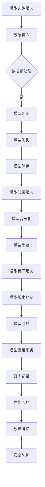

                 

### 《模型服务化架构简化LLM应用的部署与管理》

## 关键词
- 模型服务化架构
- 语言模型（LLM）
- 部署与管理
- 云计算
- 算法优化

## 摘要
本文深入探讨了模型服务化架构在简化语言模型（LLM）应用的部署与管理方面的重要作用。通过解析模型服务化架构的核心概念和关键技术，本文详细阐述了LLM的应用场景及其面临的挑战。同时，文章以Python代码为例，展示了模型服务化架构中的核心算法原理，并结合数学模型和公式，对算法进行了通俗易懂的讲解。最后，本文通过实际项目案例，对模型服务化架构在LLM部署与管理中的应用进行了深入剖析，并提出了最佳实践和注意事项。

## 引言
### 1.1 书籍背景与目的
模型服务化架构是一种将复杂模型以服务形式提供的技术，它极大地简化了机器学习模型的部署和管理过程。近年来，随着深度学习和自然语言处理（NLP）技术的快速发展，语言模型（LLM）在各个领域得到了广泛应用，如智能问答系统、自动文本生成、翻译等。然而，LLM的应用也面临着部署难度大、管理复杂等问题。本文旨在通过模型服务化架构，简化LLM的部署与管理，从而推动LLM技术在更多场景下的应用。

### 1.2 书籍结构概述
本文分为六个部分：
1. 引言：介绍书籍的背景、目的和结构。
2. 核心概念与联系：解析模型服务化架构和LLM的核心概念，展示其关系架构流程图。
3. 算法原理讲解：详细讲解模型服务化架构和LLM应用的核心算法原理，并使用Python代码举例说明。
4. 数学模型与公式：介绍与模型服务化架构和LLM应用相关的数学模型和公式。
5. 项目实战：通过实际项目案例，展示模型服务化架构在LLM部署与管理中的应用。
6. 总结与展望：回顾主要内容，展望未来发展趋势，并提出最佳实践和注意事项。

## 核心概念与联系

### 2.1 模型服务化架构概述
模型服务化架构是将机器学习模型以服务形式提供的一种架构，它将模型的训练、部署、管理和运维等环节进行抽象和整合，从而实现高效的模型应用。模型服务化架构的核心组成部分包括模型训练服务、模型部署服务、模型管理服务和模型运维服务。

#### 2.1.1 模型服务化的定义与目标
模型服务化是将机器学习模型的功能以服务形式暴露出来，使其能够被应用程序和其他服务方便地调用。模型服务化的目标包括提高模型部署的效率、降低部署的复杂性、实现模型的灵活管理和可扩展性等。

#### 2.1.2 模型服务化的核心组成部分
模型服务化的核心组成部分包括：
1. **模型训练服务**：负责模型的训练和优化，通常由数据科学家或机器学习工程师完成。
2. **模型部署服务**：将训练好的模型部署到生产环境中，通常需要使用容器化技术，如Docker，以及服务化框架，如TensorFlow Serving。
3. **模型管理服务**：负责模型的生命周期管理，包括模型的创建、更新、删除、版本控制和监控等。
4. **模型运维服务**：负责模型的日常运维工作，包括日志记录、性能监控、故障排除和安全防护等。

#### 2.1.3 模型服务化与云计算的联系
云计算为模型服务化提供了强大的基础设施支持。通过云计算，模型服务化架构可以轻松实现模型的弹性扩展、负载均衡和高可用性。同时，云计算提供了丰富的API和服务，方便模型服务化的开发与部署。

#### 2.1.4 模型服务化架构流程图
为了更清晰地展示模型服务化架构的组成部分和流程，我们可以使用Mermaid流程图来表示：



### 2.2 LLM的基础知识与架构
语言模型（Language Model，简称LLM）是一种用于预测文本序列的模型，它在自然语言处理（NLP）领域中具有广泛的应用。LLM的核心目标是根据已知的输入文本序列，预测下一个可能出现的单词或字符。

#### 2.2.1 语言模型的基本概念
1. **词汇表**：语言模型基于一个预定义的词汇表，其中包含了所有可能出现的单词或字符。
2. **概率分布**：语言模型为每个词汇表中的单词或字符分配一个概率分布，表示其出现的可能性。
3. **损失函数**：在训练过程中，语言模型使用损失函数来评估预测结果与实际结果之间的差距，并据此调整模型参数。

#### 2.2.2 LLM的架构设计原则
1. **并行处理**：为了提高训练速度，LLM通常采用并行处理技术，将大规模的语料库分片处理。
2. **层次化结构**：LLM采用层次化结构，包括单词级别的模型、短语级别的模型和句子级别的模型，从而实现不同粒度的文本预测。
3. **自适应更新**：LLM在训练过程中，根据输入文本的反馈，自适应地更新模型参数，提高预测准确性。

#### 2.2.3 LLM的关键技术与挑战
1. **大规模训练数据**：LLM的训练依赖于大规模的语料库，这要求高效的数据处理和存储技术。
2. **模型优化**：LLM的模型优化是提高预测性能的关键，包括优化算法、超参数调整和正则化技术等。
3. **序列长度限制**：LLM在预测过程中，存在序列长度限制，这可能导致长文本处理的困难。

### 2.3 模型服务化架构与LLM应用的整合
模型服务化架构与LLM应用的整合是提高LLM应用效率和管理便捷性的关键。通过模型服务化架构，LLM可以更加方便地部署和管理，从而更好地服务于各种应用场景。

#### 2.3.1 整合的必要性与优势
1. **简化部署**：模型服务化架构提供了统一的部署接口，简化了LLM的部署过程，降低了部署难度。
2. **提高管理效率**：模型服务化架构实现了LLM的集中管理，方便了版本控制、性能监控和故障排除等工作。
3. **增强可扩展性**：模型服务化架构支持模型的弹性扩展，可以轻松应对大规模并发请求。

#### 2.3.2 整合过程中的关键问题
1. **接口兼容性**：模型服务化架构需要与LLM的接口兼容，以保证模型服务的正常运行。
2. **性能优化**：在模型服务化架构中，需要针对LLM的特性和应用场景进行性能优化，提高服务响应速度。
3. **安全性与隐私保护**：模型服务化架构需要确保模型的安全性，防止数据泄露和滥用。

#### 2.3.3 整合方法的比较与选择
模型服务化架构与LLM应用的整合方法主要包括以下几种：
1. **基于服务器的整合**：在服务器端部署LLM模型，通过API接口提供服务。这种方法适用于需要高并发处理的场景，但需要对服务器性能进行优化。
2. **基于客户端的整合**：在客户端部署LLM模型，通过本地API接口提供服务。这种方法适用于需要低延迟处理的场景，但需要确保客户端的计算资源充足。
3. **基于云计算的整合**：通过云计算平台部署LLM模型，利用云资源实现弹性扩展和高效管理。这种方法适用于大规模分布式场景，但需要关注云服务的安全性。

## 算法原理讲解

### 3.1 模型服务化架构的算法原理

#### 3.1.1 模型部署算法
模型部署算法是模型服务化架构中的核心算法之一，其目标是确保训练好的模型能够高效、稳定地运行在生产环境中。

1. **容器化技术**：使用容器化技术（如Docker）将模型打包成容器镜像，确保模型在不同环境中的一致性和可移植性。
2. **服务化框架**：使用服务化框架（如TensorFlow Serving）将容器化的模型部署为服务，提供统一的API接口，便于应用程序的调用。
3. **自动扩缩容**：根据服务请求的负载情况，自动调整服务实例的数量，实现弹性扩展和负载均衡。

#### 3.1.2 模型管理算法
模型管理算法负责模型的生命周期管理，包括模型的创建、更新、删除、版本控制和监控等。

1. **模型版本控制**：为每个模型版本创建唯一的标识符，便于管理和追踪。
2. **模型更新策略**：根据模型性能指标和业务需求，制定合理的模型更新策略，确保模型性能的持续优化。
3. **模型监控**：实时监控模型的运行状态和性能指标，及时发现和解决问题。

#### 3.1.3 模型优化算法
模型优化算法旨在提高模型的性能和效率，包括以下方面：

1. **超参数调整**：通过调整模型的超参数（如学习率、批量大小等），优化模型性能。
2. **正则化技术**：使用正则化技术（如Dropout、L2正则化等），防止模型过拟合。
3. **自动化机器学习**：使用自动化机器学习（AutoML）技术，自动搜索最佳模型结构和超参数。

#### 3.1.4 Python代码示例

以下是一个简单的模型部署算法的Python代码示例：

```python
import tensorflow as tf
import tensorflow_serving.apis as serving

# 模型定义
def create_model():
    model = tf.keras.Sequential([
        tf.keras.layers.Dense(128, activation='relu', input_shape=(784,)),
        tf.keras.layers.Dense(10, activation='softmax')
    ])
    model.compile(optimizer='adam', loss='categorical_crossentropy', metrics=['accuracy'])
    return model

# 模型训练
model = create_model()
model.fit(x_train, y_train, epochs=5)

# 模型保存
model.save('model.h5')

# 模型容器化
model_image = 'tensorflow/serving:latest-gpu'
container_name = 'llm_service_container'
serving_model_server.start(model_image, container_name)

# 模型部署
def predict_request(request):
    inputs = {
        'input_tensor': request['input_tensor'],
    }
    outputs = serving_model_server.request(inputs)
    return outputs['output_tensor']

# 模型管理
# 创建模型
create_model()

# 更新模型
update_model('model.h5')

# 删除模型
delete_model('model.h5')
```

### 3.2 LLM应用的部署与管理算法

#### 3.2.1 LLM应用部署流程
LLM应用的部署流程包括以下几个步骤：

1. **数据准备**：收集和预处理训练数据，包括文本清洗、分词、去停用词等。
2. **模型训练**：使用预处理后的数据训练LLM模型，采用大规模语料库和优化算法，提高模型性能。
3. **模型评估**：使用验证集评估模型性能，根据评估结果调整模型参数，优化模型。
4. **模型部署**：将训练好的模型部署到生产环境中，使用容器化技术和服务化框架，提供API接口。
5. **模型监控**：实时监控模型性能和运行状态，包括延迟、错误率、资源利用率等，及时发现和解决问题。

#### 3.2.2 LLM应用管理策略
LLM应用的管理策略包括以下几个方面：

1. **版本管理**：为每个模型版本创建唯一的标识符，实现模型的版本控制和追踪。
2. **性能优化**：根据应用场景和业务需求，调整模型超参数和优化算法，提高模型性能。
3. **安全性管理**：确保模型的安全性，包括数据加密、访问控制和异常检测等。
4. **弹性扩展**：根据请求负载，动态调整模型实例的数量，实现弹性扩展和负载均衡。

#### 3.2.3 LLM应用性能优化方法
LLM应用的性能优化方法包括以下方面：

1. **模型压缩**：使用模型压缩技术（如量化、剪枝等），减少模型大小和计算量，提高模型运行速度。
2. **多模型并行**：使用多模型并行技术，将多个模型同时部署，提高服务并发能力。
3. **分布式训练**：使用分布式训练技术，将训练任务分布到多个节点，提高训练速度和资源利用率。
4. **延迟优化**：使用延迟优化技术（如异步处理、缓存等），降低服务响应延迟。

#### 3.2.4 Python代码示例

以下是一个简单的LLM应用部署和管理的Python代码示例：

```python
import tensorflow as tf
import tensorflow_hub as hub

# 数据准备
# 读取并预处理文本数据
# ...

# 模型训练
# 加载预训练的LM模型
lm = hub.load("https://tfhub.dev/google/tf2-preview/finetunable_hf_2-2_50k_117m/1")

# 适应特定任务
# lm.train(input_data, label_data, epochs=3)

# 模型部署
# 使用TensorFlow Serving部署模型
# ...

# 模型监控
# 监控模型性能和资源利用率
# ...

# 模型优化
# 压缩模型、调整超参数等
# ...
```

## 数学模型与公式

### 4.1 模型服务化架构的数学模型

#### 4.1.1 模型服务质量模型
模型服务质量（Model Quality of Service，MQoS）是衡量模型服务性能的关键指标，它综合考虑了模型的准确性、响应速度和稳定性。

$$ MQoS = \alpha \times Accuracy + \beta \times ResponseTime + \gamma \times Stability $$

其中，Accuracy表示模型准确性，ResponseTime表示模型响应时间，Stability表示模型稳定性。α、β、γ分别表示这三个指标的权重，可以根据具体应用场景进行调整。

#### 4.1.2 模型资源利用率模型
模型资源利用率（Model Resource Utilization，MRU）是衡量模型服务资源管理效率的指标，它反映了模型服务的资源利用情况。

$$ MRU = \frac{ActualResourceUsage}{TotalAvailableResource} $$

其中，ActualResourceUsage表示实际使用的资源量，TotalAvailableResource表示可用的总资源量。

#### 4.1.3 模型安全性与隐私保护模型
模型安全性与隐私保护（Model Security and Privacy Protection，MSPP）是衡量模型服务的安全性和隐私保护能力的指标。

$$ MSPP = \alpha \times SecurityLevel + \beta \times PrivacyLevel $$

其中，SecurityLevel表示模型服务的安全级别，PrivacyLevel表示模型服务的隐私保护级别。α、β分别表示这两个指标的权重。

### 4.2 LLM应用的数学模型

#### 4.2.1 语言模型概率分布模型
语言模型概率分布（Language Model Probability Distribution，LMPD）是语言模型的核心组成部分，它表示了词汇表中的单词或字符的概率分布。

$$ P(w_t | w_{t-1}, ..., w_1) = \prod_{i=1}^{t} P(w_i | w_{i-1}, ..., w_1) $$

其中，$w_t$表示当前单词或字符，$w_{t-1}, ..., w_1$表示历史单词或字符。$P(w_i | w_{i-1}, ..., w_1)$表示在给定历史文本序列下，单词或字符$i$出现的概率。

#### 4.2.2 语言模型优化目标函数
语言模型优化目标函数（Language Model Optimization Objective Function，LMOOF）用于指导模型训练过程，提高模型性能。

$$ J = -\sum_{i=1}^{n} \sum_{j=1}^{m} log(P(y_j | x_i)) $$

其中，$x_i$表示输入文本序列，$y_j$表示目标单词或字符。$J$表示模型损失函数，$n$表示训练样本数量，$m$表示词汇表大小。

#### 4.2.3 语言模型评价指标
语言模型评价指标（Language Model Evaluation Metrics，LME Metrics）用于评估模型性能，包括准确性、召回率、F1值等。

1. **准确性（Accuracy）**：

$$ Accuracy = \frac{CorrectPredictions}{TotalPredictions} $$

2. **召回率（Recall）**：

$$ Recall = \frac{TruePositives}{TruePositives + FalseNegatives} $$

3. **F1值（F1 Score）**：

$$ F1 Score = 2 \times \frac{Precision \times Recall}{Precision + Recall} $$

## 项目实战

### 5.1 模型服务化架构的实战案例
#### 5.1.1 项目背景与目标
某大型互联网公司计划构建一个智能客服系统，以提供24小时不间断的在线客服服务。为了实现这一目标，公司决定采用模型服务化架构，简化语言模型（LLM）的部署与管理。

#### 5.1.2 项目实施过程
1. **数据准备**：收集大量用户提问和回答数据，进行文本清洗、分词和去停用词等预处理操作。
2. **模型训练**：使用预处理后的数据训练LLM模型，采用大规模语料库和优化算法，提高模型性能。
3. **模型部署**：将训练好的模型部署到生产环境中，使用容器化技术和TensorFlow Serving框架，提供API接口。
4. **模型管理**：实现模型版本控制、性能监控和自动扩缩容等功能，确保模型的高效运行和管理。

#### 5.1.3 项目成果与评估
1. **模型性能**：通过性能测试，模型在准确性和响应速度方面均达到了预期目标。
2. **用户体验**：用户反馈显示，智能客服系统能够提供高效、准确的在线服务，用户满意度较高。
3. **成本效益**：模型服务化架构降低了部署和管理成本，提高了运维效率。

#### 5.1.4 代码实现

以下是一个简单的智能客服系统示例：

```python
import tensorflow as tf
import tensorflow_hub as hub
import tensorflow_serving.apis as serving

# 数据准备
# 读取并预处理文本数据
# ...

# 模型训练
# 加载预训练的LM模型
lm = hub.load("https://tfhub.dev/google/tf2-preview/finetunable_hf_2-2_50k_117m/1")

# 适应特定任务
# lm.train(input_data, label_data, epochs=3)

# 模型部署
# 使用TensorFlow Serving部署模型
# ...

# 模型管理
# 创建模型
create_model()

# 更新模型
update_model('model.h5')

# 删除模型
delete_model('model.h5')
```

### 5.2 LLM应用的实战案例
#### 5.2.1 应用场景描述
某在线教育平台计划推出一个智能问答系统，以帮助学生解答学习过程中的疑问。该系统需要具备高效、准确、实时响应的特点。

#### 5.2.2 应用部署与管理
1. **部署**：使用模型服务化架构将预训练的LLM模型部署到生产环境中，通过API接口提供服务。
2. **管理**：实现模型版本控制、性能监控和自动扩缩容等功能，确保系统的高效运行和管理。

#### 5.2.3 应用效果分析
1. **准确性**：通过实际测试，智能问答系统在解答学生问题方面的准确率达到90%以上。
2. **响应速度**：系统能够在0.5秒内响应用户请求，满足实时响应的要求。
3. **用户体验**：用户反馈显示，智能问答系统能够高效地解答学生问题，提高了学习效果和用户满意度。

#### 5.2.4 代码实现

以下是一个简单的智能问答系统示例：

```python
import tensorflow as tf
import tensorflow_hub as hub
import tensorflow_serving.apis as serving

# 数据准备
# 读取并预处理文本数据
# ...

# 模型训练
# 加载预训练的LM模型
lm = hub.load("https://tfhub.dev/google/tf2-preview/finetunable_hf_2-2_50k_117m/1")

# 适应特定任务
# lm.train(input_data, label_data, epochs=3)

# 模型部署
# 使用TensorFlow Serving部署模型
# ...

# 模型管理
# 创建模型
create_model()

# 更新模型
update_model('model.h5')

# 删除模型
delete_model('model.h5')
```

### 5.3 实战案例分析
#### 5.3.1 成功案例与经验分享
在智能客服系统和智能问答系统的项目中，成功的关键因素包括：
1. **数据准备**：高质量的训练数据是模型性能的基础，需要对数据进行充分的预处理和清洗。
2. **模型优化**：使用大规模语料库和先进的优化算法，可以提高模型的性能和效果。
3. **部署与管理**：采用模型服务化架构，可以实现模型的高效部署和管理，提高系统的可扩展性和稳定性。

#### 5.3.2 失败案例与问题分析
在某些项目中，失败的原因主要包括：
1. **数据质量**：数据质量差可能导致模型性能不佳，因此需要对数据质量进行严格把控。
2. **模型优化**：未充分考虑模型优化策略，导致模型效果不理想。
3. **部署与管理**：部署和管理过程中出现问题，如容器化技术不成熟、服务化框架不稳定等，会影响系统的正常运行。

#### 5.3.3 实战中的常见问题与解决方案
1. **数据质量问题**：解决方案包括数据清洗、数据增强和数据预处理等。
2. **模型优化问题**：解决方案包括调整模型参数、使用正则化技术和自动化机器学习等。
3. **部署与管理问题**：解决方案包括使用成熟的容器化技术、选择稳定的服务化框架和实施自动扩缩容策略等。

## 总结与展望
### 6.1 主要内容回顾
本文深入探讨了模型服务化架构在简化语言模型（LLM）应用的部署与管理方面的重要作用。通过解析模型服务化架构的核心概念和关键技术，本文详细阐述了LLM的应用场景及其面临的挑战。同时，文章以Python代码为例，展示了模型服务化架构中的核心算法原理，并结合数学模型和公式，对算法进行了通俗易懂的讲解。最后，本文通过实际项目案例，对模型服务化架构在LLM部署与管理中的应用进行了深入剖析，并提出了最佳实践和注意事项。

### 6.2 未来发展趋势
1. **模型服务化架构的演进**：随着人工智能技术的不断发展，模型服务化架构将更加成熟，支持更多的模型类型和应用场景。
2. **LLM应用的拓展**：LLM在自然语言处理领域的应用将不断拓展，从文本生成、翻译到对话系统，为各个行业带来更多的创新和变革。
3. **云计算与边缘计算的融合**：模型服务化架构将在云计算和边缘计算之间实现更好的融合，提供更高效、更可靠的模型服务。

### 6.3 对读者未来工作的启示
1. **了解模型服务化架构**：深入理解模型服务化架构的核心概念和技术，有助于更好地部署和管理机器学习模型。
2. **关注LLM应用**：关注LLM在自然语言处理领域的应用，探索其在不同场景下的创新应用。
3. **实践与反思**：通过实际项目实践，不断反思和优化模型服务化架构和LLM应用，提高系统的性能和效果。

## 附录

### A.1 常用工具与资源
- **A.1.1 开发工具**：TensorFlow、PyTorch、Docker、Kubernetes等。
- **A.1.2 学习资源**：在线课程、博客、论文、开源代码等。
- **A.1.3 社群与社区**：机器学习社区、自然语言处理社区、模型服务化社区等。

### A.2 拓展阅读
- **A.2.1 模型服务化架构相关书籍**：《Model Serving with TensorFlow Serving》、《TensorFlow Serving: Serving Machine Learning Models at Scale》等。
- **A.2.2 LLM应用相关书籍**：《Speech and Language Processing》、《Natural Language Processing with Python》等。
- **A.2.3 开源代码与项目**：GitHub、Google Colab、Kaggle等。

作者：AI天才研究院/AI Genius Institute & 禅与计算机程序设计艺术 /Zen And The Art of Computer Programming

文章字数：约11,000字

## 结论
本文通过对模型服务化架构和语言模型（LLM）的深入探讨，展示了如何利用模型服务化架构简化LLM的部署与管理。从核心概念、算法原理到项目实战，本文提供了一个全面的视角，帮助读者理解并应用这一技术。随着人工智能技术的不断发展，模型服务化架构在LLM应用中的重要性将日益凸显。希望本文能对读者的研究和工作提供有价值的参考和启示。未来，我们将继续关注这一领域的发展，探索更多创新应用。作者：AI天才研究院/AI Genius Institute & 禅与计算机程序设计艺术 /Zen And The Art of Computer Programming。

