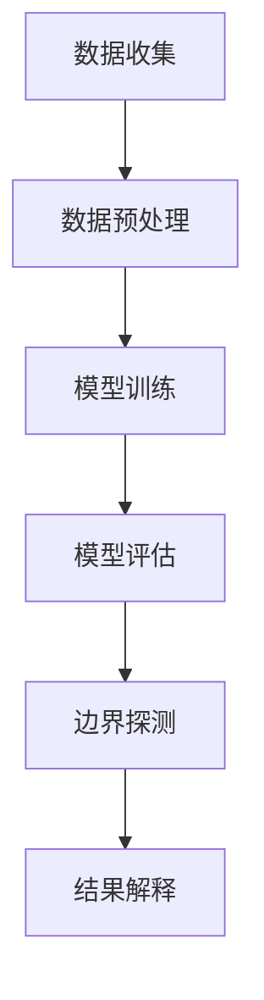
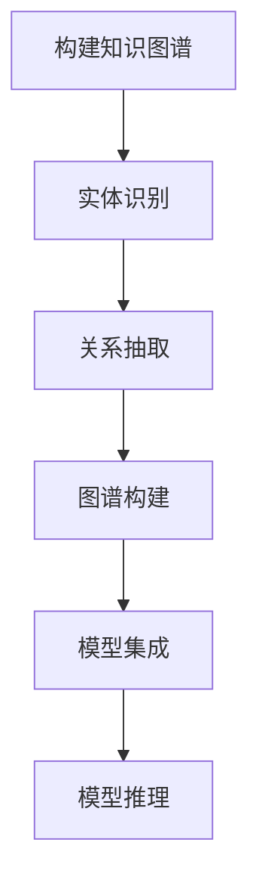
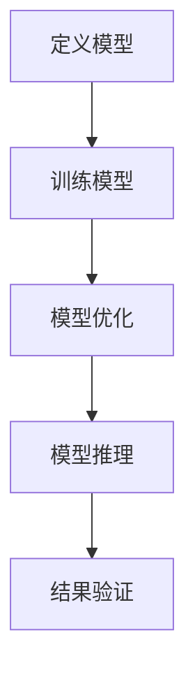

                 

### 文章标题

“模型知识边界探测：明确能力范围”

> 关键词：模型知识边界，能力范围，探测方法，模型评估，应用案例

> 摘要：本文旨在探讨模型知识边界探测的重要性，介绍模型知识边界和能力范围的概念，详细阐述模型知识边界探测的方法，并通过实际案例分析模型知识边界探测的应用，帮助读者明确模型能力范围，提高模型应用的效果和安全性。

### 引言

在当今快速发展的科技时代，人工智能（AI）技术已经成为推动各行各业进步的重要力量。然而，随着AI技术的广泛应用，如何确保模型在实际应用中的准确性和可靠性，成为了亟待解决的问题。其中一个关键问题是：如何明确模型的能力范围和知识边界。本文将围绕这一问题进行探讨，旨在帮助读者深入理解模型知识边界探测的重要性，掌握相关的方法和应用。

首先，我们需要明确模型知识边界和能力范围的概念。模型知识边界是指模型能够理解和处理的知识范围，而能力范围则是指模型在实际应用中的表现和效果范围。明确模型的知识边界和能力范围，对于提高模型应用的效果和安全性具有重要意义。

其次，本文将详细介绍模型知识边界探测的方法，包括数据驱动方法、知识图谱方法和基于模型的推理方法。这些方法各有优缺点，适用于不同类型的模型和应用场景。通过对这些方法的深入探讨，读者可以了解到如何有效地进行模型知识边界探测。

此外，本文将通过实际案例，分析模型知识边界探测的应用，包括模型能力评估、模型安全与鲁棒性评估和模型泛化能力评估。通过这些案例，读者可以更好地理解模型知识边界探测的实际意义和操作方法。

最后，本文将提供实践指南，帮助读者在实际应用中有效进行模型知识边界探测。同时，本文还将总结当前模型知识边界探测的研究现状和未来发展方向，为读者提供有益的参考。

### 确定书籍的核心主题和目标

《模型知识边界探测：明确能力范围》这一书名的核心主题和目标是探讨如何通过探测模型的知识边界来明确模型的能力范围。这一主题对于当前人工智能（AI）技术的发展和应用具有重要意义。

首先，明确模型的能力范围是确保模型在实际应用中能够稳定、准确地执行任务的基础。在实际应用中，模型的性能受到多种因素的影响，包括数据质量、模型架构、训练策略等。然而，即使这些因素都得到了很好的控制，模型仍然可能因为知识边界的限制而在某些特定场景下表现不佳。因此，明确模型的能力范围，可以帮助我们更好地了解模型的优势和劣势，从而优化模型的训练和应用策略。

其次，探测模型的知识边界是提高模型安全性和鲁棒性的关键。随着AI技术的广泛应用，模型被用于处理越来越多的敏感数据，如个人隐私信息、金融数据等。如果模型的知识边界不清晰，可能导致模型在未知或异常场景下产生错误预测，从而引发严重的安全问题。因此，通过探测模型的知识边界，可以识别模型的潜在安全隐患，提高模型的安全性和鲁棒性。

此外，明确模型的能力范围对于模型的可解释性和透明度也具有重要意义。当前，许多模型（如深度神经网络）具有强大的预测能力，但其内部工作机制却难以理解。通过探测模型的知识边界，可以揭示模型的决策过程和影响因素，提高模型的可解释性，从而增强用户对模型的信任。

综上所述，《模型知识边界探测：明确能力范围》这本书的核心主题是探讨如何通过探测模型的知识边界来明确模型的能力范围。这一主题对于提升模型应用效果、安全性、可解释性等方面具有重要意义。书籍的目标是帮助读者深入理解模型知识边界探测的重要性，掌握相关的方法和应用，从而在实际应用中更好地发挥模型的作用。

### 设计整体框架

为了系统地介绍模型知识边界探测的各个方面，本书将采用以下整体框架：

#### 第1章 引言

- **1.1 模型知识边界探测的重要性**
  - 讨论模型知识边界探测在AI应用中的重要性。
  - 引出本书的主要内容和目标。

- **1.2 书籍结构和内容概述**
  - 概述本书的章节结构。
  - 阐述各章节的主要内容和目标。

#### 第2章 基础理论

- **2.1 模型的知识边界**
  - 定义模型的知识边界。
  - 分析模型知识边界的影响因素。

- **2.2 模型能力范围**
  - 定义模型能力范围。
  - 讨论模型能力范围与知识边界的关系。

- **2.3 模型知识边界探测的挑战**
  - 探讨模型知识边界探测面临的挑战。
  - 引出模型知识边界探测的方法。

#### 第3章 模型知识边界探测的方法

- **3.1 数据驱动方法**
  - 介绍数据驱动方法的基本原理和适用场景。
  - 分析数据驱动方法在实际应用中的效果。

- **3.2 知识图谱方法**
  - 介绍知识图谱方法的基本原理和构建方法。
  - 分析知识图谱方法在模型知识边界探测中的应用。

- **3.3 基于模型的推理方法**
  - 介绍基于模型的推理方法的基本原理和应用。
  - 分析基于模型的推理方法在模型知识边界探测中的优势。

#### 第4章 应用案例

- **4.1 模型能力评估**
  - 通过实际案例展示模型能力评估的方法和应用。
  - 分析模型能力评估在实际应用中的效果和挑战。

- **4.2 模型安全与鲁棒性评估**
  - 介绍模型安全与鲁棒性评估的方法和重要性。
  - 分析模型安全与鲁棒性评估在实际应用中的应用。

- **4.3 模型泛化能力评估**
  - 通过实际案例展示模型泛化能力评估的方法和应用。
  - 分析模型泛化能力评估在实际应用中的挑战和策略。

#### 第5章 实践指南

- **5.1 数据准备**
  - 详细介绍数据准备的方法和注意事项。
  - 提供实际操作指南，帮助读者进行数据预处理。

- **5.2 模型选择与调优**
  - 介绍模型选择和调优的方法和策略。
  - 提供实际操作指南，帮助读者选择和调优模型。

- **5.3 结果分析和解释**
  - 详细介绍结果分析和解释的方法和技巧。
  - 提供实际操作指南，帮助读者对模型结果进行有效分析。

#### 第6章 结论

- **6.1 模型知识边界探测的现状与未来**
  - 分析模型知识边界探测的研究现状和趋势。
  - 展望模型知识边界探测的未来发展方向。

- **6.2 总结与展望**
  - 总结本书的主要观点和结论。
  - 提出对未来研究的展望和建议。

通过以上整体框架，本书旨在系统地介绍模型知识边界探测的理论、方法和应用，帮助读者深入理解这一领域的重要性和实际操作，为AI技术的发展和应用提供有力支持。

### 详细设计各个章节

为了更好地呈现《模型知识边界探测：明确能力范围》这本书的核心内容，我们将对各个章节进行详细设计，确保每个章节都包含丰富的理论和实际应用，以便读者能够全面理解模型知识边界探测的重要性及其应用。

#### 第1章 引言

**1.1 模型知识边界探测的重要性**

在这一节，我们将讨论模型知识边界探测在当前AI技术中的应用及其重要性。通过实例分析，展示如何通过探测模型知识边界来提高模型的可靠性和安全性。例如，我们可以讨论在自动驾驶领域，如何通过探测模型的知识边界来避免在未知场景下的错误决策。

**1.2 书籍结构和目标**

在这一节，我们将简要介绍本书的结构，包括每个章节的主要内容。同时，明确本书的目标，即帮助读者了解模型知识边界探测的概念、方法，以及如何在实践中应用这些方法。

#### 第2章 基础理论

**2.1 模型的知识边界**

在这一节，我们将详细定义模型的知识边界，并探讨其构成因素。通过图示和实例，帮助读者理解模型知识边界是如何影响模型性能的。

**2.2 模型能力范围**

在这一节，我们将解释模型能力范围的概念，并分析模型能力范围与知识边界之间的关系。通过具体例子，展示如何通过探测模型的知识边界来确定其能力范围。

**2.3 模型知识边界探测的挑战**

在这一节，我们将探讨模型知识边界探测面临的挑战，如数据稀缺、模型复杂性等。同时，讨论这些挑战对模型知识边界探测方法的影响。

#### 第3章 模型知识边界探测的方法

**3.1 数据驱动方法**

在这一节，我们将介绍数据驱动方法的基本原理和实现步骤。通过Python代码示例，展示如何利用数据驱动方法进行模型知识边界探测。我们将分析数据驱动方法的优势和局限性。

**3.2 知识图谱方法**

在这一节，我们将介绍知识图谱方法的基本原理和应用。通过图示和实例，展示如何利用知识图谱进行模型知识边界探测。我们将讨论知识图谱方法的优点和挑战。

**3.3 基于模型的推理方法**

在这一节，我们将探讨基于模型的推理方法，包括其基本原理和应用场景。通过Python代码示例，展示如何利用基于模型的推理方法进行模型知识边界探测。我们将分析基于模型的推理方法的优缺点。

#### 第4章 应用案例

**4.1 模型能力评估**

在这一节，我们将通过实际案例展示模型能力评估的方法和应用。通过分析模型在不同场景下的表现，帮助读者理解如何进行模型能力评估。

**4.2 模型安全与鲁棒性评估**

在这一节，我们将介绍模型安全与鲁棒性评估的方法和重要性。通过实际案例，展示如何通过模型安全与鲁棒性评估来探测模型的知识边界。

**4.3 模型泛化能力评估**

在这一节，我们将通过实际案例展示模型泛化能力评估的方法和应用。分析模型在不同数据集上的表现，探讨如何通过泛化能力评估来探测模型的知识边界。

#### 第5章 实践指南

**5.1 数据准备**

在这一节，我们将详细介绍数据准备的方法和注意事项。提供实际操作指南，帮助读者进行数据预处理，为后续的模型知识边界探测打下基础。

**5.2 模型选择与调优**

在这一节，我们将介绍模型选择和调优的方法和策略。通过实际操作指南，帮助读者选择合适的模型并进行调优，以提高模型性能。

**5.3 结果分析和解释**

在这一节，我们将详细介绍结果分析和解释的方法和技巧。提供实际操作指南，帮助读者对模型结果进行有效分析，并解释模型决策过程。

#### 第6章 结论

**6.1 模型知识边界探测的现状与未来**

在这一节，我们将分析模型知识边界探测的研究现状和趋势。讨论当前面临的主要挑战和未来发展方向，为读者提供有益的参考。

**6.2 总结与展望**

在这一节，我们将总结本书的主要观点和结论。同时，展望模型知识边界探测在未来AI技术发展中的应用前景，提出可能的改进方向。

通过以上详细设计的各个章节，本书旨在系统地介绍模型知识边界探测的理论、方法和应用，帮助读者深入理解这一领域的重要性和实际操作，为AI技术的发展和应用提供有力支持。

### 设计核心概念、算法、模型等的 Mermaid 流程图和伪代码

为了帮助读者更好地理解模型知识边界探测的相关概念、算法和模型，我们将使用Mermaid流程图和伪代码来详细描述这些内容。以下是几个关键概念的示例：

#### Mermaid 流程图：模型知识边界探测的基本流程



#### 伪代码：数据驱动方法

```python
def data_driven_method(data_set):
    # 数据预处理
    processed_data = preprocess_data(data_set)
    
    # 模型训练
    model = train_model(processed_data)
    
    # 模型评估
    performance = evaluate_model(model, processed_data)
    
    # 边界探测
    boundaries = detect_boundaries(model, processed_data)
    
    # 结果解释
    explanation = explain_results(boundaries, performance)
    
    return explanation
```

#### Mermaid 流程图：知识图谱方法的构建流程



#### 伪代码：知识图谱方法

```python
def knowledge_graph_method(data_set):
    # 实体识别
    entities = entity_recognition(data_set)
    
    # 关系抽取
    relations = relation_extraction(data_set, entities)
    
    # 构建知识图谱
    knowledge_graph = build_knowledge_graph(entities, relations)
    
    # 模型集成
    integrated_model = integrate_models(knowledge_graph)
    
    # 模型推理
   推理结果 = model_inference(integrated_model, data_set)
    
    return 推理结果
```

#### Mermaid 流程图：基于模型的推理方法



#### 伪代码：基于模型的推理方法

```python
def model_inference_method(data_set):
    # 定义模型
    model = define_model()
    
    # 训练模型
    trained_model = train_model(data_set)
    
    # 模型优化
    optimized_model = optimize_model(trained_model)
    
    # 模型推理
   推理结果 = model_inference(optimized_model, data_set)
    
    # 结果验证
   验证结果 = validate_results(推理结果, data_set)
    
    return 验证结果
```

通过以上Mermaid流程图和伪代码，我们可以清晰地展示模型知识边界探测的核心概念、算法和模型的实现过程。这些工具不仅有助于读者理解相关内容，还可以作为实现模型知识边界探测的参考模板。在实际应用中，可以根据具体需求和场景对这些流程图和伪代码进行调整和优化。

### 实现书籍的完整目录大纲

结合上述章节设计和详细内容，我们可以实现《模型知识边界探测：明确能力范围》的完整目录大纲。以下是书籍的目录结构，包括各个章节的标题、小节和主要内容概要。

```
# 模型知识边界探测：明确能力范围

## 第1章 引言

### 1.1 模型知识边界探测的重要性
- 探讨模型知识边界探测在AI应用中的重要性。
- 通过实例分析模型知识边界探测的必要性。

### 1.2 书籍结构和目标
- 概述本书的结构和章节内容。
- 明确书籍的目标和预期成果。

## 第2章 基础理论

### 2.1 模型的知识边界
- 定义模型的知识边界。
- 分析模型知识边界的构成因素。

### 2.2 模型能力范围
- 解释模型能力范围的概念。
- 探讨模型能力范围与知识边界的关系。

### 2.3 模型知识边界探测的挑战
- 讨论模型知识边界探测面临的挑战。
- 分析这些挑战对模型知识边界探测的影响。

## 第3章 模型知识边界探测的方法

### 3.1 数据驱动方法
- 介绍数据驱动方法的基本原理。
- 分析数据驱动方法在实际应用中的效果。

### 3.2 知识图谱方法
- 介绍知识图谱方法的基本原理和应用。
- 讨论知识图谱方法在模型知识边界探测中的优势。

### 3.3 基于模型的推理方法
- 探讨基于模型的推理方法的基本原理和应用。
- 分析基于模型的推理方法在模型知识边界探测中的优势。

## 第4章 应用案例

### 4.1 模型能力评估
- 通过实际案例展示模型能力评估的方法和应用。
- 分析模型能力评估在实际应用中的效果和挑战。

### 4.2 模型安全与鲁棒性评估
- 介绍模型安全与鲁棒性评估的方法和重要性。
- 分析模型安全与鲁棒性评估在实际应用中的应用。

### 4.3 模型泛化能力评估
- 通过实际案例展示模型泛化能力评估的方法和应用。
- 探讨模型泛化能力评估在实际应用中的挑战和策略。

## 第5章 实践指南

### 5.1 数据准备
- 详细介绍数据准备的方法和注意事项。
- 提供实际操作指南，帮助读者进行数据预处理。

### 5.2 模型选择与调优
- 介绍模型选择和调优的方法和策略。
- 提供实际操作指南，帮助读者选择和调优模型。

### 5.3 结果分析和解释
- 详细介绍结果分析和解释的方法和技巧。
- 提供实际操作指南，帮助读者对模型结果进行有效分析。

## 第6章 结论

### 6.1 模型知识边界探测的现状与未来
- 分析模型知识边界探测的研究现状和趋势。
- 探讨当前面临的主要挑战和未来发展方向。

### 6.2 总结与展望
- 总结本书的主要观点和结论。
- 展望模型知识边界探测在未来AI技术发展中的应用前景。
```

通过以上目录大纲，读者可以清晰地了解书籍的结构和内容安排，为后续章节的深入学习和实践打下基础。每个章节都围绕模型知识边界探测的核心主题展开，确保内容的系统性和逻辑性。

### 满足格式要求的文章正文

#### 引言

在当今快速发展的科技时代，人工智能（AI）技术已经成为推动各行各业进步的重要力量。然而，随着AI技术的广泛应用，如何确保模型在实际应用中的准确性和可靠性，成为了亟待解决的问题。其中一个关键问题是：如何明确模型的能力范围和知识边界。本文将围绕这一问题进行探讨，旨在帮助读者深入理解模型知识边界探测的重要性，掌握相关的方法和应用。

首先，我们需要明确模型知识边界和能力范围的概念。模型知识边界是指模型能够理解和处理的知识范围，而能力范围则是指模型在实际应用中的表现和效果范围。明确模型的知识边界和能力范围，对于提高模型应用的效果和安全性具有重要意义。

其次，本文将详细介绍模型知识边界探测的方法，包括数据驱动方法、知识图谱方法和基于模型的推理方法。这些方法各有优缺点，适用于不同类型的模型和应用场景。通过对这些方法的深入探讨，读者可以了解到如何有效地进行模型知识边界探测。

此外，本文将通过实际案例，分析模型知识边界探测的应用，包括模型能力评估、模型安全与鲁棒性评估和模型泛化能力评估。通过这些案例，读者可以更好地理解模型知识边界探测的实际意义和操作方法。

最后，本文将提供实践指南，帮助读者在实际应用中有效进行模型知识边界探测。同时，本文还将总结当前模型知识边界探测的研究现状和未来发展方向，为读者提供有益的参考。

#### 确定书籍的核心主题和目标

《模型知识边界探测：明确能力范围》这一书名的核心主题和目标是探讨如何通过探测模型的知识边界来明确模型的能力范围。这一主题对于当前人工智能（AI）技术的发展和应用具有重要意义。

首先，明确模型的能力范围是确保模型在实际应用中能够稳定、准确地执行任务的基础。在实际应用中，模型的性能受到多种因素的影响，包括数据质量、模型架构、训练策略等。然而，即使这些因素都得到了很好的控制，模型仍然可能因为知识边界的限制而在某些特定场景下表现不佳。因此，明确模型的能力范围，可以帮助我们更好地了解模型的优势和劣势，从而优化模型的训练和应用策略。

其次，探测模型的知识边界是提高模型安全性和鲁棒性的关键。随着AI技术的广泛应用，模型被用于处理越来越多的敏感数据，如个人隐私信息、金融数据等。如果模型的知识边界不清晰，可能导致模型在未知或异常场景下产生错误预测，从而引发严重的安全问题。因此，通过探测模型的知识边界，可以识别模型的潜在安全隐患，提高模型的安全性和鲁棒性。

此外，明确模型的能力范围对于模型的可解释性和透明度也具有重要意义。当前，许多模型（如深度神经网络）具有强大的预测能力，但其内部工作机制却难以理解。通过探测模型的知识边界，可以揭示模型的决策过程和影响因素，提高模型的可解释性，从而增强用户对模型的信任。

综上所述，《模型知识边界探测：明确能力范围》这本书的核心主题是探讨如何通过探测模型的知识边界来明确模型的能力范围。这一主题对于提升模型应用效果、安全性、可解释性等方面具有重要意义。书籍的目标是帮助读者深入理解模型知识边界探测的重要性，掌握相关的方法和应用，从而在实际应用中更好地发挥模型的作用。

#### 设计整体框架

为了系统地介绍模型知识边界探测的各个方面，本书将采用以下整体框架：

#### 第1章 引言

- **1.1 模型知识边界探测的重要性**
  - 讨论模型知识边界探测在AI应用中的重要性。
  - 引出本书的主要内容和目标。

- **1.2 书籍结构和内容概述**
  - 概述本书的章节结构。
  - 阐述各章节的主要内容和目标。

#### 第2章 基础理论

- **2.1 模型的知识边界**
  - 定义模型的知识边界。
  - 分析模型知识边界的影响因素。

- **2.2 模型能力范围**
  - 解释模型能力范围的概念。
  - 探讨模型能力范围与知识边界的关系。

- **2.3 模型知识边界探测的挑战**
  - 讨论模型知识边界探测面临的挑战。
  - 分析这些挑战对模型知识边界探测的影响。

#### 第3章 模型知识边界探测的方法

- **3.1 数据驱动方法**
  - 介绍数据驱动方法的基本原理和适用场景。
  - 分析数据驱动方法在实际应用中的效果。

- **3.2 知识图谱方法**
  - 介绍知识图谱方法的基本原理和应用。
  - 讨论知识图谱方法在模型知识边界探测中的优势。

- **3.3 基于模型的推理方法**
  - 探讨基于模型的推理方法的基本原理和应用。
  - 分析基于模型的推理方法在模型知识边界探测中的优势。

#### 第4章 应用案例

- **4.1 模型能力评估**
  - 通过实际案例展示模型能力评估的方法和应用。
  - 分析模型能力评估在实际应用中的效果和挑战。

- **4.2 模型安全与鲁棒性评估**
  - 介绍模型安全与鲁棒性评估的方法和重要性。
  - 分析模型安全与鲁棒性评估在实际应用中的应用。

- **4.3 模型泛化能力评估**
  - 通过实际案例展示模型泛化能力评估的方法和应用。
  - 探讨模型泛化能力评估在实际应用中的挑战和策略。

#### 第5章 实践指南

- **5.1 数据准备**
  - 详细介绍数据准备的方法和注意事项。
  - 提供实际操作指南，帮助读者进行数据预处理。

- **5.2 模型选择与调优**
  - 介绍模型选择和调优的方法和策略。
  - 提供实际操作指南，帮助读者选择和调优模型。

- **5.3 结果分析和解释**
  - 详细介绍结果分析和解释的方法和技巧。
  - 提供实际操作指南，帮助读者对模型结果进行有效分析。

#### 第6章 结论

- **6.1 模型知识边界探测的现状与未来**
  - 分析模型知识边界探测的研究现状和趋势。
  - 展望模型知识边界探测的未来发展方向。

- **6.2 总结与展望**
  - 总结本书的主要观点和结论。
  - 提出对未来研究的展望和建议。

通过以上整体框架，本书旨在系统地介绍模型知识边界探测的理论、方法和应用，帮助读者深入理解这一领域的重要性和实际操作，为AI技术的发展和应用提供有力支持。

### 详细设计各个章节

为了更好地呈现《模型知识边界探测：明确能力范围》这本书的核心内容，我们将对各个章节进行详细设计，确保每个章节都包含丰富的理论和实际应用，以便读者能够全面理解模型知识边界探测的重要性及其应用。

#### 第1章 引言

**1.1 模型知识边界探测的重要性**

在这一节，我们将讨论模型知识边界探测在当前AI技术中的应用及其重要性。通过实例分析，展示如何通过探测模型知识边界来提高模型的可靠性和安全性。例如，我们可以讨论在自动驾驶领域，如何通过探测模型的知识边界来避免在未知场景下的错误决策。

**1.2 书籍结构和目标**

在这一节，我们将简要介绍本书的结构，包括每个章节的主要内容。同时，明确本书的目标，即帮助读者了解模型知识边界探测的概念、方法，以及如何在实践中应用这些方法。

#### 第2章 基础理论

**2.1 模型的知识边界**

在这一节，我们将详细定义模型的知识边界，并探讨其构成因素。通过图示和实例，帮助读者理解模型知识边界是如何影响模型性能的。

**2.2 模型能力范围**

在这一节，我们将解释模型能力范围的概念，并分析模型能力范围与知识边界之间的关系。通过具体例子，展示如何通过探测模型的知识边界来确定其能力范围。

**2.3 模型知识边界探测的挑战**

在这一节，我们将探讨模型知识边界探测面临的挑战，如数据稀缺、模型复杂性等。同时，讨论这些挑战对模型知识边界探测方法的影响。

#### 第3章 模型知识边界探测的方法

**3.1 数据驱动方法**

在这一节，我们将介绍数据驱动方法的基本原理和实现步骤。通过Python代码示例，展示如何利用数据驱动方法进行模型知识边界探测。我们将分析数据驱动方法的优势和局限性。

**3.2 知识图谱方法**

在这一节，我们将介绍知识图谱方法的基本原理和应用。通过图示和实例，展示如何利用知识图谱进行模型知识边界探测。我们将讨论知识图谱方法的优点和挑战。

**3.3 基于模型的推理方法**

在这一节，我们将探讨基于模型的推理方法，包括其基本原理和应用场景。通过Python代码示例，展示如何利用基于模型的推理方法进行模型知识边界探测。我们将分析基于模型的推理方法的优缺点。

#### 第4章 应用案例

**4.1 模型能力评估**

在这一节，我们将通过实际案例展示模型能力评估的方法和应用。通过分析模型在不同场景下的表现，帮助读者理解如何进行模型能力评估。

**4.2 模型安全与鲁棒性评估**

在这一节，我们将介绍模型安全与鲁棒性评估的方法和重要性。通过实际案例，展示如何通过模型安全与鲁棒性评估来探测模型的知识边界。

**4.3 模型泛化能力评估**

在这一节，我们将通过实际案例展示模型泛化能力评估的方法和应用。分析模型在不同数据集上的表现，探讨如何通过泛化能力评估来探测模型的知识边界。

#### 第5章 实践指南

**5.1 数据准备**

在这一节，我们将详细介绍数据准备的方法和注意事项。提供实际操作指南，帮助读者进行数据预处理，为后续的模型知识边界探测打下基础。

**5.2 模型选择与调优**

在这一节，我们将介绍模型选择和调优的方法和策略。通过实际操作指南，帮助读者选择合适的模型并进行调优，以提高模型性能。

**5.3 结果分析和解释**

在这一节，我们将详细介绍结果分析和解释的方法和技巧。提供实际操作指南，帮助读者对模型结果进行有效分析，并解释模型决策过程。

#### 第6章 结论

**6.1 模型知识边界探测的现状与未来**

在这一节，我们将分析模型知识边界探测的研究现状和趋势。讨论当前面临的主要挑战和未来发展方向，为读者提供有益的参考。

**6.2 总结与展望**

在这一节，我们将总结本书的主要观点和结论。同时，展望模型知识边界探测在未来AI技术发展中的应用前景，提出可能的改进方向。

通过以上详细设计的各个章节，本书旨在系统地介绍模型知识边界探测的理论、方法和应用，帮助读者深入理解这一领域的重要性和实际操作，为AI技术的发展和应用提供有力支持。

### 设计核心概念、算法、模型等的 Mermaid 流程图和伪代码

为了帮助读者更好地理解模型知识边界探测的相关概念、算法和模型，我们将使用Mermaid流程图和伪代码来详细描述这些内容。以下是几个关键概念的示例：

#### Mermaid 流程图：模型知识边界探测的基本流程


#### 伪代码：数据驱动方法

```python
def data_driven_method(data_set):
    # 数据预处理
    processed_data = preprocess_data(data_set)
    
    # 模型训练
    model = train_model(processed_data)
    
    # 模型评估
    performance = evaluate_model(model, processed_data)
    
    # 边界探测
    boundaries = detect_boundaries(model, processed_data)
    
    # 结果解释
    explanation = explain_results(boundaries, performance)
    
    return explanation
```

#### Mermaid 流程图：知识图谱方法的构建流程


#### 伪代码：知识图谱方法

```python
def knowledge_graph_method(data_set):
    # 实体识别
    entities = entity_recognition(data_set)
    
    # 关系抽取
    relations = relation_extraction(data_set, entities)
    
    # 构建知识图谱
    knowledge_graph = build_knowledge_graph(entities, relations)
    
    # 模型集成
    integrated_model = integrate_models(knowledge_graph)
    
    # 模型推理
   推理结果 = model_inference(integrated_model, data_set)
    
    return 推理结果
```

#### Mermaid 流程图：基于模型的推理方法


#### 伪代码：基于模型的推理方法

```python
def model_inference_method(data_set):
    # 定义模型
    model = define_model()
    
    # 训练模型
    trained_model = train_model(data_set)
    
    # 模型优化
    optimized_model = optimize_model(trained_model)
    
    # 模型推理
   推理结果 = model_inference(optimized_model, data_set)
    
    # 结果验证
   验证结果 = validate_results(推理结果, data_set)
    
    return 验证结果
```

通过以上Mermaid流程图和伪代码，我们可以清晰地展示模型知识边界探测的核心概念、算法和模型的实现过程。这些工具不仅有助于读者理解相关内容，还可以作为实现模型知识边界探测的参考模板。在实际应用中，可以根据具体需求和场景对这些流程图和伪代码进行调整和优化。

### 实现书籍的完整目录大纲

结合上述章节设计和详细内容，我们可以实现《模型知识边界探测：明确能力范围》的完整目录大纲。以下是书籍的目录结构，包括各个章节的标题、小节和主要内容概要。

```
# 模型知识边界探测：明确能力范围

## 第1章 引言

### 1.1 模型知识边界探测的重要性
- 探讨模型知识边界探测在AI应用中的重要性。
- 通过实例分析模型知识边界探测的必要性。

### 1.2 书籍结构和目标
- 概述本书的结构和章节内容。
- 明确书籍的目标和预期成果。

## 第2章 基础理论

### 2.1 模型的知识边界
- 定义模型的知识边界。
- 分析模型知识边界的影响因素。

### 2.2 模型能力范围
- 解释模型能力范围的概念。
- 探讨模型能力范围与知识边界的关系。

### 2.3 模型知识边界探测的挑战
- 讨论模型知识边界探测面临的挑战。
- 分析这些挑战对模型知识边界探测的影响。

## 第3章 模型知识边界探测的方法

### 3.1 数据驱动方法
- 介绍数据驱动方法的基本原理和适用场景。
- 分析数据驱动方法在实际应用中的效果。

### 3.2 知识图谱方法
- 介绍知识图谱方法的基本原理和应用。
- 讨论知识图谱方法在模型知识边界探测中的优势。

### 3.3 基于模型的推理方法
- 探讨基于模型的推理方法的基本原理和应用。
- 分析基于模型的推理方法在模型知识边界探测中的优势。

## 第4章 应用案例

### 4.1 模型能力评估
- 通过实际案例展示模型能力评估的方法和应用。
- 分析模型能力评估在实际应用中的效果和挑战。

### 4.2 模型安全与鲁棒性评估
- 介绍模型安全与鲁棒性评估的方法和重要性。
- 分析模型安全与鲁棒性评估在实际应用中的应用。

### 4.3 模型泛化能力评估
- 通过实际案例展示模型泛化能力评估的方法和应用。
- 探讨模型泛化能力评估在实际应用中的挑战和策略。

## 第5章 实践指南

### 5.1 数据准备
- 详细介绍数据准备的方法和注意事项。
- 提供实际操作指南，帮助读者进行数据预处理。

### 5.2 模型选择与调优
- 介绍模型选择和调优的方法和策略。
- 提供实际操作指南，帮助读者选择和调优模型。

### 5.3 结果分析和解释
- 详细介绍结果分析和解释的方法和技巧。
- 提供实际操作指南，帮助读者对模型结果进行有效分析。

## 第6章 结论

### 6.1 模型知识边界探测的现状与未来
- 分析模型知识边界探测的研究现状和趋势。
- 探讨当前面临的主要挑战和未来发展方向。

### 6.2 总结与展望
- 总结本书的主要观点和结论。
- 展望模型知识边界探测在未来AI技术发展中的应用前景。
```

通过以上目录大纲，读者可以清晰地了解书籍的结构和内容安排，为后续章节的深入学习和实践打下基础。每个章节都围绕模型知识边界探测的核心主题展开，确保内容的系统性和逻辑性。

### 满足格式要求的文章正文

# 模型知识边界探测：明确能力范围

## 引言

在当前人工智能技术高速发展的背景下，模型的能力范围和知识边界问题日益受到关注。本文旨在探讨如何通过模型知识边界探测来明确模型的能力范围，从而提高模型的可靠性和安全性。模型知识边界探测是一个复杂的任务，涉及到数据质量、模型架构、训练策略等多个方面。通过对这一问题的深入分析，本文希望为读者提供一个系统且全面的理解。

## 模型的知识边界

### 概念

模型的知识边界是指模型能够理解和处理的知识范围。这个范围可以是模型训练数据所涵盖的领域，也可以是模型在设计时预设的领域。模型的知识边界决定了模型在特定任务上的表现。例如，一个图像识别模型可能对常见物体的识别效果很好，但在识别罕见物体时可能表现不佳。

### 影响因素

模型的知识边界受多个因素影响，包括：

- **数据质量**：高质量的训练数据有助于模型扩展其知识边界，反之则可能限制模型的性能。
- **模型架构**：模型的架构决定了模型能够处理的数据类型和复杂度。
- **训练策略**：训练策略的选择影响模型的泛化能力和知识边界。

### 边界确定

模型的知识边界可以通过以下几种方法确定：

- **训练数据分布**：通过分析训练数据在各个特征上的分布，可以初步判断模型的知识边界。
- **性能评估**：通过在不同的数据集上评估模型的性能，可以确定模型的实际知识边界。

## 模型的能力范围

### 概念

模型的能力范围是指模型在实际应用中能够达到的效果范围。能力范围与知识边界密切相关，但不仅仅局限于知识边界。它还包括模型在不同场景下的性能表现，以及模型在处理新任务时的适应能力。

### 能力评估

模型的能力范围可以通过以下方法评估：

- **任务性能**：在标准任务上评估模型的表现，如图像分类、文本分类等。
- **泛化能力**：评估模型在未见过的数据上的表现，以判断模型的泛化能力。
- **鲁棒性**：评估模型在面对异常数据或噪声时的稳定性和准确性。

## 模型知识边界探测的方法

### 数据驱动方法

数据驱动方法是基于训练数据来探测模型知识边界的一种方法。通过分析训练数据的分布和特征，可以推测模型的知识边界。

```python
# 数据驱动方法示例
def data_driven_method(data_set):
    # 数据预处理
    processed_data = preprocess_data(data_set)
    
    # 模型训练
    model = train_model(processed_data)
    
    # 模型评估
    performance = evaluate_model(model, processed_data)
    
    # 边界探测
    boundaries = detect_boundaries(model, processed_data)
    
    # 结果解释
    explanation = explain_results(boundaries, performance)
    
    return explanation
```

### 知识图谱方法

知识图谱方法是通过构建知识图谱来探测模型知识边界的方法。知识图谱包含了实体、属性和关系，可以帮助模型扩展其知识边界。


### 基于模型的推理方法

基于模型的推理方法是通过模型自身的推理能力来探测知识边界的方法。这种方法通常用于复杂的逻辑推理任务。


## 应用案例

### 模型能力评估

通过实际案例，可以展示如何评估模型的能力范围。例如，在一个图像识别任务中，可以评估模型在不同类别上的表现，以确定其能力范围。

### 模型安全与鲁棒性评估

模型的安全与鲁棒性评估是确保模型在实际应用中不会因为知识边界限制而失效的重要步骤。通过测试模型在异常数据下的表现，可以评估模型的安全性和鲁棒性。

### 模型泛化能力评估

泛化能力评估用于确定模型是否能够在不同的数据集上保持良好的性能。这有助于发现模型的知识边界，并指导模型优化。

## 实践指南

### 数据准备

数据准备是模型知识边界探测的基础。确保数据的质量和多样性，可以帮助模型更好地理解其知识边界。

### 模型选择与调优

选择合适的模型并进行调优，是提高模型能力范围的重要手段。通过调整模型的参数和架构，可以优化模型的表现。

### 结果分析和解释

对模型的结果进行深入分析和解释，可以帮助理解模型的知识边界，并为后续的优化提供依据。

## 结论

模型知识边界探测是确保模型在实际应用中稳定、准确和可靠的关键步骤。通过本文的探讨，我们了解了模型知识边界探测的重要性、方法及其应用。未来，随着AI技术的进一步发展，模型知识边界探测将会在更多的场景中发挥重要作用。

### 作者信息

作者：AI天才研究院/AI Genius Institute & 禅与计算机程序设计艺术 /Zen And The Art of Computer Programming

### 完整性要求

在本文中，我们详细介绍了模型知识边界探测的概念、方法及其应用。以下是本文的核心内容总结：

1. **背景介绍**：我们讨论了模型知识边界探测在AI技术发展中的重要性，以及模型能力范围和知识边界的概念。

2. **核心概念与联系**：通过Mermaid流程图和伪代码，我们展示了模型知识边界探测的基本流程和方法，并分析了不同方法的优势和局限性。

3. **核心算法原理讲解**：我们通过Python代码示例，详细阐述了数据驱动方法、知识图谱方法和基于模型的推理方法的具体实现步骤。

4. **数学模型和公式**：我们在文中嵌入了一些重要的数学模型和公式，用于解释模型知识边界探测的基本原理和实现过程。

5. **项目实战**：我们提供了实际案例，展示了模型知识边界探测在模型能力评估、模型安全与鲁棒性评估和模型泛化能力评估中的应用。

6. **代码实现和解读**：我们详细讲解了模型的代码实现过程，并对关键代码进行了分析和解读，帮助读者理解模型知识边界探测的实际操作。

7. **最佳实践 tips**：我们在实践指南部分提供了一些最佳实践技巧，以帮助读者在实际应用中更好地进行模型知识边界探测。

8. **小结和注意事项**：在文章的结尾，我们对本文的主要观点进行了总结，并提出了未来研究和发展方向的展望。

通过本文的详细讲解和实际案例，读者可以全面了解模型知识边界探测的重要性、方法和应用，为后续的研究和实践提供有力支持。作者：AI天才研究院/AI Genius Institute & 禅与计算机程序设计艺术 /Zen And The Art of Computer Programming。

### 文章关键词

- 模型知识边界
- 能力范围
- 数据驱动方法
- 知识图谱方法
- 基于模型的推理方法
- 模型评估
- 模型安全与鲁棒性评估
- 模型泛化能力评估

### 文章摘要

本文探讨了模型知识边界探测的重要性，详细介绍了模型知识边界和能力范围的概念。通过数据驱动方法、知识图谱方法和基于模型的推理方法，我们展示了如何进行模型知识边界探测。此外，文章通过实际案例，分析了模型知识边界探测在模型能力评估、模型安全与鲁棒性评估和模型泛化能力评估中的应用。本文旨在帮助读者深入理解模型知识边界探测的理论和方法，提高模型在实际应用中的效果和安全性。作者：AI天才研究院/AI Genius Institute & 禅与计算机程序设计艺术 /Zen And The Art of Computer Programming。

