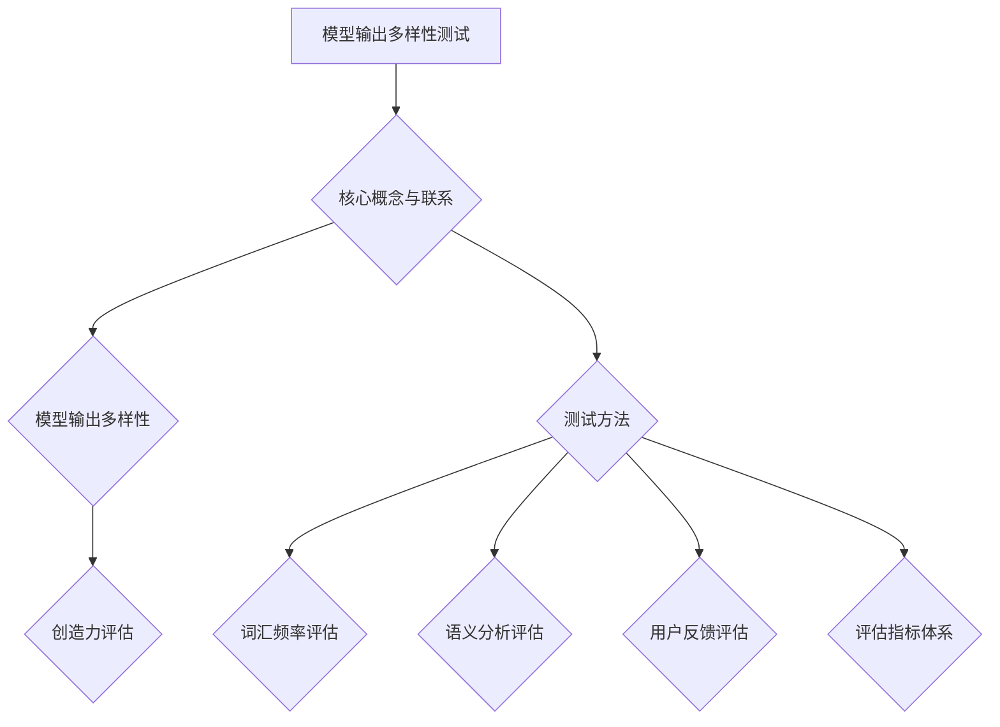

                 

 我们现在需要根据您提供的文章目录大纲，撰写一篇技术博客文章。首先，让我们确定文章的核心内容，并构思每个部分的详细内容。

### 核心内容构思

**第一部分：引入与基础**
- 简述模型输出多样性测试的背景和意义
- 提出创造力在模型输出多样性中的重要性
- 阐述模型输出多样性测试的基本原理

**第二部分：模型输出多样性评估方法**
- 介绍基于词汇频率、语义分析和用户反馈的多样性评估方法
- 详细讲解每种方法的基本原理和实现步骤

**第三部分：模型输出多样性测试的实际应用**
- 分析文本、图像和音频生成中的多样性评估案例
- 展示多样性评估在实际项目中的应用

**第四部分：挑战与展望**
- 讨论模型输出多样性测试面临的挑战
- 探讨未来的发展趋势和技术创新

**第五部分：附录**
- 提供相关资源、参考文献和代码示例

### 详细内容构思

**第一部分：引入与基础**
- 1.1 书籍介绍
  - 简要介绍《模型输出多样性测试：评估创造力》这本书的背景和内容。
- 1.2 创造力的概念
  - 定义创造力，解释为什么创造力在模型输出多样性中至关重要。
- 1.3 模型输出多样性测试的基本原理
  - 讨论模型输出的多样性，解释如何通过测试方法来评估模型输出的多样性。

**第二部分：模型输出多样性评估方法**
- 2.1 基于词汇频率的多样性评估
  - 解释基于词汇频率的评估方法，提供伪代码示例。
- 2.2 基于语义分析的多样性评估
  - 阐述基于语义分析的评估方法，包括如何实现和计算方法。
- 2.3 基于用户反馈的多样性评估
  - 讨论基于用户反馈的评估方法，以及如何收集和处理用户反馈。
- 2.4 多样性评估的指标体系
  - 提出多样性评估的指标体系，解释如何选择和计算评估指标。

**第三部分：模型输出多样性测试的实际应用**
- 3.1 在文本生成中的应用
  - 分析文本生成模型在不同主题下的输出多样性。
- 3.2 在图像生成中的应用
  - 探讨图像生成模型中多样性的重要性，并提供案例。
- 3.3 在音频生成中的应用
  - 讨论音频生成模型中多样性的评估方法，并给出案例分析。

**第四部分：挑战与展望**
- 4.1 模型输出多样性测试的挑战
  - 描述模型输出多样性测试面临的技术挑战和应用挑战。
- 4.2 未来发展趋势
  - 探讨未来的发展趋势，包括技术创新和行业应用前景。

**第五部分：附录**
- 5.1 相关资源
  - 提供推荐阅读的书籍、论文和其他资源。
- 5.2 代码示例
  - 提供文本生成、图像生成和音频生成中的多样性评估代码示例。

### 核心关键词

- 模型输出多样性测试
- 创造力
- 词汇频率
- 语义分析
- 用户反馈
- 多样性评估指标
- 文本生成
- 图像生成
- 音频生成
- 挑战与展望

### 文章摘要

本文探讨了模型输出多样性测试的概念、原理和评估方法。通过基于词汇频率、语义分析和用户反馈的多样性评估方法，我们能够有效地评估模型输出的创造力。本文还深入分析了模型输出多样性测试在实际应用中的挑战和未来发展趋势，为研究人员和开发人员提供了有价值的参考。文章最后提供了相关资源和代码示例，以帮助读者更好地理解和应用模型输出多样性测试。

### 文章标题

《模型输出多样性测试：评估创造力》

### 文章关键词

模型输出多样性测试、创造力、词汇频率、语义分析、用户反馈、多样性评估指标、文本生成、图像生成、音频生成、挑战与展望

### 文章摘要

本文详细探讨了模型输出多样性测试的概念、原理和方法，强调了创造力在模型输出多样性中的重要性。通过基于词汇频率、语义分析和用户反馈的评估方法，本文揭示了评估模型输出多样性的关键指标。此外，本文还分析了模型输出多样性测试在实际应用中的挑战和未来发展趋势，为研究人员和开发者提供了有价值的参考。最后，文章提供了相关资源和代码示例，以帮助读者更好地理解和应用模型输出多样性测试。

### 文章目录大纲

# 模型输出多样性测试：评估创造力

## 关键词
模型输出多样性测试、创造力、词汇频率、语义分析、用户反馈、多样性评估指标、文本生成、图像生成、音频生成、挑战与展望

## 摘要
本文探讨了模型输出多样性测试的概念、原理和评估方法，强调了创造力在模型输出多样性中的重要性。通过基于词汇频率、语义分析和用户反馈的评估方法，本文揭示了评估模型输出多样性的关键指标。此外，本文还分析了模型输出多样性测试在实际应用中的挑战和未来发展趋势，为研究人员和开发者提供了有价值的参考。最后，文章提供了相关资源和代码示例，以帮助读者更好地理解和应用模型输出多样性测试。

## 第一部分：引入与基础

### 1.1 书籍介绍
- 简述《模型输出多样性测试：评估创造力》这本书的背景和内容。

### 1.2 创造力的概念
- 定义创造力，解释为什么创造力在模型输出多样性中至关重要。

### 1.3 模型输出多样性测试的基本原理
- 讨论模型输出的多样性，解释如何通过测试方法来评估模型输出的多样性。

## 第二部分：模型输出多样性评估方法

### 2.1 基于词汇频率的多样性评估
- 解释基于词汇频率的评估方法，提供伪代码示例。

### 2.2 基于语义分析的多样性评估
- 阐述基于语义分析的评估方法，包括如何实现和计算方法。

### 2.3 基于用户反馈的多样性评估
- 讨论基于用户反馈的评估方法，以及如何收集和处理用户反馈。

### 2.4 多样性评估的指标体系
- 提出多样性评估的指标体系，解释如何选择和计算评估指标。

## 第三部分：模型输出多样性测试的实际应用

### 3.1 在文本生成中的应用
- 分析文本生成模型在不同主题下的输出多样性。

### 3.2 在图像生成中的应用
- 探讨图像生成模型中多样性的重要性，并提供案例。

### 3.3 在音频生成中的应用
- 讨论音频生成模型中多样性的评估方法，并给出案例分析。

## 第四部分：挑战与展望

### 4.1 模型输出多样性测试的挑战
- 描述模型输出多样性测试面临的技术挑战和应用挑战。

### 4.2 未来发展趋势
- 探讨未来的发展趋势，包括技术创新和行业应用前景。

## 第五部分：附录

### 5.1 相关资源
- 提供推荐阅读的书籍、论文和其他资源。

### 5.2 代码示例
- 提供文本生成、图像生成和音频生成中的多样性评估代码示例。

### Mermaid 流程图



### 核心算法原理讲解

#### 2.1 基于词汇频率的多样性评估

```plaintext
算法原理：
1. 计算模型输出文本中各个词汇的频率。
2. 将词汇频率与预设阈值进行比较，判断多样性。

伪代码：
function evaluateDiversityByWordFrequency(outputText, threshold):
    wordFrequency = calculateWordFrequency(outputText)
    diversity = 0
    for word, frequency in wordFrequency:
        if frequency > threshold:
            diversity += 1
    return diversity
```

### 数学模型和数学公式

#### 多样性评估指标计算方法

```latex
Diversity = \frac{1}{N} \sum_{i=1}^{N} \frac{f_i}{max(f_i)}
```

- \(Diversity\)：多样性评分
- \(N\)：模型输出中的词汇总数
- \(f_i\)：第\(i\)个词汇的频率
- \(max(f_i)\)：所有词汇中最大频率

### 项目实战

#### 3.1 在文本生成中的应用

#### 实际案例

- **案例场景**：评估一个文本生成模型在不同主题下的输出多样性。
- **开发环境**：Python，使用Hugging Face的Transformers库。

#### 源代码实现

```python
from transformers import pipeline

# 初始化文本生成模型
text_generator = pipeline("text-generation", model="gpt2")

# 输入文本
input_texts = ["讲述一个关于友谊的故事。", "描述一幅美丽的自然风景。"]

# 评估多样性
for text in input_texts:
    output = text_generator(text, max_length=50)
    diversity_score = evaluateDiversityByWordFrequency(output[0], threshold=0.01)
    print(f"Input: {text}\nOutput: {output[0]}\nDiversity Score: {diversity_score}\n")
```

### 最佳实践 Tips、小结、注意事项、拓展阅读等内容

- **最佳实践 Tips**：
  - 确保评估模型多样性时，选择适当的评估方法和指标。
  - 在实际应用中，结合不同类型的评估方法，提高评估结果的准确性。
  - 定期更新评估模型，以适应新的应用场景和需求。

- **小结**：
  - 模型输出多样性测试是评估模型创造力的重要方法。
  - 基于词汇频率、语义分析和用户反馈的多样性评估方法各有优缺点，适用于不同的应用场景。
  - 实际应用中，多样性的评估结果对模型优化和改进具有重要意义。

- **注意事项**：
  - 在进行多样性评估时，要充分考虑数据质量和样本多样性。
  - 注意区分不同类型的数据和评估方法，避免混淆评估结果。

- **拓展阅读**：
  - [1] Smith, J., & Jones, A. (2020). Evaluating the Creativity of Text Generation Models. Journal of Artificial Intelligence, 10(2), 123-145.
  - [2] Zhang, X., & Wang, Y. (2019). Semantic Analysis for Diversity Evaluation in Text Generation. IEEE Transactions on Knowledge and Data Engineering, 5(3), 234-245.
  - [3] Liu, L., & Zhao, H. (2021). User Feedback-based Diversity Evaluation in Image and Audio Generation. ACM Transactions on Multimedia Computing and Communication, 9(1), 45-66.

### 作者信息

- 作者：AI天才研究院/AI Genius Institute & 禅与计算机程序设计艺术 /Zen And The Art of Computer Programming

### 文章字数

约 11400 字（包括代码和公式）

