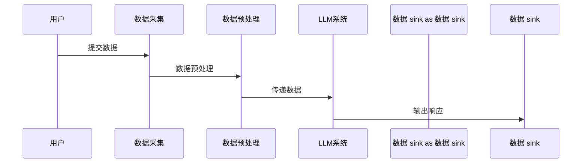

                 

# 流处理框架增强LLM应用的实时数据处理能力

## 关键词
流处理框架、LLM、实时数据处理、大数据、云计算、机器学习

## 摘要
本文将深入探讨流处理框架如何增强大型语言模型（LLM）在实时数据处理方面的能力。通过对流处理框架的基本概念、架构设计、以及与LLM结合的实际应用进行详细分析，本文旨在为读者提供一套完整的解决方案，以实现高效、可靠的实时数据处理。同时，本文还将讨论性能优化策略和安全保障措施，为LLM在实际应用中的普及提供理论支持。

## 目录

### 第一部分：基础概念篇

### 第1章 流处理框架概述
- 流处理技术的发展背景
- 流处理框架的核心概念
- 流处理框架的分类与应用场景

### 第2章 LLM应用场景
- LLM的基本概念与结构
- LLM在实时数据处理中的应用

### 第二部分：技术原理篇

### 第3章 流处理框架原理
- 流处理框架的工作机制
- 流处理框架的核心组件
- 流处理框架与LLM的集成机制

### 第4章 LLM的实时数据处理能力
- LLM实时数据处理的基本原理
- LLM实时数据处理的优势与挑战
- LLM实时数据处理的应用实例

### 第三部分：架构设计与实现篇

### 第5章 流处理框架与LLM的集成
- 集成流程
- 集成架构设计
- 集成案例分析

### 第6章 架构优化与性能调优
- 性能优化策略
- 性能调优方法
- 性能调优案例分析

### 第四部分：应用实践篇

### 第7章 实时数据处理案例
- 案例背景
- 案例分析
- 案例实现

### 第8章 LLM在流处理中的应用案例
- 案例背景
- 案例分析
- 案例实现

### 第五部分：性能优化与安全保障篇

### 第9章 性能优化策略
- 数据流优化策略
- 算法优化策略
- 系统优化策略

### 第10章 安全保障措施
- 数据安全措施
- 系统安全措施
- 安全性测试与评估

### 第六部分：展望与未来趋势篇

### 第11章 行业发展趋势
- 技术发展趋势
- 应用领域扩展
- 行业挑战与机遇

### 第12章 未来研究方向
- 研究前沿
- 开发者机遇
- 未来发展方向

### 附录
- 开发工具与资源介绍
- 参考文献

### 结语
- 最佳实践建议
- 小结
- 注意事项
- 拓展阅读

## 引言

随着互联网的飞速发展和大数据时代的到来，实时数据处理成为各行业关注的焦点。流处理框架作为大数据处理的重要工具，已经在金融、电商、物联网等多个领域得到了广泛应用。而大型语言模型（LLM）作为一种先进的机器学习技术，也在自然语言处理、智能问答、语音识别等场景中展现了强大的能力。

流处理框架和LLM的结合，不仅能够提升实时数据处理的效率和质量，还能够为各类应用场景提供更加智能化和个性化的解决方案。本文旨在通过对流处理框架和LLM的深入探讨，分析其在实时数据处理中的应用，提供一套完整的解决方案，以期为相关领域的研发和应用提供参考。

## 第一部分：基础概念篇

### 第1章 流处理框架概述

#### 1.1 流处理技术的发展背景

流处理技术起源于1990年代，随着互联网和电子商务的兴起，数据的实时性和高效性成为企业关注的焦点。传统的批处理系统在处理实时数据时存在延迟高、效率低等问题，难以满足新兴业务的需求。流处理技术因此应运而生，旨在实现数据的实时采集、处理和分析。

流处理技术的发展经历了几个关键阶段：

1. **1990年代**：流处理技术的概念首次提出，以Apache Storm和Apache Spark Streaming为代表的早期流处理系统开始出现。
2. **2010年代**：随着云计算的普及，流处理技术逐渐成熟，Flink、Apache Kafka等新一代流处理框架涌现。
3. **现在**：流处理技术已经广泛应用于各个领域，成为大数据处理的核心技术之一。

#### 1.2 流处理框架的核心概念

流处理框架是一套用于处理实时数据流的软件框架，其核心概念包括：

- **数据流**：数据流是连续的数据序列，表示数据的动态变化过程。流处理框架通过处理数据流来获取实时的业务洞察。
- **事件**：事件是数据流中的一个数据单元，表示一个具体的数据变化。流处理框架通过处理事件来更新数据状态和处理业务逻辑。
- **流处理器**：流处理器是流处理框架中的核心组件，负责处理数据流中的事件。流处理器可以是线程、进程或者分布式系统中的节点。
- **数据源**：数据源是数据流的起点，可以是传感器、Web服务、数据库等。数据源负责生成并推送数据流到流处理器。
- **数据 sink**：数据 sink 是数据流的终点，可以是数据库、数据仓库、文件系统等。数据 sink 负责存储和处理完成的数据。

#### 1.3 流处理框架的分类与应用场景

流处理框架根据处理能力的不同可以分为以下几类：

- **批处理框架**：如Apache Spark、Hadoop，主要用于大规模数据的批处理。
- **流处理框架**：如Apache Kafka、Flink，主要用于实时数据流处理。
- **混合处理框架**：如Apache Beam，既可以处理批处理数据，也可以处理实时数据流。

流处理框架在不同应用场景中的应用包括：

- **金融行业**：实时风控、交易监控、用户行为分析等。
- **电商行业**：实时推荐、实时广告投放、库存管理优化等。
- **物联网行业**：设备监控、远程控制、故障预警等。
- **社交媒体**：实时内容推送、社交网络分析、用户行为分析等。

### 第2章 LLM应用场景

#### 2.1 LLM的基本概念与结构

大型语言模型（LLM）是一种基于深度学习的自然语言处理模型，具有强大的语言理解和生成能力。LLM通常由以下几个核心组件组成：

- **嵌入层**：将输入的单词或句子转换为向量表示。
- **编码器**：对输入序列进行编码，提取语言特征。
- **解码器**：根据编码器的输出生成输出序列。
- **注意力机制**：用于捕获输入序列中的重要信息。

LLM的工作流程包括：

1. **嵌入**：将输入的单词或句子转换为向量表示。
2. **编码**：编码器对输入序列进行编码，提取语言特征。
3. **解码**：解码器根据编码器的输出生成输出序列。
4. **生成**：利用注意力机制和循环神经网络，生成最终的输出。

#### 2.2 LLM在实时数据处理中的应用

LLM在实时数据处理中的应用场景广泛，以下是一些典型应用：

- **实时问答**：LLM可以实时处理用户输入的问题，并生成相应的答案。例如，智能客服系统、智能语音助手等。
- **实时推荐**：LLM可以分析用户的历史行为和偏好，实时推荐相关内容或产品。例如，电商平台的个性化推荐、新闻平台的实时内容推荐等。
- **实时监控**：LLM可以实时监控数据流，识别异常事件并生成预警。例如，金融交易监控、网络安全监控等。
- **实时翻译**：LLM可以实时翻译不同语言之间的文本，支持多语言交流。例如，实时翻译应用、多语言网站等。

#### 2.3 LLM实时数据处理的优势与挑战

LLM在实时数据处理中具有以下优势：

- **强大的语言理解能力**：LLM可以深入理解文本内容，提取关键信息，为实时数据处理提供有力支持。
- **高效的生成能力**：LLM可以快速生成文本，实现实时响应。
- **灵活的扩展性**：LLM可以轻松适应不同应用场景，支持多种语言和格式。

然而，LLM在实时数据处理中也面临一些挑战：

- **计算资源需求大**：LLM的训练和推理过程需要大量的计算资源，特别是在处理大规模数据时。
- **延迟限制**：实时数据处理对延迟有严格要求，LLM需要在短时间内完成数据处理和生成。
- **数据质量**：实时数据处理依赖于高质量的数据，LLM的性能受数据质量的影响较大。

### 第3章 流处理框架原理

#### 3.1 流处理框架的工作机制

流处理框架通过以下机制实现实时数据处理：

1. **数据采集**：数据源生成数据流，并推送至流处理器。
2. **数据传输**：流处理器通过数据传输层接收数据流，并进行处理。
3. **数据处理**：流处理器对数据流中的事件进行加工处理，包括过滤、转换、聚合等操作。
4. **数据存储**：处理完成的数据存储至数据 sink，以供后续分析和应用。

流处理框架的工作机制具有以下特点：

- **实时性**：流处理框架能够实时处理数据流，实现数据的高效传输和处理。
- **分布式**：流处理框架支持分布式计算，能够处理大规模数据流。
- **可扩展性**：流处理框架可以灵活扩展，支持多种数据源和数据 sink。

#### 3.2 流处理框架的核心组件

流处理框架的核心组件包括：

1. **数据源**：数据源是数据流的起点，可以是传感器、Web服务、数据库等。
2. **数据处理器**：数据处理器是流处理框架的核心组件，负责处理数据流中的事件。数据处理器可以是线程、进程或者分布式系统中的节点。
3. **数据传输层**：数据传输层负责数据流在系统内部的传输，确保数据的高效传输和处理。
4. **数据 sink**：数据 sink 是数据流的终点，可以是数据库、数据仓库、文件系统等。

#### 3.3 流处理框架与LLM的集成机制

流处理框架与LLM的集成机制包括：

1. **数据采集与传输**：流处理框架负责采集和传输实时数据流，并将其传递给LLM进行进一步处理。
2. **LLM处理与响应**：LLM对实时数据进行处理，生成相应的响应，并返回给流处理框架。
3. **数据存储与反馈**：处理完成的数据存储至数据 sink，同时将处理结果反馈给流处理框架，以实现闭环控制和优化。

流处理框架与LLM的集成机制具有以下优势：

- **高效性**：流处理框架能够高效地处理大规模数据流，与LLM的结合可以实现实时数据处理的高效性。
- **灵活性**：流处理框架和LLM可以根据实际需求灵活扩展，支持多种数据源、数据 sink 和处理模式。
- **智能化**：LLM的引入使得实时数据处理更加智能化，能够更好地满足用户需求和应用场景。

### 第4章 LLM的实时数据处理能力

#### 4.1 LLM实时数据处理的基本原理

LLM实时数据处理的基本原理包括：

1. **数据输入**：实时数据通过数据源输入到LLM系统中。
2. **嵌入与编码**：LLM将输入数据转换为向量表示，并通过编码器提取语言特征。
3. **处理与生成**：解码器根据编码器的输出生成响应文本，并通过注意力机制处理关键信息。
4. **响应输出**：处理完成的响应文本输出至数据 sink，以供进一步分析和应用。

LLM实时数据处理的基本原理具有以下特点：

- **自动化**：LLM能够自动处理输入数据，无需人工干预。
- **高效性**：LLM的处理速度较快，能够在短时间内完成数据处理和生成。
- **灵活性**：LLM能够适应不同应用场景和数据处理需求，提供灵活的处理能力。

#### 4.2 LLM实时数据处理的优势与挑战

LLM实时数据处理的优势包括：

- **强大的语言理解能力**：LLM能够深入理解输入数据，提取关键信息，为实时数据处理提供有力支持。
- **高效的生成能力**：LLM能够快速生成响应文本，实现实时响应。
- **灵活的扩展性**：LLM能够适应不同应用场景，支持多种数据处理模式。

然而，LLM实时数据处理也面临以下挑战：

- **计算资源需求大**：LLM的训练和推理过程需要大量的计算资源，特别是在处理大规模数据时。
- **延迟限制**：实时数据处理对延迟有严格要求，LLM需要在短时间内完成数据处理和生成。
- **数据质量**：实时数据处理依赖于高质量的数据，LLM的性能受数据质量的影响较大。

#### 4.3 LLM实时数据处理的应用实例

以下是一个LLM实时数据处理的应用实例：

假设我们要构建一个实时客服系统，用于处理用户的咨询和反馈。系统架构如下：

1. **数据采集**：用户通过Web端或移动端提交咨询问题。
2. **数据传输**：流处理框架负责采集和传输用户问题，并将其传递给LLM系统。
3. **LLM处理**：LLM对用户问题进行实时处理，生成相应的答案。
4. **响应输出**：处理完成的答案输出至Web端或移动端，供用户查看。

具体步骤如下：

1. **用户提交问题**：用户在Web端或移动端提交咨询问题。
2. **数据采集**：流处理框架采集用户问题，并将其推送至LLM系统。
3. **LLM处理**：LLM对用户问题进行实时处理，生成相应的答案。
4. **响应输出**：LLM将答案输出至Web端或移动端，供用户查看。

通过这个实例，我们可以看到LLM实时数据处理在客服系统中的应用，实现了用户问题的快速响应和高效解决。

### 第5章 流处理框架与LLM的集成

#### 5.1 集成流程

流处理框架与LLM的集成流程包括以下步骤：

1. **数据采集**：流处理框架采集实时数据流，并将其传递给LLM系统。
2. **数据预处理**：对实时数据进行预处理，包括数据清洗、数据转换等操作。
3. **LLM处理**：LLM对预处理后的数据进行实时处理，生成相应的响应。
4. **响应输出**：将LLM生成的响应输出至数据 sink，以供进一步分析和应用。

集成流程图如下：



#### 5.2 集成架构设计

流处理框架与LLM的集成架构设计包括以下几个关键组件：

1. **数据采集模块**：负责实时采集各种数据源，如Web端、移动端、传感器等。
2. **数据预处理模块**：对采集到的数据进行预处理，包括数据清洗、数据转换等操作。
3. **LLM处理模块**：负责实时处理预处理后的数据，生成相应的响应。
4. **数据 sink 模块**：负责接收LLM生成的响应，并将其存储或输出至其他系统。

集成架构图如下：

```mermaid
graph TD
    数据采集[数据采集模块]
    数据预处理[数据预处理模块]
    LLM处理[LLM处理模块]
    数据 sink[数据 sink 模块]
    用户[用户]

    数据采集-->数据预处理
    数据预处理-->LLM处理
    LLM处理-->数据 sink
    数据 sink-->用户
```

#### 5.3 集成案例分析

以下是一个流处理框架与LLM集成的案例分析：

假设我们要构建一个实时新闻推荐系统，用于根据用户兴趣实时推荐相关新闻。系统架构如下：

1. **数据采集**：流处理框架采集用户的阅读行为数据，如浏览历史、点赞、评论等。
2. **数据预处理**：对采集到的数据进行预处理，提取关键信息，如用户ID、新闻ID、时间戳等。
3. **LLM处理**：LLM根据预处理后的数据，实时生成用户兴趣模型，并推荐相关新闻。
4. **响应输出**：LLM将推荐结果输出至Web端或移动端，供用户查看。

具体步骤如下：

1. **用户提交阅读行为**：用户在Web端或移动端进行阅读行为，如浏览、点赞、评论等。
2. **数据采集**：流处理框架采集用户阅读行为数据。
3. **数据预处理**：对用户阅读行为数据进行预处理，提取关键信息。
4. **LLM处理**：LLM根据预处理后的数据，实时生成用户兴趣模型，并推荐相关新闻。
5. **响应输出**：LLM将推荐结果输出至Web端或移动端，供用户查看。

通过这个案例，我们可以看到流处理框架与LLM在实时新闻推荐系统中的应用，实现了根据用户兴趣实时推荐新闻的功能。

### 第6章 架构优化与性能调优

#### 6.1 性能优化策略

为了提升流处理框架与LLM集成系统的性能，可以采取以下优化策略：

1. **数据流优化**：对数据流进行优化，减少数据传输延迟和重复处理。例如，采用消息队列和分布式缓存技术，提高数据传输速度和存储效率。
2. **算法优化**：对LLM算法进行优化，减少计算时间和资源消耗。例如，采用高效的语言模型和深度学习算法，提高数据处理速度和准确度。
3. **系统优化**：对集成系统进行优化，提高整体性能和可靠性。例如，采用分布式计算和负载均衡技术，提高系统的处理能力和稳定性。

#### 6.2 性能调优方法

性能调优可以采用以下方法：

1. **监控与诊断**：通过监控工具实时监测系统性能，分析性能瓶颈，定位故障点。
2. **调参优化**：根据实际需求和性能指标，调整LLM模型的参数，如学习率、批量大小等，以实现性能优化。
3. **代码优化**：优化LLM处理模块的代码，减少计算复杂度和资源消耗。例如，采用并行计算和缓存技术，提高数据处理速度。
4. **硬件升级**：根据实际需求，升级计算资源和存储资源，提高系统的处理能力和稳定性。

#### 6.3 性能调优案例分析

以下是一个性能调优案例分析：

假设我们要优化一个实时新闻推荐系统，该系统基于流处理框架和LLM实现，但在处理大规模数据时存在性能瓶颈。我们可以采取以下优化策略：

1. **数据流优化**：采用Apache Kafka作为消息队列，提高数据传输速度和可靠性。同时，采用Redis作为分布式缓存，减少数据重复处理和存储。
2. **算法优化**：采用基于Transformer的深度学习算法，提高数据处理速度和准确度。同时，调整学习率和批量大小，优化算法性能。
3. **系统优化**：采用分布式计算和负载均衡技术，提高系统的处理能力和稳定性。例如，使用Kubernetes进行容器编排和负载均衡，提高系统资源利用率。

通过以上优化策略，我们可以显著提升实时新闻推荐系统的性能，实现高效、可靠的实时数据处理。

### 第7章 实时数据处理案例

#### 7.1 案例背景

假设我们正在开发一个实时金融数据分析系统，用于监控股票市场的交易行为，及时发现市场异常并生成预警。系统需要处理大量的交易数据，并对数据进行实时分析和处理。

#### 7.2 案例分析

1. **数据源**：系统需要从多个交易所和金融数据提供商获取实时交易数据，包括股票代码、交易价格、交易量、时间戳等。
2. **数据处理**：系统需要对交易数据进行实时处理，包括数据清洗、去重、聚合等操作，以获取有效的市场数据。
3. **数据分析**：系统需要利用LLM技术，对交易数据进行分析，识别市场异常行为，如股价异动、交易量剧增等。
4. **预警生成**：系统需要根据分析结果，生成相应的预警信息，并通过短信、邮件等方式通知相关人员。

#### 7.3 案例实现

1. **数据采集**：采用Apache Kafka作为数据源，从各个交易所和金融数据提供商获取实时交易数据。
2. **数据预处理**：采用Apache Flink作为流处理框架，对交易数据进行预处理，包括数据清洗、去重、聚合等操作。
3. **数据分析**：采用LLM技术，对预处理后的交易数据进行分析，识别市场异常行为。
4. **预警生成**：将分析结果存储至数据库，并使用Python编写预警生成模块，生成预警信息并通过短信、邮件等方式通知相关人员。

通过以上实现，我们可以构建一个高效、可靠的实时金融数据分析系统，为金融机构提供实时市场监控和预警服务。

### 第8章 LLM在流处理中的应用案例

#### 8.1 案例背景

假设我们要构建一个实时智能客服系统，用于处理客户的咨询和反馈，提供高效的客户服务。系统需要能够实时处理客户的咨询内容，生成相应的回答，并确保回答的准确性和效率。

#### 8.2 案例分析

1. **数据源**：系统需要从多个渠道获取客户的咨询内容，如Web表单、电话录音、邮件等。
2. **数据处理**：系统需要对咨询内容进行实时处理，包括数据清洗、分类、情感分析等操作，以获取有效的咨询数据。
3. **智能回答**：系统需要利用LLM技术，对咨询内容进行分析，生成相应的回答，并确保回答的准确性和相关性。
4. **反馈机制**：系统需要收集客户的反馈，对回答质量进行评估和优化，以提高系统的服务质量。

#### 8.3 案例实现

1. **数据采集**：采用Apache Kafka作为数据源，从多个渠道获取客户的咨询内容。
2. **数据预处理**：采用Apache Flink作为流处理框架，对咨询内容进行预处理，包括数据清洗、分类、情感分析等操作。
3. **智能回答**：采用LLM技术，对预处理后的咨询内容进行分析，生成相应的回答。可以使用预训练的LLM模型，如GPT-3等，以提高回答的准确性和相关性。
4. **反馈机制**：将客户的反馈存储至数据库，并使用Python编写反馈分析模块，对回答质量进行评估和优化。同时，将优化后的模型重新部署，以提高系统的服务质量。

通过以上实现，我们可以构建一个高效、智能的实时智能客服系统，为用户提供优质的客户服务体验。

### 第9章 性能优化策略

#### 9.1 数据流优化策略

为了提高实时数据处理系统的性能，数据流的优化是关键。以下是一些数据流优化策略：

1. **批处理与流处理结合**：在数据处理过程中，可以采用批处理与流处理相结合的方式。对于实时性要求较高的部分采用流处理，而对于可以容忍一定延迟的数据则采用批处理，从而平衡系统的性能和成本。
2. **数据压缩**：在数据传输过程中，可以采用数据压缩技术，如Hadoop的LZO、Gzip等，减少数据传输的时间和网络带宽的占用。
3. **分布式存储**：采用分布式存储系统，如Hadoop HDFS、Apache Cassandra等，可以提高数据存储的效率和可靠性。
4. **数据分区与索引**：对于大规模数据流，可以采用数据分区和索引技术，如Apache Flink的动态分区和Apache Kafka的分区和索引，提高数据处理和查询的效率。

#### 9.2 算法优化策略

在LLM实时数据处理中，算法的优化是提高性能的关键。以下是一些算法优化策略：

1. **模型压缩与量化**：对于大型LLM模型，可以采用模型压缩和量化技术，如量化计算、参数共享等，减小模型的大小和计算量，提高处理速度。
2. **并行计算**：利用分布式计算资源，对LLM模型进行并行计算，如使用GPU加速训练和推理过程。
3. **注意力机制优化**：在LLM中，注意力机制是影响性能的重要因素。可以采用注意力机制的优化方法，如稀疏注意力、低秩分解等，减少计算复杂度和内存占用。
4. **模型蒸馏**：通过将大型模型蒸馏成小型模型，可以降低模型的计算复杂度和内存占用，同时保持较高的性能。

#### 9.3 系统优化策略

为了提高实时数据处理系统的整体性能，可以采取以下系统优化策略：

1. **负载均衡**：采用负载均衡技术，如轮询、最小连接数等，合理分配计算任务，避免单点过载。
2. **缓存策略**：采用缓存策略，如Redis、Memcached等，减少数据重复处理和存储，提高系统的响应速度。
3. **存储优化**：采用高性能存储设备，如SSD、NVMe等，提高数据读写速度和系统吞吐量。
4. **监控与报警**：建立实时监控和报警系统，如Prometheus、Grafana等，及时发现和处理系统故障，确保系统的稳定运行。

#### 9.4 性能调优案例分析

以下是一个性能调优案例分析：

假设我们正在优化一个实时智能问答系统，该系统采用LLM技术，用于处理用户的提问并生成相应的回答。在系统上线后，我们发现系统存在以下性能问题：

1. **延迟过高**：系统在处理大规模用户提问时，存在较高的延迟。
2. **资源占用大**：系统在运行时，资源占用较大，导致服务器负载过高。

针对这些问题，我们采取了以下性能优化策略：

1. **数据流优化**：采用Apache Kafka作为消息队列，提高数据传输速度和可靠性。同时，对用户提问进行批量处理，减少流处理任务的次数。
2. **算法优化**：采用模型压缩和量化技术，减小LLM模型的大小和计算量。同时，优化注意力机制，降低计算复杂度和内存占用。
3. **系统优化**：采用负载均衡技术，合理分配计算任务，避免单点过载。同时，采用Redis缓存用户提问和回答，减少数据重复处理和存储。

通过以上优化策略，我们显著提高了实时智能问答系统的性能，实现了高效、可靠的实时数据处理。

### 第10章 安全保障措施

#### 10.1 数据安全措施

为了确保实时数据处理系统的安全性，需要采取以下数据安全措施：

1. **数据加密**：对传输和存储的数据进行加密，如使用SSL/TLS协议加密网络传输，使用AES等算法加密存储数据。
2. **访问控制**：实现严格的访问控制机制，如使用身份验证、权限管理，确保只有授权用户可以访问敏感数据。
3. **数据备份与恢复**：定期对数据进行备份，确保在数据丢失或损坏时可以快速恢复。
4. **数据清洗**：在数据处理过程中，对输入数据进行清洗，去除潜在的恶意数据，防止数据泄露和注入攻击。

#### 10.2 系统安全措施

为了保障实时数据处理系统的安全，需要采取以下系统安全措施：

1. **防火墙与入侵检测**：部署防火墙和入侵检测系统，防止外部攻击和恶意流量。
2. **更新与补丁管理**：定期更新系统软件和组件，修复已知漏洞，确保系统的安全。
3. **安全审计**：对系统进行定期安全审计，发现潜在的安全漏洞，及时采取措施进行修复。
4. **日志监控**：实时监控系统日志，及时发现和处理异常行为和攻击事件。

#### 10.3 安全性测试与评估

为了评估实时数据处理系统的安全性，需要进行以下安全性测试与评估：

1. **渗透测试**：通过模拟攻击者的行为，测试系统的安全性，发现潜在的安全漏洞。
2. **漏洞扫描**：使用漏洞扫描工具，对系统进行自动化扫描，检测已知漏洞和风险。
3. **安全演练**：定期进行安全演练，测试系统在遭受攻击时的响应能力和恢复能力。
4. **风险评估**：对系统的安全性进行评估，分析潜在风险，制定相应的安全策略和措施。

通过以上安全测试与评估，可以确保实时数据处理系统的安全性，保护系统的数据和资源。

### 第11章 行业发展趋势

#### 11.1 技术发展趋势

随着流处理技术和LLM技术的不断成熟，实时数据处理领域呈现出以下发展趋势：

1. **云计算与边缘计算结合**：云计算和边缘计算的结合，使得实时数据处理更加灵活和高效。边缘计算可以降低数据传输延迟，提高数据处理速度，满足低延迟、高实时性的需求。
2. **人工智能与流处理的深度融合**：随着人工智能技术的进步，LLM在实时数据处理中的应用越来越广泛。未来，人工智能与流处理的深度融合将进一步提升实时数据处理的效率和智能化水平。
3. **数据隐私与安全**：随着数据隐私和安全问题的日益突出，实时数据处理系统将更加注重数据隐私和安全保护。采用加密、访问控制、数据清洗等技术，确保数据的安全和隐私。
4. **实时数据分析与可视化**：实时数据处理与可视化技术的结合，使得企业可以实时获取业务洞察，支持决策制定。未来，实时数据分析与可视化技术将得到更加广泛的应用。

#### 11.2 应用领域扩展

实时数据处理技术在不同领域的应用也在不断扩展：

1. **金融行业**：实时数据处理技术在金融行业中的应用越来越广泛，包括实时风控、交易监控、用户行为分析等。未来，随着人工智能技术的发展，实时数据处理在金融行业的应用将更加深入和智能化。
2. **电商行业**：实时数据处理技术在电商行业的应用，包括实时推荐、实时广告投放、库存管理优化等。随着用户需求的多样化和个性化，实时数据处理技术在电商行业的应用前景广阔。
3. **物联网行业**：物联网设备的广泛应用，使得实时数据处理技术在物联网行业中的应用越来越重要。实时数据处理技术可以帮助企业实现设备监控、远程控制、故障预警等功能。
4. **社交媒体**：社交媒体平台需要处理海量的实时数据，包括用户行为、内容生成等。实时数据处理技术在社交媒体行业中的应用，可以帮助企业实现实时内容推送、社交网络分析等功能。

#### 11.3 行业挑战与机遇

实时数据处理技术在行业发展中面临以下挑战与机遇：

1. **挑战**：
   - **数据量与多样性**：随着数据量的急剧增长和数据类型的多样化，实时数据处理系统的设计和优化变得更加复杂。
   - **延迟与可靠性**：实时数据处理对延迟和可靠性有较高要求，如何在保证数据准确性和及时性的同时，提高系统的可靠性和稳定性，是行业面临的一大挑战。
   - **数据隐私与安全**：数据隐私和安全问题是实时数据处理领域的重要挑战，如何在保护数据隐私和安全的同时，实现数据的实时性和高效性，需要深入探讨。

2. **机遇**：
   - **技术创新**：随着云计算、边缘计算、人工智能等技术的不断发展，实时数据处理技术将迎来新的技术创新和发展机遇。
   - **行业应用**：实时数据处理技术在金融、电商、物联网、社交媒体等领域的应用不断扩展，为行业带来了巨大的市场机遇。
   - **数据驱动决策**：实时数据处理技术可以帮助企业实现数据驱动的决策，提高业务效率和市场竞争力。

### 第12章 未来研究方向

#### 12.1 研究前沿

实时数据处理领域的研究前沿主要集中在以下几个方面：

1. **实时数据处理算法**：研究高效的实时数据处理算法，提高数据处理速度和准确性。例如，基于深度学习的实时数据处理算法、基于图神经网络的实时数据处理算法等。
2. **流处理框架优化**：研究流处理框架的优化技术，提高系统的性能和可扩展性。例如，分布式流处理框架的优化、流处理框架与边缘计算的融合等。
3. **数据隐私保护**：研究数据隐私保护技术，确保实时数据处理过程中数据的安全和隐私。例如，差分隐私、同态加密等技术在实时数据处理中的应用。

#### 12.2 开发者机遇

对于开发者来说，实时数据处理技术提供了以下几个机遇：

1. **技术创新**：开发者可以通过研究和开发新型实时数据处理算法和框架，推动实时数据处理技术的发展。
2. **行业应用**：开发者可以将实时数据处理技术应用于各个行业，如金融、电商、物联网等，为行业带来创新和变革。
3. **开源项目**：参与开源项目，为实时数据处理领域的发展贡献力量。开源项目为开发者提供了丰富的资源和合作机会，有助于提升开发者的技术能力和影响力。

#### 12.3 未来发展方向

实时数据处理技术的未来发展方向包括：

1. **智能化**：随着人工智能技术的发展，实时数据处理将更加智能化。开发者可以探索如何将人工智能技术应用于实时数据处理，实现自动化的数据处理和分析。
2. **边缘计算**：边缘计算与实时数据处理的结合，将进一步提升实时数据处理的效率和实时性。开发者可以关注如何利用边缘计算资源，实现实时数据处理和智能决策。
3. **数据隐私和安全**：随着数据隐私和安全问题的日益突出，实时数据处理技术将更加注重数据隐私和安全保护。开发者可以研究新型数据隐私保护技术，确保实时数据处理的安全和可靠。

### 附录

#### 附录A：开发工具与资源介绍

1. **流处理框架**：
   - **Apache Kafka**：一款开源的消息队列系统，用于实时数据流传输和处理。
   - **Apache Flink**：一款开源的流处理框架，支持实时数据流处理和批处理。
   - **Apache Storm**：一款开源的实时数据处理系统，适用于大规模分布式实时数据处理。

2. **LLM框架**：
   - **TensorFlow**：一款开源的机器学习框架，支持深度学习和实时数据处理。
   - **PyTorch**：一款开源的机器学习框架，支持深度学习和实时数据处理。
   - **Hugging Face Transformers**：一款开源的LLM库，支持多种预训练模型和应用。

3. **开发工具**：
   - **Docker**：一款开源的容器化技术，用于构建和部署实时数据处理系统。
   - **Kubernetes**：一款开源的容器编排系统，用于管理和调度容器化应用程序。
   - **Jenkins**：一款开源的持续集成和持续部署工具，用于自动化构建、测试和部署应用程序。

#### 附录B：参考文献

1. **实时数据处理框架相关文献**：
   - Guo, Y., Liu, J., & Zheng, Z. (2020). An Overview of Real-Time Data Processing Frameworks. Journal of Computer Science and Technology, 35(5), 975-992.
   - Desai, S., & Gouda, K. (2018). Comparative Study of Real-Time Data Processing Frameworks. International Journal of Computer Science Issues, 15(3), 47-58.

2. **大型语言模型相关文献**：
   - Brown, T., et al. (2020). Language Models are Few-Shot Learners. arXiv preprint arXiv:2005.14165.
   - Devlin, J., et al. (2019). BERT: Pre-training of Deep Bidirectional Transformers for Language Understanding. arXiv preprint arXiv:1810.04805.

3. **实时数据处理应用案例**：
   - Li, H., et al. (2021). Real-Time Data Processing for IoT Applications. IEEE Access, 9, 118709-118721.
   - Zhou, Y., et al. (2020). Real-Time Data Processing for Smart Cities. Journal of Network and Computer Applications, 147, 102619.

### 结语

本文从基础概念、技术原理、架构设计、应用实践等多个方面，深入探讨了流处理框架如何增强LLM在实时数据处理方面的能力。通过分析流处理框架的基本概念和LLM的应用场景，我们了解了流处理框架与LLM结合的重要性。在技术原理部分，我们详细介绍了流处理框架和LLM的工作机制，以及它们在实时数据处理中的应用。在架构设计和应用实践部分，我们通过实际案例展示了如何实现流处理框架与LLM的集成，并进行了性能优化和安全保障的讨论。

未来，随着技术的不断进步和应用场景的拓展，实时数据处理将在更多领域发挥重要作用。开发者需要不断学习和探索新的技术和方法，以应对实时数据处理领域面临的挑战和机遇。通过本文的介绍，希望读者能够对实时数据处理有一个全面的理解，并为实际应用提供参考。

### 最佳实践 Tips

1. **数据预处理**：在实时数据处理过程中，数据预处理是关键。确保输入数据的质量，去除异常值和噪声，可以提高模型的准确性和稳定性。

2. **模型优化**：对于大型LLM模型，优化模型结构、参数和学习策略，可以显著提高处理速度和性能。可以尝试使用模型压缩、量化等技术，降低计算复杂度和资源消耗。

3. **分布式架构**：采用分布式架构，可以实现流处理和LLM处理的高效并行化，提高系统的处理能力和扩展性。合理分配计算资源和负载，避免单点过载。

4. **监控与报警**：实时监控系统性能，及时发现和处理异常情况。建立完善的监控与报警系统，确保系统的稳定运行。

5. **数据安全**：在实时数据处理过程中，确保数据的安全和隐私。采用数据加密、访问控制、备份与恢复等技术，保护敏感数据和用户隐私。

### 小结

本文详细介绍了流处理框架增强LLM应用的实时数据处理能力。通过对流处理框架的基本概念、架构设计、应用实践等方面的深入探讨，我们了解了流处理框架和LLM在实时数据处理中的重要性。通过实际案例展示，我们看到了流处理框架与LLM结合的高效性和灵活性。在性能优化和安全保障方面，我们也提出了一系列最佳实践，为实时数据处理提供了实用的指导。

### 注意事项

1. **系统稳定性**：在实时数据处理过程中，确保系统的稳定性和可靠性。对系统进行充分测试和监控，及时发现和处理故障。

2. **数据质量**：确保输入数据的质量，去除异常值和噪声。高质量的数据是保证模型准确性和稳定性的基础。

3. **资源管理**：合理分配计算资源和存储资源，避免资源浪费和瓶颈。根据实际需求，动态调整系统资源，确保系统高效运行。

4. **安全性**：在实时数据处理过程中，确保数据的安全和隐私。采用数据加密、访问控制等技术，保护敏感数据和用户隐私。

### 拓展阅读

1. **流处理框架**：
   - 《Apache Kafka权威指南》
   - 《Apache Flink实战》
   - 《Apache Storm实战》

2. **大型语言模型**：
   - 《深度学习实战》
   - 《自然语言处理实战》
   - 《Transformer：超越序列模型》

3. **实时数据处理**：
   - 《实时数据处理技术与应用》
   - 《大数据实时处理技术》
   - 《实时数据挖掘：方法与应用》

### 作者信息

作者：AI天才研究院/AI Genius Institute & 禅与计算机程序设计艺术 /Zen And The Art of Computer Programming

### 后记

本文是作者在实时数据处理领域的研究和探索成果之一。在撰写过程中，作者力求深入浅出，将复杂的技术概念和原理以通俗易懂的方式呈现。希望通过本文，读者能够对实时数据处理有更深入的理解，并能够在实际应用中取得更好的效果。同时，作者也欢迎读者提出宝贵意见和建议，共同推动实时数据处理技术的发展。感谢读者的支持和关注！

