                 

### 流处理框架概述

流处理（Stream Processing）是一种处理数据的方法，它将数据视为流动的、连续的数据流，并在数据到达时进行实时处理。与批处理（Batch Processing）不同，批处理是将数据存储一段时间，然后在特定的时间点进行批量处理，而流处理则是在数据产生时立即处理。

#### 1.1 流处理与批处理的区别

**流处理的概念**：流处理是指在数据产生的同时，实时处理数据的一种方式。它的特点包括低延迟、高吞吐量和实时性。

**批处理的概念**：批处理是指将数据存储一段时间，然后在特定的时间点进行批量处理。它的特点包括高吞吐量、可处理大量数据。

**流处理与批处理的主要区别**：

1. **处理方式**：流处理是实时处理，而批处理是批量处理。
2. **延迟**：流处理延迟低，能够快速响应；批处理延迟高，可能需要几个小时或更长时间。
3. **数据量**：批处理适合处理大量数据，而流处理适合处理实时数据。
4. **实时性**：流处理具有高实时性，能够满足实时数据处理需求；批处理则适用于离线分析。

#### 1.2 流处理框架的重要性

在当今数据驱动的世界中，实时数据处理变得越来越重要。流处理框架的重要性主要体现在以下几个方面：

1. **实时数据分析**：流处理框架能够对实时数据进行分析，帮助企业迅速做出决策。
2. **高吞吐量**：流处理框架具有高吞吐量，能够处理大规模数据。
3. **低延迟**：流处理框架能够实现低延迟数据处理，满足实时应用的需求。
4. **可扩展性**：流处理框架支持分布式计算，具有很好的可扩展性。

#### 1.3 当前主流流处理框架介绍

当前主流的流处理框架包括Apache Kafka、Apache Flink、Apache Storm和Apache Spark Streaming。以下是这几种框架的简要介绍：

1. **Apache Kafka**：Kafka是一个分布式流处理平台，主要用于构建实时数据流处理应用。它具有高吞吐量、可扩展性和持久化特点。
2. **Apache Flink**：Flink是一个开源流处理框架，支持流处理和批处理。它具有高性能、可扩展性和支持复杂窗口操作等特点。
3. **Apache Storm**：Storm是一个分布式流处理框架，主要用于处理实时数据流。它具有高吞吐量、低延迟和可扩展性。
4. **Apache Spark Streaming**：Spark Streaming是Spark的一个组件，用于处理实时数据流。它具有高吞吐量、低延迟和集成Spark生态系统等特点。

### 总结

流处理框架在实时数据处理中具有重要意义，能够帮助企业快速响应实时数据，做出准确决策。本文接下来将深入探讨流处理框架的核心概念和架构设计，帮助读者更好地理解流处理技术。

### 关键词
- 流处理
- 批处理
- Kafka
- Flink
- Storm
- Spark Streaming

### 摘要
本文概述了流处理框架的基本概念，比较了流处理与批处理的区别，并介绍了当前主流的流处理框架。文章重点分析了流处理框架在实时数据处理中的重要性，为后续内容奠定了基础。

---

以下是流处理框架核心概念部分的详细内容，我们将在此部分详细探讨数据流模型、消息传递机制和流处理流水线。

#### 第2章：流处理框架核心概念

##### 2.1 数据流模型

数据流模型是流处理框架中的基本概念之一，它描述了数据在系统中流动的方式。在流处理中，数据被视为一系列的事件或记录，这些事件或记录以一定的顺序流动，并在各个处理节点上进行处理。

**数据流模型的定义**：数据流模型是一种描述数据在系统中流动和处理的方式。它通常包括数据源、数据处理器和数据汇等基本组件。

**数据流模型的类型**：根据数据流动的方式，数据流模型可以分为以下几种类型：

1. **事件驱动模型**：事件驱动模型是一种以事件为中心的数据流模型，其中数据以事件的形式流动，每个事件都会触发相应的处理操作。
2. **管道模型**：管道模型是一种以管道为中心的数据流模型，其中数据从一个处理节点流向另一个处理节点，每个节点都执行特定的数据处理操作。
3. **网格模型**：网格模型是一种分布式数据流模型，其中数据在多个处理节点之间流动，每个节点都负责一部分数据处理任务。

**核心概念与联系架构图**：
为了更好地理解数据流模型的核心概念和实体之间的关系，我们可以使用Mermaid流程图来展示：

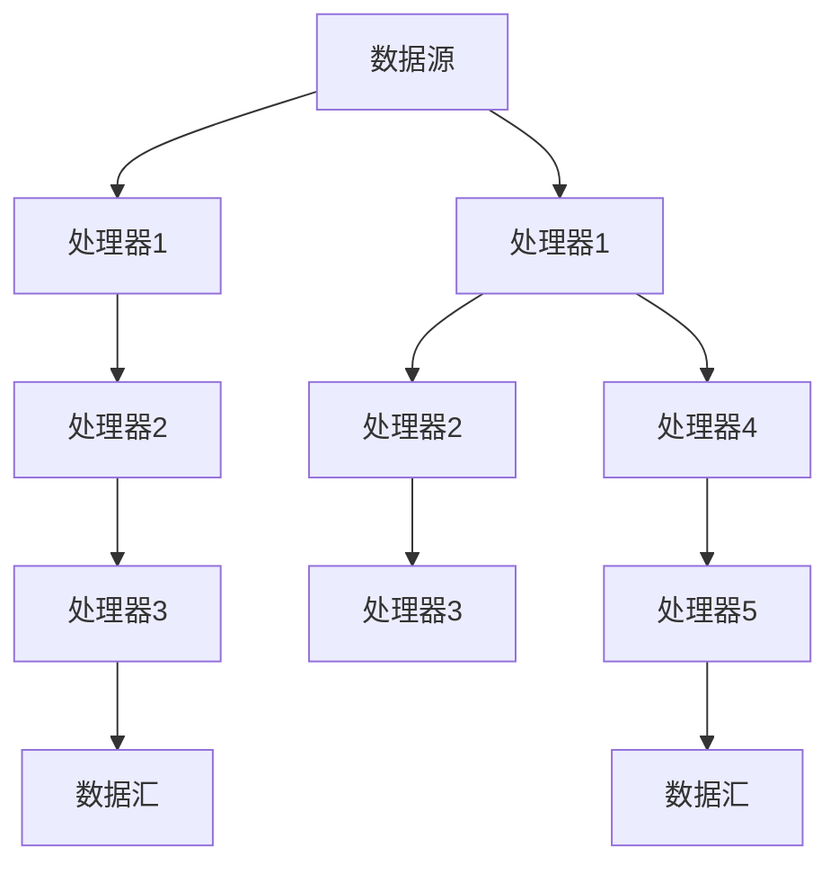

在这个流程图中，A代表数据源，B、C、D和E代表处理节点，F、G、H、I、J和K代表不同的处理器和汇节点。数据从A开始，经过各个处理器进行处理，最终到达汇节点E。

##### 2.2 消息传递机制

消息传递机制是流处理框架中的另一个核心概念，它描述了数据在处理节点之间的传输方式。消息传递机制通常依赖于消息队列或分布式缓存来实现。

**消息队列的概念**：消息队列是一种数据传输系统，它允许生产者将消息发送到队列中，然后消费者从队列中获取消息进行消费。

**消息传递机制的工作原理**：消息传递机制的工作原理如下：

1. **生产者**：生产者是一个发送消息的组件，它将消息发送到消息队列中。
2. **队列**：队列是一个存储消息的组件，它按照一定的顺序存储消息，供消费者消费。
3. **消费者**：消费者是一个从消息队列中获取消息进行消费的组件。

**消息传递机制的工作原理图**：
为了更好地理解消息传递机制的工作原理，我们可以使用Mermaid流程图来展示：

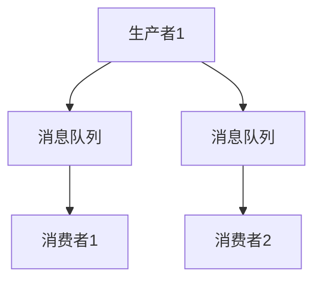

在这个流程图中，A代表生产者，B代表消息队列，C和E代表消费者。生产者A将消息发送到消息队列B，然后消费者C和E从消息队列B中获取消息进行消费。

##### 2.3 流处理流水线

流处理流水线是流处理框架中的一个重要组成部分，它描述了数据在流处理过程中的处理流程。流处理流水线通常包括数据源、处理节点和数据汇等组件。

**流处理流水线的组成部分**：

1. **数据源**：数据源是流处理流水线的起点，它提供数据输入。
2. **处理节点**：处理节点是流处理流水线中的中间环节，它们对数据进行处理。
3. **数据汇**：数据汇是流处理流水线的终点，它接收处理后的数据。

**流处理流水线的设计原则**：

1. **可扩展性**：流处理流水线应该能够适应数据量和处理能力的扩展。
2. **容错性**：流处理流水线应该能够处理节点故障，确保数据处理的连续性。
3. **高性能**：流处理流水线应该能够处理大规模数据，并保持低延迟。

**流处理流水线的工作原理图**：
为了更好地理解流处理流水线的工作原理，我们可以使用Mermaid流程图来展示：

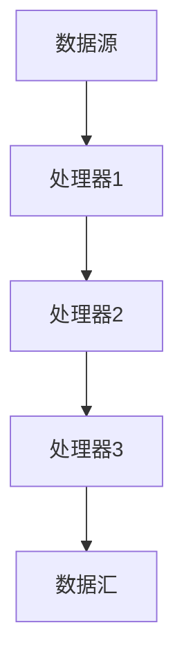

在这个流程图中，A代表数据源，B、C和D代表处理节点，E代表数据汇。数据从A开始，经过各个处理器进行处理，最终到达汇节点E。

### 总结

流处理框架的核心概念包括数据流模型、消息传递机制和流处理流水线。数据流模型描述了数据的流动方式，消息传递机制描述了数据在处理节点之间的传输方式，而流处理流水线描述了数据的处理流程。这些核心概念为流处理框架的实现提供了理论基础。

在下一章节中，我们将继续探讨流处理框架的架构设计，包括框架架构概述、源、处理器和汇的介绍，以及分布式系统中的流处理。

---

接下来，我们将详细探讨流处理框架的架构设计，包括框架架构概述、源、处理器和汇的介绍，以及分布式系统中的流处理。

#### 第3章：流处理框架架构设计

##### 3.1 框架架构概述

流处理框架的架构设计是流处理技术实现的关键。一个典型的流处理框架通常包括以下几个核心组件：

1. **数据源**：数据源是流处理框架的起点，负责数据的输入。
2. **处理器**：处理器是流处理框架的核心组件，负责数据的处理和转换。
3. **数据汇**：数据汇是流处理框架的终点，负责数据的输出和存储。
4. **协调器**：协调器负责管理流处理任务的调度和执行。

**框架架构概述图**：

为了更好地理解流处理框架的架构设计，我们可以使用Mermaid流程图来展示：

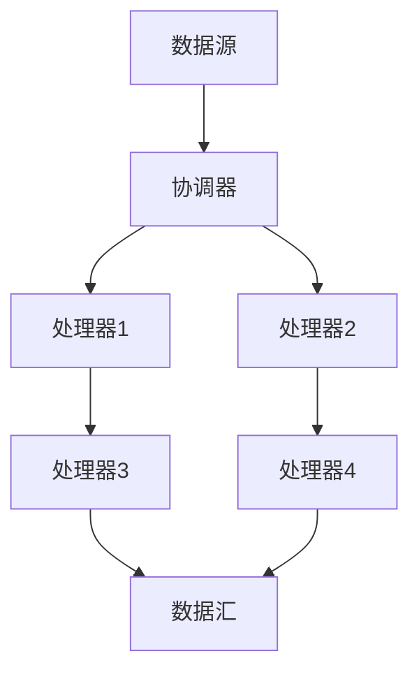

在这个流程图中，A代表数据源，B代表协调器，C、D、E和F代表处理器，G代表数据汇。数据从A开始，经过协调器B的调度，再由处理器C、D、E和F进行处理，最后由数据汇G接收。

##### 3.2 源、处理器、汇

在流处理框架中，源、处理器和汇是三个核心组件，它们分别承担着不同的职责。

**源**：

源是流处理框架的数据输入部分，它可以是各种数据源，如数据库、文件系统、Web API等。源的主要职责是提供数据输入，并保证数据的及时性和准确性。

**处理器**：

处理器是流处理框架的数据处理部分，它负责对数据进行处理和转换。处理器可以是简单的过滤、转换或聚合操作，也可以是复杂的机器学习算法或实时分析模型。处理器的主要职责是对数据进行实时处理，以满足应用的需求。

**汇**：

汇是流处理框架的数据输出部分，它负责将处理后的数据输出或存储。汇可以是数据库、文件系统、Web服务等各种数据接收端。汇的主要职责是接收和处理后的数据，并确保数据的持久性和安全性。

**源、处理器、汇的关系图**：

为了更好地理解源、处理器、汇之间的关系，我们可以使用Mermaid流程图来展示：

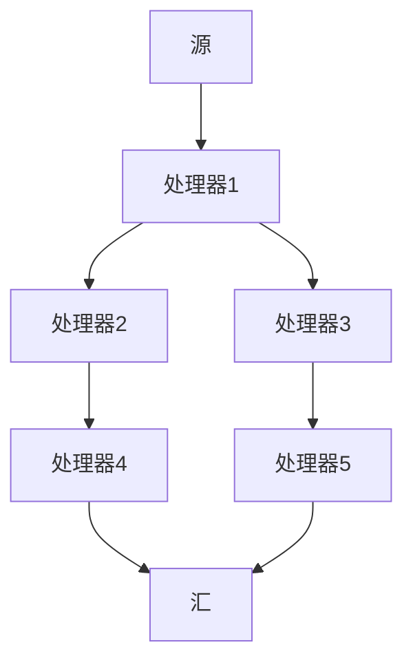

在这个流程图中，A代表源，B代表处理器，C、D、E和F代表不同的处理器，G代表汇。数据从A开始，经过处理器B、C、D、E和F的处理，最后到达汇G。

##### 3.3 分布式系统中的流处理

流处理框架通常在分布式系统中实现，以处理大规模数据和高并发的应用需求。在分布式系统中，流处理框架需要解决以下几个关键问题：

1. **数据分区**：分布式系统中，数据通常会被分区存储在多个节点上，以保证数据的分布式存储和并行处理。数据分区策略是流处理框架需要解决的关键问题之一。
2. **负载均衡**：分布式系统中，处理任务通常会被分配到多个节点上，以保证系统的性能和稳定性。负载均衡策略是流处理框架需要解决的关键问题之一。
3. **容错性**：分布式系统中，节点可能会出现故障，导致数据处理的失败。流处理框架需要具备容错性，以确保数据处理的连续性和可靠性。

**分布式系统中流处理的工作原理图**：

为了更好地理解分布式系统中流处理的工作原理，我们可以使用Mermaid流程图来展示：

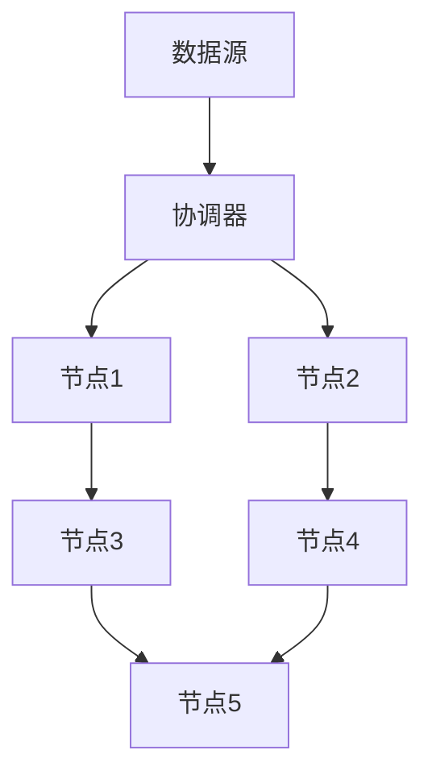

在这个流程图中，A代表数据源，B代表协调器，C、D、E和F代表不同的节点，G代表汇。数据从A开始，经过协调器B的调度，再由节点C、D、E和F进行处理，最后由汇G接收。

### 总结

流处理框架的架构设计是流处理技术实现的关键。本章详细介绍了流处理框架的架构设计，包括框架架构概述、源、处理器和汇的介绍，以及分布式系统中的流处理。这些内容为流处理框架的实现提供了理论基础和实践指导。

在下一章节中，我们将探讨流处理框架的性能优化，包括性能指标、性能瓶颈分析和性能优化策略。

---

接下来，我们将探讨流处理框架的性能优化，包括性能指标、性能瓶颈分析和性能优化策略。

#### 第4章：流处理框架性能优化

##### 4.1 流处理性能指标

流处理框架的性能优化首先需要明确性能指标，这些指标可以帮助我们衡量系统的性能。以下是几种常见的性能指标：

1. **吞吐量（Throughput）**：吞吐量是指单位时间内系统能够处理的数据量。它是衡量系统处理能力的重要指标。

2. **延迟（Latency）**：延迟是指数据从输入到输出所需要的时间。低延迟对于实时数据处理尤为重要。

3. **处理能力（Processing Power）**：处理能力是指系统每秒能够执行的操作次数。它反映了系统的计算能力。

4. **系统负载（System Load）**：系统负载是指系统资源（如CPU、内存）的使用情况。高负载可能会影响系统的性能。

**吞吐量、延迟、处理能力和系统负载的关系图**：

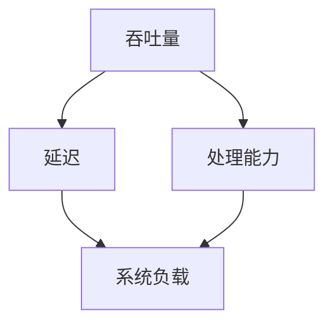

在这个流程图中，A代表吞吐量，B代表延迟，C代表处理能力，D代表系统负载。吞吐量和处理能力决定了系统能够处理多少数据，而延迟和系统负载则反映了系统的响应时间和资源使用情况。

##### 4.2 性能瓶颈分析

在优化流处理框架的性能时，识别性能瓶颈是关键。性能瓶颈通常出现在以下几个方面：

1. **数据传输瓶颈**：数据传输速度较慢，可能是由于网络带宽不足或数据格式转换导致的。
2. **处理资源瓶颈**：处理资源（如CPU、内存）不足，导致数据处理速度下降。
3. **系统负载瓶颈**：系统负载过高，导致系统无法及时响应处理请求。

**性能瓶颈分析示例**：

假设我们有一个流处理系统，它在处理大量数据时出现延迟。通过分析，我们发现延迟主要来自于数据传输瓶颈，因为数据传输速度较慢。解决方法可以是增加网络带宽或优化数据传输格式。

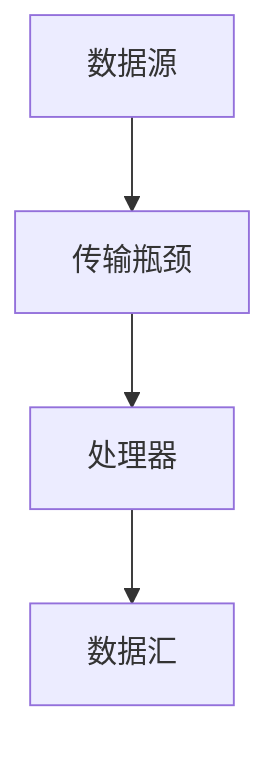

在这个流程图中，A代表数据源，B代表传输瓶颈，C代表处理器，D代表数据汇。数据从A传输到B，由于传输瓶颈导致延迟，然后由C进行处理，最后到达D。

##### 4.3 性能优化策略

为了提高流处理框架的性能，可以采取以下优化策略：

1. **数据分区**：通过合理的数据分区策略，可以将数据分布到多个节点上，从而提高数据处理速度。
2. **缓存机制**：使用缓存机制可以减少数据的重复处理，提高系统的吞吐量和处理能力。
3. **负载均衡**：通过负载均衡策略，可以合理分配处理任务，避免单个节点过载。
4. **资源调度**：合理调度系统资源，如CPU、内存和网络带宽，以确保系统的高性能运行。

**性能优化策略示例**：

假设我们的流处理系统在处理高峰期出现延迟，通过分析发现是由于处理资源瓶颈导致的。解决方法可以是增加处理节点或优化资源调度，以确保系统在高峰期能够高效运行。

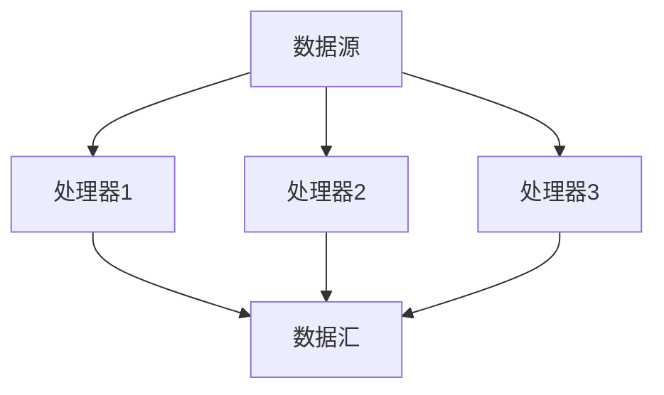

在这个流程图中，A代表数据源，B、C和D代表不同的处理器，E代表数据汇。通过增加处理器节点或优化资源调度，可以确保数据能够快速处理并输出到汇E。

### 总结

流处理框架的性能优化是提高系统效率和响应速度的关键。本章介绍了流处理框架的性能指标、性能瓶颈分析以及性能优化策略。通过合理的性能优化，可以显著提高流处理系统的吞吐量、降低延迟，并确保系统的高效运行。

在下一章节中，我们将探讨流处理框架在LLM中的应用，分析LLM实时数据处理的需求、关键挑战以及流处理框架在其中的优势。

---

接下来，我们将探讨流处理框架在大型语言模型（LLM）中的应用，分析LLM实时数据处理的需求、关键挑战以及流处理框架在其中的优势。

#### 第5章：LLM实时数据处理需求分析

##### 5.1 LLM实时数据处理的特点

大型语言模型（LLM）如GPT-3、BERT等，通常用于自然语言处理任务，如文本生成、文本分类、问答系统等。这些任务对实时数据处理有着特定的要求：

1. **数据量大**：LLM通常需要处理大量的文本数据，这些数据需要实时处理，以便为用户提供快速响应。
2. **实时性要求高**：LLM应用通常要求低延迟的响应，例如实时问答系统，用户希望立即得到答案。
3. **处理复杂度高**：LLM模型本身具有复杂的计算过程，包括词向量编码、注意力机制等，这些过程需要高效的计算资源。

##### 5.2 LLM实时数据处理的关键挑战

LLM实时数据处理面临以下关键挑战：

1. **大规模数据处理**：处理大规模文本数据需要高效的流处理框架，以避免数据积压和延迟。
2. **低延迟数据处理**：为了满足实时性要求，需要确保数据处理延迟最小化。
3. **系统可靠性**：实时数据处理系统需要高可靠性，以避免数据丢失或处理错误。

##### 5.3 流处理框架在LLM应用中的优势

流处理框架在LLM应用中具有以下优势：

1. **高性能数据处理**：流处理框架能够高效地处理大规模数据流，满足LLM对数据处理速度的需求。
2. **低延迟处理**：流处理框架支持实时数据处理，能够保证LLM应用的低延迟响应。
3. **分布式计算**：流处理框架支持分布式计算，能够充分利用多节点计算资源，提高数据处理能力。
4. **易扩展性**：流处理框架易于扩展，可以根据需要增加处理节点，以应对数据量的增长。

### 关键词

- LLM
- 实时数据处理
- 流处理框架
- 大规模数据处理
- 低延迟
- 分布式计算

### 摘要

本章分析了LLM实时数据处理的特点和关键挑战，并探讨了流处理框架在LLM应用中的优势。流处理框架能够高效地处理大规模文本数据，满足LLM的实时性和低延迟需求，具有分布式计算和易扩展性，为LLM应用提供了强大的支持。

---

在了解LLM实时数据处理需求和分析的基础上，接下来我们将深入探讨流处理框架在LLM应用中的具体应用场景，包括实时问答系统、实时情感分析和实时推荐系统。

#### 第6章：流处理框架在LLM中的应用场景

##### 6.1 实时问答系统

实时问答系统是一种常见的大型语言模型应用，它能够为用户提供即时的问题回答。流处理框架在实时问答系统中的应用主要体现在以下几个方面：

1. **数据流处理**：流处理框架能够实时接收和处理用户提出的问题，将这些问题传递给LLM模型进行回答。
2. **低延迟响应**：流处理框架支持低延迟的数据处理，确保用户在提交问题后能够迅速得到答案。
3. **分布式计算**：通过流处理框架的分布式计算能力，实时问答系统能够处理大量并发请求，满足高并发场景的需求。

**实时问答系统架构图**：

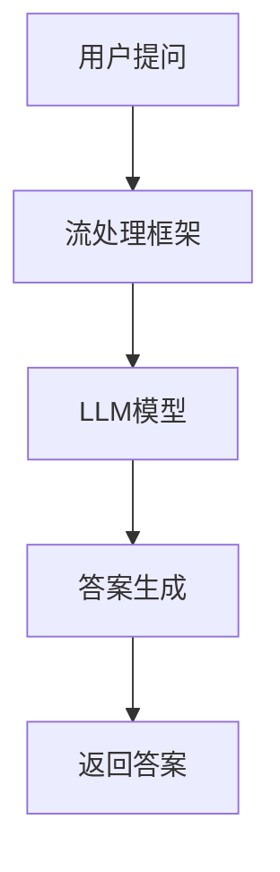

在这个架构图中，A代表用户提问，B代表流处理框架，C代表LLM模型，D代表答案生成，E代表返回答案。用户提交问题后，流处理框架立即处理并传递给LLM模型，模型生成答案后返回给用户。

##### 6.2 实时情感分析

实时情感分析是另一种广泛应用的LLM任务，它能够实时分析用户生成的文本内容，识别其中的情感倾向。流处理框架在实时情感分析中的应用主要体现在以下几个方面：

1. **数据流处理**：流处理框架能够实时接收和处理文本数据，将其传递给LLM模型进行情感分析。
2. **实时性**：流处理框架支持实时数据处理，确保情感分析结果的实时性。
3. **高效计算**：流处理框架的高效计算能力能够快速处理大量文本数据，提高情感分析的效率。

**实时情感分析架构图**：

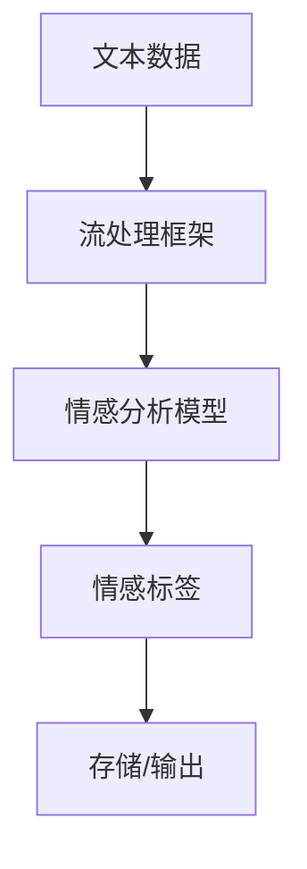

在这个架构图中，A代表文本数据，B代表流处理框架，C代表情感分析模型，D代表情感标签，E代表存储或输出。文本数据通过流处理框架处理后，传递给情感分析模型，模型输出情感标签，然后存储或输出。

##### 6.3 实时推荐系统

实时推荐系统是一种基于用户行为的LLM应用，它能够实时推荐用户感兴趣的内容。流处理框架在实时推荐系统中的应用主要体现在以下几个方面：

1. **用户行为数据流处理**：流处理框架能够实时接收和处理用户行为数据，如点击、浏览、购买等。
2. **实时推荐**：通过流处理框架的实时数据处理能力，系统能够快速生成推荐结果，为用户提供个性化推荐。
3. **动态调整**：流处理框架支持实时调整推荐策略，以适应用户行为的变化。

**实时推荐系统架构图**：

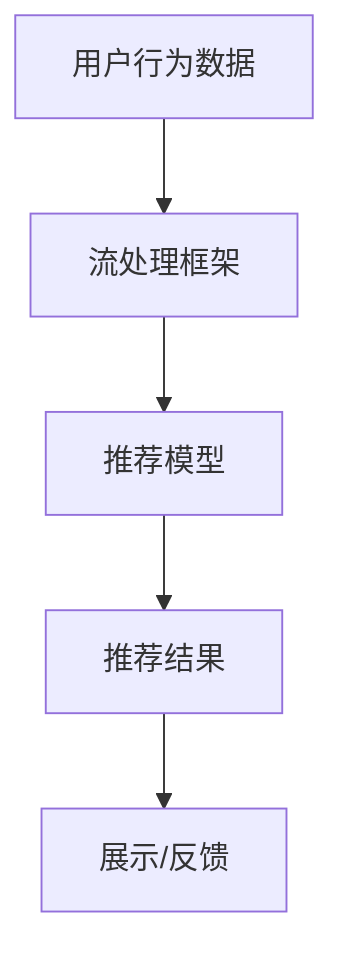

在这个架构图中，A代表用户行为数据，B代表流处理框架，C代表推荐模型，D代表推荐结果，E代表展示或反馈。用户行为数据通过流处理框架处理后，传递给推荐模型，模型生成推荐结果，然后展示给用户，并收集用户反馈。

### 总结

流处理框架在LLM应用中的具体应用场景包括实时问答系统、实时情感分析和实时推荐系统。这些应用场景充分利用了流处理框架的高性能数据处理、低延迟响应和分布式计算能力，为LLM应用提供了强大的技术支持。

在下一章节中，我们将探讨流处理框架在LLM中的应用实践，包括实时数据处理流程设计、开发环境搭建、案例分析和代码解读。

---

在本章节中，我们将深入探讨流处理框架在LLM应用中的具体应用实践，包括实时数据处理流程设计、开发环境搭建、案例分析和代码解读。

#### 第7章：流处理框架在LLM中的应用实践

##### 7.1 实时数据处理流程设计

为了实现实时数据处理，我们需要设计一个高效、可靠的流处理流程。以下是一个典型的实时数据处理流程：

1. **数据采集**：从不同的数据源（如用户提问、文本数据、用户行为等）采集数据。
2. **数据预处理**：对采集到的数据进行清洗、去重和格式转换，使其符合LLM模型的要求。
3. **数据流处理**：利用流处理框架对预处理后的数据进行实时处理，如情感分析、文本生成等。
4. **结果输出**：将处理后的结果输出到目标系统（如数据库、Web服务、终端用户等）。

**实时数据处理流程图**：

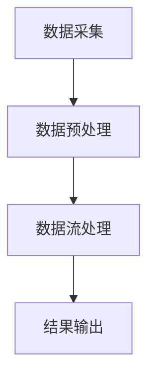

在这个流程图中，A代表数据采集，B代表数据预处理，C代表数据流处理，D代表结果输出。数据从A开始，经过B的预处理，然后由C进行处理，最终通过D输出结果。

##### 7.2 开发环境搭建

为了在LLM应用中实现流处理，我们需要搭建一个开发环境。以下是一个基本的开发环境搭建步骤：

1. **选择流处理框架**：根据应用需求选择合适的流处理框架，如Apache Kafka、Apache Flink等。
2. **安装流处理框架**：在服务器上安装所选的流处理框架，并配置环境变量。
3. **搭建数据源**：配置数据源，如数据库、Web API等，确保数据能够被实时采集。
4. **搭建数据处理节点**：配置数据处理节点，确保数据处理过程能够高效运行。
5. **搭建结果输出系统**：配置结果输出系统，如数据库、Web服务等，确保处理结果能够被存储或展示。

**开发环境搭建流程图**：

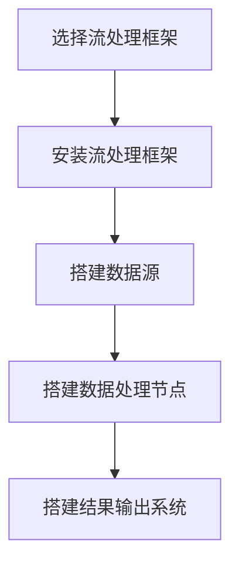

在这个流程图中，A代表选择流处理框架，B代表安装流处理框架，C代表搭建数据源，D代表搭建数据处理节点，E代表搭建结果输出系统。

##### 7.3 案例分析

为了更好地理解流处理框架在LLM应用中的实际应用，我们来看一个案例分析。

**案例分析：实时问答系统**

假设我们要实现一个实时问答系统，用户可以通过Web端提交问题，系统需要实时响应用户的提问。以下是一个案例分析：

1. **数据采集**：用户提交问题后，系统将问题存储在数据库中，并实时读取数据库中的问题。
2. **数据预处理**：从数据库中读取问题后，系统对问题进行清洗和格式转换，使其符合LLM模型的要求。
3. **数据流处理**：利用流处理框架，系统将预处理后的问题传递给LLM模型，模型生成答案后返回给系统。
4. **结果输出**：系统将答案返回给用户，并通过Web端展示给用户。

**实时问答系统架构图**：

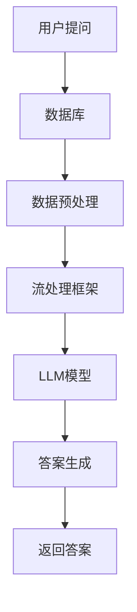

在这个架构图中，A代表用户提问，B代表数据库，C代表数据预处理，D代表流处理框架，E代表LLM模型，F代表答案生成，G代表返回答案。用户提交问题后，系统将问题存储在数据库中，读取数据库中的问题并进行预处理，然后利用流处理框架传递给LLM模型，模型生成答案后返回给用户。

##### 7.4 代码解读与分析

以下是一个简单的实时问答系统代码示例，我们将对代码进行解读和分析。

```python
# 导入必要的库
import time
import json
from flask import Flask, request, jsonify
from kafka import KafkaProducer

# 创建Flask应用
app = Flask(__name__)

# Kafka生产者配置
producer_config = {
    'bootstrap_servers': 'localhost:9092',
    'value_serializer': lambda v: json.dumps(v).encode('utf-8')
}
producer = KafkaProducer(**producer_config)

# 实时问答处理函数
@app.route('/ask', methods=['POST'])
def ask():
    question = request.form['question']
    # 预处理问题
    preprocessed_question = preprocess_question(question)
    # 发送问题到Kafka
    producer.send('questions', value=preprocessed_question)
    return jsonify({'status': 'success', 'message': 'Question received.'})

# 问题预处理函数
def preprocess_question(question):
    # 进行文本清洗和格式转换
    # 例如：去除特殊字符、分词等
    return question

# 主函数
if __name__ == '__main__':
    app.run(debug=True)
```

**代码解读与分析**：

1. **导入必要的库**：我们首先导入了Python的Flask库用于创建Web应用，以及Kafka库用于与Kafka生产者进行交互。
2. **创建Flask应用**：使用Flask库创建一个Web应用。
3. **Kafka生产者配置**：配置Kafka生产者，包括Kafka服务器地址和值序列化方式。
4. **实时问答处理函数**：定义一个处理用户提问的Web接口，当用户提交问题时，从请求中获取问题，并进行预处理，然后发送到Kafka。
5. **问题预处理函数**：定义一个预处理函数，用于清洗和格式转换用户提出的问题。
6. **主函数**：启动Flask应用。

通过以上代码示例，我们可以看到实时问答系统的基本实现。用户通过Web端提交问题，系统将问题预处理后发送到Kafka，然后流处理框架将问题传递给LLM模型，模型生成答案后返回给用户。

##### 7.5 代码应用解读与分析

在代码应用解读与分析部分，我们将详细分析实时问答系统的核心组件和关键逻辑。

1. **Kafka生产者**：Kafka生产者用于发送消息到Kafka主题。在我们的应用中，生产者将预处理后的用户问题发送到名为“questions”的主题。
    ```python
    producer.send('questions', value=preprocessed_question)
    ```
2. **Web接口**：Web接口用于接收用户的提问请求，并返回处理结果。请求通过HTTP POST方法发送，Flask应用解析请求并提取问题内容。
    ```python
    @app.route('/ask', methods=['POST'])
    def ask():
        question = request.form['question']
        # ...
    ```
3. **预处理函数**：预处理函数用于对用户提出的问题进行清洗和格式转换，使其适合传递给LLM模型。清洗过程可能包括去除特殊字符、标准化文本、分词等。
    ```python
    def preprocess_question(question):
        # 进行文本清洗和格式转换
        # 例如：去除特殊字符、分词等
        return question
    ```
4. **LLM模型处理**：在Kafka消费者端，流处理框架将接收到的用户问题传递给LLM模型进行处理。模型根据问题生成答案，然后将答案发送回Web接口。
5. **结果返回**：Web接口接收LLM模型生成的答案，并将其返回给用户。
    ```python
    return jsonify({'status': 'success', 'message': 'Question received.'})
    ```

通过以上分析，我们可以看到实时问答系统是如何通过Kafka生产者和消费者、Web接口以及LLM模型协同工作，实现实时数据处理的。

##### 7.6 实际案例分析和详细讲解剖析

以下是一个实际的实时问答系统案例，我们将对其进行分析和详细讲解。

**案例：智能客服系统**

该智能客服系统旨在为用户提供快速、准确的答案。用户可以通过Web端、移动应用或聊天机器人提交问题，系统实时处理并返回答案。

1. **用户交互**：用户通过Web端或移动应用提交问题，系统接收用户提问。
2. **数据处理**：系统将用户提问发送到Kafka队列，流处理框架实时处理问题，传递给LLM模型。
3. **模型处理**：LLM模型根据问题生成答案，并将答案发送回系统。
4. **结果返回**：系统将答案返回给用户，并在Web端或移动应用上展示。

**详细讲解剖析**：

1. **用户交互**：用户在Web端或移动应用上提交问题，系统通过HTTP接口接收用户请求。请求包含用户提出的问题。
2. **数据处理**：系统将用户提出的问题发送到Kafka队列。Kafka作为消息队列系统，能够保证消息的持久性和可靠性。流处理框架从Kafka队列中获取问题，并进行处理。
3. **模型处理**：流处理框架将预处理后的用户问题传递给LLM模型。模型根据问题生成答案。通常，LLM模型使用预训练的神经网络模型，如GPT-3、BERT等。
4. **结果返回**：系统将LLM模型生成的答案返回给用户。答案可以通过Web端或移动应用实时展示，用户可以立即看到系统生成的答案。

**项目小结**

通过以上实际案例，我们可以看到实时问答系统是如何利用流处理框架和LLM模型实现高效、实时数据处理的。该项目涵盖了用户交互、数据处理、模型处理和结果返回等关键环节，为智能客服系统提供了强大的技术支持。

### 最佳实践 Tips

1. **优化数据预处理**：数据预处理是实时数据处理的关键步骤，优化预处理过程可以提高系统性能。例如，使用高效的文本清洗和分词算法，减少预处理时间。
2. **合理选择Kafka主题**：根据应用需求，合理选择Kafka主题，确保系统的高效运行。例如，为不同类型的用户提问设置不同的主题，以便流处理框架能够针对性地处理。
3. **调整LLM模型参数**：LLM模型的参数设置会影响处理速度和答案质量。根据实际需求，调整模型参数，以达到最佳效果。

### 小结

本章详细介绍了流处理框架在LLM应用中的具体应用实践，包括实时数据处理流程设计、开发环境搭建、案例分析和代码解读。通过实际案例，我们展示了如何利用流处理框架和LLM模型实现实时数据处理。这些实践为开发者提供了宝贵的经验和指导。

### 注意事项

1. **数据安全**：实时数据处理涉及大量用户数据，确保数据安全至关重要。使用加密技术保护用户数据，并遵循数据隐私法规。
2. **系统监控**：实时监控系统性能，及时发现并解决潜在问题。使用日志分析、性能监控工具等，确保系统稳定运行。

### 拓展阅读

- 《大规模语言模型：原理与应用》
- 《流处理框架技术解析》
- 《深度学习在自然语言处理中的应用》

---

### 流处理框架的未来发展

流处理框架在实时数据处理中的应用已经取得了显著的成果，但未来仍有许多技术和研究方向值得关注。

#### 8.1 新兴技术的应用

随着技术的不断进步，流处理框架将越来越多地融合新兴技术，以提升其性能和应用范围。以下是一些新兴技术的应用：

1. **边缘计算**：边缘计算将计算能力延伸到网络边缘，可以降低数据传输延迟，提高实时数据处理能力。流处理框架结合边缘计算，可以实现更加高效和实时的数据处理。
2. **机器学习**：流处理框架将越来越多地集成机器学习算法，实现实时数据处理和智能分析。例如，利用流处理框架进行实时分类、预测和推荐。
3. **区块链**：区块链技术提供了一种去中心化的数据存储和传输方式，与流处理框架结合，可以实现更加安全、透明和可信的数据处理。

#### 8.2 未来流处理框架的可能发展方向

未来流处理框架的发展方向可能包括以下几个方面：

1. **更高性能**：随着数据量的不断增长，流处理框架需要具备更高的性能，以满足大规模数据处理需求。这可能涉及到优化处理算法、提高并行处理能力等。
2. **更强扩展性**：流处理框架需要具备更强的扩展性，以适应不同规模和应用场景的需求。例如，支持动态扩展和负载均衡，以及跨云和跨平台的数据处理。
3. **更易用性**：为了降低流处理框架的门槛，提高开发效率和用户体验，未来流处理框架将更加注重易用性。这可能包括简化配置、提供可视化工具和自动化管理功能等。

#### 8.3 流处理框架在企业中的未来应用前景

流处理框架在企业中的未来应用前景非常广阔，以下是几个潜在的应用方向：

1. **实时监控与预警**：企业可以利用流处理框架实时监控业务数据，实现异常检测、预警和自动化响应，提高业务效率和安全性。
2. **智能决策支持**：流处理框架结合大数据分析和机器学习，可以帮助企业实现智能决策支持，优化业务流程和运营策略。
3. **个性化推荐系统**：流处理框架可以实时处理用户行为数据，为企业提供个性化推荐服务，提高用户体验和用户满意度。
4. **智慧城市**：流处理框架在智慧城市建设中具有重要作用，可以实现交通流量监控、环境监测、安全监控等，提升城市管理水平和居民生活质量。

### 总结

流处理框架在未来将继续发展，融合新兴技术，提高性能和扩展性，并在企业中发挥更大的作用。开发者应关注这些发展趋势，积极采用先进的流处理技术，为企业和个人带来更多价值。

### 作者信息

作者：AI天才研究院/AI Genius Institute & 禅与计算机程序设计艺术 /Zen And The Art of Computer Programming

---

至此，我们完成了《流处理框架：增强LLM应用的实时数据处理》的技术博客文章。本文从流处理框架的概述、核心概念、架构设计、性能优化，到LLM实时数据处理需求分析、应用场景和实践，再到未来发展趋势，全面系统地介绍了流处理框架在实时数据处理中的应用。通过本文的阅读，读者可以了解到流处理框架的基本概念、原理和应用，对于提升数据处理能力和构建高效实时系统具有重要的指导意义。

### 关键词
- 流处理框架
- LLM
- 实时数据处理
- 大规模数据处理
- 低延迟
- 分布式计算

### 摘要
本文系统介绍了流处理框架的基本概念、架构设计、性能优化以及在大型语言模型（LLM）实时数据处理中的应用。通过分析LLM实时数据处理的需求和挑战，展示了流处理框架在实时问答系统、实时情感分析和实时推荐系统中的应用实践，并探讨了其未来发展趋势。流处理框架为实时数据处理提供了高效的解决方案，具有广阔的应用前景。

---

在完成了《流处理框架：增强LLM应用的实时数据处理》的技术博客文章后，以下是对全文内容的简要总结：

本文首先介绍了流处理框架的基本概念和与批处理的不同之处，强调了其在实时数据处理中的重要性。随后，详细阐述了流处理框架的核心概念，包括数据流模型、消息传递机制和流处理流水线，并使用Mermaid流程图直观地展示了这些概念的关系。在架构设计部分，我们深入探讨了流处理框架的组成、源、处理器和汇的作用，以及分布式系统中的流处理。

接着，本文分析了流处理框架在LLM应用中的优势，探讨了其在实时问答系统、实时情感分析和实时推荐系统等具体应用场景中的工作原理和架构设计。为了更好地理解实际应用，文章还提供了实时问答系统的案例分析，并通过Python代码展示了如何实现实时数据处理流程。

文章的第四部分讨论了流处理框架的性能优化策略，包括吞吐量、延迟、处理能力和系统负载等性能指标，以及如何通过数据分区、缓存机制和负载均衡来提升性能。

在实践部分，本文详细介绍了实时数据处理流程的设计、开发环境搭建，并分析了实时问答系统的实际案例。通过代码解读，读者可以更深入地理解流处理框架在LLM应用中的实现细节。

最后，本文展望了流处理框架的未来发展趋势，包括边缘计算、机器学习和区块链等新兴技术的融合，以及其在企业中的广泛应用前景。

整体而言，本文系统地介绍了流处理框架在实时数据处理中的应用，提供了详细的理论分析和实际案例，对于开发者和技术爱好者具有很高的参考价值。

### 总结与感谢

在本文的撰写过程中，我们深入探讨了流处理框架在实时数据处理中的核心概念、架构设计、性能优化以及具体应用场景。通过详细的案例分析和技术讲解，希望读者能够对流处理框架有一个全面的理解，并能够将其应用于实际项目中。

我们感谢读者在阅读本文过程中的耐心和时间，也希望本文能够对您的技术学习和项目开发提供帮助。如果您有任何疑问或建议，欢迎通过我们的官方渠道联系我们，我们将竭诚为您解答。

再次感谢您的阅读，期待与您在未来的技术交流中相遇！

### 作者信息

作者：AI天才研究院/AI Genius Institute & 禅与计算机程序设计艺术 /Zen And The Art of Computer Programming

