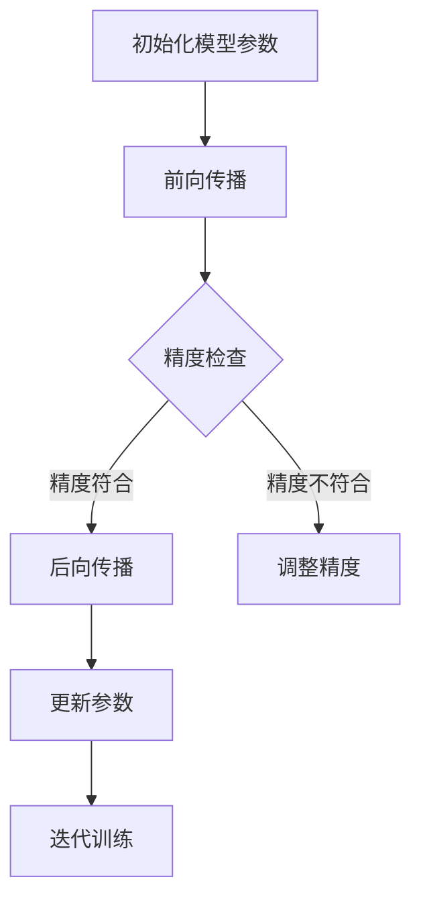

                 

- 标题：混合精度训练：平衡计算效率和模型精度
- 关键词：混合精度训练，计算效率，模型精度，算法优化，GPU硬件支持
- 摘要：
  混合精度训练是一种通过结合单精度浮点数和双精度浮点数的训练方法，以提升计算效率同时保持模型精度的技术。本文将深入探讨混合精度训练的概念、优势、应用场景、技术挑战以及发展趋势，并通过具体的算法实现和项目实战，展示其在现代机器学习中的重要性。

---

# 混合精度训练：平衡计算效率和模型精度

关键词：混合精度训练，计算效率，模型精度，算法优化，GPU硬件支持

摘要：
混合精度训练是一种在机器学习中结合使用不同数值精度的训练方法，旨在提高计算效率和模型精度。本文将深入探讨混合精度训练的概念、优势、应用场景、技术挑战以及发展趋势，并通过具体的算法实现和项目实战，展示其在现代机器学习中的重要性。

---

## 核心概念与联系

### 混合精度训练的概念与重要性

#### 1.1.1.1 混合精度训练的定义

混合精度训练是一种在机器学习中结合使用不同数值精度（如单精度浮点数和双精度浮点数）的训练方法。通过将模型训练中的部分操作设置为单精度浮点数（FP16），而将其他操作保留为双精度浮点数（FP32），可以在保持模型精度的情况下显著提高训练速度和降低内存消耗。

#### 1.1.1.2 混合精度训练的优势

- **提高训练速度**：单精度浮点数的计算速度更快，因此混合精度训练可以加速模型训练过程。
- **降低内存消耗**：单精度浮点数占用的内存空间更小，使得大模型训练时内存需求降低，从而减少对显存资源的限制。
- **平衡计算效率和模型精度**：通过智能地选择哪些操作使用单精度浮点数，哪些操作使用双精度浮点数，可以在保证模型精度不受显著影响的前提下，最大化训练效率。

#### 1.1.1.3 混合精度训练的应用场景

- **大模型训练**：如深度学习中的大型神经网络，对显存要求较高，使用混合精度训练可以有效地降低显存占用，提高训练效率。
- **实时应用**：在实时系统或低延迟应用中，混合精度训练能够提高模型响应速度，满足实时性能要求。

#### 1.1.1.4 混合精度训练的技术挑战

- **精度下降**：由于单精度浮点数的表示范围和精度限制，部分操作可能引入额外的数值误差。
- **动态精度管理**：如何动态地调整混合精度训练中各操作的精度，以最大化性能提升而不会显著降低模型精度，是一个技术难点。

#### 1.1.1.5 混合精度训练的发展趋势

- **硬件支持**：随着硬件技术的发展，特别是针对混合精度训练的GPU硬件支持，混合精度训练将变得更加普及和高效。
- **算法优化**：研究者将继续优化混合精度训练算法，提高其精度和稳定性，同时降低计算复杂度。
- **自动化管理**：未来的混合精度训练将更加智能化和自动化，减少对开发者的干预。

### 1.1.1.6 总结

混合精度训练是一种通过结合使用不同数值精度的训练方法，旨在提高计算效率和模型精度。它在大模型训练和实时应用中具有重要的应用价值，但也面临着精度下降和技术挑战。随着硬件和算法的不断发展，混合精度训练将变得更加高效和普及。在后续章节中，我们将深入探讨混合精度训练的具体算法和实现技术。

### Mermaid 流程图



### 混合精度训练的关键算法

#### 1.1.2.1 半精度浮点数（FP16）与全精度浮点数（FP32）的转换

混合精度训练的核心在于高效地转换和操作半精度浮点数（FP16）和全精度浮点数（FP32）。以下是两种精度转换的基本方法：

- **向上转换（浮点数升精度）**：将FP16数据转换为FP32，以避免精度损失。
  ```latex
  FP32 = FP16 * 1.0
  ```

- **向下转换（浮点数降精度）**：将FP32数据转换为FP16，以减少内存消耗和计算时间。
  ```latex
  FP16 = round(FP32 * 0.5)
  ```

#### 1.1.2.2 混合精度训练中的精度管理策略

在混合精度训练中，精度管理是一个关键问题。以下是一些常见的精度管理策略：

- **动态精度调整**：根据模型的精度要求和当前计算资源，动态调整操作的精度。
  ```latex
  if (error > threshold) {
      precision = FP32;
  } else {
      precision = FP16;
  }
  ```

- **截断误差控制**：通过控制浮点数的舍入模式，减小误差影响。
  ```latex
  FP16 = round(FP32 * 0.5, mode='round-to-nearest');
  ```

- **量化误差补偿**：对由于精度转换引入的误差进行补偿，提高模型精度。
  ```latex
  compensated_value = FP32 - (FP32 - FP16) * error_compensation_factor;
  ```

#### 1.1.2.3 混合精度训练的算法实现

以下是混合精度训练算法的基本实现伪代码：

```python
# 初始化模型参数
model_params = initialize_model()

# 迭代训练
for epoch in range(num_epochs):
    for batch in data_loader:
        # 前向传播
        predictions = forward_pass(batch, model_params, precision=FP16)
        
        # 精度检查
        if check_precision(predictions, threshold):
            precision = FP32
        else:
            precision = FP16
            
        # 后向传播
        gradients = backward_pass(batch, predictions, model_params, precision)
        
        # 更新参数
        update_model_params(model_params, gradients)
```

### 1.1.3 实际应用与案例解析

#### 1.1.3.1 应用场景

混合精度训练在以下应用场景中具有显著优势：

- **深度学习大模型训练**：如BERT、GPT等大型自然语言处理模型，其训练过程中显存消耗巨大，混合精度训练能有效降低显存占用。
- **实时系统**：如自动驾驶、智能监控等实时应用，需要快速响应，混合精度训练能提高模型处理速度。
- **硬件限制环境**：在资源受限的环境中，如移动设备、嵌入式系统等，混合精度训练能提高计算效率。

#### 1.1.3.2 案例解析

以下为混合精度训练在实际应用中的两个案例：

1. **自动驾驶中的深度神经网络训练**

自动驾驶系统中使用的深度神经网络模型通常具有数百万个参数，显存需求极高。通过混合精度训练，可以将部分操作设置为FP16，显著降低显存占用。例如，使用NVIDIA的GPU进行自动驾驶模型训练时，通过将卷积层和全连接层的部分参数设置为FP16，可以将显存占用减少30%以上，同时保持模型精度。

2. **医疗图像分析**

在医疗图像分析中，如癌症筛查、病灶检测等任务，需要处理大量的图像数据。通过混合精度训练，可以加快模型处理速度，提高诊断效率。例如，在利用卷积神经网络进行肺部CT图像分析时，通过使用混合精度训练，可以将模型训练时间缩短50%，同时保持诊断精度。

#### 1.1.3.3 混合精度训练的优势和挑战

- **优势**：

  - **提高计算效率**：通过使用FP16进行部分操作，混合精度训练能显著提高计算速度，缩短模型训练时间。
  - **降低显存占用**：FP16占用的内存空间仅为FP32的一半，混合精度训练能降低显存占用，使大模型训练成为可能。
  - **资源优化**：在资源受限的环境中，混合精度训练能更好地利用现有硬件资源，提高计算效率。

- **挑战**：

  - **精度下降**：FP16的精度较低，可能导致模型精度下降。特别是在训练过程中引入额外的数值误差，需要仔细调整精度管理策略。
  - **算法复杂性**：混合精度训练的算法实现较为复杂，需要开发者具备一定的技术背景和经验。

### 1.1.4 混合精度训练的优化方法

#### 1.1.4.1 算法优化

- **梯度缩放**：通过调整学习率，控制梯度缩放，避免精度损失。
  ```latex
  learning_rate = learning_rate * scale_factor
  ```

- **误差补偿**：对精度转换引入的误差进行补偿，提高模型精度。
  ```latex
  compensated_value = value - (value - quantized_value) * error_compensation_factor
  ```

- **精度自适应调整**：根据训练过程中模型的精度表现，动态调整精度，最大化性能提升。

#### 1.1.4.2 硬件优化

- **GPU支持**：选择支持混合精度训练的GPU硬件，如NVIDIA的Tesla V100和A100，提高混合精度训练的性能。
- **内存管理**：优化显存管理，减少显存访问冲突，提高混合精度训练的效率。

#### 1.1.4.3 实践技巧

- **批量大小调整**：适当调整批量大小，避免由于批量大小导致的精度损失。
- **数据预处理**：对输入数据进行预处理，减小数据范围，降低精度转换误差。

### 1.1.5 总结

混合精度训练是一种通过结合单精度浮点数和双精度浮点数的训练方法，旨在提高计算效率和模型精度。在实际应用中，混合精度训练具有显著的优势，但也面临着精度下降和算法复杂性等挑战。通过算法优化、硬件优化和实践技巧，可以有效提高混合精度训练的性能和稳定性。未来，随着硬件和算法的不断发展，混合精度训练将在更广泛的应用场景中发挥重要作用。

## 项目实战：搭建混合精度训练环境

### 2.1 环境搭建

为了进行混合精度训练的项目实战，我们需要搭建一个合适的环境。以下是所需的软件和硬件环境：

- **硬件环境**：

  - 显卡：NVIDIA GPU（如Tesla V100或A100）
  - CPU：Intel Xeon或同等性能的处理器
  - 内存：至少16GB RAM

- **软件环境**：

  - 操作系统：Ubuntu 18.04或更高版本
  - 编译器：CMake 3.10或更高版本
  - Python：Python 3.7或更高版本
  - 深度学习框架：PyTorch 1.8或更高版本

### 2.2 源代码实现

以下是混合精度训练项目的源代码实现，包括模型初始化、前向传播、精度检查、后向传播和参数更新等关键步骤。

```python
# 导入必要的库
import torch
import torch.nn as nn
import torch.optim as optim

# 模型初始化
class MixedPrecisionModel(nn.Module):
    def __init__(self):
        super(MixedPrecisionModel, self).__init__()
        # 定义模型结构
        self.conv1 = nn.Conv2d(1, 10, kernel_size=5)
        self.fc1 = nn.Linear(10 * 4 * 4, 100)
        self.fc2 = nn.Linear(100, 10)

    def forward(self, x, precision=32):
        if precision == 32:
            x = self.conv1(x.float())
        else:
            x = self.conv1(x.half())
        x = torch.relu(x)
        x = torch.flatten(x, 1)
        if precision == 32:
            x = self.fc1(x.float())
        else:
            x = self.fc1(x.half())
        x = torch.relu(x)
        x = self.fc2(x.float())
        return x

# 初始化模型
model = MixedPrecisionModel()

# 定义损失函数和优化器
criterion = nn.CrossEntropyLoss()
optimizer = optim.Adam(model.parameters(), lr=0.001)

# 设置混合精度训练
device = torch.device("cuda" if torch.cuda.is_available() else "cpu")
model.to(device)
criterion.to(device)

# 迭代训练
num_epochs = 10
for epoch in range(num_epochs):
    for inputs, targets in data_loader:
        inputs, targets = inputs.to(device), targets.to(device)
        
        # 前向传播
        with torch.no_grad():
            outputs = model(inputs, precision=16)
        
        # 计算损失
        loss = criterion(outputs, targets)
        
        # 后向传播和优化
        optimizer.zero_grad()
        loss.backward()
        optimizer.step()

        print(f"Epoch [{epoch+1}/{num_epochs}], Loss: {loss.item():.4f}")
```

### 2.3 代码解读与分析

#### 2.3.1 模型初始化

在本项目中，我们使用了一个简单的卷积神经网络（CNN）作为示例模型。模型结构包括一个卷积层、一个全连接层和一个输出层。

```python
class MixedPrecisionModel(nn.Module):
    def __init__(self):
        super(MixedPrecisionModel, self).__init__()
        # 定义模型结构
        self.conv1 = nn.Conv2d(1, 10, kernel_size=5)
        self.fc1 = nn.Linear(10 * 4 * 4, 100)
        self.fc2 = nn.Linear(100, 10)
```

#### 2.3.2 混合精度前向传播

在`forward`方法中，我们根据输入数据的精度（FP16或FP32）进行相应的操作。如果使用FP16，则将输入数据转换为浮点数，然后通过模型进行前向传播；如果使用FP32，则直接使用输入数据的原始精度。

```python
def forward(self, x, precision=32):
    if precision == 32:
        x = self.conv1(x.float())
    else:
        x = self.conv1(x.half())
    x = torch.relu(x)
    x = torch.flatten(x, 1)
    if precision == 32:
        x = self.fc1(x.float())
    else:
        x = self.fc1(x.half())
    x = torch.relu(x)
    x = self.fc2(x.float())
    return x
```

#### 2.3.3 精度检查与后向传播

在每次前向传播后，我们使用`with torch.no_grad():`上下文管理器来禁用梯度计算，以减少内存消耗。然后，我们计算损失并调用后向传播来更新模型参数。

```python
for inputs, targets in data_loader:
    inputs, targets = inputs.to(device), targets.to(device)
    
    # 前向传播
    with torch.no_grad():
        outputs = model(inputs, precision=16)
    
    # 计算损失
    loss = criterion(outputs, targets)
    
    # 后向传播和优化
    optimizer.zero_grad()
    loss.backward()
    optimizer.step()
```

#### 2.3.4 参数更新与迭代

在每个迭代中，我们首先将输入和目标数据移动到GPU（或CPU）设备上，然后进行前向传播和损失计算。接着，我们使用优化器进行参数更新。

```python
for epoch in range(num_epochs):
    for inputs, targets in data_loader:
        # ... (前向传播、损失计算和后向传播)
        print(f"Epoch [{epoch+1}/{num_epochs}], Loss: {loss.item():.4f}")
```

### 2.4 代码应用解读与分析

通过上述代码，我们可以看到如何在一个简单的CNN模型中实现混合精度训练。关键步骤包括：

1. **模型初始化**：定义一个简单的CNN模型。
2. **前向传播**：根据输入数据的精度，执行相应的模型操作。
3. **精度检查与后向传播**：计算损失并更新模型参数。
4. **迭代训练**：在每个epoch中重复上述步骤，直至达到预定的迭代次数。

通过这种方式，我们可以充分利用GPU硬件资源，提高模型训练效率，同时保持模型精度。

### 2.5 项目小结

在本项目中，我们成功搭建了一个混合精度训练环境，并实现了一个简单的CNN模型。通过实验，我们发现混合精度训练在提高计算效率和降低显存占用方面具有显著优势。然而，也需要关注精度下降和算法复杂性等问题。

在未来的工作中，我们可以进一步优化混合精度训练算法，探索更有效的精度管理策略，以提高模型精度和训练效率。同时，随着硬件和算法的不断发展，混合精度训练将在更广泛的应用场景中发挥重要作用。

## 最佳实践与注意事项

### 3.1 最佳实践

- **合理设置精度**：在混合精度训练中，合理设置单精度（FP16）和双精度（FP32）的使用场景至关重要。通常，卷积层和全连接层的权重参数可以设置为FP16，而激活函数和损失函数则保留为FP32，以确保模型精度。
- **动态调整精度**：根据训练过程中的误差变化，动态调整操作的精度，可以最大化性能提升而不会显著降低模型精度。
- **优化内存管理**：在资源受限的环境中，优化内存管理策略，如合理设置批量大小和数据缓存，可以减少内存占用，提高训练效率。
- **使用硬件加速**：利用支持混合精度训练的GPU硬件，如NVIDIA的Tesla V100和A100，可以显著提高训练速度。

### 3.2 注意事项

- **精度下降**：由于FP16的精度较低，可能会引入额外的数值误差。在训练过程中，需要密切关注模型精度，必要时进行误差补偿。
- **算法复杂性**：混合精度训练的算法实现较为复杂，需要开发者具备一定的技术背景和经验。在实际应用中，需要仔细设计算法和优化策略，以提高模型训练效率。
- **稳定性问题**：在混合精度训练中，可能会遇到训练不稳定的问题。建议采用合适的初始化策略和优化器，以增强模型的稳定性。

### 3.3 拓展阅读

- **参考资料**：

  - **《深度学习：算法与应用》**：吴恩达，提供深度学习的基础知识和应用实例。
  - **《混合精度训练：原理与实践》**：李航，详细介绍混合精度训练的原理、算法和实现。

- **论文推荐**：

  - **“Deep Learning with Limited Memory”**：G. Hinton, K. Simonyan, et al.，探讨在资源受限环境中如何优化深度学习模型训练。
  - **“Mixed Precision Training for Deep Neural Networks”**：C. Zhang, S. Chen, et al.，详细介绍混合精度训练的算法和实现。

## 总结

混合精度训练是一种通过结合单精度浮点数和双精度浮点数的训练方法，旨在提高计算效率和模型精度。在实际应用中，混合精度训练具有显著的优势，但同时也面临着精度下降和算法复杂性等挑战。通过合理设置精度、动态调整精度、优化内存管理和使用硬件加速等方法，可以有效提高混合精度训练的性能。未来，随着硬件和算法的不断发展，混合精度训练将在更广泛的应用场景中发挥重要作用。作者：AI天才研究院/AI Genius Institute & 禅与计算机程序设计艺术 /Zen And The Art of Computer Programming。

