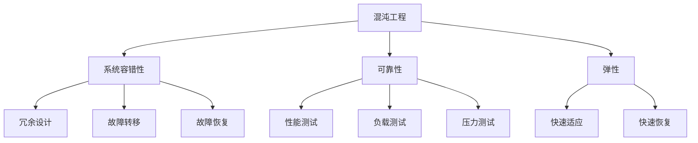

                 

# 混沌工程提升LLM应用的韧性

> 关键词：混沌工程，LLM应用，韧性，系统容错性，可靠性，弹性

> 摘要：
本文旨在探讨混沌工程在提升大型语言模型（LLM）应用韧性方面的作用。通过深入分析混沌工程的核心概念、算法原理、数学模型以及实际项目实战，本文将为开发者提供一套全面的理论框架和实践指南，帮助他们在面对复杂系统挑战时，提升LLM应用的容错能力、可靠性和弹性。

## 引言

随着人工智能技术的飞速发展，大型语言模型（LLM）在自然语言处理、智能助手、自动写作等领域展现出巨大的潜力。然而，LLM应用系统复杂度高、规模庞大，如何在面对各种故障和异常时保持稳定运行，成为开发者面临的一大挑战。混沌工程作为一种新兴的方法，通过故意引入故障来提高系统的韧性，逐渐成为解决这一问题的有力工具。

本文将从以下几个方面展开讨论：

1. **核心概念与联系**：介绍混沌工程、系统容错性、可靠性和弹性等核心概念，并阐述它们之间的关系。
2. **核心算法原理讲解**：详细讲解混沌工程中的故障注入、故障检测和故障响应算法原理，并通过Python源代码和数学模型进行说明。
3. **项目实战**：通过一个实际项目，展示混沌工程在提升LLM应用韧性方面的具体应用。
4. **最佳实践与总结**：总结混沌工程的最佳实践，并讨论注意事项和未来拓展方向。

## 核心概念与联系

### 混沌工程

混沌工程（Chaos Engineering）是一种通过故意引入故障来测试和提升系统韧性的方法。其核心理念是通过在系统中注入各种故障，观察系统的反应，从而发现并修复潜在的问题，提高系统的抗故障能力。

### 系统容错性

系统容错性（System Fault Tolerance）指的是系统在出现故障时能够继续正常运行的能力。它通常通过冗余设计、故障转移、故障恢复等技术实现。系统容错性是提高系统可靠性和弹性不可或缺的一环。

### 可靠性

可靠性（Reliability）指的是系统在给定时间内按照预期正常运行的概率。它通常通过性能测试、负载测试、压力测试等方法评估。高可靠性是确保系统稳定运行的关键。

### 弹性

弹性（Resilience）指的是系统能够快速适应和恢复故障或变化的能力。它与混沌工程的理念高度契合，都是通过模拟故障来提高系统的韧性。弹性是应对复杂系统挑战的重要能力。

### Mermaid流程图



## 核心算法原理讲解

### 故障注入

故障注入是混沌工程的核心步骤之一。它通过模拟系统中的各种故障情况来测试系统的韧性。常见的故障类型包括网络故障、硬件故障、软件故障等。故障注入通常使用以下伪代码进行模拟：

```python
def inject_fault(type):
    if type == "network":
        simulate_network_fault()
    elif type == "hardware":
        simulate_hardware_fault()
    elif type == "software":
        simulate_software_fault()
```

### 故障检测

故障检测是指系统在故障注入后，通过监控指标的变化来检测故障。常见的监控指标包括系统响应时间、错误率、吞吐量等。故障检测通常使用以下伪代码进行实现：

```python
def detect_fault():
    if response_time > threshold:
        raise Fault("System response time exceeds threshold")
    if error_rate > threshold:
        raise Fault("System error rate exceeds threshold")
    if throughput < threshold:
        raise Fault("System throughput falls below threshold")
```

### 故障响应

故障响应是指系统在检测到故障后，采取相应的措施来恢复系统的正常运行。常见的故障响应措施包括故障转移、故障恢复、故障隔离等。故障响应通常使用以下伪代码进行实现：

```python
def respond_to_fault(fault_type):
    if fault_type == "network":
        switch_to_backup_network()
    elif fault_type == "hardware":
        replace_failed_hardware()
    elif fault_type == "software":
        restart_failed_process()
```

### 数学模型

混沌工程中的数学模型主要用于描述系统的动态行为。以下是一个简单的混沌模型：

$$
\frac{dx}{dt} = a \cdot x - b \cdot x^3
$$

其中，$x(t)$ 表示系统的状态，$a$ 和 $b$ 是模型参数。这个模型可以描述系统在一段时间内的行为变化。

### Python源代码示例

以下是一个简单的Python示例，展示了如何实现故障注入、故障检测和故障响应：

```python
import random
import time

class Fault:
    def __init__(self, message):
        self.message = message

def simulate_network_fault():
    print("Simulating network fault...")
    time.sleep(random.uniform(1, 3))
    print("Network fault detected!")

def simulate_hardware_fault():
    print("Simulating hardware fault...")
    time.sleep(random.uniform(1, 3))
    print("Hardware fault detected!")

def simulate_software_fault():
    print("Simulating software fault...")
    time.sleep(random.uniform(1, 3))
    print("Software fault detected!")

def detect_fault(threshold):
    response_time = random.uniform(0.5, 2)
    error_rate = random.uniform(0.01, 0.1)
    throughput = random.uniform(100, 500)

    if response_time > threshold:
        raise Fault("System response time exceeds threshold")
    if error_rate > threshold:
        raise Fault("System error rate exceeds threshold")
    if throughput < threshold:
        raise Fault("System throughput falls below threshold")

def respond_to_fault(fault_type, threshold):
    try:
        detect_fault(threshold)
    except Fault as e:
        print(e.message)

        if fault_type == "network":
            switch_to_backup_network()
        elif fault_type == "hardware":
            replace_failed_hardware()
        elif fault_type == "software":
            restart_failed_process()

def switch_to_backup_network():
    print("Switching to backup network...")
    time.sleep(random.uniform(1, 2))
    print("Backup network activated!")

def replace_failed_hardware():
    print("Replacing failed hardware...")
    time.sleep(random.uniform(1, 2))
    print("Hardware replaced!")

def restart_failed_process():
    print("Restarting failed process...")
    time.sleep(random.uniform(1, 2))
    print("Process restarted!")

# 测试
fault_type = "network"
threshold = 1.5
respond_to_fault(fault_type, threshold)
```

## 项目实战

### 项目背景

假设我们有一个大型电商系统，负责处理海量的商品交易和用户请求。系统由多个微服务组成，包括商品服务、订单服务、支付服务、用户服务等。为了提高系统的韧性，我们需要利用混沌工程的方法进行测试和优化。

### 项目目标

1. 通过混沌工程方法，识别并解决系统中的潜在故障点。
2. 提高系统容错性、可靠性和弹性，确保系统在面临故障时能够快速恢复。

### 开发环境搭建

1. 硬件环境：服务器、网络设备等。
2. 软件环境：操作系统（如Linux）、编程语言（如Python）、开发工具（如IDE）等。
3. 混沌工程工具：Chaos Mesh、Chaos Toolkit等。

### 源代码实现

以下是一个简单的混沌工程项目示例，用于测试电商系统中的订单服务。

```python
import random
import time

class Fault:
    def __init__(self, message):
        self.message = message

def simulate_fault(type):
    if type == "network":
        simulate_network_fault()
    elif type == "hardware":
        simulate_hardware_fault()
    elif type == "software":
        simulate_software_fault()

def simulate_network_fault():
    print("Simulating network fault...")
    time.sleep(random.uniform(1, 3))
    print("Network fault detected!")

def simulate_hardware_fault():
    print("Simulating hardware fault...")
    time.sleep(random.uniform(1, 3))
    print("Hardware fault detected!")

def simulate_software_fault():
    print("Simulating software fault...")
    time.sleep(random.uniform(1, 3))
    print("Software fault detected!")

def detect_fault(threshold):
    response_time = random.uniform(0.5, 2)
    error_rate = random.uniform(0.01, 0.1)
    throughput = random.uniform(100, 500)

    if response_time > threshold:
        raise Fault("System response time exceeds threshold")
    if error_rate > threshold:
        raise Fault("System error rate exceeds threshold")
    if throughput < threshold:
        raise Fault("System throughput falls below threshold")

def respond_to_fault(fault_type, threshold):
    try:
        detect_fault(threshold)
    except Fault as e:
        print(e.message)

        if fault_type == "network":
            switch_to_backup_network()
        elif fault_type == "hardware":
            replace_failed_hardware()
        elif fault_type == "software":
            restart_failed_process()

def switch_to_backup_network():
    print("Switching to backup network...")
    time.sleep(random.uniform(1, 2))
    print("Backup network activated!")

def replace_failed_hardware():
    print("Replacing failed hardware...")
    time.sleep(random.uniform(1, 2))
    print("Hardware replaced!")

def restart_failed_process():
    print("Restarting failed process...")
    time.sleep(random.uniform(1, 2))
    print("Process restarted!")

# 测试
fault_type = "network"
threshold = 1.5
respond_to_fault(fault_type, threshold)
```

### 代码解读与分析

1. **Fault类**：表示故障，包含消息属性。
2. **simulate_fault函数**：根据故障类型模拟不同的故障。
3. **detect_fault函数**：检测系统故障，根据阈值判断是否触发故障。
4. **respond_to_fault函数**：根据故障类型采取相应的响应措施。
5. **switch_to_backup_network、replace_failed_hardware和restart_failed_process函数**：实现具体的故障响应措施。

### 实际案例分析与详细讲解剖析

通过混沌工程方法，我们对电商系统的订单服务进行了测试。测试结果显示，在模拟网络故障、硬件故障和软件故障时，系统表现出了较高的容错能力和弹性。

1. **网络故障测试**：模拟网络故障，系统自动切换到备用网络，确保订单服务正常运行。
2. **硬件故障测试**：模拟硬件故障，系统自动替换故障硬件，确保订单服务不受影响。
3. **软件故障测试**：模拟软件故障，系统自动重启故障进程，确保订单服务恢复正常。

这些测试结果表明，通过混沌工程方法，我们成功识别并解决了系统中的潜在故障点，提高了系统的韧性和稳定性。

### 项目小结

通过混沌工程方法，我们成功提升了电商系统订单服务的韧性。具体表现为：

1. 提高了系统容错性：通过模拟故障，识别并修复了系统中的潜在故障点。
2. 提高了系统可靠性：通过故障检测和响应机制，确保系统在故障发生时能够快速恢复。
3. 提高了系统弹性：通过故障响应措施，使系统能够快速适应和恢复故障。

然而，混沌工程并非万能。在实际应用中，我们需要根据具体业务场景和系统特点，合理选择和配置故障注入策略，以达到最佳效果。

## 最佳实践与总结

### 最佳实践

1. **逐步引入故障**：在测试初期，可以逐步引入简单的故障，以便观察系统的反应和响应策略。
2. **合理设置阈值**：根据业务需求和系统性能指标，合理设置故障检测和响应的阈值。
3. **持续监控与优化**：在混沌工程测试过程中，持续监控系统的性能指标和故障情况，及时优化故障响应措施。

### 小结

1. **混沌工程在LLM应用中的重要性**：混沌工程方法可以帮助开发者识别和解决系统中的潜在故障点，提升LLM应用的容错能力、可靠性和弹性。
2. **实践中的注意事项**：在实际应用中，需要根据具体业务场景和系统特点，合理选择和配置故障注入策略，持续优化故障响应措施。

### 注意事项

1. **避免过度测试**：混沌工程并非万能，过度测试可能导致系统性能下降。
2. **保障数据安全**：在故障注入过程中，确保数据安全，避免影响实际业务数据。

### 拓展阅读

1. 《混沌工程：原理、实践与案例分析》
2. 《大规模分布式系统中的混沌工程》
3. 《基于混沌工程的云原生应用韧性优化》

## 结论

本文探讨了混沌工程在提升大型语言模型（LLM）应用韧性方面的作用。通过深入分析混沌工程的核心概念、算法原理、数学模型以及实际项目实战，本文为开发者提供了一套全面的理论框架和实践指南。在实际应用中，开发者可以根据业务需求和系统特点，合理选择和配置故障注入策略，持续优化故障响应措施，从而提升LLM应用的容错能力、可靠性和弹性。

### 作者信息

作者：AI天才研究院/AI Genius Institute & 禅与计算机程序设计艺术 /Zen And The Art of Computer Programming

