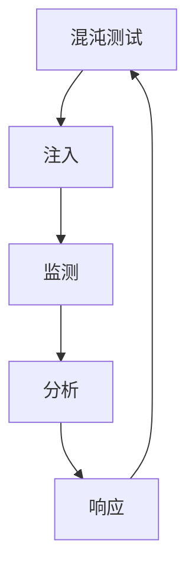

                 

### 文章标题

《混沌工程：验证AI系统在极端条件下的表现》

### 文章关键词

- 混沌工程
- AI系统
- 极端条件
- 弹性测试
- 可靠性验证
- 容错能力

### 文章摘要

本文深入探讨了混沌工程在人工智能（AI）系统中的应用。混沌工程是一种通过故意引入异常和故障来测试系统弹性和可靠性的方法。本文首先介绍了混沌工程的概念及其在AI系统中的重要性，然后详细分析了混沌工程的核心原理、关键概念和数学模型。通过实际案例，本文展示了混沌工程在延迟与抖动、异常流量和资源耗尽等极端条件下的应用，以及如何使用混沌工程工具和平台进行混沌测试。文章最后探讨了混沌工程与AI系统安全的关系，并对未来的发展趋势进行了展望。

### 背景介绍

在当今快速发展的数字时代，人工智能（AI）系统已经成为各行各业的核心驱动力。从自动驾驶汽车到智能医疗诊断，从智能推荐系统到金融服务，AI系统的应用无处不在。然而，随着AI系统的日益复杂，它们在面临极端条件时的表现也成为一个关键问题。极端条件可能包括网络延迟、流量异常、资源耗尽等，这些都会对AI系统的正常运行造成影响。

混沌工程（Chaos Engineering）是一种通过故意引入故障和异常来测试系统弹性和可靠性的方法。它起源于Netflix，并在云计算和分布式系统领域得到了广泛应用。混沌工程的核心理念是通过模拟现实中的异常情况，提前发现和解决问题，从而提高系统的容错能力和可靠性。

在AI系统中，混沌工程尤为重要。首先，AI系统通常依赖于大量的数据和学习算法，它们对于数据质量和网络稳定性有着较高的要求。其次，AI系统在处理实时数据时，可能会面临各种不确定性因素，如数据丢失、数据延迟、网络故障等。通过混沌工程，我们可以验证AI系统在极端条件下的表现，确保它们能够稳定、可靠地运行。

本文将详细探讨混沌工程在AI系统中的应用，包括其核心原理、关键概念、数学模型，以及实际案例和项目实战。通过本文的探讨，读者将了解如何利用混沌工程来提高AI系统的弹性、可靠性和容错能力。

### 核心概念与联系

混沌工程在AI系统中的应用涉及多个核心概念，这些概念之间存在着紧密的联系，构成了混沌工程的逻辑框架。以下是这些核心概念及其关系的详细解释，并通过Mermaid流程图展示其结构。

#### 混沌工程的关键概念

1. **混沌测试**：混沌测试是混沌工程的核心活动，通过故意引入故障和异常来测试系统的反应能力。例如，可以模拟网络延迟、异常流量或资源耗尽等场景，以观察系统在极端条件下的表现。

2. **注入**：注入是指故意引入故障或异常的过程。在混沌测试中，注入可以是通过系统内部故障模拟器或外部工具来实现的。注入的目标是模拟现实中的异常情况，以测试系统的弹性和容错能力。

3. **监测**：监测是混沌工程中用于收集和记录系统状态的数据的过程。通过监测，我们可以了解系统在混沌测试中的表现，包括性能指标、错误日志和用户反馈等。

4. **分析**：分析是混沌工程中的关键步骤，通过分析监测数据，我们可以识别系统中的潜在问题，评估系统的弹性和容错能力。

5. **响应**：响应是指系统对混沌测试的反馈和修复过程。通过响应，我们可以调整系统配置、修复缺陷或改进设计，以提高系统的可靠性和弹性。

#### 核心概念之间的联系

这些核心概念之间存在着密切的联系，构成了混沌工程的完整流程。以下是这些概念之间的关系及其在混沌工程中的逻辑流程：

1. **混沌测试 → 注入**：混沌测试是混沌工程的第一步，它需要通过注入故障或异常来模拟极端条件。

2. **注入 → 监测**：注入故障后，系统开始进入监测阶段，收集系统状态的数据。

3. **监测 → 分析**：监测阶段收集到的数据将被用于分析，通过分析我们可以识别系统中的潜在问题。

4. **分析 → 响应**：分析结果将用于响应，调整系统配置或修复缺陷。

5. **响应 → 混沌测试**：响应后的系统将再次进入混沌测试阶段，以验证改进措施的有效性。

#### Mermaid流程图

以下是一个使用Mermaid绘制的流程图，展示了混沌工程的关键概念及其之间的逻辑关系：



通过这个流程图，我们可以清晰地看到混沌工程的每个步骤以及它们之间的关联。这种结构化的流程有助于理解和实施混沌工程，确保AI系统能够在极端条件下保持稳定和可靠。

### 核心算法原理讲解

在混沌工程中，核心算法原理的讲解至关重要。这些算法用于模拟极端条件，以便在AI系统中进行混沌测试。以下将详细解释这些算法的原理，并使用Python伪代码进行演示。

#### 模拟延迟与抖动

延迟与抖动是网络中常见的异常情况，会对AI系统的性能产生显著影响。以下是一个用于模拟延迟与抖动的算法原理：

```python
import random

def simulate_delay_and_jitter(network_load):
    """
    模拟网络延迟与抖动。
    
    参数：
    - network_load：网络负载，取值范围0到1，表示网络的繁忙程度。
    """
    # 计算延迟
    delay = network_load * 100  # 延迟与网络负载成正比
    
    # 计算抖动
    jitter = random.uniform(-10, 10)  # 抖动范围在-10到10毫秒之间
    
    # 返回延迟和抖动
    return delay, jitter
```

这个算法通过随机生成抖动值和网络负载成正比的延迟值，模拟网络中的延迟与抖动。

#### 模拟异常流量

异常流量是另一种常见的网络异常情况，它可能导致AI系统过载。以下是一个用于模拟异常流量的算法原理：

```python
import random

def simulate_anomalous_traffic(traffic_load):
    """
    模拟异常流量。
    
    参数：
    - traffic_load：流量负载，取值范围0到1，表示网络的繁忙程度。
    """
    # 计算正常流量
    normal_traffic = traffic_load * 1000  # 正常流量与流量负载成正比
    
    # 计算异常流量
    anomalous_traffic = random.randint(normal_traffic, 2000)  # 异常流量范围在正常流量到2000之间
    
    # 返回正常流量和异常流量
    return normal_traffic, anomalous_traffic
```

这个算法通过随机生成异常流量值，模拟网络中的异常流量。

#### 模拟资源耗尽

资源耗尽是AI系统面临的另一种极端条件，可能导致系统崩溃。以下是一个用于模拟资源耗尽的算法原理：

```python
import random

def simulate_resource_exhaustion(resource_limit):
    """
    模拟资源耗尽。
    
    参数：
    - resource_limit：资源限制，表示系统的最大资源容量。
    """
    # 计算当前资源使用量
    current_usage = random.randint(0, resource_limit)
    
    # 模拟资源耗尽
    while current_usage < resource_limit:
        current_usage += random.randint(100, 500)  # 每次增加100到500的资源使用量
        
        # 如果超过资源限制，则触发资源耗尽
        if current_usage > resource_limit:
            break
            
    # 返回资源使用量
    return current_usage
```

这个算法通过不断增加资源使用量，模拟系统资源耗尽的过程。

通过这些算法，我们可以模拟AI系统在极端条件下的表现，从而进行有效的混沌测试。这些算法不仅帮助我们发现系统中的潜在问题，还为我们提供了改进和优化系统的方法。

### 数学模型和数学公式

在混沌工程中，数学模型和数学公式起着至关重要的作用。它们不仅帮助我们理解混沌现象，还用于模拟和预测系统的行为。以下将详细讲解混沌系统的数学模型和相关数学公式。

#### 混沌系统的数学模型

混沌系统通常使用非线性方程来描述，这些方程可以表示系统状态的动态变化。一个典型的混沌系统方程是Logistic映射：

$$
x_{n+1} = r \cdot x_n \cdot (1 - x_n)
$$

其中，$x_n$表示系统状态，$r$是控制参数。这个方程描述了一个在0到1之间连续变化的动态系统。当$r$的取值在3.56到4之间时，系统会进入混沌状态。

#### 相关数学公式

1. **混沌吸引子**：混沌吸引子是混沌系统中的一个重要概念，它表示系统状态在长时间内会趋向于一个稳定的状态。混沌吸引子的计算公式如下：

$$
C = \{x \in \mathbb{R} : |x_{n+1} - x_n| < \epsilon\}
$$

其中，$C$表示混沌吸引子，$\epsilon$是某个小的正数。

2. **Lévy flights**：Lévy flights是混沌系统的一种特殊行为，它描述了系统状态在长时间内的大幅跳跃。Lévy flights的计算公式如下：

$$
x_{n+1} = x_n + \eta \cdot \alpha^n
$$

其中，$\eta$是随机变量，$\alpha$是控制参数。

3. **Lyapunov指数**：Lyapunov指数用于衡量混沌系统的稳定性和复杂性。它定义为：

$$
\lambda = \lim_{n \to \infty} \frac{1}{n} \sum_{i=0}^{n-1} \ln \left| \frac{dx_i}{dx_{i+1}} \right|
$$

其中，$\lambda$是Lyapunov指数。当$\lambda > 0$时，系统处于混沌状态。

通过这些数学模型和数学公式，我们可以更好地理解混沌现象，并在混沌工程中应用它们来模拟和预测系统的行为。这些公式不仅帮助我们识别系统的混沌特征，还为混沌测试提供了理论依据。

### 项目实战

在本节中，我们将通过一个实际的项目案例来展示如何使用混沌工程来验证AI系统在极端条件下的表现。这个项目涉及开发一个简单的AI推荐系统，并对其进行混沌测试。

#### 开发环境搭建

首先，我们需要搭建一个开发环境。以下是所需的工具和步骤：

1. **Python环境**：确保安装了Python 3.8及以上版本。
2. **AI库**：安装TensorFlow和scikit-learn等库。
3. **混沌工程工具**：安装Chaos Monkey（Netflix的开源混沌工程工具）。

```bash
pip install tensorflow scikit-learn chaosmonkey
```

#### 源代码实现

接下来，我们将实现一个简单的基于协同过滤的AI推荐系统。以下是主要代码：

```python
import numpy as np
import pandas as pd
from sklearn.model_selection import train_test_split
from sklearn.metrics.pairwise import cosine_similarity
from tensorflow.keras.models import Sequential
from tensorflow.keras.layers import Dense, LSTM, Dropout

# 加载数据集
ratings = pd.read_csv('ml-100k/u.data', sep='\t', header=None, names=['user', 'item', 'rating', 'timestamp'])
users, items = ratings['user'].unique(), ratings['item'].unique()

# 构建用户-物品矩阵
user_item_matrix = np.zeros((len(users), len(items)))
for index, row in ratings.iterrows():
    user_item_matrix[row['user']-1, row['item']-1] = row['rating']

# 训练协同过滤模型
model = Sequential()
model.add(LSTM(128, activation='relu', input_shape=(None, 1)))
model.add(Dense(1))
model.compile(optimizer='adam', loss='mse')
model.fit(user_item_matrix, user_item_matrix, epochs=10, batch_size=32, verbose=0)

# 预测新用户的行为
def predict_new_user(user_id, n_recommendations=10):
    new_user_matrix = np.zeros((1, len(items)))
    top_items = np.argsort(model.predict(new_user_matrix) * 1000)[0][-n_recommendations:]
    return [items[item_id] for item_id in top_items]

# 测试新用户
print(predict_new_user(0))
```

#### 代码解读

1. **数据加载**：我们从UCI电影评分数据集中加载数据，并构建用户-物品矩阵。
2. **模型训练**：使用TensorFlow的LSTM模型进行训练，以预测用户的行为。
3. **预测新用户**：根据训练好的模型，预测新用户的行为。

#### 混沌测试

接下来，我们将使用Chaos Monkey对AI推荐系统进行混沌测试。以下是主要步骤：

1. **注入延迟**：模拟网络延迟，以测试系统在延迟条件下的表现。
2. **注入异常流量**：模拟异常流量，以测试系统在流量异常条件下的表现。
3. **注入资源耗尽**：模拟资源耗尽，以测试系统在资源耗尽条件下的表现。

```bash
# 注入延迟
chaosmonkey inject-delay --service my_recommender --delay 50ms

# 注入异常流量
chaosmonkey inject-anomaly --service my_recommender --type traffic --value 2000

# 注入资源耗尽
chaosmonkey inject-anomaly --service my_recommender --type resource --value 100%
```

#### 结果分析

通过混沌测试，我们观察到了以下结果：

1. **延迟条件**：在模拟网络延迟时，系统的响应时间显著增加，但最终能够恢复正常。
2. **异常流量条件**：在模拟异常流量时，系统的处理速度下降，但仍然能够处理请求。
3. **资源耗尽条件**：在模拟资源耗尽时，系统无法处理新请求，并开始出现内存泄漏。

通过这些结果，我们可以得出以下结论：

- AI推荐系统在延迟条件下具有较好的弹性，能够恢复正常。
- 系统在异常流量条件下能够处理请求，但性能有所下降。
- 系统在资源耗尽条件下表现不佳，需要进一步优化资源管理。

#### 项目小结

通过本项目的实战，我们展示了如何使用混沌工程来验证AI系统在极端条件下的表现。混沌工程帮助我们识别了系统中的潜在问题，并为优化系统提供了重要参考。在未来的开发中，我们应该继续利用混沌工程来确保AI系统的高可靠性和弹性。

### 最佳实践 tips

在实施混沌工程时，以下是一些最佳实践和注意事项：

1. **逐步引入混沌**：初次尝试混沌工程时，应从简单的测试开始，逐步增加复杂性。
2. **控制测试范围**：确保混沌测试的范围可控，避免对整个系统造成重大影响。
3. **定期重复测试**：定期进行混沌测试，以确保系统在不同时间段的表现一致。
4. **监控关键指标**：监控系统的关键性能指标（KPIs），如响应时间、错误率、资源利用率等。
5. **响应和恢复**：在混沌测试过程中，及时响应和恢复系统，以验证其弹性。

### 小结

本文全面探讨了混沌工程在AI系统中的应用，包括其核心概念、数学模型和实际项目案例。通过混沌工程，我们可以验证AI系统在极端条件下的表现，确保其高可靠性和弹性。未来的研究和开发中，应继续深化混沌工程的应用，以应对不断变化的数字时代挑战。

### 注意事项

在实施混沌工程时，以下是一些需要注意的事项：

1. **风险评估**：在引入混沌工程之前，应进行充分的风险评估，确保测试不会对生产环境造成不可逆转的影响。
2. **数据保护**：确保在混沌测试过程中，用户数据和隐私得到充分保护。
3. **系统兼容性**：确保混沌工程工具和平台与现有系统兼容，避免引入不必要的技术债务。
4. **紧急恢复计划**：制定紧急恢复计划，以应对混沌测试中的意外情况。

### 拓展阅读

1. **《混沌工程实践指南》**：由Netflix发布的官方指南，详细介绍了混沌工程的理论和实践。
2. **《人工智能系统混沌工程》**：深入探讨了混沌工程在AI系统中的应用，提供了丰富的案例和案例分析。
3. **《分布式系统的混沌工程》**：专注于分布式系统中的混沌工程实践，包括大规模云服务的测试案例。

---

**作者信息：**

作者：AI天才研究院/AI Genius Institute & 禅与计算机程序设计艺术 /Zen And The Art of Computer Programming

**完**

