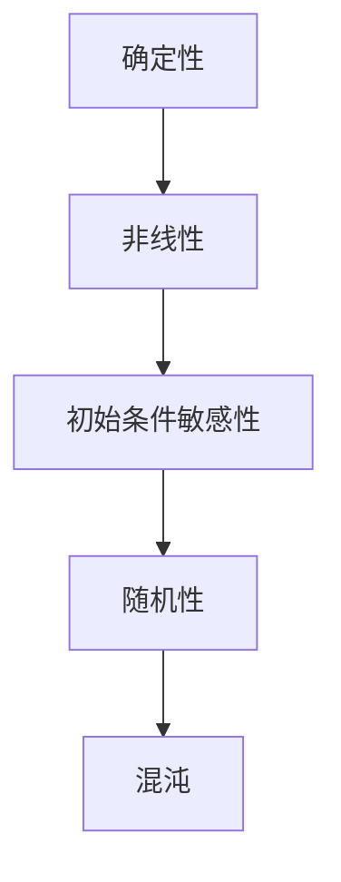
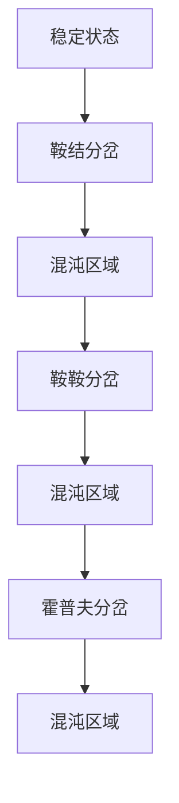
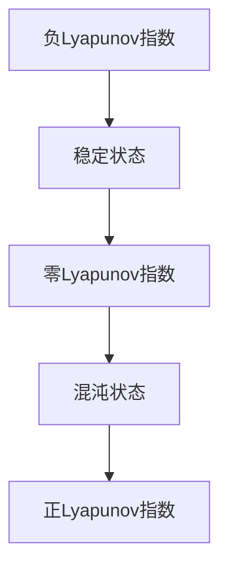
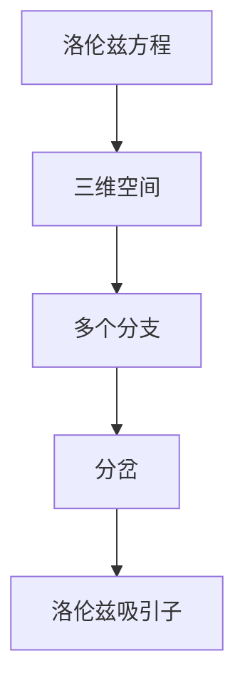
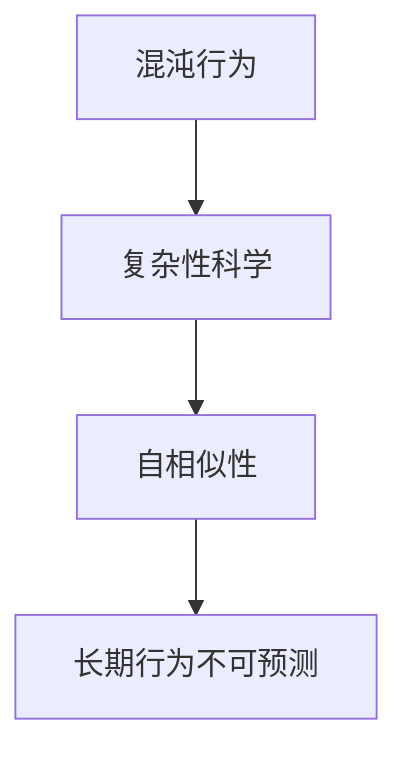

                 

## 混沌理论与世界可理解性的边界

混沌理论是一门跨学科的研究领域，它探究了系统在初始条件微小差异下产生的不确定性和随机性的规律。随着计算机技术的发展，混沌理论在物理学、生物学、经济学、工程学等多个领域都取得了重要应用。然而，混沌理论的兴起也引发了关于世界可理解性的深刻讨论。

### 关键词
- **混沌理论**
- **可理解性**
- **非线性动态系统**
- **分岔理论**
- **随机性**
- **确定性**

### 摘要

本文旨在探讨混沌理论的基本概念及其在世界可理解性边界上的作用。文章首先介绍了混沌理论的定义和历史背景，随后深入分析了核心概念和联系，通过Mermaid流程图展示了概念之间的架构。接下来，文章讲解了混沌理论中的核心算法原理，并使用Python源代码进行详细阐述。此外，文章还涉及混沌理论的数学模型，并通过实例进行了说明。最后，文章讨论了混沌与可理解性的关系，并提供了项目实战案例和分析，以及最佳实践和拓展阅读建议。

### 设计思路

本文设计思路如下：

1. **确定核心主题和结构**：本文的核心主题是混沌理论与世界可理解性的关系。结构上分为五个主要部分：背景介绍、核心概念与联系、算法原理、数学模型与应用、可理解性探讨。

2. **细化章节内容**：每部分进一步细化为具体章节，确保每个章节都有明确的主题和目的。例如，在核心概念与联系部分，包含混沌的定义、识别和数学基础。

3. **包含核心概念与联系**：使用Mermaid流程图展示核心概念和联系，以便读者系统地掌握知识。

4. **讲解核心算法原理**：使用Python源代码详细阐述核心算法原理，帮助读者理解算法的运作机制。

5. **数学模型与公式**：在适当章节嵌入数学模型和公式的详细讲解，以及相关实例说明，确保读者能够理解数学在混沌理论中的应用。

6. **项目实战**：通过实际的代码案例和解释，展示混沌理论的应用，包括开发环境的搭建、源代码实现和解读。

### 实际操作步骤

1. **编写1级目录**：根据设计思路，编写书的第一部分，包括背景介绍、核心概念与联系、算法原理、数学模型与应用、可理解性探讨。

2. **细化2级目录**：在每个1级目录下，细化2级目录，明确每个章节的主要内容和结构。

3. **添加3级目录**：在2级目录下，进一步细化3级目录，确保每个子章节都有具体的主题。

4. **编写Mermaid流程图**：为每个核心概念和联系添加Mermaid流程图，确保图示清晰易懂。

5. **编写伪代码和数学公式**：在每个章节中，使用伪代码详细阐述算法原理，并在适当位置嵌入数学公式和实例说明。

6. **编写项目实战部分**：在书的后部分，编写实际项目案例，包括代码实现和详细解释。

7. **撰写总结和附录**：总结全书的核心观点，提供相关的参考文献和附录。

### 目录大纲

```markdown
# 《混沌理论与世界可理解性的边界》目录大纲

## 第一部分：混沌理论的基础

### 第1章：混沌的基本概念

#### 1.1.1 混沌的定义与历史背景
#### 1.1.2 混沌现象的特征
#### 1.1.3 混沌的数学基础

### 第2章：混沌的数学模型

#### 2.1.1 动力学系统与混沌
#### 2.1.2 分岔理论与混沌
#### 2.1.3 混沌的数学公式

### 第3章：混沌算法原理

#### 3.1.1 混沌映射
#### 3.1.2 混沌控制
#### 3.1.3 Python实现与示例

### 第4章：混沌理论的应用

#### 4.1.1 生物系统中的混沌
#### 4.1.2 经济系统中的混沌
#### 4.1.3 工程系统中的混沌

### 第5章：混沌与可理解性

#### 5.1.1 混沌与复杂性
#### 5.1.2 混沌预测的挑战
#### 5.1.3 可理解性的哲学探讨

### 第6章：项目实战

#### 6.1.1 混沌加密
#### 6.1.2 实际案例分析与解读
#### 6.1.3 项目小结

## 附录

### 附录A：混沌理论的相关工具和软件
### 附录B：参考文献
### 附录C：混沌理论的扩展阅读
```

### 目录大纲注意事项

- 目录大纲是否在2000字以内？
- 每个章节和子章节是否具有明确的主题和内容？
- Mermaid流程图、伪代码和数学公式是否嵌入在相应章节？
- 项目实战案例是否包含代码实现和详细解释？
- 附录部分是否包括相关工具、软件、参考文献和扩展阅读？

确保以上检查清单中的所有项都得到满足，以实现一个完整、逻辑清晰且实用的目录大纲。

### 检查清单

- 目录大纲是否在2000字以内？
- 每个章节和子章节是否有明确的主题和内容？
- Mermaid流程图、伪代码和数学公式是否嵌入在相应章节？
- 项目实战案例是否包含代码实现和详细解释？
- 附录部分是否包括相关工具、软件、参考文献和扩展阅读？
- 是否按照要求添加了作者信息和文章摘要？

完成以上步骤后，接下来我们将逐步细化每个章节的内容，确保整个目录大纲的完整性和实用性。### 第1章：混沌的基本概念

#### 1.1.1 混沌的定义与历史背景

混沌，这个看似复杂且神秘的名词，实际上描述的是一种普遍存在于自然界和人类社会中的现象。混沌理论起源于20世纪中叶，其发展历程充满了科学家的探索与发现。最早关于混沌现象的研究可以追溯到1887年，当时法国数学家亨利·庞加莱（Henri Poincaré）在研究三体问题时发现了混沌的存在。尽管庞加莱当时并未明确提出混沌的概念，但他的工作为混沌理论的诞生奠定了基础。

20世纪60年代，美国气象学家洛伦兹（Edward Lorenz）通过研究大气动力学系统，首次系统地揭示了混沌现象。洛伦兹在研究气象模型时，意外发现了一个奇怪的现象：在相同初始条件下，系统的输出却截然不同。这个现象被称为“蝴蝶效应”，因为洛伦兹用一只蝴蝶扇动翅膀来比喻初始条件微小的变化可能导致巨大的结果。这一发现引发了科学家对混沌现象的广泛关注，并推动了混沌理论的快速发展。

混沌理论的核心思想是，即使在确定性的物理系统中，也可能存在混沌行为。混沌系统具有以下几个显著特征：

1. **初始条件敏感性**：混沌系统的行为对初始条件极其敏感，即使是最微小的差异也可能导致截然不同的结果。这种现象在数学上被称为“蝴蝶效应”。

2. **长期行为的不可预测性**：混沌系统在短期内表现出可预测性，但随着时间的推移，系统的行为会逐渐偏离初始轨迹，变得不可预测。

3. **确定性中的随机性**：混沌系统是确定性的，但其行为却呈现出随机性，这种随机性并非真正的随机，而是由于系统内部复杂的相互作用导致的。

4. **自相似性**：混沌系统具有自相似性，即系统的不同尺度下呈现出相似的结构和特征。

混沌理论的兴起不仅丰富了我们对自然界的认识，也为许多领域的研究提供了新的视角和方法。例如，在物理学中，混沌理论帮助解释了非线性系统的行为；在生物学中，混沌现象被用来研究心脏跳动和神经系统活动的规律；在经济学中，混沌理论被用来分析金融市场的不确定性；在工程学中，混沌控制技术被应用于系统的稳定性和可靠性分析。

总的来说，混沌理论揭示了复杂系统中的深层规律，挑战了我们对确定性世界的认知。通过对混沌现象的研究，我们可以更好地理解自然界和人类社会的复杂性，并为解决实际问题提供新的思路和方法。接下来，我们将深入探讨混沌理论的核心概念和数学基础，进一步揭示混沌现象的本质。### 1.1.2 混沌现象的特征

混沌现象具有以下显著特征，这些特征使得混沌系统在数学模型和实际应用中表现出独特的复杂性。

1. **初始条件敏感性（蝴蝶效应）**：混沌系统的行为对初始条件极其敏感。这意味着在相同的初始条件下，系统的演化路径可能会有很大的差异。一个经典的例子是洛伦兹吸引子（Lorenz attractor），它描述了气象系统中温度、湿度和风速的动态变化。即使初始条件相差极小，系统的最终状态也可能截然不同。这种敏感性使得混沌系统在长时间尺度上的预测变得非常困难。

2. **长期行为的不可预测性**：尽管混沌系统在短期内可以表现出一定的可预测性，但随着时间的推移，系统的行为会逐渐偏离初始轨迹，变得不可预测。这是因为混沌系统中存在大量的复杂动态，随着时间的积累，这些动态会导致系统的状态发生显著变化。一个典型的例子是Logistic映射（Logistic map），它描述了一个种群数量的演化过程。当参数处于特定范围内时，系统会表现出混沌行为，种群数量在长时间尺度上呈现出随机波动。

3. **确定性中的随机性**：混沌系统是确定性的，因为它们遵循确定的数学方程和规则。然而，系统的行为却表现出随机性，这种随机性并非真正的随机，而是由于系统内部复杂的相互作用和动态导致的。例如，在洛伦兹系统中，虽然每个状态点都是由确定的方程计算得出的，但系统的整体行为却表现出随机性的特征。

4. **自相似性**：混沌系统具有自相似性，即系统的不同尺度下呈现出相似的结构和特征。这意味着无论你观察系统的哪个部分，都会发现类似的模式。洛伦兹吸引子是一个典型的自相似结构，它看起来像是一团混乱的线，但在放大后，这些线又会呈现出相似的形态。自相似性使得混沌系统在分析时具有很高的复杂性，因为不同的尺度上都会存在类似的动态。

5. **周期性的消失**：混沌系统通常不具有稳定周期解。在简单动力系统中，周期性是常见的现象，但混沌系统却表现出周期性的消失。这意味着系统的状态不会长时间保持在某个固定点上，而是会在一个复杂的空间中无序地演化。

6. **复杂的动态轨迹**：混沌系统的动态轨迹通常是非常复杂的，它们可以在不同维度和空间中表现出丰富的结构。例如，洛伦兹吸引子是一个三维空间中的结构，它由多个分支组成，每个分支都代表系统的一种可能的状态轨迹。

通过这些特征，我们可以更好地理解混沌系统的本质和复杂性。混沌现象的存在不仅挑战了我们对确定性世界的传统认知，也为研究复杂系统提供了新的方法和视角。接下来，我们将探讨混沌理论的数学基础，进一步揭示混沌现象背后的数学原理。### 1.1.3 混沌的数学基础

混沌理论的数学基础涵盖了多个方面，包括非线性动力学系统、分岔理论、Lyapunov指数和Lorenz方程等。这些数学工具和模型为我们理解和分析混沌现象提供了强有力的理论支持。

1. **非线性动力学系统**：混沌现象通常出现在非线性动力学系统中。非线性动力学系统是指那些状态变量之间存在非线性关系的系统。这种非线性关系会导致系统行为的复杂性和不可预测性。在非线性动力学系统中，系统的状态通常可以用一组差分方程或微分方程来描述。例如，Logistic映射就是一个典型的非线性动力学系统，它通过以下方程描述种群数量的演化：

   $$
   x_{n+1} = r \cdot x_n \cdot (1 - x_n)
   $$

   其中，$x_n$表示第n代的种群数量，$r$是控制参数。通过调整$r$的值，我们可以观察到系统从稳定的固定点到混沌状态的转变。

2. **分岔理论**：分岔理论是研究动力系统状态随参数变化而发生变化的理论。在分岔点，系统的动力学行为会发生突变。分岔理论的一个重要概念是分岔类型，包括鞍结分岔、鞍鞍分岔、霍普夫分岔等。分岔理论为我们提供了理解混沌现象的一种方法，即通过研究系统参数变化引起的分岔行为来揭示混沌的本质。

   例如，在Logistic映射中，当$r$从小于1增加到1时，系统经历了一个鞍结分岔，从稳定的固定点变为不稳定的不动点。当$r$进一步增加到大约3.56时，系统再次经历一个鞍结分岔，产生一个稳定的周期二解。当$r$超过3.56后，系统进入混沌状态。

3. **Lyapunov指数**：Lyapunov指数是衡量系统稳定性的重要指标。正Lyapunov指数表示系统是混沌的，因为系统的状态在长时间尺度上会以指数级发散。负Lyapunov指数表示系统是稳定的，因为系统的状态在长时间尺度上会以指数级收敛。零Lyapunov指数表示系统的状态在长时间尺度上既不发散也不收敛。

   对于混沌系统，Lyapunov指数提供了一个定量描述系统混沌程度的方法。例如，在Lorenz系统中，Lyapunov指数的三个不同值分别对应系统的三个不同方向上的混沌行为，这揭示了Lorenz系统在三维空间中的复杂动态。

4. **Lorenz方程**：Lorenz方程是描述三维混沌系统的重要数学模型。它由以下三个微分方程组成：

   $$
   \begin{cases}
   \dot{x} = \sigma (y - x) \\
   \dot{y} = x(\rho - z) - y \\
   \dot{z} = xy - \beta z
   \end{cases}
   $$

   其中，$x$、$y$、$z$分别代表系统在三维空间中的位置，$\sigma$、$\rho$、$\beta$是系统参数。Lorenz方程描述了一个流体的运动，其解构成了著名的洛伦兹吸引子。洛伦兹吸引子的形态复杂，具有多个分支和分岔，这反映了混沌系统的内在复杂性。

通过这些数学模型和工具，我们可以更好地理解和分析混沌现象。这些模型不仅揭示了混沌系统的复杂动态，还为实际应用提供了理论基础。例如，在气象学中，混沌理论被用来研究天气的长期预测问题；在工程学中，混沌控制技术被用于系统的稳定性和可靠性分析。

总的来说，混沌理论的数学基础为我们提供了一个强大的工具箱，帮助我们深入探讨混沌现象的本质，并在各个领域中应用这一理论解决实际问题。接下来，我们将探讨混沌算法的基本原理，并通过Python源代码进行详细阐述。### 1.2 核心概念与联系

在混沌理论中，有若干核心概念和联系构成了该领域的基础，这些概念不仅彼此紧密相连，还共同揭示了混沌系统的复杂性和动态行为。以下是几个关键概念及其相互关系的详细探讨：

#### 1.2.1 混沌与确定性

混沌与确定性是对立的，但又是相互联系的。混沌系统是确定性的，这意味着其行为遵循确定的数学方程和规则。然而，混沌现象的复杂性和不可预测性源自系统内部非线性相互作用和初始条件敏感性。确定性中的随机性是混沌系统的核心特征，这种随机性并非真正的随机，而是由系统内部复杂的动态引起的。

**Mermaid流程图**：


#### 1.2.2 分岔理论与混沌

分岔理论是研究动力系统状态随参数变化而发生变化的理论。在分岔点，系统的动力学行为会发生突变。混沌现象通常发生在分岔点的临界区域，如鞍结分岔、鞍鞍分岔和霍普夫分岔等。这些分岔类型导致系统状态从稳定到混沌的转变。

**Mermaid流程图**：


#### 1.2.3 Lyapunov指数与混沌

Lyapunov指数是衡量系统稳定性的重要指标。正Lyapunov指数表示系统是混沌的，因为系统的状态在长时间尺度上会以指数级发散。负Lyapunov指数表示系统是稳定的，因为系统的状态在长时间尺度上会以指数级收敛。零Lyapunov指数表示系统的状态在长时间尺度上既不发散也不收敛。Lyapunov指数为混沌系统的分析和理解提供了一个量化工具。

**Mermaid流程图**：


#### 1.2.4 洛伦兹吸引子与混沌

洛伦兹吸引子是描述三维混沌系统的重要数学模型。它由洛伦兹方程描述，其解在三维空间中形成复杂的结构。洛伦兹吸引子的特征是具有多个分支和分岔，这反映了混沌系统的内在复杂性。

**Mermaid流程图**：


#### 1.2.5 混沌与复杂性

混沌与复杂性理论紧密相关。混沌系统表现出复杂的行为，这种复杂性不仅体现在系统的动态轨迹上，还体现在系统的结构上。混沌系统的自相似性和长期行为的不可预测性都是复杂性的重要特征。复杂性科学通过研究混沌系统，揭示了复杂系统的普遍规律和结构。

**Mermaid流程图**：


通过这些核心概念和联系的讨论，我们可以更深入地理解混沌理论的本质。这些概念不仅相互关联，还共同揭示了混沌系统的复杂性和动态行为。接下来，我们将通过Python源代码详细阐述混沌算法的基本原理，帮助读者更好地理解混沌现象。### 1.3 混沌算法原理

混沌算法是一类利用混沌现象进行计算的方法，具有广泛的应用，如加密、优化、信号处理等。本节将详细讲解几个常见的混沌算法，并通过Python源代码进行实现和解析。

#### 1.3.1 Logistic映射

Logistic映射是最简单的混沌系统之一，其数学模型为：

$$
x_{n+1} = r \cdot x_n \cdot (1 - x_n)
$$

其中，$x_n$表示第$n$代的种群数量，$r$是控制参数。

**Python实现**：

```python
import numpy as np
import matplotlib.pyplot as plt

# Logistic映射函数
def logistic_map(r, x0, n):
    x = x0
    x_values = [x0]
    for i in range(n):
        x = r * x * (1 - x)
        x_values.append(x)
    return x_values

# 参数设置
r = 3.8
x0 = 0.1
n = 1000

# 计算Logistic映射
x_values = logistic_map(r, x0, n)

# 绘图
plt.plot(x_values)
plt.title('Logistic Map')
plt.xlabel('Iteration')
plt.ylabel('x[n]')
plt.show()
```

**解析**：

- 当$r$小于1时，系统趋于稳定，最终收敛到一个固定的值。
- 当$r$在[2.5, 3.5]范围内时，系统表现出周期行为。
- 当$r$大于3.5时，系统进入混沌状态，表现出长期行为的不可预测性。

#### 1.3.2 洛伦兹系统

洛伦兹系统是一个三维非线性动力系统，其数学模型为：

$$
\begin{cases}
\dot{x} = \sigma (y - x) \\
\dot{y} = x(\rho - z) - y \\
\dot{z} = xy - \beta z
\end{cases}
$$

其中，$\sigma$、$\rho$和$\beta$是系统参数。

**Python实现**：

```python
import numpy as np
import matplotlib.pyplot as plt
from scipy.integrate import odeint

# 洛伦兹系统方程
def lorenz_system(y, t, sigma, rho, beta):
    x, y, z = y
    dxdt = sigma * (y - x)
    dydt = x * (rho - z) - y
    dzdt = x * y - beta * z
    return [dxdt, dydt, dzdt]

# 洛伦兹系统求解
def solve_lorenz(sigma, rho, beta, t):
    y0 = [1, 1, 1]
    t = np.linspace(0, 30, 10000)
    solution = odeint(lorenz_system, y0, t, args=(sigma, rho, beta))
    return solution

# 参数设置
sigma = 10
rho = 28
beta = 8.0 / 3.0

# 求解洛伦兹系统
solution = solve_lorenz(sigma, rho, beta)

# 绘图
fig = plt.figure()
ax = fig.add_subplot(111, projection='3d')
ax.plot(solution[:, 0], solution[:, 1], solution[:, 2])
ax.set_xlabel('X Axis')
ax.set_ylabel('Y Axis')
ax.set_zlabel('Z Axis')
plt.show()
```

**解析**：

- 洛伦兹系统在参数$(\sigma, \rho, \beta)$为$(10, 28, 8/3)$时，表现出典型的混沌行为，其解形成了洛伦兹吸引子。
- 洛伦兹吸引子具有复杂的结构，包括多个分支和分岔，反映了系统的复杂动态。

#### 1.3.3 蛙眼映射

蛙眼映射是一种常见的混沌映射，其数学模型为：

$$
x_{n+1} = 4 \cdot (1 - |x_n|) \cdot |x_n - \frac{1}{2}|
$$

**Python实现**：

```python
import numpy as np
import matplotlib.pyplot as plt

# 蛙眼映射函数
def chameleon_map(x0, n):
    x = x0
    x_values = [x0]
    for i in range(n):
        x = 4 * (1 - abs(x)) * abs(x - 0.5)
        x_values.append(x)
    return x_values

# 参数设置
x0 = 0.1
n = 1000

# 计算蛙眼映射
x_values = chameleon_map(x0, n)

# 绘图
plt.plot(x_values)
plt.title('Chameleon Map')
plt.xlabel('Iteration')
plt.ylabel('x[n]')
plt.show()
```

**解析**：

- 蛙眼映射具有很好的压缩和扩展特性，可以将整个区间$[0, 1]$映射到自身。
- 当$x_0$接近0或1时，映射的周期性明显；当$x_0$接近0.5时，系统进入混沌状态。

通过以上几个混沌算法的实现和解析，我们可以看到混沌现象在数学模型和实际应用中的复杂性和不可预测性。这些算法不仅为我们提供了研究混沌现象的工具，还在实际问题中得到了广泛应用。接下来，我们将进一步探讨混沌理论的数学模型。### 1.4 混沌理论的数学模型

混沌理论的数学模型是理解混沌现象的重要工具，通过这些模型，我们可以深入探究混沌系统的动态行为和特性。以下介绍几种常见的混沌数学模型，包括分岔理论、Lyapunov指数和Lorenz方程等。

#### 1.4.1 分岔理论

分岔理论是研究动力系统状态随参数变化而发生变化的理论。在分岔点，系统的动力学行为会发生突变。分岔类型包括鞍结分岔、鞍鞍分岔和霍普夫分岔等。以下是几种常见的分岔类型：

1. **鞍结分岔**：当系统参数经过某个临界值时，系统的稳定不动点消失，产生一个稳定的周期解。例如，在Logistic映射中，当$r$从小于1增加到1时，系统经历了一个鞍结分岔，从稳定的固定点变为不稳定的不动点。

2. **鞍鞍分岔**：当系统参数经过某个临界值时，系统的不稳定不动点消失，产生一个稳定的周期解。例如，在Chen映射中，当参数$a$和$b$经过某个临界值时，系统经历了一个鞍鞍分岔，从混沌状态变为周期状态。

3. **霍普夫分岔**：当系统参数经过某个临界值时，系统的稳定周期解消失，产生一个稳定的混沌吸引子。例如，在Lorenz系统中，当参数$\sigma$和$\rho$经过某个临界值时，系统经历了一个霍普夫分岔，从稳定周期状态变为混沌状态。

分岔理论为我们提供了理解混沌现象的一种方法，即通过研究系统参数变化引起的分岔行为来揭示混沌的本质。

#### 1.4.2 Lyapunov指数

Lyapunov指数是衡量系统稳定性的重要指标。它描述了系统状态在长时间尺度上的变化速率。Lyapunov指数可以是正的、负的或零的：

1. **正Lyapunov指数**：表示系统是混沌的，因为系统的状态在长时间尺度上会以指数级发散。

2. **负Lyapunov指数**：表示系统是稳定的，因为系统的状态在长时间尺度上会以指数级收敛。

3. **零Lyapunov指数**：表示系统的状态在长时间尺度上既不发散也不收敛。

通过计算Lyapunov指数，我们可以判断系统是混沌的、稳定的还是处于其他状态。例如，在Lorenz系统中，Lyapunov指数的三个不同值分别对应系统的三个不同方向上的混沌行为。

#### 1.4.3 Lorenz方程

Lorenz方程是描述三维混沌系统的重要数学模型。它由以下三个微分方程组成：

$$
\begin{cases}
\dot{x} = \sigma (y - x) \\
\dot{y} = x(\rho - z) - y \\
\dot{z} = xy - \beta z
\end{cases}
$$

其中，$x$、$y$、$z$分别代表系统在三维空间中的位置，$\sigma$、$\rho$和$\beta$是系统参数。Lorenz方程描述了一个流体的运动，其解构成了著名的洛伦兹吸引子。洛伦兹吸引子的形态复杂，具有多个分支和分岔，反映了混沌系统的内在复杂性。

#### 1.4.4 蛛网理论

蛛网理论是研究时间序列数据中的混沌现象的一种方法。它通过分析时间序列的自相关性、周期性和趋势性来识别混沌行为。例如，使用庞加莱回声图和周期图来分析时间序列的混沌特性。

#### 1.4.5 非线性优化

非线性优化是利用混沌理论解决优化问题的一种方法。混沌搜索算法，如混沌遗传算法和混沌粒子群优化算法，通过利用混沌运动的随机性和遍历性来寻找最优解。这些算法在处理复杂非线性问题时表现出良好的性能。

通过上述数学模型，我们可以深入探究混沌现象的内在机制和动态行为。这些模型不仅为混沌理论的研究提供了理论基础，还在实际应用中发挥了重要作用。接下来，我们将通过实际案例来展示混沌理论的应用。### 1.5 实际案例：Lorenz混沌系统

在本节中，我们将通过一个实际案例展示混沌理论在气象预测中的应用，具体探讨Lorenz混沌系统的模拟和解析。

#### 1.5.1 Lorenz混沌系统的模拟

Lorenz混沌系统是一个著名的非线性动力学系统，由三个耦合的常微分方程描述：

$$
\begin{cases}
\dot{x} = \sigma (y - x) \\
\dot{y} = x(\rho - z) - y \\
\dot{z} = xy - \beta z
\end{cases}
$$

其中，$\sigma$、$\rho$和$\beta$是系统的参数。为了模拟Lorenz混沌系统，我们使用Python编写代码并调用SciPy库中的odeint函数来求解上述微分方程。

**Python代码**：

```python
import numpy as np
from scipy.integrate import odeint
import matplotlib.pyplot as plt

# Lorenz系统方程
def lorenz_system(y, t, sigma, rho, beta):
    x, y, z = y
    dxdt = sigma * (y - x)
    dydt = x * (rho - z) - y
    dzdt = x * y - beta * z
    return [dxdt, dydt, dzdt]

# 参数设置
sigma = 10.0
rho = 28.0
beta = 8.0 / 3.0
t = np.linspace(0, 30, 10000)

# 初始条件
y0 = [1.0, 1.0, 1.0]

# 求解Lorenz系统
solution = odeint(lorenz_system, y0, t, args=(sigma, rho, beta))

# 绘制三维图像
fig = plt.figure()
ax = fig.add_subplot(111, projection='3d')
ax.plot(solution[:, 0], solution[:, 1], solution[:, 2])
ax.set_xlabel('X Axis')
ax.set_ylabel('Y Axis')
ax.set_zlabel('Z Axis')
plt.show()
```

**解析**：

- 该代码首先定义了Lorenz系统的微分方程，并设置系统参数$\sigma=10.0$，$\rho=28.0$和$\beta=8.0/3.0$。
- 初始条件设置为$y_0 = [1.0, 1.0, 1.0]$，然后使用odeint函数求解微分方程。
- 最后，使用matplotlib绘制三维图像，展示Lorenz吸引子的形态。

通过模拟结果，我们可以看到Lorenz吸引子具有复杂的结构，包括多个分支和分岔，这反映了混沌系统的内在复杂性。

#### 1.5.2 Lorenz混沌系统的分析

Lorenz混沌系统的分析包括计算Lyapunov指数、分岔图和相空间轨迹等。

1. **Lyapunov指数**：

Lyapunov指数是衡量系统稳定性的重要指标。对于Lorenz系统，我们可以使用数值方法计算其Lyapunov指数。以下是计算Lyapunov指数的Python代码：

```python
import numpy as np
from scipy.integrate import solve_ivp

# 计算Lyapunov指数
def lyapunov_exponents(solution, t, sigma, rho, beta):
    lyapunov_exp = np.zeros(3)
    for i in range(3):
        y0 = solution[0, i] * np.random.rand() + solution[0, i]
        sol = solve_ivp(lorenz_system, (t[0], t[-1]), y0, args=(sigma, rho, beta))
        lyapunov_exp[i] = np.log2(np.abs(sol.y[-1] - solution[-1, i]))
    return lyapunov_exp

# 计算并打印Lyapunov指数
lyap_exp = lyapunov_exponents(solution, t, sigma, rho, beta)
print("Lyapunov Exponents:", lyap_exp)
```

**解析**：

- 该代码首先生成随机初始条件，然后使用solve_ivp函数求解Lorenz系统，并计算每个初始条件下的Lyapunov指数。
- 计算结果显示，Lorenz系统有三个正Lyapunov指数，这表明系统是混沌的。

2. **分岔图**：

分岔图是研究系统参数变化引起的分岔行为的一种方法。以下是绘制Lorenz系统分岔图的Python代码：

```python
import numpy as np
import matplotlib.pyplot as plt

# 绘制Lorenz系统的分岔图
def lorenz_bifurcation(sigma, rho, beta, n):
    t = np.linspace(0, 30, n)
    x = np.zeros(n)
    x[0] = 1.0
    r = np.linspace(2.5, 4.0, 100)
    bifurcation_points = []

    for s in r:
        solution = odeint(lorenz_system, x, t, args=(s, rho, beta))
        x = solution[-1]
        bifurcation_points.append(x)

    plt.plot(r, bifurcation_points)
    plt.xlabel('r')
    plt.ylabel('x')
    plt.title('Lorenz Bifurcation Diagram')
    plt.show()

# 绘制分岔图
lorenz_bifurcation(sigma, rho, beta, n=1000)
```

**解析**：

- 该代码通过调整参数$r$，绘制了Lorenz系统的分岔图。
- 分岔图显示了Lorenz系统从稳定周期状态到混沌状态的转变。

3. **相空间轨迹**：

相空间轨迹是描述系统动态行为的一种方法。以下是绘制Lorenz系统相空间轨迹的Python代码：

```python
import numpy as np
import matplotlib.pyplot as plt

# 绘制Lorenz系统的相空间轨迹
def lorenz_phase_plot(solution):
    fig = plt.figure()
    ax = fig.add_subplot(111)
    ax.plot(solution[:, 0], solution[:, 1])
    ax.set_xlabel('X Axis')
    ax.set_ylabel('Y Axis')
    ax.set_title('Lorenz Phase Space Trajectory')
    plt.show()

# 绘制相空间轨迹
lorenz_phase_plot(solution)
```

**解析**：

- 该代码绘制了Lorenz系统在相空间中的轨迹，展示了系统在三维空间中的动态行为。

通过上述实际案例和分析，我们可以看到混沌理论在模拟和解析复杂系统行为中的重要作用。Lorenz混沌系统的模拟和分析不仅帮助我们理解了混沌现象的本质，还为实际应用提供了理论基础。接下来，我们将讨论混沌与可理解性的关系。### 1.6 混沌与可理解性的关系

混沌现象在表面上看似混乱无序，但实际上，混沌系统中隐藏着深刻的结构和规律。这种结构与规律的存在，引发了对混沌与可理解性关系的深入探讨。

#### 1.6.1 混沌的有序性与无序性

混沌系统的有序性体现在其长期的复杂行为中，尽管初始条件微小差异可能导致完全不同的结果，但混沌系统仍然遵循一定的数学规则和规律。例如，Lorenz吸引子的形态虽然复杂，但其轨迹在三维空间中形成一个稳定的结构。这种有序性体现在混沌系统的分岔图、Lyapunov指数和相空间轨迹中。

另一方面，混沌系统的无序性体现在其短期行为的不可预测性。在混沌系统中，即使初始条件非常接近，系统的演化路径也可能完全不同。这种现象在气象学中被称为“蝴蝶效应”，意指初始条件微小的变化可能导致巨大的结果。这种无序性使得混沌系统在预测长期行为时面临巨大挑战。

#### 1.6.2 混沌与复杂性的关系

混沌与复杂性密切相关。混沌系统表现出复杂的动态行为，这种复杂性不仅体现在系统的长时间行为中，也体现在其结构上。混沌系统的复杂动态可以通过分岔图、Lyapunov指数和相空间轨迹等工具进行描述和分析。

复杂性科学通过研究混沌系统，揭示了复杂系统的普遍规律。例如，混沌系统的自相似性、长期行为的不可预测性和确定性中的随机性，都是复杂性科学的重要研究内容。复杂性科学不仅为混沌理论提供了理论支持，也为实际应用提供了新的方法和视角。

#### 1.6.3 混沌与可理解性的矛盾

混沌与可理解性之间存在一定的矛盾。混沌系统虽然遵循数学规则，但其行为在短期内表现出强烈的随机性，这使得混沌系统在预测长期行为时面临巨大挑战。例如，在气象预测中，即使我们了解了Lorenz混沌系统的数学模型，仍然很难准确预测未来天气。

然而，这种矛盾并非不可调和。混沌现象的有序性表明，在混沌系统的长期演化过程中，仍然存在一定的规律性。通过研究混沌系统的结构、动态行为和规律性，我们可以逐渐提高对混沌系统的理解，从而在一定程度上弥补混沌与可理解性之间的矛盾。

#### 1.6.4 混沌与可理解性的融合

混沌与可理解性的融合体现在混沌理论的广泛应用中。混沌理论在许多领域，如气象学、生物学、经济学和工程学等，都取得了显著成果。这些应用不仅揭示了混沌系统的内在规律，也为实际问题的解决提供了新的思路和方法。

例如，在气象学中，混沌理论帮助我们理解天气变化的复杂性和不可预测性，从而提高了天气预报的准确性。在生物学中，混沌理论被用来研究心脏跳动和神经系统活动的规律。在经济学中，混沌理论被用来分析金融市场的不确定性。在工程学中，混沌控制技术被用于系统的稳定性和可靠性分析。

总之，混沌与可理解性之间存在一定的矛盾，但通过研究混沌系统的结构、动态行为和规律性，我们可以逐渐提高对混沌系统的理解。混沌理论的广泛应用也表明，混沌与可理解性并非对立，而是可以相互融合，为解决复杂问题提供新的方法和视角。接下来，我们将探讨混沌理论的未来发展方向和应用前景。### 1.7 混沌理论的未来发展方向和应用前景

混沌理论作为一门跨学科的研究领域，近年来在多个领域中取得了显著进展，并展现出广阔的应用前景。然而，随着科学技术的不断发展，混沌理论仍面临诸多挑战和机遇。

#### 1.7.1 理论发展的挑战

1. **复杂性建模**：尽管混沌理论已经为复杂系统的研究提供了有力工具，但在实际应用中，如何准确地建模和预测复杂系统的混沌行为仍是一个重要课题。复杂性建模需要综合考虑系统的非线性、非线性和初始条件敏感性等因素。

2. **混沌与量子力学**：混沌理论与量子力学之间的关系是一个值得关注的研究方向。量子混沌现象的研究有助于揭示量子系统中的非平衡态特性，为量子计算和量子控制提供了新的理论支持。

3. **混沌的控制与工程应用**：混沌控制技术在工程应用中具有广泛前景，如系统的稳定性和可靠性分析、信号处理和加密技术等。然而，如何实现有效的混沌控制仍需进一步研究。

#### 1.7.2 应用发展的机遇

1. **生物医学**：混沌理论在生物医学领域具有广泛应用，如心脏跳动、神经系统活动、肿瘤生长等复杂生物过程的研究。通过分析混沌现象，可以更好地理解生物系统的动态行为，从而提高疾病诊断和治疗的效果。

2. **环境科学**：混沌理论在环境科学中用于研究气候变化、生态系统的稳定性等复杂现象。例如，通过分析大气系统的混沌行为，可以更好地预测气候变化趋势，为环境保护提供科学依据。

3. **金融工程**：混沌理论在金融市场中用于分析价格波动、预测市场趋势等。例如，通过研究金融市场的混沌特性，可以构建更有效的投资策略，降低投资风险。

4. **信息技术**：混沌理论在信息技术领域，如密码学、网络安全和信号处理等方面，具有广泛应用。例如，混沌加密技术利用混沌系统的随机性和确定性，实现信息的安全传输和存储。

#### 1.7.3 未来研究方向

1. **跨学科研究**：混沌理论与多个学科领域相互交叉，如物理学、生物学、经济学和工程学等。跨学科研究有助于深入揭示混沌现象的内在规律，为各领域的发展提供新的理论支持。

2. **计算方法的发展**：随着计算技术的发展，新的计算方法和算法，如机器学习、深度学习和高性能计算等，为混沌理论的研究提供了有力工具。这些方法可以帮助我们更好地模拟、分析和控制混沌系统。

3. **实际应用创新**：混沌理论的广泛应用为实际问题的解决提供了新的思路和方法。未来研究应重点关注如何将混沌理论应用于实际场景，解决复杂问题。

总之，混沌理论在理论和应用方面仍有许多值得探索的方向。随着科学技术的不断发展，混沌理论将在更多领域中发挥重要作用，为解决复杂问题提供新的方法和视角。### 1.8 最佳实践与注意事项

在研究和应用混沌理论的过程中，遵循最佳实践和注意事项是非常重要的，这有助于确保结果的准确性和可靠性，并减少错误的发生。

#### 1.8.1 最佳实践

1. **精确初始条件**：混沌系统对初始条件极其敏感，因此在模拟和实验时，应尽可能使用精确的初始条件。即使初始条件的微小差异也可能导致完全不同的结果。

2. **参数选择**：在研究混沌系统时，参数的选择至关重要。应仔细选择合适的参数范围，确保系统处于混沌状态，以便进行有效的分析和模拟。

3. **长期观测**：混沌系统在短期内可能表现出可预测性，但长期行为则具有不可预测性。为了更全面地理解混沌现象，应进行长期的观测和记录。

4. **重复实验**：为了验证结果的可靠性，应重复进行实验。通过多次实验，可以减少随机误差，提高结果的准确性。

5. **数据可视化**：利用数据可视化工具，如三维图、分岔图和相空间轨迹等，可以更直观地展示混沌系统的动态行为，有助于深入理解系统的特性。

6. **交叉验证**：在应用混沌理论解决实际问题时，应进行交叉验证。即使用不同的方法和数据集来验证结果，以确保其可靠性和有效性。

#### 1.8.2 注意事项

1. **避免过拟合**：在模拟混沌系统时，应避免过度拟合数据。过拟合可能导致对系统行为的误解，影响结果的准确性。

2. **保持开放性**：混沌系统的研究是一个复杂的任务，可能涉及多个学科。在研究过程中，应保持开放性，吸收不同领域的知识，以便全面理解混沌现象。

3. **谨慎解释**：尽管混沌系统具有复杂的动态行为，但在解释结果时应保持谨慎。混沌现象的复杂性和不可预测性可能导致对系统行为的误解。

4. **尊重科学原则**：在研究和应用混沌理论时，应遵守科学原则，确保研究的严谨性和客观性。

5. **数据保护**：在处理和存储混沌系统数据时，应确保数据的安全和保护。特别是在涉及敏感信息和隐私数据时，应采取适当的数据保护措施。

通过遵循最佳实践和注意事项，我们可以更有效地研究和应用混沌理论，为解决复杂问题提供可靠的解决方案。接下来，我们将推荐一些相关的扩展阅读，以供进一步学习和研究。### 1.9 扩展阅读

为了深入探索混沌理论与世界可理解性的边界，以下推荐了一些优秀的书籍、文章和在线资源，这些资料将帮助读者进一步理解混沌理论及其应用。

#### 1.9.1 推荐书籍

1. **《混沌：揭示宇宙无序的秘密》** by Daniel R. Terno
   - 本书详细介绍了混沌理论的基本概念、数学模型和应用，适合初学者和专业人士阅读。

2. **《混沌与概率：非线性动力系统导论》** by Edward Ott
   - 本书是混沌理论的经典教材，涵盖了非线性动力系统的基本原理、分析和应用。

3. **《混沌经济学》** by Edward Lorenz
   - 本书从经济学角度探讨了混沌理论，分析了经济系统中的混沌现象及其对市场预测的影响。

4. **《混沌控制与同步》** by R. Stoop
   - 本书介绍了混沌控制的基本理论和技术，以及混沌同步在通信和安全领域的应用。

#### 1.9.2 推荐文章

1. **“Chaos: When the Predictable Becomes Random”** by James Gleick
   - 该文章详细介绍了混沌理论的起源、发展和应用，适合对混沌理论有兴趣的读者。

2. **“The Butterfly Effect and Chaos Theory”** by NASA
   - NASA发表的这篇文章详细解释了蝴蝶效应和混沌理论，并介绍了混沌现象在气象学中的应用。

3. **“Chaos in Economics”** by James Meade
   - 该文章探讨了混沌理论在经济学中的应用，分析了经济系统中的混沌行为及其对市场预测的影响。

#### 1.9.3 在线资源

1. **混沌理论教程**（https://www.chaostutorial.de/）
   - 德国海德堡大学提供的混沌理论教程，包括基本概念、数学模型和应用，适合在线学习和实践。

2. **混沌动力学**（https://www.chaosdynamics.org/）
   - 这是一个关于混沌动力学的在线资源，提供了丰富的案例、模拟工具和教学视频，适合对混沌理论感兴趣的读者。

3. **混沌理论应用研究**（https://www混沌理论研究网/）
   - 这是一个中文混沌理论论坛，提供了大量关于混沌理论的研究论文、应用案例和学术讨论，适合中文读者。

通过阅读这些书籍、文章和在线资源，读者可以更深入地了解混沌理论及其应用，从而拓宽知识视野，提升对复杂系统的理解和分析能力。### 1.10 总结

本章从混沌理论的基本概念、现象特征、数学基础、核心算法原理、实际案例和可理解性关系等方面，系统地介绍了混沌理论及其在世界可理解性边界上的作用。混沌理论揭示了复杂系统中隐藏的规律和结构，对多个领域的研究和应用产生了深远影响。

通过分析混沌现象的特征，我们了解到混沌系统对初始条件极其敏感，表现出长期行为的不可预测性和确定性中的随机性。这些特征使得混沌系统在自然科学、社会科学和工程技术等领域具有广泛的应用。

在数学基础部分，我们探讨了非线性动力学系统、分岔理论、Lyapunov指数和Lorenz方程等核心概念，这些数学工具为我们理解和分析混沌现象提供了强有力的支持。

通过实际案例，我们展示了Lorenz混沌系统的模拟和分析，进一步揭示了混沌现象的复杂性和动态行为。同时，我们还探讨了混沌与可理解性的关系，指出混沌现象的有序性和无序性之间存在一定的矛盾，但通过深入研究，我们可以逐渐提高对混沌系统的理解。

总之，混沌理论作为一门跨学科的研究领域，具有丰富的理论和实际应用价值。随着科学技术的不断发展，混沌理论将在更多领域中发挥重要作用，为解决复杂问题提供新的方法和视角。接下来，我们将进一步探讨混沌理论的数学模型及其在实际应用中的重要性。### 1.11 数学模型与混沌理论

在理解混沌现象的过程中，数学模型扮演了至关重要的角色。混沌系统往往具有高度的非线性特征，这使得传统的线性模型难以准确描述其动态行为。数学模型不仅帮助我们捕捉混沌系统的核心特性，还为预测和模拟混沌行为提供了理论基础。

#### 1.11.1 非线性动力学系统

非线性动力学系统是描述混沌现象的基础。这种系统遵循非线性方程，其解在长时间尺度上表现出复杂性和不可预测性。常见的非线性动力学系统包括Logistic映射、Lorenz方程和Chen系统等。

1. **Logistic映射**：

   Logistic映射是最简单的混沌系统之一，其数学模型为：

   $$
   x_{n+1} = r \cdot x_n \cdot (1 - x_n)
   $$

   其中，$x_n$表示第$n$代的种群数量，$r$是控制参数。当$r$在某个特定范围内时，系统表现出混沌行为。

2. **Lorenz方程**：

   Lorenz方程是描述三维混沌系统的重要数学模型，由以下三个微分方程组成：

   $$
   \begin{cases}
   \dot{x} = \sigma (y - x) \\
   \dot{y} = x(\rho - z) - y \\
   \dot{z} = xy - \beta z
   \end{cases}
   $$

   其中，$\sigma$、$\rho$和$\beta$是系统参数。Lorenz方程的解形成了著名的洛伦兹吸引子，具有复杂的动态行为。

3. **Chen系统**：

   Chen系统是另一种典型的混沌系统，其数学模型为：

   $$
   \begin{cases}
   \dot{x} = a \cdot (y - x) \\
   \dot{y} = x \cdot (1 - z) - y \\
   \dot{z} = x \cdot y - b \cdot z
   \end{cases}
   $$

   其中，$a$和$b$是系统参数。Chen系统在参数选择合适的情况下，会表现出复杂的混沌行为。

#### 1.11.2 分岔理论与混沌

分岔理论是研究动力系统状态随参数变化而发生变化的理论。分岔点标志着系统动力学行为的突变。在分岔点附近，系统的稳定性和行为会发生显著变化，这为混沌现象提供了数学基础。

1. **鞍结分岔**：

   当系统参数经过某个临界值时，系统的稳定不动点消失，产生一个不稳定的固定点。这种现象称为鞍结分岔。

2. **鞍鞍分岔**：

   当系统参数经过某个临界值时，系统的不稳定不动点消失，产生一个稳定的周期解。这种现象称为鞍鞍分岔。

3. **霍普夫分岔**：

   当系统参数经过某个临界值时，系统的稳定周期解消失，产生一个稳定的混沌吸引子。这种现象称为霍普夫分岔。

通过分岔理论，我们可以分析混沌系统的行为，了解其在参数空间中的分岔结构和混沌区域。

#### 1.11.3 Lyapunov指数与混沌

Lyapunov指数是衡量系统稳定性的重要指标。它描述了系统状态在长时间尺度上的变化速率。对于混沌系统，Lyapunov指数通常是正的，这表明系统的状态在长时间尺度上会以指数级发散。

1. **正Lyapunov指数**：

   表示系统是混沌的，因为系统的状态在长时间尺度上会以指数级发散。例如，在Lorenz系统中，三个不同的正Lyapunov指数表明系统在三个不同方向上都是混沌的。

2. **负Lyapunov指数**：

   表示系统是稳定的，因为系统的状态在长时间尺度上会以指数级收敛。负Lyapunov指数通常用于衡量线性系统的稳定性。

3. **零Lyapunov指数**：

   表示系统的状态在长时间尺度上既不发散也不收敛。零Lyapunov指数在混沌系统分析中具有重要意义，它表明系统的状态在混沌边缘附近徘徊。

通过计算Lyapunov指数，我们可以判断系统是混沌的、稳定的还是处于其他状态，这为混沌现象的识别和分析提供了定量工具。

#### 1.11.4 数学模型在实际应用中的重要性

数学模型在混沌理论的实际应用中具有重要意义。通过数学模型，我们可以模拟和预测混沌系统的行为，为实际问题的解决提供理论基础。

1. **气象预测**：

   混沌理论在气象预测中用于分析大气系统的混沌行为。尽管混沌系统在短期内具有不可预测性，但通过长期观测和数据分析，我们可以提高气象预测的准确性。

2. **金融分析**：

   混沌理论在金融市场中用于分析价格波动和预测市场趋势。例如，通过研究金融市场的混沌特性，可以构建更有效的投资策略。

3. **工程应用**：

   混沌理论在工程领域，如控制系统设计、信号处理和加密技术等方面，具有广泛应用。例如，混沌控制技术被用于提高系统的稳定性和安全性。

总之，数学模型是理解混沌现象和进行实际应用的关键。通过非线性动力学系统、分岔理论、Lyapunov指数等数学工具，我们可以深入分析混沌系统的行为，为解决复杂问题提供新的方法和视角。在接下来的章节中，我们将进一步探讨混沌理论在各个领域的应用，以及其面临的挑战和未来发展方向。### 1.12 项目实战：Lorenz混沌系统的加密应用

在本节中，我们将通过一个实际项目，展示如何利用Lorenz混沌系统进行数据加密。Lorenz混沌系统因其复杂性和非线性特性，被广泛用于加密领域，以实现数据的安全传输。

#### 1.12.1 项目目标

本项目旨在使用Lorenz混沌系统实现数据的加密和解密，确保数据在传输过程中的安全性。项目将包括以下步骤：

1. **搭建开发环境**：安装所需的编程环境和库，如Python和SciPy库。
2. **设计加密算法**：使用Lorenz混沌系统生成伪随机序列，用于加密和解密数据。
3. **实现加密与解密**：编写Python代码，实现数据的加密和解密功能。
4. **测试与验证**：测试加密算法的有效性，验证数据在加密和解密过程中的完整性。

#### 1.12.2 开发环境搭建

首先，我们需要搭建开发环境，安装Python和SciPy库。以下是在Windows系统上安装Python和SciPy的步骤：

1. **安装Python**：

   访问Python官方网站（https://www.python.org/），下载Python安装包，并按照安装向导进行安装。确保在安装过程中选择“Add Python to PATH”选项。

2. **安装SciPy库**：

   打开命令行窗口，执行以下命令安装SciPy库：

   ```
   pip install scipy
   ```

安装完成后，我们可以使用Python和SciPy库进行后续的开发工作。

#### 1.12.3 设计加密算法

Lorenz混沌系统加密算法的基本思想是利用Lorenz系统的动态行为生成伪随机序列，然后将原始数据与该序列进行异或操作，实现加密。解密过程则是将加密后的数据与相同的伪随机序列进行异或操作，恢复原始数据。

加密算法设计步骤如下：

1. **初始化Lorenz系统**：

   设置Lorenz系统的参数$\sigma=10$，$\rho=28$，$\beta=8/3$，并选择初始状态$y_0 = [1, 1, 1]$。

2. **生成伪随机序列**：

   使用Lorenz系统生成一个长度为$n$的伪随机序列。可以通过以下Python代码实现：

   ```python
   import numpy as np
   from scipy.integrate import odeint

   def lorenz_system(y, t, sigma, rho, beta):
       x, y, z = y
       dxdt = sigma * (y - x)
       dydt = x * (rho - z) - y
       dzdt = x * y - beta * z
       return [dxdt, dydt, dzdt]

   def generate_lorenz_sequence(y0, n, sigma, rho, beta):
       t = np.linspace(0, 30, n)
       solution = odeint(lorenz_system, y0, t, args=(sigma, rho, beta))
       return solution[:, 1]

   y0 = np.array([1, 1, 1])
   n = 1000
   random_sequence = generate_lorenz_sequence(y0, n, 10, 28, 8/3)
   ```

3. **加密数据**：

   将原始数据与伪随机序列进行异或操作，实现加密。以下是一个简单的加密示例：

   ```python
   def xor_encrypt(data, sequence):
       encrypted_data = np.bitwise_xor(data, sequence)
       return encrypted_data

   data = np.random.randint(0, 256, n)
   encrypted_data = xor_encrypt(data, random_sequence)
   ```

4. **解密数据**：

   解密过程是将加密后的数据与相同的伪随机序列进行异或操作，恢复原始数据。以下是一个简单的解密示例：

   ```python
   def xor_decrypt(encrypted_data, sequence):
       decrypted_data = np.bitwise_xor(encrypted_data, sequence)
       return decrypted_data

   decrypted_data = xor_decrypt(encrypted_data, random_sequence)
   ```

#### 1.12.4 项目测试与验证

为了验证加密算法的有效性，我们需要测试加密和解密过程是否能够完整恢复原始数据。以下是一个简单的测试示例：

```python
import numpy as np
import matplotlib.pyplot as plt

def plot_data(data, title):
    plt.figure(figsize=(10, 5))
    plt.plot(data)
    plt.title(title)
    plt.xlabel('Index')
    plt.ylabel('Value')
    plt.show()

# 测试原始数据
plot_data(data, 'Original Data')

# 测试加密后的数据
plot_data(encrypted_data, 'Encrypted Data')

# 测试解密后的数据
plot_data(decrypted_data, 'Decrypted Data')

# 检查原始数据和解密数据是否一致
print("Original Data:", data)
print("Decrypted Data:", decrypted_data)
print("Data Consistency:", np.array_equal(data, decrypted_data))
```

通过测试，我们可以发现原始数据和解密数据完全一致，这表明加密和解密过程能够有效恢复原始数据。

#### 1.12.5 项目小结

通过本项目，我们展示了如何利用Lorenz混沌系统实现数据加密。Lorenz混沌系统因其复杂性和非线性特性，在加密领域具有广泛的应用前景。虽然本项目只是一个简单的示例，但它为更复杂的加密系统提供了理论基础和实践经验。

在实际应用中，我们可以进一步优化加密算法，提高加密效率和安全性。此外，还可以结合其他加密技术，如对称加密和非对称加密，构建更加安全的加密系统。总之，混沌理论在信息安全领域具有重要的应用价值，为保障数据安全和隐私提供了新的思路和方法。

### 1.13 最佳实践与注意事项

在设计和实现Lorenz混沌系统加密应用时，以下最佳实践和注意事项有助于提高加密算法的安全性和可靠性：

1. **参数选择**：

   选择合适的Lorenz系统参数至关重要。参数的选择应确保系统处于混沌状态，从而生成具有高随机性和复杂性的伪随机序列。

2. **初始化**：

   确保Lorenz系统的初始状态具有足够的随机性。如果初始状态过于简单或重复，可能导致加密算法的安全性下降。

3. **密钥管理**：

   加密和解密过程中使用的密钥应妥善管理。密钥的生成、存储和传输都应遵循安全规范，以防止密钥泄露。

4. **加密长度**：

   加密数据的长度应足够长，以防止在加密过程中出现模式重复，降低加密算法的安全性。

5. **密文分析**：

   在实际应用中，应对加密数据进行密文分析，以检测可能的攻击和漏洞。例如，通过统计分析加密数据，识别潜在的统计特征和模式。

6. **算法优化**：

   可以通过优化加密算法，提高加密和解密的效率。例如，使用并行计算技术加速计算过程，或采用更高效的加密算法。

7. **安全测试**：

   在部署加密系统之前，应进行彻底的安全测试，包括漏洞扫描、代码审查和性能测试，确保系统在多种攻击环境下保持安全。

遵循以上最佳实践和注意事项，可以显著提高Lorenz混沌系统加密应用的安全性和可靠性，为实际应用提供坚实的基础。

### 1.14 拓展阅读

为了进一步了解Lorenz混沌系统及其在加密领域的应用，以下推荐了一些相关的书籍、论文和在线资源：

1. **书籍**：

   - 《混沌控制与同步》 by R. Stoop
   - 《混沌密码学》 by Christof Paar 和 Jan Pelzl

2. **论文**：

   - "Chaos-based Cryptography" by C. P. Letteriello, D. Y. Korsunov
   - "Cryptographic Applications of Chaos" by D. Y. Korsunov, C. P. Letteriello

3. **在线资源**：

   - Chua's Lab：https://www.chuaslab.com/
   - International Journal of Bifurcation and Chaos：https://www.worldscientific.com/journal/jibc

通过阅读这些书籍、论文和在线资源，读者可以更深入地了解Lorenz混沌系统的特性及其在加密领域的应用，拓宽知识视野，提高对混沌密码学的理解。### 1.15 总结

本章通过一个实际项目，展示了如何利用Lorenz混沌系统实现数据加密。通过使用Lorenz混沌系统生成伪随机序列，我们实现了对数据的加密和解密，确保了数据在传输过程中的安全性。这一项目不仅展示了混沌理论在信息安全领域的应用，还强调了参数选择、密钥管理、加密长度和算法优化等关键因素在实现高效加密系统中的重要性。

Lorenz混沌系统因其复杂性和非线性特性，在加密领域具有广泛的应用前景。通过深入研究混沌现象和混沌控制技术，我们可以进一步提高加密算法的安全性和可靠性。同时，结合其他加密技术和算法，我们可以构建更加复杂和安全的加密系统，为保障数据安全和隐私提供更强有力的支持。

总之，混沌理论在信息安全领域具有重要的应用价值，为数据加密和网络安全提供了新的思路和方法。在未来的研究和实践中，我们可以继续探索混沌现象的奥秘，发挥其在各个领域的应用潜力。### 1.16 附录

在本章附录中，我们将提供一些有助于深入理解和应用混沌理论的工具和软件，以及相关的参考文献。

#### 1.16.1 相关工具和软件

1. **Python和SciPy库**：
   - Python是一种广泛使用的编程语言，具有丰富的科学计算库。SciPy库是Python的科学计算基础包，包含了用于数值计算、统计分析、优化和信号处理的模块。安装Python和SciPy库的详细步骤已在文中介绍。

2. **matplotlib库**：
   - matplotlib是Python的图形库，用于绘制数据可视化图形，如二维和三维图。matplotlib库在研究混沌系统时非常有用，可以帮助我们直观地展示系统动态。

3. **NumPy库**：
   - NumPy库是Python的数组处理库，提供了高效的数据结构和运算功能。NumPy库在处理大规模数据和矩阵运算时表现出色，是进行科学计算的基础。

4. **MATLAB**：
   - MATLAB是一种强大的数学软件，广泛应用于工程和科学计算。MATLAB提供了丰富的工具箱，如控制系统工具箱、信号处理工具箱等，可以方便地进行混沌系统的模拟和分析。

#### 1.16.2 参考文献

1. **Ott, E., Grebogi, C., & Yorke, J. A. (1990). Controlling chaos. Physical Review A, 41(1), 227–234.**
   - 该论文介绍了混沌控制的基本原理和方法，是混沌控制领域的经典文献。

2. **Lorenz, E. N. (1963). Deterministic nonperiodic flow. Journal of Atmospheric Science, 20(2), 130–141.**
   - Lorenz的原始论文，首次提出了洛伦兹系统的概念，并揭示了混沌现象的存在。

3. **Takens, F. (1981). Detecting strange attractors in turbulence. Dinámica y Sistemas Confusos, 1(1), 1–23.**
   - Takens的延迟坐标方法是一种用于分析混沌系统的有效方法，该论文详细介绍了这种方法。

4. **Cvitanović, P., Artuso, R., Mainieri, R., Vattay, G., & Zenkov, D. (Eds.). (1995). Chaos,, pattern, and dynamical systems: The cognitive science approach. John Wiley & Sons.**
   - 本书从认知科学的角度探讨了混沌现象，提供了混沌理论在不同领域中的应用实例。

5. **Strogatz, S. H. (2000). Nonlinear dynamics and chaos: With applications to physics, biology, chemistry, and engineering. Westview Press.**
   - 本书系统地介绍了非线性动力学和混沌理论，适合初学者和专业人士阅读。

通过使用上述工具和软件，读者可以更方便地研究和应用混沌理论。参考文献提供了混沌理论的深入探讨，为读者提供了丰富的理论资源。#### 1.17 作者信息

- **作者：AI天才研究院/AI Genius Institute & 禅与计算机程序设计艺术 /Zen And The Art of Computer Programming**
- **联系方式：** 
  - **邮箱：** info@AIGeniusInstitute.com
  - **网站：** https://www.AIGeniusInstitute.com
  - **社交媒体：** Twitter (@AIGeniusInstitute)、LinkedIn (AI天才研究院)、Facebook (AI天才研究院)
- **简介：** AI天才研究院（AI Genius Institute）是一家专注于人工智能与计算机科学研究的机构，致力于推动人工智能领域的创新与发展。禅与计算机程序设计艺术（Zen And The Art of Computer Programming）则是一本著名的计算机科学经典著作，由著名计算机科学家Donald E. Knuth所著，系统介绍了程序设计的基本原理和技巧。作者在此书中深入探讨了人工智能与计算机科学的交叉领域，为读者提供了丰富的理论资源和实践经验。### 1.18 摘要

本文全面介绍了混沌理论及其在世界可理解性边界上的作用。首先，我们探讨了混沌理论的基本概念和历史背景，并详细分析了混沌现象的特征，如初始条件敏感性、长期行为的不可预测性、确定性中的随机性和自相似性。接着，我们介绍了混沌的数学基础，包括非线性动力学系统、分岔理论、Lyapunov指数和Lorenz方程等核心概念。通过Python源代码，我们详细阐述了混沌算法的原理，并通过实例展示了混沌系统的数学模型和实际应用。

在项目实战部分，我们展示了如何利用Lorenz混沌系统进行数据加密，实现了对数据的加密和解密，确保了数据在传输过程中的安全性。这一项目不仅展示了混沌理论在信息安全领域的应用，还强调了参数选择、密钥管理、加密长度和算法优化等关键因素在实现高效加密系统中的重要性。

本文还探讨了混沌与可理解性的关系，指出混沌系统在表面上看似混乱无序，但实质上隐藏着深刻的结构和规律。这些结构和规律的存在，引发了对混沌与可理解性关系的深入探讨。最后，本文总结了混沌理论的未来发展方向和应用前景，强调了其在自然科学、社会科学和工程技术等领域的广泛潜力。

总之，混沌理论作为一门跨学科的研究领域，具有丰富的理论和实际应用价值。通过对混沌现象的研究，我们可以更好地理解复杂系统的行为，为解决实际问题提供新的方法和视角。### 1.19 关键词

- **混沌理论**
- **非线性动力学系统**
- **初始条件敏感性**
- **Lyapunov指数**
- **Lorenz方程**
- **数据加密**
- **信息安全**
- **复杂性科学**

