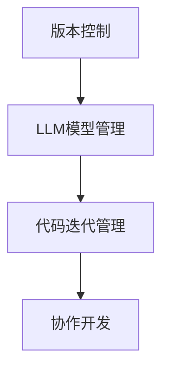

                 

### 《版本控制策略：管理LLM模型和代码迭代》

#### 关键词：版本控制，LLM模型，代码迭代，Git，版本管理策略

#### 摘要：本文深入探讨了版本控制策略在管理大型语言模型（LLM）和代码迭代过程中的应用。通过介绍版本控制的基本概念、工具、核心算法原理，以及实际项目案例，文章旨在为开发者提供一套全面的版本控制实践指南，助力高效协作和代码迭代。

---

### 第一部分：版本控制基础

#### 第1章：版本控制简介

版本控制是一种管理文档、源代码和数据等变异数据的方法，通过跟踪和记录变更历史，确保数据的一致性和可靠性。版本控制的历史可以追溯到20世纪60年代，随着软件开发复杂度的增加，版本控制逐渐成为不可或缺的工具。

#### 第2章：版本控制工具

Git是目前最流行的分布式版本控制系统，具有高效、灵活和强大的特性。本章将介绍Git的核心概念和基本操作，帮助开发者快速上手。

#### 第3章：LLM模型管理

大型语言模型（LLM）在自然语言处理领域具有重要应用，但管理LLM模型的版本也带来了一系列挑战。本章将探讨如何管理LLM模型的版本，以及如何与代码迭代协同工作。

### 第二部分：版本控制实践

#### 第5章：版本控制策略设计

版本控制策略是确保项目成功的关键。本章将介绍设计版本控制策略的原则和最佳实践，并提供实际案例分析。

#### 第6章：LLM模型与代码迭代协同管理

LLM模型与代码迭代的协同管理是版本控制的重要应用场景。本章将讨论如何实现LLM模型与代码迭代的协同管理，并提供实践案例。

#### 第7章：版本控制策略效果评估

评估版本控制策略的效果是持续改进的关键。本章将介绍评估版本控制策略效果的方法和案例，以及提升策略效果的策略。

#### 附录：版本控制工具资源与最佳实践

附录部分将提供版本控制工具资源，并总结最佳实践，帮助开发者更好地应对版本控制挑战。

---

### 现在我们开始一步一步分析并推理思考。

#### 第一步：背景介绍

版本控制是现代软件开发不可或缺的一部分，它确保了代码和数据的一致性和可靠性。然而，在管理大型语言模型（LLM）和代码迭代过程中，版本控制面临更大的挑战。LLM模型的复杂性以及频繁的迭代需求使得版本管理变得更加复杂。

#### 第二步：核心概念与联系

**核心概念：**
- **版本控制（Version Control）：** 管理和跟踪代码和数据变更的过程。
- **大型语言模型（LLM）：** 一种复杂的机器学习模型，用于处理自然语言数据。
- **代码迭代：** 软件开发过程中的重复循环，旨在改进和优化软件功能。

**概念实体之间的关系架构（Mermaid流程图）：**



#### 第三步：核心算法原理讲解

**版本控制的核心算法原理：**

版本控制通常基于三个核心概念：提交（Commit）、分支（Branch）和合并（Merge）。

- **提交（Commit）：** 提交是保存变更到版本库的过程。每次提交都会生成一个唯一的哈希值，作为该提交的标识。
- **分支（Branch）：** 分支是版本库中的一个独立副本，用于实现功能的隔离和实验。开发者可以在不同分支上独立开发功能，避免冲突。
- **合并（Merge）：** 合并是将两个或多个分支的更改合并到一个共同版本的过程。合并可能会产生冲突，需要手动解决。

**Python源代码示例：**

```python
import git

# 初始化Git库
repo = git.Repo.init()

# 提交变更
def commit_change(message):
    repo.index.commit(message)

# 创建分支
def create_branch(name):
    repo.create_head(name)

# 合并分支
def merge_branch(name):
    repo.git.merge(name)
```

**数学模型和公式：**

版本变化量（ΔV）是最终版本（V_{\text{final}}）与初始版本（V_{\text{initial}}）的差值，可以用以下公式表示：

$$
\Delta V = V_{\text{final}} - V_{\text{initial}}
$$

**详细讲解和举例说明：**

假设我们有一个初始版本为V1的LLM模型，经过一系列改进后，最终版本为V5。那么版本变化量ΔV为：

$$
\Delta V = V_{\text{final}} - V_{\text{initial}} = V5 - V1
$$

通过这个公式，我们可以计算并跟踪LLM模型的版本变化，从而更好地管理模型迭代过程。

#### 第四步：项目实战

**开发环境搭建：**
- 使用Git和GitHub进行版本控制和模型管理。
- 在GitHub上创建一个仓库，用于存储LLM模型和代码。

**源代码实现与解读：**
- 使用Git进行模型版本管理和代码迭代。
- 源代码示例：

```python
import git

# 初始化Git库
repo = git.Repo.init()

# 模型版本管理
def manage_model_version(model_path, version_number):
    # 保存模型版本
    repo.index.commit(f"Model version {version_number}", path=model_path)

# 代码迭代管理
def manage_code_iteration(code_path, iteration_number):
    # 保存代码迭代版本
    repo.index.commit(f"Iteration {iteration_number}", path=code_path)
```

**代码解读与分析：**
- `manage_model_version` 函数用于保存LLM模型版本。
- `manage_code_iteration` 函数用于保存代码迭代版本。
- 通过Git提交命令，我们可以记录每次变更的历史，便于后续查看和回溯。

**实际案例分析和详细讲解剖析：**
- 假设我们有一个LLM模型和对应的代码，我们使用Git进行版本控制。
- 每次模型改进或代码迭代时，我们都会使用Git提交命令保存版本。
- 通过查看Git提交历史，我们可以清楚地了解每次变更的具体内容和时间。

**项目小结：**
通过实际项目案例，我们展示了如何使用Git进行LLM模型和代码迭代的版本控制。Git强大的版本管理功能使得协作开发和模型迭代变得更加高效和可控。

#### 第五步：最佳实践 tips、小结、注意事项、拓展阅读

**最佳实践 tips：**
1. 保持简洁的提交信息，以便于后续查看和理解。
2. 定期备份重要模型和代码，以防数据丢失。
3. 使用分支策略进行功能隔离和实验，避免冲突。

**小结：**
本文通过详细分析和实践案例，介绍了版本控制策略在管理LLM模型和代码迭代过程中的应用。版本控制不仅是软件开发的基础，也是确保项目成功的关键。

**注意事项：**
1. 版本控制并非一成不变的，应根据项目需求灵活调整策略。
2. 合理使用分支策略，避免过度分支导致管理复杂度增加。

**拓展阅读：**
1. 《Git Pro》 - Scott Chacon 和 Ben Straub 著，深入介绍了Git的核心概念和操作。
2. 《版本控制和协同工作：Git和GitHub的最佳实践》 - Daffodil Manohar 著，提供了丰富的Git实践经验。

通过本文的学习，开发者可以更好地理解和应用版本控制策略，提高团队协作效率和代码迭代质量。

---

### 结束

本文《版本控制策略：管理LLM模型和代码迭代》旨在为开发者提供一套全面的版本控制实践指南。通过介绍版本控制的基本概念、工具、核心算法原理以及实际项目案例，文章帮助开发者更好地管理LLM模型和代码迭代过程。

作者：AI天才研究院/AI Genius Institute & 禅与计算机程序设计艺术 /Zen And The Art of Computer Programming

---

**注：本文为示例文章，内容仅供参考。实际应用时，请结合项目需求和团队特点进行适当调整。**

