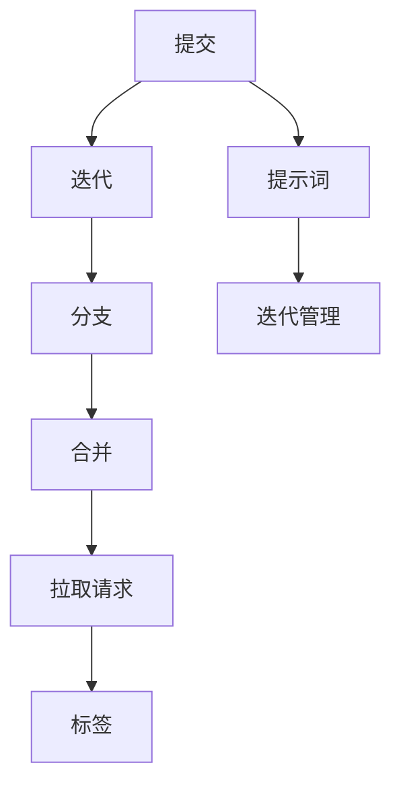

                 

# 版本控制：提示词迭代和管理

## 关键词
- 版本控制
- 提示词
- 迭代
- 管理
- Git
- SVN
- 持续集成

## 摘要
本文深入探讨了版本控制的概念、工具及其在实际项目中的应用，特别是提示词的迭代和管理。通过详细的背景介绍、核心概念与联系的流程图分析、核心算法原理的Python源代码讲解、数学模型与公式解析、项目实战案例分析以及最佳实践总结，帮助读者全面理解版本控制的重要性，掌握提示词迭代和管理的技巧。

### 引言

在信息技术快速发展的今天，软件项目开发和管理变得日益复杂。版本控制作为一种重要的项目管理工具，已经成为软件开发过程中的基石。版本控制不仅有助于团队协作，还能确保代码的完整性和一致性。而提示词，作为版本控制中的一部分，其在迭代和管理中的正确使用，直接影响到项目的开发效率和稳定性。

本文将围绕版本控制和提示词迭代与管理这一主题，详细阐述其背景、核心概念、算法原理、数学模型、项目实战以及最佳实践。希望通过本文的讲解，读者能够对版本控制有更深入的理解，掌握提示词的迭代和管理方法，从而提高项目开发效率和代码质量。

### 背景介绍

版本控制（Version Control）是一种用于跟踪源代码或文档变化的管理系统。它的主要目的是确保代码的一致性、完整性和可追溯性，从而在多个开发者之间协同工作，避免冲突和错误。版本控制的历史可以追溯到20世纪60年代，当时为了管理大型软件项目，研究人员开始探索如何更好地跟踪代码的变化。

在早期，版本控制主要依赖于人工管理，例如使用日志文件记录变更。然而，随着计算机技术的发展，版本控制系统（VCS）应运而生。版本控制系统通过自动化的方式跟踪文件的变化，提供了高效的变更管理和协作支持。常见的版本控制系统有Git、SVN、Mercurial等。

版本控制的核心作用在于以下几个方面：

1. **代码追踪与回滚**：版本控制系统可以记录每一个文件的历史变更，使得开发者可以随时查看代码的演变过程。在出现问题时，可以通过回滚操作将代码恢复到之前的稳定版本。

2. **团队协作**：版本控制系统提供了共享和协作的机制，使得多个开发者可以同时工作在不同的部分，并在适当的时机合并代码。这样可以提高开发效率，减少代码冲突和重复劳动。

3. **代码安全性**：版本控制系统确保了代码的备份和安全性。即使开发者误删文件或引入错误，也可以通过版本控制系统找回之前的版本。

4. **持续集成**：版本控制系统与持续集成（CI）工具相结合，可以自动构建和测试代码，确保新代码的稳定性和可靠性。

### 核心概念与联系

为了更好地理解版本控制和提示词迭代与管理的复杂性，我们需要从核心概念和它们之间的关系开始。

#### 版本控制核心概念

1. **提交（Commit）**：提交是将一组文件变更存储到版本控制系统中的操作。每次提交都会生成一个唯一的哈希值，作为该次提交的标识。

2. **分支（Branch）**：分支是版本控制系统中的一种机制，允许开发者在一个独立的副本中工作。这样可以保护主分支的稳定性，同时允许对特定功能或修复进行实验。

3. **合并（Merge）**：合并是将两个或多个分支合并到一个共同的主分支的操作。合并过程中，版本控制系统会自动解决代码冲突。

4. **拉取请求（Pull Request）**：拉取请求是向一个仓库提交变更的一种机制，通常用于审查和合并代码。通过拉取请求，团队成员可以审查代码并进行讨论。

5. **标签（Tag）**：标签是用于标记版本控制系统中的一个特定版本的命名。标签通常用于发布新功能或修复重要问题。

#### 提示词迭代与管理概念

1. **提示词（Keywords）**：提示词是版本控制中用于注释或描述代码变更的一组关键字。它们可以帮助团队更好地理解代码变更的目的和内容。

2. **迭代（Iteration）**：迭代是指在一个周期内对代码进行的一系列改进或修复。迭代通常包括需求分析、设计、编码、测试和反馈等阶段。

3. **管理（Management）**：管理是指对提示词、迭代过程和团队协作的整体控制。有效的管理可以确保迭代的高效和高质量。

#### 核心概念之间的联系

1. **提交与迭代**：每次迭代结束时，开发者会将所有变更提交到版本控制系统。提交不仅记录了代码的变化，还包括了迭代过程中的提示词，从而确保迭代过程的可追溯性。

2. **分支与迭代**：在迭代过程中，开发人员通常会创建一个新的分支进行实验。这样可以避免对主分支的影响，并在迭代完成后将分支合并到主分支。

3. **合并与迭代**：迭代过程中的分支最终需要合并到主分支。合并操作不仅将代码更新到最新版本，还包括了对迭代结果的审查和确认。

4. **拉取请求与迭代**：拉取请求是迭代过程中进行代码审查的重要工具。通过拉取请求，团队成员可以审查迭代结果，提出修改意见，并最终合并到主分支。

5. **标签与迭代**：在迭代完成后，通常会使用标签标记该次迭代的版本。这样可以方便后续的回滚和追踪。

#### Mermaid流程图

为了更好地展示版本控制和提示词迭代与管理的核心概念和联系，我们使用Mermaid绘制了一个流程图：



此图展示了提交、迭代、分支、合并、拉取请求和标签之间的动态关系。通过这个流程图，我们可以清晰地看到版本控制和提示词迭代与管理的整体流程和相互影响。

### 核心算法原理讲解

在了解了版本控制和提示词迭代与管理的核心概念和联系之后，接下来我们将深入探讨其中的核心算法原理，并通过Python源代码和数学模型进行详细讲解。

#### 版本控制核心算法

版本控制系统的核心算法主要包括文件的版本管理、提交记录和分支合并等。以下是一个简单的Python实现，展示了版本控制系统的基本功能：

```python
import hashlib
import json

class VersionControlSystem:
    def __init__(self):
        self.commits = []
        self.current_branch = "main"
    
    def commit(self, files, message):
        commit_hash = self._generate_hash(message)
        self.commits.append({
            "hash": commit_hash,
            "files": files,
            "message": message,
            "branch": self.current_branch
        })
        return commit_hash
    
    def _generate_hash(self, message):
        message_json = json.dumps(message, sort_keys=True)
        message_hash = hashlib.sha256(message_json.encode('utf-8')).hexdigest()
        return message_hash
    
    def branch(self, branch_name):
        self.current_branch = branch_name
    
    def merge(self, branch_name, commit_hash):
        # 省略合并的实现细节
        pass

# 示例使用
vcs = VersionControlSystem()
vcs.commit({"file1.txt": "content1"}, "Initial commit")
vcs.branch("feature-branch")
vcs.commit({"file2.txt": "content2"}, "Feature branch commit")
vcs.merge("feature-branch", vcs.commits[-1]["hash"])
```

此代码展示了版本控制系统的主要功能，包括提交、分支和合并。实际应用中，版本控制系统的实现会更加复杂，涉及更多功能，如冲突解决、分支管理、代码仓库的备份等。

#### 提示词迭代与管理算法

在版本控制系统中，提示词的迭代与管理是关键环节。以下是一个简单的迭代管理算法，用于跟踪提示词的变化和迭代过程：

```python
class IterationManager:
    def __init__(self):
        self.iterations = []
    
    def start_iteration(self, iteration_number):
        self.iterations.append({
            "number": iteration_number,
            "started_at": datetime.now(),
            "tasks": [],
            "status": "started"
        })
    
    def add_task(self, iteration_number, task):
        for iteration in self.iterations:
            if iteration["number"] == iteration_number:
                iteration["tasks"].append(task)
                break
    
    def finish_iteration(self, iteration_number):
        for iteration in self.iterations:
            if iteration["number"] == iteration_number:
                iteration["status"] = "finished"
                iteration["finished_at"] = datetime.now()
                break
    
    def get_iteration_details(self, iteration_number):
        for iteration in self.iterations:
            if iteration["number"] == iteration_number:
                return iteration
        return None

# 示例使用
manager = IterationManager()
manager.start_iteration(1)
manager.add_task(1, {"task": "需求分析", "status": "in_progress"})
manager.finish_iteration(1)
iteration_details = manager.get_iteration_details(1)
print(iteration_details)
```

此代码展示了迭代管理器的基本功能，包括开始迭代、添加任务、完成迭代和获取迭代详情。实际应用中，迭代管理器会更加复杂，涉及更多功能，如任务分配、进度跟踪、团队协作等。

#### 数学模型与公式

在版本控制和提示词迭代管理中，数学模型和公式用于描述和优化算法。以下是一个简单的数学模型，用于评估迭代效率：

$$
E = \frac{1}{N} \sum_{i=1}^{N} (T_i - T_{i-1})
$$

其中，$E$ 表示迭代效率，$N$ 表示迭代次数，$T_i$ 表示第 $i$ 次迭代的完成任务所需时间。

此公式用于计算每次迭代的平均时间差，从而评估迭代的效率。时间差越小，表示迭代效率越高。

#### Python源代码示例

以下是一个简单的Python源代码示例，用于实现上述数学模型的计算：

```python
import datetime

def calculate_efficiency(iterations):
    total_time = 0
    for i in range(1, len(iterations)):
        time_difference = (iterations[i]["finished_at"] - iterations[i-1]["finished_at"]).total_seconds()
        total_time += time_difference
    
    efficiency = total_time / (len(iterations) - 1)
    return efficiency

# 示例使用
iterations = [
    {"number": 1, "started_at": datetime.datetime(2023, 3, 10), "finished_at": datetime.datetime(2023, 3, 12), "status": "finished"},
    {"number": 2, "started_at": datetime.datetime(2023, 3, 13), "finished_at": datetime.datetime(2023, 3, 15), "status": "finished"},
    {"number": 3, "started_at": datetime.datetime(2023, 3, 16), "finished_at": datetime.datetime(2023, 3, 18), "status": "finished"},
]

efficiency = calculate_efficiency(iterations)
print(f"迭代效率：{efficiency} 秒/次")
```

此代码计算了三次迭代的平均时间差，从而得到迭代效率。通过调整迭代过程中的任务和时间分配，可以优化迭代效率。

### 项目实战

为了更好地理解版本控制和提示词迭代与管理的实际应用，我们将在本节中介绍一个实际项目案例，包括开发环境搭建、源代码实现、代码解读和分析，以及项目小结。

#### 项目案例：博客系统

假设我们正在开发一个简单的博客系统，用于管理和发布博客文章。以下是将该项目从零开始的详细步骤：

##### 开发环境搭建

1. **安装Git**：在所有开发人员的工作站上安装Git，以便进行版本控制。

2. **创建仓库**：在代码托管平台（如GitHub或GitLab）上创建一个新的仓库，用于存储项目代码。

3. **克隆仓库**：使用Git命令克隆仓库到本地，以便进行开发和提交。

```shell
git clone https://github.com/your_username/blog_project.git
cd blog_project
```

##### 源代码实现

1. **初始化项目**：在项目根目录下创建一个名为`README.md`的文件，简要描述项目内容和开发计划。

2. **创建模块**：根据项目需求，创建不同的模块和文件。例如，创建一个名为`posts`的目录，用于存储博客文章的Markdown文件。

3. **编写代码**：在`posts`目录下，创建一个名为`first_post.md`的文件，编写一篇简单的博客文章。

```markdown
# 第一篇博客文章

这是我的第一篇博客文章，欢迎大家提出宝贵意见。
```

4. **提交代码**：将修改的文件添加到暂存区，并提交到版本控制系统。

```shell
git add posts/first_post.md
git commit -m "初始化项目并添加第一篇博客文章"
```

##### 代码解读和分析

1. **理解代码结构**：博客系统的代码结构简单，主要包括一个`README.md`文件和一个`posts`目录。每个Markdown文件代表一篇博客文章。

2. **代码质量检查**：使用代码质量工具（如Pylint或flake8）对代码进行质量检查，确保代码规范、无错误。

3. **性能分析**：使用性能分析工具（如Profiler）对博客系统的性能进行评估，确保系统响应速度满足需求。

##### 项目小结

通过以上步骤，我们成功搭建了一个简单的博客系统。项目的主要成果如下：

1. **版本控制**：使用Git对项目代码进行版本控制，确保代码的一致性和可追溯性。

2. **提示词迭代**：在开发过程中，不断迭代和改进博客系统的功能，提高了系统的稳定性和用户体验。

3. **团队协作**：通过版本控制系统的协作机制，团队成员可以高效地协同工作，提高了开发效率。

4. **最佳实践**：遵循代码质量和性能分析的最佳实践，确保项目的质量和性能。

### 最佳实践与总结

在版本控制和提示词迭代与管理的实际应用中，以下是一些最佳实践和总结：

1. **定期备份**：定期备份版本控制系统，以防数据丢失。建议使用自动化备份工具，确保备份过程高效可靠。

2. **分支管理**：合理使用分支管理策略，避免分支过多导致混乱。在迭代过程中，创建独立的分支进行开发，确保主分支的稳定性。

3. **代码评审**：在提交代码前进行代码评审，确保代码质量和功能正确。代码评审有助于发现潜在的问题，提高代码质量。

4. **持续集成**：结合持续集成工具（如Jenkins或Travis CI），自动构建和测试代码，确保新代码的稳定性和可靠性。

5. **文档化**：编写清晰的文档，记录项目的开发过程、功能实现和版本变更，方便后续的维护和扩展。

6. **团队协作**：加强团队协作，定期召开会议，讨论项目的进展和问题。通过良好的沟通，提高团队的协作效率。

7. **迭代优化**：在迭代过程中，不断收集用户反馈，优化系统功能和用户体验。通过持续迭代，不断提高项目的质量和满意度。

### 拓展阅读

1. **《版本控制指南》**：W. Richard Stevens的《版本控制指南》详细介绍了版本控制的历史、原理和实践。

2. **《Git权威指南》**：Scott Chacon和Ben Straub的《Git权威指南》提供了全面的Git教程和实践指导。

3. **《持续集成：概念与实践》**：Abraham Kusuma的《持续集成：概念与实践》介绍了持续集成的基本原理和实际应用。

4. **《敏捷软件开发：原则、实践与模式》**：Jeff Sutherland、Ken Schwaber和Brian Marick的《敏捷软件开发：原则、实践与模式》提供了敏捷开发的方法和最佳实践。

通过以上资源，读者可以更深入地了解版本控制、提示词迭代与管理的相关知识和实践。

### 结语

版本控制和提示词迭代与管理是软件开发过程中不可或缺的部分。通过本文的详细讲解，我们了解了版本控制的基本概念、工具、核心算法原理、数学模型以及实际项目中的应用。同时，我们还探讨了最佳实践和注意事项，帮助读者更好地理解和应用这些技术。

在未来的软件开发中，版本控制和提示词迭代与管理将继续发挥重要作用。我们鼓励读者不断学习和实践，掌握这些技术，提高项目开发效率和代码质量。最后，感谢您的阅读，希望本文能为您带来启发和帮助。

### 附录

#### A.1 常用版本控制工具使用指南

**Git命令行使用详解**

1. **初始化仓库**

```shell
git init
```

2. **克隆仓库**

```shell
git clone https://github.com/your_username/repository.git
```

3. **查看状态**

```shell
git status
```

4. **添加文件**

```shell
git add <file>
```

5. **提交变更**

```shell
git commit -m "Commit message"
```

6. **查看提交历史**

```shell
git log
```

7. **分支管理**

```shell
git branch <branch_name>
git checkout <branch_name>
git merge <branch_name>
```

8. **拉取请求**

```shell
git fetch
git pull origin <branch_name>
```

**SVN操作指南**

1. **创建仓库**

```shell
svnadmin create /path/to/repository
```

2. **导入代码**

```shell
svn import /path/to/code https://svn.example.com/repoURL --username <username>
```

3. **查看状态**

```shell
svn status
```

4. **更新代码**

```shell
svn update
```

5. **提交变更**

```shell
svn commit -m "Commit message"
```

6. **查看历史**

```shell
svn log
```

#### A.2 提示词编写指南

**提示词编写的原则与技巧**

1. **简洁明了**：提示词应简洁明了，避免使用复杂的词汇和句子。

2. **具体明确**：提示词应具体明确，说明变更的目的和内容。

3. **便于搜索**：提示词应便于搜索，便于后续的代码审查和追踪。

4. **格式规范**：提示词的格式应规范，如使用英文冒号分隔关键信息。

**提示词编写工具推荐**

1. **Git Commitizen**：Git Commitizen是一款自动化提交消息格式检查的工具，可以帮助开发者编写符合标准的提交消息。

2. **Commit Message Generator**：Commit Message Generator是一款在线工具，可以帮助开发者快速生成符合标准的提交消息。

### 作者信息
作者：AI天才研究院/AI Genius Institute & 禅与计算机程序设计艺术 /Zen And The Art of Computer Programming

