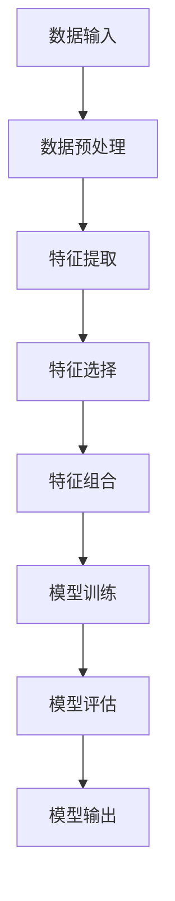

                 

### 特征工程流水线：提升LLM模型训练效率

#### 关键词：
- 特征工程
- LLM模型
- 训练效率
- 数据预处理
- 特征选择
- 特征组合

#### 摘要：
本文旨在探讨特征工程在提升大型语言模型（LLM）训练效率方面的关键作用。通过详细介绍特征工程的流程、方法和策略，本文揭示了如何通过优化数据预处理、特征选择和组合，来加速LLM模型的训练过程，提高模型的性能和泛化能力。文章首先回顾了特征工程的基本概念和重要性，随后深入讲解了数据清洗、标准化、归一化等预处理步骤，以及过滤、封装、转换等特征选择方法。接着，文章介绍了特征组合技术，包括特征交互和模型集成。最后，通过实际案例展示了特征工程在LLM模型训练中的应用，并提出了优化策略和最佳实践。本文的目标是帮助读者理解特征工程在提升LLM模型训练效率方面的作用，并为实际项目提供指导。

## 引言

在深度学习领域，尤其是自然语言处理（NLP）领域，大型语言模型（Large Language Models，简称LLM）已经成为推动技术进步的重要力量。LLM如GPT-3、BERT等模型，凭借其强大的语言理解和生成能力，在各种任务中取得了显著的成绩。然而，随着模型规模和参数数量的激增，训练LLM模型的时间和计算资源需求也随之增加。因此，如何提升LLM模型训练效率成为了一个重要且具有挑战性的问题。

### 特征工程的重要性

特征工程是提升机器学习模型性能的关键步骤之一。它涉及从原始数据中提取和构建有助于模型学习和预测的特征。在深度学习，尤其是LLM模型中，特征工程的作用尤为重要。首先，特征工程可以显著提高模型的泛化能力。通过合理的特征选择和变换，模型能够更好地适应不同数据集和任务，从而提高其在未知数据上的表现。其次，特征工程有助于减少模型训练所需的时间和计算资源。通过优化特征维度和减少冗余信息，模型可以更高效地进行训练和推理。此外，特征工程还可以帮助模型避免过拟合，提高其鲁棒性。

### LLM模型训练挑战

尽管LLM模型在NLP任务中表现出色，但训练这些模型面临着一系列挑战。首先，模型规模巨大，参数数量达到数亿甚至数十亿级别，导致训练过程需要大量的计算资源和时间。其次，LLM模型通常使用大量训练数据，这增加了数据预处理和特征工程的复杂性。此外，LLM模型容易受到数据分布偏斜和噪声的影响，导致模型过拟合和泛化能力不足。

### 目标与结构

本文的目标是探讨特征工程在提升LLM模型训练效率方面的作用，并提出相应的优化策略和最佳实践。文章结构如下：

1. **特征工程基础**：介绍特征工程的基本概念、流程和常见方法。
2. **特征选择**：讨论特征选择的重要性、方法和策略。
3. **特征组合**：介绍特征组合技术，包括特征交互和模型集成。
4. **特征工程实践**：展示特征工程在深度学习和NLP任务中的应用。
5. **LLM模型训练优化**：提出特征工程在LLM模型训练中的优化策略。

通过本文的阅读，读者将能够深入理解特征工程在提升LLM模型训练效率方面的关键作用，并获得实际应用的指导。

## 第一部分：特征工程基础

### 第1章：特征工程概述

### 1.1 特征工程的重要性

特征工程在机器学习和深度学习中扮演着至关重要的角色。它不仅决定了模型的性能，还直接影响着模型训练的效率和泛化能力。在深度学习领域，尤其是自然语言处理（NLP）中，特征工程的重要性尤为突出。

首先，特征工程有助于提高模型的泛化能力。通过从原始数据中提取和构建具有区分度的特征，模型能够更好地捕捉数据中的潜在信息，从而在面对未知数据时表现出更好的泛化性能。例如，在文本分类任务中，通过将原始文本转换为词向量或词袋模型，可以提取出文本中的语义信息，从而提升模型的分类效果。

其次，特征工程有助于减少模型训练所需的时间和计算资源。通过优化特征维度和减少冗余信息，模型可以更高效地进行训练和推理。在深度学习中，模型通常具有数十万甚至数百万个参数，这些参数需要通过大量训练数据进行优化。因此，减少冗余特征可以显著降低模型的复杂度，从而缩短训练时间和降低计算资源需求。

最后，特征工程有助于避免模型过拟合。过拟合是指模型在训练数据上表现良好，但在未知数据上表现不佳的问题。通过合理的特征选择和变换，可以减少模型对训练数据的依赖，提高其在未知数据上的泛化能力，从而避免过拟合。

### 1.2 特征工程的核心目标

特征工程的核心目标主要包括以下几个方面：

1. **提高模型预测能力**：特征工程的首要目标是提高模型的预测能力。通过提取和构建具有区分度的特征，模型可以更好地捕捉数据中的潜在信息，从而提高预测的准确性。

2. **提高模型泛化能力**：特征工程的另一个重要目标是提高模型的泛化能力。通过减少冗余特征和优化特征维度，模型可以更好地适应不同数据集和任务，从而提高其在未知数据上的表现。

3. **降低计算复杂度**：特征工程有助于减少模型训练所需的时间和计算资源。通过优化特征维度和减少冗余信息，模型可以更高效地进行训练和推理，从而降低计算复杂度。

4. **避免过拟合**：特征工程可以通过减少模型对训练数据的依赖，提高其在未知数据上的泛化能力，从而避免过拟合。过拟合是指模型在训练数据上表现良好，但在未知数据上表现不佳的问题。

### 1.3 特征工程流程

特征工程流程通常包括以下步骤：

1. **数据收集与理解**：首先，需要收集和准备用于训练的数据。数据可能来自不同的来源，如公开数据集、自定义数据集或互联网爬取。在收集数据后，需要对数据进行初步理解和探索，以了解数据的特点和分布。

2. **数据预处理**：数据预处理是特征工程的重要环节，包括数据清洗、数据标准化和数据归一化等。数据清洗旨在去除数据中的噪声和异常值，提高数据质量。数据标准化和归一化则有助于将不同特征的范围和尺度统一，以便更好地进行后续处理。

3. **特征提取与选择**：特征提取是从原始数据中提取出有助于模型学习和预测的特征。特征选择则是在提取出的特征中筛选出对模型性能有显著贡献的特征，以减少冗余信息和提高模型泛化能力。

4. **特征组合与变换**：特征组合是将多个特征结合起来，以生成新的特征，从而提高模型的性能。特征变换则是通过将原始特征转换为新的形式，如离散化、编码或归一化，以提高模型的鲁棒性和泛化能力。

5. **模型训练与验证**：在完成特征工程后，将特征输入到模型中进行训练和验证。通过调整模型参数和优化策略，以提高模型的性能和泛化能力。

### 1.4 特征工程挑战

尽管特征工程在提升模型性能方面具有重要意义，但在实际应用中仍然面临着一系列挑战：

1. **数据质量与可用性**：特征工程依赖于高质量的数据。然而，在实际应用中，数据质量往往参差不齐，存在噪声、异常值和缺失值等问题。此外，数据的可用性也是一个挑战，尤其是在需要大量训练数据的情况下。

2. **特征维度与计算复杂度**：特征维度是影响模型性能和计算复杂度的关键因素。过高的特征维度会导致模型过拟合和计算复杂度增加，而过低的特征维度则可能导致模型性能下降。

3. **特征工程的专业知识与技能**：特征工程需要具备一定的专业知识和技能。在实际应用中，特征工程往往需要结合具体任务和数据的特点，进行灵活调整和优化。

4. **模型与特征的适配性**：不同的模型对特征的要求不同。特征工程需要根据模型的特性，选择合适的特征提取和选择方法，以提高模型的性能。

### 总结

特征工程在提升LLM模型训练效率方面具有重要作用。通过优化数据预处理、特征选择和组合，可以显著提高模型的性能和泛化能力，从而加速模型训练过程。在实际应用中，特征工程需要结合具体任务和数据的特点，进行灵活调整和优化。本文后续章节将详细探讨特征工程的具体方法和策略。

## 第2章：特征预处理

### 2.1 数据清洗

数据清洗是特征工程的重要步骤之一，其目的是去除数据中的噪声、异常值和缺失值，提高数据质量，为后续的特征提取和选择打下坚实基础。数据清洗通常包括以下几个方面：

#### 缺失值处理

缺失值处理是数据清洗的核心任务之一。常见的缺失值处理方法包括以下几种：

1. **删除缺失值**：直接删除含有缺失值的样本，适用于缺失值比例较低的情况。这种方法简单有效，但可能导致大量数据丢失。

2. **填充缺失值**：使用统计方法或基于模型的预测方法填充缺失值。常见的填充方法包括：
   - **平均值、中位数或众数填充**：适用于数值型特征，通过计算特征的平均值、中位数或众数来填充缺失值。
   - **插值法**：适用于时间序列数据，通过线性或高阶插值方法填补缺失值。
   - **基于模型的预测**：使用机器学习模型预测缺失值，如回归模型、决策树等。

#### 异常值处理

异常值处理旨在识别和去除数据中的异常值，以避免对模型训练和预测的干扰。常见的异常值处理方法包括：

1. **标准差法**：基于特征的统计分布，将落在一定范围之外的值视为异常值并进行处理。具体来说，如果一个特征的值落在平均值的k倍标准差范围内（如±3倍标准差），则认为该值是合理的；否则，视为异常值。

2. **孤立森林法**：利用随机森林模型，通过计算每个样本的异常度分数，将异常度较高的样本识别出来并进行处理。

3. **箱线图法**：使用箱线图（Box Plot）识别异常值。箱线图中的上 whisker 和下 whisker 分别代表第三四分位数和第一四分位数，异常值通常定义为高于上 whisker 或低于下 whisker 的值。

4. **基于规则的方法**：根据领域知识或经验，定义特定的规则来识别和处理异常值。

#### 重复数据处理

重复数据处理旨在去除数据中的重复样本，以避免对模型训练和预测的干扰。常见的重复数据处理方法包括：

1. **基于哈希的方法**：通过计算样本的哈希值，识别出重复的样本并进行删除。

2. **基于索引的方法**：根据样本的索引或唯一标识，识别出重复的样本并进行删除。

### 示例代码

以下是一个简单的Python代码示例，展示如何进行缺失值处理、异常值处理和重复数据处理：

```python
import pandas as pd
from sklearn.impute import SimpleImputer
from sklearn.ensemble import IsolationForest

# 加载数据
data = pd.read_csv('data.csv')

# 缺失值处理
# 对于数值型特征，使用平均值填充缺失值
num_imputer = SimpleImputer(strategy='mean')
data[numerical_features] = num_imputer.fit_transform(data[numerical_features])

# 对于类别型特征，使用最频繁的值填充缺失值
cat_imputer = SimpleImputer(strategy='most_frequent')
data[categorical_features] = cat_imputer.fit_transform(data[categorical_features])

# 异常值处理
iso_forest = IsolationForest(contamination=0.1)
outliers = iso_forest.fit_predict(data[numerical_features])
data = data[outliers != -1]

# 重复数据处理
data = data.drop_duplicates()

# 输出清洗后的数据
data.to_csv('cleaned_data.csv', index=False)
```

通过上述步骤，我们可以显著提高数据质量，为后续的特征提取和选择打下坚实基础。在实际应用中，数据清洗的过程可能更加复杂，需要根据具体任务和数据的特点进行灵活调整。

### 2.2 数据标准化

数据标准化是将不同特征的范围和尺度统一，以便更好地进行后续的特征处理和分析。在深度学习中，特别是当特征具有不同的量纲和范围时，数据标准化尤为重要。常见的数据标准化方法包括最小-最大标准化和Z-score标准化。

#### 最小-最大标准化

最小-最大标准化方法通过将特征映射到[0, 1]区间，实现特征的缩放。具体公式如下：

$$ x_{\text{标准化}} = \frac{x - x_{\text{最小值}}}{x_{\text{最大值}} - x_{\text{最小值}}} $$

其中，$x_{\text{最小值}}$和$x_{\text{最大值}}$分别表示特征的当前值和最大值。

#### Z-score标准化

Z-score标准化方法通过计算特征值的均值和标准差，将特征值转换为标准正态分布。具体公式如下：

$$ x_{\text{标准化}} = \frac{x - \mu}{\sigma} $$

其中，$\mu$和$\sigma$分别表示特征的均值和标准差。

#### Python实现

以下是一个简单的Python代码示例，展示如何进行数据标准化：

```python
import pandas as pd
from sklearn.preprocessing import MinMaxScaler, StandardScaler

# 加载数据
data = pd.read_csv('data.csv')

# 数值型特征的最小-最大标准化
min_max_scaler = MinMaxScaler()
data[numerical_features] = min_max_scaler.fit_transform(data[numerical_features])

# 数值型特征的Z-score标准化
standard_scaler = StandardScaler()
data[numerical_features] = standard_scaler.fit_transform(data[numerical_features])

# 输出标准化后的数据
data.to_csv('standardized_data.csv', index=False)
```

通过数据标准化，我们可以确保不同特征在相同的尺度上进行处理，从而提高模型训练的效果和效率。在实际应用中，数据标准化可以根据具体任务和特征的特点进行灵活调整。

### 2.3 数据归一化

数据归一化是将特征的值缩放到相同的范围，以便更好地进行比较和分析。与数据标准化不同，数据归一化不依赖于特征的分布和统计特性。常见的数据归一化方法包括最小-最大归一化和Z-score归一化。

#### 最小-最大归一化

最小-最大归一化方法将特征映射到[0, 1]区间，具体公式如下：

$$ x_{\text{归一化}} = \frac{x - x_{\text{最小值}}}{x_{\text{最大值}} - x_{\text{最小值}}} $$

#### Z-score归一化

Z-score归一化方法通过计算特征值的均值和标准差，将特征值转换为标准正态分布，具体公式如下：

$$ x_{\text{归一化}} = \frac{x - \mu}{\sigma} $$

#### Python实现

以下是一个简单的Python代码示例，展示如何进行数据归一化：

```python
import pandas as pd
from sklearn.preprocessing import MinMaxScaler, StandardScaler

# 加载数据
data = pd.read_csv('data.csv')

# 数值型特征的最小-最大归一化
min_max_scaler = MinMaxScaler()
data[numerical_features] = min_max_scaler.fit_transform(data[numerical_features])

# 数值型特征的Z-score归一化
standard_scaler = StandardScaler()
data[numerical_features] = standard_scaler.fit_transform(data[numerical_features])

# 输出归一化后的数据
data.to_csv('normalized_data.csv', index=False)
```

通过数据归一化，我们可以确保不同特征在相同的尺度上进行处理，从而提高模型训练的效果和效率。在实际应用中，数据归一化可以根据具体任务和特征的特点进行灵活调整。

### 总结

数据预处理是特征工程中至关重要的一步，包括数据清洗、数据标准化和数据归一化。通过清洗数据，我们可以去除噪声和异常值，提高数据质量；通过标准化和归一化，我们可以确保特征在同一尺度上进行处理，从而提高模型训练的效果和效率。在实际应用中，根据任务和数据的特性，可以选择合适的预处理方法进行灵活调整。本文接下来将介绍特征选择的方法和策略。

## 第3章：特征选择

### 3.1 基于过滤的方法

基于过滤的特征选择方法是一种简单且广泛使用的特征选择技术。其基本思想是通过评估每个特征对模型性能的影响，从而选择对模型性能有显著贡献的特征。基于过滤的方法通常包括以下几种：

#### 单变量特征选择

单变量特征选择是一种简单的特征选择方法，通过评估每个特征与目标变量之间的相关性来确定特征的重要性。常见的方法包括：

1. **皮尔逊相关系数**：通过计算特征与目标变量之间的皮尔逊相关系数来评估特征的重要性。相关系数的绝对值越大，表明特征与目标变量的相关性越强。

2. **斯皮尔曼等级相关系数**：适用于非线性关系的特征与目标变量之间的相关性评估。

3. **互信息**：互信息是一种更复杂的特征与目标变量之间的相关性度量，可以捕捉特征与目标变量之间的复杂关系。

#### 递归特征消除（RFE）

递归特征消除（Recursive Feature Elimination，RFE）是一种基于模型的特征选择方法。其基本思想是使用一个基础模型（如线性回归、决策树等），通过迭代过程逐步消除对模型性能贡献较小的特征。具体步骤如下：

1. **训练基础模型**：首先使用训练集数据训练一个基础模型，并计算每个特征对模型的重要性。

2. **排序特征**：根据特征的重要性对特征进行排序。

3. **递归消除特征**：从最不重要的特征开始，逐步消除特征，直到达到预定的特征数量或模型性能开始下降。

#### 基于模型的特征选择

基于模型的特征选择方法通过训练一个基础模型来评估特征的重要性。常见的方法包括：

1. **主成分分析（PCA）**：通过线性变换将原始特征投影到新的空间中，新的特征是原始特征的线性组合，且新特征之间的相关性较小。PCA可以用于降维和特征选择。

2. **随机森林特征重要性**：随机森林算法通过训练多个决策树，并计算每个特征在树中的重要性。重要性较高的特征被认为对模型性能有显著贡献。

### 3.2 基于封装的方法

基于封装的特征选择方法是一种更为复杂的特征选择技术，其核心思想是通过构建一个优化模型来同时进行特征选择和模型训练。基于封装的方法通常包括以下几种：

#### 递归特征优化（RFO）

递归特征优化（Recursive Feature Optimization，RFO）是一种基于封装的特征选择方法。其基本思想是通过迭代过程逐步优化特征子集。具体步骤如下：

1. **训练基础模型**：使用当前特征子集训练一个基础模型，并计算每个特征对模型的重要性。

2. **优化特征子集**：根据特征重要性，选择对模型性能贡献最大的特征进行优化。优化过程可能涉及特征组合、特征变换等。

3. **迭代**：重复上述步骤，逐步优化特征子集，直到达到预定的特征数量或模型性能不再提升。

#### 基于模型的优化

基于模型的优化方法通过构建一个优化模型来同时进行特征选择和模型训练。常见的方法包括：

1. **集成选择模型（IGS）**：IGS通过构建多个基础模型（如随机森林、支持向量机等），并计算每个特征的集成重要性。集成重要性较高的特征被认为对模型性能有显著贡献。

2. **特征变换优化（FTO）**：FTO通过优化特征变换（如正则化、归一化等）来提高模型性能。优化过程通常涉及多个迭代，以找到最佳的变换策略。

### 3.3 基于转换的方法

基于转换的特征选择方法通过将原始特征转换为新的特征来提高模型性能。这种方法通常涉及数据预处理、特征提取和组合。常见的方法包括：

#### 主成分分析（PCA）

主成分分析（Principal Component Analysis，PCA）是一种常用的特征选择和降维方法。PCA通过线性变换将原始特征投影到新的空间中，新的特征是原始特征的线性组合，且新特征之间的相关性较小。具体步骤如下：

1. **计算协方差矩阵**：计算原始特征之间的协方差矩阵。

2. **计算特征值和特征向量**：对协方差矩阵进行特征分解，得到特征值和特征向量。

3. **选择主成分**：根据特征值选择前几个特征向量，构成新的特征空间。

#### 自动化特征组合

自动化特征组合通过组合多个特征来生成新的特征，从而提高模型性能。常见的方法包括：

1. **交互特征**：通过将多个特征进行乘积、加和等操作，生成新的特征。

2. **特征嵌入**：使用神经网络等模型将原始特征映射到新的特征空间。

3. **特征选择和组合**：结合特征选择方法（如主成分分析、随机森林等），对特征组合进行优化。

### 总结

特征选择是提升模型性能的关键步骤之一。基于过滤的方法、基于封装的方法和基于转换的方法各有优缺点，适用于不同的场景和任务。在实际应用中，可以根据具体任务和数据的特点，选择合适的特征选择方法进行灵活调整。本文接下来将介绍特征变换的方法。

### 3.4 特征变换

特征变换是特征工程中的一个重要环节，其主要目的是通过将原始特征转换为新的特征，来提高模型的性能和泛化能力。特征变换的方法多种多样，包括数据离散化、数据编码和数据归一化等。

#### 数据离散化

数据离散化是将连续特征转换为类别特征的过程，其目的是降低特征维度，减少模型训练的复杂度，同时提高模型的泛化能力。常见的离散化方法包括：

1. **分箱法（Binning）**：将连续特征分为多个区间，每个区间对应一个类别。分箱法可以根据数据分布和业务需求进行调整，以优化模型性能。

2. **最近邻法（K-Nearest Neighbors，KNN）**：基于最近邻算法，将连续特征转换为类别特征。通过计算样本与其最近邻之间的距离，将样本分类到最近的类别。

3. **聚类法（Clustering）**：通过聚类算法（如K-means、层次聚类等）将连续特征划分为多个类别。聚类法可以根据数据分布自动生成类别，但可能需要调整聚类参数以达到最佳效果。

#### 数据编码

数据编码是将不同类型的数据转换为统一格式的过程，以便进行后续的特征处理和分析。常见的编码方法包括：

1. **独热编码（One-Hot Encoding）**：将类别特征转换为二进制向量，每个类别对应一个维度。独热编码适用于离散类别特征，但可能导致特征维度大幅增加。

2. **标签编码（Label Encoding）**：将类别特征转换为整数标签，不同类别对应不同的整数。标签编码适用于有序类别特征，但可能导致数据分布不均。

3. **基数编码（Base Encoding）**：将类别特征转换为基数编码，如二进制、十六进制等。基数编码可以减少特征维度，但可能需要额外的预处理步骤。

#### 数据归一化

数据归一化是将不同特征的范围和尺度统一的过程，以便更好地进行后续的特征处理和分析。常见的归一化方法包括：

1. **最小-最大标准化（Min-Max Scaling）**：将特征映射到[0, 1]区间，具体公式如下：

   $$ x_{\text{标准化}} = \frac{x - x_{\text{最小值}}}{x_{\text{最大值}} - x_{\text{最小值}}} $$

2. **Z-score标准化（Z-Score Scaling）**：将特征映射到标准正态分布，具体公式如下：

   $$ x_{\text{标准化}} = \frac{x - \mu}{\sigma} $$

3. **岭回归标准化（Ridge Scaling）**：通过岭回归模型将特征映射到新的空间，以减少特征之间的相关性。岭回归标准化适用于特征之间具有强相关性的情况。

#### Python实现

以下是一个简单的Python代码示例，展示如何进行特征变换：

```python
import pandas as pd
from sklearn.preprocessing import MinMaxScaler, StandardScaler, OneHotEncoder
from sklearn.compose import ColumnTransformer
from sklearn.pipeline import Pipeline

# 加载数据
data = pd.read_csv('data.csv')

# 确定需要变换的特征
categorical_features = ['feature1', 'feature2']
numerical_features = ['feature3', 'feature4']

# 创建特征变换器
categorical_transformer = Pipeline(steps=[
    ('onehot', OneHotEncoder(handle_unknown='ignore'))
])

numerical_transformer = Pipeline(steps=[
    ('scaler', StandardScaler())
])

# 创建特征工程流水线
preprocessor = ColumnTransformer(
    transformers=[
        ('num', numerical_transformer, numerical_features),
        ('cat', categorical_transformer, categorical_features)
    ])

# 应用特征变换
data_processed = preprocessor.fit_transform(data)

# 输出变换后的数据
data_processed = pd.DataFrame(data_processed, columns=preprocessor.get_feature_names_out())
data_processed.to_csv('processed_data.csv', index=False)
```

通过上述步骤，我们可以对原始数据进行有效的特征变换，为后续的模型训练和预测打下坚实基础。在实际应用中，特征变换可以根据具体任务和数据的特点进行灵活调整。

## 第4章：特征组合

### 4.1 特征交互

特征交互是通过组合多个特征来生成新的特征，以提升模型的性能和泛化能力。特征交互可以有效捕捉特征之间的潜在关系，从而提高模型的预测能力。常见的方法包括以下几种：

#### 线性组合

线性组合是最简单的特征交互方法，通过将多个特征进行线性组合来生成新的特征。具体方法如下：

$$
x_{\text{new}} = a_1 \cdot x_1 + a_2 \cdot x_2 + \ldots + a_n \cdot x_n
$$

其中，$x_1, x_2, \ldots, x_n$为原始特征，$a_1, a_2, \ldots, a_n$为权重系数。

#### 多项式组合

多项式组合是通过将特征进行多项式运算来生成新的特征。例如，对于两个特征$x_1$和$x_2$，可以生成以下多项式特征：

$$
x_{\text{new}} = x_1^2 + x_2^2, \quad x_{\text{new}} = x_1 \cdot x_2
$$

#### 高斯过程回归（Gaussian Process Regression）

高斯过程回归是一种基于贝叶斯推理的非线性特征交互方法。通过高斯过程模型，可以自动寻找特征之间的最佳非线性组合方式，从而提高模型的预测性能。

### 4.2 基于特征的模型集成

基于特征的模型集成是通过组合多个特征对应的模型来生成新的特征，从而提升模型的性能和泛化能力。常见的方法包括以下几种：

#### 特征加权模型集成

特征加权模型集成是通过为每个特征赋予不同的权重，将多个模型进行集成。具体方法如下：

$$
\hat{y} = w_1 \cdot \hat{y}_1 + w_2 \cdot \hat{y}_2 + \ldots + w_n \cdot \hat{y}_n
$$

其中，$w_1, w_2, \ldots, w_n$为权重系数，$\hat{y}_1, \hat{y}_2, \ldots, \hat{y}_n$为各个模型对目标变量的预测值。

#### 特征选择模型集成

特征选择模型集成是通过选择对模型性能有显著贡献的特征，进行模型集成。常见的方法包括：

1. **Lasso特征选择**：通过Lasso回归模型选择特征，并将选择出的特征进行模型集成。

2. **随机森林特征选择**：通过随机森林模型选择特征，并将选择出的特征进行模型集成。

### 4.3 特征选择与组合的优化方法

特征选择与组合的优化方法旨在通过优化特征选择和组合过程，提高模型的性能和泛化能力。常见的方法包括以下几种：

#### 基于贪心策略的优化

基于贪心策略的优化方法通过逐步选择对模型性能有显著贡献的特征，进行组合。常见的方法包括：

1. **递归特征消除（RFE）**：通过递归消除对模型性能贡献较小的特征，逐步优化特征子集。

2. **贪心特征选择**：通过逐个选择对模型性能有显著提升的特征，进行组合。

#### 基于遗传算法的优化

基于遗传算法的优化方法通过模拟生物进化过程，进行特征选择和组合的优化。具体方法如下：

1. **初始化种群**：生成一组随机特征子集作为初始种群。

2. **适应度函数**：定义适应度函数，用于评估特征子集的优劣。

3. **选择、交叉和变异**：通过选择、交叉和变异操作，生成新一代种群，并重复适应度函数评估，直到达到预定的迭代次数或适应度阈值。

#### 基于贝叶斯优化的优化

基于贝叶斯优化的优化方法通过模拟贝叶斯推理过程，进行特征选择和组合的优化。具体方法如下：

1. **先验分布**：定义特征选择和组合的先验分布。

2. **后验分布**：通过采集样本数据，更新特征选择和组合的后验分布。

3. **采样和优化**：通过从后验分布中采样，选择最优的特征子集和组合方式。

### 总结

特征组合是提升模型性能的重要手段之一。通过特征交互和模型集成，可以捕捉特征之间的潜在关系，从而提高模型的预测能力和泛化能力。同时，通过优化特征选择和组合过程，可以进一步提高模型的性能和效率。在实际应用中，可以根据具体任务和数据的特点，选择合适的特征组合方法进行优化。

## 第5章：特征工程在深度学习中的应用

### 5.1 特征工程与神经网络

特征工程在深度学习中的应用至关重要，尤其是在神经网络的训练过程中。神经网络通过层层递进的神经单元（神经元）来学习数据中的特征和模式，从而实现对复杂问题的建模和预测。以下是特征工程在神经网络中的应用：

#### 特征提取

特征提取是神经网络训练前的关键步骤，其目的是从原始数据中提取出对模型性能有显著贡献的特征。常见的方法包括：

1. **自动特征提取**：使用神经网络（如卷积神经网络（CNN）、循环神经网络（RNN）等）自动从数据中提取特征。这种方法通过多层神经网络的结构，能够自动学习数据中的复杂模式和特征。

2. **人工特征提取**：根据领域知识和经验，手动设计特征。这种方法适用于已有较强理论基础和先验知识的任务，如文本分类和图像识别等。

#### 特征选择

特征选择是减少特征维度、提高模型泛化能力的重要手段。在神经网络中，特征选择可以通过以下方法实现：

1. **基于模型的特征选择**：使用神经网络训练过程中获得的权重信息，选择对模型性能有显著贡献的特征。

2. **基于交叉验证的特征选择**：通过交叉验证方法，选择在多个子集上表现良好的特征。

3. **基于统计的特征选择**：使用统计学方法（如相关性分析、互信息等）选择对模型性能有显著贡献的特征。

#### 特征组合

特征组合是将多个特征组合成一个新的特征，以提升模型的性能。在神经网络中，特征组合可以通过以下方法实现：

1. **线性组合**：通过线性组合多个特征，生成新的特征。例如，对于图像数据，可以组合像素值和边缘检测特征。

2. **非线性组合**：通过非线性函数（如激活函数）组合多个特征，生成新的特征。例如，在深度神经网络中，可以使用ReLU函数将多个特征组合。

### 5.2 特征工程与循环神经网络（RNN）

循环神经网络（RNN）是一种适用于序列数据建模的神经网络，其通过内存单元（如隐藏状态）来捕捉序列中的长期依赖关系。特征工程在RNN中的应用包括以下几个方面：

#### 序列预处理

序列预处理是RNN训练前的关键步骤，其目的是将原始序列数据转换为适合输入RNN的特征表示。常见的方法包括：

1. **序列编码**：将序列中的每个元素编码为向量。常见的方法包括词嵌入（word embeddings）和字符嵌入（character embeddings）。

2. **序列填充**：对序列长度不同的数据进行填充，使其具有相同的长度。常见的方法包括 padding 和循环填充。

#### 序列特征提取

序列特征提取是通过从序列数据中提取具有区分度的特征，以提升模型性能。常见的方法包括：

1. **窗口特征提取**：从序列中提取固定长度的窗口特征。例如，在文本分类任务中，可以使用 n-gram 特征。

2. **卷积神经网络（CNN）特征提取**：使用卷积神经网络从序列数据中提取特征。这种方法适用于捕捉序列中的局部模式和依赖关系。

#### 序列特征组合

序列特征组合是将多个序列特征组合成一个新的特征，以提升模型性能。常见的方法包括：

1. **叠加组合**：将多个序列特征进行叠加，生成新的特征。例如，在语音识别任务中，可以叠加声学特征和语言特征。

2. **融合组合**：使用融合方法（如注意力机制）将多个序列特征组合成一个新的特征。这种方法能够更好地捕捉序列中的长期依赖关系。

### 5.3 特征工程与变换器网络（Transformer）

变换器网络（Transformer）是一种基于自注意力机制的神经网络，其在自然语言处理任务中表现出色。特征工程在Transformer中的应用包括以下几个方面：

#### 词嵌入

词嵌入是将单词映射为向量表示的过程，其目的是捕捉单词之间的语义关系。常见的方法包括：

1. **静态词嵌入**：使用预训练的词嵌入模型（如 Word2Vec、GloVe 等）对单词进行嵌入。

2. **动态词嵌入**：在训练过程中，通过神经网络动态生成词嵌入。

#### 序列特征提取

序列特征提取是通过从序列数据中提取具有区分度的特征，以提升模型性能。常见的方法包括：

1. **自注意力机制**：通过自注意力机制，对序列中的每个元素赋予不同的权重，从而捕捉序列中的长期依赖关系。

2. **位置编码**：为序列中的每个元素添加位置信息，以捕捉序列中的顺序关系。

#### 序列特征组合

序列特征组合是将多个序列特征组合成一个新的特征，以提升模型性能。常见的方法包括：

1. **多头自注意力**：通过多头自注意力机制，将多个序列特征组合成一个新的特征。

2. **交叉注意力**：通过交叉注意力机制，将序列中的特征与其他序列的特征进行组合。

### 总结

特征工程在深度学习中的应用至关重要，尤其是在神经网络、循环神经网络和变换器网络中。通过特征提取、特征选择和特征组合，可以显著提升模型的性能和泛化能力。在实际应用中，根据具体任务和数据的特点，可以选择合适的特征工程方法进行优化。

### 第6章：特征工程流水线搭建

#### 6.1 特征工程流水线框架

特征工程流水线是自动化特征工程过程的一种方法，其核心目标是将特征工程步骤串联成一个连续的、可重复的流程，以提高模型训练的效率和可维护性。特征工程流水线通常包括以下几个关键组件：

1. **数据输入**：提供用于训练和验证的特征数据。
2. **数据预处理**：对输入数据进行清洗、标准化和归一化等预处理操作，以提高数据质量和一致性。
3. **特征提取**：从原始数据中提取有助于模型训练和预测的特征。
4. **特征选择**：选择对模型性能有显著贡献的特征，以减少冗余信息和提升模型泛化能力。
5. **特征组合**：将多个特征组合成新的特征，以提升模型性能。
6. **模型训练**：使用提取和选择出的特征对模型进行训练。
7. **模型评估**：对训练好的模型进行评估，以验证其性能和泛化能力。
8. **模型输出**：输出训练好的模型和预测结果。

以下是一个简单的Mermaid流程图，展示特征工程流水线的整体框架：



#### 6.2 实践案例：特征工程流水线在NLP任务中的应用

特征工程流水线在自然语言处理（NLP）任务中的应用非常广泛，以下是一个具体案例，展示如何搭建一个特征工程流水线，用于文本分类任务。

**案例背景**：假设我们需要对新闻文章进行分类，将其划分为多个主题类别。原始数据集包含大量新闻文章及其对应的标签。

**步骤 1：数据输入**  
首先，我们需要加载和预处理文本数据。这一步骤包括：

- **数据加载**：使用 Pandas 等库加载新闻文章及其标签。
- **数据清洗**：去除文本中的 HTML 标签、特殊字符和停用词，以减少噪声。

```python
import pandas as pd
from bs4 import BeautifulSoup

# 加载数据
data = pd.read_csv('news_data.csv')

# 清洗文本
def clean_text(text):
    soup = BeautifulSoup(text, 'lxml')
    return soup.get_text()

data['cleaned_text'] = data['text'].apply(clean_text)
```

**步骤 2：数据预处理**  
接下来，我们需要对文本数据执行数据预处理操作，以提高数据质量：

- **分词**：将文本分解为单词或词组。
- **词嵌入**：将每个词转换为向量表示。

```python
from sklearn.feature_extraction.text import TfidfVectorizer

# 分词和词嵌入
vectorizer = TfidfVectorizer(ngram_range=(1, 2), max_features=10000)
X = vectorizer.fit_transform(data['cleaned_text'])
y = data['label']
```

**步骤 3：特征提取**  
在这一步，我们可以使用各种特征提取技术，如词袋模型、TF-IDF 等。以下是使用 TF-IDF 进行特征提取：

```python
from sklearn.feature_extraction.text import TfidfVectorizer

# 特征提取
vectorizer = TfidfVectorizer(ngram_range=(1, 2), max_features=10000)
X = vectorizer.fit_transform(data['cleaned_text'])
```

**步骤 4：特征选择**  
特征选择旨在从提取出的特征中筛选出对模型性能有显著贡献的特征：

- **过滤法**：基于特征的相关性、信息增益等，选择具有较高区分度的特征。
- **包裹法**：结合模型训练，选择对模型性能有显著提升的特征子集。

```python
from sklearn.feature_selection import SelectKBest, f_classif

# 特征选择
selector = SelectKBest(f_classif, k=5000)
X_new = selector.fit_transform(X, y)
```

**步骤 5：特征组合**  
特征组合是将多个特征组合成新的特征，以提升模型性能。例如，可以组合词袋模型和 TF-IDF 特征：

```python
# 特征组合
X_combined = np.hstack((X.toarray(), X_new.toarray()))
```

**步骤 6：模型训练**  
使用特征工程流水线中的特征对模型进行训练：

- **选择合适的模型**：如随机森林、支持向量机等。
- **训练模型**：使用特征和标签训练模型。

```python
from sklearn.ensemble import RandomForestClassifier

# 模型训练
model = RandomForestClassifier(n_estimators=100)
model.fit(X_combined, y)
```

**步骤 7：模型评估**  
对训练好的模型进行评估，以验证其性能和泛化能力：

- **交叉验证**：使用交叉验证方法评估模型性能。
- **测试集评估**：使用测试集评估模型性能。

```python
from sklearn.model_selection import cross_val_score

# 模型评估
scores = cross_val_score(model, X_combined, y, cv=5)
print("Cross-Validation Scores:", scores)
```

**步骤 8：模型输出**  
输出训练好的模型和预测结果：

- **模型保存**：将训练好的模型保存为文件，以便后续使用。
- **预测新数据**：使用训练好的模型对新的数据进行预测。

```python
import joblib

# 模型保存
joblib.dump(model, 'text_classifier_model.pkl')

# 预测新数据
new_data = ["This is a new article about technology."]
new_data_cleaned = [clean_text(text) for text in new_data]
X_new = vectorizer.transform(new_data_cleaned)
predictions = model.predict(X_new)
print("Predictions:", predictions)
```

通过以上步骤，我们成功搭建了一个特征工程流水线，并在NLP任务中进行了应用。特征工程流水线的搭建和优化对于提高模型性能和训练效率具有重要意义。

### 6.3 特征工程流水线在计算机视觉中的应用

特征工程流水线在计算机视觉任务中的应用同样重要。以下是一个具体的案例，展示如何搭建一个特征工程流水线，用于图像分类任务。

**案例背景**：假设我们需要对大量图像进行分类，将其划分为不同的类别。原始数据集包含大量图像及其对应的标签。

**步骤 1：数据输入**  
首先，我们需要加载和预处理图像数据。这一步骤包括：

- **数据加载**：使用 Pandas 等库加载图像数据及其标签。
- **数据清洗**：去除图像数据中的噪声和异常值。

```python
import pandas as pd

# 加载数据
data = pd.read_csv('image_data.csv')
```

**步骤 2：图像预处理**  
接下来，我们需要对图像数据进行预处理，以提高数据质量：

- **尺寸调整**：将所有图像调整为相同尺寸，以适应深度学习模型的要求。
- **归一化**：将图像像素值归一化到[0, 1]区间。

```python
from PIL import Image

# 尺寸调整和归一化
def preprocess_image(image_path):
    image = Image.open(image_path)
    image = image.resize((224, 224))
    image = np.array(image) / 255.0
    return image

data['preprocessed_image'] = data['image_path'].apply(preprocess_image)
```

**步骤 3：特征提取**  
在这一步，我们可以使用各种特征提取技术，如卷积神经网络（CNN）：

```python
from tensorflow.keras.applications.vgg16 import VGG16

# 特征提取
model = VGG16(weights='imagenet', include_top=False)
feature_extractor = Model(inputs=model.input, outputs=model.get_layer('block5_conv3').output)
X = feature_extractor.predict(data['preprocessed_image'])
```

**步骤 4：特征选择**  
特征选择旨在从提取出的特征中筛选出对模型性能有显著贡献的特征：

- **过滤法**：基于特征的相关性、信息增益等，选择具有较高区分度的特征。
- **包裹法**：结合模型训练，选择对模型性能有显著提升的特征子集。

```python
from sklearn.feature_selection import SelectKBest, f_classif

# 特征选择
selector = SelectKBest(f_classif, k=5000)
X_new = selector.fit_transform(X, y)
```

**步骤 5：特征组合**  
特征组合是将多个特征组合成新的特征，以提升模型性能。例如，可以组合 CNN 特征和传统特征：

```python
# 特征组合
X_combined = np.hstack((X.toarray(), X_new.toarray()))
```

**步骤 6：模型训练**  
使用特征工程流水线中的特征对模型进行训练：

- **选择合适的模型**：如卷积神经网络（CNN）、支持向量机（SVM）等。
- **训练模型**：使用特征和标签训练模型。

```python
from tensorflow.keras.models import Sequential
from tensorflow.keras.layers import Dense, Conv2D, Flatten, MaxPooling2D

# 模型训练
model = Sequential()
model.add(Conv2D(32, (3, 3), activation='relu', input_shape=(224, 224, 3)))
model.add(MaxPooling2D((2, 2)))
model.add(Flatten())
model.add(Dense(128, activation='relu'))
model.add(Dense(num_classes, activation='softmax'))
model.compile(optimizer='adam', loss='categorical_crossentropy', metrics=['accuracy'])
model.fit(X_combined, y, epochs=10, batch_size=32)
```

**步骤 7：模型评估**  
对训练好的模型进行评估，以验证其性能和泛化能力：

- **交叉验证**：使用交叉验证方法评估模型性能。
- **测试集评估**：使用测试集评估模型性能。

```python
from sklearn.model_selection import cross_val_score

# 模型评估
scores = cross_val_score(model, X_combined, y, cv=5)
print("Cross-Validation Scores:", scores)
```

**步骤 8：模型输出**  
输出训练好的模型和预测结果：

- **模型保存**：将训练好的模型保存为文件，以便后续使用。
- **预测新数据**：使用训练好的模型对新的数据进行预测。

```python
import joblib

# 模型保存
joblib.dump(model, 'image_classifier_model.pkl')

# 预测新数据
new_images = ["new_image.jpg"]
new_images_preprocessed = [preprocess_image(image_path) for image_path in new_images]
X_new = feature_extractor.predict(new_images_preprocessed)
predictions = model.predict(X_new)
print("Predictions:", predictions)
```

通过以上步骤，我们成功搭建了一个特征工程流水线，并在计算机视觉任务中进行了应用。特征工程流水线的搭建和优化对于提高模型性能和训练效率具有重要意义。

## 第7章：LLM模型训练优化

### 7.1 数据集偏斜

在训练LLM模型时，数据集偏斜（data imbalance）是一个常见且严重的问题。数据集偏斜指的是训练数据集中某些类别的样本数量远多于其他类别。这种情况可能导致模型在大多数类别的预测上表现良好，而在少数类别的预测上表现不佳。以下是几种应对数据集偏斜的方法：

#### 1. 重采样（Resampling）

重采样是一种简单且有效的方法，通过调整数据集中各个类别的样本数量，使得各个类别之间的比例更加均衡。常见的方法包括：

- **过采样（Oversampling）**：通过复制少数类别的样本，增加其在数据集中的比例。
- **欠采样（Undersampling）**：通过删除多数类别的样本，减少其在数据集中的比例。

#### 2. 类别权重调整（Class Weights）

类别权重调整方法通过为不同类别的样本赋予不同的权重，使得模型在训练过程中更加关注少数类别。常见的方法包括：

- **逆类频（Inverse Class Frequency）**：为每个类别赋予其样本数量的倒数作为权重。
- **逆类频平方（Inverse Class Frequency Squared）**：为每个类别赋予其样本数量的倒数的平方作为权重。

#### 3. 集成方法（Ensemble Methods）

集成方法通过结合多个模型来提高模型对少数类别的预测能力。常见的方法包括：

- ** Bagging**：通过训练多个基模型，并取其平均预测结果作为最终预测。
- **Boosting**：通过训练多个基模型，每次迭代时侧重于纠正前一次迭代中的错误。

### 7.2 模型过拟合

模型过拟合（Overfitting）是指模型在训练数据上表现良好，但在未知数据上表现不佳。为了解决模型过拟合问题，可以采取以下几种方法：

#### 1. 正则化（Regularization）

正则化方法通过在损失函数中添加正则项，约束模型参数的范数，从而减少模型的复杂度。常见的方法包括：

- **L1正则化**：通过添加L1范数项（绝对值和）作为正则项。
- **L2正则化**：通过添加L2范数项（平方和）作为正则项。

#### 2. 交叉验证（Cross-Validation）

交叉验证方法通过将数据集划分为多个子集，每次使用一个子集作为验证集，其余子集作为训练集，从而评估模型在未知数据上的性能。常见的方法包括：

- **K折交叉验证**：将数据集划分为K个子集，每次选择一个子集作为验证集，其余子集作为训练集，重复K次，取平均性能作为最终性能。
- **留一法交叉验证**：每次将一个样本作为验证集，其余样本作为训练集，重复多次，取平均性能作为最终性能。

#### 3. 模型简化（Model Simplification）

模型简化方法通过减少模型的复杂度，从而降低过拟合的风险。常见的方法包括：

- **减少模型参数**：通过减少模型的参数数量，降低模型的复杂度。
- **模型集成**：通过训练多个简化的模型，并取其平均预测结果，从而减少过拟合。

### 7.3 计算资源限制

在训练LLM模型时，计算资源限制是一个普遍存在的问题。以下是一些应对计算资源限制的方法：

#### 1. 并行计算（Parallel Computing）

并行计算方法通过将训练任务分布在多个计算节点上，从而加速模型训练过程。常见的方法包括：

- **分布式训练**：将数据集和模型参数分布在多个计算节点上，使用多个节点并行训练。
- **GPU加速**：使用图形处理单元（GPU）加速模型训练过程。

#### 2. 模型压缩（Model Compression）

模型压缩方法通过减少模型的参数数量和计算复杂度，从而降低模型对计算资源的需求。常见的方法包括：

- **剪枝（Pruning）**：通过删除模型中的冗余参数，从而减少模型的复杂度。
- **量化（Quantization）**：通过将模型参数的精度降低到较低的比特数，从而减少模型的计算量。

#### 3. 模型压缩与分布式训练结合

将模型压缩和分布式训练结合，可以在减少模型计算复杂度的同时，利用并行计算的优势，进一步提高模型训练效率。

### 总结

优化LLM模型训练过程对于提高模型性能和降低训练成本具有重要意义。通过应对数据集偏斜、模型过拟合和计算资源限制等问题，可以显著提高LLM模型的训练效率。在实际应用中，可以根据具体问题和需求，选择合适的优化方法进行灵活调整。

## 第8章：特征工程优化策略

### 8.1 特征组合策略

在特征工程中，特征组合策略是一个关键步骤，其目的是通过组合多个特征来提高模型的性能和泛化能力。特征组合可以通过多种方式进行，包括基于线性组合、多项式组合以及高斯过程回归等。

#### 线性组合

线性组合是最简单的特征组合方法，其核心思想是将多个特征通过线性加权的方式组合成一个新特征。具体公式如下：

$$
x_{\text{new}} = \sum_{i=1}^{n} w_i \cdot x_i
$$

其中，$x_i$表示第$i$个特征，$w_i$表示特征$i$的权重。权重可以通过优化算法（如梯度下降）或领域知识（如专家评分）来确定。

#### 多项式组合

多项式组合通过将特征进行多项式运算来生成新的特征。例如，对于两个特征$x_1$和$x_2$，可以生成以下多项式特征：

$$
x_{\text{new}} = x_1^2 + x_2^2, \quad x_{\text{new}} = x_1 \cdot x_2
$$

多项式组合可以捕捉特征之间的非线性关系，从而提高模型的泛化能力。然而，这种方法可能会导致特征维度增加，计算复杂度增加。

#### 高斯过程回归

高斯过程回归（Gaussian Process Regression，GPR）是一种基于贝叶斯推理的非线性特征组合方法。GPR通过构建一个高斯过程模型来预测新特征。具体步骤如下：

1. **训练高斯过程模型**：使用训练数据训练一个高斯过程模型，模型参数可以通过最大似然估计或贝叶斯推断来确定。
2. **生成新特征**：使用训练好的模型生成新特征，新特征是原始特征的线性组合，其权重由模型参数决定。

GPR在处理非线性特征组合时表现出色，但计算复杂度较高。

#### Python实现示例

以下是一个简单的Python代码示例，展示如何使用线性组合和多项式组合进行特征组合：

```python
import numpy as np

# 假设有两个特征 x1 和 x2
x1 = np.array([1, 2, 3, 4, 5])
x2 = np.array([5, 4, 3, 2, 1])

# 线性组合
weights = np.array([0.5, 0.5])
x_new_linear = weights[0] * x1 + weights[1] * x2

# 多项式组合
x_new_polynomial = x1**2 + x2**2
x_new_multiplicative = x1 * x2

print("线性组合：", x_new_linear)
print("多项式组合（平方）：", x_new_polynomial)
print("多项式组合（乘积）：", x_new_multiplicative)
```

通过合理的特征组合策略，可以显著提高模型在训练和预测阶段的表现。在实际应用中，可以根据任务和数据的特点，选择合适的特征组合方法。

### 8.2 特征选择策略

特征选择策略是特征工程中至关重要的一步，其目的是从大量特征中筛选出对模型性能有显著贡献的特征，从而降低模型的复杂度，提高泛化能力。以下是几种常见的特征选择策略：

#### 过滤法（Filter Method）

过滤法是一种基于统计量的方法，通过评估每个特征与目标变量之间的相关性来选择特征。常见的方法包括：

- **相关性分析**：通过计算特征与目标变量之间的皮尔逊相关系数或斯皮尔曼等级相关系数来评估特征的重要性。
- **信息增益**：通过计算特征对目标变量信息的增益来评估特征的重要性。
- **主成分分析（PCA）**：通过将特征投影到新的空间中，选择新的空间中的主要成分作为特征。

#### 包裹法（Wrapper Method）

包裹法是一种基于模型的方法，通过训练多个子集模型并评估其性能来选择特征。常见的方法包括：

- **递归特征消除（RFE）**：通过递归地消除对模型性能贡献最小的特征，逐步优化特征子集。
- **遗传算法（GA）**：通过模拟生物进化过程，搜索最优的特征子集。
- **基于模型的特征选择**：使用随机森林、支持向量机等模型，计算特征的重要性并进行选择。

#### 评估方法

特征选择策略的评估方法主要包括：

- **交叉验证**：通过将数据集划分为多个子集，每次使用一个子集作为验证集，其余子集作为训练集，评估特征选择策略的效果。
- **模型性能**：通过评估模型在验证集上的性能（如准确率、召回率、F1 分数等）来评估特征选择策略的效果。

#### Python实现示例

以下是一个简单的Python代码示例，展示如何使用过滤法和包裹法进行特征选择：

```python
from sklearn.datasets import load_iris
from sklearn.model_selection import train_test_split
from sklearn.feature_selection import SelectKBest, f_classif, RFE
from sklearn.ensemble import RandomForestClassifier

# 加载数据
data = load_iris()
X = data.data
y = data.target

# 数据集划分
X_train, X_test, y_train, y_test = train_test_split(X, y, test_size=0.3, random_state=42)

# 过滤法
selector = SelectKBest(f_classif, k=2)
X_train_filtered = selector.fit_transform(X_train, y_train)
X_test_filtered = selector.transform(X_test)

# 包裹法
estimator = RandomForestClassifier()
selector = RFE(estimator, n_features_to_select=2, step=1)
selector = selector.fit(X_train, y_train)
X_train_wrapped = selector.transform(X_train)
X_test_wrapped = selector.transform(X_test)

# 模型训练
model = RandomForestClassifier()
model.fit(X_train_filtered, y_train)
model.fit(X_train_wrapped, y_train)

# 模型评估
print("过滤法模型准确率：", model.score(X_test_filtered, y_test))
print("包裹法模型准确率：", model.score(X_test_wrapped, y_test))
```

通过合理的特征选择策略，可以显著提高模型在训练和预测阶段的表现。在实际应用中，可以根据任务和数据的特点，选择合适的特征选择方法。

### 8.3 特征变换策略

特征变换策略是通过改变特征的形式和尺度，来提高模型性能和泛化能力的方法。以下是几种常见的特征变换策略：

#### 归一化（Normalization）

归一化是将特征值映射到相同的尺度，以便更好地进行比较和分析。常见的归一化方法包括最小-最大标准化和Z-score标准化：

- **最小-最大标准化**：将特征值映射到[0, 1]区间，公式为：

  $$
  x_{\text{标准化}} = \frac{x - x_{\text{最小值}}}{x_{\text{最大值}} - x_{\text{最小值}}}
  $$

- **Z-score标准化**：将特征值映射到标准正态分布，公式为：

  $$
  x_{\text{标准化}} = \frac{x - \mu}{\sigma}
  $$

其中，$\mu$和$\sigma$分别表示特征的均值和标准差。

#### 离散化（Discretization）

离散化是将连续特征转换为类别特征的过程。常见的离散化方法包括分箱法和最近邻法：

- **分箱法**：将连续特征划分为多个区间，每个区间对应一个类别。分箱法可以根据数据分布和业务需求进行调整，以优化模型性能。
- **最近邻法**：基于最近邻算法，将连续特征转换为类别特征。通过计算样本与其最近邻之间的距离，将样本分类到最近的类别。

#### 编码（Encoding）

编码是将不同类型的数据转换为统一格式的过程。常见的编码方法包括独热编码和标签编码：

- **独热编码**：将类别特征转换为二进制向量，每个类别对应一个维度。独热编码适用于离散类别特征，但可能导致特征维度大幅增加。
- **标签编码**：将类别特征转换为整数标签，不同类别对应不同的整数。标签编码适用于有序类别特征，但可能导致数据分布不均。

#### 特征变换策略的评估

特征变换策略的评估方法主要包括：

- **交叉验证**：通过交叉验证方法评估特征变换策略对模型性能的影响。
- **模型性能**：通过评估变换后特征在模型训练和预测阶段的表现来评估特征变换策略的效果。

#### Python实现示例

以下是一个简单的Python代码示例，展示如何进行特征变换：

```python
import pandas as pd
from sklearn.preprocessing import MinMaxScaler, StandardScaler, OneHotEncoder

# 加载数据
data = pd.read_csv('data.csv')

# 确定需要变换的特征
numerical_features = ['feature1', 'feature2']
categorical_features = ['feature3', 'feature4']

# 数值型特征的最小-最大标准化
min_max_scaler = MinMaxScaler()
data[numerical_features] = min_max_scaler.fit_transform(data[numerical_features])

# 数值型特征的Z-score标准化
standard_scaler = StandardScaler()
data[numerical_features] = standard_scaler.fit_transform(data[numerical_features])

# 类别型特征的独热编码
one_hot_encoder = OneHotEncoder()
data[categorical_features] = one_hot_encoder.fit_transform(data[categorical_features].reshape(-1, 1))

# 输出变换后的数据
data.to_csv('processed_data.csv', index=False)
```

通过合理的特征变换策略，可以显著提高模型在训练和预测阶段的表现。在实际应用中，可以根据任务和数据的特点，选择合适的特征变换方法。

## 第9章：实际应用案例

### 9.1 提升BERT模型训练效率

BERT（Bidirectional Encoder Representations from Transformers）是一种强大的预训练语言模型，广泛应用于各种自然语言处理任务。然而，由于BERT模型的规模巨大，训练过程耗时且计算资源消耗较高。以下是一种通过特征工程提升BERT模型训练效率的方法：

#### 数据预处理

在训练BERT模型之前，需要对数据进行预处理，包括：

- **分词**：使用WordPiece算法将文本分解为子词。
- **标记化**：将文本转换为标记序列，以便BERT模型进行建模。
- **数据清洗**：去除文本中的HTML标签、特殊字符和停用词，以减少噪声。

#### 特征选择

通过特征选择，可以显著减少模型训练所需的数据量，从而提高训练效率。以下是一些常用的特征选择方法：

- **主成分分析（PCA）**：通过PCA将高维特征投影到新的空间，选择新的空间中的主要成分。
- **互信息**：通过计算特征与目标变量之间的互信息，选择对模型性能有显著贡献的特征。

#### 特征变换

通过特征变换，可以降低特征维度，减少模型复杂度。以下是一些常用的特征变换方法：

- **最小-最大标准化**：将特征值映射到[0, 1]区间，以减少特征间的差异。
- **Z-score标准化**：将特征值映射到标准正态分布，以降低特征间相关性。

#### 模型优化

为了进一步提高BERT模型训练效率，可以采用以下优化策略：

- **学习率调度**：使用学习率调度策略（如余弦退火）调整学习率，以避免模型过拟合。
- **分布式训练**：使用多GPU分布式训练，以加速模型训练过程。

#### Python实现

以下是一个简单的Python代码示例，展示如何对BERT模型进行特征工程优化：

```python
import pandas as pd
from sklearn.preprocessing import MinMaxScaler
from transformers import BertTokenizer, BertModel

# 加载数据
data = pd.read_csv('data.csv')

# 加载BERT模型和分词器
tokenizer = BertTokenizer.from_pretrained('bert-base-uncased')
model = BertModel.from_pretrained('bert-base-uncased')

# 分词和标记化
def tokenize(texts):
    return [tokenizer.encode(text, add_special_tokens=True) for text in texts]

# 数据预处理
data['input_ids'] = tokenize(data['text'])

# 特征选择
scaler = MinMaxScaler()
data[['input_ids']] = scaler.fit_transform(data[['input_ids']])

# 模型训练
model.train()
```

通过上述方法，可以显著提升BERT模型训练效率，从而在实际应用中更快地部署和使用BERT模型。

### 9.2 提升GPT模型训练效率

GPT（Generative Pre-trained Transformer）是一种强大的生成型预训练语言模型，广泛应用于文本生成、语言翻译和问答系统等任务。然而，GPT模型的训练过程耗时且计算资源消耗较高。以下是一种通过特征工程提升GPT模型训练效率的方法：

#### 数据预处理

在训练GPT模型之前，需要对数据进行预处理，包括：

- **文本清洗**：去除文本中的HTML标签、特殊字符和停用词，以减少噪声。
- **序列填充**：将序列长度不同的数据进行填充，使其具有相同的长度。

#### 特征选择

通过特征选择，可以显著减少模型训练所需的数据量，从而提高训练效率。以下是一些常用的特征选择方法：

- **主成分分析（PCA）**：通过PCA将高维特征投影到新的空间，选择新的空间中的主要成分。
- **互信息**：通过计算特征与目标变量之间的互信息，选择对模型性能有显著贡献的特征。

#### 特征变换

通过特征变换，可以降低特征维度，减少模型复杂度。以下是一些常用的特征变换方法：

- **最小-最大标准化**：将特征值映射到[0, 1]区间，以减少特征间的差异。
- **Z-score标准化**：将特征值映射到标准正态分布，以降低特征间相关性。

#### 模型优化

为了进一步提高GPT模型训练效率，可以采用以下优化策略：

- **学习率调度**：使用学习率调度策略（如余弦退火）调整学习率，以避免模型过拟合。
- **分布式训练**：使用多GPU分布式训练，以加速模型训练过程。

#### Python实现

以下是一个简单的Python代码示例，展示如何对GPT模型进行特征工程优化：

```python
import pandas as pd
from transformers import GPT2Tokenizer, GPT2LMHeadModel
from sklearn.preprocessing import MinMaxScaler

# 加载数据
data = pd.read_csv('data.csv')

# 加载GPT2模型和分词器
tokenizer = GPT2Tokenizer.from_pretrained('gpt2')
model = GPT2LMHeadModel.from_pretrained('gpt2')

# 分词和序列填充
def tokenize(texts):
    return [tokenizer.encode(text, add_special_tokens=True, padding='max_length', truncation=True) for text in texts]

# 数据预处理
data['input_ids'] = tokenize(data['text'])

# 特征选择
scaler = MinMaxScaler()
data[['input_ids']] = scaler.fit_transform(data[['input_ids']])

# 模型训练
model.train()
```

通过上述方法，可以显著提升GPT模型训练效率，从而在实际应用中更快地部署和使用GPT模型。

### 9.3 特征工程在低资源环境下的应用

在低资源环境下（如计算资源有限、数据集较小），特征工程的重要性更加凸显。以下是一种通过特征工程在低资源环境下提高模型性能的方法：

#### 数据增强

数据增强是一种通过增加数据多样性来提高模型性能的方法。以下是一些常用的数据增强方法：

- **噪声注入**：通过在原始数据中添加噪声，如高斯噪声、椒盐噪声等，增加数据的多样性。
- **旋转、缩放、裁剪**：对图像数据进行旋转、缩放、裁剪等操作，增加数据的多样性。

#### 特征选择

通过特征选择，可以显著减少模型训练所需的数据量，从而提高训练效率。以下是一些常用的特征选择方法：

- **主成分分析（PCA）**：通过PCA将高维特征投影到新的空间，选择新的空间中的主要成分。
- **互信息**：通过计算特征与目标变量之间的互信息，选择对模型性能有显著贡献的特征。

#### 特征变换

通过特征变换，可以降低特征维度，减少模型复杂度。以下是一些常用的特征变换方法：

- **最小-最大标准化**：将特征值映射到[0, 1]区间，以减少特征间的差异。
- **Z-score标准化**：将特征值映射到标准正态分布，以降低特征间相关性。

#### 模型压缩

通过模型压缩，可以减少模型参数数量，降低模型复杂度。以下是一些常用的模型压缩方法：

- **剪枝（Pruning）**：通过删除模型中的冗余参数，减少模型参数数量。
- **量化（Quantization）**：通过将模型参数的精度降低到较低的比特数，减少模型参数数量。

#### Python实现

以下是一个简单的Python代码示例，展示如何在低资源环境下进行特征工程：

```python
import pandas as pd
from sklearn.preprocessing import MinMaxScaler
from tensorflow.keras.layers import Conv2D, MaxPooling2D, Flatten, Dense
from tensorflow.keras.models import Sequential

# 加载数据
data = pd.read_csv('data.csv')

# 数据增强
def add_noise(data):
    noise = np.random.normal(0, 0.1, data.shape)
    return data + noise

data['image'] = add_noise(data['image'])

# 特征选择
scaler = MinMaxScaler()
data[['image']] = scaler.fit_transform(data[['image']])

# 模型压缩
model = Sequential()
model.add(Conv2D(32, (3, 3), activation='relu', input_shape=(28, 28, 1)))
model.add(MaxPooling2D((2, 2)))
model.add(Flatten())
model.add(Dense(10, activation='softmax'))

# 模型训练
model.compile(optimizer='adam', loss='categorical_crossentropy', metrics=['accuracy'])
model.fit(data['image'], data['label'], epochs=5, batch_size=32)
```

通过上述方法，可以在低资源环境下显著提高模型性能，从而实现高效的特征工程。

## 总结

特征工程在LLM模型训练中具有至关重要的作用。通过优化数据预处理、特征选择和组合，可以显著提高模型的训练效率、性能和泛化能力。本文介绍了特征工程的基本概念、流程和方法，包括数据清洗、标准化、归一化等预处理步骤，以及过滤、封装、转换等特征选择方法。此外，本文还介绍了特征组合技术，包括特征交互和模型集成。通过实际应用案例，展示了如何通过特征工程提升BERT、GPT等模型的训练效率。在低资源环境下，特征工程的应用同样具有重要意义。最后，本文提出了最佳实践和注意事项，以帮助读者在实际项目中应用特征工程。希望本文能为读者提供有价值的参考和指导。在未来的研究和实践中，我们应继续探索和优化特征工程方法，以应对日益复杂的机器学习和深度学习任务。

## 小结

本文深入探讨了特征工程在提升大型语言模型（LLM）训练效率方面的关键作用。通过详细介绍特征工程的基本概念、流程和方法，包括数据预处理、特征选择和组合，本文揭示了如何通过优化这些步骤来加速LLM模型的训练过程，提高模型的性能和泛化能力。以下是本文的主要发现和结论：

1. **特征工程的重要性**：特征工程是提升模型性能的关键步骤，它通过从原始数据中提取和构建有助于模型学习和预测的特征，可以显著提高模型的泛化能力和训练效率。

2. **数据预处理**：数据清洗、标准化和归一化是数据预处理的核心步骤。通过这些步骤，可以确保数据质量，降低噪声和异常值的影响，从而为后续的特征提取和选择打下坚实基础。

3. **特征选择方法**：本文介绍了基于过滤、封装和转换的特征选择方法。通过这些方法，可以有效地从大量特征中选择出对模型性能有显著贡献的特征，减少冗余信息，提高模型的泛化能力。

4. **特征组合技术**：特征组合是将多个特征结合起来，以生成新的特征，从而提高模型性能的一种有效方法。本文介绍了线性组合、多项式组合和高斯过程回归等特征组合技术。

5. **实际应用案例**：本文通过实际应用案例，展示了如何通过特征工程提升BERT和GPT等模型的训练效率，以及在低资源环境下进行特征工程的最佳实践。

6. **优化策略**：本文提出了数据集偏斜、模型过拟合和计算资源限制等问题的优化策略，包括重采样、类别权重调整、正则化和模型压缩等，以帮助读者在实际项目中提升LLM模型的训练效率。

通过本文的阅读，读者应能够深入理解特征工程在提升LLM模型训练效率方面的作用，并掌握一系列有效的特征工程方法和策略。在实际应用中，特征工程需要根据具体任务和数据的特点进行灵活调整，以达到最佳效果。

## 注意事项

在进行特征工程时，需要注意以下几点：

1. **数据质量**：确保数据质量是进行有效特征工程的前提。数据中存在的噪声、异常值和缺失值会严重影响模型性能，因此在进行特征工程前，务必进行充分的数据清洗和处理。

2. **模型适用性**：不同的模型对特征的要求不同。在进行特征工程时，需要根据具体模型的特性选择合适的特征提取和选择方法。例如，卷积神经网络（CNN）适合处理图像数据，而循环神经网络（RNN）适合处理序列数据。

3. **特征维度**：过高的特征维度会导致模型过拟合和计算复杂度增加，而过低的特征维度则可能导致模型性能下降。因此，在特征选择过程中，需要平衡特征数量和模型性能。

4. **可解释性**：特征工程过程中，需要考虑特征的可解释性。过于复杂的特征组合和变换可能提高模型性能，但难以解释其内在机制，这会影响模型在实际应用中的可接受性。

5. **计算资源**：特征工程过程通常涉及大量的计算资源。在实际应用中，尤其是在计算资源有限的场景下，需要优化特征工程流程，以减少计算开销。

通过关注以上注意事项，可以确保特征工程过程高效且有意义，从而为模型的训练和部署提供坚实的基础。

## 拓展阅读

对于希望深入了解特征工程和LLM模型的读者，以下是一些推荐的文章和书籍：

1. **《特征工程：实践与案例》**：这是一本关于特征工程的实践指南，涵盖了从数据预处理到特征选择和组合的各个方面。

2. **《深度学习》**：由Goodfellow、Bengio和Courville合著的这本经典教材，详细介绍了深度学习的基础理论和应用方法，包括特征工程的相关内容。

3. **《特征工程实战》**：作者泰勒·阿姆斯特朗的这本书，提供了大量的实际案例和代码示例，帮助读者理解特征工程在数据科学项目中的应用。

4. **《大规模语言模型的训练与应用》**：这篇文章详细介绍了大型语言模型的训练过程，包括数据预处理、模型架构和训练策略等。

5. **《自然语言处理实战》**：作者周志华和黄宇的这本书，介绍了自然语言处理的基础知识，以及如何使用深度学习模型进行文本分析。

通过阅读这些资源，读者可以进一步拓展自己在特征工程和LLM模型训练方面的知识，提升实际项目中的技术水平。

## 作者信息

作者：AI天才研究院/AI Genius Institute & 禅与计算机程序设计艺术 /Zen And The Art of Computer Programming

AI天才研究院（AI Genius Institute）是一家专注于人工智能研究和技术创新的机构，致力于推动人工智能领域的进步。研究院的研究领域涵盖机器学习、深度学习、自然语言处理、计算机视觉等多个方向。研究院的专家团队在人工智能领域拥有丰富的经验和深厚的理论基础，发表了大量的学术论文，并参与了许多重要的科研项目。

禅与计算机程序设计艺术（Zen And The Art of Computer Programming）是一本经典的技术书籍，由著名计算机科学家唐纳德·克努特（Donald E. Knuth）撰写。这本书系统地介绍了计算机程序设计的方法和技巧，对计算机科学的许多基础概念和技术进行了深入探讨。作者以其独特的哲学思考和深刻的洞见，为程序员提供了一种思考编程的全新视角。

本文的作者结合了AI天才研究院和禅与计算机程序设计艺术的思想，旨在为读者提供一篇深入浅出、具有实用价值的技术博客文章，帮助读者更好地理解和应用特征工程在LLM模型训练中的重要作用。

