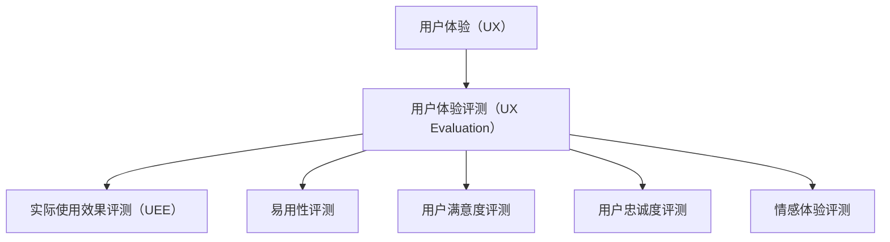
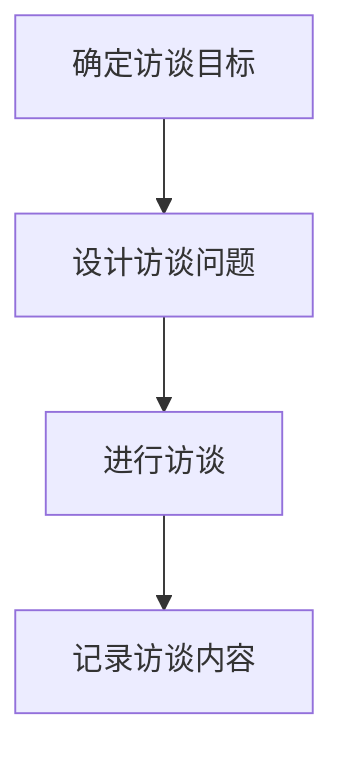
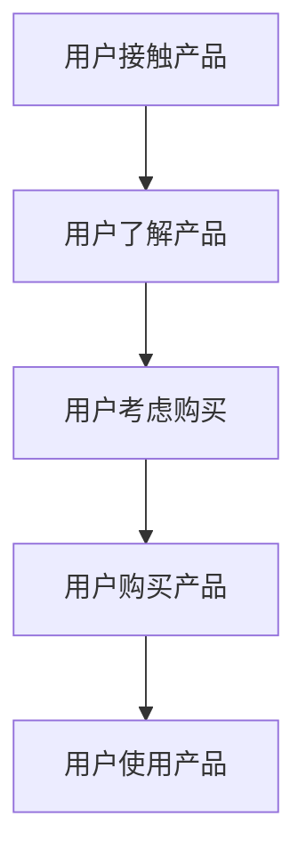
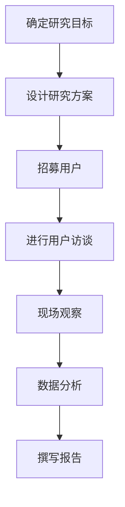
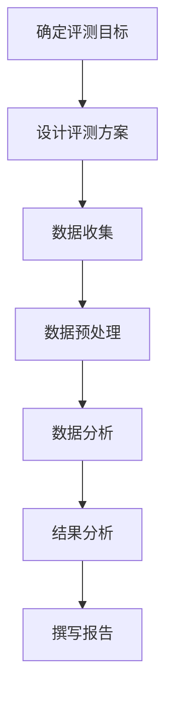

                 

# 《用户体验导向评测：关注实际使用效果》

## 关键词
- 用户体验评测（UX Evaluation）
- 实际使用效果评测（UEE）
- 用户研究方法
- 评估模型
- 数据分析
- 案例研究

## 摘要
本文将深入探讨用户体验导向评测，特别是关注实际使用效果（UEE）的评测方法。我们将首先介绍用户体验评测的背景和重要性，然后详细探讨用户研究的方法，包括用户访谈、现场观察、用户行为分析和故事板与用户旅程图。接下来，我们将介绍用户体验评估模型和实际使用效果评测的方法，并探讨数据收集与处理、结果分析与优化。文章将通过三个案例研究，展示用户体验评测在移动应用、电子商务网站和智能设备中的应用，最后讨论用户体验评测的未来发展趋势和挑战。

## 第1章 引言

### 1.1 用户体验评测概述

用户体验（UX）是指用户在使用产品或服务过程中所感受到的整体感受，包括情感、行为和认知等方面。用户体验评测（UX Evaluation）是一种系统性的方法，用于评估产品的用户体验质量，旨在识别和解决用户在使用产品过程中遇到的问题。

**核心概念与联系**：用户体验（UX）的定义、用户体验评测（UX Evaluation）的定义、实际使用效果评测（UEE）的定义。

在实际应用中，用户体验评测通常涉及到以下几个方面：

1. **易用性（Usability）**：评估用户能否顺利完成任务，包括界面布局、导航、交互设计等。
2. **用户满意度（User Satisfaction）**：评估用户对产品的总体满意程度。
3. **用户忠诚度（User Loyalty）**：评估用户对产品的长期忠诚度。
4. **情感体验（Emotional Experience）**：评估用户在使用产品过程中的情感反应。

**Mermaid流程图**：



### 1.2 用户体验评测的重要性

用户体验评测对于产品成功至关重要。它不仅能够帮助识别和解决用户在使用产品过程中遇到的问题，还能够为产品改进提供有价值的洞察。以下是用户体验评测的重要性：

1. **提升用户满意度**：通过评测，可以了解用户的真实体验，从而改进产品，提升用户满意度。
2. **降低用户流失率**：识别用户痛点，及时调整产品，降低用户流失率。
3. **增加用户忠诚度**：持续进行用户体验评测，能够确保产品始终符合用户需求，增加用户忠诚度。
4. **提升品牌形象**：良好的用户体验能够提升品牌形象，增强用户对品牌的信任和忠诚。

**核心概念与联系**：用户体验对业务成功的影响、用户体验评测对产品优化的推动作用。

```python
def business_success(ux_evaluation):
    if ux_evaluation.is_positive():
        return improve_product()
    else:
        return handle_issues()
```

### 1.3 用户体验评测的目标和原则

用户体验评测的目标是评估产品的用户体验质量，并提供改进建议。具体目标包括：

1. **识别用户痛点**：通过评测，识别用户在使用产品过程中遇到的问题，以便进行改进。
2. **优化产品功能**：根据用户反馈，优化产品的功能，提升用户体验。
3. **提高产品易用性**：通过评测，提高产品的易用性，使用户能够更轻松地完成任务。
4. **提升用户满意度**：通过持续评测，不断提升用户满意度。

用户体验评测的原则包括：

1. **以用户为中心**：始终将用户需求放在首位，确保评测结果真正反映用户需求。
2. **全面性**：从多个角度进行评测，包括易用性、用户满意度、用户忠诚度等。
3. **客观性**：确保评测过程的客观性，避免主观偏见。
4. **持续性**：持续进行用户体验评测，确保产品始终符合用户需求。

**数学模型**：

$$ \text{UEE} = f(\text{实际使用效果指标}, \text{用户满意度}) $$

其中，实际使用效果指标包括易用性、用户满意度、用户忠诚度等。

## 第2章 用户研究方法

用户体验评测的第一步是进行用户研究，以获取用户的真实反馈和行为数据。用户研究方法主要包括用户访谈、现场观察、用户行为分析和故事板与用户旅程图。

### 2.1 用户访谈

用户访谈是一种直接从用户那里获取信息的方法。通过访谈，可以深入了解用户的需求、偏好和痛点。

**核心概念与联系**：用户访谈的目的、用户访谈的方法、用户访谈的技巧。

- **目的**：了解用户对产品的看法、需求和使用习惯。
- **方法**：面对面访谈、电话访谈、在线访谈。
- **技巧**：提前准备访谈问题、创造轻松的访谈氛围、引导用户深入回答。

**Mermaid流程图**：



### 2.2 现场观察

现场观察是在真实环境中观察用户如何使用产品，从而获取用户行为数据的方法。

**核心概念与联系**：现场观察的目的、现场观察的方法、现场观察的注意事项。

- **目的**：观察用户在使用产品时的行为和反应。
- **方法**：在用户的自然使用场景中进行观察。
- **注意事项**：确保观察过程中不干扰用户、记录观察数据。

**伪代码示例**：

```python
def observe_user(behavior):
    if behavior.is Desired():
        record_observation()
```

### 2.3 用户行为分析

用户行为分析是通过分析用户在产品中的行为数据，以获取用户行为模式和方法的方法。

**核心概念与联系**：用户行为分析的目的、用户行为分析的方法、用户行为分析的指标。

- **目的**：了解用户的使用习惯和行为模式。
- **方法**：分析用户点击、浏览、停留、转化等行为数据。
- **指标**：用户点击率、用户停留时间、用户转化率。

**数学模型**：

$$ \text{行为分析} = f(\text{用户点击率}, \text{用户停留时间}, \text{用户转化率}) $$

### 2.4 故事板和用户旅程图

故事板和用户旅程图是用于描述用户在使用产品过程中的行为和情感的图形化工具。

**核心概念与联系**：故事板的定义、用户旅程图的定义、故事板和用户旅程图的关系。

- **故事板**：描述用户在使用产品过程中的关键步骤和决策。
- **用户旅程图**：描述用户从接触产品到购买或使用产品的全过程。

**Mermaid流程图**：



## 第3章 用户体验评估模型

用户体验评估模型是用于系统性地评估产品的用户体验质量的工具。常见的用户体验评估模型包括usability模型、UX指标体系和关键绩效指标（KPI）。

### 3.1 usability模型

usability模型是一种用于评估产品易用性的模型。它通常包括以下几个维度：

1. **易学性（Learnability）**：用户初次使用产品时能否快速上手。
2. **效率（Efficiency）**：用户完成任务的速度。
3. **满意度（Satisfaction）**：用户对产品的满意度。
4. **错误率（Error Rate）**：用户在使用产品过程中产生的错误数量。

**核心概念与联系**：usability模型的定义、usability模型的核心维度。

### 3.2 UX指标体系

UX指标体系是用于衡量用户体验质量的一系列指标。常见的UX指标包括：

1. **用户满意度（User Satisfaction）**：用户对产品的满意度。
2. **用户忠诚度（User Loyalty）**：用户对产品的忠诚度。
3. **用户活跃度（User Engagement）**：用户与产品的互动频率和深度。
4. **用户留存率（User Retention）**：用户在一段时间内继续使用产品的比例。

**核心概念与联系**：UX指标体系的定义、UX指标体系的核心指标。

### 3.3 关键绩效指标（KPI）

关键绩效指标（KPI）是用于衡量用户体验评测效果的一系列关键指标。常见的KPI包括：

1. **用户满意度（User Satisfaction）**：通过调查问卷等方式获取的用户满意度得分。
2. **用户留存率（User Retention）**：用户在一段时间内继续使用产品的比例。
3. **用户活跃度（User Engagement）**：用户与产品的互动频率和深度。
4. **转化率（Conversion Rate）**：用户完成特定任务的比率。

**核心概念与联系**：关键绩效指标（KPI）的定义、关键绩效指标（KPI）的核心指标。

## 第4章 实际使用效果评测

实际使用效果评测（UEE）是用户体验评测的一个重要方面，它关注用户在实际使用产品过程中的效果和体验。

### 4.1 实际使用效果的定义

实际使用效果（UEE）是指用户在使用产品过程中所获得的效果和体验。它通常包括以下几个维度：

1. **功能有效性（Functional Effectiveness）**：产品是否能够满足用户的功能需求。
2. **性能有效性（Performance Effectiveness）**：产品的性能是否达到用户期望。
3. **用户体验（User Experience）**：用户在使用产品过程中的整体感受。

**核心概念与联系**：实际使用效果的定义、实际使用效果的核心维度。

### 4.2 实际使用效果评测的方法

实际使用效果评测的方法包括定量方法和定性方法。

- **定量方法**：通过用户调查、数据分析等方式获取用户反馈。
- **定性方法**：通过用户访谈、现场观察等方式深入了解用户需求和行为。

**核心概念与联系**：实际使用效果评测的方法、定量方法和定性方法的应用。

### 4.3 实际使用效果评测的工具

实际使用效果评测的工具包括问卷调查工具、数据分析工具和用户研究工具。

- **问卷调查工具**：如Google Forms、SurveyMonkey等。
- **数据分析工具**：如Google Analytics、Tableau等。
- **用户研究工具**：如UserTesting、Lookback等。

**核心概念与联系**：实际使用效果评测的工具、工具的选择和应用。

## 第5章 评测数据收集与处理

评测数据收集与处理是用户体验评测的关键环节，它决定了评测结果的准确性和有效性。

### 5.1 数据收集方法

数据收集方法包括问卷调查、用户访谈、现场观察、用户行为分析等。

- **问卷调查**：通过设计问卷，收集用户对产品的看法和反馈。
- **用户访谈**：通过与用户面对面交流，深入了解用户需求和使用体验。
- **现场观察**：在用户实际使用产品的过程中观察用户行为。
- **用户行为分析**：通过分析用户在产品中的行为数据，了解用户行为模式。

**核心概念与联系**：数据收集方法、不同数据收集方法的特点和应用。

### 5.2 数据预处理

数据预处理是数据收集后的第一步，它包括数据清洗、数据整合和数据转换。

- **数据清洗**：去除重复数据、缺失数据和异常数据。
- **数据整合**：将不同来源的数据进行整合，形成统一的数据集。
- **数据转换**：将原始数据转换为适合分析的形式，如数值化、编码等。

**核心概念与联系**：数据预处理的方法、数据预处理的重要性。

### 5.3 数据分析方法

数据分析方法包括描述性分析、相关性分析和回归分析等。

- **描述性分析**：通过统计描述性指标，如均值、标准差等，了解数据的整体特征。
- **相关性分析**：通过分析变量之间的相关性，了解变量之间的关系。
- **回归分析**：通过建立回归模型，预测变量之间的关系。

**核心概念与联系**：数据分析方法、不同数据分析方法的应用场景。

## 第6章 评测结果分析与优化

评测结果分析是用户体验评测的最后一步，它通过分析评测数据，识别用户痛点，提出优化建议。

### 6.1 评测结果分析

评测结果分析包括以下几个方面：

- **用户反馈分析**：通过分析用户反馈，了解用户的需求和痛点。
- **行为数据分析**：通过分析用户行为数据，了解用户的使用习惯和偏好。
- **性能数据分析**：通过分析产品的性能数据，了解产品的性能表现。

**核心概念与联系**：评测结果分析的方法、不同分析方法的优劣和应用。

### 6.2 问题定位与优化策略

问题定位与优化策略包括以下几个方面：

- **功能优化**：针对用户反馈和评测结果，对产品的功能进行优化。
- **界面优化**：通过改进界面设计，提升用户的使用体验。
- **性能优化**：通过提升产品的性能，满足用户的性能需求。

**核心概念与联系**：问题定位与优化策略的方法、不同优化策略的应用。

### 6.3 用户体验优化实践

用户体验优化实践包括以下几个方面：

- **持续迭代**：通过持续迭代，不断提升产品的用户体验。
- **A/B测试**：通过A/B测试，验证优化方案的有效性。
- **用户参与**：通过用户参与，收集用户的反馈和建议，持续优化产品。

**核心概念与联系**：用户体验优化实践的方法、不同实践方法的优劣和应用。

## 第7章 案例研究

案例研究是用户体验评测的实践应用，通过具体案例，展示用户体验评测的方法和应用。

### 7.1 案例一：移动应用用户体验评测

案例一以一款移动应用为例，展示用户体验评测的过程和方法。

**核心概念与联系**：移动应用用户体验评测的目标、方法、结果和应用。

### 7.2 案例二：电子商务网站用户体验评测

案例二以一家电子商务网站为例，展示用户体验评测的过程和方法。

**核心概念与联系**：电子商务网站用户体验评测的目标、方法、结果和应用。

### 7.3 案例三：智能设备用户体验评测

案例三以一款智能设备为例，展示用户体验评测的过程和方法。

**核心概念与联系**：智能设备用户体验评测的目标、方法、结果和应用。

## 第8章 未来发展趋势与挑战

用户体验评测作为产品开发的重要环节，随着技术的发展和用户需求的变化，也在不断演进。

### 8.1 用户体验评测的发展趋势

用户体验评测的发展趋势包括以下几个方面：

- **人工智能与大数据的应用**：通过人工智能和大数据技术，提高用户体验评测的准确性和效率。
- **实时评测**：通过实时评测，及时获取用户反馈，快速响应和优化产品。
- **多渠道评测**：通过多渠道评测，全面了解用户在不同场景下的使用体验。

**核心概念与联系**：用户体验评测的发展趋势、发展趋势的动因和应用。

### 8.2 用户体验评测的挑战与应对策略

用户体验评测面临的挑战包括：

- **数据隐私**：在数据收集和处理过程中，如何保护用户隐私。
- **跨平台兼容性**：如何在不同的设备和平台上进行用户体验评测。
- **用户多样性和复杂性**：如何应对不同用户群体的需求和体验差异。

**核心概念与联系**：用户体验评测的挑战、挑战的动因和应对策略。

## 附录A：用户体验评测工具与资源

### A.1 常用用户体验评测工具

常用用户体验评测工具包括：

- **问卷调查工具**：如Google Forms、SurveyMonkey等。
- **用户研究工具**：如UserTesting、Lookback等。
- **数据分析工具**：如Google Analytics、Tableau等。

**核心概念与联系**：常用用户体验评测工具、工具的特点和应用。

### A.2 用户体验评测资源

用户体验评测资源包括：

- **学术资源**：如学术论文、研究报告等。
- **实践资源**：如行业案例、最佳实践等。
- **开源工具**：如开源的评测工具和框架。

**核心概念与联系**：用户体验评测资源、资源的获取和应用。

### A.3 用户体验评测指南与标准

用户体验评测指南与标准包括：

- **ISO 9241**：国际标准化组织（ISO）发布的用户体验评测标准。
- **UXPA**：用户体验专业人士协会（UXPA）发布的用户体验评测指南。
- **Nielsen Norman Group**：尼尔森诺曼集团发布的用户体验评测指南。

**核心概念与联系**：用户体验评测指南与标准、标准的内容和应用。

## 附录B：Mermaid 流程图

### B.1 Mermaid 流程图基本语法

Mermaid流程图的基本语法包括：

- **节点定义**：使用圆括号（()）定义节点。
- **连接线**：使用箭头（->）定义节点之间的连接线。
- **注释**：使用双斜杠（//）添加注释。

**核心概念与联系**：Mermaid流程图的基本语法、语法的基本应用。

### B.2 用户研究流程图

以下是一个用户研究流程图的示例：



### B.3 用户体验评测流程图

以下是一个用户体验评测流程图的示例：



## 附录C：伪代码与数学模型

### C.1 伪代码示例

以下是一个用户访谈流程的伪代码示例：

```python
def user_interview流程():
    设计访谈问题()
    进行访谈()
    记录访谈内容()
    分析访谈结果()
    提出改进建议()
```

### C.2 数学模型示例

以下是一个用户满意度评分的数学模型示例：

$$ \text{用户满意度评分} = \frac{\text{正面反馈次数} + \text{中立反馈次数}}{\text{总反馈次数}} $$

### C.3 数学公式示例

以下是一个线性回归模型的数学公式示例：

$$ y = \beta_0 + \beta_1x_1 + \beta_2x_2 + ... + \beta_nx_n $$

## 作者信息

**作者：AI天才研究院/AI Genius Institute & 禅与计算机程序设计艺术 /Zen And The Art of Computer Programming**

