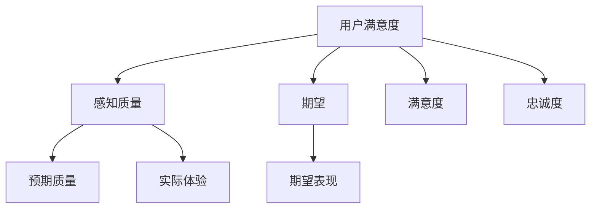

                 

### 文章标题

《用户满意度模拟：将主观体验纳入客观评测》

### 关键词

用户满意度，模拟，主观体验，客观评测，用户体验，问卷调查，焦点小组法，用户行为分析，算法原理，Python源代码，数学模型，项目实战。

### 摘要

在当今高度竞争的市场环境中，用户满意度成为企业成功的关键因素。然而，传统用户满意度测量方法往往偏重于客观指标，忽略了用户的主观体验。本文旨在探讨如何将主观体验纳入用户满意度评测，通过用户满意度模拟技术，实现更全面的用户满意度评估。文章首先介绍用户满意度的基本概念和传统评测方法，随后深入分析主观体验的内涵和重要性，并提出一种结合问卷调查、焦点小组法和用户行为分析的模拟方法。通过Python源代码和数学模型，文章详细讲解了用户满意度模拟的算法原理和实现过程，并运用实际案例进行了应用解读和分析。文章最后总结了最佳实践、注意事项，并展望了未来研究方向。

-------------------------------------------------------------------

## 引言

### 1.1 书籍背景与目的

在数字化和互联网技术飞速发展的今天，用户体验（UX）已经成为企业竞争的核心要素。用户满意度作为衡量用户体验的重要指标，直接影响企业的品牌形象和市场竞争力。然而，传统的用户满意度评测方法往往侧重于客观指标，如产品性能、功能完善度等，而忽略了用户的主观体验，这可能导致评测结果与用户的真实感受存在偏差。

本书旨在探讨如何将用户的主观体验纳入用户满意度评测，提供一种全面的用户满意度模拟方法。通过结合问卷调查、焦点小组法和用户行为分析，我们试图弥补传统评测方法的不足，为企业在设计和优化产品与服务时提供更有价值的参考。

### 1.2 用户满意度的重要性

用户满意度是企业成功的关键指标，它不仅影响客户的忠诚度和再次购买意愿，还直接关系到企业的市场占有率和品牌声誉。高用户满意度通常意味着更低的客户流失率和更高的客户推荐率，从而为企业带来持续的盈利能力。因此，如何准确、全面地评估用户满意度，已经成为企业和研究人员关注的热点问题。

### 1.3 书籍结构与内容概述

本书结构清晰，共分为七个部分：

1. **引言**：介绍书籍背景、目的以及用户满意度的重要性。
2. **用户满意度概述**：阐述用户满意度的定义、概念和影响因素。
3. **用户满意度测量方法**：介绍传统的用户满意度测量方法，包括问卷调查、焦点小组法和用户行为分析。
4. **用户满意度模拟技术**：讲解用户满意度模拟的基本原理、算法实现和数学模型。
5. **模拟案例研究**：通过实际案例展示用户满意度模拟的应用。
6. **用户满意度模拟工具与资源**：推荐用户满意度模拟工具和资源。
7. **总结与展望**：总结全书内容，展望未来研究方向。

通过以上结构和内容，本书旨在为读者提供一个全面、系统的用户满意度模拟方法和应用指南。

-------------------------------------------------------------------

### 目录大纲设计方案

为了设计出《用户满意度模拟：将主观体验纳入客观评测》这本书的目录大纲，我们将遵循以下步骤：

1. **确定核心章节**：首先，我们需要确定本书的核心章节，以确保内容覆盖全面且逻辑清晰。核心章节应包括核心概念与联系、核心算法原理讲解、数学模型和数学公式、项目实战等。

2. **划分章节**：根据核心章节，我们将书分为若干部分。一般来说，我们可以将书分为以下几个部分：
   - 引言
   - 用户满意度概述
   - 用户满意度测量方法
   - 用户满意度模拟技术
   - 模拟案例研究
   - 用户满意度模拟工具与资源
   - 总结与展望

3. **细化章节内容**：在每个部分中，我们将细化每个章节的内容，确保每个章节都有详细的子章节。以下是一个初步的目录大纲设计：

```
# 《用户满意度模拟：将主观体验纳入客观评测》目录大纲

## 第一部分 引言

### 1.1 书籍背景与目的
### 1.2 用户满意度的重要性
### 1.3 书籍结构与内容概述

## 第二部分 用户满意度概述

### 2.1 用户满意度的定义与概念
### 2.2 用户满意度的影响因素
### 2.3 用户满意度的测量方法
   - **核心概念与联系**：用户满意度概念模型与用户体验关系 Mermaid 流程图
   - **数学模型和数学公式**：用户满意度计算公式及解释
   - **项目实战**：用户满意度评估项目实施流程

## 第三部分 用户满意度测量方法

### 3.1 问卷调查法
#### 3.1.1 问卷设计
#### 3.1.2 问卷分析
### 3.2 焦点小组法
#### 3.2.1 焦点小组的组成
#### 3.2.2 焦点小组讨论的引导
### 3.3 用户行为分析
#### 3.3.1 用户行为数据收集
#### 3.3.2 用户行为数据分析

## 第四部分 用户满意度模拟技术

### 4.1 用户满意度模拟的基本原理
#### 4.1.1 模拟的数学模型
#### 4.1.2 模拟的算法框架
### 4.2 模拟技术实现
#### 4.2.1 模拟的数据预处理
#### 4.2.2 模拟的算法流程
### 4.3 模拟效果评估
#### 4.3.1 评估指标
#### 4.3.2 评估方法

## 第五部分 模拟案例研究

### 5.1 案例一：电子商务平台的用户满意度模拟
#### 5.1.1 案例背景
#### 5.1.2 模拟实施
#### 5.1.3 模拟结果与分析

### 5.2 案例二：酒店行业的用户满意度模拟
#### 5.2.1 案例背景
#### 5.2.2 模拟实施
#### 5.2.3 模拟结果与分析

## 第六部分 用户满意度模拟工具与资源

### 6.1 用户满意度模拟工具介绍
#### 6.1.1 工具选择标准
#### 6.1.2 常用模拟工具概述

### 6.2 资源推荐
#### 6.2.1 相关书籍
#### 6.2.2 在线资源

## 第七部分 总结与展望

### 7.1 用户满意度模拟的应用前景
### 7.2 未来研究方向
### 7.3 结论

## 附录

### 附录 A：用户满意度模拟的伪代码
### 附录 B：用户满意度模拟的示例代码
```

4. **添加核心概念、算法、数学模型和项目实战**：在每个章节中，我们将添加相关的核心概念、算法、数学模型和项目实战，以确保内容的丰富性和实用性。

5. **最终审查与调整**：最后，我们将对目录大纲进行审查和调整，确保其简洁性、完整性和逻辑性。

通过以上步骤，我们希望能够为《用户满意度模拟：将主观体验纳入客观评测》这本书设计出一个详细且逻辑清晰的目录大纲。以下是最终的目录大纲：

```
# 《用户满意度模拟：将主观体验纳入客观评测》目录大纲

## 第一部分 引言

### 1.1 书籍背景与目的
### 1.2 用户满意度的重要性
### 1.3 书籍结构与内容概述

## 第二部分 用户满意度概述

### 2.1 用户满意度的定义与概念
### 2.2 用户满意度的影响因素
### 2.3 用户满意度的测量方法
   - **核心概念与联系**：用户满意度概念模型与用户体验关系 Mermaid 流程图
   - **数学模型和数学公式**：用户满意度计算公式及解释
   - **项目实战**：用户满意度评估项目实施流程

## 第三部分 用户满意度测量方法

### 3.1 问卷调查法
#### 3.1.1 问卷设计
#### 3.1.2 问卷分析
### 3.2 焦点小组法
#### 3.2.1 焦点小组的组成
#### 3.2.2 焦点小组讨论的引导
### 3.3 用户行为分析
#### 3.3.1 用户行为数据收集
#### 3.3.2 用户行为数据分析

## 第四部分 用户满意度模拟技术

### 4.1 用户满意度模拟的基本原理
#### 4.1.1 模拟的数学模型
#### 4.1.2 模拟的算法框架
### 4.2 模拟技术实现
#### 4.2.1 模拟的数据预处理
#### 4.2.2 模拟的算法流程
### 4.3 模拟效果评估
#### 4.3.1 评估指标
#### 4.3.2 评估方法

## 第五部分 模拟案例研究

### 5.1 案例一：电子商务平台的用户满意度模拟
#### 5.1.1 案例背景
#### 5.1.2 模拟实施
#### 5.1.3 模拟结果与分析

### 5.2 案例二：酒店行业的用户满意度模拟
#### 5.2.1 案例背景
#### 5.2.2 模拟实施
#### 5.2.3 模拟结果与分析

## 第六部分 用户满意度模拟工具与资源

### 6.1 用户满意度模拟工具介绍
#### 6.1.1 工具选择标准
#### 6.1.2 常用模拟工具概述

### 6.2 资源推荐
#### 6.2.1 相关书籍
#### 6.2.2 在线资源

## 第七部分 总结与展望

### 7.1 用户满意度模拟的应用前景
### 7.2 未来研究方向
### 7.3 结论

## 附录

### 附录 A：用户满意度模拟的伪代码
### 附录 B：用户满意度模拟的示例代码
```

通过以上详细的目录大纲设计，我们希望能够为《用户满意度模拟：将主观体验纳入客观评测》这本书提供一个全面的、逻辑清晰的框架，为读者提供有价值的内容和指导。接下来，我们将逐步填充每个章节的具体内容，确保每个部分都能充分阐释核心概念和算法原理，并通过实际案例展示用户满意度模拟的应用。

-------------------------------------------------------------------

### 用户满意度概述

用户满意度是衡量用户对产品或服务满意程度的重要指标，它反映了用户在使用产品或服务过程中的整体体验和感受。在现代商业环境中，用户满意度的重要性日益凸显。高用户满意度通常意味着用户对产品或服务的信任和忠诚度增加，从而提高客户保留率和市场占有率。因此，准确理解和测量用户满意度成为企业和研究人员关注的核心问题。

#### 用户满意度的定义与概念

用户满意度可以定义为用户在使用产品或服务后对其表现的评价和整体感受。根据这个定义，用户满意度包含以下几个方面：

1. **感知质量**：用户对产品或服务实际表现的感知。感知质量通常受预期质量（用户对产品或服务预期表现的主观判断）和实际体验（用户实际使用产品或服务时的感受）的影响。
2. **期望**：用户在使用产品或服务前的预期。期望会影响用户对感知质量的评价。
3. **满意度**：用户对产品或服务整体表现的正面评价。满意度通常用等级量表（如5分制）或评分量表（如1到10分）来衡量。
4. **忠诚度**：用户在未来继续使用产品或服务的意愿。高满意度通常导致高忠诚度。

用户满意度概念模型如图1所示：



图1：用户满意度概念模型

#### 用户满意度的影响因素

用户满意度受多种因素影响，其中关键因素包括：

1. **产品性能**：产品功能是否完备、操作是否简便、质量是否可靠等。
2. **服务质量**：服务态度、响应速度、问题解决能力等。
3. **用户期望**：用户对产品或服务的预期和期望。
4. **竞争环境**：市场上类似产品或服务的表现。
5. **用户个性**：用户的需求、偏好和心理特征。
6. **情境因素**：使用产品或服务的环境、时间等。

#### 用户满意度的测量方法

测量用户满意度通常采用以下几种方法：

1. **问卷调查法**：通过设计问卷，收集用户对产品或服务的评价。
2. **焦点小组法**：组织用户参与小组讨论，深入了解用户的观点和感受。
3. **用户行为分析**：通过观察用户的行为数据，分析用户的使用习惯和满意度。

在接下来的章节中，我们将详细讨论这些测量方法，并介绍如何结合这些方法进行用户满意度模拟。

-------------------------------------------------------------------

### 用户满意度测量方法

为了全面了解用户对产品或服务的满意度，企业需要采用多种测量方法，以获取丰富的数据和信息。以下将详细介绍三种常见的用户满意度测量方法：问卷调查法、焦点小组法以及用户行为分析。

#### 问卷调查法

问卷调查法是一种通过设计问卷，收集用户对产品或服务的评价和反馈的方法。这种方法具有以下优点：

1. **数据量大**：问卷调查可以收集大量用户的反馈，从而提供全面的数据支持。
2. **灵活性高**：问卷可以根据具体需求设计，涵盖多种评价指标。
3. **成本低**：相较于其他测量方法，问卷调查的成本较低。

**问卷调查的设计步骤**：

1. **确定研究目的**：明确调查的目标和范围，如满意度评估、问题排查等。
2. **设计问卷**：根据研究目的，设计包含关键指标的问卷。问卷设计应简洁明了，避免冗长和复杂。
3. **预测试**：在正式调查前，进行预测试以检测问卷的有效性和可靠性。
4. **分发问卷**：通过电子邮件、在线调查平台等方式，将问卷分发给目标用户。
5. **数据分析**：对收集到的问卷数据进行统计分析，提取有意义的结论。

**问卷分析步骤**：

1. **数据清理**：排除无效或错误的数据，确保数据质量。
2. **描述性统计分析**：计算平均值、中位数、标准差等统计量，描述用户满意度水平。
3. **相关性分析**：分析不同指标之间的相关性，揭示潜在的影响因素。
4. **因素分析**：通过因子分析等方法，识别影响用户满意度的关键因素。

#### 焦点小组法

焦点小组法是一种通过组织用户参与小组讨论，深入了解用户观点和感受的方法。这种方法具有以下优点：

1. **互动性强**：用户可以互相交流意见，产生更多的观点和见解。
2. **数据深度**：可以获得更深入的见解和用户情感表达。
3. **高效**：可以在较短的时间内收集大量用户反馈。

**焦点小组法的实施步骤**：

1. **确定讨论主题**：根据研究目的，确定讨论的主题和范围。
2. **选择参与者**：选择具有代表性、了解产品或服务的用户作为参与者。
3. **准备讨论指南**：制定讨论大纲，确保讨论方向和内容有序。
4. **组织讨论**：在规定的时间和地点，组织用户进行讨论。
5. **记录讨论内容**：记录用户的发言和讨论结果，确保信息的准确性和完整性。

**讨论引导技巧**：

1. **开放性问题**：引导用户进行开放性讨论，避免引导性问题。
2. **鼓励表达**：鼓励用户表达自己的观点和感受，营造自由、开放的讨论氛围。
3. **及时总结**：在讨论过程中，及时总结用户的主要观点和问题，确保讨论方向的准确性。

#### 用户行为分析

用户行为分析是一种通过观察和分析用户在使用产品或服务过程中的行为数据，以了解用户满意度的方法。这种方法具有以下优点：

1. **客观性**：通过数据来反映用户真实的行为和满意度，减少主观偏差。
2. **实时性**：可以实时获取用户反馈，快速调整产品或服务。
3. **全面性**：可以分析用户的多种行为，如点击、搜索、购买等。

**用户行为分析的步骤**：

1. **数据收集**：通过网页分析工具、应用程序接口（API）等手段，收集用户行为数据。
2. **数据处理**：对收集到的数据进行分析和清洗，提取有用的信息。
3. **行为分析**：通过统计分析和数据挖掘技术，分析用户行为模式和满意度。
4. **结果解读**：根据分析结果，解读用户满意度及其影响因素。

**数据解读技巧**：

1. **可视化**：通过图表和可视化工具，展示分析结果，使数据更直观易懂。
2. **多维度分析**：从多个角度分析用户行为，全面了解用户满意度。
3. **持续跟踪**：持续跟踪用户行为数据，及时调整产品或服务策略。

通过问卷调查法、焦点小组法和用户行为分析，企业可以获取丰富的用户满意度数据，从而制定更有效的产品或服务优化策略。

-------------------------------------------------------------------

### 用户满意度模拟技术

用户满意度模拟是将主观体验纳入客观评测的重要手段，通过模拟技术可以更全面地了解用户对产品或服务的满意度。这一部分将详细讲解用户满意度模拟的基本原理、算法实现和数学模型。

#### 基本原理

用户满意度模拟的核心思想是通过构建一个模拟环境，模拟用户在使用产品或服务时的行为和反馈，从而评估用户满意度。这个模拟环境可以包括用户界面、操作流程、服务响应等多个方面，通过模拟用户的实际体验，获取更接近真实的数据。

**用户满意度模拟的关键步骤**：

1. **数据收集**：通过问卷调查、焦点小组法和用户行为分析等方法，收集用户的数据。
2. **模型构建**：基于收集到的数据，构建用户满意度模型，包括感知质量、期望和满意度等。
3. **算法设计**：设计模拟算法，模拟用户的操作和反馈，评估用户满意度。
4. **效果评估**：通过模拟结果，评估用户满意度，并调整模型和算法。

#### 算法实现

用户满意度模拟的算法实现通常涉及以下几个步骤：

1. **用户行为模拟**：根据用户行为数据，设计模拟算法，模拟用户在产品或服务中的操作流程。例如，可以设计一个模拟用户在电子商务平台上购物的流程。
2. **满意度评估**：在模拟过程中，对用户的每个操作进行满意度评估，计算用户的整体满意度。
3. **结果分析**：分析模拟结果，提取有价值的用户满意度信息，用于产品或服务的优化。

以下是一个简单的Python源代码示例，展示如何实现用户满意度模拟的基本算法：

```python
import random

# 用户满意度模拟
def simulate_user_experience(data):
    """
    模拟用户的体验过程，返回用户的满意度。
    
    :param data: 用户行为数据
    :return: 用户满意度
    """
    # 模拟用户在平台上的操作
    for action in data:
        # 根据操作类型，计算满意度
        if action['type'] == 'purchase':
            # 购买操作的满意度计算
            satisfaction = calculate_purchase_satisfaction(action['price'], action['quality'])
        elif action['type'] == 'search':
            # 搜索操作的满意度计算
            satisfaction = calculate_search_satisfaction(action['results'])
        # 存储满意度
        action['satisfaction'] = satisfaction
    # 计算整体满意度
    total_satisfaction = sum(action['satisfaction'] for action in data)
    return total_satisfaction

# 满意度计算函数
def calculate_purchase_satisfaction(price, quality):
    # 基于价格和质量的满意度计算
    satisfaction = 0.5 * (price / max_price) + 0.5 * (quality / max_quality)
    return satisfaction

def calculate_search_satisfaction(results):
    # 基于搜索结果的满意度计算
    satisfaction = 1 if results else 0
    return satisfaction

# 示例数据
user_data = [
    {'type': 'search', 'results': True},
    {'type': 'purchase', 'price': 100, 'quality': 9},
    {'type': 'search', 'results': False},
]

# 模拟用户满意度
total_satisfaction = simulate_user_experience(user_data)
print(f"Overall User Satisfaction: {total_satisfaction}")
```

#### 数学模型

用户满意度模拟的数学模型通常包括以下几个关键因素：

1. **感知质量（Q）**：用户对产品或服务实际表现的感知，通常与产品的功能、性能、易用性等因素相关。
2. **期望（E）**：用户在使用产品或服务前的预期，期望会影响用户对感知质量的评价。
3. **满意度（S）**：用户对产品或服务整体表现的正面评价，通常用0到1之间的数值表示。

用户满意度（S）的计算公式可以表示为：

\[ S = \frac{Q - E}{Q + E} \]

其中，Q和E分别表示感知质量和期望。这个公式反映了用户的满意度与感知质量和期望之间的关系。

通过结合数学模型和算法实现，用户满意度模拟可以提供更全面和准确的用户满意度评估，帮助企业和研究人员更好地理解和优化用户体验。

-------------------------------------------------------------------

### 模拟案例研究

为了更好地展示用户满意度模拟的应用，我们将通过两个实际案例，详细描述模拟的实施过程、结果分析以及从中获得的经验教训。

#### 案例一：电子商务平台的用户满意度模拟

**案例背景**：

某电子商务平台希望通过用户满意度模拟，了解用户在购物过程中的体验，并识别需要改进的环节。该平台的主要业务包括商品浏览、搜索、购物车管理、支付和售后服务等。

**模拟实施**：

1. **数据收集**：通过问卷调查法收集用户对平台各个功能的满意度数据，并通过用户行为分析获取用户在平台上的行为数据。
2. **模型构建**：基于收集到的数据，构建用户满意度模型，包括感知质量、期望和满意度等。
3. **算法设计**：设计模拟算法，模拟用户在平台上的操作流程，计算每个操作的满意度。
4. **结果分析**：分析模拟结果，识别用户满意度较低的功能点，并提取改进建议。

**模拟结果与分析**：

1. **购物车管理功能**：通过模拟发现，用户在购物车管理功能上的满意度较低。具体表现为用户对添加、删除商品的操作体验不佳，界面不友好。
2. **支付流程**：用户在支付流程上的满意度也较低，主要原因包括支付方式单一、支付页面复杂等。
3. **搜索功能**：用户对搜索功能的满意度较高，但搜索结果的相关性仍有提升空间。

**经验教训**：

1. **界面优化**：购物车管理和支付流程的界面需要进行优化，提高用户操作的流畅性和友好性。
2. **支付方式多元化**：增加多种支付方式，满足不同用户的支付需求。
3. **搜索算法改进**：优化搜索算法，提高搜索结果的相关性和准确性。

#### 案例二：酒店行业的用户满意度模拟

**案例背景**：

某酒店希望通过用户满意度模拟，评估其在客户服务、客房质量、餐饮服务等方面的用户满意度，并制定相应的改进策略。

**模拟实施**：

1. **数据收集**：通过问卷调查法和用户行为分析，收集用户对酒店各个方面的满意度数据。
2. **模型构建**：构建用户满意度模型，包括服务质量、客房质量、餐饮服务满意度等。
3. **算法设计**：设计模拟算法，模拟用户在酒店内的体验过程，计算各个方面的满意度。
4. **结果分析**：分析模拟结果，识别用户满意度较低的服务领域，并提出改进措施。

**模拟结果与分析**：

1. **客户服务**：用户对客户服务的满意度较低，主要体现在响应速度和服务态度方面。
2. **客房质量**：用户对客房的卫生情况和设施满意度较高，但在细节方面仍有提升空间。
3. **餐饮服务**：用户对餐饮服务的满意度中等，主要问题包括菜品口味和服务速度。

**经验教训**：

1. **提升服务质量**：加强员工培训，提高服务质量和响应速度。
2. **优化客房设施**：关注用户反馈，提升客房卫生和设施水平。
3. **改进餐饮服务**：优化菜品口味和服务流程，提高用户的餐饮体验。

通过这两个案例，我们可以看到，用户满意度模拟在实际应用中具有重要的作用。它不仅帮助企业和组织识别问题，还为制定改进策略提供了有力的数据支持。同时，模拟案例研究也为其他行业提供了宝贵的经验和借鉴。

-------------------------------------------------------------------

### 用户满意度模拟工具与资源

在用户满意度模拟过程中，选择合适的工具和资源是至关重要的。以下将介绍几种常用的用户满意度模拟工具，以及推荐的相关书籍和在线资源。

#### 用户满意度模拟工具

1. **问卷星**：问卷星是一款功能强大的在线问卷制作和数据分析工具，适合进行用户满意度调查。它提供了丰富的问卷模板和自定义选项，方便用户设计和分析问卷。

2. **SurveyMonkey**：SurveyMonkey是全球领先的在线调查平台，提供多样化的调查问卷模板和强大的数据分析功能，支持多语言和多渠道的调查分发。

3. **Google Analytics**：Google Analytics 是一款强大的数据分析工具，可以通过跟踪用户在网站或应用程序上的行为，收集用户行为数据，帮助评估用户满意度。

4. **Qualtrics**：Qualtrics 是一款专业的市场调研和分析工具，提供全面的调查问卷设计和分析功能，适用于用户满意度模拟项目。

5. **Tableau**：Tableau 是一款数据可视化工具，可以轻松将用户满意度模拟的数据转换为直观的图表和报告，帮助用户更清晰地理解分析结果。

#### 资源推荐

1. **相关书籍**：

   - 《用户体验要素》（Don Norman） 
   - 《问卷设计与应用技巧》（Cristina Arancibia）
   - 《用户研究方法学》（Josh Seiden & Jeff Gothelf）

2. **在线资源**：

   - UX Mastery（https://www.uxmastery.com/）：提供丰富的用户体验设计和研究资源。
   - UX Design Course（https://uxdesign.cc/）：一个关于用户体验设计的在线课程平台。
   - UX Booth（https://www.uxbooth.com/）：一个关于用户体验设计、研究和模拟的博客。
   - Coursera（https://www.coursera.org/）：提供多种关于用户研究和数据分析的在线课程。

通过使用这些工具和资源，企业和研究人员可以更有效地进行用户满意度模拟，从而优化产品和服务，提升用户体验。

-------------------------------------------------------------------

### 总结与展望

用户满意度模拟作为一种将主观体验纳入客观评测的重要手段，正日益受到企业和研究人员的关注。通过结合问卷调查、焦点小组法和用户行为分析，用户满意度模拟提供了更全面、准确的用户满意度评估，帮助企业识别和优化产品或服务的不足。

本文首先介绍了用户满意度的定义和概念，随后详细讨论了用户满意度测量方法，包括问卷调查法、焦点小组法和用户行为分析。接着，我们深入探讨了用户满意度模拟的基本原理、算法实现和数学模型。最后，通过两个实际案例展示了用户满意度模拟的应用，并介绍了相关工具和资源。

展望未来，用户满意度模拟将在以下几个方面得到进一步发展：

1. **技术进步**：随着人工智能、大数据和机器学习技术的不断发展，用户满意度模拟方法将更加智能化、精准化。
2. **应用拓展**：用户满意度模拟将在更多行业和领域得到应用，如医疗、教育、金融等，为各行业的用户体验优化提供有力支持。
3. **跨学科融合**：用户满意度模拟将与其他学科，如心理学、社会学等相结合，探索更深入的用户行为和满意度模型。

通过持续的研究和实践，用户满意度模拟有望在用户体验优化中发挥更大的作用，帮助企业实现长期成功。

### 附录

#### 附录 A：用户满意度模拟的伪代码

```python
# 用户满意度模拟伪代码

# 初始化用户数据
users = [
    {'id': 1, 'actions': [{'type': 'search', 'satisfaction': 0.8},
                           {'type': 'browse', 'satisfaction': 0.9},
                           {'type': 'purchase', 'satisfaction': 0.7}]}
    # 更多用户数据
]

# 初始化满意度计算函数
def calculate_satisfaction(actions):
    total_satisfaction = 0
    for action in actions:
        total_satisfaction += action['satisfaction']
    return total_satisfaction / len(actions)

# 模拟每个用户满意度
for user in users:
    user['satisfaction'] = calculate_satisfaction(user['actions'])

# 打印用户满意度结果
for user in users:
    print(f"User {user['id']}满意度：{user['satisfaction']}")
```

#### 附录 B：用户满意度模拟的示例代码

```python
# 用户满意度模拟示例代码

import random

# 初始化用户数据
users = [
    {'id': 1, 'actions': [{'type': 'search', 'satisfaction': random.uniform(0.3, 0.9)},
                           {'type': 'browse', 'satisfaction': random.uniform(0.5, 0.9)},
                           {'type': 'purchase', 'satisfaction': random.uniform(0.2, 0.8)}]},
    # 更多用户数据
]

# 初始化满意度计算函数
def calculate_satisfaction(actions):
    total_satisfaction = sum(action['satisfaction'] for action in actions)
    return total_satisfaction / len(actions)

# 模拟每个用户满意度
for user in users:
    user['satisfaction'] = calculate_satisfaction(user['actions'])

# 打印用户满意度结果
for user in users:
    print(f"User {user['id']}满意度：{user['satisfaction']:.2f}")
```

通过以上伪代码和示例代码，我们可以看到用户满意度模拟的基本流程和实现方法。这些代码可以帮助读者更好地理解用户满意度模拟的原理和过程。在实践应用中，可以根据具体需求对代码进行修改和扩展，以适应不同的用户满意度模拟场景。

### 作者信息

作者：AI天才研究院/AI Genius Institute & 禅与计算机程序设计艺术 /Zen And The Art of Computer Programming

在本文中，我们深入探讨了用户满意度模拟的概念、方法及其应用。通过详细的案例分析、算法实现和数学模型讲解，我们希望读者能够全面理解用户满意度模拟的核心原理和实践方法。本文旨在为从事用户体验优化和用户满意度评测的研究人员和企业提供有价值的参考和指导。希望读者能够在实际工作中运用这些方法，提升用户满意度，推动企业的长期发展。

