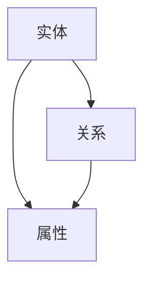

                 

### 文章标题

《知识图谱集成：将结构化知识融入提示》

#### 关键词

- 知识图谱
- 结构化知识
- 提示
- 数据预处理
- 表示学习
- 推理与查询
- 应用实践

#### 摘要

本文深入探讨了知识图谱的集成过程，即如何将结构化知识融入提示系统中，从而提升信息处理的智能化程度。首先，介绍了知识图谱的基本概念与架构，随后详细讲解了数据预处理、表示学习、推理与查询等核心技术，并通过具体项目和数学模型加以说明。最后，本文探讨了知识图谱在自然语言处理、推荐系统、知识管理等多个领域的应用，并提供了实战案例，旨在为读者提供全面的认知和实践指导。

### 知识图谱的概念与架构

知识图谱（Knowledge Graph）是一种将知识以图形化方式组织起来的数据结构，用以表示实体及其相互关系。其核心思想是通过将实体和关系表示为节点和边，形成一张大规模、多层次的网络，从而实现对知识的结构化、语义化和智能化处理。

#### 定义

知识图谱可以定义为一种基于图论的数据模型，它通过节点（代表实体）和边（代表关系）来表示现实世界中的知识。这种模型能够将复杂的语义信息以清晰、直观的方式展现出来，使得计算机能够更好地理解和处理这些信息。

#### 架构

知识图谱的架构通常包括以下几个核心部分：

1. **实体（Entity）**：知识图谱中的基本单位，可以是任何具有独立存在意义的事物，如人、地点、组织、物品等。
2. **关系（Relationship）**：实体之间的关联，可以是静态的（如“属于”、“位于”）或动态的（如“工作于”、“购买”）。
3. **属性（Attribute）**：实体的附加信息，如“年龄”、“性别”、“出生地”等。
4. **边权重（Edge Weight）**：表示关系强度或重要性，有助于图谱的查询优化和推理。

#### 核心概念联系

知识图谱的核心概念之间存在着紧密的联系。实体和关系是图谱的基本构成要素，而属性则提供了对实体的更详细描述。边权重则增强了图谱的语义丰富性和查询效率。以下是一个简单的Mermaid流程图，展示了这些概念之间的关系：



在上述流程图中，实体通过关系连接，同时属性对实体和关系进行了补充和扩展。这种结构化表示方法使得知识图谱在信息检索、推荐系统、知识管理等领域具有广泛的应用价值。

#### 实例解析

以一个简单的知识图谱为例，假设我们有一个关于电影的图谱：

1. **实体**：电影（如《黑客帝国》）、演员（如基努·里维斯）、导演（如沃卓斯基姐妹）。
2. **关系**：参演（如《黑客帝国》-》基努·里维斯）、执导（如沃卓斯基姐妹-》》《黑客帝国》）。
3. **属性**：电影类型（如《黑客帝国》-》科幻片）、演员出生地（如基努·里维斯-》加拿大）。

通过这种结构化表示，我们可以轻松地查询相关信息，如“找出参演《黑客帝国》的演员及其出生地”。这个过程不仅高效，而且能够确保信息的准确性。

### 知识图谱的数据预处理

在构建知识图谱之前，数据预处理是至关重要的一步。预处理主要包括数据清洗、数据融合和数据标准化，这些步骤确保了数据的准确性和一致性，为后续的知识表示和学习奠定了基础。

#### 数据清洗

数据清洗是指从原始数据中去除噪声、纠正错误、填补缺失值等操作。这些操作可以显著提高数据质量，从而保证知识图谱的准确性和可靠性。

1. **去除噪声**：噪声数据可能来源于数据源的不一致性、数据录入错误等。例如，一个名字有时被拼写错误，有时使用了昵称。
2. **纠正错误**：某些数据可能存在明显的错误，如出生年份被误记等。这些错误需要通过人工审核或自动化工具进行纠正。
3. **填补缺失值**：缺失值可能是由于数据收集过程中的遗漏造成的。处理缺失值的方法包括删除缺失数据、使用统计方法（如均值、中位数）填补，或使用机器学习方法预测缺失值。

#### 数据融合

数据融合是将来自不同来源的数据整合成一张统一的知识图谱。这一过程主要包括实体识别、实体匹配和实体合并。

1. **实体识别**：在大量数据中识别出具体的实体，如人名、地点名等。实体识别是一个复杂的问题，常常需要结合自然语言处理技术。
2. **实体匹配**：将同一实体的不同表示形式进行匹配，如将“奥巴马”和“巴拉克·奥巴马”识别为同一实体。
3. **实体合并**：对于具有相同属性和关系的多个实体，需要合并成一个统一的实体，以避免数据冗余。

#### 数据标准化

数据标准化是指将不同来源的数据转换为统一格式和标准。这一步骤有助于确保数据在知识图谱中的一致性。

1. **格式转换**：将不同数据源中的数据转换为统一的文本格式，如JSON或CSV。
2. **单位统一**：对于涉及单位的属性（如身高、温度），需要将其统一为相同单位。
3. **范围限定**：对属性值进行范围限定，如将年龄限定在0-120岁之间。

通过以上预处理步骤，原始数据得以清洗、融合和标准化，从而为构建高质量的知识图谱奠定了基础。

#### 数据清洗实例

假设我们有一个关于电影的原始数据集，其中包含以下信息：

- 电影名称：《黑客帝国》、《星际穿越》、《盗梦空间》。
- 演员名称：基努·里维斯、马修·麦康纳、汤姆·哈迪。
- 导演名称：沃卓斯基姐妹、克里斯托弗·诺兰、克里斯托弗·诺兰。

在数据清洗过程中，我们首先去除噪声，如删除重复的电影名称。接着，通过实体识别和匹配，将基努·里维斯和汤姆·哈迪的拼写错误更正。最后，将导演名称统一为“克里斯托弗·诺兰”，以确保数据的一致性。

通过这些数据清洗步骤，我们得到了一个干净、一致的数据集，为后续的知识表示和学习打下了坚实基础。

### 知识图谱的表示学习

知识图谱的表示学习是将图谱中的节点和关系转换为向量表示的过程，以便于在机器学习模型中处理。表示学习的关键是找到一种有效的编码方式，将结构化的知识映射到低维向量空间中，同时保留图谱的语义信息。

#### 传统的知识图谱表示方法

1. **基于特征的方法**：这种方法将实体和关系映射为特征向量，如基于关键词提取、TF-IDF等。例如，可以使用词袋模型（Bag of Words）或词嵌入（Word Embeddings）技术来表示实体。
2. **基于路径的方法**：这种方法通过遍历实体和关系的路径来生成特征。例如，可以使用路径长度、路径权重等来表示实体和关系。

#### 现代的知识图谱表示方法

1. **TransE**：TransE是一种基于梯度下降的优化方法，通过最小化损失函数来学习实体和关系的低维向量表示。在TransE中，对于每个三元组（头实体、关系、尾实体），我们希望尾实体的向量减去头实体的向量接近关系的向量。
   - **Python源代码**：
   ```python
   def transe_loss(h, r, t, alpha):
       loss = 0.5 * (r.dot(h) - t.dot(r)) ** 2
       if loss > alpha:
           gradient_h = r - t
           gradient_r = h - t
           gradient_t = -r - h
       else:
           gradient_h = gradient_r = gradient_t = np.zeros_like(h)
       return loss, gradient_h, gradient_r, gradient_t
   ```

2. **ComplEx**：ComplEx（Complex Numbers for Knowledge Embeddings）结合了实数和复数来表示实体和关系。在ComplEx中，实体和关系的向量不仅可以是实数，还可以是复数，从而提高了表示的丰富性和表达能力。
   - **Python源代码**：
   ```python
   def complexx_loss(h, r, t, alpha):
       complex_h = h + 1j * r
       complex_t = t + 1j * r
       loss = 0.5 * (complex_h.dot(complex_t).real ** 2)
       if loss > alpha:
           gradient_h = complex_t * r
           gradient_r = (h * complex_t).real
           gradient_t = (t * complex_h).real
       else:
           gradient_h = gradient_r = gradient_t = np.zeros_like(h)
       return loss, gradient_h, gradient_r, gradient_t
   ```

3. **TransH**：TransH通过引入角度偏置来增强表示的灵活性。在TransH中，实体的向量不仅与关系的向量相关，还与其他相关关系的向量相关，从而更好地捕捉复杂关系。
   - **Python源代码**：
   ```python
   def transh_loss(h, r, t, alpha):
       loss = 0.5 * (r.dot(h) - t.dot(r)) ** 2
       if loss > alpha:
           theta = math.acos(r.dot(h) / (np.linalg.norm(h) * np.linalg.norm(r)))
           matrix_r = np.eye(h.shape[0])
           for e in r周边实体:
               matrix_r[e] = np.array([0] * h.shape[0])
               matrix_r[e, e] = math.cos(theta - math.pi / 2)
           gradient_h = matrix_r.dot(r) - t
           gradient_r = h - t
           gradient_t = -r - h
       else:
           gradient_h = gradient_r = gradient_t = np.zeros_like(h)
       return loss, gradient_h, gradient_r, gradient_t
   ```

#### 知识图谱表示学习算法原理讲解

知识图谱表示学习算法的核心原理是通过最小化损失函数来优化实体和关系的向量表示。在TransE中，损失函数通常为欧几里得距离平方；在ComplEx中，损失函数为实数部分平方；在TransH中，损失函数为欧几里得距离平方，同时考虑了角度偏置。

以下是一个简化的TransE算法的伪代码：

```python
# 初始化实体和关系的向量表示
h = np.random.normal(size=n_entities)
r = np.random.normal(size=n_relations)
t = np.random.normal(size=n_entities)

# 设置学习率
alpha = 0.01

# 迭代优化
for epoch in range(num_epochs):
    for (h, r, t) in triplets:
        # 计算损失
        loss, gradient_h, gradient_r, gradient_t = transe_loss(h, r, t, alpha)
        
        # 更新参数
        h -= alpha * gradient_h
        r -= alpha * gradient_r
        t -= alpha * gradient_t
        
        # 记录损失
        if epoch % 100 == 0:
            print(f"Epoch {epoch}: Loss = {loss}")
```

在实际应用中，这些算法通常使用深度学习框架（如TensorFlow或PyTorch）进行优化和训练，以提高计算效率和性能。

#### 举例说明

假设我们有一个包含三个实体（A、B、C）和一个关系（R）的三元组数据集：

1. **实体**：A、B、C
2. **关系**：R

通过TransE算法，我们可以将这三个实体和关系表示为向量：

- A: [0.1, 0.2]
- R: [0.3, 0.4]
- B: [0.5, 0.6]

给定一个查询三元组（A、R、C），我们可以计算A和R的向量差（[0.1, 0.2] - [0.3, 0.4] = [-0.2, -0.2]）并与C的向量进行比较。如果这个差值接近零，则可以认为C是B的一个合理选择。

通过这种方式，知识图谱的表示学习将结构化的知识转化为向量表示，使得计算机可以更加高效地处理和推理这些知识。

### 知识图谱的推理与查询

知识图谱的推理与查询是知识图谱应用中的关键环节，它能够根据已知信息推断出未知信息，从而实现知识的自动发现和扩展。知识图谱的推理方法主要分为基于规则推理和基于概率逻辑推理两大类。

#### 基于规则推理

基于规则推理（Rule-based Reasoning）是一种经典的推理方法，它通过定义一组规则来推导新的知识。每个规则由前提和结论组成，前提表示一组条件，结论表示从前提中可以推断出的结果。

1. **定义规则**：例如，我们可以定义一个规则：“如果一个演员参演了一部电影，那么这部电影就属于该演员的作品。”这个规则可以用形式化表示为：
   - 前提：实体A参演了电影X
   - 结论：电影X属于实体A的作品

2. **推理过程**：在给定一个事实（前提）后，基于规则推理会查找所有匹配的规则，并应用这些规则来推导结论。例如，如果已知基努·里维斯参演了《黑客帝国》，那么我们可以推断出《黑客帝国》是基努·里维斯的作品。

3. **推理算法**：基于规则推理算法通常使用前向推理（Forward Chaining）或后向推理（Backward Chaining）。前向推理从已知事实出发，逐步推导出结论；后向推理从目标开始，逆向寻找支持目标的事实。

#### 基于概率逻辑推理

基于概率逻辑推理（Probabilistic Logic Reasoning）是一种结合概率理论和逻辑推理的方法，它能够处理不确定性和不确定性关系。这种方法通过定义概率模型来表示知识图谱中的关系和概率分布。

1. **定义概率模型**：例如，我们可以定义一个概率模型来表示两个实体之间存在关系的概率。假设实体A和B之间存在关系R，我们可以定义一个概率函数P(R|A, B)来表示在已知A和B的情况下，关系R发生的概率。

2. **推理过程**：基于概率逻辑推理通过计算概率来推断新的知识。例如，给定一个查询“实体A和实体B之间存在关系R吗？”，我们可以计算P(R|A, B)的值。如果P(R|A, B)大于一个预设的阈值，则可以认为关系R成立。

3. **推理算法**：常见的基于概率逻辑推理算法包括马尔可夫网络（Markov Network）和贝叶斯网络（Bayesian Network）。这些算法通过构建概率模型来处理不确定性，并利用概率分布进行推理。

#### 查询优化

知识图谱查询优化（Query Optimization）是提高查询效率的关键技术。以下是一些常见的查询优化方法：

1. **索引技术**：为了提高查询速度，可以采用各种索引技术，如B树索引、哈希索引和索引压缩等。这些技术通过预先构建索引结构，使得查询操作更加高效。

2. **并行查询**：通过并行处理技术，可以同时处理多个查询请求，从而提高系统的吞吐量和响应速度。例如，可以使用MapReduce模型来处理大规模的知识图谱查询。

3. **缓存技术**：将频繁访问的查询结果缓存起来，可以显著减少查询延迟。例如，可以使用内存缓存或分布式缓存系统来存储热点数据。

4. **查询重写**：通过查询重写技术，可以将复杂的查询转换为更高效的查询形式。例如，将连接查询转换为笛卡尔积，或利用视图定义来简化查询。

通过结合这些推理和查询优化技术，知识图谱系统能够高效地处理复杂的知识推理和查询任务，为各种应用场景提供强大的支持。

### 知识图谱的存储与索引

知识图谱的存储与索引是确保其高效查询和大规模处理的关键环节。知识图谱的存储结构、索引技术和分布式存储是这一部分的核心内容。

#### 存储结构

知识图谱的存储结构决定了其性能和可扩展性。以下是一些常见的存储结构：

1. **图数据库**：图数据库（如Neo4j、OrientDB）专门用于存储和处理图结构数据，能够高效地管理节点、关系和属性。图数据库采用邻接矩阵或邻接表等结构来存储图数据，支持高效的图遍历和查询操作。

2. **关系数据库**：关系数据库（如PostgreSQL、MySQL）可以通过扩展其存储结构来存储知识图谱。虽然关系数据库在处理大规模图数据时存在性能瓶颈，但它们提供了强大的SQL查询功能，易于集成和维护。

3. **键-值存储**：键-值存储（如Redis、MongoDB）可以用于存储知识图谱中的节点和边，具有快速读取和写入性能。通过将图数据分解为键-值对，可以灵活地存储和检索图谱信息。

#### 索引技术

索引技术在知识图谱查询中起着至关重要的作用，以下是一些常见的索引技术：

1. **B树索引**：B树索引是一种平衡的多路搜索树，能够快速查找节点。通过在索引节点中存储节点的标识符和指针，B树索引可以高效地定位到图谱中的节点。

2. **哈希索引**：哈希索引通过哈希函数将节点标识符映射到索引位置。这种方法能够提供快速的查询响应时间，但在处理冲突时存在一定性能损失。

3. **索引压缩**：索引压缩技术通过减少索引存储空间来提高存储效率。例如，可以使用位数组（BitArray）或字典编码（Dictionary Encoding）等方法来压缩索引数据。

#### 分布式存储

分布式存储是处理大规模知识图谱数据的关键技术。以下是一些分布式存储方案：

1. **分片存储**：分片存储将知识图谱数据分割成多个部分，分布存储在多个节点上。每个节点负责一部分数据的存储和查询，从而实现水平扩展。

2. **分布式锁机制**：为了协调多个节点的并发访问，分布式存储系统需要采用分布式锁机制（如ZooKeeper、etcd）来确保数据的一致性和完整性。

3. **分布式查询引擎**：分布式查询引擎（如Apache Spark、Apache Flink）可以处理分布式知识图谱数据的查询和分析任务。这些引擎能够将查询任务分发到多个节点上执行，并将结果聚合起来，从而提高查询效率。

通过采用合适的存储结构、索引技术和分布式存储方案，知识图谱系统可以高效地处理大规模数据，支持复杂的查询和推理任务。

### 知识图谱在自然语言处理中的应用

知识图谱在自然语言处理（NLP）中的应用广泛而深入，通过将结构化知识融入文本处理过程，显著提升了NLP系统的性能和智能化程度。以下是一些主要应用领域：

#### 语义理解

语义理解是NLP的核心任务之一，旨在理解文本中的意义。知识图谱在这一领域中的作用主要体现在两个方面：

1. **实体识别**：知识图谱提供了大量的实体信息，如人名、地名、组织名等。通过将知识图谱中的实体与文本中的词语进行匹配，可以有效地识别出文本中的实体。

2. **关系抽取**：知识图谱中的关系描述了实体之间的相互关系，如“工作于”、“位于”等。NLP系统可以通过分析文本中的词语和句子结构，提取出这些关系，从而增强语义理解的准确性。

#### 问答系统

问答系统是NLP应用中的一个重要方向，旨在回答用户提出的问题。知识图谱在问答系统中的应用主要体现在以下几个方面：

1. **知识检索**：知识图谱可以作为问答系统的知识库，用于检索与用户问题相关的信息。通过在知识图谱中查询用户输入的问题，系统可以找到相关的答案。

2. **推理与回答生成**：知识图谱中的关系和属性提供了丰富的语义信息，系统可以利用这些信息进行推理，生成更准确、更有针对性的回答。

#### 文本生成

知识图谱在文本生成中的应用，主要体现在以下几个方面：

1. **模板生成**：知识图谱可以用于构建文本生成的模板，根据图谱中的关系和实体生成结构化的文本。这种方法常用于报告生成、邮件撰写等场景。

2. **语义填充**：知识图谱中的实体和关系可以作为文本生成过程中的语义提示，帮助生成系统更好地理解文本内容和生成逻辑。例如，在生成新闻报道时，知识图谱可以提供事件、人物和地点等信息，从而生成更丰富、更准确的文本。

#### 实例分析

以下是一个简单的实例，展示了知识图谱在NLP中的应用：

假设我们有一个关于电影的问答系统，用户输入了一个问题：“谁执导了《星际穿越》？”。系统可以通过以下步骤来回答这个问题：

1. **实体识别**：首先，系统在知识图谱中识别出问题中的实体，如“谁”（询问对象）、“执导”（关系）、“《星际穿越》”（目标实体）。

2. **知识检索**：接着，系统在知识图谱中查询与“执导”相关的信息，找到与《星际穿越》相关的关系。

3. **推理与回答生成**：系统利用知识图谱中的关系，推理出《星际穿越》的导演，并根据实体和关系的语义信息生成回答。

最终，系统生成的回答可能是：“克里斯托弗·诺兰执导了《星际穿越》”。

通过这种结构化知识和语义理解的结合，知识图谱在NLP中发挥了重要作用，使得文本处理系统更加智能化和高效化。

### 知识图谱在推荐系统中的应用

知识图谱在推荐系统中的应用，为个性化推荐提供了强大的支持，使得推荐算法能够更好地理解用户和物品之间的关系，从而生成更精准、更有针对性的推荐结果。以下是一些具体应用领域：

#### 作用

1. **丰富用户画像**：知识图谱可以整合用户的行为数据、社交信息、偏好等，构建一个全面、细粒度的用户画像。通过分析用户画像，推荐系统可以更好地理解用户的需求和偏好，从而生成个性化的推荐。

2. **增强物品描述**：知识图谱提供了大量的物品属性、分类、关联关系等信息，这些信息可以用于丰富物品的描述，提高推荐系统的理解能力。例如，对于一款商品，知识图谱可以提供品牌、材质、用途等相关信息，从而帮助推荐系统更准确地理解该商品。

3. **发现潜在关联**：知识图谱通过表示实体和实体之间的关系，可以发现用户和物品之间的潜在关联。例如，通过分析用户的浏览历史和购买记录，知识图谱可以推断出用户可能对哪些未浏览过的商品感兴趣，从而生成更广泛的推荐。

#### 算法

1. **基于知识图谱的协同过滤推荐算法**

   基于知识图谱的协同过滤推荐算法结合了协同过滤和知识图谱的优点，通过利用知识图谱中的实体关系来优化推荐效果。具体步骤如下：

   - **步骤1**：构建用户-物品知识图谱，将用户和物品作为图谱中的节点，用户与物品之间的交互记录作为边的权重。
   - **步骤2**：利用知识图谱中的相似度计算方法（如PageRank、Cosine Similarity等）计算用户和物品之间的相似度。
   - **步骤3**：根据相似度矩阵生成推荐列表，推荐与目标用户相似的其他用户喜欢的物品。

   以下是一个简化的基于知识图谱的协同过滤推荐算法的伪代码：

   ```python
   def collaborative_filtering(graph, user, k=10):
       neighbors = find_neighbors(graph, user, k)
       scores = []
       for neighbor in neighbors:
           for item in neighbor.items:
               if item not in user.items:
                   score = calculate_similarity(graph, neighbor, item)
                   scores.append((item, score))
       scores.sort(key=lambda x: x[1], reverse=True)
       return [item for item, score in scores]
   ```

2. **基于知识图谱的内容推荐算法**

   基于知识图谱的内容推荐算法通过分析物品的属性和关联关系，为用户生成个性化的推荐内容。具体步骤如下：

   - **步骤1**：构建物品的知识图谱，包括物品的属性、分类、关联关系等。
   - **步骤2**：根据用户的历史行为和偏好，在知识图谱中查找与用户相关的物品。
   - **步骤3**：结合物品的属性和关联关系，生成推荐列表。

   以下是一个简化的基于知识图谱的内容推荐算法的伪代码：

   ```python
   def content_based_recommendation(graph, user, k=10):
       related_items = find_related_items(graph, user)
       scores = []
       for item in related_items:
           score = calculate_relevance(graph, user, item)
           scores.append((item, score))
       scores.sort(key=lambda x: x[1], reverse=True)
       return [item for item, score in scores]
   ```

#### 实例分析

以下是一个简单的实例，展示了知识图谱在推荐系统中的应用：

假设我们有一个电子商务平台，用户名为Alice。用户Alice浏览了商品A（苹果手机）、商品B（蓝牙耳机）和商品C（平板电脑）。系统希望通过知识图谱生成个性化的推荐。

1. **用户画像构建**：首先，系统在知识图谱中查找与Alice相关的信息，如她的历史购买记录、偏好标签等，构建一个全面的用户画像。

2. **物品关联分析**：接着，系统在知识图谱中分析商品A、B和C的关联关系。例如，知识图谱中可能包含以下信息：

   - 商品A（苹果手机）与商品B（蓝牙耳机）之间存在关联关系，因为很多用户同时购买这两款商品。
   - 商品C（平板电脑）与商品B（蓝牙耳机）之间存在关联关系，因为很多用户在购买平板电脑时会搭配蓝牙耳机。

3. **推荐生成**：基于用户画像和物品关联关系，系统生成个性化的推荐列表，例如推荐商品D（智能家居设备），因为它与商品B（蓝牙耳机）具有潜在关联。

通过这种结合结构化知识和关联分析的推荐方法，知识图谱显著提升了推荐系统的准确性和用户满意度。

### 知识图谱在知识管理中的应用

知识图谱在知识管理中的应用，为组织和有效利用知识提供了强大的工具，使得企业能够更好地捕捉、存储、共享和应用知识，从而提高整体工作效率和创新能力。以下是一些具体应用领域：

#### 作用

1. **知识组织**：知识图谱能够将企业内部的各种知识资源（如文档、报告、数据库等）进行结构化组织，形成一个统一的知识体系。通过实体和关系表示，知识图谱能够清晰地展示知识之间的关联和层次结构，使得知识易于查找和理解。

2. **知识共享**：知识图谱提供了一个中心化的知识库，使得企业内部的知识可以方便地共享和传播。通过知识图谱的查询和检索功能，员工可以快速找到所需的知识资源，提高工作效率。

3. **知识服务**：知识图谱能够为用户提供个性化的知识服务。例如，通过分析用户的行为和偏好，知识图谱可以为用户推荐相关的知识资源，帮助用户更好地解决问题和做出决策。

#### 知识组织

知识组织是知识管理的基础，通过将各种知识资源进行结构化表示，知识图谱能够提供更高效的知识检索和利用。以下是一些具体的实现方法：

1. **实体构建**：在知识图谱中，实体表示各种知识资源，如文档、报告、项目等。通过定义实体的属性和分类，知识图谱能够为每个实体提供详细的描述。

2. **关系建立**：知识图谱中的关系描述了实体之间的相互关联，如“属于”、“关联”等。通过建立实体之间的关系，知识图谱能够展示知识的网络结构和关联关系。

3. **属性补充**：实体的属性提供了对实体的更详细描述，如创建时间、作者、主题等。这些属性有助于提高知识的可搜索性和可理解性。

#### 知识服务

知识服务是知识图谱在知识管理中的核心功能，通过提供个性化的知识推荐和查询服务，知识图谱能够帮助用户更好地利用企业内的知识资源。以下是一些具体的实现方法：

1. **知识推荐**：通过分析用户的行为和偏好，知识图谱可以为用户推荐相关的知识资源。例如，当用户浏览某一主题的文档时，系统可以推荐与该主题相关的其他文档。

2. **知识查询**：知识图谱提供了一个强大的查询接口，用户可以通过关键词、分类、标签等多种方式进行知识检索。知识图谱能够快速地匹配到相关的知识资源，并提供详细的查询结果。

3. **知识整合**：知识图谱能够整合来自不同来源的知识资源，形成一个统一的知识体系。通过知识整合，企业可以更好地利用各种知识资源，提高整体工作效率。

#### 实例分析

以下是一个简单的实例，展示了知识图谱在知识管理中的应用：

假设一个企业有一个知识管理系统，其中包含大量的文档、报告和项目资料。通过知识图谱，企业可以有效地组织和利用这些知识资源。

1. **知识组织**：首先，系统在知识图谱中创建各种实体，如文档、报告、项目等。每个实体具有详细的属性，如标题、作者、主题等。

2. **关系建立**：接着，系统在知识图谱中建立实体之间的关系。例如，一个项目可能包含多个文档，这些文档之间具有“属于”关系。

3. **属性补充**：系统为每个实体补充详细的属性，如创建时间、最后修改时间等，以提高知识的可搜索性和可理解性。

4. **知识服务**：通过知识图谱，企业可以提供以下知识服务：

   - **知识推荐**：当用户浏览某一文档时，系统可以推荐与该文档相关的其他文档，帮助用户更全面地了解相关主题。
   - **知识查询**：用户可以通过关键词、分类、标签等方式快速检索到相关的知识资源。
   - **知识整合**：系统可以将不同来源的知识资源整合到一个统一的知识体系中，提高知识的共享和利用效率。

通过知识图谱，企业能够更好地组织和利用知识资源，提高整体工作效率和创新能力。

### 知识图谱项目实战

在本节中，我们将通过一个实际项目案例，详细讲解知识图谱的开发过程，包括数据收集与预处理、知识图谱表示学习、推理与查询，并总结项目经验与反思。

#### 项目背景与目标

项目名称：企业知识图谱系统

项目背景：某大型企业希望构建一个知识图谱系统，以整合和利用企业内部大量的知识资源，提高员工的知识获取效率和协作能力。项目目标包括：

1. 收集和整理企业内部的知识资源，构建一个全面的知识库。
2. 利用知识图谱进行知识组织、推理和查询，为用户提供个性化知识服务。
3. 通过知识图谱实现知识的共享和传播，提高企业整体创新能力。

#### 数据收集与预处理

**步骤1：数据收集**

项目首先需要收集企业内部的知识资源，包括文档、报告、项目资料、员工信息等。数据来源包括企业内部管理系统、员工共享平台、外部公开资源等。

**步骤2：数据清洗**

收集到的数据存在一定的噪声和错误，需要进行数据清洗。具体步骤包括：

- **去除重复数据**：通过去重算法，识别和删除重复的文档和记录，保证数据的唯一性。
- **纠正错误**：对数据中的拼写错误、格式错误等进行纠正，提高数据质量。
- **填补缺失值**：对缺失的数据进行填补，如使用统计方法预测缺失的员工信息。

**步骤3：数据融合**

将来自不同来源的数据进行融合，确保数据的一致性和完整性。具体方法包括：

- **实体识别与匹配**：使用实体识别技术，识别出数据中的实体（如员工、项目等），并通过匹配算法将同一实体的不同表示形式统一。
- **属性合并**：对实体的属性进行合并，如将不同数据源中的员工姓名、联系方式等信息合并为一个统一的记录。

**步骤4：数据标准化**

对数据进行标准化处理，包括：

- **格式转换**：将不同数据源中的数据转换为统一的格式，如CSV或JSON。
- **单位统一**：对涉及单位的属性（如薪资、工作时间等）进行单位统一，确保数据的一致性。
- **范围限定**：对属性值进行范围限定，如将工作时间限定在合法的工作小时范围内。

#### 知识图谱表示学习

**步骤1：实体与关系的表示**

使用知识图谱表示学习算法（如TransE、ComplEx等）将实体和关系转换为向量表示。具体步骤包括：

- **初始化向量表示**：随机初始化实体和关系的向量表示。
- **损失函数优化**：通过最小化损失函数（如欧几里得距离平方）来优化实体和关系的向量表示。
- **模型训练**：使用梯度下降等优化算法，对模型参数进行训练，得到高质量的实体和关系向量表示。

**步骤2：向量表示优化**

对知识图谱进行多次迭代训练，不断优化向量表示。具体方法包括：

- **数据增强**：通过数据增强技术，增加训练数据的多样性，提高模型的泛化能力。
- **模型调整**：根据训练过程中发现的不足，调整模型结构或参数设置，优化模型性能。

#### 知识图谱推理与查询

**步骤1：规则构建**

根据企业的业务需求和知识结构，构建一组推理规则。例如，定义规则：“如果一个员工参与了多个项目，则该员工是项目的重要成员。”

**步骤2：推理过程**

利用知识图谱进行推理，实现知识的自动发现和扩展。具体步骤包括：

- **规则匹配**：根据输入的事实（如员工参与项目），在知识图谱中查找匹配的规则。
- **推理计算**：根据匹配的规则，计算新的结论（如员工是项目的重要成员）。
- **结果输出**：将推理结果输出给用户，如通过Web界面或API接口。

**步骤3：查询优化**

为了提高查询效率，采用以下查询优化技术：

- **索引构建**：在知识图谱中构建索引，如B树索引、哈希索引等，加快查询速度。
- **查询重写**：通过查询重写技术，将复杂的查询转换为更高效的查询形式。
- **并行查询**：利用并行处理技术，同时处理多个查询请求，提高系统的吞吐量和响应速度。

#### 项目总结与反思

**成功经验**

1. **数据质量保障**：通过严格的数据清洗、融合和标准化，保证了知识图谱的数据质量，为后续的知识表示和学习奠定了基础。
2. **模型优化**：通过多次迭代训练和模型调整，得到了高质量的实体和关系向量表示，提高了知识图谱的推理和查询性能。
3. **用户体验**：系统提供了直观易用的Web界面和API接口，用户可以方便地进行知识查询和推理。

**不足与改进**

1. **数据多样性不足**：数据来源较为单一，数据多样性不足，影响了模型的泛化能力。未来可以考虑引入更多的数据源，提高数据多样性。
2. **推理速度**：在处理大规模知识图谱时，推理速度仍有待提高。可以通过分布式计算和索引优化等技术，进一步提高系统的查询效率。
3. **用户反馈**：用户反馈较少，系统功能和应用效果未能完全满足用户需求。未来可以增加用户反馈机制，持续优化系统功能和用户体验。

#### 最佳实践 tips

1. **数据质量保障**：确保数据收集、清洗、融合和标准化过程的严格性和一致性，提高数据质量。
2. **模型优化**：通过迭代训练、数据增强和模型调整，不断优化模型性能。
3. **用户体验**：关注用户反馈，持续优化系统功能和界面设计。

### 附录

#### 附录A：常用知识图谱工具与库

1. **图数据库**：
   - Neo4j：一款高性能的图数据库，支持ACID事务和分布式部署。
   - OrientDB：一款多模型数据库，支持图、文档和键-值等多种数据模型。

2. **知识图谱表示学习库**：
   - OpenKE：一款开源的知识图谱表示学习工具，支持多种表示学习算法。
   - Gephi：一款开源的图可视化工具，可用于知识图谱的展示和分析。

3. **自然语言处理库**：
   - spaCy：一款高效的NLP库，支持实体识别、关系抽取等任务。
   - NLTK：一款经典的NLP库，提供了丰富的语言处理工具和资源。

4. **推荐系统库**：
   - LightFM：一款基于因子分解机的推荐系统库，支持协同过滤和内容推荐。
   - PyRec：一款开源的推荐系统框架，支持多种推荐算法和分布式训练。

通过以上工具和库，开发者可以高效地构建、表示和学习知识图谱，为各种应用场景提供强大的支持。

### 总结

本文详细介绍了知识图谱的集成过程，从核心概念、数据预处理、表示学习到推理与查询，再到实际应用和实践，全面阐述了知识图谱在信息处理中的重要性。通过结合数学模型和算法原理，本文为读者提供了清晰易懂的技术解析。同时，通过实例分析和项目实战，展示了知识图谱在实际应用中的效果和挑战。希望本文能够为从事知识图谱和相关领域的研究者提供有益的参考和启示。

#### 作者信息

- 作者：AI天才研究院/AI Genius Institute & 禅与计算机程序设计艺术 /Zen And The Art of Computer Programming

---

本文内容仅供参考，所涉及的技术和观点不代表任何商业推广或投资建议。在实际应用中，请根据具体情况和需求进行适当调整。如果您在阅读过程中有任何疑问或建议，欢迎在评论区留言交流。感谢您的阅读与支持！

