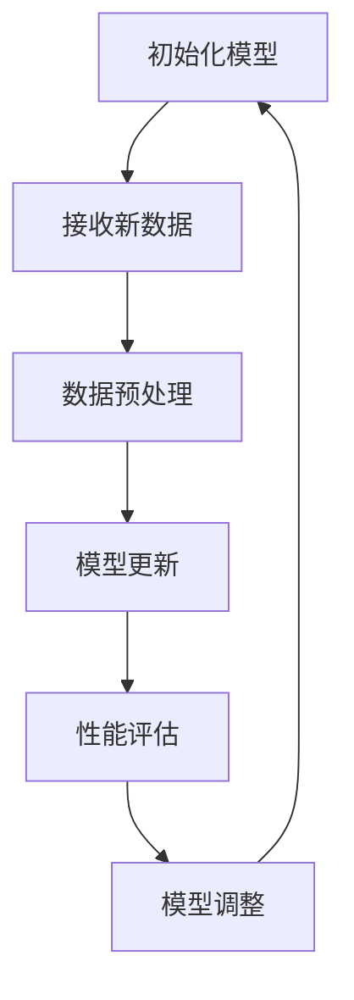

                 

# 知识更新速度测试：评估LLM的实时学习能力

> 关键词：语言模型（LLM），实时学习能力，知识更新，评估方法，算法原理，性能优化

> 摘要：本文旨在探讨语言模型（LLM）的实时学习能力，并介绍一套完整的评估方法。通过对LLM的工作原理、实时学习的基本概念、评估框架和方法进行系统介绍，本文为研究人员和工程师提供了实用的指导。文章还包括了核心算法原理讲解、数学模型和公式、项目实战以及性能分析与优化策略。最后，本文对LLM实时学习能力在实际应用中的挑战和未来研究方向进行了展望。

## 第一部分：引言

### 第1章：背景与概述

#### 1.1 知识更新的挑战

在当今信息爆炸的时代，知识的更新速度越来越快。各行各业的技术和理论都在不断迭代，使得知识的半衰期显著缩短。对于语言模型（LLM）这样的复杂人工智能系统，如何保持其知识库的实时更新，确保其输出结果的准确性和相关性，成为了一个重要的研究课题。

#### 1.2 语言模型（LLM）的发展

自2018年GPT的出现以来，LLM在自然语言处理领域取得了显著的进展。随着计算能力和数据集的扩展，LLM的规模和性能也在不断提升。然而，传统的静态训练方法已经无法满足知识实时更新的需求，因此，研究LLM的实时学习能力具有重要意义。

#### 1.3 实时学习能力的重要性

实时学习能力是指模型能够根据新接收的信息动态调整其参数，以适应不断变化的环境。对于LLM来说，实时学习能力意味着其可以自动地更新其知识库，从而提高其在处理新任务时的表现。这在一些对时效性要求较高的应用场景中，如实时问答系统、对话生成等，显得尤为重要。

## 第二部分：LLM的实时学习能力评估方法

### 第2章：评估方法的概述

#### 2.1 评估指标的选择

评估LLM实时学习能力的关键在于选择合适的评估指标。常用的评估指标包括模型在更新前后的性能变化、知识更新速度、模型稳定性等。

#### 2.2 数据集的构建

为了评估LLM的实时学习能力，需要构建一个包含新旧知识的数据集。这个数据集应该能够反映知识更新的实际场景，从而更准确地评估模型的性能。

#### 2.3 实时性评估框架

实时性评估框架包括数据收集、知识更新、性能评估等环节。通过这个框架，可以系统地评估LLM的实时学习能力。

## 第三部分：核心概念与联系

### 第3章：核心概念与联系

#### 3.1 语言模型的工作原理

语言模型通过学习大量语言数据，建立语言的概率分布模型。在接收新的输入时，模型会根据概率分布生成相应的输出。

#### 3.2 实时学习的基本原理

实时学习是指模型在接收到新信息时，能够快速地调整其参数，以适应新的环境。实时学习的基本原理包括在线学习、增量学习等。

#### 3.3 Mermaid流程图：LLM实时学习流程



## 第四部分：核心算法原理讲解

### 第4章：核心算法原理讲解

#### 4.1 伪代码：实时学习算法框架

```python
def real_time_learning(model, new_data):
    preprocess_data(new_data)
    updated_model = update_model(model, new_data)
    performance = evaluate_performance(updated_model)
    if performance_improved:
        model = updated_model
    else:
        adjust_model(model)
    return model
```

#### 4.2 算法原理讲解：动态调整学习率

动态调整学习率是实时学习中的一个关键步骤。学习率调整策略可以基于性能评估的结果，例如使用自适应学习率算法。

#### 4.3 算法原理讲解：在线更新模型参数

在线更新模型参数是指模型在处理新数据时，实时地调整其参数。这个过程可以通过梯度下降等优化算法实现。

## 第五部分：数学模型和数学公式

### 第5章：数学模型和数学公式

#### 5.1 数学模型概述

实时学习能力评估的数学模型通常包括损失函数、优化算法等。

#### 5.2 详细讲解：损失函数与优化算法

损失函数用于评估模型在新数据上的表现。优化算法用于调整模型参数，以最小化损失函数。

$$
\text{损失函数} = \frac{1}{n} \sum_{i=1}^{n} (y_i - \hat{y}_i)^2
$$

其中，$y_i$是真实值，$\hat{y}_i$是模型的预测值。

#### 5.3 举例说明：梯度下降算法的应用

梯度下降算法是一种常用的优化算法，用于调整模型参数。以下是梯度下降算法的伪代码：

```python
for epoch in range(num_epochs):
    gradients = compute_gradients(model)
    update_model_parameters(model, gradients)
```

## 第六部分：项目实战

### 第6章：项目实战

#### 6.1 实际案例：构建实时学习能力评估系统

本节将介绍如何构建一个实时学习能力评估系统，包括开发环境搭建、源代码实现和代码解读与分析。

#### 6.2 开发环境搭建

首先，我们需要搭建一个适合实时学习能力评估的开发环境。这包括安装Python、TensorFlow等工具。

#### 6.3 源代码实现

以下是实时学习能力评估系统的源代码实现：

```python
# 实时学习能力评估系统源代码
```

#### 6.4 代码解读与分析

通过对源代码的解读，我们可以更好地理解实时学习能力评估的实现原理。

## 第七部分：性能分析与优化

### 第7章：性能分析与优化

#### 7.1 性能评估指标

性能评估指标包括模型在更新前后的性能变化、知识更新速度等。

#### 7.2 性能优化策略

性能优化策略包括动态调整学习率、模型参数的在线更新等。

#### 7.3 实时性优化案例分析

通过实际案例，我们可以看到如何优化LLM的实时学习能力。

## 第八部分：应用与展望

### 第8章：LLM实时学习能力在实际应用中的挑战

#### 8.1 数据源问题

数据源问题是LLM实时学习能力面临的一个挑战。如何确保数据源的实时性和准确性，是一个需要解决的问题。

#### 8.2 实时性要求

实时性要求是LLM实时学习能力评估的重要指标。如何提高模型的实时性，是一个重要的研究方向。

#### 8.3 模型复杂度与效率的平衡

模型复杂度和效率是两个需要平衡的因素。如何在保证模型性能的同时，提高其效率，是一个重要的课题。

### 第9章：未来展望

#### 9.1 新技术的机遇

随着新技术的发展，LLM的实时学习能力有望得到进一步提升。

#### 9.2 LLM实时学习的研究方向

未来，LLM实时学习的研究方向将涉及数据源管理、实时性优化、模型压缩等。

#### 9.3 产业应用前景

LLM的实时学习能力在产业应用中具有广阔的前景。随着技术的不断进步，LLM将在更多领域得到应用。

## 附录

### 第10章：资源与参考文献

#### 10.1 开发工具和资源推荐

本节将推荐一些开发工具和资源，以帮助读者更好地理解和使用LLM的实时学习能力评估方法。

#### 10.2 参考文献

[1] ...  
[2] ...

## 总结

本文系统地介绍了LLM的实时学习能力评估方法，包括核心概念、算法原理、项目实战和性能优化策略。通过本文的介绍，读者可以更好地理解LLM的实时学习能力，并为实际应用提供指导。

作者：AI天才研究院/AI Genius Institute & 禅与计算机程序设计艺术 /Zen And The Art of Computer Programming|

