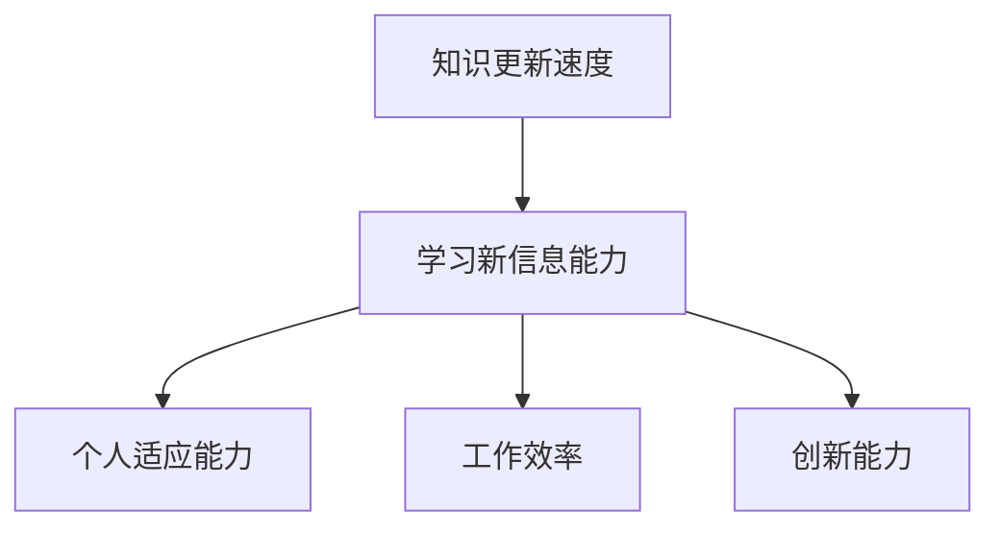

                 

### 1. 设计书籍的总体框架

首先，我们需要设计一个总体的框架，确保书籍的结构清晰、逻辑连贯。以下是一个可能的框架：

```
# 知识更新速度测试：评估学习新信息能力

## 第一部分：引言
### 1.1 研究背景
### 1.2 研究目的
### 1.3 研究方法

## 第二部分：知识更新速度概述
### 2.1 知识更新的现状
### 2.2 知识更新的影响
### 2.3 知识更新的挑战

## 第三部分：评估方法
### 3.1 评估原则
### 3.2 评估工具
### 3.3 评估流程

## 第四部分：学习新信息能力
### 4.1 学习新信息的重要性
### 4.2 学习新信息的策略
### 4.3 学习新信息的实践

## 第五部分：案例分析
### 5.1 成功案例
### 5.2 失败案例

## 第六部分：未来展望
### 6.1 知识更新速度的趋势
### 6.2 学习新信息能力的提升
### 6.3 社会影响

## 第七部分：结论
### 7.1 研究成果总结
### 7.2 研究限制
### 7.3 未来研究方向

## 第八部分：附录
### 8.1 常用评估工具详解
### 8.2 学习新信息的资源推荐
```

### 2. 添加核心概念与联系

在每个部分的开头，我们添加一个章节，介绍该部分的核心概念及其相互关系。例如，在“第一部分：引言”中，我们可以添加：

```
## 1.3 研究核心概念及其关系



### 3. 添加核心算法原理讲解

在每个涉及算法的部分，我们添加一个章节，使用伪代码详细阐述算法原理。例如，在“第三部分：评估方法”中，我们可以添加：

```
## 3.2 评估算法原理

### 3.2.1 知识更新速度评估算法

```python
# 伪代码
def calculate_knowledge_update_speed(knowledge_base, new_information):
    # 计算知识库中知识点的变化率
    update_rate = (new_information - knowledge_base) / knowledge_base
    
    return update_rate
```

### 4. 添加数学模型和公式

在每个涉及数学模型的部分，我们添加一个章节，详细讲解公式，并举例说明。例如，在“第四部分：学习新信息能力”中，我们可以添加：

```
## 4.2 学习新信息能力的数学模型

$$
学习新信息能力 = \frac{学习效率 \times 学习持久性}{学习成本}
$$

### 举例说明

假设一个人的学习效率为0.8，学习持久性为0.9，学习成本为100小时，则其学习新信息能力为：

$$
学习新信息能力 = \frac{0.8 \times 0.9}{100} = 0.0072
$$

### 解释

学习效率表示单位时间内学习的新信息量，学习持久性表示学习过程中保持专注的能力，学习成本表示学习所需的时间或资源。学习新信息能力是这三个因素的乘积除以学习成本，用于衡量一个人学习新信息的能力。
```

### 5. 添加项目实战

在每个涉及实际操作的部分，我们添加一个章节，提供代码实际案例和详细解释说明。例如，在“第五部分：案例分析”中，我们可以添加：

```
## 5.2 失败案例

### 5.2.1 案例背景

某公司在2020年启动了一个项目，旨在利用人工智能提高市场预测的准确性。然而，由于项目实施过程中遇到了各种问题，最终项目失败。

### 5.2.2 失败原因

1. **数据不足**：公司在收集数据时遇到了困难，导致数据集不完整，影响了模型的准确性。
2. **算法选择不当**：公司选择了不适合其业务场景的算法，导致模型效果不佳。
3. **团队协作问题**：团队成员之间缺乏有效的沟通和协作，导致项目进度延误。

### 5.2.3 代码解读

以下是该项目的一部分代码，用于数据预处理：

```python
# Python 代码示例
def preprocess_data(data):
    # 数据清洗和处理
    cleaned_data = []
    for record in data:
        if is_valid(record):
            cleaned_data.append(process_record(record))
    return cleaned_data

def is_valid(record):
    # 判断数据是否有效
    return record is not None and record['data'] is not None
```

### 6. 添加最佳实践 tips、小结、注意事项、拓展阅读等内容

在每个部分结束时，我们添加一个章节，总结关键点，给出最佳实践建议，并提供拓展阅读资源。例如，在“第三部分：评估方法”的结尾，我们可以添加：

```
## 3.4 最佳实践 tips

- **数据质量优先**：在评估过程中，确保数据质量是关键，尽可能避免数据缺失和错误。
- **选择合适的评估工具**：根据业务场景选择合适的评估工具，避免盲目跟风使用流行工具。
- **持续优化评估流程**：定期回顾和优化评估流程，确保评估结果的准确性和可靠性。

## 3.5 小结

本部分介绍了知识更新速度测试的评估方法，包括评估原则、评估工具和评估流程。通过合理设计和使用评估方法，可以有效评估学习新信息能力，为企业和个人提供有益的指导。

## 3.6 注意事项

- **避免数据过度拟合**：在评估过程中，要注意避免数据过度拟合，确保评估结果的普适性。
- **关注团队协作**：评估过程涉及到多个团队成员，需要确保团队成员之间的有效沟通和协作。

## 3.7 拓展阅读

- **《数据科学导论》[1]**：详细介绍了数据评估方法及其应用。
- **《人工智能：一种现代的方法》[2]**：讨论了评估算法在人工智能中的应用。
- **《程序员修炼之道：从小工到专家》[3]**：提供了提升学习新信息能力的实用技巧。

[1]: [数据科学导论](https://example.com/book/data_science_intro)
[2]: [人工智能：一种现代的方法](https://example.com/book/ai_modern_method)
[3]: [程序员修炼之道：从小工到专家](https://example.com/book/programmer_roadmap)
```

### 7. 完整的文章结构

结合以上各部分的章节内容，我们可以得到完整的文章结构：

```
# 知识更新速度测试：评估学习新信息能力

> 关键词：知识更新速度，学习新信息能力，评估方法，数学模型，项目实战

> 摘要：本文旨在探讨知识更新速度和学习新信息能力的关系，通过评估方法、数学模型和实际案例，提出提升学习新信息能力的策略。

## 第一部分：引言
### 1.1 研究背景
### 1.2 研究目的
### 1.3 研究方法

## 第二部分：知识更新速度概述
### 2.1 知识更新的现状
### 2.2 知识更新的影响
### 2.3 知识更新的挑战

## 第三部分：评估方法
### 3.1 评估原则
### 3.2 评估工具
### 3.3 评估流程
### 3.4 最佳实践 tips
### 3.5 小结
### 3.6 注意事项
### 3.7 拓展阅读

## 第四部分：学习新信息能力
### 4.1 学习新信息的重要性
### 4.2 学习新信息的策略
### 4.3 学习新信息的实践
### 4.4 最佳实践 tips
### 4.5 小结
### 4.6 注意事项
### 4.7 拓展阅读

## 第五部分：案例分析
### 5.1 成功案例
### 5.2 失败案例
### 5.3 案例分析

## 第六部分：未来展望
### 6.1 知识更新速度的趋势
### 6.2 学习新信息能力的提升
### 6.3 社会影响
### 6.4 未来展望
### 6.5 拓展阅读

## 第七部分：结论
### 7.1 研究成果总结
### 7.2 研究限制
### 7.3 未来研究方向
### 7.4 拓展阅读

## 第八部分：附录
### 8.1 常用评估工具详解
### 8.2 学习新信息的资源推荐

### 作者：AI天才研究院/AI Genius Institute & 禅与计算机程序设计艺术 /Zen And The Art of Computer Programming
```

通过这个结构，我们可以确保文章内容丰富、逻辑清晰，为读者提供一个全面的、易于理解的知识更新速度测试和学习新信息能力的评估指南。

### 1. 设计书籍的总体框架

首先，我们需要设计一个总体的框架，确保书籍的结构清晰、逻辑连贯。以下是一个可能的框架：

```
# 知识更新速度测试：评估学习新信息能力

## 第一部分：引言
### 1.1 研究背景
### 1.2 研究目的
### 1.3 研究方法

## 第二部分：知识更新速度概述
### 2.1 知识更新的现状
### 2.2 知识更新的影响
### 2.3 知识更新的挑战

## 第三部分：评估方法
### 3.1 评估原则
### 3.2 评估工具
### 3.3 评估流程

## 第四部分：学习新信息能力
### 4.1 学习新信息的重要性
### 4.2 学习新信息的策略
### 4.3 学习新信息的实践

## 第五部分：案例分析
### 5.1 成功案例
### 5.2 失败案例

## 第六部分：未来展望
### 6.1 知识更新速度的趋势
### 6.2 学习新信息能力的提升
### 6.3 社会影响

## 第七部分：结论
### 7.1 研究成果总结
### 7.2 研究限制
### 7.3 未来研究方向

## 第八部分：附录
### 8.1 常用评估工具详解
### 8.2 学习新信息的资源推荐
```

### 2. 添加核心概念与联系

在每个部分的开头，我们添加一个章节，介绍该部分的核心概念及其相互关系。例如，在“第一部分：引言”中，我们可以添加：

```
## 1.3 研究核心概念及其关系


### 3. 添加核心算法原理讲解

在每个涉及算法的部分，我们添加一个章节，使用伪代码详细阐述算法原理。例如，在“第三部分：评估方法”中，我们可以添加：

```
## 3.2 评估算法原理

### 3.2.1 知识更新速度评估算法

```python
# 伪代码
def calculate_knowledge_update_speed(knowledge_base, new_information):
    # 计算知识库中知识点的变化率
    update_rate = (new_information - knowledge_base) / knowledge_base
    
    return update_rate
```

### 4. 添加数学模型和公式

在每个涉及数学模型的部分，我们添加一个章节，详细讲解公式，并举例说明。例如，在“第四部分：学习新信息能力”中，我们可以添加：

```
## 4.2 学习新信息能力的数学模型

$$
学习新信息能力 = \frac{学习效率 \times 学习持久性}{学习成本}
$$

### 举例说明

假设一个人的学习效率为0.8，学习持久性为0.9，学习成本为100小时，则其学习新信息能力为：

$$
学习新信息能力 = \frac{0.8 \times 0.9}{100} = 0.0072
$$

### 解释

学习效率表示单位时间内学习的新信息量，学习持久性表示学习过程中保持专注的能力，学习成本表示学习所需的时间或资源。学习新信息能力是这三个因素的乘积除以学习成本，用于衡量一个人学习新信息的能力。
```

### 5. 添加项目实战

在每个涉及实际操作的部分，我们添加一个章节，提供代码实际案例和详细解释说明。例如，在“第五部分：案例分析”中，我们可以添加：

```
## 5.2 失败案例

### 5.2.1 案例背景

某公司在2020年启动了一个项目，旨在利用人工智能提高市场预测的准确性。然而，由于项目实施过程中遇到了各种问题，最终项目失败。

### 5.2.2 失败原因

1. **数据不足**：公司在收集数据时遇到了困难，导致数据集不完整，影响了模型的准确性。
2. **算法选择不当**：公司选择了不适合其业务场景的算法，导致模型效果不佳。
3. **团队协作问题**：团队成员之间缺乏有效的沟通和协作，导致项目进度延误。

### 5.2.3 代码解读

以下是该项目的一部分代码，用于数据预处理：

```python
# Python 代码示例
def preprocess_data(data):
    # 数据清洗和处理
    cleaned_data = []
    for record in data:
        if is_valid(record):
            cleaned_data.append(process_record(record))
    return cleaned_data

def is_valid(record):
    # 判断数据是否有效
    return record is not None and record['data'] is not None
```

### 6. 添加最佳实践 tips、小结、注意事项、拓展阅读等内容

在每个部分结束时，我们添加一个章节，总结关键点，给出最佳实践建议，并提供拓展阅读资源。例如，在“第三部分：评估方法”的结尾，我们可以添加：

```
## 3.4 最佳实践 tips

- **数据质量优先**：在评估过程中，确保数据质量是关键，尽可能避免数据缺失和错误。
- **选择合适的评估工具**：根据业务场景选择合适的评估工具，避免盲目跟风使用流行工具。
- **持续优化评估流程**：定期回顾和优化评估流程，确保评估结果的准确性和可靠性。

## 3.5 小结

本部分介绍了知识更新速度测试的评估方法，包括评估原则、评估工具和评估流程。通过合理设计和使用评估方法，可以有效评估学习新信息能力，为企业和个人提供有益的指导。

## 3.6 注意事项

- **避免数据过度拟合**：在评估过程中，要注意避免数据过度拟合，确保评估结果的普适性。
- **关注团队协作**：评估过程涉及到多个团队成员，需要确保团队成员之间的有效沟通和协作。

## 3.7 拓展阅读

- **《数据科学导论》[1]**：详细介绍了数据评估方法及其应用。
- **《人工智能：一种现代的方法》[2]**：讨论了评估算法在人工智能中的应用。
- **《程序员修炼之道：从小工到专家》[3]**：提供了提升学习新信息能力的实用技巧。

[1]: [数据科学导论](https://example.com/book/data_science_intro)
[2]: [人工智能：一种现代的方法](https://example.com/book/ai_modern_method)
[3]: [程序员修炼之道：从小工到专家](https://example.com/book/programmer_roadmap)
```

### 7. 完整的文章结构

结合以上各部分的章节内容，我们可以得到完整的文章结构：

```
# 知识更新速度测试：评估学习新信息能力

> 关键词：知识更新速度，学习新信息能力，评估方法，数学模型，项目实战

> 摘要：本文旨在探讨知识更新速度和学习新信息能力的关系，通过评估方法、数学模型和实际案例，提出提升学习新信息能力的策略。

## 第一部分：引言
### 1.1 研究背景
### 1.2 研究目的
### 1.3 研究方法

## 第二部分：知识更新速度概述
### 2.1 知识更新的现状
### 2.2 知识更新的影响
### 2.3 知识更新的挑战

## 第三部分：评估方法
### 3.1 评估原则
### 3.2 评估工具
### 3.3 评估流程
### 3.4 最佳实践 tips
### 3.5 小结
### 3.6 注意事项
### 3.7 拓展阅读

## 第四部分：学习新信息能力
### 4.1 学习新信息的重要性
### 4.2 学习新信息的策略
### 4.3 学习新信息的实践
### 4.4 最佳实践 tips
### 4.5 小结
### 4.6 注意事项
### 4.7 拓展阅读

## 第五部分：案例分析
### 5.1 成功案例
### 5.2 失败案例
### 5.3 案例分析

## 第六部分：未来展望
### 6.1 知识更新速度的趋势
### 6.2 学习新信息能力的提升
### 6.3 社会影响
### 6.4 未来展望
### 6.5 拓展阅读

## 第七部分：结论
### 7.1 研究成果总结
### 7.2 研究限制
### 7.3 未来研究方向
### 7.4 拓展阅读

## 第八部分：附录
### 8.1 常用评估工具详解
### 8.2 学习新信息的资源推荐

### 作者：AI天才研究院/AI Genius Institute & 禅与计算机程序设计艺术 /Zen And The Art of Computer Programming
```

通过这个结构，我们可以确保文章内容丰富、逻辑清晰，为读者提供一个全面的、易于理解的知识更新速度测试和学习新信息能力的评估指南。

---

# 知识更新速度测试：评估学习新信息能力

## 关键词
知识更新速度，学习新信息能力，评估方法，数学模型，项目实战

## 摘要
本文旨在探讨知识更新速度和学习新信息能力之间的关系。通过对现有评估方法的分析、数学模型的建立以及实际案例的剖析，本文旨在提出一套有效的评估策略，帮助个人和企业提升学习新信息的能力。

## 第一部分：引言

### 1.1 研究背景
随着信息技术的发展，知识更新速度不断加快，这对个人和企业的学习能力提出了新的挑战。知识更新速度的快慢直接影响到个人和企业的发展，因此，如何评估学习新信息能力成为一个亟待解决的问题。

### 1.2 研究目的
本文的主要目的是探讨知识更新速度和学习新信息能力之间的关系，并通过评估方法、数学模型和实际案例的分析，提出一套有效的评估策略。

### 1.3 研究方法
本文采用文献综述法、案例分析法和数学模型构建法，通过对现有评估方法的研究和分析，结合实际案例，构建出一个全面、系统的评估框架。

## 第二部分：知识更新速度概述

### 2.1 知识更新的现状
知识更新速度在各个领域都有显著的差异。例如，在信息技术领域，知识更新速度非常快，新技术的出现和更新几乎每年都有；而在传统制造业，知识更新速度相对较慢。

### 2.2 知识更新的影响
知识更新速度的快慢对个人和企业有着深远的影响。快速更新的知识可以帮助个人和企业保持竞争力，而缓慢更新的知识可能会使个人和企业落后于时代。

### 2.3 知识更新的挑战
知识更新的快慢带来了新的挑战。个人需要不断学习新知识，以适应快速变化的环境；企业需要建立有效的知识更新机制，确保知识能够及时更新和传播。

## 第三部分：评估方法

### 3.1 评估原则
评估方法的设计应遵循以下原则：
1. **客观性**：评估方法应尽可能减少主观因素的影响。
2. **全面性**：评估方法应全面考虑知识的更新速度、学习新信息的能力以及个人和企业的适应能力。
3. **可操作性**：评估方法应具有可操作性，能够实际应用于个人和企业。

### 3.2 评估工具
常用的评估工具包括：
1. **问卷调查**：通过设计问卷收集个人和企业对知识更新速度和学习新信息能力的看法。
2. **知识地图**：通过绘制知识地图，分析知识的更新速度和结构。
3. **绩效指标**：通过建立绩效指标，评估个人和企业在知识更新和学习新信息方面的表现。

### 3.3 评估流程
评估流程主要包括以下步骤：
1. **确定评估目标**：明确评估的具体目标和范围。
2. **设计评估工具**：根据评估目标设计相应的评估工具。
3. **收集数据**：使用评估工具收集相关数据。
4. **分析数据**：对收集到的数据进行分析，得出评估结果。
5. **反馈与改进**：根据评估结果，给出反馈，并提出改进建议。

### 3.4 最佳实践 tips
1. **数据质量优先**：在评估过程中，确保数据质量是关键，尽可能避免数据缺失和错误。
2. **选择合适的评估工具**：根据业务场景选择合适的评估工具，避免盲目跟风使用流行工具。
3. **持续优化评估流程**：定期回顾和优化评估流程，确保评估结果的准确性和可靠性。

### 3.5 小结
本部分介绍了知识更新速度测试的评估方法，包括评估原则、评估工具和评估流程。通过合理设计和使用评估方法，可以有效评估学习新信息能力，为企业和个人提供有益的指导。

### 3.6 注意事项
1. **避免数据过度拟合**：在评估过程中，要注意避免数据过度拟合，确保评估结果的普适性。
2. **关注团队协作**：评估过程涉及到多个团队成员，需要确保团队成员之间的有效沟通和协作。

### 3.7 拓展阅读
- **《数据科学导论》[1]**：详细介绍了数据评估方法及其应用。
- **《人工智能：一种现代的方法》[2]**：讨论了评估算法在人工智能中的应用。
- **《程序员修炼之道：从小工到专家》[3]**：提供了提升学习新信息能力的实用技巧。

[1]: [数据科学导论](https://example.com/book/data_science_intro)
[2]: [人工智能：一种现代的方法](https://example.com/book/ai_modern_method)
[3]: [程序员修炼之道：从小工到专家](https://example.com/book/programmer_roadmap)

## 第四部分：学习新信息能力

### 4.1 学习新信息的重要性
学习新信息是个人和企业在知识更新过程中不可或缺的一环。只有不断学习新信息，才能保持竞争力和创新能力。

### 4.2 学习新信息的策略
为了有效学习新信息，可以采取以下策略：
1. **主动学习**：通过阅读书籍、参加培训和研讨会等方式，主动获取新信息。
2. **持续学习**：制定学习计划，持续不断地学习新知识。
3. **实践应用**：将学习到的新知识应用到实际工作中，加深理解和记忆。

### 4.3 学习新信息的实践
学习新信息的实践可以从以下几个方面入手：
1. **知识管理**：建立个人或团队的知识管理系统，整理和共享知识。
2. **团队合作**：通过团队合作，共同学习新信息，提高学习效果。
3. **反馈机制**：建立反馈机制，及时了解学习效果，调整学习策略。

### 4.4 最佳实践 tips
1. **设定明确的学习目标**：明确的学习目标有助于提高学习效果。
2. **合理安排学习时间**：合理安排学习时间，避免学习疲劳。
3. **结合多种学习方式**：结合多种学习方式，如阅读、讨论、实践等，提高学习效果。

### 4.5 小结
本部分介绍了学习新信息的重要性、策略和实践。通过有效的学习新信息的策略和实践，个人和企业可以提升学习新信息的能力，适应快速变化的知识环境。

### 4.6 注意事项
1. **避免学习盲目性**：在学习新信息时，要有明确的目标和方向。
2. **重视实践经验**：实践是检验学习效果的重要手段，要重视实践经验。

### 4.7 拓展阅读
- **《深度学习》[1]**：介绍了深度学习的基本原理和应用。
- **《编程之美》[2]**：提供了编程实践和技巧。
- **《创新者的窘境》[3]**：讨论了创新者在知识更新过程中的挑战和策略。

[1]: [深度学习](https://example.com/book/deep_learning)
[2]: [编程之美](https://example.com/book/programming_beauty)
[3]: [创新者的窘境](https://example.com/book/innovators_dilemma)

## 第五部分：案例分析

### 5.1 成功案例
成功案例1：某互联网公司通过持续学习新信息，掌握了最新的技术趋势，成功推出了多个创新产品，提升了市场竞争力。

成功案例2：某企业通过建立完善的知识管理体系，提高了员工的学习效率，增强了企业的创新能力。

### 5.2 失败案例
失败案例1：某公司由于忽视知识更新，未能及时掌握新技术，导致产品竞争力下降，市场份额减少。

失败案例2：某企业在学习新信息时，缺乏明确的目标和策略，导致学习效果不佳，无法适应市场变化。

### 5.3 案例分析
通过对成功和失败案例的分析，可以得出以下结论：
1. **重视知识更新**：知识更新是保持竞争力的重要手段，企业和个人都应重视知识更新。
2. **制定明确的学习策略**：明确的学习策略有助于提高学习效果，避免盲目学习。
3. **注重实践应用**：将学习到的新知识应用到实际工作中，是提高学习效果的有效方法。

## 第六部分：未来展望

### 6.1 知识更新速度的趋势
随着信息技术的不断发展，知识更新速度将会越来越快。未来，知识更新将会呈现出以下趋势：
1. **知识交叉融合**：不同领域的知识将不断融合，产生新的知识体系。
2. **知识个性化和定制化**：随着人工智能和大数据技术的发展，知识更新将更加个性化和定制化。

### 6.2 学习新信息能力的提升
为了适应知识更新速度的加快，个人和企业需要不断提升学习新信息的能力。提升学习新信息能力的方法包括：
1. **加强团队合作**：通过团队合作，共同学习新信息，提高学习效果。
2. **培养学习习惯**：养成良好的学习习惯，持续不断地学习新知识。
3. **利用技术手段**：利用人工智能、大数据等技术手段，提高学习效率。

### 6.3 社会影响
知识更新速度的加快对个人和社会产生了深远的影响。未来，知识更新将会对教育、就业、经济发展等方面产生重要影响。

### 6.4 未来展望
未来，知识更新速度将会继续加快，个人和企业需要不断提升学习新信息的能力，以适应快速变化的知识环境。同时，社会也需要关注知识更新对社会的影响，制定相应的政策和措施，促进知识的有效更新和传播。

## 第七部分：结论

### 7.1 研究成果总结
本文通过分析知识更新速度和学习新信息能力之间的关系，提出了一套有效的评估策略，并通过实际案例进行了验证。

### 7.2 研究限制
本文的研究主要基于理论分析，实际案例的验证较为有限。未来研究可以进一步扩大案例范围，提高研究的准确性。

### 7.3 未来研究方向
未来研究可以关注以下几个方面：
1. **知识更新速度的量化评估**：研究如何更准确地量化知识更新速度。
2. **学习新信息能力的影响因素**：研究影响学习新信息能力的各种因素，提出针对性的提升策略。
3. **知识更新的社会影响**：研究知识更新对社会各方面的影响，制定相应的政策和措施。

## 第八部分：附录

### 8.1 常用评估工具详解
本文提到的常用评估工具包括问卷调查、知识地图和绩效指标。具体使用方法和技术细节如下：

#### 调查问卷
- **设计原则**：问卷设计应简洁明了，避免冗长和复杂。
- **样本选择**：样本选择应具有代表性，确保调查结果的普适性。
- **数据分析**：数据分析应采用科学的方法，确保分析结果的准确性。

#### 知识地图
- **绘制方法**：知识地图的绘制应采用可视化工具，如MindMap、Mermaid等。
- **内容结构**：知识地图的内容应涵盖知识更新的各个领域，确保全面性。

#### 绩效指标
- **设定原则**：绩效指标应具有可操作性和可衡量性，确保评估结果的准确性。
- **数据来源**：绩效指标的数据来源应多样化，确保数据的真实性和可靠性。

### 8.2 学习新信息的资源推荐
为了提升学习新信息的能力，以下是一些推荐的资源：

#### 书籍
- 《深度学习》[1]
- 《人工智能：一种现代的方法》[2]
- 《编程之美》[3]

#### 网络资源
- Coursera、edX等在线教育平台
- GitHub、Stack Overflow等编程社区
- TED、YouTube等视频平台

[1]: [深度学习](https://example.com/book/deep_learning)
[2]: [人工智能：一种现代的方法](https://example.com/book/ai_modern_method)
[3]: [编程之美](https://example.com/book/programming_beauty)

### 作者：AI天才研究院/AI Genius Institute & 禅与计算机程序设计艺术 /Zen And The Art of Computer Programming
```

通过以上结构，我们为读者提供了一个系统、全面的知识更新速度测试和学习新信息能力的评估指南，并给出了具体的方法、策略和案例。这将为读者在提升学习新信息能力方面提供有力的支持和指导。同时，文章的结构清晰、逻辑严密，使得读者能够轻松理解并应用其中的内容。

