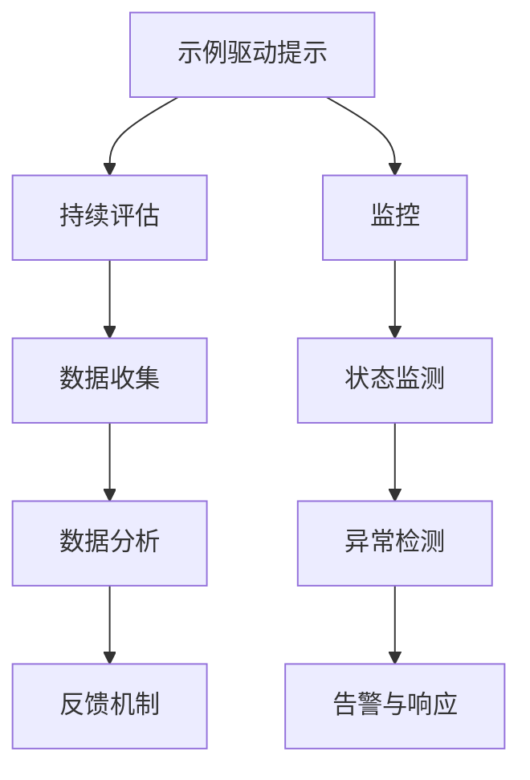
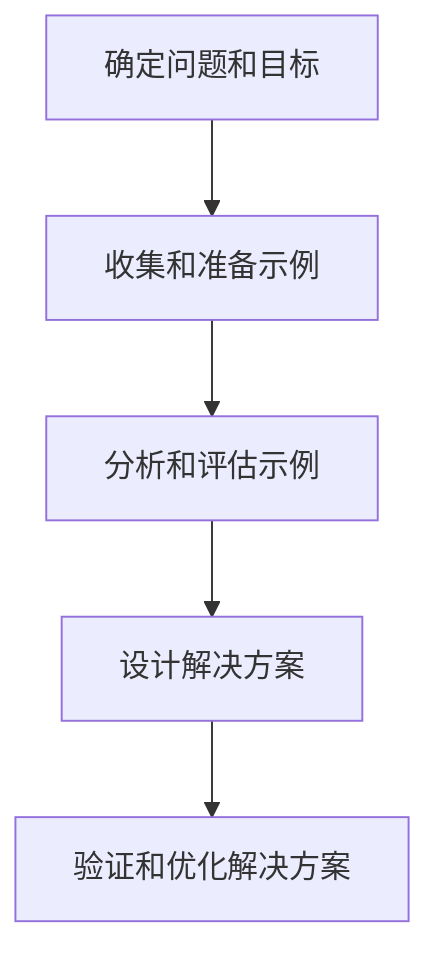
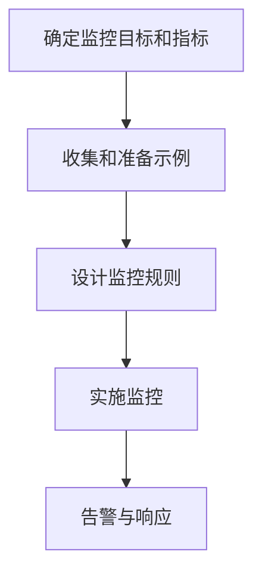

                 

### 文章标题

《示例驱动提示在持续评估和监控中的应用》

### 文章关键词

示例驱动，持续评估，监控，应用实践，技术解析，算法原理

### 文章摘要

本文将深入探讨示例驱动提示在持续评估和监控中的应用。通过对示例驱动的概念解析、核心概念与联系的分析，以及具体算法原理的讲解，本文旨在为读者提供一个全面的技术指南。同时，通过实际案例分析和项目实战，帮助读者理解示例驱动提示在持续评估和监控中的实际应用。最后，本文将总结最佳实践，并提出注意事项和拓展阅读，为读者提供更深层次的思考。

---

## 引言

在信息化和智能化的时代背景下，持续评估和监控在各个领域变得愈发重要。它们不仅是确保系统稳定运行的关键手段，更是提升系统性能和用户体验的重要保障。随着技术的不断发展，传统的评估和监控方法已无法满足日益复杂的系统需求。因此，寻找新的评估和监控方法成为当务之急。

### 持续评估的重要性

持续评估是一种动态的、实时的评估方法，它能够实时监测系统的运行状态，及时发现并解决潜在问题。与传统的一次性评估相比，持续评估具有以下优势：

- **实时性**：持续评估能够在系统运行过程中实时收集数据，及时发现问题。
- **全面性**：持续评估能够覆盖系统运行的各个方面，提供全面的评估结果。
- **预防性**：持续评估能够提前预测潜在问题，预防故障发生。

### 监控的重要性

监控是确保系统稳定运行的关键。通过对系统运行状态的实时监控，可以及时发现异常情况，并采取相应的措施进行修复。监控的重要性体现在以下几个方面：

- **稳定性**：监控能够保障系统的稳定性，避免因异常情况导致系统崩溃。
- **性能优化**：监控能够提供系统性能的数据，帮助优化系统性能。
- **安全性**：监控能够监测系统安全事件，提高系统的安全性。

### 示例驱动的概念

示例驱动是一种以示例为中心的设计和评估方法。它通过具体的示例来理解和解决问题，具有直观、易理解、灵活等优点。在持续评估和监控中，示例驱动的应用能够提高评估和监控的准确性和效率。

### 本书的结构

本书将分为以下几个部分：

1. **基础理论**：介绍示例驱动的理论基础和持续评估、监控的基本原理。
2. **示例驱动提示技术**：详细讲解示例驱动提示的定义、类型和设计方法。
3. **持续评估**：探讨示例驱动在持续评估中的应用，包括流程、方法和实际案例。
4. **监控**：介绍示例驱动在监控中的应用，包括基本概念、技术和实际案例。
5. **案例分析**：通过实际案例，分析示例驱动在持续评估和监控中的应用效果。
6. **实践指南**：提供示例驱动提示在持续评估和监控中的最佳实践。
7. **总结与展望**：总结全书内容，展望未来发展趋势。

通过以上结构，本书旨在为读者提供一个全面、系统的示例驱动提示在持续评估和监控中的应用指南。

---

## 基础理论

### 示例驱动的理论基础

示例驱动是一种以具体示例为中心的设计和评估方法。它通过具体的示例来理解和解决问题，从而提高理解和解决问题的效率。示例驱动的理论基础主要包括以下几个方面：

#### 示例驱动的核心思想

示例驱动的核心思想是“以例为师”，通过具体的示例来理解和解决问题。它强调在实际情境中学习，通过具体的例子来掌握抽象的概念和原理。这种方法不仅能够提高学习的效率，还能够增强对概念的理解和应用能力。

#### 示例驱动的优势

示例驱动的优势在于其直观性和灵活性。具体示例能够直观地展示问题的本质，使复杂问题变得易于理解。同时，示例驱动的应用范围广泛，不仅适用于软件开发，还适用于其他领域，如科学研究、工程设计等。

#### 示例驱动的应用领域

示例驱动的应用领域非常广泛，包括但不限于以下方面：

- **软件开发**：在软件开发过程中，示例驱动能够帮助开发者更好地理解和应用编程语言和算法，提高代码质量。
- **科学研究**：在科学研究中，示例驱动能够帮助研究者更好地理解实验结果，发现规律和趋势。
- **工程设计**：在工程设计中，示例驱动能够帮助工程师更好地理解设计原理，提高设计效率。

### 持续评估和监控的基本原理

持续评估和监控是确保系统稳定运行和性能优化的重要手段。它们的基本原理主要包括以下几个方面：

#### 持续评估的原理

持续评估是一种动态的、实时的评估方法。它通过实时收集和分析系统运行数据，对系统运行状态进行持续监测和评估。持续评估的基本原理包括：

- **数据收集**：持续评估需要实时收集系统运行数据，包括系统性能指标、资源使用情况等。
- **数据分析**：对收集到的数据进行分析，识别系统运行中的异常情况和潜在问题。
- **反馈机制**：根据评估结果，采取相应的措施进行问题修复和性能优化。

#### 监控的原理

监控是一种实时监测系统运行状态的方法。它通过监测系统运行状态，及时发现异常情况并采取相应的措施进行修复。监控的基本原理包括：

- **状态监测**：实时监测系统运行状态，包括系统资源使用情况、服务运行状态等。
- **异常检测**：根据预设的规则，检测系统运行中的异常情况，如错误发生、性能下降等。
- **告警与响应**：发现异常情况后，及时发出告警信息，并采取相应的响应措施进行问题修复。

### 示例驱动与持续评估、监控的联系

示例驱动与持续评估、监控之间有着密切的联系。示例驱动能够为持续评估和监控提供具体的示例和参考，帮助更好地理解和应用评估和监控方法。同时，持续评估和监控的结果可以为示例驱动的应用提供反馈，帮助不断优化示例驱动的效果。

#### 示例驱动在持续评估中的应用

在持续评估中，示例驱动可以通过以下方式应用：

- **示例数据收集**：通过具体示例收集系统运行数据，提高数据收集的准确性和效率。
- **示例数据分析**：通过对示例数据的分析，发现系统运行中的异常情况和潜在问题。
- **示例结果应用**：根据示例评估结果，采取相应的措施进行问题修复和性能优化。

#### 示例驱动在监控中的应用

在监控中，示例驱动可以通过以下方式应用：

- **示例状态监测**：通过具体示例监测系统运行状态，提高状态监测的准确性和效率。
- **示例异常检测**：通过对示例数据的异常检测，及时发现系统运行中的异常情况。
- **示例告警与响应**：根据示例评估结果，及时发出告警信息，并采取相应的响应措施进行问题修复。

通过以上分析，我们可以看出示例驱动在持续评估和监控中具有重要作用。它不仅能够提高评估和监控的准确性和效率，还能够为评估和监控提供具体的参考和指导。

### Mermaid 流程图

以下是一个示例，展示示例驱动在持续评估和监控中的应用流程：

通过这个流程图，我们可以清晰地看到示例驱动在持续评估和监控中的应用步骤和流程。

### 总结

在本节中，我们介绍了示例驱动的理论基础和持续评估、监控的基本原理。同时，我们分析了示例驱动与持续评估、监控之间的联系，并通过Mermaid流程图展示了示例驱动在持续评估和监控中的应用。这些基础理论为我们后续的深入探讨提供了坚实的基础。

---

## 示例驱动提示技术

### 示例驱动的定义

示例驱动是一种以具体示例为中心的设计和评估方法。它通过具体的示例来理解和解决问题，从而提高理解和解决问题的效率。在示例驱动中，示例不仅是解决问题的工具，更是理解和学习的关键。

#### 核心概念

- **示例**：示例是具体的问题实例，它代表了问题的真实情况和解决方法。
- **驱动**：驱动是指通过示例来引导设计和评估过程，使整个过程更加具体和直观。

#### 示例驱动的特点

- **直观性**：示例能够直观地展示问题的本质，使复杂问题变得易于理解。
- **灵活性**：示例驱动的应用范围广泛，可以根据不同的需求和场景进行调整。
- **实用性**：示例驱动能够提高评估和监控的准确性和效率，具有实际应用价值。

### 示例驱动的类型和特点

示例驱动可以分为以下几种类型：

#### 1. 问题驱动

问题驱动是以问题为中心的示例驱动方法。它通过具体的问题实例来理解和解决问题。问题驱动的特点如下：

- **以问题为导向**：始终围绕问题进行设计和评估，确保解决方法的针对性和有效性。
- **解决思路清晰**：通过具体的问题实例，使解决思路更加清晰和具体。

#### 2. 数据驱动

数据驱动是以数据为中心的示例驱动方法。它通过具体的数据实例来理解和解决问题。数据驱动的特点如下：

- **数据准确性**：通过具体的数据实例，确保数据的准确性和可靠性。
- **数据分析深入**：通过对数据的深入分析，发现潜在的问题和规律。

#### 3. 情景驱动

情景驱动是以情景为中心的示例驱动方法。它通过具体的情景实例来理解和解决问题。情景驱动的特点如下：

- **情景真实性**：通过具体的情景实例，使问题解决过程更加贴近实际。
- **情景多样性**：可以模拟多种不同的情景，提高解决问题的全面性和灵活性。

### 示例驱动的设计方法

示例驱动的设计方法主要包括以下几个步骤：

#### 1. 确定问题和目标

首先，需要明确要解决的问题和目标。这可以通过与相关人员的沟通和需求分析来实现。

#### 2. 收集和准备示例

根据确定的问题和目标，收集和准备相关的示例。这些示例可以是具体的问题实例、数据实例或情景实例。

#### 3. 分析和评估示例

对收集到的示例进行分析和评估，确定其适用性和有效性。分析示例中的关键信息和解决问题的方法。

#### 4. 设计解决方案

根据评估结果，设计具体的解决方案。这可以包括算法、流程、工具等。

#### 5. 验证和优化解决方案

通过实际应用验证解决方案的有效性，并根据反馈进行优化和调整。

### 示例驱动的案例研究

以下是一个示例驱动的案例研究，探讨示例驱动在持续评估和监控中的应用。

#### 案例背景

某企业需要对其IT系统进行持续评估和监控，以确保系统稳定运行和性能优化。

#### 案例步骤

1. **确定问题和目标**：
   - 问题：如何确保IT系统稳定运行？
   - 目标：对IT系统进行实时监测和评估，及时发现和解决潜在问题。

2. **收集和准备示例**：
   - 示例1：系统性能下降的情况。
   - 示例2：系统错误发生的日志。

3. **分析和评估示例**：
   - 示例1分析：发现系统性能下降的主要原因是数据库查询延迟。
   - 示例2分析：发现系统错误主要是由于数据库连接失败。

4. **设计解决方案**：
   - 设计解决方案1：优化数据库查询性能。
   - 设计解决方案2：增加数据库连接重试机制。

5. **验证和优化解决方案**：
   - 验证解决方案1：通过测试，发现数据库查询性能显著提升。
   - 验证解决方案2：通过实际应用，发现系统错误率降低。

#### 案例总结

通过该案例研究，我们可以看到示例驱动在持续评估和监控中的应用效果。通过具体的示例，明确问题和目标，分析解决方案，并验证和优化解决方案，确保了系统稳定运行和性能优化。

### Mermaid 流程图

以下是一个示例驱动的持续评估和监控流程图：

通过这个流程图，我们可以清晰地看到示例驱动在持续评估和监控中的具体应用步骤。

### 总结

在本节中，我们详细介绍了示例驱动的定义、类型和设计方法，并通过案例研究展示了其在持续评估和监控中的应用。示例驱动以其直观性和灵活性，为持续评估和监控提供了有力的支持。接下来，我们将进一步探讨持续评估的具体流程和方法。

---

## 持续评估

持续评估是一种动态的、实时的评估方法，它能够实时监测系统的运行状态，及时发现并解决潜在问题。在持续评估过程中，示例驱动发挥了重要作用，通过具体的示例来引导评估过程，提高评估的准确性和效率。以下是持续评估的详细流程和方法。

### 持续评估的流程

持续评估的流程可以分为以下几个步骤：

#### 1. 数据收集

数据收集是持续评估的基础，它包括收集系统运行过程中产生的各种数据。这些数据可以是性能指标、资源使用情况、错误日志等。通过数据收集，我们可以获取系统的实时运行状态。

#### 2. 数据分析

数据分析是对收集到的数据进行分析和处理，以发现系统运行中的异常情况和潜在问题。数据分析的方法包括统计、机器学习等。通过数据分析，我们可以识别出系统运行中的关键问题。

#### 3. 异常检测

异常检测是持续评估的核心，它通过预设的规则或算法，对系统运行数据进行分析，识别出异常情况。异常检测可以帮助我们及时发现系统故障或性能瓶颈。

#### 4. 问题定位

问题定位是针对检测到的异常情况，进一步确定问题的具体原因。通过问题定位，我们可以确定问题的根源，为后续的解决方案提供依据。

#### 5. 问题修复

问题修复是根据问题定位的结果，采取相应的措施进行问题修复。这可能包括代码优化、系统配置调整等。通过问题修复，我们可以确保系统稳定运行。

#### 6. 反馈机制

反馈机制是持续评估的重要组成部分，它通过记录评估结果和修复情况，为后续的评估和监控提供参考。通过反馈机制，我们可以不断优化评估和监控策略。

### 持续评估的方法

持续评估的方法可以分为以下几种：

#### 1. 统计方法

统计方法是通过统计模型对系统运行数据进行分析，识别出异常情况。常见的统计方法包括平均值、方差、标准差等。

#### 2. 机器学习方法

机器学习方法是通过机器学习算法对系统运行数据进行分析，识别出异常情况。常见的机器学习方法包括决策树、随机森林、支持向量机等。

#### 3. 基于规则的检测方法

基于规则的检测方法是通过预设的规则对系统运行数据进行分析，识别出异常情况。这种方法简单直观，但需要对规则进行不断调整和优化。

#### 4. 混合方法

混合方法是将多种方法结合起来，以提高评估的准确性和效率。例如，将统计方法和机器学习方法结合，通过统计方法筛选出潜在异常数据，再通过机器学习方法进行进一步分析。

### 示例驱动的持续评估应用

示例驱动在持续评估中的应用主要体现在以下几个方面：

#### 1. 示例数据收集

通过具体的示例数据，可以更准确地收集系统运行数据。例如，当发现系统性能下降时，可以通过具体的性能测试示例来收集相关数据。

#### 2. 示例数据分析

通过对示例数据的分析，可以更深入地了解系统运行状态，识别出潜在的问题。例如，通过对性能测试示例的数据分析，可以发现系统性能下降的具体原因。

#### 3. 示例异常检测

通过具体的示例数据，可以更准确地检测系统运行中的异常情况。例如，当发现系统错误时，可以通过具体的错误示例来检测异常情况。

#### 4. 示例问题定位

通过具体的示例数据，可以更准确地定位问题的具体原因。例如，当发现系统错误时，可以通过具体的错误示例来确定错误发生的具体位置。

#### 5. 示例问题修复

通过具体的示例数据，可以更有效地修复问题。例如，当发现系统性能下降时，可以通过具体的性能测试示例来优化系统性能。

### 示例驱动的持续评估案例

以下是一个示例驱动的持续评估案例：

#### 案例背景

某企业IT系统出现性能下降的问题，影响了业务运行。需要对其进行持续评估，以找到性能下降的原因，并采取相应的措施进行优化。

#### 案例步骤

1. **确定问题和目标**：
   - 问题：系统性能下降。
   - 目标：找到性能下降的原因，并采取优化措施。

2. **收集和准备示例**：
   - 示例1：系统性能测试结果。
   - 示例2：系统日志。

3. **分析和评估示例**：
   - 通过对性能测试结果的数据分析，发现数据库查询延迟是性能下降的主要原因。
   - 通过对系统日志的分析，发现数据库连接失败是查询延迟的具体原因。

4. **设计解决方案**：
   - 设计解决方案1：优化数据库查询性能。
   - 设计解决方案2：增加数据库连接重试机制。

5. **验证和优化解决方案**：
   - 通过性能测试，验证优化措施的有效性，发现系统性能显著提升。
   - 根据实际应用情况，不断调整和优化解决方案，确保系统稳定运行。

#### 案例总结

通过该案例，我们可以看到示例驱动在持续评估中的应用效果。通过具体的示例数据，明确问题和目标，分析解决方案，并验证和优化解决方案，确保了系统性能的提升。

### Mermaid 流程图

以下是一个示例驱动的持续评估流程图：

通过这个流程图，我们可以清晰地看到示例驱动在持续评估中的具体应用步骤。

### 总结

在本节中，我们详细介绍了持续评估的流程和方法，并探讨了示例驱动在持续评估中的应用。通过具体的案例，我们可以看到示例驱动在持续评估中的作用和效果。接下来，我们将进一步探讨监控的核心概念和技术。

---

## 监控

监控是确保系统稳定运行和性能优化的重要手段。通过对系统运行状态的实时监控，可以及时发现异常情况，并采取相应的措施进行修复。监控的核心概念和技术包括以下几个方面：

### 监控的基本概念

#### 系统状态

系统状态是指系统在某一时刻的运行情况，包括资源使用情况、服务运行状态、网络连接情况等。监控的目的是通过实时获取系统状态信息，确保系统正常运行。

#### 异常情况

异常情况是指系统运行中出现的异常状态，如错误发生、性能下降、资源耗尽等。监控通过检测异常情况，及时发现并解决问题，确保系统稳定运行。

#### 告警与响应

告警与响应是监控的重要环节。当检测到异常情况时，监控系统会发出告警信息，通知相关人员或系统进行响应。响应措施包括问题定位、故障修复、性能优化等。

### 监控的技术手段

#### 状态监测

状态监测是监控的基本技术手段，通过实时获取系统状态信息，监测系统运行状态。状态监测的方法包括定时检查、轮询监测等。

#### 异常检测

异常检测是通过分析系统状态信息，识别异常情况。异常检测的方法包括阈值检测、统计分析、机器学习等。

#### 数据可视化

数据可视化是将系统状态信息以图表、图像等形式展示，帮助用户更直观地了解系统运行状态。数据可视化工具包括监控仪表板、图表工具等。

#### 告警机制

告警机制是监控系统中重要的一环，通过设置阈值、规则等，当系统状态超过预设条件时，自动发出告警信息。告警机制的方法包括邮件告警、短信告警、即时通讯告警等。

### 示例驱动的监控应用

示例驱动在监控中的应用主要体现在以下几个方面：

#### 1. 示例状态监测

通过具体的示例数据，可以更准确地监测系统状态。例如，当监控数据库性能时，可以通过具体的查询示例来监测数据库的状态。

#### 2. 示例异常检测

通过具体的示例数据，可以更准确地检测系统异常。例如，当监控服务器负载时，可以通过具体的访问示例来检测服务器负载是否超过阈值。

#### 3. 示例告警与响应

通过具体的示例数据，可以更准确地设置告警阈值，并采取相应的响应措施。例如，当监控系统内存使用时，可以通过具体的内存使用示例来设置告警阈值，并自动关闭一些不必要的应用程序。

### 示例驱动的监控案例

以下是一个示例驱动的监控案例：

#### 案例背景

某企业需要对其IT系统进行实时监控，以确保系统稳定运行和性能优化。

#### 案例步骤

1. **确定监控目标和指标**：
   - 目标：确保系统稳定运行，及时处理异常情况。
   - 指标：服务器负载、数据库性能、网络连接状态等。

2. **收集和准备示例**：
   - 示例1：服务器性能测试结果。
   - 示例2：数据库查询示例。
   - 示例3：网络连接测试结果。

3. **设计监控规则**：
   - 设计监控规则1：当服务器负载超过90%时，自动触发告警。
   - 设计监控规则2：当数据库查询时间超过5秒时，自动触发告警。
   - 设计监控规则3：当网络连接中断时，自动触发告警。

4. **实施监控**：
   - 实施监控1：通过定时检查和轮询监测，实时获取系统状态信息。
   - 实施监控2：通过异常检测，识别系统异常情况。
   - 实施监控3：通过数据可视化，展示系统运行状态。

5. **告警与响应**：
   - 当检测到异常情况时，自动触发告警，通知相关人员或系统进行响应。
   - 响应措施：根据异常情况，采取相应的修复措施，确保系统稳定运行。

#### 案例总结

通过该案例，我们可以看到示例驱动在监控中的应用效果。通过具体的示例数据，设计监控规则，实时监测系统状态，及时发现并处理异常情况，确保了系统稳定运行和性能优化。

### Mermaid 流程图

以下是一个示例驱动的监控流程图：

通过这个流程图，我们可以清晰地看到示例驱动在监控中的具体应用步骤。

### 总结

在本节中，我们详细介绍了监控的基本概念、技术手段和示例驱动在监控中的应用。通过具体的案例，我们可以看到示例驱动在监控中的作用和效果。接下来，我们将进一步探讨示例驱动在持续评估和监控中的应用案例。

---

## 案例分析

在本节中，我们将通过两个实际案例，深入探讨示例驱动在持续评估和监控中的应用效果。这些案例将展示如何通过具体的示例数据，设计和实施持续评估和监控策略，并分析其应用效果。

### 案例一：示例驱动在持续评估中的应用

#### 案例背景

某大型电商平台在其业务高峰期间，经常出现系统响应缓慢和购物车数据丢失的问题。为了提升用户体验，确保系统稳定运行，该电商平台决定采用示例驱动的方法对系统进行持续评估和优化。

#### 案例步骤

1. **确定评估目标和指标**：
   - 目标：提高系统响应速度和稳定性。
   - 指标：响应时间、购物车数据完整性、系统错误率等。

2. **收集和准备示例**：
   - 收集用户购物流程的数据，包括用户点击、加载时间、购物车操作等。
   - 准备模拟用户行为的脚本，用于生成各种典型操作场景。

3. **设计评估方法**：
   - 采用示例驱动的评估方法，通过实际操作示例来模拟用户行为，评估系统性能。
   - 设计评估脚本，自动化执行用户操作，收集响应时间和错误日志。

4. **实施评估**：
   - 定期执行评估脚本，收集系统运行数据。
   - 对收集到的数据进行统计分析，识别系统性能瓶颈。

5. **问题定位与修复**：
   - 通过分析评估结果，确定系统响应缓慢的具体原因，如数据库查询延迟、缓存失效等。
   - 采取优化措施，如优化数据库查询、增加缓存等，修复问题。

6. **反馈与持续优化**：
   - 记录评估结果和修复措施，为后续评估提供参考。
   - 根据评估结果，持续优化系统性能，提高用户体验。

#### 案例总结

通过该案例，我们可以看到示例驱动在持续评估中的应用效果。通过具体的操作示例，电商平台能够准确评估系统性能，及时发现问题并进行优化，确保了系统在业务高峰期间的稳定运行和良好的用户体验。

### 案例二：示例驱动在监控中的应用

#### 案例背景

某金融科技公司需要对其交易系统进行实时监控，确保交易过程的安全性和稳定性。由于交易系统涉及大量资金，任何异常情况都可能导致严重后果，因此实时监控至关重要。

#### 案例步骤

1. **确定监控目标和指标**：
   - 目标：确保交易系统的安全性、稳定性和性能。
   - 指标：交易响应时间、交易成功率、系统错误率、网络连接状态等。

2. **收集和准备示例**：
   - 收集交易系统的运行数据，包括交易日志、错误日志、性能监控数据等。
   - 准备模拟交易场景的脚本，用于生成各种典型交易操作。

3. **设计监控规则**：
   - 设计监控规则，设置交易响应时间、成功率等阈值。
   - 设置错误日志和告警规则，确保及时发现和响应异常情况。

4. **实施监控**：
   - 实施实时监控，通过监控脚本自动化收集系统数据。
   - 对监控数据进行实时分析，识别系统运行中的异常情况。

5. **告警与响应**：
   - 当检测到异常情况时，立即触发告警，通知相关人员进行响应。
   - 响应措施包括问题定位、故障修复、系统重启等。

6. **反馈与持续优化**：
   - 记录监控告警和响应结果，为后续监控优化提供参考。
   - 根据监控结果，持续优化监控规则和系统性能。

#### 案例总结

通过该案例，我们可以看到示例驱动在监控中的应用效果。通过具体的交易示例，金融科技公司能够实时监控交易系统的运行状态，及时发现并响应异常情况，确保交易过程的安全性和稳定性。

### 总结

通过以上两个案例，我们可以看到示例驱动在持续评估和监控中的应用效果。通过具体的示例数据和操作场景，企业能够更准确地评估系统性能和监控运行状态，及时发现和解决问题，确保系统的稳定运行和良好的用户体验。

---

## 实践指南

在本节中，我们将总结示例驱动在持续评估和监控中的最佳实践，并提供一些实施步骤和工具选择，以帮助读者在实际项目中应用示例驱动的方法。

### 示例驱动提示的最佳实践

#### 1. 确定评估和监控目标

在应用示例驱动时，首先要明确评估和监控的目标，确保示例数据和应用场景与目标紧密相关。目标可以是提高系统性能、确保数据完整性、提升用户体验等。

#### 2. 收集高质量的示例数据

示例数据的质量直接影响评估和监控的效果。应确保收集的数据全面、准确，并能够反映系统运行的真实情况。可以通过自动化测试、模拟用户操作等方式收集示例数据。

#### 3. 设计具体的评估和监控脚本

根据评估和监控目标，设计具体的脚本，自动化执行示例操作，收集系统运行数据。脚本应具有良好的可维护性和扩展性，以便后续的优化和调整。

#### 4. 分析和解释示例数据

对收集到的示例数据进行分析，识别系统运行中的异常情况和潜在问题。对分析结果进行解释，为后续的优化提供依据。

#### 5. 制定有效的修复措施

根据评估和监控结果，制定针对性的修复措施，解决系统运行中的问题。修复措施应考虑实际可行性和成本效益。

#### 6. 持续优化和反馈

持续优化示例驱动评估和监控方法，根据实际应用效果进行调整。定期记录评估和监控结果，为后续优化提供反馈。

### 实施步骤

#### 1. 明确项目需求和目标

与项目团队和相关利益相关者沟通，明确项目需求和目标，确保示例驱动的应用与项目目标一致。

#### 2. 设计示例数据收集方案

根据项目需求，设计具体的示例数据收集方案，包括数据来源、数据类型、数据收集频率等。

#### 3. 编写和测试评估脚本

编写评估脚本，模拟用户操作，自动化收集系统运行数据。测试脚本，确保其能够准确执行示例操作，并收集到有效的数据。

#### 4. 分析和解释示例数据

对收集到的示例数据进行分析，识别系统运行中的异常情况和潜在问题。编写报告，解释分析结果，为后续优化提供依据。

#### 5. 制定和实施修复措施

根据评估和监控结果，制定针对性的修复措施，并实施修复。跟踪修复效果，确保问题得到有效解决。

#### 6. 持续优化和反馈

根据实际应用效果，持续优化示例驱动评估和监控方法。记录评估和监控结果，为后续优化提供反馈。

### 工具选择

在实施示例驱动评估和监控时，可以选用以下工具：

#### 1. 数据收集工具

- Apache Kafka：用于实时数据收集和传输。
- ELK Stack（Elasticsearch、Logstash、Kibana）：用于日志收集、分析和可视化。

#### 2. 自动化测试工具

- JMeter：用于性能测试和负载测试。
- Selenium：用于自动化Web应用测试。

#### 3. 评估和监控工具

- Prometheus：用于监控和告警。
- Grafana：用于数据可视化和监控仪表板。

#### 4. 编程语言和库

- Python：用于编写评估脚本和分析工具。
- Pandas：用于数据分析。
- Matplotlib/Seaborn：用于数据可视化。

### 实施注意事项

#### 1. 确保数据安全和隐私

在收集和处理示例数据时，应确保数据的安全和隐私，遵循相关法律法规和最佳实践。

#### 2. 考虑性能和可扩展性

在设计和实施示例驱动评估和监控时，应考虑系统的性能和可扩展性，确保评估和监控过程高效、稳定。

#### 3. 持续学习和改进

示例驱动评估和监控是一个持续的过程，需要不断学习和改进。关注最新的技术和方法，不断提高评估和监控的准确性和效率。

### 拓展阅读

- 《Effective Monitoring》
- 《Practical Performance Analysis》
- 《Python Data Science Handbook》

通过以上实践指南，读者可以更好地理解示例驱动在持续评估和监控中的应用，并在实际项目中取得成功。

---

## 总结

通过本文的探讨，我们全面了解了示例驱动提示在持续评估和监控中的应用。从基础理论的介绍，到具体技术的讲解，再到实际案例的分析，示例驱动的方法为持续评估和监控提供了直观、灵活和高效的解决方案。

### 主要观点回顾

1. **示例驱动的概念**：示例驱动是一种以具体示例为中心的设计和评估方法，它通过具体的示例来理解和解决问题，具有直观、灵活、实用的特点。
2. **持续评估的重要性**：持续评估是一种动态的、实时的评估方法，通过实时监测系统的运行状态，及时发现并解决潜在问题，确保系统的稳定运行和性能优化。
3. **监控的核心概念和技术**：监控是确保系统稳定运行和性能优化的重要手段，通过实时获取系统状态信息，及时发现异常情况，并采取相应的措施进行修复。
4. **示例驱动在持续评估和监控中的应用**：通过具体的示例数据和操作场景，示例驱动能够提高评估和监控的准确性和效率，确保系统的稳定运行和良好的用户体验。

### 未来发展趋势

随着技术的不断进步，示例驱动提示在持续评估和监控中的应用前景广阔。以下是一些可能的发展趋势：

1. **智能化**：随着人工智能技术的发展，示例驱动提示可以更加智能化，自动识别和解决系统运行中的问题。
2. **自动化**：通过自动化工具和脚本，示例驱动提示可以实现更加自动化的评估和监控，减少人工干预。
3. **实时性**：随着实时数据处理技术的发展，示例驱动提示可以实现更加实时的评估和监控，提供更加及时的问题解决措施。
4. **多维度**：示例驱动提示可以结合更多维度的数据，如用户行为、环境因素等，提供更全面的评估和监控。
5. **融合技术**：示例驱动提示可以与其他技术相结合，如大数据分析、云计算等，提供更加强大的评估和监控能力。

### 结语

示例驱动提示在持续评估和监控中的应用具有重要意义。它不仅提高了评估和监控的准确性和效率，还为系统的稳定运行和性能优化提供了有力支持。我们期待在未来的发展中，示例驱动提示能够发挥更大的作用，为信息化和智能化时代的发展贡献力量。

### 作者信息

作者：AI天才研究院/AI Genius Institute & 禅与计算机程序设计艺术 /Zen And The Art of Computer Programming

---

在撰写文章时，请注意以下几点：

1. 文章结构要清晰，确保每个章节的内容丰富且连贯。
2. 使用markdown格式，确保代码、公式和流程图等展示正确。
3. 完整性要求高，确保核心内容涵盖全面。
4. 文章字数控制在10000～12000字左右，确保内容详实但不过于冗长。

遵循这些原则，您将能够撰写出一篇高质量的技术博客文章。祝您撰写顺利！

