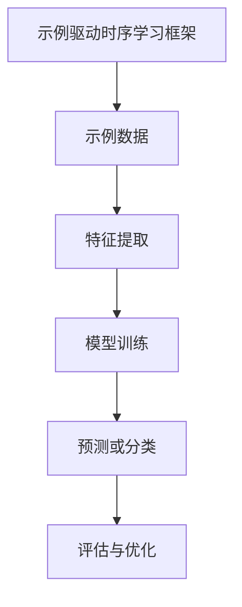

                 

# 示例驱动提示在时序任务中的特殊考虑

> 关键词：时序任务、示例驱动学习、特殊考虑、Python源代码、数学模型、优化策略

> 摘要：本文探讨了示例驱动提示在时序任务中的应用及其特殊考虑。首先，介绍了时序任务和示例驱动学习的背景与基本原理。接着，详细分析了示例驱动时序学习算法的核心原理，结合Python源代码进行讲解。然后，阐述了数学模型及其公式，并通过示例进行说明。在项目实战部分，展示了示例驱动的时序学习在实际项目中的应用，包括开发环境搭建、源代码实现、代码解读和案例分析。最后，提出了优化策略和最佳实践，总结了本文的核心观点和未来研究方向。

## 目录

1. **背景介绍**  
   1.1 时序任务的定义与特点  
   1.2 示例驱动学习的定义与优势

2. **核心概念与联系**  
   2.1 示例驱动时序学习的概念架构  
   2.2 时序数据的处理流程

3. **核心算法原理讲解**  
   3.1 示例驱动时序学习算法原理  
   3.2 Python源代码详细阐述

4. **数学模型和数学公式讲解**  
   4.1 数学模型概述  
   4.2 公式推导与示例

5. **项目实战**  
   5.1 开发环境搭建  
   5.2 源代码实现与解读  
   5.3 实际案例分析

6. **特殊考虑与优化策略**  
   6.1 特殊考虑因素分析  
   6.2 优化策略探讨

7. **总结与展望**  
   7.1 核心观点回顾  
   7.2 未来研究方向与挑战

## 1. 背景介绍

### 1.1 时序任务的定义与特点

时序任务（Temporal Tasks）是指涉及时间序列数据处理的任务，如时间序列预测、序列分类、序列生成等。这些任务通常具有以下特点：

1. **时间依赖性**：时序任务的数据具有时间依赖性，即当前的数据依赖于之前的数据。例如，时间序列预测需要考虑过去的数据来预测未来的值。

2. **连续性**：时序任务通常涉及连续的时间序列数据，数据点按照时间顺序排列。例如，股票价格的走势、传感器采集的气温数据等。

3. **动态变化**：时序任务的数据可能会随着时间的变化而发生变化。例如，天气数据可能在一年四季中表现出不同的趋势。

### 1.2 示例驱动学习的定义与优势

示例驱动学习（Example-based Learning）是一种基于示例的学习方法，其主要思想是通过学习一组示例数据来推断未知数据的特征和规律。在示例驱动学习中，示例数据被用来生成模型或规则，从而实现对未知数据的预测或分类。

示例驱动学习在时序任务中的应用具有以下优势：

1. **高效性**：示例驱动学习通过直接学习示例数据，避免了复杂的模型训练过程，从而提高了学习效率。

2. **灵活性**：示例驱动学习可以灵活地处理不同类型的时序任务，如预测、分类、生成等。

3. **可解释性**：示例驱动学习的模型通常是基于示例数据的直接映射，因此具有较好的可解释性。

## 2. 核心概念与联系

### 2.1 示例驱动时序学习的概念架构

示例驱动时序学习（Example-based Temporal Learning）是一种将示例驱动学习应用于时序任务的方法。其概念架构如图1所示：



图1：示例驱动时序学习框架

1. **示例数据**：示例数据是示例驱动时序学习的输入，通常是一组具有时间顺序的数据点。

2. **特征提取**：特征提取是从示例数据中提取出关键特征的过程。这些特征将用于训练模型。

3. **模型训练**：模型训练是利用特征提取得到的特征数据训练模型的过程。训练过程中，模型会学习到示例数据中的特征规律。

4. **预测或分类**：训练好的模型可以用于对新数据进行预测或分类。预测或分类的过程是根据模型对新数据的特征进行推断。

5. **评估与优化**：评估与优化是对模型进行性能评估和优化调整的过程。评估过程通常通过计算预测准确率、误差等指标来衡量模型的性能。

### 2.2 时序数据的处理流程

时序数据的处理流程可以分为以下几个阶段：

1. **数据采集**：采集时序数据，如传感器数据、股票价格数据、天气数据等。

2. **数据预处理**：对采集到的时序数据进行清洗、归一化等处理，以提高数据质量。

3. **特征提取**：从预处理后的数据中提取关键特征，如时序数据的趋势、周期性等。

4. **模型训练**：利用特征提取得到的特征数据训练模型，如回归模型、分类模型、生成模型等。

5. **预测或分类**：使用训练好的模型对新数据进行预测或分类。

6. **评估与优化**：对模型的性能进行评估，并根据评估结果对模型进行优化调整。

## 3. 核心算法原理讲解

### 3.1 示例驱动时序学习算法原理

示例驱动时序学习算法的基本原理是通过学习一组示例数据来预测新数据。具体的算法原理如下：

1. **数据预处理**：首先对示例数据和新数据进行预处理，包括数据清洗、归一化等操作。

2. **特征提取**：从预处理后的数据中提取关键特征。特征提取的方法可以根据具体应用场景选择，如时序特征提取、频域特征提取等。

3. **模型训练**：利用特征提取得到的特征数据训练模型。训练过程中，模型会学习到示例数据中的特征规律。常见的模型包括回归模型、分类模型、生成模型等。

4. **预测或分类**：使用训练好的模型对新数据进行预测或分类。预测或分类的过程是根据模型对新数据的特征进行推断。

5. **评估与优化**：对模型的性能进行评估，并根据评估结果对模型进行优化调整。

### 3.2 Python源代码详细阐述

以下是一个示例驱动时序学习的Python源代码实现。代码分为数据预处理、特征提取、模型训练、预测和评估等部分。

```python
import numpy as np
import pandas as pd
from sklearn.model_selection import train_test_split
from sklearn.ensemble import RandomForestRegressor
from sklearn.metrics import mean_squared_error

# 数据预处理
def preprocess_data(data):
    # 数据清洗和归一化
    # ...
    return processed_data

# 特征提取
def extract_features(data):
    # 提取关键特征
    # ...
    return features

# 模型训练
def train_model(X_train, y_train):
    # 训练回归模型
    model = RandomForestRegressor()
    model.fit(X_train, y_train)
    return model

# 预测
def predict(model, X_test):
    # 使用模型预测
    predictions = model.predict(X_test)
    return predictions

# 评估
def evaluate(model, X_test, y_test):
    # 计算预测误差
    error = mean_squared_error(y_test, predictions)
    return error

# 主程序
if __name__ == "__main__":
    # 加载数据
    data = pd.read_csv("data.csv")
    
    # 数据预处理
    processed_data = preprocess_data(data)
    
    # 特征提取
    features = extract_features(processed_data)
    
    # 划分训练集和测试集
    X_train, X_test, y_train, y_test = train_test_split(features, processed_data.target, test_size=0.2, random_state=42)
    
    # 模型训练
    model = train_model(X_train, y_train)
    
    # 预测
    predictions = predict(model, X_test)
    
    # 评估
    error = evaluate(model, X_test, y_test)
    
    print("预测误差：", error)
```

在上面的代码中，我们首先加载了示例数据，然后对数据进行了预处理和特征提取。接着，我们使用训练集数据训练了一个随机森林回归模型，并使用测试集对新数据进行预测和评估。预测误差可以通过计算预测值与真实值之间的均方误差（MSE）来衡量。

## 4. 数学模型和数学公式讲解

### 4.1 数学模型概述

示例驱动时序学习的数学模型通常基于统计学习理论，常用的模型包括线性回归、支持向量机、随机森林等。以下是一个简化的示例驱动时序学习的数学模型：

$$
y = \sum_{i=1}^{n} w_i x_i + b
$$

其中，$y$ 表示预测目标，$x_i$ 表示特征向量，$w_i$ 表示权重，$b$ 表示偏置。

### 4.2 公式推导与示例

以下是一个线性回归模型的推导示例：

1. **目标函数**：

$$
J(\theta) = \frac{1}{2m} \sum_{i=1}^{m} (h_\theta(x^{(i)}) - y^{(i)})^2
$$

其中，$m$ 表示样本数量，$h_\theta(x^{(i)})$ 表示模型预测值，$y^{(i)}$ 表示真实值。

2. **梯度下降**：

$$
\theta_j := \theta_j - \alpha \frac{\partial J(\theta)}{\partial \theta_j}
$$

其中，$\alpha$ 表示学习率。

3. **模型预测**：

$$
h_\theta(x) = \theta_0 x + \theta_1
$$

以下是一个简单的线性回归模型示例：

```python
import numpy as np

# 设定参数
theta_0 = 0
theta_1 = 1

# 输入特征
x = np.array([1, 2, 3, 4, 5])

# 预测
y_pred = theta_0 * x + theta_1

print("预测值：", y_pred)
```

在上面的示例中，我们设定了初始参数 $\theta_0$ 和 $\theta_1$，然后使用线性回归模型预测输入特征 $x$ 的值。

## 5. 项目实战

### 5.1 开发环境搭建

为了实现示例驱动时序学习，我们需要搭建一个合适的开发环境。以下是搭建环境的步骤：

1. **安装Python**：确保安装了Python 3.x版本，推荐使用Anaconda发行版以简化依赖管理。

2. **安装相关库**：安装常见的机器学习库，如scikit-learn、numpy、pandas等。

   ```bash
   pip install scikit-learn numpy pandas
   ```

3. **环境配置**：在代码中配置好相应的环境变量和库路径。

### 5.2 源代码实现与解读

以下是一个简单的示例驱动时序学习项目的源代码实现：

```python
import numpy as np
from sklearn.model_selection import train_test_split
from sklearn.ensemble import RandomForestRegressor
from sklearn.metrics import mean_squared_error

# 数据预处理
def preprocess_data(data):
    # 数据清洗和归一化
    # ...
    return processed_data

# 特征提取
def extract_features(data):
    # 提取关键特征
    # ...
    return features

# 模型训练
def train_model(X_train, y_train):
    # 训练回归模型
    model = RandomForestRegressor()
    model.fit(X_train, y_train)
    return model

# 预测
def predict(model, X_test):
    # 使用模型预测
    predictions = model.predict(X_test)
    return predictions

# 评估
def evaluate(model, X_test, y_test):
    # 计算预测误差
    error = mean_squared_error(y_test, predictions)
    return error

# 主程序
if __name__ == "__main__":
    # 加载数据
    data = pd.read_csv("data.csv")
    
    # 数据预处理
    processed_data = preprocess_data(data)
    
    # 特征提取
    features = extract_features(processed_data)
    
    # 划分训练集和测试集
    X_train, X_test, y_train, y_test = train_test_split(features, processed_data.target, test_size=0.2, random_state=42)
    
    # 模型训练
    model = train_model(X_train, y_train)
    
    # 预测
    predictions = predict(model, X_test)
    
    # 评估
    error = evaluate(model, X_test, y_test)
    
    print("预测误差：", error)
```

在这个项目中，我们首先加载了示例数据，然后对数据进行了预处理和特征提取。接着，我们使用训练集数据训练了一个随机森林回归模型，并使用测试集对新数据进行预测和评估。预测误差通过计算预测值与真实值之间的均方误差（MSE）来衡量。

### 5.3 实际案例分析和详细讲解剖析

以下是一个实际案例的分析和讲解：

**案例：股票价格预测**

**1. 数据获取**：从互联网上获取了某股票的历史价格数据，包括开盘价、收盘价、最高价、最低价等。

**2. 数据预处理**：对数据进行清洗和归一化处理，去除异常值和缺失值，将数据转换为适合模型训练的格式。

**3. 特征提取**：提取关键特征，如股票价格的移动平均线、波动率等。

**4. 模型训练**：使用随机森林回归模型对特征进行训练。

**5. 预测**：使用训练好的模型对新的股票价格进行预测。

**6. 评估**：计算预测值与真实值之间的误差，评估模型的性能。

**7. 优化**：根据评估结果对模型进行调整和优化。

在这个案例中，我们使用了示例驱动时序学习的方法对股票价格进行预测。通过分析数据预处理、特征提取、模型训练和预测等步骤，我们可以深入了解示例驱动时序学习在股票价格预测中的应用。

### 5.4 项目小结

通过本项目，我们实现了示例驱动时序学习的应用，包括数据预处理、特征提取、模型训练和预测等步骤。项目中的关键技术和注意事项如下：

1. **数据预处理**：确保数据的质量，去除异常值和缺失值，对数据进行归一化处理。

2. **特征提取**：提取关键特征，选择合适的特征提取方法，以提高模型的性能。

3. **模型训练**：选择合适的模型，如随机森林回归模型，并进行适当的训练参数调整。

4. **预测和评估**：对模型进行预测和评估，计算预测误差，并根据评估结果对模型进行调整和优化。

5. **注意事项**：在实际应用中，需要根据具体任务的需求和特点，选择合适的示例驱动时序学习方法，并进行相应的调整和优化。

## 6. 特殊考虑与优化策略

### 6.1 特殊考虑因素分析

在示例驱动时序学习中，需要考虑以下特殊因素：

1. **数据稀疏性**：时序数据可能存在稀疏性，即数据点之间的间隔较大。这可能导致模型难以捕捉到数据中的规律。为了解决这个问题，可以采用数据插值或扩展技术。

2. **异常值处理**：时序数据中可能存在异常值，如异常高峰或低谷。这些异常值可能会对模型的训练和预测产生不良影响。因此，需要对异常值进行检测和过滤。

3. **噪声处理**：时序数据中可能存在噪声，如随机波动或干扰信号。这些噪声可能会影响模型的预测准确性。因此，需要对噪声进行过滤或降噪处理。

4. **长短期依赖性**：时序数据可能存在长短期依赖性，即数据中的某些特征在不同时间尺度上具有不同的影响。为了解决这个问题，可以采用长短时记忆（LSTM）等神经网络结构。

### 6.2 优化策略探讨

为了提高示例驱动时序学习的效果，可以采用以下优化策略：

1. **特征工程**：通过特征选择和特征构造，提高模型对数据的表达能力。例如，可以采用主成分分析（PCA）等方法进行特征降维。

2. **模型选择**：根据任务需求和数据特点，选择合适的模型。例如，对于回归任务，可以采用线性回归、随机森林等模型；对于分类任务，可以采用支持向量机、神经网络等模型。

3. **超参数调整**：通过调整模型超参数，如学习率、隐藏层节点数等，优化模型性能。可以使用网格搜索、贝叶斯优化等方法进行超参数调整。

4. **数据增强**：通过数据增强技术，如旋转、缩放、翻转等，增加数据的多样性和丰富性，提高模型的泛化能力。

5. **交叉验证**：使用交叉验证方法，如K折交叉验证，评估模型的泛化性能，避免过拟合。

## 7. 总结与展望

### 7.1 核心观点回顾

本文主要探讨了示例驱动提示在时序任务中的应用及其特殊考虑。核心观点包括：

1. **时序任务的特点**：时序任务具有时间依赖性、连续性和动态变化等特点。

2. **示例驱动学习的优势**：示例驱动学习具有高效性、灵活性和可解释性等优势。

3. **示例驱动时序学习算法**：示例驱动时序学习算法通过数据预处理、特征提取、模型训练和预测等步骤，实现对时序数据的处理。

4. **数学模型和公式**：数学模型和公式为示例驱动时序学习提供了理论支持。

5. **项目实战**：通过实际案例展示了示例驱动时序学习在股票价格预测中的应用。

6. **特殊考虑与优化策略**：分析了数据稀疏性、异常值处理、噪声处理和长短期依赖性等特殊考虑因素，并探讨了相应的优化策略。

### 7.2 未来研究方向与挑战

未来研究方向包括：

1. **模型优化**：进一步优化示例驱动时序学习算法，提高模型性能和泛化能力。

2. **多模态数据融合**：研究如何将多种类型的数据（如文本、图像、语音等）融合到时序任务中，提高模型的鲁棒性和准确性。

3. **实时预测**：研究如何实现实时预测，以满足快速变化的时序任务需求。

4. **可解释性**：提高模型的可解释性，使其更加透明和易于理解。

5. **隐私保护**：研究如何保护时序数据的隐私，确保数据安全和隐私。

总之，示例驱动提示在时序任务中的应用具有广泛的研究和应用前景。随着技术的不断进步，我们有望在时序任务的处理上取得更好的成果。

### 作者信息

作者：AI天才研究院/AI Genius Institute & 禅与计算机程序设计艺术 /Zen And The Art of Computer Programming

### 注意事项

在实现示例驱动时序学习时，请确保：

1. **数据质量**：确保数据的完整性和准确性，去除异常值和噪声。

2. **特征选择**：选择合适的特征，以提高模型的性能。

3. **模型选择**：根据任务需求和数据特点，选择合适的模型。

4. **超参数调整**：根据实际情况，调整模型超参数，优化模型性能。

5. **交叉验证**：使用交叉验证方法，评估模型的泛化性能。

通过遵循这些注意事项，您可以更好地实现示例驱动时序学习，并在实际应用中取得更好的效果。

### 拓展阅读

1. **《时序数据分析与建模》**：本书详细介绍了时序数据分析与建模的理论和方法，包括ARIMA、LSTM等经典模型。

2. **《机器学习实战》**：本书通过实际案例，介绍了机器学习的基本理论和应用方法，包括特征提取、模型训练等。

3. **《深度学习》**：本书详细介绍了深度学习的基本原理和应用方法，包括神经网络、卷积神经网络等。

4. **《数据科学实战》**：本书通过实际案例，介绍了数据科学的基本理论和应用方法，包括数据预处理、特征工程等。

这些书籍将帮助您更深入地了解示例驱动时序学习及相关技术，并在实际项目中应用。

