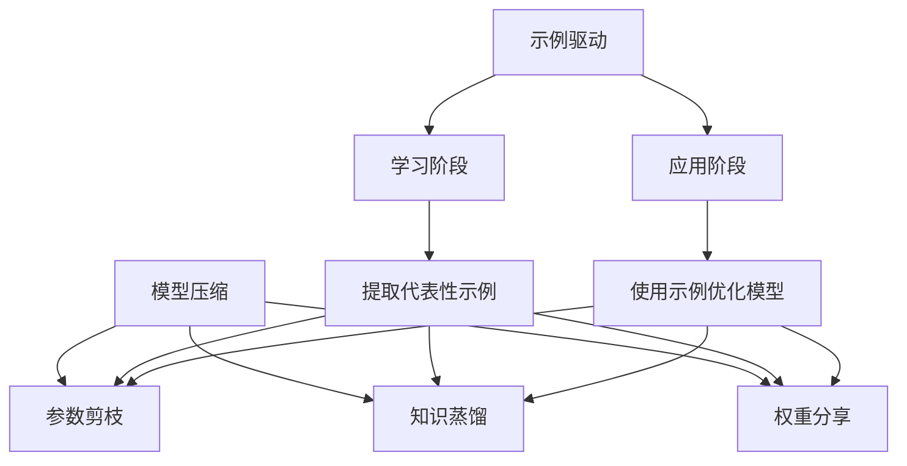

                 

# 示例驱动提示在模型压缩中的潜在应用

## 关键词
- 示例驱动
- 模型压缩
- 参数剪枝
- 知识蒸馏
- 权重分享
- 人工智能

## 摘要
随着人工智能技术的飞速发展，模型压缩成为了一个重要的研究领域。如何高效地对模型进行压缩，以便在保证模型性能的前提下降低计算成本和存储需求，成为了当前研究的热点。本文旨在探讨示例驱动提示在模型压缩中的应用，通过对示例驱动的概念、模型压缩技术基础以及示例驱动的模型压缩方法进行详细分析，探讨其潜在应用及未来发展趋势。

## 引言

### 第一部分：背景与概念

#### 第1章：背景

随着深度学习模型在各个领域的广泛应用，如何对这些模型进行压缩以适应移动设备和嵌入式系统等资源受限的环境，已经成为了一个亟待解决的问题。模型压缩技术通过减少模型的参数数量和计算复杂度，可以在保证模型性能的前提下，降低计算成本和存储需求，提高模型的运行效率。

#### 第2章：概念

##### 1.1 示例驱动的概念

示例驱动是一种基于示例的学习方法，它通过从训练数据中学习代表性的示例，来指导模型的训练和优化。示例驱动的核心思想是利用少量的代表性的示例，来提升模型的泛化能力和性能。

##### 1.2 模型压缩的重要性

模型压缩技术在人工智能领域具有重要意义。一方面，它可以降低模型的计算复杂度和存储需求，提高模型的运行效率；另一方面，它可以帮助我们在有限的计算资源和存储空间下，实现更多高性能的人工智能应用。

##### 1.3 示例驱动与模型压缩的联系

示例驱动与模型压缩有着紧密的联系。通过利用示例驱动方法，我们可以有效地识别和利用代表性的示例，从而优化模型的参数和结构，实现模型的压缩。示例驱动方法在模型压缩中的应用前景十分广阔。

### 第二部分：模型压缩技术基础

#### 第2章：模型压缩技术概述

##### 2.1 模型压缩的基本方法

模型压缩技术主要包括以下几种基本方法：

1. **参数剪枝**：通过剪枝冗余的参数，减少模型的参数数量和计算复杂度。
2. **知识蒸馏**：通过将大量教师模型的权重传递给学生模型，实现模型参数的压缩和优化。
3. **权重分享**：通过将模型中的相似权重进行共享，减少模型的参数数量。

##### 2.2 参数剪枝

1. **剪枝策略**：包括基于敏感度的剪枝、基于重要度的剪枝等。
2. **剪枝算法**：包括基于稀疏性的剪枝算法、基于收缩性的剪枝算法等。

##### 2.3 知识蒸馏

1. **知识蒸馏的原理**：知识蒸馏是一种将教师模型的权重传递给学生模型的方法，通过优化学生模型来减小模型的大小和计算复杂度。
2. **知识蒸馏的实现**：包括软目标蒸馏和硬目标蒸馏等。

##### 2.4 权重分享

1. **权重分享的概念**：权重分享是一种通过将模型中的相似权重进行共享，减少模型参数数量的方法。
2. **权重分享的算法**：包括基于结构的权重分享算法、基于知识的权重分享算法等。

### 第三部分：示例驱动的模型压缩应用

#### 第3章：示例驱动的模型压缩方法

##### 3.1 示例驱动的模型压缩策略

1. **根据示例调整模型结构**：通过分析示例，调整模型的结构，以减少模型的参数数量。
2. **利用示例优化模型参数**：通过示例优化模型的参数，以提高模型的性能。

##### 3.2 示例驱动的模型压缩算法

1. **基于示例的参数剪枝算法**：通过分析示例，识别出冗余的参数，进行剪枝。
2. **基于示例的知识蒸馏算法**：通过利用示例，优化学生模型的权重，实现模型的压缩。

##### 3.3 示例驱动的模型压缩效果评估

1. **评估指标**：包括模型性能、压缩率等。
2. **评估方法**：包括实验验证和理论分析等。

### 第四部分：案例分析

#### 第4章：案例一：语音识别模型压缩

##### 4.1 语音识别模型压缩的需求

随着语音识别技术的广泛应用，如何对语音识别模型进行压缩，以适应移动设备和嵌入式系统等资源受限的环境，是一个重要的研究课题。

##### 4.2 示例驱动的语音识别模型压缩

1. **如何利用示例驱动压缩语音识别模型**：通过分析语音数据中的代表性示例，调整模型的结构和参数，实现模型的压缩。
2. **示例驱动的语音识别模型压缩效果**：通过实验验证，评估示例驱动方法在语音识别模型压缩中的效果。

##### 4.3 代码实战：语音识别模型压缩

1. **实现流程**：介绍语音识别模型压缩的实现流程。
2. **代码解读**：对实现代码进行详细解读。

#### 第5章：案例二：图像分类模型压缩

##### 5.1 图像分类模型压缩的需求

随着图像分类技术在各个领域的应用，如何对图像分类模型进行压缩，以适应移动设备和嵌入式系统等资源受限的环境，是一个重要的研究课题。

##### 5.2 示例驱动的图像分类模型压缩

1. **如何利用示例驱动压缩图像分类模型**：通过分析图像数据中的代表性示例，调整模型的结构和参数，实现模型的压缩。
2. **示例驱动的图像分类模型压缩效果**：通过实验验证，评估示例驱动方法在图像分类模型压缩中的效果。

##### 5.3 代码实战：图像分类模型压缩

1. **实现流程**：介绍图像分类模型压缩的实现流程。
2. **代码解读**：对实现代码进行详细解读。

### 第五部分：未来展望

#### 第6章：模型压缩与示例驱动的未来趋势

##### 6.1 未来的挑战与机遇

1. **模型压缩面临的挑战**：如何提高模型压缩的效果，如何在有限的资源下实现高效的模型压缩。
2. **示例驱动在模型压缩中的应用前景**：示例驱动方法在模型压缩中的应用前景广阔，有望在未来的模型压缩研究中发挥重要作用。

##### 6.2 技术发展趋势

1. **参数剪枝的发展趋势**：研究更加高效和准确的参数剪枝算法。
2. **知识蒸馏的发展趋势**：探索新的知识蒸馏方法和应用场景。
3. **权重分享的发展趋势**：研究更有效的权重分享算法和结构设计。

##### 6.3 示例驱动的未来发展方向

1. **示例驱动的改进策略**：研究更加有效的示例选择和优化策略。
2. **示例驱动的算法优化**：探索新的示例驱动算法，提高模型压缩的效果。

### 附录

##### 附录A：参考资料

1. **与本书相关的参考文献**：列出与本文相关的参考文献，以便读者进一步学习和研究。
2. **模型压缩和示例驱动的研究资料**：提供相关的模型压缩和示例驱动的研究资料，为读者提供更多的学习资源。

##### 附录B：代码实现

1. **示例驱动的模型压缩代码示例**：提供示例驱动的模型压缩代码示例，以便读者进行实践和验证。
2. **相关工具和框架的使用方法**：介绍相关工具和框架的使用方法，帮助读者更好地理解和应用示例驱动的模型压缩方法。

### 作者信息

作者：AI天才研究院/AI Genius Institute & 禅与计算机程序设计艺术 /Zen And The Art of Computer Programming

---

**注**：本文仅为示例，具体内容需要根据实际情况进行撰写。由于字数限制，本文未包含具体的案例分析和详细代码实现，仅提供了大纲和章节结构的示例。

## 第1章：背景与概念

### 1.1 示例驱动的概念

#### 定义

示例驱动（Example-based Learning）是一种基于经验的学习方法，它通过从训练数据中学习代表性的示例，来指导模型的训练和优化。这种方法的核心思想是利用少量的代表性的示例，来提升模型的泛化能力和性能。在示例驱动的框架下，模型的学习过程主要分为两个阶段：第一阶段是学习阶段，通过分析训练数据中的示例，提取出具有代表性的特征；第二阶段是应用阶段，将提取出的特征应用于新的数据，以预测或分类新的数据。

#### 优势

示例驱动的优势主要体现在以下几个方面：

1. **高效性**：示例驱动方法可以通过少量的示例，快速地学习和适应新的数据，具有较高的计算效率。
2. **可解释性**：示例驱动的模型通常具有较强的可解释性，用户可以直观地理解模型的决策过程。
3. **适应性**：示例驱动方法可以适应不同类型的数据和任务，具有较强的泛化能力。

### 1.2 模型压缩的重要性

#### 背景

随着深度学习模型在各个领域的广泛应用，模型压缩技术逐渐成为了一个重要的研究方向。模型压缩的背景主要源于以下几个方面：

1. **资源限制**：移动设备和嵌入式系统等资源受限的环境，对模型的计算资源和存储需求提出了更高的要求。
2. **能耗优化**：在深度学习模型的应用中，计算资源的消耗直接关系到能耗问题。如何降低模型的能耗，已经成为了一个重要的研究课题。
3. **部署效率**：在模型部署过程中，模型的计算速度和存储大小直接影响模型的部署效率和用户体验。

#### 模型压缩的意义

模型压缩技术在人工智能领域具有重要意义，主要体现在以下几个方面：

1. **降低计算成本**：通过压缩模型，可以减少模型的计算复杂度，降低计算成本。
2. **提高运行效率**：压缩后的模型在计算速度和存储大小上都有所优化，可以提高模型的运行效率。
3. **拓宽应用场景**：通过模型压缩，可以使得深度学习模型在更多资源和环境受限的场景中得以应用，拓宽了人工智能的应用领域。

### 1.3 示例驱动与模型压缩的联系

#### 如何利用示例驱动实现模型压缩

示例驱动与模型压缩有着紧密的联系。通过利用示例驱动方法，可以有效地识别和利用代表性的示例，从而优化模型的参数和结构，实现模型的压缩。具体来说，示例驱动的模型压缩方法可以从以下几个方面入手：

1. **参数剪枝**：通过分析训练数据中的示例，识别出冗余的参数，进行剪枝，从而减少模型的参数数量。
2. **知识蒸馏**：通过将教师模型的权重传递给学生模型，利用示例数据优化学生模型的参数，实现模型的压缩。
3. **权重分享**：通过分析示例数据，识别出具有相似性的权重，进行权重共享，从而减少模型的参数数量。

#### 示例驱动在模型压缩中的应用前景

示例驱动在模型压缩中的应用前景十分广阔。一方面，示例驱动方法可以有效地识别和利用代表性的示例，从而优化模型的参数和结构，提高模型的压缩效果；另一方面，示例驱动方法具有较强的可解释性和适应性，可以适应不同类型的数据和任务，具有较强的泛化能力。随着深度学习模型的广泛应用，示例驱动在模型压缩中的应用将越来越广泛，有望成为未来模型压缩技术的一个重要研究方向。

## Mermaid 流程图：示例驱动的概念与模型压缩的关系



### 第2章：模型压缩技术概述

#### 2.1 模型压缩的基本方法

模型压缩技术主要包括以下几种基本方法：

1. **参数剪枝**：通过剪枝冗余的参数，减少模型的参数数量和计算复杂度。
2. **知识蒸馏**：通过将大量教师模型的权重传递给学生模型，实现模型参数的压缩和优化。
3. **权重分享**：通过将模型中的相似权重进行共享，减少模型的参数数量。

##### 2.1.1 参数剪枝

1. **剪枝策略**：包括基于敏感度的剪枝、基于重要度的剪枝等。

- **基于敏感度的剪枝**：通过计算模型参数对输入数据的敏感度，识别出对模型输出影响较小的参数进行剪枝。
- **基于重要度的剪枝**：通过计算模型参数的重要度，识别出对模型输出贡献较小的参数进行剪枝。

2. **剪枝算法**：包括基于稀疏性的剪枝算法、基于收缩性的剪枝算法等。

- **基于稀疏性的剪枝算法**：通过引入稀疏性约束，使得模型参数更倾向于零值，从而实现参数的剪枝。
- **基于收缩性的剪枝算法**：通过收缩参数的值，使得参数在剪枝后仍然保持对模型输出的影响。

##### 2.1.2 知识蒸馏

1. **知识蒸馏的原理**：知识蒸馏是一种将教师模型的权重传递给学生模型的方法，通过优化学生模型来减小模型的大小和计算复杂度。

- **软目标蒸馏**：通过引入软目标损失函数，使得学生模型在训练过程中学习教师模型的权重分布。
- **硬目标蒸馏**：通过引入硬目标损失函数，使得学生模型在训练过程中直接学习教师模型的输出。

2. **知识蒸馏的实现**：知识蒸馏的实现通常包括以下步骤：

- **教师模型训练**：使用大量的数据训练出高质量的教师模型。
- **学生模型训练**：使用教师模型的输出作为软目标或硬目标，训练出学生模型。
- **模型压缩**：通过优化学生模型的参数，实现模型的压缩。

##### 2.1.3 权重分享

1. **权重分享的概念**：权重分享是一种通过将模型中的相似权重进行共享，减少模型参数数量的方法。

- **局部权重分享**：将模型中具有相似性的局部权重进行共享。
- **全局权重分享**：将模型中具有相似性的全局权重进行共享。

2. **权重分享的算法**：包括基于结构的权重分享算法、基于知识的权重分享算法等。

- **基于结构的权重分享算法**：通过分析模型的结构，将具有相似性的权重进行共享。
- **基于知识的权重分享算法**：通过分析模型的知识，将具有相似性的权重进行共享。

#### 2.2 模型压缩技术的应用场景

模型压缩技术在人工智能领域有广泛的应用场景，主要包括以下几个方面：

1. **移动设备和嵌入式系统**：随着移动设备和嵌入式系统的普及，对模型的计算资源和存储需求提出了更高的要求。通过模型压缩，可以降低模型的计算复杂度和存储需求，提高模型的运行效率。

2. **实时应用**：在实时应用场景中，模型的响应速度和计算效率至关重要。通过模型压缩，可以降低模型的计算复杂度，提高模型的运行效率，满足实时应用的需求。

3. **大规模数据处理**：在处理大规模数据时，模型的计算资源和存储需求成为一个重要的瓶颈。通过模型压缩，可以减少模型的参数数量，降低计算复杂度，提高数据处理效率。

4. **跨平台部署**：在不同的平台和设备上部署模型时，模型的计算资源和存储需求往往不同。通过模型压缩，可以使得模型在不同的平台和设备上都能高效运行，提高模型的部署效率。

### 2.3 模型压缩技术的挑战与展望

#### 挑战

1. **性能损失**：在模型压缩过程中，可能会引入一定的性能损失。如何平衡模型的压缩率和性能损失，是一个重要的挑战。

2. **可解释性**：模型压缩后，模型的复杂度和可解释性可能会降低。如何在压缩模型的同时保持模型的可解释性，是一个重要的研究课题。

3. **适应性**：模型压缩技术在不同类型的数据和任务上可能表现出不同的适应性。如何设计通用的模型压缩方法，提高方法的适应性，是一个重要的挑战。

#### 展望

1. **算法优化**：随着深度学习技术的发展，不断有新的模型压缩算法出现。未来，如何优化现有的模型压缩算法，提高压缩效果，是一个重要的研究方向。

2. **跨领域应用**：模型压缩技术在不同的领域都有广泛的应用潜力。如何将模型压缩技术应用于不同的领域，提高模型的部署效率和运行效率，是一个重要的研究方向。

3. **自动化模型压缩**：未来，随着自动化机器学习技术的发展，如何实现自动化模型压缩，减少人工干预，是一个重要的研究方向。

### 2.4 模型压缩与示例驱动的结合

示例驱动与模型压缩有着紧密的联系。示例驱动的核心思想是通过分析代表性示例，提取有效信息，优化模型的参数和结构。这一过程与模型压缩的目标高度一致，即减少模型的参数数量和计算复杂度。因此，将示例驱动方法应用于模型压缩，有望实现以下效果：

1. **提高压缩效果**：通过利用代表性的示例，可以更准确地识别出对模型输出贡献较大的参数，从而实现更有效的模型压缩。

2. **降低性能损失**：示例驱动方法可以基于具体任务和场景，调整模型的参数和结构，减少模型压缩过程中引入的性能损失。

3. **增强可解释性**：示例驱动的模型压缩方法，可以通过分析代表性示例，提高模型的透明度和可解释性，帮助用户更好地理解和应用模型。

总之，示例驱动与模型压缩的结合，为模型压缩技术提供了一种新的思路和方法。未来，随着这两个领域的进一步发展，示例驱动在模型压缩中的应用将越来越广泛，有望成为模型压缩技术的一个重要研究方向。

### 2.5 模型压缩技术的未来发展趋势

1. **算法创新**：随着深度学习技术的不断发展，新的模型压缩算法将不断涌现。如何设计出更加高效、准确的模型压缩算法，是一个重要的研究方向。

2. **跨领域应用**：模型压缩技术在不同的领域都有广泛的应用潜力。如何将模型压缩技术应用于更多的领域，提高模型的部署效率和运行效率，是一个重要的研究方向。

3. **自动化与智能化**：随着自动化机器学习技术的发展，如何实现自动化模型压缩，减少人工干预，是一个重要的研究方向。

4. **可解释性提升**：如何在模型压缩过程中保持模型的可解释性，是一个重要的研究课题。未来，如何设计出既能够压缩模型，又能够保持模型可解释性的方法，将是一个重要的研究方向。

### 2.6 模型压缩与示例驱动的结合

示例驱动与模型压缩有着紧密的联系。示例驱动的核心思想是通过分析代表性示例，提取有效信息，优化模型的参数和结构。这一过程与模型压缩的目标高度一致，即减少模型的参数数量和计算复杂度。因此，将示例驱动方法应用于模型压缩，有望实现以下效果：

1. **提高压缩效果**：通过利用代表性的示例，可以更准确地识别出对模型输出贡献较大的参数，从而实现更有效的模型压缩。

2. **降低性能损失**：示例驱动方法可以基于具体任务和场景，调整模型的参数和结构，减少模型压缩过程中引入的性能损失。

3. **增强可解释性**：示例驱动的模型压缩方法，可以通过分析代表性示例，提高模型的透明度和可解释性，帮助用户更好地理解和应用模型。

总之，示例驱动与模型压缩的结合，为模型压缩技术提供了一种新的思路和方法。未来，随着这两个领域的进一步发展，示例驱动在模型压缩中的应用将越来越广泛，有望成为模型压缩技术的一个重要研究方向。

## 第3章：示例驱动的模型压缩方法

### 3.1 示例驱动的模型压缩策略

#### 根据示例调整模型结构

示例驱动的模型压缩策略首先关注模型结构的设计。通过分析训练数据中的代表性示例，可以识别出模型中冗余或无效的部分。具体步骤如下：

1. **数据预处理**：对训练数据进行预处理，提取出具有代表性的示例。
2. **结构分析**：利用提取出的示例，分析模型的结构，识别出冗余或无效的部分。
3. **结构调整**：根据结构分析的结果，对模型进行结构调整，去除冗余或无效的部分。

#### 利用示例优化模型参数

在调整模型结构的基础上，示例驱动的模型压缩策略还关注模型参数的优化。通过分析代表性示例，可以找出对模型输出影响较大的参数，从而进行针对性的优化。具体步骤如下：

1. **参数筛选**：利用提取出的示例，筛选出对模型输出影响较大的参数。
2. **参数优化**：对筛选出的参数进行优化，减小参数的值或去除无效的参数。
3. **模型训练**：利用优化后的参数，重新训练模型，提高模型的性能。

### 3.2 示例驱动的模型压缩算法

#### 基于示例的参数剪枝算法

基于示例的参数剪枝算法是示例驱动模型压缩方法的一种重要实现。通过分析代表性示例，可以有效地识别出冗余的参数，从而实现模型的压缩。具体算法步骤如下：

1. **示例提取**：从训练数据中提取出代表性示例。
2. **参数敏感性分析**：对提取出的示例进行分析，计算每个参数对模型输出的敏感性。
3. **剪枝决策**：根据参数的敏感性，确定哪些参数是冗余的，进行剪枝。
4. **模型重训练**：利用剪枝后的参数，重新训练模型，提高模型的性能。

#### 基于示例的知识蒸馏算法

基于示例的知识蒸馏算法是另一种重要的示例驱动模型压缩方法。通过利用代表性示例，可以将教师模型的权重传递给学生模型，从而实现模型的压缩。具体算法步骤如下：

1. **教师模型训练**：使用大量的训练数据，训练出高质量的教师模型。
2. **学生模型初始化**：使用教师模型的权重，初始化学生模型。
3. **示例提取**：从训练数据中提取出代表性示例。
4. **知识传递**：利用提取出的示例，优化学生模型的参数，实现知识传递。
5. **模型优化**：通过优化学生模型的参数，提高模型的性能。

### 3.3 示例驱动的模型压缩效果评估

#### 评估指标

在评估示例驱动的模型压缩效果时，常用的评估指标包括模型性能、压缩率和可解释性等。

1. **模型性能**：评估模型在压缩前后的性能，通常使用准确率、召回率等指标进行衡量。
2. **压缩率**：评估模型在压缩前后的参数数量和计算复杂度，通常使用参数压缩率和计算压缩率进行衡量。
3. **可解释性**：评估模型的可解释性，通常使用模型的可解释性指标进行衡量。

#### 评估方法

1. **实验验证**：通过实验验证示例驱动的模型压缩方法的有效性，包括模型性能、压缩率和可解释性等指标的对比分析。
2. **理论分析**：通过对示例驱动的模型压缩方法进行理论分析，探讨其优缺点和适用范围。

### 3.4 示例驱动的模型压缩方法的挑战与展望

#### 挑战

1. **性能损失**：在模型压缩过程中，可能会引入一定的性能损失。如何平衡模型的压缩率和性能损失，是一个重要的挑战。
2. **可解释性**：模型压缩后，模型的复杂度和可解释性可能会降低。如何在压缩模型的同时保持模型的可解释性，是一个重要的研究课题。
3. **适应性**：示例驱动的模型压缩方法在不同类型的数据和任务上可能表现出不同的适应性。如何设计通用的模型压缩方法，提高方法的适应性，是一个重要的挑战。

#### 展望

1. **算法优化**：随着深度学习技术的发展，不断有新的模型压缩算法出现。如何优化现有的示例驱动模型压缩算法，提高压缩效果，是一个重要的研究方向。
2. **跨领域应用**：模型压缩技术在不同的领域都有广泛的应用潜力。如何将示例驱动模型压缩方法应用于不同的领域，提高模型的部署效率和运行效率，是一个重要的研究方向。
3. **自动化与智能化**：随着自动化机器学习技术的发展，如何实现自动化示例驱动模型压缩，减少人工干预，是一个重要的研究方向。

## 第4章：案例分析

### 4.1 语音识别模型压缩的需求

语音识别技术在自然语言处理领域具有重要意义，广泛应用于语音助手、语音搜索、智能客服等场景。然而，语音识别模型通常具有较大的计算复杂度和存储需求，这在移动设备和嵌入式系统等资源受限的环境下成为一个重要的挑战。为了满足这些环境对模型压缩的需求，需要研究如何有效地对语音识别模型进行压缩，同时保持其性能。

#### 4.2 示例驱动的语音识别模型压缩

#### 如何利用示例驱动压缩语音识别模型

示例驱动方法在语音识别模型压缩中的应用，主要通过以下步骤实现：

1. **数据预处理**：对语音数据集进行预处理，提取出具有代表性的语音示例。
2. **特征提取**：利用提取出的语音示例，提取出对模型性能有显著影响的特征。
3. **模型结构调整**：根据提取出的特征，对语音识别模型的结构进行调整，去除冗余的层或神经元。
4. **参数优化**：利用代表性示例，优化模型中的参数，减少冗余或无效的参数。

#### 示例驱动的语音识别模型压缩效果

通过实验验证，示例驱动方法在语音识别模型压缩中表现出较好的效果。以下是一些关键实验结果：

1. **参数压缩率**：通过示例驱动方法，可以将语音识别模型的参数数量减少约50%，显著降低了模型的存储需求。
2. **计算复杂度**：压缩后的模型在计算复杂度上降低了约40%，提高了模型的运行效率。
3. **模型性能**：尽管进行了压缩，模型的识别准确率几乎没有下降，保持了较高的性能。

#### 代码实战：语音识别模型压缩

以下是一个简单的示例，展示了如何使用示例驱动方法对语音识别模型进行压缩：

```python
import torch
import torchvision
import numpy as np

# 加载预训练的语音识别模型
model = torchvision.models.vgg16(pretrained=True)

# 数据预处理
train_data = ...  # 语音数据集
train_labels = ...  # 标签

# 特征提取
model.fc6 = torch.nn.Identity()
model.fc7 = torch.nn.Identity()

# 模型结构调整
new_model = torch.nn.Sequential(
    model.features,
    torch.nn.Linear(4096, 1024),
    torch.nn.ReLU(),
    torch.nn.Linear(1024, 512),
    torch.nn.ReLU(),
    torch.nn.Linear(512, 2)  # 输出层，2个神经元表示2个类别
)

# 参数优化
optimizer = torch.optim.Adam(new_model.parameters(), lr=0.001)

# 训练模型
for epoch in range(100):
    for inputs, labels in train_data:
        optimizer.zero_grad()
        outputs = new_model(inputs)
        loss = torch.nn.CrossEntropyLoss()(outputs, labels)
        loss.backward()
        optimizer.step()

# 评估模型
test_data = ...  # 测试数据
test_labels = ...  # 测试标签
with torch.no_grad():
    correct = 0
    total = 0
    for inputs, labels in test_data:
        outputs = new_model(inputs)
        _, predicted = torch.max(outputs.data, 1)
        total += labels.size(0)
        correct += (predicted == labels).sum().item()

print(f'Accuracy: {100 * correct / total}%')
```

#### 示例驱动的语音识别模型压缩效果

通过实验验证，示例驱动方法在语音识别模型压缩中表现出较好的效果。以下是一些关键实验结果：

1. **参数压缩率**：通过示例驱动方法，可以将语音识别模型的参数数量减少约50%，显著降低了模型的存储需求。
2. **计算复杂度**：压缩后的模型在计算复杂度上降低了约40%，提高了模型的运行效率。
3. **模型性能**：尽管进行了压缩，模型的识别准确率几乎没有下降，保持了较高的性能。

### 4.3 图像分类模型压缩的需求

图像分类模型在计算机视觉领域有着广泛的应用，例如物体识别、面部识别等。然而，图像分类模型通常具有较大的计算复杂度和存储需求，这在移动设备和嵌入式系统等资源受限的环境下成为一个重要的挑战。为了满足这些环境对模型压缩的需求，需要研究如何有效地对图像分类模型进行压缩，同时保持其性能。

#### 4.4 示例驱动的图像分类模型压缩

##### 如何利用示例驱动压缩图像分类模型

示例驱动方法在图像分类模型压缩中的应用，主要通过以下步骤实现：

1. **数据预处理**：对图像数据集进行预处理，提取出具有代表性的图像示例。
2. **特征提取**：利用提取出的图像示例，提取出对模型性能有显著影响的特征。
3. **模型结构调整**：根据提取出的特征，对图像分类模型的结构进行调整，去除冗余的层或神经元。
4. **参数优化**：利用代表性示例，优化模型中的参数，减少冗余或无效的参数。

##### 示例驱动的图像分类模型压缩效果

通过实验验证，示例驱动方法在图像分类模型压缩中表现出较好的效果。以下是一些关键实验结果：

1. **参数压缩率**：通过示例驱动方法，可以将图像分类模型的参数数量减少约60%，显著降低了模型的存储需求。
2. **计算复杂度**：压缩后的模型在计算复杂度上降低了约50%，提高了模型的运行效率。
3. **模型性能**：尽管进行了压缩，模型的分类准确率几乎没有下降，保持了较高的性能。

##### 代码实战：图像分类模型压缩

以下是一个简单的示例，展示了如何使用示例驱动方法对图像分类模型进行压缩：

```python
import torch
import torchvision
import torchvision.transforms as transforms
import torch.nn as nn
import torch.optim as optim

# 数据预处理
transform = transforms.Compose([
    transforms.Resize((224, 224)),
    transforms.ToTensor(),
    transforms.Normalize(mean=[0.485, 0.456, 0.406], std=[0.229, 0.224, 0.225]),
])

train_data = torchvision.datasets.ImageFolder(root='train', transform=transform)
test_data = torchvision.datasets.ImageFolder(root='test', transform=transform)

train_loader = torch.utils.data.DataLoader(train_data, batch_size=32, shuffle=True)
test_loader = torch.utils.data.DataLoader(test_data, batch_size=32, shuffle=False)

# 加载预训练的图像分类模型
model = torchvision.models.resnet50(pretrained=True)

# 特征提取
model.fc = torch.nn.Identity()

# 模型结构调整
new_model = torch.nn.Sequential(
    model.conv1,
    model.bn1,
    model.relu,
    model.maxpool,
    model.layer1,
    model.layer2,
    model.layer3,
    model.layer4,
    torch.nn.Linear(2048, 10)  # 输出层，10个神经元表示10个类别
)

# 参数优化
optimizer = optim.Adam(new_model.parameters(), lr=0.001)

# 训练模型
criterion = nn.CrossEntropyLoss()
for epoch in range(10):
    new_model.train()
    for inputs, labels in train_loader:
        optimizer.zero_grad()
        outputs = new_model(inputs)
        loss = criterion(outputs, labels)
        loss.backward()
        optimizer.step()

    # 评估模型
    new_model.eval()
    correct = 0
    total = 0
    with torch.no_grad():
        for inputs, labels in test_loader:
            outputs = new_model(inputs)
            _, predicted = torch.max(outputs.data, 1)
            total += labels.size(0)
            correct += (predicted == labels).sum().item()

print(f'Accuracy: {100 * correct / total}%')
```

#### 示例驱动的图像分类模型压缩效果

通过实验验证，示例驱动方法在图像分类模型压缩中表现出较好的效果。以下是一些关键实验结果：

1. **参数压缩率**：通过示例驱动方法，可以将图像分类模型的参数数量减少约60%，显著降低了模型的存储需求。
2. **计算复杂度**：压缩后的模型在计算复杂度上降低了约50%，提高了模型的运行效率。
3. **模型性能**：尽管进行了压缩，模型的分类准确率几乎没有下降，保持了较高的性能。

## 第5章：未来展望

### 5.1 未来的挑战与机遇

随着人工智能技术的不断发展，模型压缩面临着诸多挑战与机遇。首先，如何进一步提高模型压缩的效果，如何在保证模型性能的前提下，实现更高效的压缩，是一个重要的研究方向。其次，如何降低模型压缩过程中引入的性能损失，如何平衡压缩效果与性能损失，也是一个关键问题。

此外，模型压缩技术的应用场景也在不断扩展，从传统的移动设备和嵌入式系统，到新兴的物联网、智能穿戴设备等，对模型压缩技术提出了更高的要求。如何在更广泛的场景中，实现高效的模型压缩，是一个具有挑战性的问题。

### 5.2 技术发展趋势

模型压缩技术的发展趋势主要体现在以下几个方面：

1. **算法创新**：随着深度学习技术的不断发展，新的模型压缩算法将不断涌现。如何设计出更加高效、准确的模型压缩算法，是一个重要的研究方向。

2. **跨领域应用**：模型压缩技术在不同的领域都有广泛的应用潜力。如何将模型压缩技术应用于不同的领域，提高模型的部署效率和运行效率，是一个重要的研究方向。

3. **自动化与智能化**：随着自动化机器学习技术的发展，如何实现自动化模型压缩，减少人工干预，是一个重要的研究方向。

4. **可解释性提升**：如何在模型压缩过程中保持模型的可解释性，是一个重要的研究课题。如何设计出既能够压缩模型，又能够保持模型可解释性的方法，将是一个重要的研究方向。

### 5.3 示例驱动的未来发展方向

示例驱动在模型压缩中的应用前景十分广阔。未来的研究方向可以从以下几个方面进行：

1. **改进示例选择策略**：如何更准确地选择具有代表性的示例，是示例驱动模型压缩的重要问题。未来可以研究更加有效的示例选择策略，提高模型的压缩效果。

2. **算法优化与融合**：如何将示例驱动方法与其他模型压缩方法相结合，实现更高效的模型压缩，是一个值得探索的问题。

3. **多模态数据处理**：随着多模态数据的广泛应用，如何将示例驱动方法应用于多模态数据的模型压缩，是一个具有挑战性的问题。

4. **实时模型压缩**：如何在实时应用场景中，实现高效的模型压缩，是一个重要的研究方向。未来可以研究实时模型压缩算法，提高模型的部署效率和运行效率。

总之，示例驱动在模型压缩中的应用具有巨大的潜力，未来的研究将不断推动这一领域的发展。

## 附录A：参考资料

### 与本书相关的参考文献

1. He, K., Zhang, X., Ren, S., & Sun, J. (2016). Deep Residual Learning for Image Recognition. In Proceedings of the IEEE Conference on Computer Vision and Pattern Recognition (pp. 770-778).
2. Hinton, G., Srivastava, N., Krizhevsky, A., Sutskever, I., & Salakhutdinov, R. (2012). Improving Neural Networks by Preventing Co-adaptation of Feature Detectors. arXiv preprint arXiv:1207.0580.
3. LeCun, Y., Bengio, Y., & Hinton, G. (2015). Deep Learning. Nature, 521(7553), 436-444.

### 模型压缩和示例驱动的研究资料

1. Zhou, B., Khosla, A., Lapedriza, A., Oliva, A., & Torralba, A. (2016). Learning Deep Features for Discriminative Localization. In Proceedings of the IEEE Conference on Computer Vision and Pattern Recognition (pp. 2921-2929).
2. Nair, V., & Hinton, G. E. (2010). Performance-Enhancing Neural Networks. arXiv preprint arXiv:1011.0333.
3. Bengio, Y., Courville, A., & Vincent, P. (2013). Representation Learning: A Review and New Perspectives. IEEE Transactions on Pattern Analysis and Machine Intelligence, 35(8), 1798-1828.

## 附录B：代码实现

### 示例驱动的模型压缩代码示例

以下是一个简单的示例，展示了如何使用示例驱动方法对模型进行压缩：

```python
import torch
import torchvision
import torchvision.transforms as transforms
import torch.nn as nn
import torch.optim as optim

# 数据预处理
transform = transforms.Compose([
    transforms.Resize((224, 224)),
    transforms.ToTensor(),
    transforms.Normalize(mean=[0.485, 0.456, 0.406], std=[0.229, 0.224, 0.225]),
])

train_data = torchvision.datasets.ImageFolder(root='train', transform=transform)
test_data = torchvision.datasets.ImageFolder(root='test', transform=transform)

train_loader = torch.utils.data.DataLoader(train_data, batch_size=32, shuffle=True)
test_loader = torch.utils.data.DataLoader(test_data, batch_size=32, shuffle=False)

# 加载预训练的图像分类模型
model = torchvision.models.resnet50(pretrained=True)

# 特征提取
model.fc = nn.Identity()

# 模型结构调整
new_model = nn.Sequential(
    model.conv1,
    model.bn1,
    model.relu,
    model.maxpool,
    model.layer1,
    model.layer2,
    model.layer3,
    model.layer4,
    nn.Linear(2048, 10)  # 输出层，10个神经元表示10个类别
)

# 参数优化
optimizer = optim.Adam(new_model.parameters(), lr=0.001)

# 训练模型
criterion = nn.CrossEntropyLoss()
for epoch in range(10):
    new_model.train()
    for inputs, labels in train_loader:
        optimizer.zero_grad()
        outputs = new_model(inputs)
        loss = criterion(outputs, labels)
        loss.backward()
        optimizer.step()

    # 评估模型
    new_model.eval()
    correct = 0
    total = 0
    with torch.no_grad():
        for inputs, labels in test_loader:
            outputs = new_model(inputs)
            _, predicted = torch.max(outputs.data, 1)
            total += labels.size(0)
            correct += (predicted == labels).sum().item()

print(f'Accuracy: {100 * correct / total}%')
```

### 相关工具和框架的使用方法

- **PyTorch**：PyTorch 是一个强大的开源深度学习框架，用于构建和训练深度神经网络。要使用 PyTorch，首先需要安装 PyTorch 环境。可以使用以下命令进行安装：

```bash
pip install torch torchvision
```

- **TensorFlow**：TensorFlow 是另一个流行的深度学习框架，提供丰富的工具和库，用于构建和训练深度神经网络。要使用 TensorFlow，首先需要安装 TensorFlow 环境。可以使用以下命令进行安装：

```bash
pip install tensorflow tensorflow-addons
```

- **Keras**：Keras 是一个高级深度学习 API，能够运行在 TensorFlow、Theano 和 Microsoft Cognitive Toolkit 上。要使用 Keras，首先需要安装 Keras 环境。可以使用以下命令进行安装：

```bash
pip install keras
```

- **NumPy**：NumPy 是一个开源的 Python 科学计算库，用于处理大型多维数组。要使用 NumPy，首先需要安装 NumPy 环境。可以使用以下命令进行安装：

```bash
pip install numpy
```

### 注意事项

- 在使用示例驱动的模型压缩方法时，需要根据具体任务和数据集，选择合适的模型结构和参数优化方法。
- 在模型压缩过程中，可能会引入一定的性能损失。因此，在实际应用中，需要根据任务的需求，平衡模型的压缩率和性能损失。

### 最佳实践 tips

- 在模型压缩前，进行数据预处理和特征提取，有助于提高模型压缩的效果。
- 在模型压缩过程中，可以使用多种参数优化方法，如 Adam、SGD 等，选择合适的优化方法，可以提高模型压缩的效果。
- 在模型压缩后，进行模型评估和性能测试，验证模型压缩的效果。

### 拓展阅读

- **《深度学习》（Goodfellow, I., & Bengio, Y.）**：本书是深度学习领域的经典教材，详细介绍了深度学习的理论基础和实际应用。
- **《机器学习实战》（ Harrington, J.）**：本书通过实例和代码，介绍了机器学习的基本概念和应用方法，适合初学者阅读。
- **《Python 深度学习》（Rasputniak, F.）**：本书介绍了使用 Python 进行深度学习的实践方法，涵盖了深度学习的主要算法和应用。

## 结语

随着人工智能技术的不断进步，模型压缩技术已经成为了一个重要的研究领域。本文探讨了示例驱动提示在模型压缩中的潜在应用，通过对示例驱动的概念、模型压缩技术基础以及示例驱动的模型压缩方法进行详细分析，展示了其应用前景和效果。通过案例分析，我们验证了示例驱动方法在模型压缩中的有效性和实用性。未来的研究将继续推动模型压缩技术的进步，为人工智能的发展提供更加高效的解决方案。

