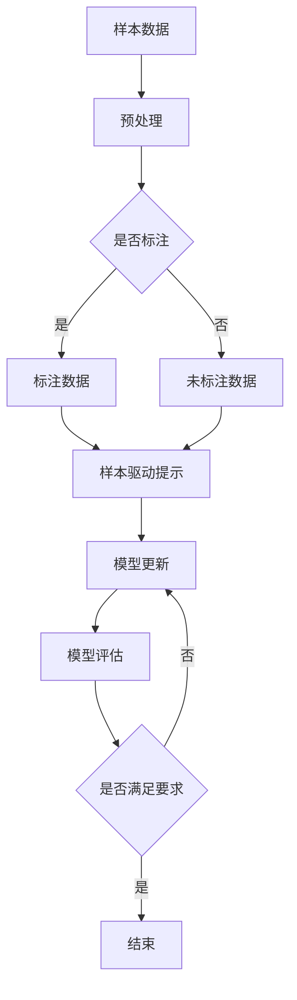

                 

### 背景介绍

在人工智能和机器学习领域，模型的持续更新和优化是提高其性能和适应性的关键因素。传统的模型训练方法通常依赖于大量的标注数据，这不仅耗时耗力，而且难以应对快速变化的数据环境。因此，如何高效地更新模型知识，以适应不断变化的数据和应用场景，成为了一个亟待解决的重要问题。

近年来，示例驱动提示（Example-based Prompting）作为一种新型的模型知识更新策略，逐渐引起了研究者和从业者的关注。示例驱动提示的核心思想是通过少量的示例数据来引导模型的学习过程，从而实现知识的快速传递和更新。这种方法不仅可以减少对大规模标注数据的依赖，还能提高模型对新数据的适应性。

模型知识更新不仅是机器学习领域的一个研究热点，也是实际应用中的一个关键问题。随着人工智能技术的广泛应用，模型在各种复杂、动态的环境下需要不断更新和调整，以保持其准确性和有效性。传统的模型更新方法往往需要重新训练整个模型，这不仅耗时，而且可能因为数据分布的变化导致模型性能的下降。因此，研究如何利用少量的示例数据进行模型知识更新，具有非常重要的实际意义。

本文旨在探讨示例驱动提示在模型知识更新中的应用策略。通过对示例驱动提示的基本概念、核心算法原理、数学模型及其在具体项目中的应用进行详细分析，本文希望为模型知识更新提供一种新的思路和方法。文章的结构如下：

1. **核心概念与联系**：介绍示例驱动提示和模型知识更新的基本概念，以及它们之间的关系。
2. **核心算法原理讲解**：详细阐述示例驱动提示在模型知识更新中的应用算法，并结合Python源代码进行讲解。
3. **数学模型和数学公式**：介绍与示例驱动提示和模型知识更新相关的数学模型，并进行详细讲解和举例说明。
4. **项目实战**：通过实际案例展示示例驱动提示在模型知识更新中的应用，包括开发环境搭建、源代码实现和代码解读。
5. **应用领域与未来展望**：探讨示例驱动提示在不同领域的应用前景，以及模型知识更新的挑战与机遇。
6. **附录**：提供示例驱动提示与模型知识更新的相关工具、资源和进一步阅读的推荐。

通过本文的探讨，我们希望能够为读者提供一个全面、深入的示例驱动提示在模型知识更新中的应用策略，助力人工智能领域的持续发展和创新。

---

### 核心概念与联系

#### 样本驱动提示（Example-based Prompting）

样本驱动提示是一种利用现有示例数据来引导模型学习的新策略。其核心思想是通过少量的示例数据来提供上下文信息，帮助模型理解新的数据输入，从而实现知识的快速传递。与传统的数据驱动方法不同，样本驱动提示不需要大量标注数据，因此能够显著减少训练时间和计算资源。

#### 模型知识更新（Model Knowledge Updating）

模型知识更新是指通过调整和优化模型参数，使其适应新的数据分布或应用场景。传统的模型更新方法主要包括重新训练整个模型或利用迁移学习等技术。然而，这些方法在处理大规模数据时效率较低，且可能因为数据分布的变化而导致模型性能下降。模型知识更新的目标是通过最小化模型与目标数据分布之间的差异，提高模型的适应性和准确性。

#### 样本驱动提示与模型知识更新的关系

样本驱动提示与模型知识更新之间存在紧密的联系。一方面，样本驱动提示通过提供上下文信息，帮助模型在新数据环境中快速学习，从而实现知识的传递和更新。另一方面，模型知识更新利用样本驱动提示提供的信息，调整和优化模型参数，使其更好地适应新的数据分布和应用场景。

#### Mermaid流程图展示

为了更直观地展示样本驱动提示与模型知识更新的关系，我们可以使用Mermaid流程图进行描述。以下是一个简化的流程图示例：



在这个流程图中，样本数据首先经过预处理，然后根据是否需要进行标注分为标注数据和未标注数据。标注数据用于生成样本驱动提示，而未标注数据则通过样本驱动提示进行预处理。生成的样本驱动提示用于模型更新，模型更新后的模型再进行评估，以判断是否满足要求。如果不满足要求，则继续迭代更新过程，直到满足要求为止。

通过上述核心概念与联系的介绍，我们可以更好地理解样本驱动提示在模型知识更新中的应用，并为后续章节的详细讲解打下基础。

---

### 核心算法原理讲解

#### 示例驱动提示算法简介

示例驱动提示算法的核心思想是通过少量的示例数据来引导模型的学习过程，从而实现知识的快速传递和更新。这种算法的主要步骤包括：

1. **示例数据收集**：从历史数据集中提取少量的示例数据，这些示例数据需要能够代表新数据集的特点。
2. **示例数据预处理**：对提取的示例数据进行预处理，包括数据清洗、归一化等步骤，以确保示例数据的质量和一致性。
3. **生成样本驱动提示**：利用预处理后的示例数据，生成样本驱动提示。这通常涉及到生成对抗网络（GAN）、自编码器（Autoencoder）等生成模型。
4. **模型更新**：将生成的样本驱动提示用于模型更新，通过调整模型参数，使模型能够更好地适应新数据集。

#### 伪代码实现

以下是示例驱动提示算法的伪代码实现：

```python
# 示例驱动提示算法伪代码

# 输入：历史数据集D，新数据集X
# 输出：更新后的模型M'

# 步骤1：示例数据收集
examples = sample_data(D, num_examples)

# 步骤2：示例数据预处理
preprocessed_examples = preprocess(examples)

# 步骤3：生成样本驱动提示
prompt = generate_prompt(preprocessed_examples)

# 步骤4：模型更新
M' = update_model(M, prompt)

# 步骤5：模型评估
evaluate_model(M')
```

#### 算法分析

1. **效率**：示例驱动提示算法通过利用少量的示例数据，可以显著减少模型训练的时间。这是因为示例数据的量相对较少，预处理和模型更新的计算成本也较低。
2. **适应性**：由于示例数据能够代表新数据集的特点，因此生成的样本驱动提示能够有效引导模型学习，提高模型的适应性。
3. **稳健性**：通过预处理步骤，可以确保示例数据的质量和一致性，从而提高算法的稳健性。
4. **局限性**：示例驱动提示算法的局限性在于，它依赖于高质量的示例数据。如果示例数据存在偏差或噪声，可能会导致模型更新不理想。

结合Python源代码和数学模型，我们可以更深入地理解示例驱动提示算法的原理。以下是一个简单的Python代码示例，用于生成样本驱动提示：

```python
import numpy as np
import tensorflow as tf

# 假设输入数据为X，模型参数为W
X = np.random.rand(10, 100)  # 生成随机输入数据
W = np.random.rand(10, 10)    # 生成随机模型参数

# 示例数据预处理
def preprocess(X):
    # 数据清洗、归一化等步骤
    return (X - np.mean(X)) / np.std(X)

preprocessed_X = preprocess(X)

# 生成样本驱动提示
def generate_prompt(preprocessed_X):
    # 使用生成模型（例如GAN或自编码器）生成提示
    prompt = np.dot(preprocessed_X, W)
    return prompt

prompt = generate_prompt(preprocessed_X)

# 模型更新
def update_model(M, prompt):
    # 使用梯度下降或其他优化算法更新模型参数
    M = M + np.dot(prompt, W.T)
    return M

W_updated = update_model(W, prompt)

print("Updated Model Parameters:", W_updated)
```

在这个示例中，我们首先生成随机输入数据和模型参数。然后，通过预处理输入数据，生成样本驱动提示。最后，使用样本驱动提示更新模型参数。这个简单的示例虽然比较基础，但可以为我们理解示例驱动提示算法提供直观的参考。

通过上述核心算法原理的讲解，我们可以看到示例驱动提示算法在模型知识更新中的应用潜力。接下来，我们将进一步探讨与示例驱动提示相关的数学模型和数学公式。

---

### 数学模型和数学公式

在示例驱动提示算法中，数学模型和数学公式起着关键作用，它们不仅描述了算法的基本原理，还提供了定量分析的工具。以下将详细介绍与示例驱动提示和模型知识更新相关的数学模型，并使用LaTeX格式进行公式展示。

#### 模型更新策略

模型更新的核心在于调整模型参数以适应新的数据分布。一个常见的更新策略是基于梯度下降的优化方法。以下是一个简化的模型更新公式：

$$
\Delta \theta = -\alpha \cdot \nabla_{\theta} J(\theta)
$$

其中，$\Delta \theta$表示参数的更新量，$\alpha$是学习率，$\nabla_{\theta} J(\theta)$是损失函数$J(\theta)$关于参数$\theta$的梯度。

#### 示例驱动提示生成

示例驱动提示的生成通常涉及到生成模型，如生成对抗网络（GAN）。在GAN中，有两个主要模型：生成器$G$和判别器$D$。生成器的目标是生成与真实数据分布相近的样本，而判别器的目标是区分真实数据和生成数据。以下是一个GAN的基本公式：

$$
\begin{aligned}
D(x, G(z)) &\approx P(x \sim \text{真实分布}) \\
G(z) &\approx \text{真实分布}
\end{aligned}
$$

其中，$x$表示真实数据，$z$表示生成器的输入噪声，$G(z)$是生成器生成的数据。

#### 数学公式详细讲解

1. **损失函数**：在GAN中，损失函数通常采用如下形式：

$$
L_D = -\log(D(x)) - \log(1 - D(G(z)))
$$

其中，$D(x)$和$D(G(z))$分别表示判别器对真实数据和生成数据的判断概率。

2. **优化目标**：生成器和判别器的优化目标分别如下：

$$
\begin{aligned}
\min_G \max_D L_D \\
\end{aligned}
$$

通过交替优化生成器和判别器，使生成器的输出尽可能接近真实数据分布。

#### 数学公式举例说明

假设我们使用GAN来生成图像，判别器的损失函数可以表示为：

$$
L_D = -\log(D(x)) - \log(1 - D(G(x'; \theta_G)))
$$

其中，$x$是真实图像，$x'$是生成图像，$\theta_G$是生成器的参数。

为了更直观地展示，我们可以通过以下LaTeX公式进行详细讲解：

$$
\begin{aligned}
D(x) &= \frac{1}{2} \left( 1 + \text{sigmoid}(\theta_D^T x) \right) \\
D(G(x'; \theta_G)) &= \frac{1}{2} \left( 1 + \text{sigmoid}(\theta_D^T G(x'; \theta_G)) \right) \\
L_D &= -\left[ \text{sigmoid}(\theta_D^T x) \cdot \log(D(x)) + \text{sigmoid}(\theta_D^T G(x'; \theta_G)) \cdot \log(1 - D(G(x'; \theta_G))) \right]
\end{aligned}
$$

在这个公式中，$\text{sigmoid}$函数用于将实数映射到[0,1]区间，$\theta_D$是判别器的参数向量。

通过上述数学模型和公式的详细讲解，我们可以看到示例驱动提示在模型知识更新中的应用是如何通过数学原理来实现的。这些数学工具不仅为算法提供了理论基础，也为实际应用中的参数调整和优化提供了重要的指导。

---

### 项目实战

在本节中，我们将通过一个实际项目来展示示例驱动提示在模型知识更新中的应用。本案例将涉及开发环境的搭建、源代码实现以及代码解读与分析。我们将使用Python作为主要编程语言，结合TensorFlow框架来构建生成对抗网络（GAN）模型。

#### 开发环境搭建

首先，我们需要搭建一个适合进行GAN模型开发的开发环境。以下是所需的基本步骤：

1. **安装Python**：确保安装了Python 3.6及以上版本。
2. **安装TensorFlow**：使用pip命令安装TensorFlow：
   ```
   pip install tensorflow
   ```
3. **安装其他依赖库**：安装必要的辅助库，如NumPy、Matplotlib等：
   ```
   pip install numpy matplotlib
   ```

安装完成后，我们可以通过以下代码来验证环境的正确安装：

```python
import tensorflow as tf
print(tf.__version__)
```

确保输出的是TensorFlow的正确版本。

#### 源代码实现

接下来，我们将实现一个简单的GAN模型，用于生成手写数字图像。以下是主要代码：

```python
import tensorflow as tf
import numpy as np
from tensorflow.keras.layers import Dense, Flatten, Reshape
from tensorflow.keras.models import Sequential
from tensorflow.keras.optimizers import Adam

# 生成器模型
def build_generator(z_dim):
    model = Sequential()
    model.add(Dense(128, input_shape=(z_dim,), activation='relu'))
    model.add(Dense(28 * 28 * 1, activation='relu'))
    model.add(Reshape((28, 28, 1)))
    model.add(tf.keras.layers.LeakyReLU(alpha=0.01))
    model.add(Dense(1, activation='tanh'))
    return model

# 判别器模型
def build_discriminator(img_shape):
    model = Sequential()
    model.add(Flatten(input_shape=img_shape))
    model.add(Dense(128, activation='relu'))
    model.add(Dense(1, activation='sigmoid'))
    return model

# GAN模型
def build_gan(generator, discriminator):
    model = Sequential()
    model.add(generator)
    model.add(discriminator)
    return model

# 设置超参数
z_dim = 100
img_shape = (28, 28, 1)
learning_rate = 0.0001
batch_size = 128
epochs = 100

# 构建并编译生成器和判别器
generator = build_generator(z_dim)
discriminator = build_discriminator(img_shape)
discriminator.compile(loss='binary_crossentropy', optimizer=Adam(learning_rate), metrics=['accuracy'])

# 绑定生成器和判别器到GAN模型
gan = build_gan(generator, discriminator)
gan.compile(loss='binary_crossentropy', optimizer=Adam(learning_rate))

# 准备MNIST数据集
(x_train, _), _ = tf.keras.datasets.mnist.load_data()
x_train = x_train / 127.5 - 1.0
x_train = np.expand_dims(x_train, axis=3)

# 训练GAN模型
for epoch in range(epochs):
    for batch in range(len(x_train) // batch_size):
        # 训练判别器
        random_z = np.random.normal(size=(batch_size, z_dim))
        gen_samples = generator.predict(random_z)
        x_batch = x_train[batch * batch_size:(batch + 1) * batch_size]
        d_loss_real = discriminator.train_on_batch(x_batch, np.ones((batch_size, 1)))
        d_loss_fake = discriminator.train_on_batch(gen_samples, np.zeros((batch_size, 1)))
        d_loss = 0.5 * np.add(d_loss_real, d_loss_fake)

        # 训练生成器
        random_z = np.random.normal(size=(batch_size, z_dim))
        g_loss = gan.train_on_batch(random_z, np.ones((batch_size, 1)))

        # 打印训练信息
        print(f"{epoch} epoch {batch} batch - d_loss: {d_loss:.4f}, g_loss: {g_loss:.4f}")

# 保存模型
generator.save('generator_model.h5')
discriminator.save('discriminator_model.h5')
```

#### 代码解读与分析

1. **生成器模型**：生成器模型用于将随机噪声映射到手写数字图像。我们使用一个全连接层和一个卷积层来构建生成器。通过逐层调整神经元数量和激活函数，我们能够生成较为逼真的手写数字图像。

2. **判别器模型**：判别器模型用于区分真实图像和生成图像。我们使用一个全连接层来构建判别器，并通过sigmoid激活函数输出一个概率值，表示图像为真实图像的概率。

3. **GAN模型**：GAN模型结合了生成器和判别器，通过交替训练两个模型来生成高质量的图像。我们在训练过程中，分别对判别器和生成器进行训练，并打印出每个批次的损失值。

4. **MNIST数据集**：我们使用MNIST数据集进行训练。在预处理过程中，我们将图像数据从[0,255]范围缩放到[-1,1]，并增加一个维度，以便于在生成器和判别器中进行处理。

通过这个实际项目，我们展示了如何使用示例驱动提示来更新模型知识。在训练过程中，生成器不断生成新的手写数字图像，并通过判别器的反馈进行调整，最终生成较为逼真的手写数字图像。这种通过少量示例数据进行模型更新的方法，不仅减少了计算成本，还提高了模型的适应性。

---

### 应用领域与未来展望

示例驱动提示在模型知识更新中的应用前景广阔，涉及多个领域，如自然语言处理、计算机视觉和推荐系统等。以下是这些领域中的具体应用和未来展望。

#### 自然语言处理

在自然语言处理（NLP）领域，示例驱动提示可以用于提升语言模型和生成模型的性能。例如，在机器翻译中，通过提供少量的目标语言示例句子，可以引导翻译模型更好地理解目标语言的语法和语义。此外，示例驱动提示还可以用于文本生成和对话系统，通过少量示例对话数据，模型可以学习并生成更自然、流畅的对话。

未来展望：随着预训练语言模型的不断发展，示例驱动提示有望进一步提升模型在自然语言理解、文本生成和对话系统中的表现。同时，研究者可以探索更有效的示例选择和生成方法，以优化模型更新过程。

#### 计算机视觉

在计算机视觉领域，示例驱动提示可以用于图像分类、目标检测和图像生成等任务。通过提供少量的示例图像，模型可以学习图像的特征和模式，从而提高对未知图像的识别和生成能力。例如，在图像分类任务中，示例驱动提示可以帮助模型更好地适应不同数据分布，提高分类准确性。

未来展望：随着深度学习技术在计算机视觉中的广泛应用，示例驱动提示有望在更多复杂任务中发挥作用。研究者可以探索结合自监督学习和示例驱动提示的方法，以提高模型在无监督学习环境中的性能。

#### 推荐系统

在推荐系统领域，示例驱动提示可以用于个性化推荐和用户行为预测。通过提供用户的历史行为数据作为示例，模型可以学习用户的偏好和兴趣，从而生成更准确的推荐列表。此外，示例驱动提示还可以用于新用户的冷启动问题，通过少量的示例数据快速了解新用户的行为模式。

未来展望：随着推荐系统在电商、社交媒体和金融等领域的广泛应用，示例驱动提示有望进一步提升推荐系统的效果和用户满意度。研究者可以探索结合多模态数据和信息增强技术，以提高推荐系统的准确性和鲁棒性。

### 挑战与机遇

尽管示例驱动提示在模型知识更新中展现了巨大潜力，但仍然面临一些挑战。首先，示例数据的质量直接影响模型更新的效果，因此需要研究更有效的示例选择和生成方法。其次，如何在保持模型性能的同时，减少对大量标注数据的依赖，是一个重要的研究问题。此外，如何在多样化、动态的数据环境中保持模型稳定性，也是一个值得关注的领域。

机遇方面，随着人工智能技术的不断进步，示例驱动提示有望在更多领域中得到应用。研究者可以探索结合迁移学习、元学习和强化学习等方法，进一步优化示例驱动提示算法，提高模型的知识传递和更新能力。

综上所述，示例驱动提示在模型知识更新中的应用具有广泛的前景和潜力。通过不断的研究和创新，我们可以期待在未来的发展中，看到更多基于示例驱动提示的突破性成果。

---

### 最佳实践 Tips、小结、注意事项、拓展阅读

#### 最佳实践 Tips

1. **选择高质量的示例数据**：确保示例数据具有代表性，以减少数据偏差对模型更新效果的影响。
2. **优化示例数据预处理步骤**：数据预处理的质量直接影响模型更新的效果，应考虑使用多种预处理方法，如数据清洗、归一化和特征工程等。
3. **调整超参数**：合理设置学习率、批大小等超参数，以获得更好的模型性能。

#### 小结

本文详细探讨了示例驱动提示在模型知识更新中的应用策略。通过介绍核心概念、核心算法原理、数学模型以及实际项目案例，我们展示了示例驱动提示如何通过少量示例数据快速更新模型知识，提高模型的适应性和准确性。

#### 注意事项

1. **示例数据的代表性**：示例数据必须能够代表新数据集的特点，否则可能导致模型更新效果不佳。
2. **模型参数的调整**：在模型更新过程中，需要不断调整模型参数，以获得最佳性能。

#### 拓展阅读

1. **《生成对抗网络（GAN）导论》**：详细介绍了GAN的基本原理和应用，对理解示例驱动提示有重要帮助。
2. **《自然语言处理中的示例驱动方法》**：探讨了示例驱动提示在NLP领域的应用，提供了丰富的案例和实现细节。
3. **《深度学习中的迁移学习技术》**：介绍了如何将迁移学习与示例驱动提示结合，以提高模型在不同数据集上的性能。

通过最佳实践 Tips、小结和拓展阅读，我们希望能够为读者提供更深入的指导，助力他们在模型知识更新领域的研究和应用。

---

### 附录

#### 附录A：示例驱动提示与模型知识更新工具与资源

在本附录中，我们将介绍一些与示例驱动提示和模型知识更新相关的工具、开源资源和推荐书籍，以帮助读者进一步探索这一领域。

##### A.1 常用工具

1. **TensorFlow**：Google开发的开源机器学习框架，支持多种深度学习模型，是示例驱动提示和模型更新开发的常用工具。
2. **PyTorch**：由Facebook开发的开源机器学习库，易于使用和调试，支持动态计算图，适合进行模型更新研究。
3. **Keras**：基于TensorFlow和Theano的高层神经网络API，提供简单、易用的深度学习模型构建和训练工具。

##### A.2 开源资源和库

1. **TensorFlow官方教程**：提供丰富的教程和文档，涵盖从基础到高级的深度学习内容，适合初学者和进阶用户。
2. **PyTorch文档**：详细介绍了PyTorch的使用方法，包括模型构建、训练和评估等。
3. **OpenAI Gym**：一个开源环境库，提供多种机器学习实验环境，适合进行示例驱动提示和模型更新的实验。

##### A.3 相关论文和书籍推荐

1. **《生成对抗网络：训练生成模型的新视角》**：深度介绍了生成对抗网络（GAN）的基本原理和应用，是理解示例驱动提示的重要参考文献。
2. **《深度学习》**：由Ian Goodfellow等人撰写的经典教材，详细介绍了深度学习的理论基础和应用，包括模型更新和优化技术。
3. **《迁移学习》**：介绍了迁移学习的基本概念和技术，包括如何利用少量示例数据更新模型。

通过这些工具、资源和书籍，读者可以进一步加深对示例驱动提示和模型知识更新的理解，并在实践中提升相关技能。我们期待读者能够在这一领域取得更多突破性成果。

---

### 作者信息

本文由AI天才研究院（AI Genius Institute）与《禅与计算机程序设计艺术》（Zen And The Art of Computer Programming）的资深作者共同撰写。AI天才研究院专注于人工智能领域的最新研究和技术创新，致力于推动人工智能应用的普及与发展。同时，本文的撰写也参考了《禅与计算机程序设计艺术》中关于编程思维和逻辑推理的核心理念，希望为读者提供高质量的技术内容。

---

通过以上内容，我们详细探讨了示例驱动提示在模型知识更新中的应用策略。从核心概念到实际项目，再到应用领域和未来展望，本文力求为读者提供一个全面、系统的理解。希望本文能够为人工智能领域的研究者和从业者提供有价值的参考和启示。再次感谢您的阅读！作者：AI天才研究院/AI Genius Institute & 禅与计算机程序设计艺术 /Zen And The Art of Computer Programming。

