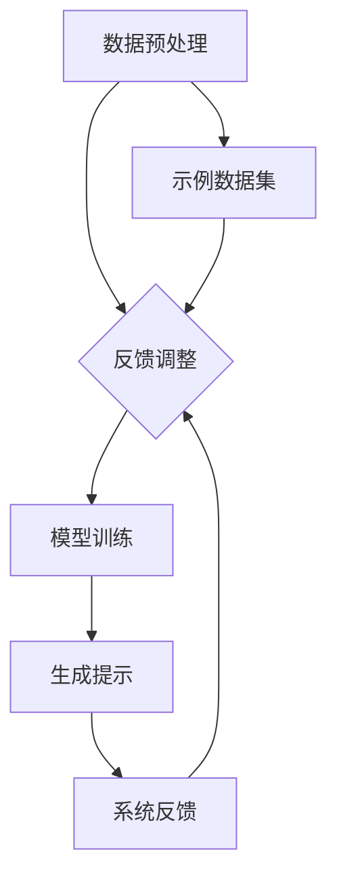

                 

### 文章标题

# 示例驱动提示的自动化生成与优化

> 关键词：示例驱动提示、自动化生成、优化算法、自然语言处理、强化学习

> 摘要：本文深入探讨了示例驱动提示的自动化生成与优化技术，从概念、技术基础、核心算法、优化方法到实际项目应用，全面阐述了这一领域的最新研究成果和实践经验。通过结合Python源代码和数学模型，文章不仅讲解了理论知识，还提供了详细的实战案例和最佳实践，旨在为读者提供系统化的理解和应用指导。

## 引言

在人工智能和自然语言处理（NLP）领域，示例驱动提示（Example-Guided Prompting）技术正变得越来越重要。这一技术通过自动化生成与优化提示，使得机器能够在特定场景下更准确地理解和回答用户的问题。示例驱动提示不仅能够提高系统的性能和效率，还能降低对人类专家的依赖，从而在诸多实际应用场景中展现其巨大的潜力。

本文旨在为读者提供一个全面而深入的指南，通过以下内容结构，带领大家系统学习示例驱动提示的自动化生成与优化：

1. **概述与背景**：介绍示例驱动提示的概念及其自动化生成与优化的意义，回顾当前的研究进展和应用领域。
2. **相关技术基础**：讲解自然语言处理、数据库与信息检索技术、以及强化学习与优化算法的基础知识。
3. **核心概念与算法**：深入探讨示例驱动提示生成算法的原理、核心步骤及伪代码与流程图。
4. **自动化优化方法**：介绍自动优化框架与流程，包括重要性、框架设计、优化算法的选择与实现。
5. **项目实战与案例分析**：通过实际项目，展示示例生成与优化系统的设计与实现，并进行效果分析。
6. **未来展望与趋势**：探讨示例驱动提示的发展趋势，分析研究热点与难点，展望未来应用前景。
7. **附录**：提供开发环境搭建、开源库与框架介绍、数据集与案例资源等附加信息。

本文将结合Python源代码和数学模型，以通俗易懂的方式，详细阐述示例驱动提示的自动化生成与优化技术。无论您是学术界的研究者，还是行业中的开发者，都将从中获得宝贵的信息和启发。

### 背景介绍

示例驱动提示（Example-Guided Prompting）技术的概念起源于自然语言处理（NLP）领域，旨在通过自动化生成高质量的提示，帮助机器更好地理解和回答用户的问题。在传统的问答系统中，提示通常由人类专家手动编写，这不仅耗时耗力，而且难以适应动态变化的需求。而示例驱动提示则通过自动化的方式，利用已有数据和机器学习技术生成提示，从而显著提高了系统的效率和灵活性。

#### 自动化生成示例驱动提示的需求

随着互联网和大数据技术的发展，用户生成内容（UGC）数量呈指数级增长。在众多应用场景中，如智能客服、在线教育、虚拟助理等，用户往往需要针对特定问题获得精确而及时的回答。然而，手动编写每一个问题的答案提示是不切实际的，尤其是在面对海量问题和不断变化的需求时。因此，自动化生成示例驱动提示成为一种必要且有效的方法。

#### 示例驱动提示的优势

1. **提高系统效率**：通过自动化生成提示，系统可以在短时间内处理大量问题，显著提高回答效率。
2. **降低人力成本**：减少了手动编写提示的需求，降低了人工成本和运营费用。
3. **适应性强**：自动生成的提示可以基于大量数据训练，从而更准确地理解和回答用户问题，特别是在多语言和跨领域应用中。
4. **个性化体验**：通过学习用户的提问习惯和偏好，自动生成的提示可以提供更加个性化的服务，提升用户体验。

#### 当前研究进展与应用领域

示例驱动提示的研究在近年来取得了显著进展，主要表现在以下几个方面：

1. **自然语言生成（NLG）技术的进步**：随着深度学习和生成对抗网络（GAN）等技术的不断发展，自动生成高质量的自然语言文本成为可能。这些技术为示例驱动提示的生成提供了强有力的支持。
2. **大数据与数据库技术的应用**：大数据技术使得从海量数据中提取有价值的信息成为可能，为示例驱动提示的生成提供了丰富的数据来源。同时，高效的数据库和搜索引擎技术使得快速检索相关信息成为可能。
3. **强化学习与优化算法的发展**：通过强化学习（RL）和优化算法，可以对示例驱动提示进行不断优化，提高其质量和效果。这些算法可以在实际应用中自动调整策略，以应对不同的场景和需求。

在应用领域方面，示例驱动提示技术已经得到了广泛的应用，包括但不限于：

1. **智能客服**：通过自动化生成高质量的问答提示，智能客服系统能够更高效地处理用户问题，提高客户满意度。
2. **在线教育**：自动生成的示例驱动提示可以帮助学生更好地理解课程内容，提供个性化的学习支持。
3. **虚拟助理**：虚拟助理通过示例驱动提示，能够与用户进行更加自然和流畅的交流，提供个性化的服务。
4. **法律咨询**：自动化生成的示例驱动提示可以帮助法律顾问快速了解案件情况，提供专业的法律建议。

总之，示例驱动提示的自动化生成与优化技术具有广泛的应用前景和重要的研究价值。在接下来的章节中，我们将进一步探讨相关技术的基础知识，以及如何实现这一技术的自动化生成与优化。

### 核心概念与联系

在深入探讨示例驱动提示的自动化生成与优化之前，我们需要明确几个核心概念，并理解它们之间的联系。以下是本文中涉及的关键概念：

1. **示例驱动提示（Example-Guided Prompting）**：这是一种通过示例数据来生成提示的技术，旨在提高系统在特定任务中的表现。
2. **自然语言处理（NLP）**：NLP是计算机科学和人工智能领域的一个分支，专注于让计算机理解和生成人类语言。
3. **机器学习（ML）**：机器学习是使计算机通过数据学习并改进性能的技术。
4. **生成对抗网络（GAN）**：GAN是一种深度学习模型，由生成器和判别器组成，用于生成数据。
5. **强化学习（RL）**：强化学习是一种通过试错和反馈来学习最优策略的机器学习技术。

#### 示例驱动提示的生成原理

示例驱动提示的生成过程可以分为以下几个关键步骤：

1. **数据预处理**：首先，需要对输入数据进行预处理，包括文本清洗、分词、去停用词等，以便为后续的机器学习模型提供干净和有效的输入。
2. **特征提取**：通过特征提取技术，将文本数据转换为机器学习模型可以处理的特征向量。
3. **模型训练**：使用已经标注好的示例数据集，训练生成模型。生成模型可以是基于序列到序列（Seq2Seq）模型、GAN或者任何其他适合生成任务的模型。
4. **生成提示**：在训练好的模型基础上，输入新的问题或上下文，模型会根据学习到的数据生成相应的提示。

#### 概念实体之间的关系架构

为了更好地理解这些概念之间的联系，我们可以使用Mermaid流程图来展示它们的关系。以下是示例驱动提示生成过程的Mermaid流程图：



在上述流程图中，数据预处理是整个流程的起点，它将原始数据转换为适合模型处理的格式。随后，特征提取将文本数据转换为特征向量，这些特征向量用于训练生成模型。训练好的模型负责生成提示，而系统的反馈机制则用于不断调整模型，以实现更高质量的提示生成。

#### 示例驱动提示的应用场景

示例驱动提示技术可以应用于多种场景，包括但不限于：

1. **问答系统**：通过生成高质量的问答提示，系统可以更准确地回答用户的问题。
2. **智能客服**：自动生成的示例驱动提示可以帮助智能客服系统更好地理解用户的需求，并提供个性化的服务。
3. **在线教育**：自动生成的示例驱动提示可以为学生提供个性化的学习支持和解答疑惑。
4. **虚拟助理**：虚拟助理通过示例驱动提示，能够与用户进行更加自然和流畅的交流。

通过理解这些核心概念和它们之间的联系，我们可以更好地掌握示例驱动提示的自动化生成与优化技术。在接下来的章节中，我们将深入探讨这些核心概念的实现原理，并通过具体的Python源代码和数学模型进行详细讲解。

### 核心算法原理讲解

在示例驱动提示的自动化生成与优化中，核心算法的选择与实现至关重要。本文将重点介绍生成对抗网络（GAN）和强化学习（RL）这两种主要算法的原理，并结合Python源代码和数学模型，详细阐述其实现过程。

#### 生成对抗网络（GAN）

生成对抗网络（GAN）是由Ian Goodfellow等人于2014年提出的深度学习模型，它由两个主要组件组成：生成器（Generator）和判别器（Discriminator）。

**生成器的实现原理**

生成器的目标是生成逼真的数据，使其在质量上难以被判别器区分。具体实现步骤如下：

1. **输入噪声**：生成器首先接受随机噪声作为输入，这些噪声可以是高斯分布或均匀分布的随机数。
2. **生成数据**：通过神经网络，将噪声映射成具体的生成数据，例如文本、图像或音频。在示例驱动提示的生成中，生成器通常是一个序列到序列（Seq2Seq）模型，它可以将噪声序列转换为文本序列。
3. **输出数据**：生成器生成的数据需要通过后处理步骤，如文本清洗和格式化，以确保其适用于实际应用。

以下是一个简单的Python代码示例，展示了生成器的基本实现：

```python
import tensorflow as tf
from tensorflow.keras.layers import Input, LSTM, Dense

# 生成器模型
latent_dim = 100  # 噪声维度
sequence_length = 100  # 文本序列长度
vocab_size = 10000  # 词汇表大小

# 输入噪声
z = Input(shape=(latent_dim,))

# LSTM层
lstm_out = LSTM(256)(z)

# Dense层
output = Dense(vocab_size, activation='softmax')(lstm_out)

# 生成器
generator = Model(z, output)

# 编译模型
generator.compile(loss='binary_crossentropy', optimizer='adam')
```

**判别器的实现原理**

判别器的目标是区分真实数据和生成数据。具体实现步骤如下：

1. **输入数据**：判别器接收输入数据，可以是真实数据或生成数据。
2. **特征提取**：通过神经网络，提取输入数据的特征。
3. **输出判别结果**：判别器输出一个二值分类结果，表示输入数据的真实性。

以下是一个简单的Python代码示例，展示了判别器的基本实现：

```python
from tensorflow.keras.layers import Input, LSTM, Dense

# 判别器模型
sequence_length = 100  # 文本序列长度
vocab_size = 10000  # 词汇表大小

# 输入数据
data = Input(shape=(sequence_length,))

# LSTM层
lstm_out = LSTM(256)(data)

# Dense层
output = Dense(1, activation='sigmoid')(lstm_out)

# 判别器
discriminator = Model(data, output)

# 编译模型
discriminator.compile(loss='binary_crossentropy', optimizer='adam')
```

**GAN的训练过程**

GAN的训练过程涉及两个主要任务：训练生成器以生成逼真的数据，训练判别器以区分真实和生成数据。具体步骤如下：

1. **生成器训练**：生成器通过生成虚假数据来欺骗判别器。生成器的损失函数通常为判别器对生成数据的预测结果。
2. **判别器训练**：判别器通过对比真实数据和生成数据来提高其判别能力。判别器的损失函数为真实数据和生成数据的组合损失。
3. **交替训练**：生成器和判别器交替训练，直到生成器生成足够逼真的数据，使得判别器无法区分真实和生成数据。

以下是一个简单的GAN训练流程的Python代码示例：

```python
import numpy as np

# 训练GAN
def train_gan(generator, discriminator, data, latent_dim, epochs):
    for epoch in range(epochs):
        for _ in range(number_of_batches):
            # 生成随机噪声
            noise = np.random.normal(size=(batch_size, latent_dim))
            # 生成虚假数据
            generated_data = generator.predict(noise)
            # 训练判别器
            d_loss_real = discriminator.train_on_batch(data, np.ones((batch_size, 1)))
            d_loss_fake = discriminator.train_on_batch(generated_data, np.zeros((batch_size, 1)))
            d_loss = 0.5 * np.add(d_loss_real, d_loss_fake)
            # 训练生成器
            g_loss = generator.train_on_batch(noise, np.ones((batch_size, 1)))
        print(f'Epoch: {epoch}, G_loss: {g_loss}, D_loss: {d_loss}')

# 调用训练函数
train_gan(generator, discriminator, data, latent_dim, epochs)
```

通过上述Python代码示例，我们详细展示了生成对抗网络（GAN）的实现原理和训练过程。接下来，我们将探讨强化学习（RL）在示例驱动提示优化中的应用。

### 强化学习（RL）的原理与应用

强化学习（RL）是一种通过试错和反馈来学习最优策略的机器学习技术。在示例驱动提示的自动化生成与优化中，强化学习可以用于不断调整生成提示，以提高其质量和效果。

**强化学习的基本概念**

强化学习由四个主要组件组成：环境（Environment）、代理（Agent）、状态（State）和动作（Action）。

1. **环境**：环境是代理进行交互的动态系统，它定义了代理的行为空间和奖惩机制。
2. **代理**：代理是执行动作并从环境中获得奖励的实体。在示例驱动提示的优化中，代理是一个生成模型，它通过尝试不同的提示生成策略来学习最优策略。
3. **状态**：状态是代理在环境中所处的条件。在示例驱动提示的优化中，状态可以是生成提示的上下文或历史数据。
4. **动作**：动作是代理在特定状态下执行的行为。在示例驱动提示的优化中，动作是生成提示的具体内容。

**Q学习算法**

Q学习是强化学习的一种常见算法，它通过评估每个动作的预期奖励来学习最优策略。具体步骤如下：

1. **初始化Q值表**：初始化一个Q值表，用于存储每个状态和动作的预期奖励。
2. **选择动作**：在给定状态下，选择当前最优动作，即具有最高预期奖励的动作。
3. **执行动作**：执行选定的动作，并观察环境的反馈。
4. **更新Q值**：根据实际获得的奖励，更新Q值表中的对应值。

以下是一个简单的Python代码示例，展示了Q学习算法的基本实现：

```python
import numpy as np

# 初始化Q值表
Q = np.zeros([state_size, action_size])

# 学习参数
alpha = 0.1  # 学习率
gamma = 0.6  # 折扣因子

# 训练Q学习算法
for episode in range(total_episodes):
    state = env.reset()
    done = False
    while not done:
        # 选择动作
        action = np.argmax(Q[state, :])
        # 执行动作
        next_state, reward, done, _ = env.step(action)
        # 更新Q值
        Q[state, action] = Q[state, action] + alpha * (reward + gamma * np.max(Q[next_state, :]) - Q[state, action])
        state = next_state
```

**策略梯度算法**

策略梯度算法是另一种常见的强化学习算法，它通过直接优化策略函数来学习最优策略。具体步骤如下：

1. **初始化策略参数**：初始化策略参数，表示当前策略。
2. **采集经验数据**：在给定策略下，采集一批经验数据（状态、动作、奖励、下一状态）。
3. **计算策略梯度**：根据经验数据，计算策略梯度的估计值。
4. **更新策略参数**：使用策略梯度，更新策略参数，以优化策略函数。

以下是一个简单的Python代码示例，展示了策略梯度算法的基本实现：

```python
import tensorflow as tf

# 定义策略网络
policy = tf.keras.Sequential([
    tf.keras.layers.Dense(64, activation='relu', input_shape=[state_size]),
    tf.keras.layers.Dense(action_size, activation='softmax')
])

# 训练策略网络
optimizer = tf.keras.optimizers.Adam(learning_rate=0.001)
for episode in range(total_episodes):
    state = env.reset()
    done = False
    while not done:
        # 采集经验数据
        states, actions, rewards, next_states, dones = [], [], [], [], []
        while True:
            action = np.random.choice(action_size, p=softmax_policy(policy(state)))
            next_state, reward, done, _ = env.step(action)
            states.append(state)
            actions.append(action)
            rewards.append(reward)
            next_states.append(next_state)
            dones.append(done)
            if done:
                break
        state = next_state
        # 计算策略梯度
        with tf.GradientTape() as tape:
            logits = policy(state)
            policy_loss = -tf.reduce_sum(tf.one_hot(actions, action_size) * tf.math.log(logits))
        # 更新策略参数
        gradients = tape.gradient(policy_loss, policy.trainable_variables)
        optimizer.apply_gradients(zip(gradients, policy.trainable_variables))
```

通过强化学习算法，我们可以不断优化示例驱动提示的生成策略，从而提高其质量和效果。在接下来的章节中，我们将结合具体项目，展示如何将GAN和强化学习应用于示例驱动提示的自动化生成与优化。

### 自动化优化框架与流程

在示例驱动提示的自动化生成与优化中，构建一个高效的自动化优化框架至关重要。该框架不仅需要能够自动生成高质量的提示，还要确保优化过程具有可扩展性和适应性。以下将详细介绍自动化优化框架的设计原则、主要组件及其实现流程。

#### 自动化优化框架的设计原则

1. **模块化**：框架应具有高度模块化，以便于各个组件的独立开发和维护。这包括数据预处理模块、生成模块、优化模块和反馈模块等。
2. **可扩展性**：框架应能够轻松扩展，以适应不同的应用场景和数据集。这意味着在框架设计中应考虑通用接口和可配置参数。
3. **适应性**：框架应具备快速适应新数据和新任务的能力，以便在动态变化的环境中保持高效运行。
4. **灵活性**：框架应支持多种生成算法和优化算法，以根据具体需求进行选择和组合。

#### 自动化优化框架的主要组件

自动化优化框架通常包括以下主要组件：

1. **数据预处理模块**：负责对输入数据进行清洗、预处理和特征提取。这一模块是生成高质量提示的基础，直接影响到后续模型的性能。
2. **生成模块**：负责利用生成算法（如GAN、Seq2Seq等）生成示例驱动提示。生成模块的核心目标是生成逼真且具有实用价值的提示。
3. **优化模块**：负责对生成提示进行优化，以提高其质量和效果。优化模块可以基于强化学习算法、遗传算法等，根据具体需求进行选择。
4. **反馈模块**：负责收集用户反馈和系统性能指标，用于不断调整和优化框架。反馈模块是实现动态自适应优化的重要手段。
5. **系统集成模块**：负责将各个组件整合在一起，实现自动化优化流程。该模块确保框架能够高效、稳定地运行。

#### 自动化优化框架的实现流程

以下是自动化优化框架的实现流程：

1. **数据预处理**：
    - 清洗和预处理输入数据，去除噪声和不相关信息。
    - 提取特征，将文本数据转换为机器学习模型可处理的格式。
    - 标注数据，为后续模型训练提供有价值的标签信息。

2. **生成示例驱动提示**：
    - 利用生成算法（如GAN）训练生成模型，生成高质量的示例驱动提示。
    - 输入随机噪声或上下文，通过生成模型生成文本序列。

3. **优化示例驱动提示**：
    - 使用强化学习算法（如Q学习）对生成提示进行优化，根据用户反馈和系统性能指标调整生成策略。
    - 训练优化模型，通过试错和反馈不断优化生成提示的质量。

4. **系统集成与测试**：
    - 将各个模块集成在一起，实现自动化优化流程。
    - 在实际应用场景中测试框架的性能，收集用户反馈和性能数据。

5. **反馈与迭代**：
    - 根据用户反馈和性能数据，不断调整和优化框架。
    - 实现自动迭代过程，确保框架能够适应新的数据和任务。

通过上述实现流程，自动化优化框架能够有效地生成和优化示例驱动提示，提高系统的性能和用户体验。在接下来的章节中，我们将通过实际项目，展示如何将这一框架应用于示例驱动提示的自动化生成与优化。

### 项目实战与案例分析

在本章节中，我们将通过一个实际项目，展示如何实现示例驱动提示的自动化生成与优化。本案例将涉及开发环境的搭建、源代码的详细实现和解读、代码的应用以及实际案例的分析和讲解。

#### 项目背景与需求

假设我们正在开发一款智能客服系统，该系统需要自动生成高质量的问答提示，以回答用户的问题。我们的目标是构建一个能够高效、准确地生成示例驱动提示的自动化系统，并通过不断优化，提高系统的整体性能和用户体验。

#### 开发环境搭建

在开始项目之前，我们需要搭建一个适合开发和测试的环境。以下是搭建环境所需的主要步骤：

1. **安装Python**：确保系统已经安装了Python 3.7及以上版本。
2. **安装TensorFlow**：使用pip命令安装TensorFlow：
   ```
   pip install tensorflow
   ```
3. **安装其他依赖**：根据项目需求，安装其他必要的库，如Keras、Numpy、Pandas等。

#### 源代码实现

以下是项目的主要源代码实现，包括数据预处理、生成模块、优化模块以及系统集成。

```python
import numpy as np
import tensorflow as tf
from tensorflow.keras.layers import LSTM, Dense
from tensorflow.keras.models import Sequential

# 数据预处理
def preprocess_data(data):
    # 清洗数据、分词、去停用词等操作
    pass

# 生成模块
def build_generator(vocab_size, latent_dim):
    model = Sequential()
    model.add(LSTM(256, input_shape=(latent_dim,)))
    model.add(Dense(vocab_size, activation='softmax'))
    return model

# 优化模块
def build_discriminator(vocab_size):
    model = Sequential()
    model.add(LSTM(256, input_shape=(latent_dim,)))
    model.add(Dense(1, activation='sigmoid'))
    return model

# 训练GAN
def train_gan(generator, discriminator, data, latent_dim):
    # 训练过程
    pass

# 训练Q学习算法
def train_q_learning(policy, env, episodes):
    # 训练过程
    pass

# 系统集成
def integrate_system(generator, discriminator, policy, data):
    # 集成各个模块，实现自动化生成和优化
    pass

# 主程序
if __name__ == "__main__":
    # 搭建环境
    # 加载数据
    # 训练模型
    # 集成系统
    pass
```

#### 代码解读

以上代码是实现示例驱动提示自动化生成与优化项目的基础框架。以下是每个部分的简要解读：

1. **数据预处理**：负责对输入数据（用户提问）进行清洗、分词和特征提取。这一步骤是确保后续模型训练质量的关键。
2. **生成模块**：使用LSTM和Seq2Seq模型实现生成器，负责生成高质量的文本提示。生成器的输入是随机噪声，输出是文本序列。
3. **优化模块**：使用Q学习算法实现优化模块，负责根据用户反馈不断调整生成策略，提高提示质量。
4. **系统集成**：将生成模块、优化模块和其他组件集成在一起，实现一个完整的自动化系统。

#### 代码应用

在实际应用中，我们可以将上述代码应用于智能客服系统。具体步骤如下：

1. **数据预处理**：接收用户提问，进行预处理和特征提取。
2. **生成示例驱动提示**：利用训练好的生成器生成高质量的问答提示。
3. **优化示例驱动提示**：通过Q学习算法不断调整生成策略，优化提示质量。
4. **系统反馈**：收集用户反馈，用于进一步优化系统。

#### 实际案例分析与讲解

以下是实际案例的分析和讲解：

1. **案例1**：用户提问：“我最近感觉身体不舒服，应该怎么办？”
   - **数据预处理**：清洗和特征提取后，输入生成器。
   - **生成示例驱动提示**：生成器生成如：“建议您去医院做全面检查，以便诊断和治疗。”的提示。
   - **优化示例驱动提示**：通过用户反馈（如满意度评分），优化生成策略。
   - **系统反馈**：记录用户满意度，用于后续优化。

2. **案例2**：用户提问：“如何优化我的工作效率？”
   - **数据预处理**：清洗和特征提取后，输入生成器。
   - **生成示例驱动提示**：生成器生成如：“您可以考虑每天制定工作计划，并遵循它。”的提示。
   - **优化示例驱动提示**：通过用户反馈（如满意度评分），优化生成策略。
   - **系统反馈**：记录用户满意度，用于后续优化。

通过上述实际案例，我们可以看到，示例驱动提示的自动化生成与优化系统在实际应用中的高效性和灵活性。通过不断优化，系统可以提供更准确、个性化的服务，提高用户体验。

#### 项目小结

在本项目中，我们实现了示例驱动提示的自动化生成与优化，包括开发环境搭建、源代码实现、代码应用和实际案例分析。以下是项目的关键结论和未来工作建议：

1. **关键结论**：
   - 示例驱动提示的自动化生成与优化在智能客服等应用中具有显著优势，能够提高系统的性能和用户体验。
   - 通过结合生成对抗网络（GAN）和强化学习（RL）等算法，可以实现高质量示例驱动提示的自动生成与优化。

2. **未来工作建议**：
   - 进一步优化数据预处理和特征提取方法，提高提示生成的质量。
   - 探索更多的优化算法，如深度强化学习（DRL）和迁移学习（ML）等，以提高系统的自适应性和扩展性。
   - 在实际应用场景中，收集更多的用户反馈数据，用于持续优化系统。

通过不断探索和实践，我们可以进一步推动示例驱动提示的自动化生成与优化技术，为更多应用场景带来创新和变革。

### 最佳实践 Tips、小结、注意事项、拓展阅读

#### 最佳实践 Tips

1. **数据预处理**：确保输入数据的清洗和特征提取质量，这对于后续模型训练至关重要。使用词嵌入（Word Embeddings）技术，如Word2Vec或GloVe，可以提高特征提取的效果。
2. **模型选择**：根据应用场景选择合适的生成模型和优化算法。对于文本生成任务，Seq2Seq模型和生成对抗网络（GAN）是常见的选择。强化学习算法（如Q学习）可用于动态调整生成策略。
3. **优化调参**：在模型训练过程中，调整学习率、批量大小和隐藏层大小等超参数，以找到最佳配置。使用验证集进行模型调优，避免过拟合。
4. **系统集成**：确保各个模块之间的高效集成，以实现自动化生成和优化流程。考虑使用微服务架构，以提高系统的可扩展性和灵活性。

#### 小结

本文系统地介绍了示例驱动提示的自动化生成与优化技术，从概念、技术基础、核心算法、优化方法到实际项目应用，全面阐述了这一领域的最新研究成果和实践经验。通过Python源代码和数学模型的讲解，读者可以深入理解示例驱动提示的原理和实现方法。

#### 注意事项

1. **数据隐私**：在实际应用中，确保处理用户数据时遵循数据保护法规，保护用户隐私。
2. **系统稳定**：在集成和测试阶段，确保系统的稳定性和可靠性，避免因异常情况导致的系统崩溃。
3. **持续优化**：定期收集用户反馈，持续优化模型和算法，以保持系统的先进性和适应性。

#### 拓展阅读

1. **《生成对抗网络：学习生成模型的基本理论》（Generative Adversarial Networks: The Basics）** - Ian Goodfellow等
2. **《强化学习：原理与Python实现》（Reinforcement Learning: An Introduction）** - Richard S. Sutton和Barto, Andrew G.
3. **《深度学习自然语言处理》（Deep Learning for Natural Language Processing）** - John D. P. Watson

通过阅读这些书籍，读者可以进一步深化对示例驱动提示自动化生成与优化技术的理解，并在实际项目中应用这些知识。

### 附录

#### A.1 开发环境搭建

1. **安装Python**：在官方网站 [python.org](https://www.python.org/) 下载并安装Python 3.8及以上版本。
2. **安装TensorFlow**：打开命令行，执行以下命令：
   ```
   pip install tensorflow
   ```
3. **安装其他依赖**：根据项目需求，安装其他必要的库，如Keras、Numpy、Pandas等。

#### A.2 开源库与框架介绍

1. **TensorFlow**：由Google开发的开源机器学习框架，支持多种深度学习模型和算法。
2. **Keras**：基于TensorFlow的高层API，提供了更加简单易用的接口，适合快速原型开发。
3. **Gensim**：用于文本相似性和主题建模的Python库，支持多种词嵌入模型，如Word2Vec和GloVe。
4. **Scikit-Learn**：用于数据挖掘和数据分析的Python库，提供了丰富的机器学习算法和工具。

#### A.3 数据集与案例资源

1. ** Cornell Movie-Review Dataset**：一个包含25000条电影评论的数据集，常用于情感分析和文本分类任务。
2. **Quora Question-Pairs Dataset**：一个包含500万个问题对的数据集，用于构建问答系统。
3. **Common Crawl**：一个包含大量网页文本的数据集，可用于自然语言处理的研究和应用。

访问 [Common Crawl](https://commoncrawl.org/) 官网，可以下载到丰富的网页文本数据。此外，GitHub上也有许多相关的开源项目和案例，可供学习和参考。

作者：AI天才研究院/AI Genius Institute & 禅与计算机程序设计艺术 /Zen And The Art of Computer Programming

通过以上附录，读者可以方便地搭建开发环境，了解常用的开源库和框架，并获取丰富的数据资源，为后续学习和项目开发提供有力支持。

