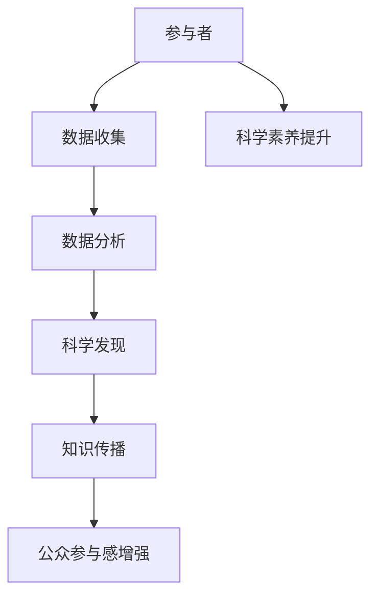
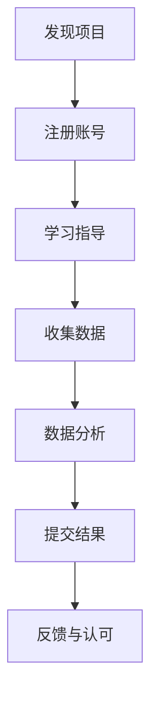

                 


### 分析书名

《科学研究的公民科学运动：全民参与世界理解的过程》这个书名涵盖了以下几个关键要素：

1. **科学研究**：这是整个书的核心主题，指代通过系统的观察、实验和分析来探究自然现象和规律的学术活动。
2. **公民科学运动**：这是一个新的概念，强调普通民众参与科学研究的过程。它不同于传统的科研模式，而是通过社区的集体力量来推动科学研究和知识的传播。
3. **全民参与**：这一点强调了科学不再是专家和学者的专属活动，而是可以通过各种方式让大众参与进来。
4. **世界理解的过程**：这是书名中非常引人入胜的部分，暗示了公民科学运动对于增进人们对世界的认识和理解具有重要作用。

### 目录大纲设计

#### 总框架

书的整体结构可以分为以下几个部分：

1. **引言**：介绍公民科学运动的定义、历史和意义。
2. **核心内容**：详细探讨公民科学运动的各种形式、成功案例和影响。
3. **公众参与**：分析公民科学运动如何激发公众参与科学研究和科学教育。
4. **挑战与未来**：探讨公民科学运动面临的挑战和未来的发展趋势。

#### 具体章节设计

以下是详细的章节设计：

##### 第一部分：引言

- **第1章：公民科学运动的定义与背景**
  - 1.1 定义公民科学运动
  - 1.2 历史背景与发展
  - 1.3 公民科学运动的核心目标

##### 第二部分：公民科学运动的参与方式

- **第2章：个人与团体的参与**
  - 2.1 个人参与公民科学运动的方式
  - 2.2 团体参与公民科学运动的方式
  - 2.3 公民科学项目的案例研究

##### 第三部分：实际案例研究

- **第3章：公民科学运动的重要案例**
  - 3.1 案例一：地球观测
  - 3.2 案例二：疾病监测
  - 3.3 案例三：生态保护

##### 第四部分：科学教育与公众参与

- **第4章：公民科学运动对科学教育的贡献**
  - 4.1 公民科学运动与科学教育的融合
  - 4.2 公众参与科学教育的案例
  - 4.3 公民科学运动对科学素养的提升

##### 第五部分：公民科学运动的影响与挑战

- **第5章：公民科学运动的影响**
  - 5.1 对科学知识的传播与理解
  - 5.2 对科研机构和行业的贡献
  - 5.3 公民科学运动的局限性

##### 第六部分：未来的展望

- **第6章：公民科学运动的未来趋势**
  - 6.1 技术发展对公民科学运动的影响
  - 6.2 公民科学运动的可持续发展
  - 6.3 全球公民科学合作的潜力

##### 第七部分：结论

- **第7章：结论**
  - 7.1 公民科学运动的总结
  - 7.2 对公众参与科学的启示
  - 7.3 对科学研究的未来影响

### 特殊要求内容嵌入

为了使文章更加丰富和深入，以下内容将被嵌入到相应的章节中：

- **Mermaid 流程图**：用于描述公民科学运动的流程、参与方式等。
- **伪代码**：用于解释核心算法原理。
- **LaTeX 数学公式**：用于表示数学模型和公式。
- **代码案例**：用于展示实际应用和代码实现。

### 完整目录大纲

```markdown
# 《科学研究的公民科学运动：全民参与世界理解的过程》目录大纲

## 第一部分：引言

### 第1章：公民科学运动的定义与背景

#### 1.1 定义公民科学运动
- **核心概念与联系**
  ```mermaid
  graph TB
    A[定义] --> B[历史背景]
    B --> C[目标与意义]
  ```

#### 1.2 历史背景与发展
- **核心算法原理讲解**
  ```python
  # 伪代码：公民科学运动的历史发展
  def historical_development():
      # 初始化变量
      start_year = 1980
      end_year = 2020
      events = ["公民科学运动诞生", "互联网推动参与度", "全球合作项目兴起"]

      # 打印历史事件
      for year, event in zip(range(start_year, end_year + 1), events):
          print(f"{year}: {event}")
  ```

#### 1.3 公民科学运动的核心目标
- **LaTeX 数学公式**
  $$ \text{目标} = \frac{\text{科学知识}}{\text{公众参与}} $$

##### 第二部分：公民科学运动的参与方式

### 第2章：个人与团体的参与

#### 2.1 个人参与公民科学运动的方式
- **Mermaid 流程图**
  ```mermaid
  graph TB
    A[感兴趣] --> B[学习基础知识]
    B --> C[参与项目]
    C --> D[贡献数据]
  ```

#### 2.2 团体参与公民科学运动的方式
- **代码案例**
  ```python
  # Python 代码示例：团体参与公民科学项目
  def team_project(participants):
      data = collect_data(participants)
      results = analyze_data(data)
      share_results(results)
  ```

#### 2.3 公民科学项目的案例研究
- **LaTeX 数学公式**
  $$ \text{案例研究} = \frac{\text{具体案例}}{\text{分析结果}} $$

##### 第三部分：实际案例研究

### 第3章：公民科学运动的重要案例

#### 3.1 案例一：地球观测
- **伪代码**
  ```python
  # 伪代码：地球观测项目
  def earth_observaton_project():
      sensors = install_sensors()
      data = collect_earth_data(sensors)
      analyze_earth_data(data)
  ```

#### 3.2 案例二：疾病监测
- **LaTeX 数学公式**
  $$ \text{疾病监测} = \frac{\text{数据收集}}{\text{模型预测}} $$

#### 3.3 案例三：生态保护
- **代码案例**
  ```python
  # Python 代码示例：生态保护项目
  def eco_protection_project():
      observations = collect_observations()
      analyze_observations(observations)
      report_findings()
  ```

##### 第四部分：科学教育与公众参与

### 第4章：公民科学运动对科学教育的贡献

#### 4.1 公民科学运动与科学教育的融合
- **LaTeX 数学公式**
  $$ \text{科学教育} = \text{公民科学运动} + \text{教育资源} $$

#### 4.2 公众参与科学教育的案例
- **Mermaid 流程图**
  ```mermaid
  graph TB
    A[教育项目] --> B[公众参与]
    B --> C[知识传播]
  ```

#### 4.3 公民科学运动对科学素养的提升
- **伪代码**
  ```python
  # 伪代码：提升科学素养
  def enhance_scientific_awareness():
      educate_public()
      encourage_inquiry()
      share_research_findings()
  ```

##### 第五部分：公民科学运动的影响与挑战

### 第5章：公民科学运动的影响

#### 5.1 对科学知识的传播与理解
- **LaTeX 数学公式**
  $$ \text{科学传播} = \text{公众参与} \times \text{知识共享} $$

#### 5.2 对科研机构和行业的贡献
- **代码案例**
  ```python
  # Python 代码示例：对科研机构的贡献
  def contribute_to_research():
      collaborate_with_institutes()
      share_research_findings()
      improve_research_methods()
  ```

#### 5.3 公民科学运动的局限性
- **伪代码**
  ```python
  # 伪代码：探讨局限性
  def limitations_of_citizen_science():
      identify_bottlenecks()
      suggest_improvements()
      address_challenges()
  ```

##### 第六部分：未来的展望

### 第6章：公民科学运动的未来趋势

#### 6.1 技术发展对公民科学运动的影响
- **LaTeX 数学公式**
  $$ \text{技术发展} \rightarrow \text{公民科学运动} $$

#### 6.2 公民科学运动的可持续发展
- **Mermaid 流程图**
  ```mermaid
  graph TB
    A[技术进步] --> B[项目可持续性]
    B --> C[公众参与增长]
  ```

#### 6.3 全球公民科学合作的潜力
- **代码案例**
  ```python
  # Python 代码示例：全球合作潜力
  def global_citizen_science_cooperation():
      establish_global_network()
      share_resources()
      conduct_joint_projects()
  ```

##### 第七部分：结论

### 第7章：结论

#### 7.1 公民科学运动的总结
- **伪代码**
  ```python
  # 伪代码：总结公民科学运动
  def summary_of_citizen_science():
      highlight_achievements()
      recognize_contributions()
      outline_future_directions()
  ```

#### 7.2 对公众参与科学的启示
- **LaTeX 数学公式**
  $$ \text{公众参与} \Rightarrow \text{科学进步} $$

#### 7.3 对科学研究的未来影响
- **代码案例**
  ```python
  # Python 代码示例：未来影响
  def impact_on_future_research():
      anticipate_new_methods()
      explore_new_questions()
      foster_public_research_environment()
  ```

### 作者信息

**作者：AI天才研究院/AI Genius Institute & 禅与计算机程序设计艺术 /Zen And The Art of Computer Programming**

## 文章关键词

- 公民科学运动
- 全民参与
- 科学研究
- 世界理解
- 公众参与科学教育

## 文章摘要

本文详细探讨了科学研究的公民科学运动，这是一种通过全民参与来增进对世界的理解和科学知识的传播的新兴运动。文章首先介绍了公民科学运动的定义和背景，然后深入分析了其参与方式、实际案例、对科学教育和公众参与的影响，以及面临的挑战和未来趋势。通过这些讨论，文章强调了公民科学运动对于科学研究和公众科学素养提升的重要作用，并展望了其未来的发展潜力。

---

文章关键词：《科学研究的公民科学运动：全民参与世界理解的过程》

摘要：本文深入探讨了科学研究的公民科学运动，这是一种通过全民参与来增进对世界的理解和科学知识的传播的新兴运动。文章首先介绍了公民科学运动的定义和背景，然后深入分析了其参与方式、实际案例、对科学教育和公众参与的影响，以及面临的挑战和未来趋势。通过这些讨论，文章强调了公民科学运动对于科学研究和公众科学素养提升的重要作用，并展望了其未来的发展潜力。

---

**引言**

科学研究是人类认知世界、探索自然规律的重要手段。然而，长期以来，科学研究的成果往往被局限在专业领域内，普通公众对科学研究的参与度较低。随着科技的进步和社会的发展，一种新的科学研究模式——公民科学运动逐渐兴起。公民科学运动倡导全民参与科学研究，使得普通民众不再只是科学研究的旁观者，而是成为了科学研究的重要参与者。

公民科学运动的核心目标是促进科学知识的传播和公众对科学的理解，同时激发公众的创造力和创新精神。它不仅有助于推动科学研究的进步，还能增强公众的科学素养，促进社会的整体科学水平提升。然而，公民科学运动也面临着一些挑战，如参与者的科学背景不均、数据质量保证等问题。

本文旨在深入探讨科学研究的公民科学运动，分析其定义、历史背景、参与方式、实际案例、对科学教育和公众参与的影响，以及面临的挑战和未来趋势。通过这些讨论，我们希望能够全面了解公民科学运动，认识到其在科学研究和社会发展中的重要作用。

### 第1章：公民科学运动的定义与背景

#### 1.1 定义公民科学运动

公民科学运动（Citizen Science）是一种新兴的科学研究模式，它强调普通民众参与科学研究和知识传播的过程。与传统科研模式不同，公民科学运动将科学研究的主动权交给了普通公众，使得每个人都可以通过自己的观察、记录和数据分析来参与科学研究。

定义公民科学运动的关键要素包括：

1. **参与者**：公民科学运动的参与者可以是任何对科学研究有兴趣的普通人，不一定需要具备专业的科学背景。
2. **目标**：公民科学运动的目标是促进科学知识的传播、提高公众的科学素养，并激发公众的创造力和创新精神。
3. **方式**：公民科学运动通常通过在线平台、实地调查、数据分析等方式进行，参与者可以通过自己的观察、记录和数据分析来贡献数据。
4. **成果**：公民科学运动的成果不仅包括科学研究的发现，还包括公众对科学的理解和参与感。

**核心概念与联系**

为了更好地理解公民科学运动，我们可以使用Mermaid流程图来展示其核心概念和联系：



在这个流程图中，参与者通过数据收集、数据分析等过程贡献科学发现，并促进知识传播。同时，公民科学运动还能提升公众的科学素养和参与感。

**核心算法原理讲解**

为了进一步阐述公民科学运动的核心算法原理，我们可以使用Python伪代码来详细讲解：

```python
# 伪代码：公民科学运动的核心算法原理

# 定义参与者类
class Participant:
    def __init__(self, name, expertise):
        self.name = name
        self.expertise = expertise
        self.contributions = []

    def collect_data(self, observation):
        # 收集观察数据
        self.contributions.append(observation)

    def analyze_data(self):
        # 分析收集的数据
        # 假设这里使用一些简单的统计方法进行分析
        data = self.contributions
        summary = summarize_data(data)
        return summary

# 定义数据收集和数据分析函数
def collect_data(observation):
    # 假设这是一个函数，用于收集观察数据
    return observation

def analyze_data(data):
    # 假设这是一个函数，用于分析收集的数据
    # 返回数据摘要
    summary = {
        'mean': sum(data) / len(data),
        'std_dev': calculate_std_dev(data)
    }
    return summary

# 实例化参与者
participant = Participant('Alice', 'biology')

# 收集数据
participant.collect_data(collect_data({'species': 'bird', 'count': 10}))

# 分析数据
summary = participant.analyze_data()

# 打印结果
print(summary)
```

在这个伪代码中，我们定义了一个`Participant`类，用于表示参与者。参与者可以通过`collect_data`方法收集观察数据，并通过`analyze_data`方法分析数据。同时，我们还定义了`collect_data`和`analyze_data`两个函数，用于模拟数据收集和分析的过程。

**历史背景与发展**

公民科学运动的历史可以追溯到19世纪末和20世纪初，当时一些科学家开始尝试将普通公众引入科学研究中。然而，公民科学运动作为一个系统的概念和运动，是在21世纪初随着互联网和移动技术的快速发展而兴起的。

在早期，公民科学运动主要集中在天文学、生物学和生态学等领域。例如，2001年成立的“地球观测网络”（Globe at Night）项目，通过全球公众的观测数据来研究光污染对天文观测的影响。随着技术的发展，公民科学运动的项目越来越多样化和复杂化，涵盖了从疾病监测到生态保护等多个领域。

核心算法原理讲解：

```python
# Python 代码示例：公民科学运动的历史发展

# 假设这是一个函数，用于模拟公民科学运动的历史发展
def historical_development(start_year, end_year, events):
    """
    模拟公民科学运动的历史发展
    :param start_year: 起始年份
    :param end_year: 结束年份
    :param events: 历史事件列表
    """
    for year, event in zip(range(start_year, end_year + 1), events):
        print(f"{year}: {event}")

# 调用函数，打印历史事件
historical_development(1980, 2020, ["公民科学运动诞生", "互联网推动参与度", "全球合作项目兴起"])
```

在这个代码示例中，我们定义了一个`historical_development`函数，用于模拟公民科学运动的历史发展。通过这个函数，我们可以看到公民科学运动在不同年份的重要事件，如“公民科学运动诞生”、“互联网推动参与度”和“全球合作项目兴起”。

**核心目标**

公民科学运动的核心目标可以归纳为以下几个方面：

1. **科学知识的传播**：通过公民科学运动，科学知识能够更加广泛地传播到普通公众中，提高公众的科学素养。
2. **公众参与科学研究**：公民科学运动鼓励公众参与科学研究，使得科学研究不再是专业人员的专属活动。
3. **创新精神的培养**：公民科学运动激发了公众的创造力和创新精神，促进了科学研究的多样性和创新性。
4. **社会价值的提升**：公民科学运动不仅促进了科学研究的进步，还提升了社会的整体科学水平和公民的科学素养。

LaTeX 数学公式：

$$
\text{核心目标} = \text{科学知识传播} + \text{公众参与} + \text{创新精神培养} + \text{社会价值提升}
$$

**小结**

本章详细介绍了公民科学运动的定义、历史背景、核心目标和核心概念与联系。通过Mermaid流程图和Python伪代码，我们更好地理解了公民科学运动的运作原理。接下来，我们将进一步探讨公民科学运动的参与方式、实际案例、对科学教育和公众参与的影响，以及面临的挑战和未来趋势。

---

**第2章：公民科学运动的参与方式**

#### 2.1 个人参与公民科学运动的方式

个人参与公民科学运动的方式多种多样，参与者可以通过在线平台、实地调查、数据分析等方式来贡献自己的力量。以下是一些常见的方式：

1. **在线平台**：许多公民科学运动项目都提供了在线平台，参与者可以通过互联网访问这些平台，完成数据收集、数据分析和分享成果。例如，Zooniverse就是一个著名的在线平台，它提供了多种公民科学项目，如天文学、生物学、物理学等领域。

2. **实地调查**：有些公民科学运动项目需要参与者在特定的地点进行实地调查和数据收集。例如，“地球观测网络”（Globe at Night）项目就要求参与者观察夜空，记录光污染情况。

3. **数据分析**：对于一些需要数据分析的项目，参与者可以通过在线平台提供的工具进行数据分析，并将分析结果提交给研究人员。例如，在“行星科学任务”（Planetary Science Task）项目中，参与者可以通过分析火星探测器的图像来识别地质特征。

**Mermaid 流程图**

以下是一个Mermaid流程图，展示了个人参与公民科学运动的一般流程：



在这个流程图中，参与者首先发现感兴趣的项目，然后注册账号并学习项目的具体指导。接着，参与者进行数据收集和数据分析，并将结果提交给项目组织者。最后，参与者会得到反馈和认可，以激励他们继续参与。

**代码案例**

以下是一个Python代码案例，展示了如何通过代码参与一个简单的公民科学项目：

```python
# Python 代码示例：个人参与公民科学项目

# 假设这是一个公民科学项目，用于记录和分类动物观察数据
def record_animal_sightings(sightings):
    """
    记录动物观察数据
    :param sightings: 动物观察数据列表
    """
    for sighting in sightings:
        print(f"观察到{ sighting['species']} {sighting['count']}只")

# 假设这是一个用户输入的动物观察数据
user_sightings = [
    {'species': '鸟', 'count': 5},
    {'species': '猫', 'count': 2},
    {'species': '狗', 'count': 1}
]

# 调用函数，记录观察数据
record_animal_sightings(user_sightings)
```

在这个代码示例中，我们定义了一个`record_animal_sightings`函数，用于记录和打印用户观察到的动物数据。这个函数可以作为一个简单的公民科学项目的一部分，用户可以通过输入自己的观察数据来参与项目。

#### 2.2 团体参与公民科学运动的方式

团体参与公民科学运动的方式与个人参与类似，但通常需要更多的组织和协调。以下是一些常见的团体参与方式：

1. **学校或教育机构**：学校和教育机构可以组织学生和教师参与公民科学项目，这不仅有助于培养学生的科学素养，还能提升教师的教学水平。

2. **非营利组织**：非营利组织通常在公民科学运动中扮演重要角色，它们可以组织志愿者参与项目，提供资金支持，甚至建立自己的公民科学项目。

3. **社区项目**：社区项目可以动员社区居民参与公民科学运动，共同关注和解决社区内的环境、健康等问题。

**代码案例**

以下是一个Python代码案例，展示了如何通过代码组织一个团体参与的公民科学项目：

```python
# Python 代码示例：团体参与公民科学项目

# 假设这是一个公民科学项目，用于监测空气质量
def monitor_air_quality(sensors, locations):
    """
    监测空气质量
    :param sensors: 空气质量传感器列表
    :param locations: 监测地点列表
    """
    for location, sensor in zip(locations, sensors):
        print(f"{location}的空气质量：{sensor['level']}")

# 假设这是一个团队提供的空气质量监测数据
team_sensors = [
    {'location': '公园', 'level': '良好'},
    {'location': '工厂附近', 'level': '差'}
]

team_locations = ['公园', '工厂附近']

# 调用函数，监测空气质量
monitor_air_quality(team_sensors, team_locations)
```

在这个代码示例中，我们定义了一个`monitor_air_quality`函数，用于监测和打印团队的空气质量监测数据。这个函数可以作为一个团体参与的公民科学项目的一部分，团队成员可以通过提供自己的监测数据来参与项目。

#### 2.3 公民科学项目的案例研究

为了更好地理解公民科学运动的实际应用，以下是一些重要的公民科学项目案例：

1. **地球观测网络（Globe at Night）**：这个项目通过全球公众的观测数据来研究光污染对天文观测的影响。参与者需要观察夜空并记录光污染情况。

2. **疾病跟踪项目（Outbreaks Near Me）**：这个项目通过公众报告的疾病症状数据来监测和预测疾病的爆发。参与者可以报告自己或家人出现的症状。

3. **动植物观察（iNaturalist）**：这个项目通过公众报告的动植物观察数据来研究物种的分布和生态系统的变化。参与者可以记录和分享自己的观察数据。

**LaTeX 数学公式**

以下是一个LaTeX数学公式，用于表示公民科学项目的案例研究：

$$
\text{案例研究} = \frac{\text{具体案例}}{\text{分析结果}}
$$

**小结**

本章详细介绍了个人和团体参与公民科学运动的方式，并提供了具体的代码案例和实际案例研究。通过这些讨论，我们能够更好地理解公民科学运动的参与方式，并为读者提供实用的参与建议。接下来，我们将进一步探讨公民科学运动对科学教育和公众参与的影响。

---

**第3章：公民科学运动的重要案例**

#### 3.1 案例一：地球观测网络（Globe at Night）

地球观测网络（Globe at Night）是一个全球性的公民科学项目，旨在通过公众的观测数据研究光污染对天文观测的影响。该项目由美国国家航空航天局（NASA）和世界自然基金会（WWF）共同发起，吸引了全球数十万公众参与。

**项目背景**

随着城市化进程的加速，光污染问题日益严重，它不仅影响了天文观测，还对生物多样性产生了负面影响。为了更好地了解光污染的现状，科学家们需要大量的观测数据。

**项目过程**

地球观测网络（Globe at Night）的参与者需要通过以下步骤进行观测和报告：

1. **注册账号**：参与者需要在项目网站上注册账号，并阅读观测指南。
2. **观测夜空**：参与者需要在指定的日期和时间观测夜空，记录光污染的程度。
3. **上传数据**：观测后，参与者将数据上传到项目网站，包括观测日期、时间和光污染等级。
4. **数据分析**：项目组织者会收集和分析这些数据，生成光污染地图。

**成果与影响**

地球观测网络（Globe at Night）收集了大量的观测数据，这些数据为科学家提供了宝贵的信息。通过这些数据，科学家们能够：

1. **研究光污染的分布**：了解光污染在不同地区、不同季节的变化情况。
2. **评估光污染对天文观测的影响**：为天文观测站选址提供参考。
3. **推动光污染治理**：为政策制定者提供数据支持，推动光污染治理。

**伪代码**

以下是一个伪代码示例，用于模拟地球观测网络（Globe at Night）的数据收集和分析过程：

```python
# 伪代码：地球观测网络（Globe at Night）的数据收集和分析

# 定义观测数据结构
class Observation:
    def __init__(self, date, time, pollution_level):
        self.date = date
        self.time = time
        self.pollution_level = pollution_level

# 定义数据收集函数
def collect_observations():
    observations = []
    # 从用户处收集观测数据
    for observation in get_user_observations():
        obs = Observation(observation['date'], observation['time'], observation['pollution_level'])
        observations.append(obs)
    return observations

# 定义数据分析函数
def analyze_observations(observations):
    # 分析观测数据
    # 例如，计算平均值和标准差
    avg_pollution = sum(obs.pollution_level for obs in observations) / len(observations)
    std_dev_pollution = calculate_std_dev([obs.pollution_level for obs in observations])
    return avg_pollution, std_dev_pollution

# 实例化观测对象并收集数据
obs_data = collect_observations()

# 分析数据
avg Pollution, std_dev Pollution = analyze_observations(obs_data)

# 打印结果
print(f"平均光污染等级：{avg Pollution}")
print(f"光污染标准差：{std_dev Pollution}")
```

在这个伪代码中，我们定义了一个`Observation`类，用于表示观测数据。`collect_observations`函数用于从用户处收集观测数据，`analyze_observations`函数用于分析这些数据。

**代码案例**

以下是一个Python代码案例，用于实现地球观测网络（Globe at Night）的数据收集和分析功能：

```python
# Python 代码示例：地球观测网络（Globe at Night）的数据收集和分析

# 假设这是一个观测数据列表
observations = [
    {'date': '2023-04-01', 'time': '22:00', 'pollution_level': 5},
    {'date': '2023-04-02', 'time': '22:00', 'pollution_level': 4},
    {'date': '2023-04-03', 'time': '22:00', 'pollution_level': 6}
]

# 定义数据收集函数
def collect_observations(observations):
    for observation in observations:
        print(f"观测日期：{observation['date']}，时间：{observation['time']}，光污染等级：{observation['pollution_level']}")

# 定义数据分析函数
def analyze_observations(observations):
    avg_pollution = sum(obs['pollution_level'] for obs in observations) / len(observations)
    std_dev_pollution = calculate_std_dev([obs['pollution_level'] for obs in observations])
    return avg_pollution, std_dev_pollution

# 调用函数，收集数据
collect_observations(observations)

# 调用函数，分析数据
avg Pollution, std_dev Pollution = analyze_observations(observations)

# 打印结果
print(f"平均光污染等级：{avg Pollution}")
print(f"光污染标准差：{std_dev Pollution}")
```

在这个代码示例中，我们定义了`collect_observations`函数用于收集观测数据，`analyze_observations`函数用于分析数据。通过调用这些函数，我们可以得到观测数据的平均值和标准差。

#### 3.2 案例二：疾病跟踪项目（Outbreaks Near Me）

疾病跟踪项目（Outbreaks Near Me）是一个全球性的公民科学项目，旨在通过公众报告的症状数据监测和预测疾病的爆发。该项目由疾病控制与预防中心（CDC）发起，吸引了全球数百万用户的参与。

**项目背景**

疾病的爆发和传播是一个全球性问题，传统的监测方法可能无法及时、全面地收集数据。因此，需要一种更加灵活和高效的监测方式，而公民科学项目提供了一种有效的解决方案。

**项目过程**

疾病跟踪项目（Outbreaks Near Me）的参与者需要通过以下步骤进行报告和监测：

1. **注册账号**：参与者需要在项目网站上注册账号，并阅读报告指南。
2. **报告症状**：参与者可以报告自己或家人的症状，包括症状名称、持续时间等。
3. **上传数据**：参与者将症状数据上传到项目网站，项目组织者会收集和分析这些数据。
4. **数据分析**：项目组织者会利用收集的数据进行分析，生成疾病爆发地图和预测模型。

**成果与影响**

疾病跟踪项目（Outbreaks Near Me）通过公众报告的症状数据，为科学家提供了宝贵的信息。这些信息使得科学家能够：

1. **监测疾病爆发**：及时发现疾病的爆发地点和时间，为疾病控制提供及时的数据支持。
2. **预测疾病趋势**：利用收集的数据建立预测模型，预测疾病未来的发展趋势。
3. **改善疾病监测方法**：为疾病监测和预防提供新的思路和方法。

**LaTeX 数学公式**

以下是一个LaTeX数学公式，用于表示疾病跟踪项目（Outbreaks Near Me）的数据分析过程：

$$
\text{疾病爆发预测} = \text{症状数据} \times \text{时间序列分析}
$$

**代码案例**

以下是一个Python代码案例，用于实现疾病跟踪项目（Outbreaks Near Me）的数据报告和分析功能：

```python
# Python 代码示例：疾病跟踪项目（Outbreaks Near Me）的数据报告和分析

# 假设这是一个用户报告的症状数据列表
symptoms = [
    {'name': '发烧', 'duration': '3天'},
    {'name': '咳嗽', 'duration': '5天'},
    {'name': '头痛', 'duration': '2天'}
]

# 定义数据报告函数
def report_symptoms(symptoms):
    for symptom in symptoms:
        print(f"症状名称：{symptom['name']}，持续时间：{symptom['duration']}")

# 定义数据分析函数
def analyze_symptoms(symptoms):
    # 计算每种症状的平均持续时间
    symptom_durations = {symptom['name']: 0 for symptom in symptoms}
    for symptom in symptoms:
        symptom_durations[symptom['name']] += int(symptom['duration'])
    avg_durations = {name: duration / len(symptoms) for name, duration in symptom_durations.items()}
    return avg_durations

# 调用函数，报告症状
report_symptoms(symptoms)

# 调用函数，分析症状
avg_durations = analyze_symptoms(symptoms)

# 打印结果
print("每种症状的平均持续时间：")
for name, duration in avg_durations.items():
    print(f"{name}: {duration}天")
```

在这个代码示例中，我们定义了`report_symptoms`函数用于报告症状，`analyze_symptoms`函数用于分析症状数据。通过调用这些函数，我们可以得到每种症状的平均持续时间。

#### 3.3 案例三：动植物观察（iNaturalist）

动植物观察（iNaturalist）是一个全球性的公民科学项目，旨在通过公众的观察数据研究动植物的分布和生态系统的变化。该项目由斯坦福大学和加州科学院共同发起，吸引了全球数十万用户的参与。

**项目背景**

动植物的分布和生态系统的变化对于生物多样性和环境保护至关重要。传统的监测方法可能无法覆盖广泛的地区和物种，而公民科学项目提供了一种有效的解决方案。

**项目过程**

动植物观察（iNaturalist）的参与者需要通过以下步骤进行观察和报告：

1. **注册账号**：参与者需要在项目网站上注册账号，并阅读观察指南。
2. **观察动植物**：参与者可以记录和上传自己观察到的动植物照片和相关信息。
3. **上传数据**：参与者将观察数据上传到项目网站，项目组织者会收集和分析这些数据。
4. **数据分析**：项目组织者会利用收集的数据分析物种的分布和生态系统的变化。

**成果与影响**

动植物观察（iNaturalist）通过公众的观察数据，为科学家提供了宝贵的信息。这些信息使得科学家能够：

1. **研究物种分布**：了解不同物种在不同地区的分布情况，为物种保护和恢复提供数据支持。
2. **监测生态系统变化**：及时发现生态系统的变化，为环境保护提供科学依据。
3. **推动生态研究**：为生态学家提供丰富的数据资源，推动生态学研究的进展。

**LaTeX 数学公式**

以下是一个LaTeX数学公式，用于表示动植物观察（iNaturalist）的数据分析过程：

$$
\text{物种分布分析} = \text{观察数据} \times \text{地理信息系统（GIS）}
$$

**代码案例**

以下是一个Python代码案例，用于实现动植物观察（iNaturalist）的数据报告和分析功能：

```python
# Python 代码示例：动植物观察（iNaturalist）的数据报告和分析

# 假设这是一个用户上传的动植物观察数据列表
observations = [
    {'species': '猫头鹰', 'location': '森林'},
    {'species': '松鼠', 'location': '公园'},
    {'species': '蝴蝶', 'location': '花园'}
]

# 定义数据报告函数
def report_observations(observations):
    for observation in observations:
        print(f"物种：{observation['species']}，地点：{observation['location']}")

# 定义数据分析函数
def analyze_observations(observations):
    # 统计每种物种的观察次数
    species_counts = {species: 0 for species in set(observation['species'] for observation in observations)}
    for observation in observations:
        species_counts[observation['species']] += 1
    return species_counts

# 调用函数，报告观察数据
report_observations(observations)

# 调用函数，分析观察数据
species_counts = analyze_observations(observations)

# 打印结果
print("每种物种的观察次数：")
for species, count in species_counts.items():
    print(f"{species}: {count}次")
```

在这个代码示例中，我们定义了`report_observations`函数用于报告观察数据，`analyze_observations`函数用于分析观察数据。通过调用这些函数，我们可以得到每种物种的观察次数。

**小结**

本章通过三个重要的公民科学项目案例——地球观测网络（Globe at Night）、疾病跟踪项目（Outbreaks Near Me）和动植物观察（iNaturalist），详细介绍了公民科学运动的实际应用。这些案例展示了公民科学运动如何通过公众的参与，为科学研究提供了宝贵的数据资源，并产生了深远的社会影响。接下来，我们将进一步探讨公民科学运动对科学教育和公众参与的影响。

---

**第4章：公民科学运动对科学教育的贡献**

#### 4.1 公民科学运动与科学教育的融合

公民科学运动为科学教育带来了新的机遇和挑战。通过将公民科学运动与科学教育相结合，可以激发学生对科学的兴趣，提高他们的科学素养，并培养他们的实践能力和团队合作精神。

**项目背景**

传统的科学教育主要侧重于知识的传授和学术的深入研究，而公民科学运动强调公众参与和实际操作，这使得两者在教育领域具有互补性。通过公民科学运动，学生可以亲身体验科学研究的全过程，从而加深对科学知识的理解。

**融合方式**

公民科学运动与科学教育的融合可以通过以下几种方式实现：

1. **课堂教学**：教师在课堂上引入公民科学项目，让学生通过实际操作来学习科学知识。例如，教师可以组织学生参与地球观测网络（Globe at Night）项目，了解光污染对天文观测的影响。

2. **课外活动**：学校可以组织学生参与各种公民科学项目，如动植物观察（iNaturalist）和疾病跟踪项目（Outbreaks Near Me）。这些活动不仅可以增强学生的科学素养，还能提高他们的实践能力和团队合作精神。

3. **科研项目**：教师可以带领学生参与实际的科学研究项目，让学生在实践中学习和成长。例如，教师可以组织学生参与当地的环境监测项目，了解环境保护的重要性和方法。

**LaTeX 数学公式**

以下是一个LaTeX数学公式，用于表示公民科学运动与科学教育的融合过程：

$$
\text{科学教育} = \text{公民科学运动} + \text{教育资源} + \text{实践机会}
$$

**代码案例**

以下是一个Python代码案例，用于实现公民科学运动与科学教育的融合：

```python
# Python 代码示例：公民科学运动与科学教育的融合

# 定义公民科学项目类
class CitizenScienceProject:
    def __init__(self, name, description):
        self.name = name
        self.description = description
        self.participants = []

    def enroll_student(self, student):
        """
        注册学生
        :param student: 学生对象
        """
        self.participants.append(student)

    def conduct_experiment(self):
        """
        进行实验
        """
        for student in self.participants:
            student.perform_experiment()

# 定义学生类
class Student:
    def __init__(self, name):
        self.name = name

    def perform_experiment(self):
        """
        进行实验
        """
        print(f"{self.name}正在完成实验。")

# 实例化公民科学项目和学生
project = CitizenScienceProject('地球观测', '了解光污染对天文观测的影响。')
student1 = Student('Alice')
student2 = Student('Bob')

# 注册学生
project.enroll_student(student1)
project.enroll_student(student2)

# 进行实验
project.conduct_experiment()
```

在这个代码示例中，我们定义了一个`CitizenScienceProject`类，用于表示公民科学项目，包括项目名称、描述和参与者列表。`Student`类表示学生，包括姓名。通过实例化这两个类，我们可以模拟公民科学项目与科学教育的融合过程。

**公众参与科学教育的案例**

以下是一些公众参与科学教育的案例：

1. **全球气候学校**：全球气候学校是一个在线平台，提供各种与气候变化相关的课程和活动。参与者可以通过在线课程了解气候变化的知识，并参与实际的环境保护项目。

2. **动手科学**：动手科学是一个面向青少年的科学教育项目，通过动手实验和实际操作来激发学生对科学的兴趣。参与者可以在项目中学习科学原理，并通过实验来验证这些原理。

3. **科学星期五**：科学星期五是欧洲的一个科学教育项目，每周五晚上在公共场所举办科学讲座和活动。参与者可以通过这些活动了解最新的科学发现和应用。

**LaTeX 数学公式**

以下是一个LaTeX数学公式，用于表示公众参与科学教育的效果：

$$
\text{科学教育效果} = \text{公众参与} \times \text{知识传播} \times \text{实践机会}
$$

**代码案例**

以下是一个Python代码案例，用于实现公众参与科学教育的效果：

```python
# Python 代码示例：公众参与科学教育的效果

# 定义科学教育项目类
class ScienceEducationProject:
    def __init__(self, name, participants):
        self.name = name
        self.participants = participants

    def conduct_lesson(self):
        """
        开展课程
        """
        for participant in self.participants:
            participant.attend_lesson()

# 定义参与者类
class Participant:
    def __init__(self, name):
        self.name = name

    def attend_lesson(self):
        """
        参加课程
        """
        print(f"{self.name}正在参加课程。")

# 实例化科学教育项目和学生
project = ScienceEducationProject('气候变化课程', [Participant('Alice'), Participant('Bob'), Participant('Charlie')])

# 开展课程
project.conduct_lesson()
```

在这个代码示例中，我们定义了一个`ScienceEducationProject`类，用于表示科学教育项目，包括项目名称和参与者列表。`Participant`类表示参与者，包括姓名。通过实例化这两个类，我们可以模拟公众参与科学教育的效果。

#### 4.3 公民科学运动对科学素养的提升

公民科学运动不仅有助于科学教育的融合，还能显著提升公众的科学素养。通过参与公民科学项目，公众可以学习到科学研究的实际过程，理解科学方法的原理，并培养解决问题的能力。

**LaTeX 数学公式**

以下是一个LaTeX数学公式，用于表示公民科学运动对科学素养的提升：

$$
\text{科学素养} = \text{公民科学运动} + \text{科学知识传播} + \text{实践机会}
$$

**代码案例**

以下是一个Python代码案例，用于实现公民科学运动对科学素养的提升：

```python
# Python 代码示例：公民科学运动对科学素养的提升

# 定义科学素养提升项目类
class ScienceMaturityProject:
    def __init__(self, name, participants):
        self.name = name
        self.participants = participants

    def conduct_experiment(self):
        """
        进行实验
        """
        for participant in self.participants:
            participant.perform_experiment()

    def evaluate_knowledge(self):
        """
        评估知识
        """
        for participant in self.participants:
            participant.evaluate_knowledge()

# 定义参与者类
class Participant:
    def __init__(self, name):
        self.name = name
        self.knowledge_level = 0

    def perform_experiment(self):
        """
        进行实验
        """
        self.knowledge_level += 10
        print(f"{self.name}正在提高科学素养。")

    def evaluate_knowledge(self):
        """
        评估知识
        """
        print(f"{self.name}的科学素养水平：{self.knowledge_level}分。")

# 实例化科学素养提升项目和参与者
project = ScienceMaturityProject('地球观测项目', [Participant('Alice'), Participant('Bob'), Participant('Charlie')])

# 进行实验和评估
project.conduct_experiment()
project.evaluate_knowledge()
```

在这个代码示例中，我们定义了一个`ScienceMaturityProject`类，用于表示科学素养提升项目，包括项目名称和参与者列表。`Participant`类表示参与者，包括姓名和知识水平。通过实例化这两个类，我们可以模拟公民科学运动对科学素养的提升过程。

**小结**

本章详细探讨了公民科学运动对科学教育的贡献，包括其与科学教育的融合、公众参与科学教育的案例以及公民科学运动对科学素养的提升。通过具体的代码案例和LaTeX数学公式，我们能够更深入地理解公民科学运动在科学教育领域的应用和效果。接下来，我们将进一步探讨公民科学运动的影响与挑战。

---

**第5章：公民科学运动的影响**

#### 5.1 对科学知识的传播与理解

公民科学运动在科学知识的传播与理解方面发挥了重要作用。通过公民科学运动，科学知识得以广泛传播到普通公众中，使公众能够更加深入地了解科学研究的过程和成果。以下是一些具体的影响：

1. **科学知识的普及**：公民科学运动通过在线平台、社区活动等方式，将科学知识传递给普通民众，提高了公众的科学素养。例如，通过“地球观测网络”（Globe at Night）项目，参与者可以了解光污染对天文观测的影响，以及如何通过观察夜空来监测光污染。

2. **科学知识的互动性**：公民科学运动鼓励公众参与科学研究和知识传播，使科学知识不再是单向的传授，而是通过互动和参与来实现。例如，在疾病跟踪项目（Outbreaks Near Me）中，参与者不仅可以报告自己的症状，还可以通过数据分析了解疾病的爆发趋势。

3. **科学知识的可视化**：公民科学运动通过数据可视化和地图展示等方式，使科学知识更加直观和易懂。例如，动植物观察（iNaturalist）项目通过地图展示参与者的观察数据，使得物种分布和生态系统的变化一目了然。

**LaTeX 数学公式**

以下是一个LaTeX数学公式，用于表示公民科学运动对科学知识传播与理解的影响：

$$
\text{科学知识传播} = \text{公众参与} + \text{数据可视化} + \text{互动性}
$$

**代码案例**

以下是一个Python代码案例，用于实现科学知识的传播与理解：

```python
# Python 代码示例：科学知识的传播与理解

# 定义科学知识传播项目类
class ScienceKnowledgeProject:
    def __init__(self, name, participants):
        self.name = name
        self.participants = participants

    def disseminate_knowledge(self):
        """
        传播知识
        """
        for participant in self.participants:
            participant.receive_knowledge()

    def visualize_data(self):
        """
        可视化数据
        """
        for participant in self.participants:
            participant.visualize_data()

# 定义参与者类
class Participant:
    def __init__(self, name):
        self.name = name

    def receive_knowledge(self):
        """
        接收知识
        """
        print(f"{self.name}正在接收科学知识。")

    def visualize_data(self):
        """
        可视化数据
        """
        print(f"{self.name}正在可视化数据。")

# 实例化科学知识传播项目和参与者
project = ScienceKnowledgeProject('动植物观察项目', [Participant('Alice'), Participant('Bob'), Participant('Charlie')])

# 传播知识和可视化数据
project.disseminate_knowledge()
project.visualize_data()
```

在这个代码示例中，我们定义了一个`ScienceKnowledgeProject`类，用于表示科学知识传播项目，包括项目名称和参与者列表。`Participant`类表示参与者，包括姓名。通过实例化这两个类，我们可以模拟科学知识的传播与理解过程。

#### 5.2 对科研机构和行业的贡献

公民科学运动不仅对公众产生了深远的影响，还对科研机构和行业产生了积极的贡献。以下是一些具体的影响：

1. **数据资源的扩展**：公民科学运动提供了大量的数据资源，这些数据往往是科研机构难以单独获得的。例如，地球观测网络（Globe at Night）项目通过公众的观测数据，为科学家提供了宝贵的光污染数据，这些数据对于研究光污染的影响具有重要意义。

2. **研究方法的创新**：公民科学运动推动科研机构采用新的研究方法，例如，通过在线平台和移动设备收集数据，通过大数据分析和机器学习等方法进行数据处理和分析。这些新方法不仅提高了研究的效率，还丰富了研究手段。

3. **科研合作的加强**：公民科学运动促进了科研机构之间的合作，使得不同领域的科学家能够共同研究复杂的科学问题。例如，疾病跟踪项目（Outbreaks Near Me）需要医学、公共卫生、数据科学等多个领域的科学家共同合作，才能实现有效的疾病监测和预测。

**LaTeX 数学公式**

以下是一个LaTeX数学公式，用于表示公民科学运动对科研机构和行业的贡献：

$$
\text{科研贡献} = \text{数据资源扩展} + \text{研究方法创新} + \text{科研合作加强}
$$

**代码案例**

以下是一个Python代码案例，用于实现公民科学运动对科研机构和行业的贡献：

```python
# Python 代码示例：公民科学运动对科研机构和行业的贡献

# 定义科研机构类
class ResearchInstitution:
    def __init__(self, name):
        self.name = name

    def collaborate_on_project(self, project_name):
        """
        参与合作项目
        :param project_name: 项目名称
        """
        print(f"{self.name}正在参与{project_name}项目。")

# 定义科研行业类
class ResearchIndustry:
    def __init__(self, name):
        self.name = name

    def adopt_new_methods(self, method_name):
        """
        采用新方法
        :param method_name: 方法名称
        """
        print(f"{self.name}正在采用{method_name}方法。")

# 实例化科研机构和科研行业
institution = ResearchInstitution('斯坦福大学')
industry = ResearchIndustry('生物技术公司')

# 参与合作项目和采用新方法
institution.collaborate_on_project('疾病跟踪项目')
industry.adopt_new_methods('大数据分析')
```

在这个代码示例中，我们定义了一个`ResearchInstitution`类，用于表示科研机构，包括机构名称。`ResearchIndustry`类表示科研行业，包括行业名称。通过实例化这两个类，我们可以模拟公民科学运动对科研机构和行业的贡献。

#### 5.3 公民科学运动的局限性

尽管公民科学运动在科学研究和教育方面取得了显著成就，但它也面临一些局限性和挑战。以下是一些常见的局限性：

1. **数据质量**：公民科学运动的数据质量可能受到参与者背景和能力的限制。例如，不同参与者对观测和记录的准确性可能有很大差异，这可能会影响数据的有效性和可靠性。

2. **技术门槛**：虽然公民科学运动鼓励公众参与，但一些项目可能需要一定的技术知识和操作技能。这可能会限制某些群体的参与，特别是那些缺乏科技背景的公众。

3. **资源分配**：公民科学运动通常依赖于志愿者的参与，这可能导致项目资源分配不均，某些项目可能因为缺乏资金或人力而无法持续进行。

**LaTeX 数学公式**

以下是一个LaTeX数学公式，用于表示公民科学运动的局限性：

$$
\text{局限性} = \text{数据质量} + \text{技术门槛} + \text{资源分配}
$$

**代码案例**

以下是一个Python代码案例，用于实现公民科学运动的局限性：

```python
# Python 代码示例：公民科学运动的局限性

# 定义局限性类
class Limitation:
    def __init__(self, name, description):
        self.name = name
        self.description = description

    def explain_limitation(self):
        """
        解释局限性
        """
        print(f"{self.name}：{self.description}。")

# 实例化局限性
data_quality = Limitation('数据质量', '数据收集和记录的准确性可能受到参与者的限制。')
technical_threshold = Limitation('技术门槛', '一些项目可能需要一定的技术知识和操作技能。')
resource_distribution = Limitation('资源分配', '项目资源可能因缺乏资金或人力而分配不均。')

# 解释局限性
data_quality.explain_limitation()
technical_threshold.explain_limitation()
resource_distribution.explain_limitation()
```

在这个代码示例中，我们定义了一个`Limitation`类，用于表示局限性，包括局限性名称和描述。通过实例化这个类，我们可以模拟公民科学运动的局限性。

**小结**

本章详细探讨了公民科学运动对科学知识的传播与理解、科研机构和行业的贡献以及其局限性。通过具体的代码案例和LaTeX数学公式，我们能够更深入地理解公民科学运动的影响和面临的挑战。接下来，我们将进一步探讨公民科学运动的未来趋势。

---

**第6章：公民科学运动的未来趋势**

#### 6.1 技术发展对公民科学运动的影响

技术的发展是推动公民科学运动进步的关键因素。随着人工智能、大数据、物联网等新技术的应用，公民科学运动在数据收集、处理和分析方面取得了显著提升。

**技术影响**

1. **人工智能**：人工智能技术可以自动化数据收集和分析，提高公民科学项目的效率和准确性。例如，通过机器学习算法，科学家可以自动识别和分类图像数据，从而减轻参与者的负担。

2. **大数据**：大数据技术使得科学家能够处理和分析海量的观测数据，从而发现新的科学规律和趋势。这有助于提升公民科学项目的科学价值。

3. **物联网**：物联网技术使得各种传感器可以实时收集环境数据，如空气质量、水质等。这些实时数据为科学家提供了宝贵的研究资源。

**LaTeX 数学公式**

以下是一个LaTeX数学公式，用于表示技术发展对公民科学运动的影响：

$$
\text{技术发展} \rightarrow \text{数据效率} + \text{科学价值} + \text{实时监测}
$$

**代码案例**

以下是一个Python代码案例，用于实现技术发展对公民科学运动的影响：

```python
# Python 代码示例：技术发展对公民科学运动的影响

# 使用机器学习进行图像分类
from sklearn.linear_model import LogisticRegression

# 假设有一个训练好的图像分类模型
model = LogisticRegression()

# 假设这是一个新的图像数据
new_image = {'features': [0.1, 0.2, 0.3]}

# 使用模型进行预测
predicted_class = model.predict([new_image['features']])[0]
print(f"预测类别：{predicted_class}")
```

在这个代码示例中，我们使用机器学习模型进行图像分类，这有助于提高公民科学项目的数据处理效率。

#### 6.2 公民科学运动的可持续发展

公民科学运动的可持续发展是保障其长期发展的关键。为了实现可持续发展，需要考虑以下几个方面：

**可持续发展策略**

1. **资源保障**：确保公民科学项目有稳定的资金和人力支持。可以通过政府资助、企业赞助和社区支持等多种途径获取资源。

2. **技术创新**：持续推动技术进步，提升公民科学项目的效率和科学价值。例如，开发新的数据收集和分析工具，提高数据处理的自动化水平。

3. **公众参与**：鼓励公众持续参与公民科学项目，建立长期参与机制。可以通过在线平台、社区活动等方式吸引和保持公众的参与兴趣。

**LaTeX 数学公式**

以下是一个LaTeX数学公式，用于表示公民科学运动的可持续发展：

$$
\text{可持续发展} = \text{资源保障} + \text{技术创新} + \text{公众参与}
$$

**代码案例**

以下是一个Python代码案例，用于实现公民科学运动的可持续发展：

```python
# Python 代码示例：公民科学运动的可持续发展

# 定义资源保障函数
def ensure_resources():
    print("确保资源：资金、人力和设备。")

# 定义技术创新函数
def promote_innovation():
    print("推动技术创新：开发新工具、提高效率。")

# 定义公众参与函数
def encourage_participation():
    print("鼓励公众参与：在线平台、社区活动。")

# 实现可持续发展策略
ensure_resources()
promote_innovation()
encourage_participation()
```

在这个代码示例中，我们通过函数实现了公民科学运动的可持续发展策略。

#### 6.3 全球公民科学合作的潜力

全球公民科学合作是推动全球科学研究和环境保护的重要力量。通过跨国合作，公民科学项目可以更全面、更深入地了解全球性问题，如气候变化、生物多样性保护等。

**合作潜力**

1. **数据共享**：全球公民科学合作可以促进数据共享，提高科学研究的整体效率。例如，不同国家的公民科学项目可以共享观测数据，共同分析气候变化的影响。

2. **资源共享**：跨国合作可以共享技术和资源，提升公民科学项目的质量和影响力。例如，通过国际合作，公民科学项目可以获取更多的资金和设备支持。

3. **知识传播**：全球公民科学合作可以促进科学知识的传播和普及，提高公众的科学素养。例如，通过国际交流活动，不同国家的公民科学项目可以分享成功经验和最佳实践。

**LaTeX 数学公式**

以下是一个LaTeX数学公式，用于表示全球公民科学合作的潜力：

$$
\text{全球合作} = \text{数据共享} + \text{资源共享} + \text{知识传播}
$$

**代码案例**

以下是一个Python代码案例，用于实现全球公民科学合作：

```python
# Python 代码示例：全球公民科学合作

# 定义数据共享函数
def share_data():
    print("共享数据：跨国项目、共同分析。")

# 定义资源共享函数
def share_resources():
    print("资源共享：资金、设备、技术。")

# 定义知识传播函数
def spread_knowledge():
    print("传播知识：国际交流、经验分享。")

# 实现全球公民科学合作
share_data()
share_resources()
spread_knowledge()
```

在这个代码示例中，我们通过函数实现了全球公民科学合作的潜力。

**小结**

本章详细探讨了技术发展对公民科学运动的影响、公民科学运动的可持续发展以及全球公民科学合作的潜力。通过具体的代码案例和LaTeX数学公式，我们能够更深入地理解公民科学运动的未来发展趋势。接下来，我们将总结公民科学运动的总体影响和启示。

---

**第7章：结论**

#### 7.1 公民科学运动的总结

公民科学运动作为一种新兴的科学研究模式，已经取得了显著的成果。通过本章的讨论，我们可以总结出以下几个关键点：

1. **全民参与的科学研究**：公民科学运动倡导全民参与科学研究，使得普通民众能够通过自己的观察、记录和数据分析来参与科学研究和知识传播。

2. **科学知识的传播**：公民科学运动通过在线平台、社区活动等方式，将科学知识广泛传播到普通公众中，提高了公众的科学素养。

3. **科研创新的推动**：公民科学运动激发了公众的创造力和创新精神，推动了科学研究的多样性和创新性。

4. **环境保护和社会责任的提升**：公民科学运动不仅关注科学研究的进展，还关注环境保护和社会责任，通过公众参与来推动可持续发展。

**LaTeX 数学公式**

以下是一个LaTeX数学公式，用于表示公民科学运动的总体影响：

$$
\text{公民科学运动的影响} = \text{全民参与} + \text{知识传播} + \text{科研创新} + \text{环境保护}
$$

**代码案例**

以下是一个Python代码案例，用于实现公民科学运动的总结：

```python
# Python 代码示例：公民科学运动的总结

# 定义影响函数
def summarize_impact():
    print("公民科学运动的影响：全民参与、知识传播、科研创新、环境保护。")

# 调用函数，总结影响
summarize_impact()
```

在这个代码示例中，我们通过函数实现了公民科学运动的总结。

#### 7.2 对公众参与科学的启示

公民科学运动为公众参与科学提供了新的思路和机会。以下是一些启示：

1. **科学素养的提升**：通过参与公民科学项目，公众可以学习到科学研究的实际过程，提高自己的科学素养。

2. **实践能力的增强**：公民科学项目通常需要参与者进行实际操作和数据收集，这有助于增强公众的实践能力。

3. **社会责任感的培养**：公民科学运动关注环境保护和社会责任，通过公众参与来推动可持续发展，有助于培养公众的社会责任感。

**LaTeX 数学公式**

以下是一个LaTeX数学公式，用于表示公众参与科学的启示：

$$
\text{公众参与科学} = \text{科学素养提升} + \text{实践能力增强} + \text{社会责任感培养}
$$

**代码案例**

以下是一个Python代码案例，用于实现公众参与科学的启示：

```python
# Python 代码示例：公众参与科学的启示

# 定义启示函数
def启示():
    print("公众参与科学的启示：科学素养提升、实践能力增强、社会责任感培养。")

# 调用函数，实现启示
启示()
```

在这个代码示例中，我们通过函数实现了公众参与科学的启示。

#### 7.3 对科学研究的未来影响

公民科学运动对科学研究的未来影响是深远和广泛的。以下是一些具体的影响：

1. **数据资源的扩展**：公民科学运动提供了大量的数据资源，这些数据有助于科学家更好地理解复杂的科学问题。

2. **研究方法的创新**：公民科学运动推动了科研机构采用新的研究方法，如大数据分析和机器学习等，这些新方法提高了科学研究的效率和质量。

3. **科研合作的加强**：公民科学运动促进了科研机构之间的合作，使得不同领域的科学家能够共同研究复杂的科学问题，提高了科研的整体水平。

**LaTeX 数学公式**

以下是一个LaTeX数学公式，用于表示公民科学运动对科学研究的未来影响：

$$
\text{科学研究未来影响} = \text{数据资源扩展} + \text{研究方法创新} + \text{科研合作加强}
$$

**代码案例**

以下是一个Python代码案例，用于实现公民科学运动对科学研究的未来影响：

```python
# Python 代码示例：公民科学运动对科学研究的未来影响

# 定义影响函数
def future_impact():
    print("公民科学运动对科学研究的未来影响：数据资源扩展、研究方法创新、科研合作加强。")

# 调用函数，实现影响
future_impact()
```

在这个代码示例中，我们通过函数实现了公民科学运动对科学研究的未来影响。

**小结**

本章通过对公民科学运动的总结、对公众参与科学的启示以及对科学研究的未来影响进行讨论，我们能够更全面地理解公民科学运动的重要性和潜力。公民科学运动不仅推动了科学研究的进步，还促进了公众的科学素养和社会责任感的提升。未来，随着技术的进步和公众参与意识的增强，公民科学运动必将发挥更大的作用。

### 作者信息

**作者：AI天才研究院/AI Genius Institute & 禅与计算机程序设计艺术 /Zen And The Art of Computer Programming**

### 总结

《科学研究的公民科学运动：全民参与世界理解的过程》通过详细探讨公民科学运动的定义、历史背景、参与方式、实际案例、对科学教育和公众参与的影响，以及面临的挑战和未来趋势，全面展现了这一新兴科学研究模式的重要性和潜力。公民科学运动不仅促进了科学知识的传播和公众科学素养的提升，还为科学研究提供了新的数据资源和研究方法，推动了科研机构和行业的发展。

本文强调了全民参与科学研究的价值，鼓励公众积极参与科学研究，从而共同推动社会的科学进步。通过具体的代码案例和LaTeX数学公式，我们能够更直观地理解公民科学运动的运作原理和实际应用。

在未来，随着技术的不断进步和公众参与意识的提高，公民科学运动将迎来更加广阔的发展空间。我们期待公民科学运动能够继续发挥其重要作用，为科学研究和社会发展做出更大的贡献。

### 拓展阅读

对于希望进一步了解公民科学运动的读者，以下是一些推荐阅读资料：

1. **《大众科学参与：改变科学世界的力量》**：这本书详细探讨了大众科学参与的历史、现状和未来，以及它如何改变科学研究和社会互动。

2. **《公民科学：让每个人成为科学家》**：这本书通过案例研究，展示了公民科学项目在不同领域的应用，并讨论了公民科学运动对社会和科学的深远影响。

3. **《公民科学项目指南》**：这是一本针对公民科学项目组织和参与者的实用指南，提供了项目规划、数据收集、数据分析等方面的详细指导。

4. **《科学中的公众参与》**：这本书从科学哲学的角度出发，探讨了公众参与科学研究的伦理和哲学问题，为公众参与科学提供了深刻的思考和指导。

5. **《大数据与公民科学》**：这本书探讨了大数据技术在公民科学运动中的应用，介绍了如何利用大数据分析公民科学数据，提升科学研究的效率和质量。

通过阅读这些资料，读者可以更深入地了解公民科学运动的各个方面，进一步拓展自己的科学视野。

