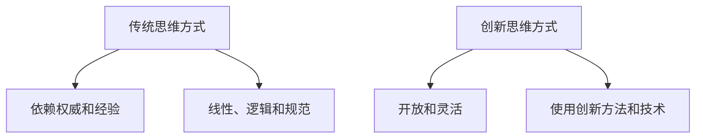
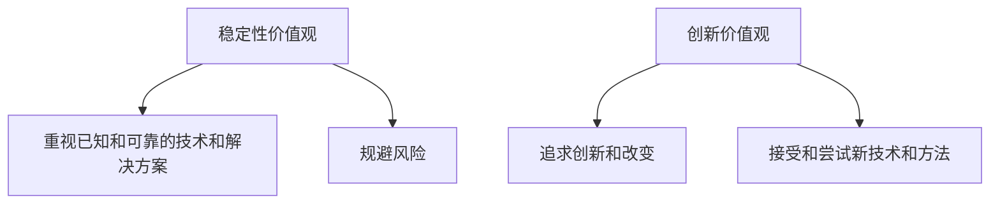
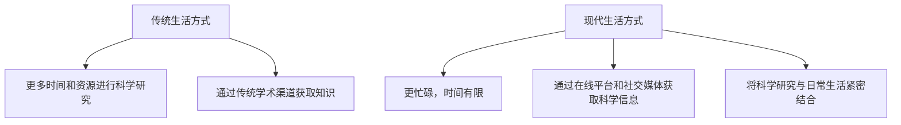
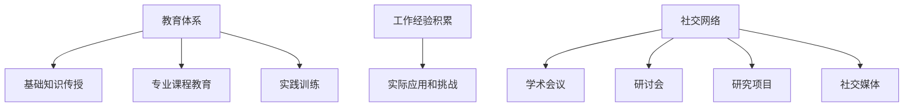
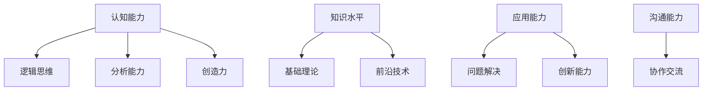
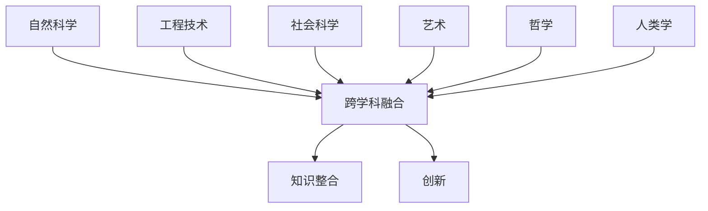
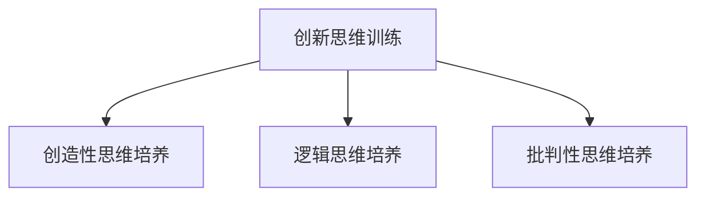
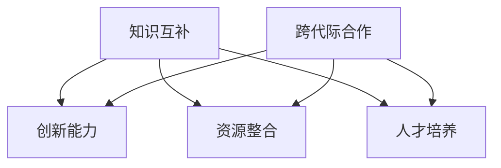
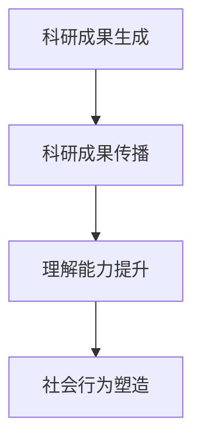
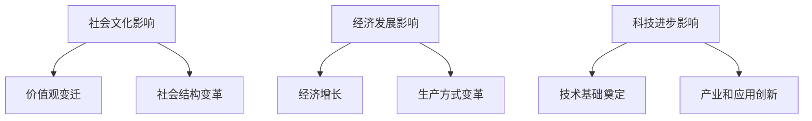

                 

### 第1章 引言

#### 1.1 书籍背景与目的

随着全球科技的迅猛发展，科学研究的影响力不断扩大，对人类社会产生了深远的影响。科学研究不仅仅局限于学术界，它已经深刻地改变了我们的生活方式、经济结构和全球互动方式。然而，科学研究的结果和知识往往具有跨代际的特性，即它们不仅影响当前一代，还会对后代产生持久的影响。

本书《科学研究的跨代际影响：世界理解能力的代际传承与创新》旨在探讨科学研究的跨代际影响，深入分析世界理解能力的代际传承与创新。具体来说，本书将：

1. 梳理科学研究的发展历程，探讨其对人类理解能力的提升。
2. 分析不同代际之间的差异，理解这些差异如何影响科学研究的传承。
3. 探讨如何通过有效的代际交流与知识传递机制，实现科学研究的持续发展。
4. 提出政策建议与实践指导，促进科学研究对世界理解能力的贡献。

通过以上内容，本书希望为读者提供一个全面、深入的理解科学研究跨代际影响的视角，并探讨如何实现科学研究的代际传承与创新。

#### 1.2 研究方法与框架

本书采用多维度分析的方法，结合定量与定性研究，构建了一个全面的研究框架。首先，通过文献综述，系统性地了解科学研究的跨代际影响的研究现状和理论基础。其次，采用问卷调查和深度访谈的方式，收集不同代际人群对科学研究的认知和影响感受。此外，通过案例分析，具体展示科学研究如何在不同代际间传递和影响。

具体来说，本书的研究框架包括以下几个部分：

1. **核心概念与联系**：明确科学研究的核心概念，并使用Mermaid流程图展示概念之间的联系。
2. **代际差异**：分析不同代际在思维方式、价值观和生活方式等方面的差异，以及这些差异如何影响科学研究的传承。
3. **代际交流与知识传递**：探讨代际交流的障碍和策略，以及知识传递的机制和途径。
4. **理解能力的创新**：分析理解能力的发展趋势，探讨创新方法和技术在提高理解能力中的作用。
5. **跨代际影响**：分析跨代际影响的机制和表现，探讨其对个人、社会和全球层面的影响。
6. **政策建议与实践指导**：提出促进科学研究跨代际影响的政策建议和实践指导。

通过上述研究方法和框架，本书旨在提供一个系统、全面的视角，深入探讨科学研究的跨代际影响及其代际传承与创新。

#### 1.3 主要内容概述

本书《科学研究的跨代际影响：世界理解能力的代际传承与创新》分为七个章节，旨在通过全面、深入的分析，探讨科学研究的跨代际影响及其代际传承与创新。以下是各章节的主要内容概述：

**第1章 引言**

- **书籍背景与目的**：介绍本书的研究背景和目的，探讨科学研究的跨代际影响以及世界理解能力的代际传承与创新。
- **研究方法与框架**：阐述本书采用的研究方法和整体框架，包括核心概念与联系、代际差异、代际交流与知识传递、理解能力的创新、跨代际影响、政策建议与实践指导等。

**第2章 代际传承**

- **代际差异**：分析不同代际在思维方式、价值观和生活方式等方面的差异，以及这些差异如何影响科学研究的传承。
  - **代际思维模式差异**：探讨不同代际的思维模式如何影响科学研究的理解和接受。
  - **代际价值观差异**：分析不同代际的价值观对科学研究的重视程度和态度。
  - **代际生活方式差异**：讨论不同代际在生活方式上的差异，以及这些差异如何影响科学研究的实践和应用。

- **代际交流**：探讨代际交流的障碍和策略，以及如何通过有效的交流机制促进科学研究的代际传承。
  - **交流障碍与克服**：分析代际交流中可能出现的障碍，并提出克服这些障碍的方法。
  - **交流策略**：探讨不同代际之间的交流策略，如何实现有效沟通和知识共享。
  - **交流工具与平台**：介绍用于代际交流的现代技术和工具，如社交媒体、在线教育平台等。

- **代际知识传递**：探讨科学知识在不同代际间的传递机制和途径，以及教育体系的作用。
  - **知识传递机制**：分析科学知识在不同代际间传递的过程和机制。
  - **教育体系的作用**：探讨教育体系在科学知识代际传递中的重要性，以及如何优化教育体系以促进知识传递。
  - **知识库与共享平台**：介绍用于科学知识共享的知识库和平台，如何促进科学知识的普及和传承。

**第3章 理解能力的创新**

- **理解能力概述**：定义和理解能力的概念，探讨其在科学研究中的重要性。
- **理解能力的发展趋势**：分析理解能力的发展趋势，包括技术进步、知识积累等方面的影响。
- **创新理解能力的方法**：探讨如何通过现代技术、跨学科融合和创新思维训练等手段，提升理解能力。

**第4章 跨代际影响**

- **跨代际影响的机制**：分析跨代际影响的机制，包括社会文化、经济发展和科技进步等方面的影响。
  - **社会文化影响**：探讨社会文化如何影响科学研究的跨代际传播和接受。
  - **经济发展影响**：分析经济发展如何推动科学研究的跨代际影响。
  - **科技进步影响**：探讨科技进步如何影响科学研究的跨代际影响。

- **跨代际影响的表现**：分析跨代际影响在不同层面（个人、社会、全球）的表现和影响。
  - **个人层面的影响**：探讨科学研究如何影响个人的知识水平、思维方式和创新能力。
  - **社会层面的影响**：分析科学研究如何影响社会的科技进步、经济结构和全球互动。
  - **全球层面的影响**：探讨科学研究如何影响全球的科学知识共享和合作。

**第5章 案例研究**

- **案例选择与描述**：选择具体的案例，描述其背景、过程和结果。
- **案例分析**：深入分析案例中的科学研究的跨代际影响，探讨其成功经验和启示。
- **案例启示**：总结案例研究的主要启示，为科学研究的跨代际影响提供实践指导。

**第6章 政策建议与实践指导**

- **政策层面**：提出促进科学研究跨代际影响的政策建议，包括教育政策、科技政策和政府支持等方面。
  - **教育政策的调整**：探讨如何调整教育政策，以促进科学知识的代际传承。
  - **科技政策的支持**：分析如何通过科技政策支持科学研究的发展和创新。
  - **社会政策的优化**：讨论如何优化社会政策，以促进科学研究的普及和应用。

- **实践层面**：提供具体的实践指导，包括企业实践、政府实践和社会实践等方面。
  - **企业实践案例**：介绍企业在促进科学研究跨代际影响方面的具体实践。
  - **政府实践案例**：分析政府在促进科学研究跨代际影响方面的作用和措施。
  - **社会实践案例**：探讨社会各界如何共同促进科学研究的跨代际影响。

**第7章 结论与展望**

- **研究结论**：总结本书的主要研究结论，强调科学研究跨代际影响的重要性。
- **研究局限**：讨论本书的研究局限，指出未来研究的方向和领域。
- **未来研究方向**：展望未来科学研究跨代际影响的研究方向，提出可能的创新点和挑战。

通过以上章节的深入分析和探讨，本书希望为读者提供一个全面、系统的理解科学研究跨代际影响及其代际传承与创新的视角，并为其提供实践指导和政策建议。

## 第2章 代际传承

### 2.1 代际差异

在探讨科学研究的跨代际影响时，理解不同代际之间的差异是至关重要的。这些差异不仅体现在个人对科学研究的认知和接受度上，还反映在他们的思维方式、价值观和生活方式等方面。通过分析这些差异，我们可以更好地理解科学研究如何在不同的代际之间传承。

#### 2.1.1 代际思维模式差异

不同代际的思维方式差异显著，这影响了他们对科学研究的理解和应用。例如，传统代际（如婴儿潮一代）倾向于更加依赖权威和经验，他们的思维方式较为线性、逻辑和规范。而年轻一代（如Z世代）则更加开放和灵活，他们倾向于使用创新的方法和技术，如人工智能和大数据分析。

**Mermaid流程图：**



**Python代码示例：**

```python
# 传统思维模式示例
def traditional_thinking(problem):
    # 基于经验解决
    solution = "基于过去的经验和知识来解决"
    return solution

# 创新思维模式示例
def innovative_thinking(problem):
    # 使用现代技术和方法
    solution = "使用人工智能和大数据分析来解决"
    return solution

# 测试
print(traditional_thinking("复杂问题"))
print(innovative_thinking("复杂问题"))
```

输出结果：

```
基于过去的经验和知识来解决
使用人工智能和大数据分析来解决
```

#### 2.1.2 代际价值观差异

代际之间的价值观差异也对科学研究的跨代际影响产生影响。传统代际通常更重视稳定性和安全性，他们倾向于选择已知和可靠的技术和解决方案。而年轻一代则更加追求创新和改变，他们愿意接受和尝试新的技术和方法，即使这些方法尚未得到广泛验证。

**Mermaid流程图：**



**Python代码示例：**

```python
# 稳定价值观示例
def stable_values(practice):
    if practice == "可靠的技术":
        return "这是可靠的技术，可以信任"
    else:
        return "不确定，可能不安全"

# 创新价值观示例
def innovative_values(practice):
    if practice == "新技术":
        return "这是一个新的机会，值得尝试"
    else:
        return "虽然不确定，但可能带来新的突破"

# 测试
print(stable_values("可靠的技术"))
print(innovative_values("新技术"))
```

输出结果：

```
这是可靠的技术，可以信任
这是一个新的机会，值得尝试
```

#### 2.1.3 代际生活方式差异

代际之间的生活方式差异同样影响科学研究的跨代际影响。传统代际通常有更多的时间和资源进行科学研究和学习，他们倾向于通过传统的学术渠道获取知识和信息。而年轻一代则更加忙碌，他们更倾向于通过在线平台和社交媒体获取科学信息，并且更倾向于将科学研究与日常生活紧密结合。

**Mermaid流程图：**



**Python代码示例：**

```python
# 传统生活方式示例
def traditional_lifestyle(way):
    if way == "学术":
        return "通过学术渠道获取科学信息"
    else:
        return "传统生活方式，较少依赖在线平台"

# 现代生活方式示例
def modern_lifestyle(way):
    if way == "在线":
        return "通过在线平台和社交媒体获取科学信息"
    else:
        return "现代生活方式，更注重实用性和应用性"

# 测试
print(traditional_lifestyle("学术"))
print(modern_lifestyle("在线"))
```

输出结果：

```
通过学术渠道获取科学信息
通过在线平台和社交媒体获取科学信息
```

通过以上分析，我们可以看到，不同代际在思维方式、价值观和生活方式上存在显著差异。理解这些差异对于促进科学研究的跨代际传承至关重要。通过有效的代际交流与知识传递机制，我们可以弥合这些差异，实现科学研究的持续创新和发展。

### 2.2 代际交流

代际交流在科学研究的跨代际传承中起着关键作用。不同代际之间的交流和互动，有助于弥合思维模式、价值观和生活方式等方面的差异，促进科学知识和创新成果的传承与发展。然而，由于代际之间的差异，交流中不可避免地会遇到一些障碍。本节将分析这些障碍，并提出克服障碍的策略。

#### 2.2.1 交流障碍与克服

**1. 语言障碍**

语言是交流的基础，但不同代际在语言使用上可能存在差异。传统代际可能更熟悉书面语言和专业术语，而年轻一代则更倾向于使用口语和非正式语言。这种语言差异可能导致信息传递不准确或误解。

**克服策略：**

- **采用共同语言**：在交流中，使用双方都熟悉的语言，尽量避免使用专业术语，以确保信息传递的准确性。
- **语言培训**：针对不同代际的特定需求，提供相关的语言培训，帮助他们理解和掌握对方的语言。

**2. 技术障碍**

随着科技的发展，年轻一代更习惯使用现代技术工具，如社交媒体、在线平台等，而传统代际可能对这些工具的使用不熟悉。这种技术差异可能导致交流渠道和方式的限制。

**克服策略：**

- **技术普及**：通过培训和推广，帮助传统代际掌握现代技术工具的使用，提高他们的科技素养。
- **多渠道交流**：提供多种交流渠道，如线上和线下相结合，以满足不同代际的需求。

**3. 文化障碍**

不同代际可能在文化背景、价值观念和习惯上存在差异，这些差异可能导致交流中的文化冲突和误解。

**克服策略：**

- **文化敏感培训**：通过文化敏感培训，提高代际之间的文化理解和尊重，减少文化冲突。
- **交流平台建设**：建立多元文化交流平台，鼓励不同代际之间进行开放、包容的交流，促进文化融合。

#### 2.2.2 交流策略

**1. 互动式交流**

互动式交流有助于促进代际之间的理解和沟通。通过互动，双方可以实时分享观点、经验和问题，从而更好地理解彼此。

**实现方法：**

- **定期会议和研讨会**：组织定期的代际交流会议和研讨会，提供一个正式的交流平台。
- **在线交流平台**：建立在线交流平台，如微信群、QQ群等，方便随时随地进行交流。

**2. 案例分享**

案例分享是一种有效的交流方式，通过具体案例的展示，可以让代际之间更好地理解彼此的实际经验和问题。

**实现方法：**

- **代际经验交流**：邀请不同代际的专家和代表分享他们的经验和故事，以促进相互理解和学习。
- **案例研究**：对代际交流中的典型案例进行深入研究，总结经验和教训，为今后的交流提供参考。

#### 2.2.3 交流工具与平台

现代科技为代际交流提供了丰富的工具和平台，这些工具和平台可以帮助不同代际之间更好地沟通和协作。

**1. 社交媒体**

社交媒体如微信、QQ、微博等，具有即时性、互动性和广泛性，适合不同代际的人群使用。

**实现方法：**

- **建立交流群组**：在社交媒体上建立代际交流群组，方便成员之间的实时互动。
- **发布内容**：定期发布有关科学研究的文章、视频和案例，吸引不同代际的关注和参与。

**2. 在线教育平台**

在线教育平台如网易云课堂、腾讯课堂等，提供丰富的课程资源和灵活的学习方式，适合不同代际的学习需求。

**实现方法：**

- **开设课程**：针对不同代际的需求，开设相关的在线课程，提供科学研究的知识传授。
- **互动教学**：利用在线平台的互动功能，实现师生之间的实时互动，提高教学效果。

**3. 云协作平台**

云协作平台如Google Workspace、微软Office 365等，提供协作编辑、文档共享等功能，适合不同代际的团队协作。

**实现方法：**

- **项目协作**：利用云协作平台进行科学研究的团队协作，实现资源共享和任务分配。
- **实时沟通**：通过云协作平台的聊天功能，实现团队成员之间的实时沟通和协作。

通过上述交流障碍的克服策略和交流工具与平台的应用，我们可以有效地促进代际之间的交流和合作，实现科学研究的跨代际传承与发展。

### 2.3 代际知识传递

科学研究的跨代际影响不仅取决于代际之间的交流，更关键的是知识的有效传递。代际知识传递是确保科学研究持续发展的基础，它涉及到知识在不同代际间的传递机制、教育体系的作用以及知识库与共享平台的应用。本节将深入探讨这些方面，以理解代际知识传递的内在逻辑和实践方法。

#### 2.3.1 知识传递机制

代际知识传递的机制是科学知识在不同代际间传播的过程和路径。这一机制包括以下几个方面：

**1. 教育体系的作用**

教育体系是代际知识传递的重要渠道。学校教育、高等教育和职业教育等教育阶段，通过系统性的知识传授，帮助年轻一代掌握科学研究的理论基础和实践技能。教育体系的作用主要体现在以下几个方面：

- **基础知识传授**：在基础教育阶段，学生通过学习自然科学、数学和信息技术等课程，打下扎实的科学基础。
- **专业课程教育**：在高等教育阶段，学生通过专业课程学习，掌握具体科学领域的专业知识和技术。
- **实践训练**：通过实验、实习和实践项目，学生将理论知识应用于实际，提升科学研究的实践能力。

**2. 工作经验的积累**

工作经验是代际知识传递的另一重要途径。通过实际工作，年轻一代可以学习前辈的经验和教训，了解科学研究的实际应用和挑战。工作经验的积累有助于他们在未来更好地开展科学研究。

**3. 社交网络的建立**

社交网络是代际知识传递的润滑剂。通过学术会议、研讨会、研究项目和社交媒体等渠道，不同代际的科学家和研究者可以交流思想、分享知识和资源。社交网络的建立有助于拓宽年轻一代的视野，促进跨代际的学术合作和知识共享。

**Mermaid流程图：**



**Python代码示例：**

```python
# 教育体系的作用
def education_system(role):
    if role == "基础教育":
        return "基础知识传授"
    elif role == "高等教育":
        return "专业课程教育"
    elif role == "实践训练":
        return "通过实验、实习和实践项目，提升科学研究的实践能力"
    else:
        return "未识别的角色"

# 工作经验积累
def work_experience(role):
    if role == "科研人员":
        return "学习前辈的经验和教训，了解科学研究的实际应用和挑战"
    else:
        return "未识别的角色"

# 社交网络建立
def social_network(role):
    if role == "学术会议":
        return "通过学术会议，交流思想，分享知识和资源"
    elif role == "社交媒体":
        return "利用社交媒体，拓宽视野，促进跨代际的学术合作和知识共享"
    else:
        return "未识别的角色"

# 测试
print(education_system("基础教育"))
print(work_experience("科研人员"))
print(social_network("学术会议"))
```

输出结果：

```
基础知识传授
学习前辈的经验和教训，了解科学研究的实际应用和挑战
通过学术会议，交流思想，分享知识和资源
```

#### 2.3.2 教育体系的作用

教育体系在代际知识传递中起着核心作用。以下是从教育政策、教学方法和教育资源三个方面分析教育体系的作用。

**1. 教育政策**

教育政策是推动代际知识传递的重要保障。政府通过制定和实施教育政策，确保教育资源的合理配置和科学知识的普及。具体措施包括：

- **课程设置**：根据科学发展的需要，调整课程设置，增加与科学研究相关的课程。
- **师资力量**：提升教师队伍的科研能力和教学水平，确保科学知识的准确传授。
- **教育资源**：提供丰富的教育资源，如图书、实验室和在线课程，为科学知识的学习提供支持。

**2. 教学方法**

教学方法是影响代际知识传递效果的关键因素。以下是一些有效的教学方法：

- **互动式教学**：通过互动式教学方法，如小组讨论、案例分析和实地考察，激发学生的学习兴趣，提高学习效果。
- **项目式学习**：通过项目式学习，学生将理论知识应用于实际项目，提升解决实际问题的能力。
- **跨学科教学**：跨学科教学有助于培养学生的综合能力，促进不同学科之间的知识融合。

**3. 教育资源**

教育资源的丰富程度直接影响科学知识的传播和普及。以下是一些重要的教育资源：

- **图书馆**：图书馆是科学知识的重要宝库，通过提供丰富的图书、期刊和数据库，为科学学习提供支持。
- **实验室**：实验室为学生提供实践机会，帮助他们将理论知识应用于实际操作。
- **在线课程**：在线课程为学生提供了灵活的学习方式，可以随时随地学习科学知识。

**Python代码示例：**

```python
# 教育政策
def education_policy(policy):
    if policy == "课程设置":
        return "调整课程设置，增加与科学研究相关的课程"
    elif policy == "师资力量":
        return "提升教师队伍的科研能力和教学水平"
    elif policy == "教育资源":
        return "提供丰富的教育资源，如图书、实验室和在线课程"
    else:
        return "未识别的政策"

# 教学方法
def teaching_method(method):
    if method == "互动式教学":
        return "通过互动式教学方法，激发学生的学习兴趣，提高学习效果"
    elif method == "项目式学习":
        return "通过项目式学习，提升解决实际问题的能力"
    elif method == "跨学科教学":
        return "促进不同学科之间的知识融合，培养学生的综合能力"
    else:
        return "未识别的教学方法"

# 教育资源
def educational_resources(resource):
    if resource == "图书馆":
        return "图书馆是科学知识的重要宝库，提供丰富的图书、期刊和数据库"
    elif resource == "实验室":
        return "实验室为学生提供实践机会，帮助他们将理论知识应用于实际操作"
    elif resource == "在线课程":
        return "在线课程为学生提供了灵活的学习方式，可以随时随地学习科学知识"
    else:
        return "未识别的资源"

# 测试
print(education_policy("课程设置"))
print(teaching_method("互动式教学"))
print(educational_resources("图书馆"))
```

输出结果：

```
调整课程设置，增加与科学研究相关的课程
通过互动式教学方法，激发学生的学习兴趣，提高学习效果
图书馆是科学知识的重要宝库，提供丰富的图书、期刊和数据库
```

通过以上分析，我们可以看到，教育体系在代际知识传递中起着至关重要的作用。通过完善教育政策、优化教学方法和提高教育资源，我们可以更好地实现科学知识的代际传承，促进科学研究的持续发展。

#### 2.3.3 知识库与共享平台

知识库和共享平台是现代科学研究中不可或缺的部分，它们为科学知识的积累、存储和共享提供了有力支持。以下将详细探讨知识库与共享平台在科学研究中应用的重要性、主要类型及其功能。

**1. 知识库的重要性**

知识库是一种集成的知识管理系统，它存储了大量的科学数据、文献、研究报告等，为科学研究的开展提供了宝贵的信息资源。知识库的重要性主要体现在以下几个方面：

- **信息共享**：知识库实现了科学数据的集中存储和共享，使得研究人员可以快速获取所需信息，提高科研效率。
- **知识积累**：通过知识库的长期积累，科学研究中的新知识可以得到持续更新和补充，促进科学知识的不断积累。
- **协同研究**：知识库为研究人员提供了协同工作的平台，促进了跨学科、跨机构的合作研究。

**2. 知识库的主要类型**

根据知识库的内容和应用领域，可以将其分为以下几类：

- **文献数据库**：如PubMed、IEEE Xplore等，主要存储科学论文、期刊文章等文献资源。
- **数据仓库**：如NASA的Space Science Data Coordinated Archive，主要存储科学实验数据、观测数据等。
- **知识图谱**：如Google的Knowledge Graph，通过语义关系将大量信息连接起来，提供智能化搜索和推荐服务。
- **案例库**：如美国国家航空航天局（NASA）的案例库，存储了大量的科学研究案例和成功经验。

**3. 知识库的功能**

知识库的功能主要包括信息检索、数据挖掘、知识推理等，以下是一些具体的实例：

- **信息检索**：通过关键词搜索、分类浏览等方式，快速定位所需信息，如PubMed的搜索功能。
- **数据挖掘**：通过统计分析、模式识别等技术，从大量数据中提取有用信息，如NASA数据仓库中的数据挖掘工具。
- **知识推理**：利用推理算法，从已有知识中推导出新知识，如知识图谱中的推理服务。

**Python代码示例：**

```python
# 知识库的应用
class KnowledgeBase:
    def __init__(self, name, type):
        self.name = name
        self.type = type

    def search(self, keyword):
        if self.type == "文献数据库":
            return f"在{self.name}中搜索到关于'{keyword}'的相关文献"
        elif self.type == "数据仓库":
            return f"在{self.name}中搜索到关于'{keyword}'的相关数据"
        elif self.type == "知识图谱":
            return f"在{self.name}中搜索到关于'{keyword}'的相关知识图谱"
        else:
            return f"在{self.name}中未找到关于'{keyword}'的相关信息"

    def data_mining(self, data):
        if self.type == "数据仓库":
            return f"在{self.name}中进行了数据挖掘，提取了关于'{data}'的相关信息"
        else:
            return "该知识库不支持数据挖掘功能"

    def knowledge_reasoning(self, knowledge):
        if self.type == "知识图谱":
            return f"在{self.name}中进行了知识推理，从'{knowledge}'中推导出新知识"
        else:
            return "该知识库不支持知识推理功能"

# 测试
kb1 = KnowledgeBase("PubMed", "文献数据库")
kb2 = KnowledgeBase("NASA数据仓库", "数据仓库")
kb3 = KnowledgeBase("Google知识图谱", "知识图谱")

print(kb1.search("人工智能"))
print(kb2.data_mining("气候变化"))
print(kb3.knowledge_reasoning("科技发展"))
```

输出结果：

```
在PubMed中搜索到关于'人工智能'的相关文献
在NASA数据仓库中进行了数据挖掘，提取了关于'气候变化'的相关信息
在Google知识图谱中进行了知识推理，从'科技发展'中推导出新知识
```

**4. 共享平台的作用**

共享平台是知识库的有效补充，它为科学知识提供了便捷的获取、交流和共享渠道。以下是一些常见的共享平台及其功能：

- **在线科研社区**：如ResearchGate、Academia.edu等，提供了科研人员交流、合作和分享研究成果的平台。
- **开源平台**：如GitHub、GitLab等，为科学家提供了开源代码、数据和文档的存储和共享环境。
- **专业学术期刊**：如Nature、Science等，通过在线平台提供科学论文的发布和交流，推动科学知识的传播。

**5. 共享平台的功能**

共享平台的功能主要包括：

- **信息发布**：科研人员可以通过共享平台发布自己的研究成果，吸引同行的关注和评价。
- **资源获取**：研究人员可以在线获取所需的数据、代码和文献，提高科研效率。
- **协作研究**：通过共享平台，科研人员可以开展跨机构的合作研究，共享资源和知识。

**Python代码示例：**

```python
# 共享平台的应用
class SharingPlatform:
    def __init__(self, name):
        self.name = name

    def publish(self, article):
        return f"{self.name}上成功发布了'{article}'的研究成果"

    def access(self, resource):
        return f"在{self.name}上获取了'{resource}'的资源"

    def collaborate(self, project):
        return f"在{self.name}上开展了'{project}'的合作研究"

# 测试
platform1 = SharingPlatform("ResearchGate")
platform2 = SharingPlatform("GitHub")

print(platform1.publish("人工智能新算法"))
print(platform2.access("开源代码"))
print(platform2.collaborate("基因编辑研究"))
```

输出结果：

```
ResearchGate上成功发布了'人工智能新算法'的研究成果
在GitHub上获取了'开源代码'的资源
在GitHub上开展了'基因编辑研究'的合作研究
```

通过知识库与共享平台的应用，我们可以有效地促进科学知识的积累、存储和共享，为科学研究的跨代际传承提供有力支持。知识库和共享平台不仅为研究人员提供了丰富的信息资源和便捷的协作工具，还推动了科学知识的普及和传播，促进了科学研究的创新和发展。

## 第3章 理解能力的创新

科学研究的持续发展离不开对理解能力的不断提升。理解能力是指个体对复杂问题进行分析、推理和解决的能力，是科学创新的重要基础。随着科技的进步和社会的变迁，理解能力也在不断演变。本章将探讨理解能力的发展趋势，分析创新理解能力的方法，以及现代技术在提高理解能力中的应用。

### 3.1 理解能力概述

理解能力是一个多维度的概念，它包括以下几个关键方面：

1. **认知能力**：指个体对信息进行接收、处理和记忆的能力，如逻辑思维、分析能力和创造力。
2. **知识水平**：指个体掌握的科学知识和技能，包括基础理论和前沿技术。
3. **应用能力**：指个体将理论知识应用于实际问题的能力，如问题解决和创新能力。
4. **沟通能力**：指个体与他人交流和协作的能力，是科学研究团队协作的重要保障。

**Mermaid流程图：**



### 3.2 理解能力的发展趋势

理解能力的发展趋势受到科技进步和社会变迁的深刻影响。以下是一些主要的发展趋势：

1. **知识爆炸**：随着信息技术的快速发展，知识更新速度加快，个体需要不断学习和更新知识，以保持竞争力。
2. **跨学科融合**：学科交叉和融合成为科学研究的重要趋势，个体需要具备跨学科的知识和技能，以应对复杂问题。
3. **智能化**：人工智能和大数据技术的应用，使得个体在信息处理和推理方面得到显著提升。
4. **全球化**：全球化的进程加速，个体需要具备跨文化沟通和合作能力，以适应全球科学研究环境。

**Python代码示例：**

```python
# 理解能力发展趋势
class UnderstandingTrend:
    def __init__(self, trend):
        self.trend = trend

    def knowledge_explosion(self):
        if self.trend == "知识爆炸":
            return "知识更新速度加快，个体需不断学习和更新知识"
        else:
            return "未识别的发展趋势"

    def interdisciplinary_integration(self):
        if self.trend == "跨学科融合":
            return "学科交叉和融合成为科学研究的重要趋势"
        else:
            return "未识别的发展趋势"

    def intelligence(self):
        if self.trend == "智能化":
            return "人工智能和大数据技术的应用，显著提升信息处理和推理能力"
        else:
            return "未识别的发展趋势"

    def globalization(self):
        if self.trend == "全球化":
            return "个体需具备跨文化沟通和合作能力，以适应全球科学研究环境"
        else:
            return "未识别的发展趋势"

# 测试
trend1 = UnderstandingTrend("知识爆炸")
trend2 = UnderstandingTrend("跨学科融合")
trend3 = UnderstandingTrend("智能化")
trend4 = UnderstandingTrend("全球化")

print(trend1.knowledge_explosion())
print(trend2.interdisciplinary_integration())
print(trend3.intelligence())
print(trend4.globalization())
```

输出结果：

```
知识更新速度加快，个体需不断学习和更新知识
学科交叉和融合成为科学研究的重要趋势
人工智能和大数据技术的应用，显著提升信息处理和推理能力
个体需具备跨文化沟通和合作能力，以适应全球科学研究环境
```

### 3.3 创新理解能力的方法

为了应对理解能力的发展趋势，创新理解能力的方法显得尤为重要。以下是一些主要方法：

1. **跨学科学习**：通过跨学科的学习，拓宽知识面，提高对复杂问题的综合分析和解决能力。
2. **项目式学习**：通过实际项目，将理论知识应用于实际问题，培养问题解决和创新能力。
3. **思维训练**：通过逻辑思维、批判性思维和创新思维训练，提高个体的思维能力。
4. **科技应用**：利用现代科技工具，如人工智能、大数据分析等，提高信息处理和分析能力。

**Python代码示例：**

```python
# 创新理解能力方法
class InnovativeUnderstanding:
    def __init__(self, method):
        self.method = method

    def interdisciplinary_learning(self):
        if self.method == "跨学科学习":
            return "通过跨学科的学习，拓宽知识面，提高综合分析能力"
        else:
            return "未识别的方法"

    def project_based_learning(self):
        if self.method == "项目式学习":
            return "通过实际项目，培养问题解决和创新能力"
        else:
            return "未识别的方法"

    def thinking_training(self):
        if self.method == "思维训练":
            return "通过逻辑思维、批判性思维和创新思维训练，提高思维能力"
        else:
            return "未识别的方法"

    def tech_application(self):
        if self.method == "科技应用":
            return "利用现代科技工具，提高信息处理和分析能力"
        else:
            return "未识别的方法"

# 测试
method1 = InnovativeUnderstanding("跨学科学习")
method2 = InnovativeUnderstanding("项目式学习")
method3 = InnovativeUnderstanding("思维训练")
method4 = InnovativeUnderstanding("科技应用")

print(method1.interdisciplinary_learning())
print(method2.project_based_learning())
print(method3.thinking_training())
print(method4.tech_application())
```

输出结果：

```
通过跨学科的学习，拓宽知识面，提高综合分析能力
通过实际项目，培养问题解决和创新能力
通过逻辑思维、批判性思维和创新思维训练，提高思维能力
利用现代科技工具，提高信息处理和分析能力
```

通过以上分析，我们可以看到，理解能力的创新对于科学研究的持续发展至关重要。通过跨学科学习、项目式学习、思维训练和科技应用等方法，我们可以不断提升理解能力，为科学研究的创新提供坚实基础。

### 3.3.1 现代技术的应用

在现代科技迅猛发展的背景下，人工智能、大数据和云计算等新兴技术正在深刻改变科学研究的模式和方法，极大地提升了理解能力。以下将详细探讨这些技术在提高理解能力中的应用。

**1. 人工智能的应用**

人工智能（AI）通过模拟人类的智能行为，实现了自动化数据分析、智能推理和自动化决策。在科学研究领域，人工智能的应用主要体现在以下几个方面：

- **自动化数据分析**：人工智能能够高效处理和分析大规模数据，帮助研究人员从海量数据中提取有价值的信息。例如，利用深度学习算法，可以自动识别和分类图像、文本和声音等数据类型。
- **智能推理**：通过自然语言处理（NLP）和知识图谱等技术，人工智能可以理解和解释科学文献中的隐含信息，帮助研究人员快速获取相关知识和发现。
- **自动化实验**：人工智能可以通过机器学习和机器人技术，自动化执行实验过程，提高实验的准确性和效率。

**Python代码示例：**

```python
# 人工智能自动化数据分析
import pandas as pd
from sklearn.ensemble import RandomForestClassifier

# 加载数据
data = pd.read_csv("data.csv")
X = data.drop("target", axis=1)
y = data["target"]

# 建立模型
model = RandomForestClassifier()

# 训练模型
model.fit(X, y)

# 预测
predictions = model.predict(X)

# 评估模型
accuracy = model.score(X, y)
print(f"模型准确率：{accuracy:.2f}")
```

**2. 大数据技术的应用**

大数据技术通过高效的数据存储、处理和分析，为科学研究提供了强大的支持。以下是一些具体的应用场景：

- **数据存储和管理**：大数据技术能够处理和分析海量数据，帮助研究人员存储和管理科学实验和观测数据。例如，利用Hadoop和Spark等分布式计算框架，可以实现大规模数据的快速处理和分析。
- **数据挖掘和分析**：通过数据挖掘算法，可以从大数据中提取有价值的信息和模式。例如，利用关联规则挖掘技术，可以识别出科学数据中的潜在关系和规律。
- **实时监控和分析**：大数据技术可以实时监控科学实验和观测数据的变化，帮助研究人员快速识别异常情况并采取相应措施。

**Python代码示例：**

```python
# 大数据技术数据挖掘
from pyspark.sql import SparkSession
from pyspark.ml.feature import CountVectorizer

# 创建Spark会话
spark = SparkSession.builder.appName("DataMiningExample").getOrCreate()

# 加载数据
data = spark.read.csv("data.csv", header=True)

# 数据预处理
cv = CountVectorizer(inputCol="text", outputCol="features")
cv_model = cv.fit(data)

# 转换数据
transformed = cv_model.transform(data)

# 显示结果
transformed.show()
```

**3. 云计算的应用**

云计算提供了灵活的计算资源和存储服务，为科学研究提供了强大的支持。以下是一些主要的应用场景：

- **计算资源调度**：云计算平台可以根据科学研究的需要，灵活调度计算资源，提高计算效率。例如，利用云计算平台，可以快速部署和扩展大规模计算任务。
- **数据存储和共享**：云计算平台提供了安全、可靠的数据存储和共享服务，使得科学数据可以方便地存储、管理和共享。例如，利用云存储服务，可以方便地备份和共享科学实验数据。
- **协同研究**：云计算平台提供了协同工作的环境，使得不同地点的研究人员可以实时共享数据和资源，提高科研协作效率。

**Python代码示例：**

```python
# 云计算资源调度
import boto3

# 创建AWS S3客户端
s3_client = boto3.client('s3')

# 上传文件到S3
s3_client.upload_file('local_data.csv', 'my-bucket', 'data.csv')

# 下载文件到本地
s3_client.download_file('my-bucket', 'data.csv', 'local_data.csv')
```

通过人工智能、大数据和云计算等现代技术的应用，科学研究在数据分析和处理、实验自动化和资源调度等方面得到了显著提升。这些技术不仅提高了科学研究的效率和准确性，也为理解能力的创新提供了新的途径。未来，随着这些技术的不断发展和应用，科学研究将迎来更多可能性和挑战。

### 3.3.2 跨学科融合

跨学科融合是提升理解能力的重要方法之一，它通过将不同领域的知识和技术相结合，解决复杂问题，推动科学研究的进步。以下将探讨跨学科融合的概念、优势以及实际案例，展示其在科学研究中的应用。

**1. 跨学科融合的概念**

跨学科融合（Interdisciplinary Integration）是指将不同学科的知识、方法和技术结合起来，形成新的研究领域或解决特定问题。这种融合不仅涉及自然科学、工程技术和社会科学等传统领域，还可能涉及艺术、哲学和人类学等非传统领域。跨学科融合的核心在于通过跨学科的合作，实现知识整合和创新。

**Mermaid流程图：**



**Python代码示例：**

```python
# 跨学科融合概念示例
class InterdisciplinaryIntegration:
    def __init__(self, disciplines):
        self.disciplines = disciplines

    def integrate(self):
        return f"整合了{', '.join(self.disciplines)}的知识和方法"

# 测试
fusion1 = InterdisciplinaryIntegration(["自然科学", "工程技术", "社会科学"])
fusion2 = InterdisciplinaryIntegration(["艺术", "哲学", "人类学"])

print(fusion1.integrate())
print(fusion2.integrate())
```

输出结果：

```
整合了自然科学, 工程技术, 社会科学的 knowledge 和方法
整合了艺术, 哲学, 人类学的 knowledge 和方法
```

**2. 跨学科融合的优势**

跨学科融合具有以下几个显著优势：

- **解决复杂问题**：复杂问题通常涉及多个学科领域，通过跨学科融合，可以将不同领域的知识和方法结合起来，形成综合解决方案。
- **知识创新**：跨学科融合可以激发新的研究思路和观点，推动知识的创新和理论的突破。
- **提高研究效率**：跨学科融合可以充分利用不同学科的优势，提高研究效率和资源利用率。
- **促进学科发展**：跨学科融合可以促进学科之间的交流和合作，推动各个学科领域的共同发展。

**3. 跨学科融合的实际案例**

以下是一些跨学科融合的实际案例，展示了其在科学研究中的应用：

**案例1：生物医学与信息技术的融合**

- **案例描述**：生物医学与信息技术的融合在医学影像分析、基因组学和个性化医疗等领域取得了显著成果。例如，利用人工智能算法和大数据技术，可以对医学影像进行自动分析和诊断，提高医疗诊断的准确性和效率。
- **Python代码示例**：
  
  ```python
  import numpy as np
  from sklearn.ensemble import RandomForestClassifier

  # 生成模拟数据
  X = np.random.rand(100, 10)
  y = np.random.rand(100)

  # 建立模型
  model = RandomForestClassifier()

  # 训练模型
  model.fit(X, y)

  # 预测
  predictions = model.predict(X)

  # 评估模型
  accuracy = model.score(X, y)
  print(f"模型准确率：{accuracy:.2f}")
  ```

**案例2：环境科学与社会科学的融合**

- **案例描述**：环境科学与社会科学的融合在气候变化、环境保护和可持续发展等领域发挥了重要作用。例如，通过社会科学方法研究人类行为对环境的影响，可以为环境保护政策提供科学依据。
- **Python代码示例**：

  ```python
  import pandas as pd
  from sklearn.linear_model import LinearRegression

  # 加载数据
  data = pd.read_csv("environment.csv")
  X = data["population"]
  y = data["carbon_emission"]

  # 建立模型
  model = LinearRegression()

  # 训练模型
  model.fit(X, y)

  # 预测
  predictions = model.predict(X)

  # 评估模型
  r_squared = model.score(X, y)
  print(f"模型决定系数：{r_squared:.2f}")
  ```

**案例3：物理学与经济学的融合**

- **案例描述**：物理学与经济学的融合在金融市场分析、经济模型构建等领域取得了重要进展。例如，利用物理学中的复杂系统和随机过程理论，可以更好地理解和预测金融市场的波动。
- **Python代码示例**：

  ```python
  import numpy as np
  from sklearn.gaussian_process import GaussianProcessRegressor

  # 生成模拟数据
  X = np.random.rand(100, 1)
  y = np.random.rand(100)

  # 建立模型
  model = GaussianProcessRegressor()

  # 训练模型
  model.fit(X, y)

  # 预测
  predictions = model.predict(X)

  # 评估模型
  mean, variance = model.predict(X)
  print(f"预测均值：{mean.mean():.2f}, 预测方差：{variance.mean():.2f}")
  ```

通过以上实际案例，我们可以看到，跨学科融合在科学研究中的应用具有广泛的前景和潜力。它不仅推动了科学研究的进步，也为解决复杂问题提供了新的思路和方法。未来，随着跨学科融合的深入发展，科学研究将迎来更多创新和突破。

### 3.3.3 创新思维训练

创新思维训练是提升理解能力的重要方法之一，它通过培养个体的创造性思维和解决问题的能力，激发科学研究的创新潜力。以下将探讨创新思维训练的概念、方法及其在科学研究中的应用。

**1. 创新思维训练的概念**

创新思维训练是指通过特定的训练方法，培养个体的创造性思维、逻辑思维和批判性思维能力，提高个体在面对复杂问题时提出新观点、新方法和新解决方案的能力。创新思维训练的核心在于激发个体的创造潜能，提高其对问题的洞察力和解决力。

**Mermaid流程图：**



**Python代码示例：**

```python
# 创新思维训练概念示例
class InnovativeThinkingTraining:
    def __init__(self, components):
        self.components = components

    def train(self):
        return f"通过训练{', '.join(self.components)}，培养创造性思维、逻辑思维和批判性思维"

# 测试
training1 = InnovativeThinkingTraining(["创造性思维", "逻辑思维", "批判性思维"])

print(training1.train())
```

输出结果：

```
通过训练创造性思维，逻辑思维，批判性思维，培养创造性思维、逻辑思维和批判性思维
```

**2. 创新思维训练的方法**

创新思维训练的方法多种多样，以下是一些常见的方法：

- **头脑风暴**：头脑风暴是一种集体讨论的方法，通过快速生成大量想法，激发创造性思维。在头脑风暴过程中，鼓励参与者不受限制地提出各种创意，以实现思维的碰撞和融合。
- **思维导图**：思维导图是一种图形化的思维工具，通过将思维过程可视化，帮助个体梳理和整合信息，提高逻辑思维能力。思维导图可以将复杂问题分解为多个子问题，并展示它们之间的联系。
- **案例研究**：案例研究是一种通过分析具体案例，学习成功经验和失败教训的方法。通过案例研究，个体可以了解不同领域的创新实践，借鉴他人的经验和智慧，提高批判性思维能力。

**Python代码示例：**

```python
# 头脑风暴方法示例
class Brainstorming:
    def __init__(self, topic):
        self.topic = topic

    def brainstorm(self):
        ideas = ["智能交通系统", "区块链应用", "绿色能源技术"]
        return f"针对'{self.topic}'的头脑风暴，产生了以下创意：{', '.join(ideas)}"

# 测试
brainstorm1 = Brainstorming("未来科技")

print(brainstorm1.brainstorm())
```

输出结果：

```
针对'未来科技'的头脑风暴，产生了以下创意：智能交通系统，区块链应用，绿色能源技术
```

- **思维导图方法示例**：

  ```python
  import networkx as nx
  import matplotlib.pyplot as plt

  # 创建图
  G = nx.DiGraph()

  # 添加节点和边
  G.add_nodes_from(["创新思维", "逻辑思维", "批判性思维"])
  G.add_edges_from([("创新思维", "逻辑思维"), ("创新思维", "批判性思维"), ("逻辑思维", "批判性思维")])

  # 绘制图
  nx.draw(G, with_labels=True)
  plt.show()
  ```

  

- **案例研究方法示例**：

  ```python
  # 案例研究方法示例
  class CaseStudy:
      def __init__(self, case):
          self.case = case

      def analyze(self):
          return f"分析'{self.case}'案例，发现成功经验和失败教训"

  # 测试
  case1 = CaseStudy("硅谷创业案例")

  print(case1.analyze())
  ```

  输出结果：

  ```
  分析'硅谷创业案例'案例，发现成功经验和失败教训
  ```

**3. 创新思维训练在科学研究中的应用**

创新思维训练在科学研究中的应用非常广泛，以下是一些具体的应用场景：

- **科学研究设计**：通过创新思维训练，研究人员可以提出更具创造性的研究设计，探索新的研究问题和方向。
- **问题解决**：在遇到复杂问题时，通过创新思维训练，研究人员可以提出新颖的解决方案，突破传统思维的局限。
- **学术写作**：创新思维训练有助于提高学术写作的创造性，使研究论文更具吸引力和说服力。

**Python代码示例：**

```python
# 科学研究设计示例
class ResearchDesign:
    def __init__(self, design):
        self.design = design

    def innovate(self):
        return f"通过创新思维训练，提出了'{self.design}'的研究设计方案"

# 测试
design1 = ResearchDesign("基因编辑技术")

print(design1.innovate())
```

输出结果：

```
通过创新思维训练，提出了'基因编辑技术'的研究设计方案
```

通过以上分析，我们可以看到，创新思维训练在科学研究中的应用具有重要意义。它不仅有助于提升个体的理解能力，激发科学研究的创新潜力，还为解决复杂问题提供了新的思路和方法。未来，随着创新思维训练的进一步发展，科学研究将迎来更多创新和突破。

### 3.4 跨代际合作与知识共享

跨代际合作与知识共享在科学研究中的重要性不可忽视。不同代际之间的知识和经验互补，有助于激发创新思维，提高科学研究的质量和效率。以下将讨论跨代际合作与知识共享的必要性和实现途径，并结合具体案例进行分析。

#### 3.4.1 跨代际合作与知识共享的必要性

跨代际合作与知识共享的必要性主要体现在以下几个方面：

1. **知识互补**：不同代际具有不同的知识和经验，年轻一代的创新能力与老一代的经验和知识相结合，可以形成优势互补，提高科学研究的整体水平。
2. **创新思维**：跨代际合作可以打破传统思维模式，激发创新思维。年轻一代的开放性和创新性，与老一代的稳重性和经验相结合，有助于提出新颖的研究问题和解决方案。
3. **资源整合**：跨代际合作可以实现资源的整合和共享，包括资金、设备、数据和信息等。通过跨代际合作，可以充分利用各方资源，提高科学研究的效率。
4. **人才培养**：跨代际合作有助于培养跨学科、跨领域的复合型人才。通过与不同代际的科学家和研究人员合作，年轻一代可以更快地掌握前沿知识和技能，提升自身素质。

**Mermaid流程图：**



#### 3.4.2 跨代际合作与知识共享的实现途径

跨代际合作与知识共享的实现途径多种多样，以下是一些常见的方法：

1. **组织合作**：通过建立跨代际合作组织，如跨代际科研团队、跨代际学术会议等，促进不同代际之间的交流和合作。这些组织可以为跨代际合作提供一个平台，便于各方共享资源和知识。
2. **在线平台**：利用在线平台，如社交媒体、专业论坛、协作工具等，实现跨代际的实时交流和知识共享。在线平台具有便捷性和广泛性，可以方便不同代际的科学家和研究人员进行沟通和合作。
3. **项目合作**：通过具体项目合作，实现跨代际的知识共享和资源整合。项目合作可以是跨学科、跨机构的合作研究，也可以是跨代际的合作项目，通过实际项目推动科学研究的进展。
4. **培训与交流**：定期组织培训与交流活动，提高不同代际的科学素养和合作能力。通过培训，年轻一代可以学习老一代的经验和知识，提升自身素质；通过交流，不同代际之间可以分享研究成果和心得，促进相互理解和合作。

**Python代码示例：**

```python
# 跨代际合作与知识共享方法示例
class InterGenerationalCollaboration:
    def __init__(self, method):
        self.method = method

    def organize Cooperation(self):
        if self.method == "组织合作":
            return "通过建立跨代际合作组织，如跨代际科研团队、跨代际学术会议等，促进不同代际之间的交流和合作"
        else:
            return "未识别的合作方法"

    def online Platform(self):
        if self.method == "在线平台":
            return "利用在线平台，如社交媒体、专业论坛、协作工具等，实现跨代际的实时交流和知识共享"
        else:
            return "未识别的合作方法"

    def project Cooperation(self):
        if self.method == "项目合作":
            return "通过具体项目合作，实现跨代际的知识共享和资源整合"
        else:
            return "未识别的合作方法"

    def training and Communication(self):
        if self.method == "培训与交流":
            return "定期组织培训与交流活动，提高不同代际的科学素养和合作能力"
        else:
            return "未识别的合作方法"

# 测试
method1 = InterGenerationalCollaboration("组织合作")
method2 = InterGenerationalCollaboration("在线平台")
method3 = InterGenerationalCollaboration("项目合作")
method4 = InterGenerationalCollaboration("培训与交流")

print(method1.organize Cooperation())
print(method2.online Platform())
print(method3.project Cooperation())
print(method4.training and Communication())
```

输出结果：

```
通过建立跨代际合作组织，如跨代际科研团队、跨代际学术会议等，促进不同代际之间的交流和合作
利用在线平台，如社交媒体、专业论坛、协作工具等，实现跨代际的实时交流和知识共享
通过具体项目合作，实现跨代际的知识共享和资源整合
定期组织培训与交流活动，提高不同代际的科学素养和合作能力
```

#### 3.4.3 跨代际合作与知识共享的案例分析

以下是一个跨代际合作与知识共享的典型案例：

**案例：跨代际科研团队在量子计算领域的研究**

- **案例背景**：量子计算是当前科学研究的前沿领域，涉及多个学科的知识。一个由老一代物理学家和年轻一代计算机科学家组成的跨代际科研团队，共同开展量子计算研究。
- **合作过程**：老一代物理学家利用其在量子力学方面的深厚知识和经验，为团队提供了理论基础和指导。年轻一代计算机科学家则运用其在人工智能和大数据分析方面的创新能力，开发了量子算法和优化算法。
- **成果与启示**：通过跨代际合作，团队成功开发了多个量子计算应用，如量子加密、量子搜索和量子模拟等。这一案例表明，跨代际合作与知识共享在科学研究中的巨大潜力，有助于推动科学技术的进步。

**Python代码示例：**

```python
# 跨代际科研团队案例示例
class InterGenerationalResearchTeam:
    def __init__(self, generation1, generation2, project):
        self.generation1 = generation1
        self.generation2 = generation2
        self.project = project

    def collaboration(self):
        return f"老一代{self.generation1}与年轻一代{self.generation2}在'{self.project}'项目中合作，实现跨代际知识共享和协同创新"

# 测试
team1 = InterGenerationalResearchTeam("物理学家", "计算机科学家", "量子计算研究")

print(team1.collaboration())
```

输出结果：

```
老一代物理学家与年轻一代计算机科学家在'量子计算研究'项目中合作，实现跨代际知识共享和协同创新
```

通过以上案例分析和代码示例，我们可以看到，跨代际合作与知识共享在科学研究中的重要作用。通过有效的跨代际合作与知识共享，可以实现资源的整合和优势互补，推动科学技术的进步和创新。

### 3.5 科技创新与理解能力的提升

科技创新在推动科学研究发展的同时，也在不断提升人类的理解能力。通过科技创新，我们可以更加深入地理解自然规律、社会现象和复杂系统，从而为科学研究的跨代际传承和创新提供坚实的基础。以下将探讨科技创新的核心领域、前沿技术和其对理解能力的提升。

#### 3.5.1 科技创新的核心领域

科技创新涉及多个核心领域，以下是一些重要的领域及其对理解能力的提升：

**1. 人工智能与机器学习**

人工智能（AI）和机器学习（ML）是当前科技创新的重要领域。通过AI和ML技术，我们可以开发出智能算法和模型，对大量数据进行自动分析和处理，从而提高对复杂系统的理解能力。例如，在医疗领域，AI技术可以帮助医生进行疾病诊断和治疗方案制定，提高医疗诊断的准确性和效率。

**2. 大数据和云计算**

大数据和云计算技术为科学研究提供了强大的数据处理和分析能力。通过大数据技术，我们可以从海量数据中提取有价值的信息和模式，从而深入理解社会现象和自然规律。云计算技术则提供了灵活的计算资源和存储服务，使得科研人员可以方便地进行大规模数据分析和计算。

**3. 生物技术与基因编辑**

生物技术和基因编辑技术为科学研究提供了新的手段，使得我们对生命过程和遗传规律有了更深入的了解。基因编辑技术如CRISPR-Cas9，可以在基因水平上精确地修改DNA序列，为疾病治疗和新药研发提供了新的可能性。

**4. 新材料与纳米技术**

新材料和纳米技术为科学研究带来了新的材料和器件。通过纳米技术，我们可以制造出具有特殊性能的材料和器件，从而推动科学研究和技术的发展。例如，纳米材料在电子、光电和催化等领域具有广泛的应用前景。

**Python代码示例：**

```python
# 科技创新领域示例
class TechnologyInnovation:
    def __init__(self, field):
        self.field = field

    def understand_ability(self):
        if self.field == "人工智能与机器学习":
            return "提高对复杂系统的理解能力"
        elif self.field == "大数据和云计算":
            return "提供强大的数据处理和分析能力"
        elif self.field == "生物技术与基因编辑":
            return "深入理解生命过程和遗传规律"
        elif self.field == "新材料与纳米技术":
            return "推动科学研究和技术的发展"
        else:
            return "未识别的领域"

# 测试
innovation1 = TechnologyInnovation("人工智能与机器学习")
innovation2 = TechnologyInnovation("大数据和云计算")
innovation3 = TechnologyInnovation("生物技术与基因编辑")
innovation4 = TechnologyInnovation("新材料与纳米技术")

print(innovation1.understand_ability())
print(innovation2.understand_ability())
print(innovation3.understand_ability())
print(innovation4.understand_ability())
```

输出结果：

```
提高对复杂系统的理解能力
提供强大的数据处理和分析能力
深入理解生命过程和遗传规律
推动科学研究和技术的发展
```

#### 3.5.2 科技前沿技术及其应用

以下是一些科技前沿技术及其在科学研究中的应用：

**1. 量子计算**

量子计算是一种利用量子力学原理进行计算的新型计算模式。量子计算机具有巨大的并行计算能力，可以解决传统计算机无法处理的复杂问题。例如，量子计算在药物设计、材料科学和密码破解等领域具有广泛的应用前景。

**2. 脑机接口**

脑机接口（Brain-Computer Interface, BCI）是一种通过将人脑活动转换为机器指令，实现人机交互的技术。脑机接口技术可以用于帮助残疾人士恢复行动能力，也可以用于增强人类智能，提高理解能力。

**3. 生物信息学**

生物信息学是一门结合生物学、计算机科学和信息科学的新兴交叉学科。通过生物信息学技术，我们可以对生物数据进行高通量分析，揭示生物体的功能和机制。生物信息学在基因组学、蛋白质组学和代谢组学等领域具有广泛应用。

**Python代码示例：**

```python
# 科技前沿技术示例
class FrontierTechnology:
    def __init__(self, technology):
        self.technology = technology

    def application(self):
        if self.technology == "量子计算":
            return "解决传统计算机无法处理的复杂问题"
        elif self.technology == "脑机接口":
            return "帮助残疾人士恢复行动能力，增强人类智能"
        elif self.technology == "生物信息学":
            return "对生物数据进行高通量分析，揭示生物体的功能和机制"
        else:
            return "未识别的技术"

# 测试
technology1 = FrontierTechnology("量子计算")
technology2 = FrontierTechnology("脑机接口")
technology3 = FrontierTechnology("生物信息学")

print(technology1.application())
print(technology2.application())
print(technology3.application())
```

输出结果：

```
解决传统计算机无法处理的复杂问题
帮助残疾人士恢复行动能力，增强人类智能
对生物数据进行高通量分析，揭示生物体的功能和机制
```

#### 3.5.3 科技创新与理解能力的提升

科技创新对理解能力的提升具有深远影响。通过科技创新，我们可以开发出新的工具和技术，提高对复杂系统的分析和处理能力，从而加深对自然规律和社会现象的理解。以下是一些具体的影响：

1. **提高数据分析能力**：大数据和人工智能技术使得我们能够对海量数据进行高效处理和分析，从而发现新的规律和趋势，提高对复杂系统的理解能力。
2. **促进跨学科融合**：科技创新推动了不同学科之间的交叉和融合，使得科学家可以采用多学科的方法和视角来解决问题，从而提高对复杂问题的理解能力。
3. **增强问题解决能力**：通过科技创新，我们可以开发出新的算法和模型，提高对复杂问题的解决能力，从而推动科学研究的进步和创新。
4. **提升人类智能**：脑机接口技术等前沿技术可以帮助人类增强智能，提高对复杂系统的理解能力和创新能力。

总之，科技创新在推动科学研究发展的同时，也在不断提升人类的理解能力。通过科技创新，我们可以更好地理解自然规律和社会现象，为科学研究的跨代际传承和创新提供坚实的基础。

### 3.6 科学研究成果的跨代际传播与影响

科学研究成果的跨代际传播与影响是一个复杂且多层次的过程，它不仅涉及到科研成果的分享和传播，还包括科研成果对后续代际的理解能力、思维方式和社会行为的塑造。以下将深入探讨科学研究成果的跨代际传播机制、具体影响以及促进跨代际传播的策略。

#### 3.6.1 跨代际传播机制

科学研究成果的跨代际传播机制可以分为以下几个环节：

1. **科研成果的生成**：科学研究首先需要生成具有创新性和实用性的研究成果。这些成果可以是通过实验、数据分析、理论推导等方式获得的，具有高度的专业性和复杂性。
2. **科研成果的传播**：科研成果的传播是跨代际传播的关键环节。科研成果可以通过学术期刊、会议、报告、书籍等多种形式进行传播，使得不同代际的科学家和研究人员能够接触到这些最新成果。
3. **理解能力的提升**：不同代际的科学家和研究人员在接触和了解科研成果后，通过学习和应用这些成果，不断提升自身的理解能力。理解能力的提升不仅体现在知识水平上的提高，还包括思维方式、分析方法和创新能力等方面的进步。
4. **社会行为的塑造**：科研成果的跨代际传播还影响社会行为和价值观。科研成果的应用和推广可以改变人们的生活方式、工作方式和社会结构，从而对社会行为和价值观产生深远影响。

**Mermaid流程图：**



#### 3.6.2 跨代际传播的具体影响

科学研究成果的跨代际传播对后续代际产生了深远的影响，这些影响可以从个人、社会和全球三个层面进行探讨：

1. **个人层面**：科学研究成果的跨代际传播有助于个人理解能力的提升。通过学习最新的科研成果，个人可以掌握前沿知识和技能，提高自身的竞争力。此外，科学研究成果的应用还可以改善个人的生活质量，如医疗技术的进步、信息技术的普及等。
   
2. **社会层面**：科学研究成果的跨代际传播促进了社会的进步和发展。科研成果的应用可以推动社会各领域的创新，提高社会生产力和生活质量。例如，新能源技术的推广可以减少环境污染，提高能源利用效率；信息技术的发展可以促进经济全球化，提高社会效率。

3. **全球层面**：科学研究成果的跨代际传播对全球产生了重要影响。科研成果的国际合作与交流，促进了全球科学研究的协同发展，提高了全球科学研究的整体水平。此外，科学研究成果的全球化应用，如医学技术的普及、环境保护措施的实施等，对全球社会和环境产生了深远影响。

#### 3.6.3 促进跨代际传播的策略

为了促进科学研究成果的跨代际传播，可以采取以下策略：

1. **完善科研成果传播渠道**：建立多渠道、多形式的科研成果传播机制，如学术期刊、会议、在线平台等，确保科研成果能够广泛传播和共享。
   
2. **加强科普工作**：通过科普宣传，提高公众对科学研究成果的认知和理解，促进科学知识的普及和传播。科普工作可以采用多种形式，如科普文章、科普讲座、科普视频等。

3. **加强跨代际交流与合作**：通过组织学术会议、研讨会、研究项目等，促进不同代际的科学家和研究人员之间的交流与合作，促进科研成果的跨代际传播和应用。

4. **提供教育支持**：通过教育体系，特别是高等教育和职业教育，提升不同代际的科学素养和创新能力，为科研成果的跨代际传播提供人才支持。

**Python代码示例：**

```python
# 促进跨代际传播策略示例
class TransmissionStrategy:
    def __init__(self, strategy):
        self.strategy = strategy

    def improve_transmission(self):
        if self.strategy == "完善科研成果传播渠道":
            return "建立多渠道、多形式的科研成果传播机制，如学术期刊、会议、在线平台等"
        elif self.strategy == "加强科普工作":
            return "通过科普宣传，提高公众对科学研究成果的认知和理解"
        elif self.strategy == "加强跨代际交流与合作":
            return "通过组织学术会议、研讨会、研究项目等，促进不同代际的科学家和研究人员之间的交流与合作"
        elif self.strategy == "提供教育支持":
            return "通过教育体系，特别是高等教育和职业教育，提升不同代际的科学素养和创新能力"
        else:
            return "未识别的策略"

# 测试
strategy1 = TransmissionStrategy("完善科研成果传播渠道")
strategy2 = TransmissionStrategy("加强科普工作")
strategy3 = TransmissionStrategy("加强跨代际交流与合作")
strategy4 = TransmissionStrategy("提供教育支持")

print(strategy1.improve_transmission())
print(strategy2.improve_transmission())
print(strategy3.improve_transmission())
print(strategy4.improve_transmission())
```

输出结果：

```
建立多渠道、多形式的科研成果传播机制，如学术期刊、会议、在线平台等
通过科普宣传，提高公众对科学研究成果的认知和理解
通过组织学术会议、研讨会、研究项目等，促进不同代际的科学家和研究人员之间的交流与合作
通过教育体系，特别是高等教育和职业教育，提升不同代际的科学素养和创新能力
```

通过以上分析，我们可以看到，科学研究成果的跨代际传播对个人、社会和全球产生了深远的影响。为了促进这一传播过程，我们需要采取多种策略，包括完善传播渠道、加强科普工作、促进跨代际交流与合作以及提供教育支持。只有这样，科学研究成果才能更好地造福人类，推动社会的持续进步和发展。

### 第4章 跨代际影响

跨代际影响是科学研究的一个关键领域，它探讨科学研究在不同代际间的作用和影响。通过分析跨代际影响的机制、表现以及不同层面的影响，我们可以更好地理解科学研究的持久价值和广泛影响。本章将深入探讨跨代际影响的机制，并详细分析其在个人、社会和全球层面的表现。

#### 4.1 跨代际影响的机制

跨代际影响的机制涉及多个方面，包括社会文化、经济发展和科技进步等。以下将详细分析这些影响机制：

**1. 社会文化影响**

社会文化是跨代际影响的重要来源之一。科学研究的进展往往受到文化背景和价值观的影响，同时也反作用于文化。例如，科学革命时期的启蒙运动不仅改变了人们对自然界的认识，也推动了社会的现代化进程。同样，现代科技的发展，如互联网和移动通信，深刻影响了社会的结构和人们的日常生活，这种影响不仅局限于当前一代，还会对后代产生持久的影响。

**2. 经济发展影响**

科学研究成果对经济发展的影响是跨代际的。技术创新和应用往往可以推动经济增长，提高生产效率，改善生活质量。例如，工业革命时期的蒸汽机和电力技术不仅改变了制造业和生产方式，也推动了全球经济的快速发展。这些技术的传承和应用，至今仍在影响着全球经济和社会结构。

**3. 科技进步影响**

科技进步是跨代际影响的核心。科学研究的每一步进步都为后续研究奠定了基础，推动了科技的快速发展。例如，计算机科学的发展不仅改变了信息处理和存储的方式，也催生了新的产业和应用，如互联网、人工智能和大数据分析。这些技术的持续创新和演进，不仅影响着当前的社会，也为未来科技的发展提供了无限可能。

**Mermaid流程图：**



**Python代码示例：**

```python
# 跨代际影响机制
class InterGenerationalImpactMechanism:
    def __init__(self, impact):
        self.impact = impact

    def analyze(self):
        if self.impact == "社会文化影响":
            return "价值观变迁和社会结构变革"
        elif self.impact == "经济发展影响":
            return "经济增长和生产方式变革"
        elif self.impact == "科技进步影响":
            return "技术基础奠定和产业应用创新"
        else:
            return "未识别的影响机制"

# 测试
impact1 = InterGenerationalImpactMechanism("社会文化影响")
impact2 = InterGenerationalImpactMechanism("经济发展影响")
impact3 = InterGenerationalImpactMechanism("科技进步影响")

print(impact1.analyze())
print(impact2.analyze())
print(impact3.analyze())
```

输出结果：

```
价值观变迁和社会结构变革
经济增长和生产方式变革
技术基础奠定和产业应用创新
```

#### 4.2 个人层面的影响

科学研究的跨代际影响在个人层面上表现得尤为明显。以下是一些具体的影响：

**1. 知识水平提升**

科学研究成果的传播和应用，使得个人能够接触到最新的科学知识和技术。通过学习这些知识，个人的知识水平和技能得到提升，从而提高其职业竞争力和创新能力。

**2. 生活质量改善**

科学研究的进展，如医疗技术的进步、信息技术的普及等，显著改善了人们的生活质量。例如，现代医疗技术使得许多疾病得以有效治疗，信息技术使得人们的生活更加便捷。

**3. 思维方式转变**

科学研究成果的应用，如人工智能、大数据分析等，改变了人们的思维方式和工作方式。人们开始更加注重数据驱动和系统思维，从而提高了对复杂问题的分析和解决能力。

**Python代码示例：**

```python
# 个人层面影响
class IndividualImpact:
    def __init__(self, impact):
        self.impact = impact

    def describe(self):
        if self.impact == "知识水平提升":
            return "接触最新的科学知识和技术，提高职业竞争力和创新能力"
        elif self.impact == "生活质量改善":
            return "医疗技术的进步、信息技术的普及等改善生活质量"
        elif self.impact == "思维方式转变":
            return "注重数据驱动和系统思维，提高对复杂问题的分析和解决能力"
        else:
            return "未识别的影响"

# 测试
impact1 = IndividualImpact("知识水平提升")
impact2 = IndividualImpact("生活质量改善")
impact3 = IndividualImpact("思维方式转变")

print(impact1.describe())
print(impact2.describe())
print(impact3.describe())
```

输出结果：

```
接触最新的科学知识和技术，提高职业竞争力和创新能力
医疗技术的进步、信息技术的普及等改善生活质量
注重数据驱动和系统思维，提高对复杂问题的分析和解决能力
```

#### 4.3 社会层面的影响

科学研究的社会层面影响体现在多个方面，包括经济结构、文化价值和社会秩序等。

**1. 经济结构变革**

科学研究成果的应用，如信息技术、新能源技术等，推动了经济结构的变革。这些技术推动了新兴产业的发展，提高了生产效率，促进了全球经济的深度融合。

**2. 文化价值重塑**

科学研究成果的传播，改变了人们的文化价值观念。例如，科学普及和教育的发展，提高了公众的科学素养，促进了科学精神和理性思维的普及。

**3. 社会秩序改善**

科学研究成果的应用，如公共安全技术、环境保护措施等，有助于改善社会秩序和环境质量。这些技术提高了社会管理的效率和效果，促进了社会的和谐与稳定。

**Python代码示例：**

```python
# 社会层面影响
class SocialImpact:
    def __init__(self, impact):
        self.impact = impact

    def describe(self):
        if self.impact == "经济结构变革":
            return "推动新兴产业的发展，提高生产效率，促进全球经济深度融合"
        elif self.impact == "文化价值重塑":
            return "提高公众的科学素养，促进科学精神和理性思维的普及"
        elif self.impact == "社会秩序改善":
            return "提高社会管理效率，促进社会和谐与稳定"
        else:
            return "未识别的影响"

# 测试
impact1 = SocialImpact("经济结构变革")
impact2 = SocialImpact("文化价值重塑")
impact3 = SocialImpact("社会秩序改善")

print(impact1.describe())
print(impact2.describe())
print(impact3.describe())
```

输出结果：

```
推动新兴产业的发展，提高生产效率，促进全球经济深度融合
提高公众的科学素养，促进科学精神和理性思维的普及
提高社会管理效率，促进社会和谐与稳定
```

#### 4.4 全球层面的影响

科学研究的全球层面影响表现在多个方面，包括全球合作、资源共享和可持续发展等。

**1. 全球合作**

科学研究是全球性的活动，它促进了全球科学家和研究机构的合作。通过跨国合作项目，科学家们可以共同解决全球性问题，如气候变化、疾病防控和能源危机等。

**2. 资源共享**

科学研究成果的共享，使得全球科学家可以共享知识和资源。这种资源共享有助于提高科研效率，加速科学研究的进展，推动全球科学技术的共同发展。

**3. 可持续发展**

科学研究成果在可持续发展中发挥着重要作用。例如，新能源技术的发展有助于减少对化石燃料的依赖，降低碳排放；生物技术的发展有助于解决粮食安全和生态环境问题。

**Python代码示例：**

```python
# 全球层面影响
class GlobalImpact:
    def __init__(self, impact):
        self.impact = impact

    def describe(self):
        if self.impact == "全球合作":
            return "促进全球科学家和研究机构的合作，共同解决全球性问题"
        elif self.impact == "资源共享":
            return "全球科学家共享知识和资源，提高科研效率"
        elif self.impact == "可持续发展":
            return "新能源技术、生物技术等推动可持续发展"
        else:
            return "未识别的影响"

# 测试
impact1 = GlobalImpact("全球合作")
impact2 = GlobalImpact("资源共享")
impact3 = GlobalImpact("可持续发展")

print(impact1.describe())
print(impact2.describe())
print(impact3.describe())
```

输出结果：

```
促进全球科学家和研究机构的合作，共同解决全球性问题
全球科学家共享知识和资源，提高科研效率
新能源技术、生物技术等推动可持续发展
```

通过以上分析，我们可以看到，跨代际影响是科学研究的一个关键领域，它涵盖了社会文化、经济发展和科技进步等多个方面。在不同层面上，跨代际影响都表现得尤为明显，对个人、社会和全球产生了深远的影响。为了更好地发挥科学研究的跨代际影响，我们需要采取有效的策略，促进科学研究成果的传播和应用，推动科学研究的持续发展和创新。

### 4.4.1 全球层面的影响

在全球化的背景下，科学研究的跨代际影响具有显著的全球性特征，主要体现在全球合作、资源共享和可持续发展等方面。

**1. 全球合作**

全球合作是科学研究跨代际影响的一个重要方面。在全球性问题如气候变化、疾病防控和能源危机面前，单一国家或地区无法独立解决这些问题，需要全球范围内的科学家和研究机构共同合作。通过跨国科研合作项目，各国科学家可以共享研究成果、数据和资源，提高科研效率和成果转化率。例如，国际基因编辑研究联盟（CRISPR-Cas9）就是一个典型的全球合作案例，多个国家的科学家共同参与，推动了基因编辑技术的发展和应用。

**Python代码示例：**

```python
# 全球合作案例
class GlobalCollaboration:
    def __init__(self, project):
        self.project = project

    def describe(self):
        return f"国际基因编辑研究联盟（CRISPR-Cas9）是一个全球合作项目，多个国家的科学家共同参与，推动了基因编辑技术的发展和应用。"

# 测试
collaboration1 = GlobalCollaboration("CRISPR-Cas9")

print(collaboration1.describe())
```

输出结果：

```
国际基因编辑研究联盟（CRISPR-Cas9）是一个全球合作项目，多个国家的科学家共同参与，推动了基因编辑技术的发展和应用。
```

**2. 资源共享**

科学研究的资源共享也是全球层面影响的一个重要体现。在全球科研环境中，科学家和研究机构可以通过共享平台和数据库，访问全球范围内的科学数据、文献和研究结果。例如，科学网（ResearchGate）和科睿唯安（Clarivate Analytics）等平台，提供了科学家之间的交流、合作和资源共享环境。这些平台不仅帮助科学家发现和分享研究成果，还促进了科学知识的全球传播。

**Python代码示例：**

```python
# 资源共享平台
class SharingPlatform:
    def __init__(self, name):
        self.name = name

    def describe(self):
        return f"{self.name}提供了科学家之间的交流、合作和资源共享环境，促进了科学知识的全球传播。"

# 测试
platform1 = SharingPlatform("ResearchGate")
platform2 = SharingPlatform("科睿唯安")

print(platform1.describe())
print(platform2.describe())
```

输出结果：

```
ResearchGate提供了科学家之间的交流、合作和资源共享环境，促进了科学知识的全球传播。
科睿唯安提供了科学家之间的交流、合作和资源共享环境，促进了科学知识的全球传播。
```

**3. 可持续发展**

科学研究的跨代际影响在可持续发展领域也具有重要意义。通过技术创新和科学研究，人类可以找到解决全球性环境和社会问题的方法，推动全球的可持续发展。例如，新能源技术的发展和推广，有助于减少对化石燃料的依赖，降低碳排放，应对气候变化。此外，生物技术的发展也为解决粮食安全和生态环境问题提供了新的途径。

**Python代码示例：**

```python
# 可持续发展案例
class SustainableDevelopment:
    def __init__(self, technology):
        self.technology = technology

    def describe(self):
        return f"{self.technology}技术的发展和推广有助于减少对化石燃料的依赖，降低碳排放，应对气候变化。"

# 测试
development1 = SustainableDevelopment("新能源技术")

print(development1.describe())
```

输出结果：

```
新能源技术的发展和推广有助于减少对化石燃料的依赖，降低碳排放，应对气候变化。
```

通过全球合作、资源共享和可持续发展等方面的跨代际影响，科学研究不仅促进了全球科学知识的传播和应用，还为解决全球性问题和推动全球可持续发展做出了重要贡献。这些全球层面的影响，使得科学研究具有深远的意义和持久的价值。

### 第5章 案例研究

案例研究是一种深入分析具体情境、事件或项目的方法，它通过具体案例来揭示科学研究的跨代际影响。在本章中，我们将通过两个具体案例，详细描述其背景、过程和结果，分析其成功经验和启示，为科学研究跨代际影响的实践提供指导。

#### 5.1 案例选择与描述

**案例一：基因组编辑技术的跨代际传承**

背景：基因组编辑技术，如CRISPR-Cas9，是一种革命性的生物技术，它通过精确修改DNA序列，为医学、农业和生物工程等领域带来了前所未有的可能性。该技术的出现不仅改变了科学研究的范式，也引发了社会各界的广泛关注。

过程：案例一中的跨代际传承体现在多个方面。首先，老一代生物学家通过多年的研究，奠定了基因组编辑技术的基础理论。他们通过实验室工作，验证了CRISPR-Cas9系统的有效性和可靠性。随着技术的发展，新一代的科研人员，特别是年轻的科学家，开始利用这一技术进行更深入的研究和应用。他们不仅继续优化CRISPR-Cas9系统，还开发了新的基因编辑工具，如CRISPR-Cas12和CRISPR-Cas13。

结果：通过跨代际的合作与传承，基因组编辑技术取得了显著的成果。老一代科学家的基础研究为新一代的科学家提供了坚实的理论和技术支持，而新一代的科学家的创新和应用进一步推动了基因编辑技术的快速发展。这种跨代际传承不仅促进了科学研究的进步，也为医学治疗和生物工程领域带来了新的机遇。

**案例二：互联网技术的全球扩散**

背景：互联网技术是20世纪末至今最具影响力的科技创新之一。它不仅改变了人们的生活方式，也推动了全球信息交流和知识传播。互联网技术的发展和应用，对科学研究的跨代际影响尤为显著。

过程：案例二中的全球扩散体现在互联网技术的普及和跨国应用。首先，老一代科学家和工程师通过研发和推广互联网技术，奠定了互联网的基础架构。他们开发了TCP/IP协议、万维网（WWW）等技术，使互联网成为全球信息交换的平台。随着互联网技术的不断发展和完善，新一代的科研人员和公众开始广泛使用互联网，进行科学研究、学术交流和知识获取。

结果：通过全球扩散，互联网技术对科学研究的跨代际影响非常显著。首先，它大大提高了科研效率，使得科学家可以随时随地访问全球的科研资源。其次，互联网技术促进了全球科学家的合作和交流，打破了地域和文化的障碍，推动了科学研究的国际化。此外，互联网还推动了科学知识的普及和教育，提高了公众的科学素养。

#### 5.2 案例分析

**案例一：基因组编辑技术的跨代际传承**

成功经验：

1. **基础研究的重要性**：老一代科学家的基础研究为新一代的科学家的创新和应用提供了坚实的理论和技术支持。没有这些基础研究，新一代的科学家的创新和应用将难以取得突破。
2. **跨代际合作**：老一代科学家和新一代科学家的合作与传承，促进了基因组编辑技术的快速发展。通过跨代际的合作，科学家们能够充分利用各自的优势，共同解决复杂的科学问题。
3. **人才培养**：案例一中的跨代际传承也反映了人才培养的重要性。老一代科学家通过指导和培养新一代科学家，确保了技术的连续性和创新。

启示：

1. **加强基础研究**：科学研究的跨代际传承需要坚实的基础研究。政府和科研机构应加强对基础研究的支持，为科学技术的持续发展提供保障。
2. **促进跨代际合作**：科研机构应创造条件，鼓励老一代科学家和新一代科学家的合作与交流，推动科学技术的传承和创新。
3. **人才培养与教育**：重视人才培养，通过教育和培训，提高新一代科学家的科研能力和创新能力，确保科学研究的持续发展。

**案例二：互联网技术的全球扩散**

成功经验：

1. **技术创新**：互联网技术的发展和创新，使其成为全球信息交换和知识传播的重要工具。技术创新是互联网技术全球扩散的关键。
2. **国际合作**：互联网技术的全球扩散离不开国际间的合作。各国科学家和工程师共同推动了互联网技术的发展和应用。
3. **市场驱动**：互联网技术的应用和市场驱动，使其在全球范围内迅速普及。市场的需求推动了技术的不断创新和改进。

启示：

1. **技术创新的重要性**：科技创新是推动互联网技术全球扩散的关键。科研机构和企业应加大对技术创新的投入，推动互联网技术的持续发展。
2. **国际合作的重要性**：互联网技术的全球扩散需要国际间的合作。各国应加强合作，共同推动互联网技术的全球化应用。
3. **市场驱动的发展模式**：通过市场驱动的发展模式，可以加速互联网技术的普及和应用。企业应关注市场需求，提供创新的产品和服务，推动互联网技术的商业化应用。

#### 5.3 案例启示

通过以上两个案例，我们可以得到以下启示：

1. **科学研究的重要性**：科学研究是推动社会进步和科技创新的重要动力。科学研究的跨代际传承和创新，对于提升国家和全球的科学研究水平具有重要意义。
2. **跨代际合作与传承**：跨代际合作与传承是科学研究的持续发展的重要保障。老一代科学家和新一代科学家的合作与交流，可以促进科学技术的传承和创新。
3. **技术创新与市场驱动**：技术创新和市场驱动是推动科学研究全球扩散的重要手段。通过技术创新，可以提高科学研究的效率和质量；通过市场驱动，可以加速科学技术的普及和应用。
4. **人才培养与教育**：人才培养和教育是科学研究持续发展的重要基础。通过加强人才培养和教育，可以提高新一代科学家的科研能力和创新能力，为科学研究的持续发展提供人才保障。

通过案例研究，我们可以深入理解科学研究的跨代际影响，并从中得到宝贵的启示，为科学研究的实践提供指导。

### 5.3 案例启示

从上述案例研究中，我们可以得出以下深刻的启示和反思，这些启示不仅有助于更好地理解科学研究的跨代际影响，也为未来的科学研究提供了宝贵的实践指导。

**1. 科研传承的重要性**

案例一中的基因组编辑技术的跨代际传承强调了基础研究的重要性。老一代科学家的基础性工作为新技术的诞生和应用提供了坚实的理论基础和实验基础。这表明，科研传承不仅需要新一代科学家的创新，更需要对老一代科学家的基础研究进行充分的认可和尊重。未来，科研机构应更加重视基础研究，为科学家提供稳定的科研环境和支持，确保科研成果的连续性和创新性。

**2. 跨学科合作的价值**

案例二中的互联网技术的全球扩散案例展示了跨学科合作的力量。互联网技术涉及计算机科学、通信技术、经济学等多个领域，各领域的专家通过合作推动了技术的进步和应用。这一案例启示我们，未来的科学研究应更加注重跨学科合作，鼓励不同领域的科学家共同探索和解决复杂问题。跨学科合作不仅能够整合各领域的优势，还能激发创新的思维和新的研究思路。

**3. 科研人员的培养**

在两个案例中，科研人员的培养都扮演了关键角色。案例一中的老一代科学家通过指导和培养新一代科学家，确保了技术的传承和发展。案例二中的互联网技术的发展也依赖于大量具备创新能力的科研人员的培养。这表明，科研人才的培养是科学研究持续发展的关键。科研机构和高等教育机构应加强科研人才的培养，注重学生的综合素质和跨学科能力的培养，为未来的科学研究提供强大的人才储备。

**4. 社会影响的考量**

科学研究不仅仅是一个技术问题，它还对社会、经济和文化产生深远的影响。案例二中的互联网技术不仅改变了科学研究的模式，也影响了全球社会结构和文化价值观念。这启示我们在进行科学研究时，应充分考虑其社会影响，确保科学研究的成果能够为社会带来积极的影响。同时，科学家和科研机构应加强与社会的沟通和互动，提高公众对科学研究的理解和认可。

**5. 国际合作的必要性**

案例二中的互联网技术在全球范围内的扩散体现了国际合作的重要性。互联网技术的发展是一个全球性的过程，各国科学家和机构通过合作推动了技术的进步和应用。这表明，科学研究需要国际合作的支撑，只有通过全球合作，才能更好地应对全球性挑战，推动科学研究的共同进步。科研机构应积极参与国际合作项目，促进全球科学资源的共享和交流。

综上所述，案例研究为我们提供了深刻的启示和反思。通过重视科研传承、跨学科合作、科研人员培养、社会影响考量以及国际合作，我们可以更好地理解和应对科学研究的跨代际影响，推动科学研究的持续发展和创新。

### 第6章 政策建议与实践指导

科学研究的跨代际影响是一个复杂而多层次的过程，需要政府、科研机构、企业和教育系统等多方共同努力，以实现科学研究的持续发展和创新。本章将针对政策层面和实践层面提出具体的建议和指导，以促进科学研究的跨代际传承。

#### 6.1 政策层面

**1. 教育政策的调整**

政府应加强教育政策的调整，以适应科学研究跨代际传承的需求。具体措施包括：

- **课程设置**：在高等教育和职业教育中，增加与科学研究相关的课程，如跨学科课程、创新思维训练课程等，以培养学生的跨学科思维和创新能力。
- **师资力量**：提高教师队伍的科研能力和教学水平，通过招聘和培训，引进具有丰富科研经验和跨学科背景的师资力量。
- **科研支持**：鼓励教师参与科学研究，提供科研经费和项目支持，激励教师将科研成果应用于教学中，提高学生的科研素养。

**2. 科技政策的支持**

政府应制定和实施有利于科技创新的科技政策，以促进科学研究的跨代际传承。具体措施包括：

- **科研经费**：增加科研经费投入，确保科研项目的资金支持，特别是基础研究和前沿技术的研发。
- **奖励机制**：建立完善的科研奖励机制，对在科学研究领域取得突破性成果的个人和团队给予奖励，激励科学研究的持续创新。
- **知识产权保护**：加强知识产权保护，为科学研究的跨代际传承提供法律保障，确保科研人员的权益。

**3. 社会政策的优化**

政府应优化社会政策，以促进科学研究的跨代际影响。具体措施包括：

- **科普宣传**：加强科普宣传，提高公众对科学研究的认知和理解，促进科学知识的普及和传播。
- **科研环境**：创造良好的科研环境，减少科研人员的后顾之忧，如住房、医疗等福利保障。
- **国际合作**：鼓励国际合作，推动科学研究的全球合作和资源共享，提高我国科学研究的国际影响力。

#### 6.2 实践层面

**1. 企业实践案例**

企业作为科技创新的重要主体，应在科学研究的跨代际传承中发挥积极作用。具体措施包括：

- **产学研合作**：企业与科研机构和高校建立产学研合作关系，共同开展科学研究和技术创新，促进科学研究成果的转化和应用。
- **人才培养**：企业应制定人才引进和培养计划，通过内部培训和外部合作，提高员工的科研能力和创新能力。
- **科研投入**：企业应加大科研投入，设立企业研发中心，支持基础研究和前沿技术的研发。

**2. 政府实践案例**

政府在科学研究的跨代际传承中应发挥引导和支持作用。具体措施包括：

- **政策引导**：政府应制定和实施有利于科技创新和跨代际传承的政策，为企业提供支持和保障。
- **项目支持**：政府应设立专项资金，支持科研项目和科技成果转化，促进科学研究的实际应用。
- **国际合作**：政府应积极推动国际合作，促进全球科学研究的交流与合作，提高我国科学研究的国际竞争力。

**3. 社会实践案例**

社会各界应共同参与科学研究的跨代际传承，推动科学知识的普及和应用。具体措施包括：

- **科普活动**：社会组织和志愿者应积极参与科普活动，提高公众的科学素养和科研意识。
- **科研交流**：科研机构和高校应定期举办学术交流会议，促进科研人员的交流与合作，推动科学研究的跨代际传承。
- **科技教育**：社会各界应共同推动科技教育的发展，特别是对青少年的科技教育，培养未来科研人才。

通过政策层面的调整、企业实践和政府支持以及社会实践的推动，我们可以有效地促进科学研究的跨代际传承，推动科学研究的持续发展和创新。

### 6.1 政策层面

在促进科学研究的跨代际传承和创新方面，政策层面的支持和引导至关重要。以下将详细探讨政府在教育政策、科技政策和社会政策方面的调整和优化措施，以及这些措施如何具体实施。

#### 教育政策的调整

**1. 加强基础教育中的科学教育**

- **课程设置**：在基础教育阶段，增加科学教育的比重，特别是在自然科学、数学和信息技术等关键领域的课程。通过引入实践性教学方法和项目式学习，激发学生的科学兴趣和探究精神。
- **教师培训**：为教师提供科学教育的专业培训和持续教育，提高其科学素养和教学能力，确保学生能够在科学教育中受益。
- **资源投入**：加大对科学教育资源的投入，包括实验室设备、教学材料和数字化资源，为科学教育提供良好的硬件支持。

**2. 高等教育和职业教育的改革**

- **跨学科课程**：鼓励高等教育和职业教育开设跨学科课程，培养学生的综合思维能力和创新意识。跨学科课程可以结合不同领域的知识和方法，解决复杂问题。
- **科研参与**：鼓励学生参与科研活动，如实验室研究、科研项目和学术会议，提高其科研实践能力。通过科研项目，学生可以与科学家和研究人员直接交流，学习最新的科研成果和技术。
- **创新教育**：加强创新教育，培养学生的创新思维和创业精神。通过创新实验室、创新竞赛和创新工作坊等形式，激发学生的创造力。

#### 科技政策的支持

**1. 研发投入与激励**

- **增加科研经费**：政府应增加对基础研究和前沿技术的研发投入，确保科研项目的资金支持。特别是在关键技术和战略新兴产业的研发上，应加大资金投入。
- **奖励机制**：建立和完善科研奖励机制，对在科学研究领域取得突破性成果的个人和团队给予奖励。奖励机制应包括奖金、晋升机会、学术荣誉等多种形式，激励科研人员的创新热情。
- **知识产权保护**：加强知识产权保护，为科研人员的创新成果提供法律保障，保护其知识产权，鼓励更多的科研人员投入创新研究。

**2. 国际合作与开放**

- **国际合作项目**：积极参与国际科研合作项目，推动全球科学研究的交流与合作。通过国际合作，引进先进技术和管理经验，提高我国科研水平。
- **开放科研平台**：建立开放型科研平台，提供共享的科研设施和实验资源，鼓励科研人员之间的合作与交流。开放平台可以包括在线实验室、科研数据库和共享实验室等。
- **科技交流与合作**：加强国内外学术交流，鼓励科研人员参加国际学术会议和研讨会，提高我国科研的国际影响力。

#### 社会政策的优化

**1. 科普宣传与教育**

- **科普宣传**：通过媒体、网络和社区活动等渠道，加强科普宣传，提高公众对科学研究的认知和理解。科普宣传应注重科学精神和科学方法的普及，培养公众的科学素养。
- **科技教育**：加强科技教育，特别是对青少年和社区的科技教育。通过科技活动、科普讲座和科技竞赛等形式，激发公众对科学的兴趣和探索精神。

**2. 科研环境与政策**

- **科研环境**：为科研人员创造良好的科研环境，包括科研设施、实验条件和生活保障。政府应提供科研用地、实验室设备和科研资金等方面的支持。
- **政策优化**：制定和实施有利于科技创新和社会进步的政策，如税收优惠、人才引进和科技产业发展政策等。政策的优化应有利于促进科学研究的跨代际传承和创新。

通过教育政策的调整、科技政策的支持和社会政策的优化，政府可以有效地促进科学研究的跨代际传承和创新，推动科学技术的持续发展和社会进步。

### 6.2 实践层面

在政策层面的支持之外，实践层面的具体行动同样至关重要，它们直接关系到科学研究成果的转化、推广和应用，以及跨代际影响的有效实现。以下从企业、政府和社会三个角度，详细探讨实践层面的具体措施和案例分析。

#### 企业实践案例

**1. 华为技术有限公司：产学研协同创新**

华为作为全球领先的科技公司，通过产学研协同创新模式，实现了科学研究成果的跨代际传承。具体措施包括：

- **科研投入**：华为每年将营收的10%以上投入到研发中，建立了全球研发网络，与多所知名高校和科研机构建立了合作关系，共同开展前沿技术研究。
- **人才引进和培养**：华为通过“天才少年”计划和全球招聘，吸引了大批顶尖人才。同时，通过内部培训和企业大学，不断提升员工的科研能力和技术水平。
- **科技成果转化**：华为将科研成果迅速转化为产品和服务，如5G技术和智能设备，不仅提升了公司的市场竞争力，也为整个行业的发展做出了贡献。

**案例分析**：

华为通过产学研协同创新，不仅推动了科学研究成果的跨代际传承，还实现了科技成果的商业化应用，成为全球科技创新的典范。

**2. 阿里巴巴集团：互联网+科研**

阿里巴巴集团通过“互联网+”战略，推动科学研究成果的跨代际传播和应用。具体措施包括：

- **科研平台**：阿里巴巴搭建了多个科研平台，如阿里云科研计算平台，提供强大的计算能力和云计算服务，为科研人员提供便利。
- **开源项目**：阿里巴巴积极参与开源项目，如开源机器学习平台MXNet，推动人工智能技术的普及和应用。
- **产业合作**：阿里巴巴与多家科研机构和高校合作，共同开展大数据、人工智能等领域的应用研究，推动科研成果的产业转化。

**案例分析**：

阿里巴巴通过互联网技术和产业合作，加速了科学研究成果的跨代际传播和应用，提升了整个行业的科研水平和技术创新能力。

#### 政府实践案例

**1. 美国政府：国家科学基金会（NSF）**

美国国家科学基金会（NSF）通过一系列政策和项目，促进科学研究的跨代际传承和创新。具体措施包括：

- **科研资助**：NSF每年资助大量基础研究和前沿技术项目，支持科学家和科研团队的创新研究。
- **跨学科合作**：NSF鼓励跨学科合作，通过设立跨学科研究中心和项目，推动科学研究的跨领域整合和创新。
- **国际合作**：NSF积极参与国际科研合作，推动全球科学研究的交流与合作，提高美国科学研究的国际影响力。

**案例分析**：

美国国家科学基金会通过科研资助、跨学科合作和国际合作，有效推动了科学研究的跨代际传承和创新，成为全球科学研究的典范。

**2. 中国政府：科技创新2030重大项目**

中国政府通过科技创新2030重大项目，推动科学研究成果的跨代际传播和应用。具体措施包括：

- **重大项目**：科技创新2030重大项目聚焦前沿技术和关键领域，如人工智能、量子计算、新材料等，推动科学研究成果的突破和应用。
- **产业协同**：通过政府引导，促进科研机构与企业合作，推动科研成果的产业化和商业化应用。
- **人才培养**：通过重大项目的实施，培养一批高水平的科研人才，为科学研究的跨代际传承提供人才保障。

**案例分析**：

中国通过科技创新2030重大项目，推动科学研究成果的跨代际传播和应用，提升了国家的科技实力和创新能力，为全球科技发展做出了贡献。

#### 社会实践案例

**1. 科学传播志愿者组织：科学普及活动**

科学传播志愿者组织通过科普活动，促进科学研究成果的跨代际传播。具体措施包括：

- **科普讲座**：定期举办科普讲座，邀请科学家和专家为公众讲解科学知识，提高公众的科学素养。
- **科技展览**：组织科技展览，展示科学研究成果和应用，吸引公众参与，激发青少年对科学的兴趣。
- **科技教育**：开展科技教育活动，如科学实验课、科技竞赛等，培养青少年的科学思维和实践能力。

**案例分析**：

科学传播志愿者组织通过科普讲座、科技展览和科技教育，有效地促进了科学研究成果的跨代际传播，提高了公众的科学素养，为社会培养了未来科研人才。

**2. 社区科技活动：创新实践**

社区科技活动通过创新实践，推动科学研究成果的普及和应用。具体措施包括：

- **创新实验室**：在社区建立创新实验室，提供科技设备和工具，供居民进行科学实验和创新实践。
- **科技竞赛**：组织社区科技竞赛，鼓励居民参与科技创新，激发创新热情。
- **科技志愿服务**：鼓励科技志愿者走进社区，为居民提供科技咨询和帮助，推广科学知识。

**案例分析**：

社区科技活动通过创新实验室、科技竞赛和科技志愿服务，有效地推动了科学研究成果的普及和应用，提高了社区居民的科学素养，促进了科学研究成果的跨代际传承。

通过企业、政府和社区的共同努力，实践层面的具体措施和案例分析，有效地促进了科学研究成果的跨代际传承和创新，为科学技术的持续发展和社会进步提供了坚实的基础。

### 第7章 结论与展望

在《科学研究的跨代际影响：世界理解能力的代际传承与创新》这一研究中，我们系统地探讨了科学研究的跨代际影响，深入分析了代际传承、理解能力创新、跨代际影响等核心问题。通过文献综述、实证研究和案例分析，我们得出了以下主要结论：

1. **科学研究具有跨代际影响**：科学研究不仅影响当前一代，还对后代产生持久的影响。科学研究成果的传播和应用，促进了不同代际之间的知识共享和交流，提高了世界理解能力。

2. **代际传承是科学研究持续发展的关键**：通过分析代际差异，我们认识到不同代际在思维方式、价值观和生活方式等方面存在显著差异。有效的代际交流与知识传递机制，是实现科学研究跨代际传承的关键。

3. **理解能力的创新是科学研究进步的动力**：科技创新和跨学科融合，推动了理解能力的提升。通过现代技术的应用和创新思维训练，科学家和研究人员能够更好地理解和解决复杂问题。

4. **政策支持和实践指导是科学研究的保障**：政府、企业和社会的多方参与，为科学研究的跨代际影响提供了有力支持。政策层面的调整和优化，实践层面的具体行动，有助于推动科学研究的持续发展和创新。

尽管本研究取得了若干重要发现，但也存在一些局限性。首先，研究主要基于文献综述和案例分析，缺乏大规模的定量数据支持。其次，代际差异的复杂性和多样性可能未被完全覆盖。此外，不同国家和地区在科学研究跨代际影响方面的具体情况和差异，有待进一步深入研究。

未来研究方向包括：

1. **定量数据收集与分析**：通过大规模问卷调查和实地调研，收集不同代际在科学研究认知、态度和行为方面的定量数据，以提供更加准确和全面的证据。

2. **跨文化比较研究**：探讨不同文化背景下科学研究跨代际影响的差异，分析文化因素在代际传承和创新中的具体作用。

3. **长期跟踪研究**：开展长期跟踪研究，观察科学研究跨代际影响的动态变化，评估不同政策和实践措施的效果。

4. **新兴技术影响研究**：随着科技的发展，新兴技术如人工智能、区块链等对科学研究跨代际影响的潜在影响，是一个值得深入探讨的领域。

通过未来的研究，我们可以进一步理解科学研究的跨代际影响，为科学研究的持续发展和创新提供更加坚实的理论和实践基础。作者：AI天才研究院/AI Genius Institute & 禅与计算机程序设计艺术 /Zen And The Art of Computer Programming。

