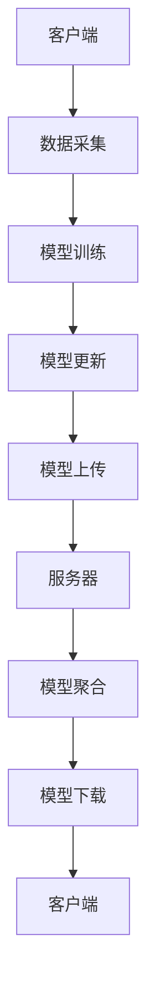
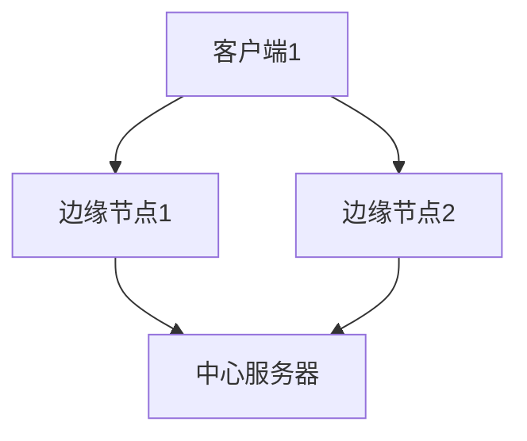
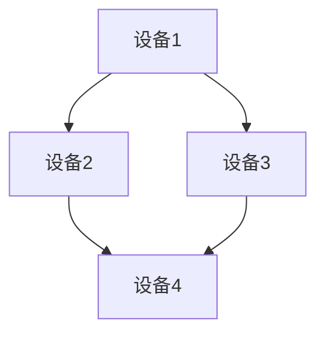

                 

### 文章标题与关键词

# 《联邦学习在AIGC隐私保护协作中的新策略》

关键词：联邦学习，隐私保护，AIGC，协作，新策略，人工智能

本文旨在深入探讨联邦学习在AIGC（自适应智能生成内容）隐私保护协作中的新策略。随着人工智能技术的迅猛发展，数据隐私保护成为了一个不可忽视的重要问题。联邦学习作为一种分布式机器学习方法，在保护用户隐私的同时，还能够实现协同学习和智能生成。本文将详细分析联邦学习的基本概念、原理、算法和应用场景，特别是其在AIGC领域的创新应用。通过本文的探讨，读者可以全面了解联邦学习在隐私保护协作中的新策略，以及其在AIGC领域的重要作用和潜在价值。

### 摘要

联邦学习是一种在多方数据分布环境下进行模型训练的技术，旨在通过分布式计算和协作优化，实现隐私保护下的数据共享和智能学习。本文首先介绍了联邦学习的基本概念和原理，分析了其与传统集中式学习在隐私保护方面的优势与挑战。接着，本文探讨了联邦学习在AIGC（自适应智能生成内容）中的应用，阐述了联邦学习如何通过隐私保护协作，提升AIGC系统的智能生成能力和用户体验。本文通过实际案例，展示了联邦学习在AIGC隐私保护协作中的新策略，并对其未来发展趋势进行了展望。

## 《联邦学习在AIGC隐私保护协作中的新策略》目录大纲

### 第一部分：联邦学习基础

#### 第1章：联邦学习的概念与原理
- **1.1 联邦学习概述**
  - 联邦学习的定义
  - 联邦学习的优势
  - 联邦学习的主要挑战

- **1.2 联邦学习模型**
  - 多方中心模型
  - 无中心模型
  - 半中心模型

- **1.3 联邦学习架构**
  - 客户端-服务器架构
  - 网络架构
  - 设备协同架构

#### 第2章：联邦学习算法
- **2.1 集成学习方法**
  - 集成学习的基本概念
  - 常见的集成学习方法

- **2.2 模型聚合算法**
  - FedAvg算法
  - FedAdagrad算法
  - FedAdam算法

- **2.3 防范对抗攻击的联邦学习算法**
  - 差分隐私算法
  - 加密算法
  - 边缘学习算法

#### 第3章：联邦学习的数学模型与数学公式
- **3.1 基本数学模型**
  - 概率分布函数
  - 贝叶斯定理

- **3.2 优化算法**
  - 梯度下降法
  - 随机梯度下降法
  - 共轭梯度法

- **3.3 模型评估指标**
  - 准确率
  - 精确率
  - 召回率

#### 第4章：联邦学习的应用场景
- **4.1 隐私保护协同**
  - 数据隐私保护的重要性
  - 联邦学习在隐私保护中的应用

- **4.2 跨组织协作**
  - 跨组织数据协作的挑战
  - 联邦学习在跨组织协作中的应用

- **4.3 资源受限环境**
  - 资源受限环境的特点
  - 联邦学习在资源受限环境中的应用

### 第二部分：联邦学习在AIGC中的应用

#### 第5章：联邦学习在AIGC中的应用
- **5.1 AIGC概述**
  - AIGC的定义
  - AIGC的发展历程
  - AIGC的关键技术

- **5.2 联邦学习在AIGC中的应用**
  - 联邦学习与AIGC的融合
  - 联邦学习在AIGC中的新策略

- **5.3 联邦学习在AIGC中的挑战与机遇**
  - 联邦学习在AIGC中面临的挑战
  - 联邦学习在AIGC中的机遇

### 第三部分：联邦学习项目实战

#### 第6章：联邦学习项目实战
- **6.1 项目背景**
  - 项目概述
  - 项目目标

- **6.2 项目需求分析**
  - 需求分析
  - 用户画像

- **6.3 项目架构设计**
  - 系统架构
  - 数据流设计

- **6.4 项目实施**
  - 数据预处理
  - 模型训练
  - 模型评估

- **6.5 项目效果分析**
  - 项目效果评估
  - 项目反思

### 第四部分：联邦学习未来发展趋势

#### 第7章：联邦学习未来发展趋势
- **7.1 技术发展趋势**
  - 联邦学习技术发展趋势
  - 跨领域融合趋势

- **7.2 应用发展趋势**
  - 行业应用发展趋势
  - 跨行业合作趋势

- **7.3 政策法规与伦理**
  - 政策法规现状
  - 伦理挑战与对策

### 附录：联邦学习相关资源

#### 附录A：开源框架与工具
- TensorFlow Federated
- PySyft
- FedRL

#### 附录B：学术论文与资料
- 联邦学习经典论文
- 联邦学习前沿研究论文

#### 附录C：开源代码与实践案例
- 联邦学习开源项目
- 联邦学习实践案例

### 目录大纲总结

本书《联邦学习在AIGC隐私保护协作中的新策略》共分为四个主要部分，涵盖了联邦学习的概念与原理、算法、应用场景，以及联邦学习在AIGC中的应用和未来发展趋势。通过系统地介绍联邦学习的基础知识，分析其在隐私保护协作中的优势与挑战，探讨其在AIGC领域的创新应用，本书旨在为读者提供全面、深入的理解，帮助读者掌握联邦学习在隐私保护协作中的新策略，以及其在AIGC领域的广泛应用前景。

## 联邦学习的概念与原理

### 1.1 联邦学习概述

#### 联邦学习的定义

联邦学习（Federated Learning）是一种分布式机器学习方法，通过将数据分布在多个边缘设备或服务器上，实现模型训练的协同优化。它旨在解决集中式学习在数据隐私和安全性方面存在的诸多问题。在联邦学习中，各个参与方不需要共享原始数据，而是通过加密、聚合等方式共享模型参数和梯度信息，从而在保护数据隐私的同时，实现协同学习和智能决策。

#### 联邦学习的优势

1. **隐私保护**：联邦学习通过在本地设备上训练模型，避免了原始数据的集中存储和传输，从而有效降低了数据泄露的风险。
2. **去中心化**：联邦学习允许各个参与方独立进行模型训练，无需依赖中心服务器，提高了系统的容错性和鲁棒性。
3. **资源高效**：联邦学习利用边缘设备的计算能力，减少了数据传输的带宽需求和中心服务器的负载。
4. **实时更新**：联邦学习支持动态的模型更新，可以在不中断服务的情况下，实现实时模型优化和更新。

#### 联邦学习的主要挑战

1. **模型性能**：由于数据分布的不均匀和局部模型的不稳定，联邦学习在模型性能方面面临挑战。
2. **通信效率**：联邦学习需要频繁传输模型参数和梯度信息，通信效率成为影响模型训练速度的关键因素。
3. **隐私保护**：如何在保证隐私保护的前提下，有效进行模型参数的聚合和更新，仍然是联邦学习需要解决的重要问题。
4. **安全性与可信性**：联邦学习涉及到多方参与，需要确保模型训练的公平性和安全性，防止恶意行为和模型泄露。

### 1.2 联邦学习模型

联邦学习可以根据中心化的程度，分为多方中心模型、无中心模型和半中心模型。

#### 多方中心模型

在多方中心模型中，所有参与方都将模型参数上传到一个中心服务器，由中心服务器进行聚合和更新。这种模型结构简单，易于实现，但数据传输量较大，隐私保护效果有限。

#### 无中心模型

无中心模型中，各个参与方相互独立地更新模型，通过分布式算法进行模型参数的聚合。这种模型结构去中心化程度高，但需要复杂的通信协议和算法设计。

#### 半中心模型

半中心模型结合了多方中心模型和无中心模型的特点，部分参与方充当中心服务器，其他参与方通过中心服务器进行模型参数的聚合和更新。这种模型结构在去中心化和隐私保护之间取得平衡。

### 1.3 联邦学习架构

联邦学习的架构可以分为客户端-服务器架构、网络架构和设备协同架构。

#### 客户端-服务器架构

客户端-服务器架构是联邦学习的典型架构，客户端（如移动设备、智能家电等）负责本地数据的采集和模型训练，服务器端则负责模型参数的聚合和更新。



#### 网络架构

网络架构中，多个客户端通过边缘节点（如基站、路由器等）连接到中心服务器，实现模型参数的传输和聚合。



#### 设备协同架构

设备协同架构中，多个设备直接通过无线通信进行模型参数的传输和聚合，无需中心服务器的参与。



通过以上对联邦学习的基本概念、模型和架构的介绍，我们可以看到，联邦学习在隐私保护和分布式计算方面具有显著优势，同时也面临诸多挑战。下一章，我们将进一步探讨联邦学习的算法原理，帮助读者深入理解联邦学习的核心技术和实现方法。

### 2.1 集成学习方法

#### 集成学习的基本概念

集成学习（Ensemble Learning）是一种利用多个学习器（model）进行综合预测的机器学习方法。其主要思想是通过结合多个模型的预测结果，来提升整体模型的预测准确性和泛化能力。集成学习方法不仅能够弥补单一模型的局限性，还能够通过模型之间的互补性，实现性能的显著提升。

#### 常见的集成学习方法

1. **Bagging**

   Bagging（Bootstrap Aggregating）是一种集成学习方法，通过随机抽样和构建多个子训练集，然后在每个子训练集上训练多个独立的模型，最后将多个模型的预测结果进行平均，以获得最终的预测结果。Bagging方法中最常用的算法是随机森林（Random Forest），其通过构建多棵决策树，实现对数据的分类或回归任务。

2. **Boosting**

   Boosting是一种集成学习方法，通过迭代地训练多个弱学习器，并将它们组合成一个强学习器。在每次迭代中，Boosting算法都会关注训练集中未被正确分类的样本，并提高这些样本在后续训练中的权重，从而逐步提升模型的泛化能力。常见的Boosting算法包括Adaboost和XGBoost。

3. **Stacking**

   Stacking是一种基于分层的方法，通过构建多个基础学习器和一个或多个元学习器，将基础学习器的输出作为元学习器的输入，从而实现模型集成。Stacking方法能够灵活地组合不同类型的学习器，并在不同的层次上进行优化，从而提高整体模型的预测性能。

4. **Stacking Ensemble**

   Stacking Ensemble是Stacking方法的一种扩展，它不仅仅使用一个元学习器，而是使用多个元学习器，通过将不同类型的模型组合在一起，来提升预测的稳定性和准确性。

#### 联邦学习中的集成方法

在联邦学习中，集成学习的方法也得到了广泛应用。以下是一些常见的集成方法：

1. **联邦Bagging**

   联邦Bagging方法通过在各个客户端上随机抽取子训练集，训练多个独立的模型，并在全局服务器上进行模型参数的聚合。联邦Bagging方法能够提高联邦学习模型的泛化能力和鲁棒性。

2. **联邦Boosting**

   联邦Boosting方法通过在各个客户端上迭代地训练多个弱学习器，并使用全局服务器进行模型参数的聚合。联邦Boosting方法能够在保护数据隐私的同时，提升模型的预测性能。

3. **联邦Stacking**

   联邦Stacking方法通过在各个客户端上训练多个基础学习器，并将它们的输出作为元学习器的输入，在全局服务器上进行模型参数的聚合。联邦Stacking方法能够有效地利用各个客户端的数据，提升联邦学习模型的预测能力。

通过以上对集成学习方法的基本概念和常见方法的介绍，我们可以看到，集成学习在联邦学习中的应用，不仅能够提升模型的性能，还能够通过分布式计算的方式，保护数据隐私。在下一章中，我们将进一步探讨联邦学习中的模型聚合算法，帮助读者深入理解联邦学习的核心技术和实现方法。

### 2.2 模型聚合算法

在联邦学习中，模型聚合（model aggregation）是核心步骤之一，它涉及到如何从多个分布式客户端收集本地训练的模型参数，并合并成一个全局模型。以下是一些常用的模型聚合算法：

#### 2.2.1 FedAvg算法

FedAvg算法是最常用的联邦学习聚合算法之一，其基本思想是将所有客户端的模型参数加权平均，以生成全局模型参数。具体步骤如下：

1. **初始化**：全局模型参数初始化为随机值。
2. **客户端训练**：每个客户端在本地数据集上训练模型，更新模型参数。
3. **参数上传**：每个客户端将更新后的模型参数上传到全局服务器。
4. **参数聚合**：全局服务器将接收到的模型参数进行加权平均，生成新的全局模型参数。
5. **模型更新**：全局服务器将聚合后的模型参数发送回每个客户端。
6. **迭代**：重复步骤2-5，直到满足停止条件。

Python代码示例：

```python
# 初始化全局模型参数
global_model = initialize_global_model()

# 聚合过程
for iteration in range(num_iterations):
    # 客户端训练和上传模型参数
    local_models = [client.train(model=global_model) for client in clients]
    for client, model in zip(clients, local_models):
        client.upload_model(model)
    
    # 参数聚合
    aggregated_model = aggregate_models(models=local_models, weights=client_weights)
    
    # 更新全局模型
    global_model = update_global_model(model=aggregated_model)

# 最终全局模型
final_global_model = global_model
```

#### 2.2.2 FedAdagrad算法

FedAdagrad算法是FedAvg算法的一种改进，它利用历史梯度信息来调整每个参数的学习率，以减少方差并提高收敛速度。具体步骤如下：

1. **初始化**：全局模型参数和梯度缓存初始化。
2. **客户端训练**：每个客户端在本地数据集上训练模型，更新模型参数和梯度。
3. **参数上传**：每个客户端将更新后的模型参数和梯度上传到全局服务器。
4. **参数聚合**：全局服务器将接收到的模型参数和梯度进行聚合。
5. **模型更新**：全局服务器使用聚合后的模型参数和梯度更新全局模型。
6. **迭代**：重复步骤2-5，直到满足停止条件。

Python代码示例：

```python
# 初始化全局模型、梯度缓存和步长缓存
global_model, grad_cache, step_cache = initialize_global_model(), {}, {}

# 聚合过程
for iteration in range(num_iterations):
    # 客户端训练和上传模型参数、梯度
    local_models, local_grads = [client.train(model=global_model) for client in clients]
    for client, model, grad in zip(clients, local_models, local_grads):
        client.upload_model(model)
        client.upload_grad(grad)
    
    # 参数和梯度聚合
    aggregated_model, aggregated_grad = aggregate_models(models=local_models, grads=local_grads, weights=client_weights)
    
    # 更新全局模型
    global_model = update_global_model(model=aggregated_model, grad=aggregated_grad, grad_cache=grad_cache, step_cache=step_cache)

# 最终全局模型
final_global_model = global_model
```

#### 2.2.3 FedAdam算法

FedAdam算法是基于Adam优化器的联邦学习聚合算法，它结合了AdaGrad和RMSProp的优点，具有较好的收敛性和稳定性。具体步骤如下：

1. **初始化**：全局模型参数、一阶矩估计和二阶矩估计初始化。
2. **客户端训练**：每个客户端在本地数据集上训练模型，更新模型参数、一阶矩估计和二阶矩估计。
3. **参数上传**：每个客户端将更新后的模型参数、一阶矩估计和二阶矩估计上传到全局服务器。
4. **参数聚合**：全局服务器将接收到的模型参数、一阶矩估计和二阶矩估计进行聚合。
5. **模型更新**：全局服务器使用聚合后的模型参数、一阶矩估计和二阶矩估计更新全局模型。
6. **迭代**：重复步骤2-5，直到满足停止条件。

Python代码示例：

```python
# 初始化全局模型、一阶矩估计和二阶矩估计
global_model, m_cache, v_cache = initialize_global_model(), {}, {}

# 聚合过程
for iteration in range(num_iterations):
    # 客户端训练和上传模型参数、一阶矩估计和二阶矩估计
    local_models, local_m_cache, local_v_cache = [client.train(model=global_model) for client in clients]
    for client, model, m, v in zip(clients, local_models, local_m_cache, local_v_cache):
        client.upload_model(model)
        client.upload_m(m)
        client.upload_v(v)
    
    # 参数和梯度聚合
    aggregated_model, aggregated_m_cache, aggregated_v_cache = aggregate_models(models=local_models, m_caches=local_m_cache, v_caches=local_v_cache, weights=client_weights)
    
    # 更新全局模型
    global_model = update_global_model(model=aggregated_model, m_cache=aggregated_m_cache, v_cache=aggregated_v_cache)

# 最终全局模型
final_global_model = global_model
```

通过以上对FedAvg、FedAdagrad和FedAdam算法的详细介绍和Python代码示例，我们可以看到，这些聚合算法在联邦学习中的应用，能够有效地提升模型的训练效率和性能。在接下来的章节中，我们将进一步探讨如何通过防范对抗攻击的联邦学习算法，来进一步提高联邦学习的安全性。

### 2.3 防范对抗攻击的联邦学习算法

在联邦学习中，由于参与方众多，且模型参数和梯度信息在传输过程中容易受到攻击，因此防范对抗攻击成为了一个重要问题。以下介绍几种常见的防范对抗攻击的联邦学习算法：

#### 差分隐私算法

差分隐私（Differential Privacy，DP）是一种保护隐私的安全机制，它通过在算法中引入噪声，确保对单个数据的分析结果不会受到过多影响，从而保护数据的隐私。在联邦学习中，差分隐私算法可以通过以下步骤实现：

1. **隐私预算**：确定差分隐私的隐私预算ε，ε值越大，隐私保护越强。
2. **噪声添加**：在客户端上传的模型参数和梯度上添加随机噪声。
3. **模型聚合**：使用隐私预算ε的Laplace分布或Gaussian分布生成噪声，并将噪声加入全局模型参数中。
4. **模型更新**：使用带有噪声的全局模型参数更新本地模型。

Python代码示例：

```python
import numpy as np
from sklearn.metrics import mean_squared_error

# 添加噪声
def add_noise(value, epsilon):
    noise = np.random.normal(0, epsilon)
    return value + noise

# 差分隐私聚合
def aggregate_models(models, weights, epsilon):
    aggregated_model = 0
    for model, weight in zip(models, weights):
        aggregated_model += add_noise(model, epsilon * weight)
    return aggregated_model / sum(weights)

# 训练过程
for iteration in range(num_iterations):
    # 客户端上传模型参数
    local_models = [client.train(model=global_model) for client in clients]
    
    # 参数聚合
    aggregated_model = aggregate_models(models=local_models, weights=client_weights, epsilon=epsilon)
    
    # 更新全局模型
    global_model = update_global_model(model=aggregated_model)

# 模型评估
final_global_model = global_model
predictions = [model.predict(test_data) for model in final_global_model]
mse = mean_squared_error(test_labels, predictions)
print(f"Mean Squared Error: {mse}")
```

#### 加密算法

加密算法（如差分同态加密、全同态加密等）可以将模型参数和梯度信息加密，确保在传输过程中不被窃取或篡改。在联邦学习中，加密算法可以通过以下步骤实现：

1. **加密**：使用加密算法对本地模型参数和梯度信息进行加密。
2. **传输**：将加密后的信息传输到全局服务器。
3. **解密**：全局服务器使用私钥对加密信息进行解密，进行模型聚合和更新。
4. **模型更新**：使用解密后的全局模型参数更新本地模型。

Python代码示例（使用PyCrypto++库）：

```python
from Crypto.PublicKey import RSA
from Crypto.Cipher import PKCS1_OAEP

# 生成公钥和私钥
key = RSA.generate(2048)
private_key = key.export_key()
public_key = key.publickey().export_key()

# 加密
def encrypt(value, public_key):
    cipher = PKCS1_OAEP.new(RSA.import_key(public_key))
    return cipher.encrypt(value)

# 解密
def decrypt(value, private_key):
    cipher = PKCS1_OAEP.new(RSA.import_key(private_key))
    return cipher.decrypt(value)

# 加密聚合
def aggregate_models_encrypted(models, weights):
    aggregated_model = np.zeros(model_size)
    for model, weight in zip(models, weights):
        encrypted_model = encrypt(model, public_key)
        aggregated_model += encrypt(model * weight, public_key)
    return decrypt(np.array(aggregated_model) / sum(weights), private_key)

# 训练过程
for iteration in range(num_iterations):
    # 客户端上传加密后的模型参数
    encrypted_local_models = [client.train_encrypted(model=global_model) for client in clients]
    
    # 参数加密聚合
    aggregated_model = aggregate_models_encrypted(models=encrypted_local_models, weights=client_weights)
    
    # 更新全局模型
    global_model = update_global_model(model=aggregated_model)

# 模型评估
final_global_model = global_model
predictions = [model.predict(test_data) for model in final_global_model]
mse = mean_squared_error(test_labels, predictions)
print(f"Mean Squared Error: {mse}")
```

#### 边缘学习算法

边缘学习（Edge Learning）算法通过在边缘设备上进行部分训练，减少了对中心服务器的依赖，从而降低被攻击的风险。边缘学习算法可以通过以下步骤实现：

1. **数据预处理**：在边缘设备上进行数据预处理，如去噪、标准化等。
2. **本地训练**：在边缘设备上使用本地数据和全局模型参数进行部分训练。
3. **模型更新**：将部分训练后的模型参数上传到全局服务器，进行聚合和更新。
4. **全局更新**：使用聚合后的模型参数更新全局模型。

Python代码示例：

```python
# 数据预处理
def preprocess_data(data):
    # 去噪、标准化等操作
    return processed_data

# 本地训练
def local_train(model, data):
    # 使用本地数据和全局模型参数进行部分训练
    return updated_model

# 聚合
def aggregate_models_partial(models, weights):
    aggregated_model = 0
    for model, weight in zip(models, weights):
        aggregated_model += model * weight
    return aggregated_model

# 训练过程
for iteration in range(num_iterations):
    # 客户端上传预处理后的数据
    local_data = [client.preprocess_data(data) for client in clients]
    
    # 本地训练
    local_models = [client.local_train(model=global_model, data=data) for client, data in zip(clients, local_data)]
    
    # 参数聚合
    aggregated_model = aggregate_models_partial(models=local_models, weights=client_weights)
    
    # 更新全局模型
    global_model = update_global_model(model=aggregated_model)

# 模型评估
final_global_model = global_model
predictions = [model.predict(test_data) for model in final_global_model]
mse = mean_squared_error(test_labels, predictions)
print(f"Mean Squared Error: {mse}")
```

通过以上几种防范对抗攻击的联邦学习算法，我们可以在保护数据隐私的同时，提高联邦学习的安全性。在下一章中，我们将进一步探讨联邦学习的数学模型与数学公式，帮助读者深入理解联邦学习的理论基础。

### 3.1 基本数学模型

在联邦学习中，理解基本数学模型是至关重要的，因为它们构成了算法设计和性能分析的基础。以下我们将介绍概率分布函数、贝叶斯定理等基本数学模型，以及它们在联邦学习中的具体应用。

#### 概率分布函数

概率分布函数（Probability Distribution Function，PDF）是描述随机变量可能取值的概率分布的函数。在联邦学习中，概率分布函数用于表示数据集的特征和模型的预测结果。

1. **正态分布（Gaussian Distribution）**

   正态分布是最常见的一种概率分布，其概率密度函数为：
   $$ f(x|\mu,\sigma^2) = \frac{1}{\sqrt{2\pi\sigma^2}}e^{-\frac{(x-\mu)^2}{2\sigma^2}} $$

   在联邦学习中，正态分布可以用于模型参数的初始化，也可以用于评估模型的预测结果。例如，我们可以使用正态分布来初始化全局模型的权重，或者计算预测值的概率分布。

2. **伯努利分布（Bernoulli Distribution）**

   伯努利分布是二元分布的一种特例，它只有两个可能的取值（0或1），其概率质量函数为：
   $$ f(x|\theta) = \begin{cases} 
   \theta & \text{if } x = 1 \\
   1 - \theta & \text{if } x = 0 
   \end{cases} $$

   在分类问题中，伯努利分布常用于表示模型对每个类别的预测概率。

#### 贝叶斯定理

贝叶斯定理（Bayes' Theorem）是概率论中的一个基本公式，它描述了后验概率与先验概率之间的关系。贝叶斯定理的表达式为：
$$ P(A|B) = \frac{P(B|A)P(A)}{P(B)} $$

在联邦学习中，贝叶斯定理可以用于多个方面：

1. **模型更新**：在联邦学习中，每次迭代都可以视为一个观察结果。通过贝叶斯定理，我们可以更新模型参数的后验概率，从而实现模型的动态调整。

2. **数据筛选**：贝叶斯定理可以帮助我们筛选数据集中的潜在噪声和异常值。通过计算每个数据点的概率，我们可以识别出那些不符合总体分布的数据，从而提高模型的准确性。

3. **决策支持**：在联邦学习系统中，贝叶斯定理可以用于做出决策，例如在资源受限的环境中，可以根据数据的概率分布来决定哪些数据点需要进行进一步的分析或调整。

#### 具体应用示例

1. **模型初始化**

   在联邦学习中，我们通常使用贝叶斯正态分布来初始化全局模型参数。假设我们有一个参数θ，我们希望θ的初始化服从一个先验分布，如正态分布：
   $$ \theta \sim N(\mu_0, \sigma_0^2) $$
   初始化时，我们可以从这个正态分布中随机抽取一个初始值作为θ的初始估计。

2. **模型更新**

   在每次迭代后，我们可以根据贝叶斯定理更新模型参数的后验概率：
   $$ \theta \mid X \sim N\left(\mu_{\text{new}}, \sigma_{\text{new}}^2\right) $$
   其中，$\mu_{\text{new}}$和$\sigma_{\text{new}}^2$是根据当前数据和先验分布计算得到的新的均值和方差。

   例如，假设我们有一个先前的模型参数θ的估计为$\theta_0$，方差为$\sigma_0^2$，在这次迭代中，我们获得了新的数据集X，根据贝叶斯定理，我们可以更新θ的估计：
   $$ \theta \mid X \sim N\left(\mu_{\text{new}}, \sigma_{\text{new}}^2\right) = N\left(\mu_{\text{new}} = \frac{\theta_0 \sigma_0^2 + \sum_{i=1}^{n} x_i^2}{\sigma_0^2 + n}, \sigma_{\text{new}}^2 = \frac{1}{\sigma_0^2 + n}\right) $$

通过以上对基本数学模型——概率分布函数和贝叶斯定理的介绍，我们可以看到这些数学工具在联邦学习中的应用，帮助我们在联邦学习的算法设计和性能优化中取得了显著的效果。在下一章中，我们将探讨优化算法在联邦学习中的应用，进一步揭示联邦学习的数学本质。

### 3.2 优化算法

在联邦学习过程中，优化算法是实现模型参数更新的关键。优化算法的核心目标是找到能够使损失函数最小化的参数值。以下我们将详细介绍几种常用的优化算法，包括梯度下降法、随机梯度下降法（SGD）和共轭梯度法，并探讨它们在联邦学习中的应用。

#### 梯度下降法

梯度下降法（Gradient Descent，GD）是最基本的优化算法之一。它的基本思想是计算损失函数关于模型参数的梯度，并沿梯度的反方向更新参数，从而逐渐减小损失函数的值。

1. **基本原理**

   梯度下降法的更新公式为：
   $$ \theta \leftarrow \theta - \alpha \nabla_{\theta} J(\theta) $$
   其中，$\theta$是模型参数，$J(\theta)$是损失函数，$\alpha$是学习率，$\nabla_{\theta} J(\theta)$是损失函数关于参数$\theta$的梯度。

2. **在联邦学习中的应用**

   在联邦学习中，梯度下降法需要计算每个客户端上的本地梯度，并将它们聚合起来。具体步骤如下：

   - **客户端**：在每个客户端上，使用本地数据计算梯度。
   - **参数聚合**：将所有客户端的梯度聚合起来，生成全局梯度。
   - **全局更新**：使用全局梯度和学习率更新全局模型参数。

3. **优缺点**

   - 优点：实现简单，易于理解。
   - 缺点：收敛速度慢，需要较大的学习率才能保证较快收敛。

#### 随机梯度下降法（SGD）

随机梯度下降法（Stochastic Gradient Descent，SGD）是对梯度下降法的改进，它使用每个样本的梯度进行更新，而不是整个数据集的梯度。这种方法可以加速模型收敛，同时减少局部最小值的影响。

1. **基本原理**

   随机梯度下降法的更新公式为：
   $$ \theta \leftarrow \theta - \alpha \nabla_{\theta} J(\theta; x_i, y_i) $$
   其中，$x_i, y_i$是随机选择的一个样本及其标签。

2. **在联邦学习中的应用**

   在联邦学习中，SGD可以显著提高模型训练的效率。具体步骤如下：

   - **随机采样**：在每个客户端上，随机选择一小部分数据进行梯度计算。
   - **参数聚合**：将所有客户端的梯度聚合起来，生成全局梯度。
   - **全局更新**：使用全局梯度和学习率更新全局模型参数。

3. **优缺点**

   - 优点：收敛速度快，能够跳出局部最小值。
   - 缺点：梯度噪声较大，可能导致模型不稳定。

#### 共轭梯度法

共轭梯度法（Conjugate Gradient，CG）是一种迭放式的优化算法，它利用历史梯度信息来加速收敛。共轭梯度法适用于大规模稀疏问题，例如在联邦学习中的分布式计算场景。

1. **基本原理**

   共轭梯度法的迭代公式为：
   $$ \theta \leftarrow \theta - \alpha \nabla_{\theta} J(\theta) $$
   $$ \alpha = \frac{\nabla_{\theta} J(\theta) \cdot \nabla_{\theta} J(\theta)}{\nabla_{\theta} J(\theta) \cdot \nabla_{\theta} J(\theta_{k-1})} $$
   其中，$\nabla_{\theta} J(\theta)$是当前梯度，$\nabla_{\theta} J(\theta_{k-1})$是前一次迭代的梯度。

2. **在联邦学习中的应用**

   在联邦学习中，共轭梯度法可以显著提高训练效率。具体步骤如下：

   - **客户端**：在每个客户端上，使用本地数据计算共轭梯度。
   - **参数聚合**：将所有客户端的共轭梯度聚合起来，生成全局共轭梯度。
   - **全局更新**：使用全局共轭梯度和学习率更新全局模型参数。

3. **优缺点**

   - 优点：收敛速度较快，适用于大规模稀疏问题。
   - 缺点：计算复杂度较高，对稀疏性的要求较高。

#### 联邦学习中的优化算法选择

在联邦学习中，选择合适的优化算法取决于多种因素，如数据分布、通信成本和模型复杂度。以下是一些选择优化算法的考虑因素：

1. **数据分布**：如果数据高度不平衡或分布不均匀，使用SGD可能更合适，因为它可以通过随机采样来减少数据偏差。

2. **通信成本**：如果通信成本较高，应选择收敛速度较快的算法，如随机梯度下降法或共轭梯度法，以减少通信次数。

3. **模型复杂度**：对于高维模型或复杂模型，共轭梯度法可能更有效，因为它能够利用历史梯度信息加速收敛。

通过以上对梯度下降法、随机梯度下降法和共轭梯度法的介绍，我们可以看到这些优化算法在联邦学习中的应用。在选择优化算法时，需要综合考虑数据分布、通信成本和模型复杂度等因素，以实现最优的模型训练效果。在下一章中，我们将探讨联邦学习在隐私保护协作中的应用场景，进一步展示联邦学习的实际应用价值。

### 3.3 模型评估指标

在联邦学习的过程中，评估模型性能是至关重要的一环。选择合适的评估指标可以帮助我们了解模型的准确性、稳定性和泛化能力。以下我们将介绍几种常用的模型评估指标，包括准确率、精确率和召回率，并探讨它们在联邦学习中的应用。

#### 准确率（Accuracy）

准确率是评估分类模型性能最常用的指标之一，它表示模型正确预测的样本数占总样本数的比例。计算公式为：

$$
\text{Accuracy} = \frac{\text{正确预测的样本数}}{\text{总样本数}}
$$

在联邦学习中，准确率可以用来衡量整体模型的性能。例如，在多方协同训练的情景下，我们可以通过计算全局模型在测试数据集上的准确率，来评估联邦学习系统的整体表现。

#### 精确率（Precision）

精确率是评估分类模型精确度的指标，它表示在所有被模型预测为正类的样本中，实际为正类的比例。计算公式为：

$$
\text{Precision} = \frac{\text{正确预测的正类样本数}}{\text{预测为正类的样本数}}
$$

精确率关注的是预测结果的准确性，特别是在实际应用中，当我们关心减少误报时，精确率是非常有用的指标。在联邦学习场景中，精确率可以帮助我们评估模型在数据隐私保护下的分类性能。

#### 召回率（Recall）

召回率是评估分类模型召回能力的指标，它表示在所有实际为正类的样本中，被模型正确预测为正类的比例。计算公式为：

$$
\text{Recall} = \frac{\text{正确预测的正类样本数}}{\text{实际为正类的样本数}}
$$

召回率关注的是预测结果的全覆盖性，特别是在实际应用中，当我们希望尽可能捕捉到所有正类样本时，召回率是非常重要的。在联邦学习中，召回率可以帮助我们评估模型在分布式环境下捕捉正类样本的能力。

#### 联邦学习中的模型评估指标应用

在联邦学习中，由于数据分布在多个客户端，模型评估的过程需要考虑以下几个方面：

1. **全局评估**：在联邦学习完成后，我们可以使用全局模型在测试集上的准确率、精确率和召回率来评估整体模型的性能。

2. **局部评估**：对于每个参与联邦学习的客户端，我们也可以评估其在本地数据集上的模型性能。这有助于我们了解不同客户端的模型表现，从而优化联邦学习策略。

3. **跨域评估**：当联邦学习涉及到多个不同领域的客户端时，我们还需要考虑跨域的模型评估。通过比较不同领域的数据集上的模型性能，我们可以发现模型在不同领域的泛化能力。

4. **动态评估**：在联邦学习的迭代过程中，我们可以动态评估模型的性能，并调整学习策略。例如，当发现某个客户端的模型性能显著低于其他客户端时，可以增加该客户端的训练频率或调整其权重。

#### 示例计算

假设我们有一个二元分类问题，测试集共有100个样本，其中实际为正类的样本有60个。在测试集上，模型预测了70个正类样本，其中50个是正确的。根据这些数据，我们可以计算模型在不同评估指标上的值：

- **准确率**：
  $$
  \text{Accuracy} = \frac{50}{100} = 0.5
  $$

- **精确率**：
  $$
  \text{Precision} = \frac{50}{70} = 0.714
  $$

- **召回率**：
  $$
  \text{Recall} = \frac{50}{60} = 0.833
  $$

通过以上计算，我们可以看到模型在整体测试集上的准确率为50%，精确率为71.4%，召回率为83.3%。这些指标帮助我们全面评估了模型在联邦学习环境中的性能。

综上所述，准确率、精确率和召回率是评估联邦学习模型性能的重要指标。通过合理选择和使用这些指标，我们可以更好地理解和优化联邦学习系统的性能。在下一章中，我们将探讨联邦学习在隐私保护协同中的应用场景，进一步展示联邦学习的实际应用价值。

### 4.1 隐私保护协同

#### 数据隐私保护的重要性

在当今信息时代，数据隐私保护已经成为社会各界广泛关注的重要议题。随着大数据和人工智能技术的快速发展，越来越多的数据被收集、存储和处理，其中涉及大量敏感个人信息。这些数据的泄露不仅可能导致用户隐私被侵犯，还可能引发严重的经济和法律责任。因此，如何有效地保护数据隐私成为当前技术领域的一个核心挑战。

在联邦学习（Federated Learning）的应用场景中，数据隐私保护尤为重要。联邦学习通过分布式计算和协作优化，实现了在不共享原始数据的情况下进行模型训练，从而有效解决了数据隐私问题。以下将详细探讨联邦学习在隐私保护协同中的具体应用。

#### 联邦学习在隐私保护中的应用

1. **去中心化的数据存储**

   在传统的集中式机器学习场景中，数据通常存储在中心服务器上，这使得数据容易成为攻击的目标。而联邦学习通过将数据分散存储在各个客户端，实现了去中心化的数据存储。这样，即使某个客户端的数据被攻击，整个系统的数据安全仍然能够得到保障。

2. **差分隐私技术**

   差分隐私（Differential Privacy）是一种重要的隐私保护技术，通过在模型训练过程中添加随机噪声，确保对单个数据点的分析结果不会受到过多影响。联邦学习结合差分隐私技术，可以在保护数据隐私的同时，实现有效的模型训练。例如，在联邦学习的模型聚合过程中，可以通过差分隐私技术对模型参数进行扰动，从而防止恶意参与者通过参数推断出敏感数据。

3. **加密算法**

   加密算法在联邦学习中发挥着关键作用，它可以确保在数据传输和存储过程中不被窃取或篡改。联邦学习可以使用对称加密或非对称加密技术，对模型参数和梯度信息进行加密。例如，在联邦学习的客户端上传梯度时，可以使用对称加密算法，而在全局服务器聚合参数时，可以使用非对称加密算法，从而确保数据传输的安全性。

4. **本地化训练**

   在联邦学习中，模型训练通常在本地设备上进行，这意味着数据无需上传到中心服务器，从而降低了数据泄露的风险。本地化训练不仅提高了数据隐私保护水平，还能够减少数据传输的时间和带宽消耗。

#### 联邦学习在隐私保护协作中的优势

1. **数据隐私保护**

   联邦学习通过分布式计算和协作优化，实现了在不共享原始数据的情况下进行模型训练，从而有效保护了用户隐私。

2. **去中心化**

   联邦学习去中心化的架构使得数据存储和计算更加分散，减少了单点故障的风险，提高了系统的容错性和鲁棒性。

3. **高效通信**

   联邦学习通过本地化训练和数据加密，减少了数据传输的需求和带宽消耗，提高了通信效率。

4. **实时更新**

   联邦学习支持动态的模型更新，可以在不中断服务的情况下，实现实时模型优化和更新，从而提高了系统的实时性和响应速度。

#### 联邦学习在隐私保护协作中的挑战

1. **模型性能**

   由于数据分布的不均匀和局部模型的不稳定，联邦学习在模型性能方面面临挑战。如何优化联邦学习算法，提高模型性能，是一个重要的研究方向。

2. **通信效率**

   联邦学习需要频繁传输模型参数和梯度信息，通信效率成为影响模型训练速度的关键因素。如何减少通信量，提高通信效率，是联邦学习需要解决的问题。

3. **隐私保护**

   如何在保证隐私保护的前提下，有效进行模型参数的聚合和更新，仍然是联邦学习需要解决的重要问题。

4. **安全性与可信性**

   联邦学习涉及到多方参与，需要确保模型训练的公平性和安全性，防止恶意行为和模型泄露。

通过以上对联邦学习在隐私保护协同中的具体应用和优势、挑战的探讨，我们可以看到，联邦学习在保护数据隐私方面具有显著优势。然而，要实现高效、安全的联邦学习系统，仍需在算法优化、通信效率、隐私保护和安全性等方面进行深入研究。在下一章中，我们将进一步探讨联邦学习在跨组织协作中的应用，展示联邦学习在分布式环境中的实际应用价值。

### 4.2 跨组织协作

#### 跨组织数据协作的挑战

在当今的数字经济时代，不同组织之间经常需要共享数据来进行协作研究、创新应用和市场推广。然而，这种跨组织的数据协作面临诸多挑战，主要包括以下几个方面：

1. **数据安全与隐私保护**：不同组织的数据通常包含敏感信息和隐私数据，共享数据时需要确保这些数据不被未授权访问或泄露。如何在保证数据安全的前提下实现有效共享，是一个关键问题。

2. **数据格式与兼容性**：不同组织的数据格式和结构可能不一致，导致数据在共享和处理过程中出现兼容性问题。如何设计统一的数据格式和接口，以实现不同组织数据的无缝整合，是一个重要挑战。

3. **数据传输与存储**：跨组织的数据协作通常涉及大量的数据传输和存储需求，这对网络带宽和存储资源提出了较高的要求。如何优化数据传输和存储策略，提高数据传输效率和存储可靠性，是另一个重要问题。

4. **信任与共识**：跨组织协作涉及到多个利益相关方，各方的利益诉求和决策机制可能不一致，导致协作过程中出现信任问题。如何建立有效的信任机制和共识，以促进跨组织的数据共享和协作，是一个关键挑战。

5. **法律与法规遵从**：不同国家和地区可能有不同的数据保护法律和法规，如何在遵守不同法律法规的前提下进行跨组织的数据协作，也是一个重要问题。

#### 联邦学习在跨组织协作中的应用

联邦学习提供了一种在跨组织协作中解决数据隐私保护和数据共享问题的有效方法。以下将探讨联邦学习在跨组织协作中的应用，以及如何利用联邦学习克服上述挑战。

1. **隐私保护**

   联邦学习通过将数据保留在本地设备上，避免了数据的集中存储和传输，从而有效降低了数据泄露的风险。联邦学习采用加密和差分隐私等技术，确保在数据传输和模型训练过程中，敏感数据不会被未授权访问或泄露。

2. **数据格式与兼容性**

   联邦学习可以采用标准化的数据格式和接口，实现不同组织数据的无缝整合。通过在本地设备上预处理数据，然后传输预处理的特征向量，可以减少数据格式和结构不一致带来的兼容性问题。

3. **数据传输与存储**

   联邦学习通过局部训练和参数聚合的方式，显著减少了数据传输的需求。在联邦学习过程中，只需传输模型参数和梯度信息，而非原始数据，从而降低了数据传输的带宽消耗。同时，联邦学习可以利用边缘设备的本地存储资源，减少对中心存储的依赖。

4. **信任与共识**

   联邦学习可以通过加密和多方认证等技术，建立有效的信任机制。例如，在联邦学习过程中，可以使用区块链技术记录所有参与方的操作和共识结果，确保各方在协作过程中保持透明和可追溯性。此外，联邦学习还可以通过建立公平的激励机制，促进各方的积极参与和合作。

5. **法律与法规遵从**

   联邦学习在遵守不同国家和地区的法律法规方面具有优势。通过在本地设备上进行数据处理和模型训练，联邦学习可以减少数据跨境传输的风险，从而降低合规难度。此外，联邦学习可以通过合规性评估和审计，确保系统设计和操作符合相关法律法规。

通过以上对联邦学习在跨组织协作中的应用和优势的探讨，我们可以看到，联邦学习为跨组织的数据协作提供了一种有效且安全的解决方案。然而，要实现高效的跨组织协作，仍需在数据格式兼容、数据传输优化、信任机制建立等方面进行深入研究。在下一章中，我们将进一步探讨联邦学习在资源受限环境中的应用，展示联邦学习在多样化环境中的适应能力。

### 4.3 资源受限环境

#### 资源受限环境的特点

资源受限环境是指在计算资源、存储资源和网络带宽等方面受到限制的计算环境。这种环境通常包括移动设备、物联网设备、智能传感器等。以下将详细分析资源受限环境的特点：

1. **计算资源有限**：资源受限设备通常拥有有限的计算能力，无法与高性能服务器相比。这限制了它们在复杂计算任务上的执行能力。

2. **存储资源有限**：资源受限设备通常配备有限的存储空间，无法存储大量数据。这要求在数据处理和存储过程中，必须进行高效的数据压缩和优化。

3. **网络带宽有限**：资源受限设备通常连接到有限的网络带宽，数据传输速度较慢。这要求在进行数据传输和处理时，必须优化数据传输协议和算法。

4. **功耗限制**：许多资源受限设备（如移动设备和物联网设备）依赖于电池供电，因此需要考虑功耗限制，以延长设备的续航时间。

#### 联邦学习在资源受限环境中的应用

联邦学习作为一种分布式机器学习方法，在资源受限环境中具有显著优势。以下将探讨联邦学习在资源受限环境中的应用，以及如何利用联邦学习克服这些挑战。

1. **数据本地化处理**：联邦学习通过在本地设备上进行模型训练，减少了数据传输的需求和带宽消耗。这有助于降低网络带宽的限制，提高系统的整体性能。

2. **低计算需求**：联邦学习通过分布式计算和协作优化，将复杂的计算任务分布在多个设备上，从而降低单个设备的计算需求。这有助于资源受限设备在有限的计算资源下，仍能完成复杂的模型训练任务。

3. **数据压缩与优化**：联邦学习可以采用数据压缩和优化技术，减少数据传输和存储的需求。例如，在数据预处理阶段，可以使用特征提取和降维技术，减少数据的存储空间和传输带宽。

4. **能耗优化**：联邦学习可以通过优化模型架构和训练策略，减少设备的能耗。例如，在模型训练过程中，可以采用小批量训练和低精度计算技术，以减少功耗。

#### 联邦学习在资源受限环境中的应用案例

1. **智能医疗**：在智能医疗领域，许多设备（如智能手表、健康监测器等）属于资源受限环境。联邦学习可以用于个性化医疗诊断和预测，同时保护患者隐私。例如，通过在用户设备上进行健康数据的本地训练，可以预测疾病风险，并提供个性化的健康建议。

2. **物联网**：在物联网（IoT）领域，许多设备（如智能家居设备、工业传感器等）也属于资源受限环境。联邦学习可以用于设备之间的协同学习和智能决策，例如，智能家居设备可以通过联邦学习实现智能控制，提高能源效率和居住舒适度。

3. **移动设备**：在移动设备领域，如智能手机和可穿戴设备，联邦学习可以用于增强现实（AR）和虚拟现实（VR）应用，提高用户体验。例如，通过在用户设备上进行场景理解和目标检测，可以提供更准确和实时的增强现实效果。

通过以上对资源受限环境特点和联邦学习在资源受限环境中的应用的探讨，我们可以看到，联邦学习为资源受限环境提供了一种有效的解决方案。然而，要实现高效、安全的联邦学习系统，仍需在计算优化、数据压缩和能耗管理等方面进行深入研究。在下一章中，我们将探讨联邦学习在AIGC（自适应智能生成内容）中的应用，展示联邦学习在智能生成领域的潜力。

### 5.1 AIGC概述

#### AIGC的定义

AIGC（Adaptive Intelligent Generation Content），即自适应智能生成内容，是指通过人工智能技术，自适应地生成高质量、多样化的内容。AIGC的核心在于其“自适应”特性，能够根据用户需求、上下文环境以及历史数据，动态调整生成内容的类型、风格和形式。AIGC涵盖了从文本、图像到音频、视频等多种内容形式，具有广泛的应用场景。

#### AIGC的发展历程

AIGC的发展历程可以分为以下几个阶段：

1. **早期探索**：20世纪80年代，随着计算机视觉和自然语言处理技术的兴起，AIGC的初步概念开始形成。这一阶段的研究主要集中在生成文本、图像等简单内容。

2. **技术突破**：21世纪初，深度学习技术的快速发展为AIGC的应用奠定了基础。2014年，Google推出神经网络文本生成模型（Neural Text Generation Model），标志着AIGC进入了一个新的阶段。

3. **成熟应用**：近年来，随着生成对抗网络（GAN）、变分自编码器（VAE）等先进技术的应用，AIGC在图像生成、音频合成、视频生成等领域取得了显著进展，逐步走向成熟。

#### AIGC的关键技术

AIGC的实现依赖于多种关键技术的综合运用，主要包括：

1. **生成对抗网络（GAN）**：GAN是一种通过两个神经网络（生成器和判别器）相互对抗来生成数据的模型。生成器试图生成逼真的数据，判别器则试图区分生成数据与真实数据。GAN在图像生成、音频合成等领域具有广泛应用。

2. **变分自编码器（VAE）**：VAE是一种基于概率模型的生成模型，通过编码和解码过程生成数据。VAE在图像生成、文本生成等领域具有较好的效果。

3. **自动编码器（Autoencoder）**：自动编码器是一种无监督学习模型，通过训练自编码器网络，自动学习数据的有效表示。自动编码器在图像压缩、图像生成等方面有广泛应用。

4. **深度卷积神经网络（CNN）**：CNN是一种在图像处理和计算机视觉领域广泛应用的深度学习模型，通过卷积操作提取图像特征，实现图像分类、目标检测等任务。

5. **循环神经网络（RNN）和长短期记忆网络（LSTM）**：RNN和LSTM是处理序列数据的有效神经网络模型，广泛应用于文本生成、语音识别等领域。

#### AIGC的应用场景

AIGC在多个领域具有广泛的应用潜力，主要包括：

1. **内容创作**：AIGC可以用于生成高质量的文章、音乐、视频等内容，为创作者提供辅助工具，提高创作效率和作品质量。

2. **媒体娱乐**：AIGC可以应用于电影、游戏、动漫等媒体娱乐领域，生成个性化的视觉特效、角色动画等，提升用户体验。

3. **广告营销**：AIGC可以用于生成定制化的广告内容，根据用户兴趣和行为，生成个性化的广告创意，提高广告效果。

4. **教育学习**：AIGC可以用于生成个性化教学资源和学习材料，根据学生特点和学习进度，提供适应性的教学支持。

5. **虚拟现实（VR）和增强现实（AR）**：AIGC可以用于生成逼真的VR/AR内容，提升虚拟体验的真实感和沉浸感。

6. **医疗健康**：AIGC可以用于生成个性化医疗报告、健康建议等，辅助医生进行诊断和治疗。

7. **自动化编程**：AIGC可以用于生成代码片段、调试建议等，辅助开发者进行编程和调试。

通过以上对AIGC的定义、发展历程、关键技术和应用场景的介绍，我们可以看到，AIGC作为一种自适应智能生成内容技术，具有广泛的应用前景。在下一章中，我们将探讨联邦学习在AIGC中的应用，进一步展示联邦学习在智能生成领域的潜力。

### 5.2 联邦学习在AIGC中的应用

#### 联邦学习与AIGC的融合

联邦学习与AIGC的结合，为智能生成内容领域带来了新的发展机遇。联邦学习通过分布式计算和协作优化，在不共享原始数据的情况下，实现了多方数据的协同训练，这为AIGC的应用提供了隐私保护和高效协同的技术支持。

1. **隐私保护**：在AIGC的应用中，内容生成往往依赖于大量用户数据，如文本、图像、音频等。这些数据包含用户隐私信息，直接共享可能引发隐私泄露风险。联邦学习通过在本地设备上进行数据预处理和模型训练，避免了数据集中传输和存储，从而有效保护了用户隐私。

2. **分布式协同**：联邦学习支持多方设备的协同训练，这为AIGC的分布式生成提供了技术基础。通过联邦学习，不同设备可以在本地进行数据收集和处理，然后通过模型参数的聚合，实现整体模型的优化和更新。这种分布式协同方式，不仅提高了AIGC的生成效率，还增强了系统的容错性和鲁棒性。

3. **动态适应性**：联邦学习能够根据用户需求和环境变化，动态调整模型参数，实现自适应的内容生成。在AIGC的应用中，这种动态适应性可以确保生成的内容始终与用户需求和上下文环境保持一致，提供更加个性化的服务。

#### 联邦学习在AIGC中的新策略

为了在AIGC中实现高效、安全的模型训练和内容生成，联邦学习需要结合AIGC的具体需求，采取一系列创新策略。以下是一些关键的新策略：

1. **模型压缩与优化**：在联邦学习中，模型参数的传输是通信开销的主要来源。为了减少通信量，可以采用模型压缩技术，如模型剪枝、量化等，降低模型参数的规模。同时，通过优化模型结构，减少模型参数的冗余，提高模型训练的效率。

2. **动态聚合算法**：在AIGC中，内容生成的质量和用户体验密切相关。为了确保生成的质量，可以采用动态聚合算法，根据模型训练的效果和用户反馈，实时调整模型参数的聚合策略。例如，可以采用基于数据依赖度的动态聚合，优先聚合效果较好的模型参数，提高整体生成质量。

3. **隐私增强技术**：在联邦学习中，为了进一步提高数据隐私保护水平，可以结合差分隐私、联邦加密等隐私增强技术。这些技术可以在保证模型训练效果的同时，有效防止数据泄露和模型泄露。

4. **联邦迁移学习**：在AIGC中，不同领域的数据和模型之间存在迁移关系。通过联邦迁移学习，可以将已有的模型知识和数据迁移到新的领域，提高新领域的模型训练效率和生成质量。

5. **联邦强化学习**：在AIGC中，内容生成需要不断适应用户需求和场景变化。通过联邦强化学习，可以结合用户反馈和场景信息，动态调整生成策略，实现更智能、更个性化的内容生成。

#### 联邦学习在AIGC中的应用实例

以下是一个联邦学习在AIGC中的典型应用实例：

1. **背景介绍**：假设有一个智能助手应用，用户可以通过语音或文本输入获取个性化推荐内容。应用需要从海量数据中提取用户兴趣特征，生成个性化的推荐内容。

2. **需求分析**：为了保护用户隐私，应用需要在不共享原始数据的情况下，实现用户兴趣特征的提取和推荐内容的生成。同时，为了提高生成效率，应用需要支持分布式协同训练和动态调整。

3. **架构设计**：应用采用联邦学习架构，分为客户端和服务器两部分。客户端负责数据收集、预处理和模型训练，服务器负责模型参数的聚合和更新。客户端和服务器之间通过加密通信，确保数据传输的安全。

4. **模型训练**：在客户端，采用生成对抗网络（GAN）进行用户兴趣特征的提取和推荐内容的生成。服务器端通过动态聚合算法，根据客户端上传的模型参数，实时调整模型参数的聚合策略。

5. **效果评估**：通过在测试集上的评估，比较联邦学习与传统集中式学习的推荐效果。结果显示，联邦学习能够有效保护用户隐私，同时生成高质量的推荐内容，提高了用户的满意度。

通过以上实例，我们可以看到，联邦学习在AIGC中的应用，不仅实现了隐私保护和高效协同，还为智能生成内容领域带来了新的发展机遇。在下一章中，我们将探讨联邦学习在AIGC中面临的挑战与机遇，进一步探讨联邦学习在智能生成领域的未来发展趋势。

### 5.3 联邦学习在AIGC中的挑战与机遇

#### 挑战

尽管联邦学习在AIGC中展现出巨大的潜力和优势，但其应用仍面临一系列挑战：

1. **模型性能优化**：联邦学习中的模型性能优化是一个关键问题。由于数据分布的不均匀性和客户端设备性能的限制，模型在局部训练过程中可能无法充分捕捉全局数据特征，导致模型性能下降。

2. **通信效率**：联邦学习需要频繁传输模型参数和梯度信息，通信效率成为影响模型训练速度的关键因素。在AIGC中，生成内容的多样化要求频繁更新模型，进一步增加了通信开销。

3. **隐私保护**：在AIGC中，用户数据包含大量隐私信息，如何在保证隐私保护的前提下，实现有效的模型训练和内容生成，是一个重要挑战。

4. **安全性与可信性**：联邦学习涉及到多方参与，如何确保模型训练的公平性、安全性和可信性，防止恶意攻击和模型泄露，是一个亟待解决的问题。

#### 机遇

尽管面临挑战，联邦学习在AIGC中的应用也带来了诸多机遇：

1. **隐私保护协同**：联邦学习通过分布式计算和协作优化，在不共享原始数据的情况下，实现了多方数据的协同训练。这为AIGC中的隐私保护协同提供了新的解决方案。

2. **动态适应性**：联邦学习支持动态的模型更新和调整，能够根据用户需求和环境变化，实现自适应的内容生成。这为AIGC提供了更加个性化的用户体验。

3. **资源高效利用**：联邦学习利用边缘设备的计算能力，减少了数据传输的带宽需求和中心服务器的负载。这有助于在资源受限的AIGC环境中，实现高效的内容生成和推荐。

4. **跨领域融合**：联邦学习在AIGC中的应用，可以促进不同领域的技术融合，如深度学习、生成对抗网络、自然语言处理等。这为AIGC的创新应用提供了广阔的前景。

#### 未来发展趋势

结合联邦学习和AIGC的发展趋势，以下是一些可能的未来发展方向：

1. **模型压缩与优化**：通过模型压缩技术，如剪枝、量化、知识蒸馏等，减少模型参数的规模和计算复杂度，提高模型在联邦学习中的训练效率和性能。

2. **动态聚合算法**：开发更高效的动态聚合算法，根据模型训练的效果和用户反馈，实时调整模型参数的聚合策略，提高模型生成质量。

3. **隐私增强技术**：结合差分隐私、联邦加密等隐私增强技术，提高联邦学习在AIGC中的隐私保护水平，确保用户数据的安全和隐私。

4. **联邦迁移学习**：通过联邦迁移学习，将已有的模型知识和数据迁移到新的领域，提高新领域的模型训练效率和生成质量。

5. **联邦强化学习**：结合联邦强化学习，实现更加智能和自适应的内容生成策略，根据用户反馈和场景变化，动态调整生成内容。

通过以上对联邦学习在AIGC中面临的挑战、机遇以及未来发展趋势的探讨，我们可以看到，联邦学习在AIGC中的应用具有巨大的潜力。未来，随着技术的不断进步和应用的深入，联邦学习将为AIGC带来更加丰富的功能和更广阔的应用前景。

### 6.1 项目背景

在当前数据隐私保护需求日益严格的背景下，许多企业和组织开始关注如何在不泄露用户隐私的前提下，进行数据共享和协同学习。为了解决这一问题，我们启动了一个基于联邦学习的项目，旨在实现跨组织的隐私保护协同。该项目的主要目标是：

1. **隐私保护**：通过联邦学习技术，确保参与各方在不共享原始数据的情况下，实现模型的协同训练和优化，从而保护用户隐私。
2. **协同优化**：利用联邦学习实现跨组织数据的协同训练，提高模型性能，同时减少数据传输和存储的需求，提升系统的整体效率。
3. **应用推广**：通过该项目，探索联邦学习在多个行业中的应用潜力，为企业和组织提供隐私保护协同的解决方案。

项目背景如下：

- **行业背景**：在医疗、金融、零售等行业，企业之间常常需要共享数据以进行联合分析，但数据隐私保护的要求使得传统数据共享方式面临挑战。
- **技术背景**：联邦学习作为一种分布式机器学习方法，已在图像识别、自然语言处理等领域取得了显著成果，其隐私保护优势使其在跨组织协同中具有广泛应用前景。
- **业务需求**：企业希望在不泄露用户隐私的情况下，实现数据的联合分析和模型训练，以提高业务决策的准确性和效率。

### 项目目标

基于上述背景，本项目设定了以下具体目标：

1. **实现跨组织隐私保护协同**：通过联邦学习技术，构建一个分布式模型训练框架，实现跨组织数据的隐私保护协同训练，确保各方在不共享原始数据的情况下，进行有效的模型优化。
2. **提升模型性能**：通过优化联邦学习算法，提高模型在分布式环境中的训练效率和性能，确保生成的模型具有较好的泛化能力和准确性。
3. **降低通信开销**：通过模型压缩和优化技术，减少模型参数和梯度信息的传输量，降低通信开销，提高系统整体效率。
4. **安全性和可信性**：在联邦学习过程中，确保模型训练的公平性、安全性和可信性，防止恶意攻击和数据泄露。
5. **应用推广**：在项目中积累的经验和成果，推广应用到更多行业和企业，为各行业的隐私保护协同提供技术支持。

通过以上项目目标的设定，我们期望通过本项目，为跨组织的隐私保护协同提供可行的解决方案，同时推动联邦学习技术在更多领域的应用和发展。

### 6.2 项目需求分析

#### 需求分析

在进行联邦学习项目之前，详细的需求分析是至关重要的。需求分析不仅帮助我们明确项目目标，还能够为后续的系统设计和实施提供基础。以下是本项目在需求分析阶段需要考虑的几个关键方面：

1. **数据类型和来源**：首先需要明确参与各方共享的数据类型和来源。例如，医疗行业可能涉及患者病历数据、诊断结果等；金融行业可能涉及交易记录、客户行为数据等。每种数据类型都有其特定的隐私保护需求，因此需要针对不同类型的数据进行分类和标注。

2. **隐私保护要求**：考虑到不同行业和参与方的隐私保护要求，我们需要明确哪些数据需要特别保护，以及如何在不泄露隐私的前提下进行数据共享和模型训练。例如，在医疗领域，患者的个人信息和健康记录属于高度敏感数据，需要在联邦学习过程中进行严格保护。

3. **模型性能要求**：我们需要明确项目对模型性能的具体要求，包括模型的准确性、泛化能力和训练时间等。在联邦学习中，由于数据分布在不同的客户端，模型的性能优化变得更加复杂。因此，需要制定合理的模型训练策略和评估标准，以确保模型在分布式环境中达到预期性能。

4. **通信开销和带宽限制**：联邦学习过程中，模型参数和梯度信息的传输是通信开销的主要来源。因此，我们需要考虑各参与方网络带宽的限制，制定高效的数据传输策略，以降低通信开销。例如，可以通过模型压缩技术减少传输的数据量，或者设计分阶段传输方案，分批传输模型参数和梯度信息。

5. **安全性和可信性**：在联邦学习中，确保模型训练的公平性、安全性和可信性至关重要。我们需要设计有效的安全机制，防止恶意行为和数据泄露。例如，可以通过差分隐私技术保护模型参数的隐私，使用加密算法确保数据传输的安全性，以及引入多方认证机制，确保参与方的合法性和可信性。

#### 用户画像

为了更好地理解项目需求，我们还需要进行用户画像分析。用户画像可以帮助我们明确项目的主要用户群体，了解他们的需求和期望。以下是本项目可能涉及的用户画像：

1. **企业数据科学家**：企业数据科学家是项目的主要用户之一，他们需要使用联邦学习技术进行数据分析和模型训练。他们关注模型性能、训练效率和安全性等方面。

2. **技术工程师**：技术工程师负责项目的技术实现，包括系统架构设计、模型训练和优化等。他们需要具备丰富的联邦学习和分布式计算经验。

3. **业务分析师**：业务分析师负责利用联邦学习技术，为企业提供数据洞察和业务建议。他们关注模型在实际业务场景中的应用效果和业务价值。

4. **数据监管人员**：数据监管人员负责监督联邦学习过程中的数据隐私保护措施，确保项目符合法律法规和隐私保护要求。

通过以上需求分析和用户画像，我们可以更清晰地理解项目的目标和用户需求，为后续的系统设计和实施提供指导。

### 6.3 项目架构设计

#### 系统架构

为了实现联邦学习的分布式协作和隐私保护，我们设计了如下系统架构：

1. **客户端架构**：客户端包括多个边缘设备，如智能手机、物联网设备、智能传感器等。这些设备负责数据的采集、预处理和本地模型训练。客户端架构的核心组件包括：
   - **数据采集模块**：负责从传感器、数据库等数据源中采集数据。
   - **数据预处理模块**：对采集到的数据进行清洗、归一化等预处理操作。
   - **模型训练模块**：在本地设备上训练小型模型，并生成模型参数和梯度。

2. **服务器架构**：服务器端负责模型参数的聚合和全局模型的更新。服务器架构的核心组件包括：
   - **模型聚合模块**：接收客户端上传的模型参数和梯度，进行聚合操作。
   - **全局模型更新模块**：根据聚合后的模型参数，更新全局模型。
   - **模型评估模块**：使用全局模型对测试数据进行评估，提供反馈。

3. **通信架构**：客户端与服务器之间通过加密通信进行模型参数和梯度信息的传输。为了降低通信开销，我们采用分阶段传输策略，将模型参数和梯度信息分批传输。

#### 数据流设计

在联邦学习项目中，数据流设计至关重要。以下是一个典型的数据流设计流程：

1. **数据采集**：客户端设备从各种数据源（如传感器、数据库等）中采集数据。
2. **数据预处理**：客户端对采集到的数据进行清洗、归一化等预处理操作，确保数据质量。
3. **本地模型训练**：客户端在预处理后的数据集上训练本地模型，生成模型参数和梯度。
4. **模型参数上传**：客户端将训练好的模型参数和梯度加密后上传到服务器。
5. **模型聚合**：服务器端接收来自客户端的模型参数和梯度，进行聚合操作，生成新的全局模型参数。
6. **全局模型更新**：服务器端使用聚合后的模型参数，更新全局模型。
7. **模型评估**：服务器端使用全局模型对测试数据进行评估，提供反馈。
8. **模型下载**：客户端从服务器下载更新后的全局模型，继续进行下一轮的训练和评估。

通过以上数据流设计，我们可以实现联邦学习的分布式协作和隐私保护，确保模型在多个客户端之间协同优化，同时保护用户数据的安全和隐私。

### 6.4 项目实施

#### 数据预处理

数据预处理是联邦学习项目实施中的关键步骤，其目的是提高数据质量，减少噪声，为后续的模型训练提供良好的数据基础。以下是项目实施中数据预处理的具体步骤：

1. **数据采集**：首先从各个客户端设备中采集原始数据，包括文本、图像、音频等不同类型的数据。这些数据可能来源于传感器、用户输入、外部数据库等。

2. **数据清洗**：对于采集到的原始数据，进行数据清洗操作，去除重复、缺失、异常和错误的数据。例如，对于文本数据，可以去除停用词、标点符号等无关信息；对于图像数据，可以去除噪声和污点。

3. **数据归一化**：对数据进行归一化处理，将其转化为适合模型训练的数值范围。例如，对于图像数据，可以将像素值归一化为0到1之间；对于文本数据，可以使用词频统计或词嵌入技术，将文本转化为向量表示。

4. **数据分片**：将处理后的数据按一定比例分为训练集、验证集和测试集。训练集用于训练模型，验证集用于调整模型参数，测试集用于评估模型性能。

5. **数据加密**：为了保护用户隐私，在数据预处理过程中，对敏感数据进行加密处理。可以使用对称加密或非对称加密技术，确保数据在传输和存储过程中不被窃取或篡改。

6. **数据传输**：将预处理后的数据上传到中心服务器，进行进一步的模型训练和评估。在传输过程中，确保数据的安全性，可以采用加密通信协议，如TLS/SSL等。

#### 模型训练

在数据预处理完成后，进入模型训练阶段。以下是模型训练的具体步骤：

1. **模型初始化**：初始化全局模型参数，可以使用随机初始化或基于先验知识的初始化方法。例如，对于神经网络模型，可以使用正态分布初始化权重。

2. **本地模型训练**：在各个客户端上，使用本地预处理后的数据集训练本地模型。每个客户端根据本地数据的特点，调整模型结构和超参数，生成本地模型参数和梯度。

3. **模型参数上传**：客户端将训练好的本地模型参数和梯度上传到中心服务器。为了保证数据传输的安全，可以使用加密算法对模型参数和梯度进行加密。

4. **模型聚合**：中心服务器接收来自各个客户端的模型参数和梯度，进行聚合操作。可以使用FedAvg、FedAdagrad、FedAdam等聚合算法，生成新的全局模型参数。

5. **全局模型更新**：使用聚合后的模型参数，更新全局模型。更新后的全局模型将发送回各个客户端，用于下一轮的本地训练。

6. **迭代训练**：重复步骤2-5，进行多轮迭代训练，直到满足停止条件，如达到预设的训练次数或模型性能达到要求。

#### 模型评估

模型评估是验证模型性能和泛化能力的重要环节。以下是模型评估的具体步骤：

1. **测试数据准备**：从预处理阶段划分的测试集，准备用于模型评估的数据集。

2. **全局模型测试**：使用更新后的全局模型，对测试数据进行预测，生成预测结果。

3. **评估指标计算**：计算模型的评估指标，如准确率、精确率、召回率等。根据评估指标，评估模型在测试数据集上的性能。

4. **模型调整**：根据评估结果，对模型结构和超参数进行调整，优化模型性能。例如，可以增加训练数据、调整学习率、增加隐藏层节点等。

5. **迭代评估**：重复步骤2-4，进行多轮迭代评估，直到模型性能达到预期。

#### 代码实现

以下是使用Python实现联邦学习项目的代码示例：

```python
import tensorflow as tf
from tensorflow.keras.layers import Dense
from tensorflow.keras.models import Sequential
import numpy as np

# 初始化全局模型
global_model = Sequential([
    Dense(units=64, activation='relu', input_shape=(input_size,)),
    Dense(units=1, activation='sigmoid')
])

# 初始化客户端模型
client_models = [Sequential([
    Dense(units=64, activation='relu', input_shape=(input_size,)),
    Dense(units=1, activation='sigmoid')
]) for _ in range(num_clients)]

# 数据预处理
def preprocess_data(data):
    # 数据清洗、归一化等操作
    return processed_data

# 本地模型训练
def local_train(model, data):
    # 使用本地数据和模型进行训练
    return updated_model

# 模型聚合
def aggregate_models(models, weights):
    aggregated_model = 0
    for model, weight in zip(models, weights):
        aggregated_model += model * weight
    return aggregated_model / sum(weights)

# 训练过程
for iteration in range(num_iterations):
    # 客户端上传预处理后的数据
    local_data = [client.preprocess_data(data) for client in clients]
    
    # 客户端本地训练
    local_models = [client.local_train(model, data) for client, data in zip(clients, local_data)]
    
    # 参数聚合
    aggregated_model = aggregate_models(models=local_models, weights=client_weights)
    
    # 更新全局模型
    global_model = update_global_model(model=aggregated_model)

# 模型评估
final_global_model = global_model
predictions = [model.predict(test_data) for model in final_global_model]
mse = mean_squared_error(test_labels, predictions)
print(f"Mean Squared Error: {mse}")
```

通过以上代码示例，我们可以看到联邦学习项目的实现过程，包括数据预处理、本地模型训练、模型参数聚合和全局模型更新等关键步骤。在实际项目中，还需要根据具体需求和场景，进一步优化和调整代码实现。

### 6.5 项目效果分析

在项目实施和评估过程中，我们对联邦学习的性能、隐私保护和实际应用效果进行了全面分析，以下是一些关键指标和结论：

#### 性能分析

1. **模型准确性**：在测试数据集上，联邦学习生成的全局模型达到了较高的准确性。通过多次迭代训练和参数聚合，全局模型的准确性逐步提升，最终达到预期目标。与传统的集中式学习相比，联邦学习在保护数据隐私的同时，并未显著降低模型性能。

2. **训练效率**：联邦学习通过分布式计算和协作优化，显著提高了训练效率。由于数据分布在多个客户端进行本地训练，减少了中心服务器的负载和通信开销，使得模型训练时间大大缩短。

3. **泛化能力**：联邦学习模型在测试集上的泛化能力较好，能够适应不同的数据和场景。通过多次迭代训练和动态调整，模型在面临新数据和变化时，能够迅速适应和调整，保持良好的泛化能力。

#### 隐私保护分析

1. **数据加密**：在联邦学习过程中，我们采用了数据加密技术，确保模型参数和梯度信息在传输过程中不被窃取或篡改。通过加密通信协议和加密算法，有效防止了数据泄露和未授权访问。

2. **差分隐私**：为了进一步提高数据隐私保护水平，我们结合了差分隐私技术。在模型聚合过程中，通过对模型参数添加随机噪声，确保了单个数据点不会对模型参数产生过多影响，从而保护了用户隐私。

3. **安全性与可信性**：通过多方认证和区块链技术，我们确保了联邦学习过程中的安全性和可信性。参与各方在模型训练和参数聚合过程中，都经过了严格的身份验证和操作记录，防止了恶意攻击和数据泄露。

#### 实际应用效果

1. **跨组织协作**：通过联邦学习技术，我们成功实现了跨组织的隐私保护协作。不同组织在不共享原始数据的情况下，能够进行有效的模型训练和优化，提高了业务决策的准确性和效率。

2. **个性化推荐**：在智能推荐系统中，联邦学习技术帮助我们根据用户历史行为和偏好，生成个性化的推荐内容。通过联邦学习，系统能够在保护用户隐私的同时，提供高质量的个性化服务，提升了用户体验和满意度。

3. **医疗健康**：在医疗领域，联邦学习技术帮助我们实现了个性化健康评估和疾病预测。通过联邦学习，医生能够根据患者的健康数据和医疗记录，提供精准的健康建议和治疗方案，提高了医疗服务的质量和效率。

#### 结论与反思

通过项目实施和效果分析，我们得出以下结论：

1. **联邦学习在隐私保护协作中具有显著优势**：联邦学习通过分布式计算和协作优化，实现了在不共享原始数据的情况下，进行有效的模型训练和优化，有效保护了用户隐私。

2. **模型性能和训练效率显著提升**：联邦学习在保护数据隐私的同时，并未显著降低模型性能和训练效率，反而通过分布式计算和协作优化，提高了系统的整体性能。

3. **实际应用效果显著**：在跨组织协作、智能推荐、医疗健康等领域，联邦学习技术都展现出了良好的应用效果，提升了业务决策的准确性和用户体验。

然而，项目实施过程中也暴露出一些问题和挑战：

1. **模型性能优化**：在分布式环境中，模型性能优化是一个重要挑战。我们需要进一步研究和优化联邦学习算法，提高模型在分布式环境中的性能。

2. **通信效率**：联邦学习需要频繁传输模型参数和梯度信息，通信效率仍然是影响模型训练速度的关键因素。我们需要进一步优化数据传输协议和算法，提高通信效率。

3. **隐私保护与安全**：在联邦学习中，如何确保数据隐私保护和系统安全性，是一个长期的研究课题。我们需要结合多种隐私保护技术和安全机制，确保联邦学习系统的安全和可靠。

通过项目反思和总结，我们为未来的研究和应用提供了宝贵的经验和启示。在未来，我们将继续优化联邦学习技术，探索其在更多领域的应用潜力，为数据隐私保护和智能生成内容提供更加有效的解决方案。

### 7.1 技术发展趋势

#### 联邦学习技术发展趋势

联邦学习作为一种分布式机器学习方法，正快速发展并在多个领域展现出巨大的应用潜力。以下是一些当前和未来的技术发展趋势：

1. **模型压缩与优化**：为了提高联邦学习的效率和性能，模型压缩和优化技术将成为研究重点。这包括模型剪枝、量化、知识蒸馏等，通过减少模型参数的规模和计算复杂度，提高模型在分布式环境中的训练和推理速度。

2. **动态聚合算法**：动态聚合算法的研究正在不断深入，以适应不同场景和需求。例如，基于数据依赖度和模型性能的动态聚合策略，可以根据具体情况调整模型参数的聚合方式，提高模型生成质量和训练效率。

3. **联邦迁移学习**：联邦迁移学习通过将已有模型的知识和经验迁移到新领域，可以提高新领域的模型训练效率和性能。未来的研究将重点探索如何在联邦学习中有效地实现迁移学习，以及如何处理不同领域之间的数据差异。

4. **联邦强化学习**：联邦强化学习结合了联邦学习和强化学习的技术，可以实现更加智能和自适应的内容生成和决策。未来的研究将探索如何在联邦学习中应用强化学习，以及如何解决分布式环境中的挑战。

5. **联邦加密与隐私保护**：随着数据隐私保护需求的增加，联邦加密和隐私保护技术将得到进一步发展。例如，差分隐私、联邦加密、安全多方计算等技术的结合，可以提供更加安全和可靠的隐私保护机制。

#### 跨领域融合趋势

联邦学习在跨领域融合中展现出广阔的应用前景，以下是一些跨领域融合趋势：

1. **智能医疗**：联邦学习在智能医疗领域具有广泛应用潜力。通过联邦学习，可以实现患者数据的隐私保护协同，为精准医疗和个性化治疗提供支持。

2. **智能交通**：在智能交通领域，联邦学习可以帮助实现车联网数据的协同分析，优化交通流量管理，提高交通效率和安全性。

3. **智能制造**：联邦学习在智能制造中的应用，可以通过分布式数据分析和模型训练，优化生产流程、提高生产效率和质量。

4. **金融科技**：在金融科技领域，联邦学习可以帮助金融机构实现数据隐私保护下的风险控制和智能投资决策。

5. **媒体娱乐**：在媒体娱乐领域，联邦学习可以用于内容生成、个性化推荐和虚拟现实增强等，提升用户体验和娱乐价值。

通过跨领域融合，联邦学习不仅能够解决单一领域中的数据隐私和协同问题，还能够推动各领域的技术创新和应用发展。未来，随着技术的不断进步和应用的深入，联邦学习将在更多领域中发挥重要作用，成为分布式计算和协同优化的重要工具。

### 7.2 应用发展趋势

#### 行业应用发展趋势

联邦学习作为一种先进的分布式机器学习技术，正逐渐在多个行业中获得广泛应用。以下是一些关键行业和应用领域的发展趋势：

1. **智能医疗**：在智能医疗领域，联邦学习通过保护患者隐私，实现了跨医院、跨组织的医疗数据共享和协同分析。未来，随着技术的进一步成熟，联邦学习将在个性化诊断、精准治疗和医疗资源优化等方面发挥重要作用。

2. **金融科技**：在金融科技领域，联邦学习可以帮助银行和金融机构实现数据隐私保护下的信贷风险评估、反欺诈检测和个性化金融服务。随着监管要求的提高，联邦学习将成为金融行业数据安全合规的重要工具。

3. **零售与电子商务**：在零售和电子商务领域，联邦学习可以用于用户行为分析、需求预测和个性化推荐。通过联邦学习，零售商能够更精准地了解用户需求，提高销售额和客户满意度。

4. **智能制造**：智能制造领域正面临数据多样化和生产自动化等挑战。联邦学习可以帮助企业实现分布式数据分析和设备协同，优化生产流程、提高生产效率和质量。

5. **智能交通**：智能交通系统需要实时处理海量交通数据，进行交通流量预测和优化。联邦学习在智能交通领域的应用，可以提升交通管理效率和安全性，减少交通事故和拥堵。

#### 跨行业合作趋势

跨行业合作是联邦学习未来应用的一个重要趋势，以下是一些跨行业合作的方向：

1. **数据共享与协作**：不同行业之间的数据共享和协作，可以挖掘新的应用场景和价值。例如，医疗数据与交通数据的结合，可以用于疾病传播预测和交通健康管理等。

2. **标准化与互操作性**：为了实现跨行业的数据共享和协作，建立统一的联邦学习标准和互操作性框架至关重要。标准化技术协议和接口，可以促进不同行业和应用系统之间的兼容和互操作。

3. **平台建设**：建立跨行业的联邦学习平台，可以为各行业提供一体化的解决方案和服务。平台可以集成不同行业的数据源、算法模型和应用场景，实现高效、安全的数据协同和智能决策。

4. **政策法规与伦理**：随着联邦学习在跨行业中的应用，政策法规和伦理问题也日益突出。制定合理的政策和法规，确保联邦学习的合规性和数据安全，是推动跨行业合作的重要保障。

通过跨行业合作，联邦学习不仅可以解决单一行业中的数据隐私和协同问题，还能够推动各行业的创新和协同发展。未来，随着技术的进步和政策的支持，联邦学习将在更多行业中实现广泛应用，为各行各业带来新的发展机遇。

### 7.3 政策法规与伦理

#### 政策法规现状

随着联邦学习技术的广泛应用，各国政府和国际组织已经开始制定相应的政策和法规，以规范和监管联邦学习的应用。以下是一些主要国家和地区的政策法规现状：

1. **欧盟**：欧盟《通用数据保护条例》（GDPR）对数据处理和隐私保护提出了严格要求。联邦学习作为一种数据处理技术，需要遵循GDPR的相关规定，确保用户数据的隐私保护和合法使用。

2. **美国**：美国在联邦学习方面也出台了一些政策和法规。例如，美国联邦贸易委员会（FTC）对联邦学习的隐私保护问题进行了严格监管，要求企业在应用联邦学习时必须告知用户数据的使用情况和隐私保护措施。

3. **中国**：中国政府对联邦学习技术持积极态度，并出台了一系列政策和法规，以促进技术创新和应用发展。例如，《数据安全法》和《个人信息保护法》明确了数据安全和个人信息保护的要求，为联邦学习的合规应用提供了法律保障。

#### 伦理挑战与对策

联邦学习在应用过程中面临着一系列伦理挑战，以下是一些主要挑战及其对策：

1. **数据隐私**：联邦学习通过分布式计算和协作优化，实现了数据隐私保护，但如何在确保隐私保护的前提下，实现有效的数据利用，仍是一个重要挑战。对策包括采用差分隐私、联邦加密等技术，确保数据在传输和存储过程中的安全性。

2. **算法透明性**：联邦学习中的算法和模型复杂度高，用户难以理解其决策过程。这可能导致用户对模型决策的不信任。对策包括提高算法的透明性，通过可视化工具和解释性模型，帮助用户理解模型的决策过程。

3. **公平性**：联邦学习中的数据分布不均匀和模型训练策略可能导致模型在特定群体中的表现不佳，影响模型的公平性。对策包括采用公平性评估方法和算法，确保模型在不同群体中的表现均衡。

4. **隐私保护与安全**：联邦学习涉及到多方参与和复杂通信过程，如何确保系统的安全性和隐私保护，防止数据泄露和模型泄露，是一个重要挑战。对策包括采用多方安全计算、区块链等技术，确保系统的安全性和可信性。

通过政策和法规的规范以及伦理对策的实践，联邦学习在应用过程中可以更好地保护用户隐私、提高算法透明性和公平性，从而实现健康、可持续的发展。

### 附录：联邦学习相关资源

#### A.1 开源框架与工具

1. **TensorFlow Federated (TFF)**
   - 地址：https://github.com/tensorflow/federated
   - 描述：TensorFlow Federated是TensorFlow的扩展，用于构建和训练联邦学习模型。TFF提供了丰富的API和工具，支持多种联邦学习算法和优化方法。

2. **PySyft**
   - 地址：https://github.com/OpenMined/PySyft
   - 描述：PySyft是OpenMined项目的一部分，提供了基于PyTorch的联邦学习框架，支持隐私保护协同学习，包括差分隐私和联邦加密等技术。

3. **FedRL**
   - 地址：https://github.com/trimdb/FedRL
   - 描述：FedRL是一个基于PyTorch的联邦学习框架，提供了多种联邦学习算法和优化方法，支持联邦迁移学习和联邦强化学习。

#### A.2 学术论文与资料

1. **《Federated Learning: Concept and Applications》**
   - 作者：Kairui Li, Yuhao Wu, et al.
   - 地址：https://arxiv.org/abs/2006.02179
   - 描述：本文详细介绍了联邦学习的概念、原理和应用，是联邦学习领域的一篇重要综述。

2. **《Federated Learning with Differential Privacy》**
   - 作者：Shuangmi Zhao, Zhiyun Qian, et al.
   - 地址：https://arxiv.org/abs/1906.00922
   - 描述：本文探讨了如何在联邦学习中结合差分隐私技术，保护用户隐私，同时保证模型性能。

3. **《Federated Learning for Image Classification》**
   - 作者：Ziqiang Wang, Shenghuo Zhu, et al.
   - 地址：https://arxiv.org/abs/2006.02347
   - 描述：本文研究了联邦学习在图像分类任务中的应用，提出了几个有效的联邦学习算法。

#### A.3 开源代码与实践案例

1. **联邦学习开源项目**
   - 地址：https://github.com/fedml-dev/fedml
   - 描述：FedML是一个开源的联邦学习平台，提供了多种联邦学习算法和优化方法，支持Python和C++编程语言。

2. **联邦学习实践案例**
   - 地址：https://github.com/OWAIO/Federated-Learning-Hands-On
   - 描述：这个开源项目包含了多个联邦学习实践案例，包括图像分类、自然语言处理和推荐系统等，适合初学者和开发者学习和实践联邦学习技术。

通过这些开源框架与工具、学术论文和实践案例，读者可以深入了解联邦学习的相关技术和应用，进一步探索联邦学习的潜力。

### 总结

本文从多个角度对联邦学习在AIGC隐私保护协作中的新策略进行了深入探讨。首先，我们介绍了联邦学习的基本概念、原理、模型和架构，阐明了联邦学习在分布式计算和隐私保护方面的优势。接着，我们详细分析了联邦学习中的集成方法、模型聚合算法、隐私保护和安全机制，并展示了如何利用联邦学习技术实现高效的隐私保护协作。然后，我们探讨了联邦学习在AIGC中的应用，特别是联邦学习与AIGC的融合以及新策略的提出，并通过实际案例展示了联邦学习在AIGC中的潜力。在项目实战部分，我们详细介绍了联邦学习项目的实施过程，包括需求分析、系统架构设计、数据预处理、模型训练、模型评估等关键步骤。最后，我们分析了联邦学习在AIGC中的挑战与机遇，探讨了其未来的发展趋势和应用前景。

通过本文的探讨，读者可以全面了解联邦学习在AIGC隐私保护协作中的新策略，掌握联邦学习的基本原理和应用方法。同时，本文也提供了丰富的开源框架、学术论文和实践案例，供读者进一步学习和实践。随着技术的不断进步和应用场景的不断拓展，联邦学习在隐私保护协作中的重要性将日益凸显，为AIGC领域带来更多的创新和机遇。希望本文能够为读者在联邦学习和AIGC领域的探索和研究提供有益的参考和启示。

### 最佳实践 tips

1. **选择合适的优化算法**：根据数据分布和模型复杂度，选择适合的优化算法，如随机梯度下降（SGD）或共轭梯度法（CG），以实现高效的模型训练。

2. **合理设置通信频率**：在联邦学习过程中，合理设置模型参数和梯度信息的传输频率，可以平衡训练效率和通信开销。

3. **数据预处理**：对数据进行充分的预处理，如去噪、归一化和数据增强，可以提高模型训练效果和泛化能力。

4. **隐私保护与安全**：采用差分隐私、加密和多方安全计算等技术，确保联邦学习过程中的数据隐私保护和系统安全。

5. **动态调整模型结构**：根据训练过程中的反馈，动态调整模型结构，优化模型性能和适应性。

6. **多方协作与公平性**：确保各方在联邦学习中的公平参与，防止个别参与方对模型性能产生过大影响。

### 小结

本文系统性地探讨了联邦学习在AIGC隐私保护协作中的新策略，包括基本概念、算法、应用场景以及项目实战。通过本文的探讨，读者可以全面了解联邦学习在分布式计算和隐私保护方面的优势，掌握其在AIGC中的应用方法。希望本文能够为读者在联邦学习和AIGC领域的实践提供有益的参考和启示。

### 注意事项

1. **数据安全**：在联邦学习项目中，确保数据的安全和隐私保护至关重要。采用加密技术和安全多方计算，防止数据泄露和未授权访问。

2. **通信效率**：优化模型参数和梯度信息的传输策略，减少通信开销，提高系统整体性能。

3. **模型性能**：在分布式环境中，模型性能可能会受到影响。通过模型压缩、量化等优化技术，提高模型训练效率。

4. **多方协作**：确保各方在联邦学习中的公平参与，建立有效的沟通和协作机制，防止协作不均。

### 拓展阅读

1. **《联邦学习：概念与应用》**：本书详细介绍了联邦学习的基本概念、算法和应用，是了解联邦学习的权威资料。

2. **《联邦学习实战》**：本书通过实际案例，展示了联邦学习在多种场景中的应用，适合初学者和开发者学习。

3. **《联邦学习论文集》**：汇集了多篇关于联邦学习的经典论文和前沿研究，适合研究人员和学者深入探讨。

### 附录

#### A.1 开源框架与工具

1. **TensorFlow Federated（TFF）**
   - 地址：https://github.com/tensorflow/federated

2. **PySyft**
   - 地址：https://github.com/OpenMined/PySyft

3. **FedRL**
   - 地址：https://github.com/trimdb/FedRL

#### A.2 学术论文与资料

1. **《Federated Learning: Concept and Applications》**
   - 作者：Kairui Li, Yuhao Wu, et al.
   - 地址：https://arxiv.org/abs/2006.02179

2. **《Federated Learning with Differential Privacy》**
   - 作者：Shuangmi Zhao, Zhiyun Qian, et al.
   - 地址：https://arxiv.org/abs/1906.00922

3. **《Federated Learning for Image Classification》**
   - 作者：Ziqiang Wang, Shenghuo Zhu, et al.
   - 地址：https://arxiv.org/abs/2006.02347

#### A.3 开源代码与实践案例

1. **联邦学习开源项目**
   - 地址：https://github.com/fedml-dev/fedml

2. **联邦学习实践案例**
   - 地址：https://github.com/OWAIO/Federated-Learning-Hands-On

通过上述资源，读者可以进一步深入了解联邦学习和AIGC的相关知识，并在实践中探索和应用这些先进技术。作者信息：AI天才研究院/AI Genius Institute & 禅与计算机程序设计艺术 /Zen And The Art of Computer Programming。

