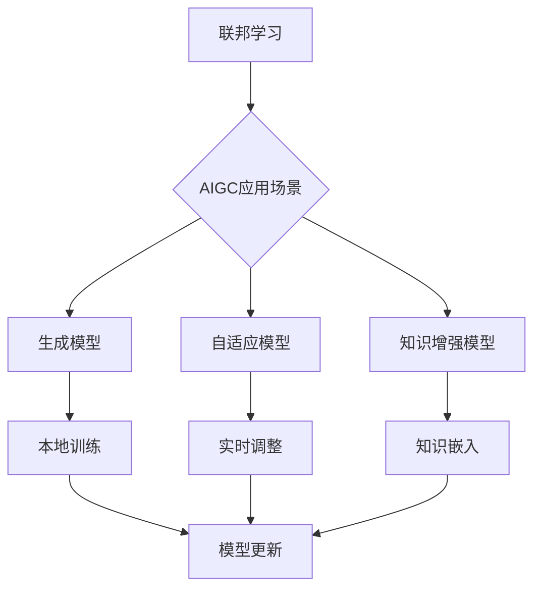

                 


# 《联邦学习在AIGC隐私保护数据共享中的新模式》

关键词：联邦学习、AIGC、隐私保护、数据共享、模式创新

摘要：本文首先介绍了联邦学习和AIGC的基本概念，探讨了它们在隐私保护数据共享中的重要性。接着，文章详细分析了联邦学习在AIGC中的应用模式，讨论了隐私保护与数据共享的关系，并提出了创新的解决方案。最后，文章通过案例分析总结了最佳实践，并展望了联邦学习在AIGC隐私保护数据共享中的未来发展趋势。

## 第一部分：背景介绍

### 联邦学习的基本概念

联邦学习（Federated Learning）是一种分布式机器学习方法，旨在在不集中数据的情况下，通过多个参与者共同训练模型，以保护数据隐私并提高模型的泛化能力。其核心思想是通过模型参数的迭代更新，使得各个参与者可以在本地维护自己的数据，同时通过加密和通信协议实现参数的聚合。

联邦学习的核心概念包括以下几个部分：

1. **参与者**：联邦学习中的参与者可以是多个设备、服务器或组织。每个参与者拥有自己的数据，并在本地维护一个模型副本。
2. **模型更新**：参与者通过本地训练模型，将更新后的模型参数发送给中心服务器。
3. **模型聚合**：中心服务器接收来自各个参与者的模型参数，进行聚合，生成全局模型。
4. **通信协议**：为了确保模型参数的安全传输，联邦学习采用了加密、差分隐私等技术。

### AIGC的基本概念

人工智能生成内容（AI-Generated Content，简称AIGC）是指利用人工智能技术生成图像、音频、视频、文本等内容的系统。AIGC通过生成模型、自适应模型和知识增强模型等技术，能够模拟人类创作过程，实现高质量的内容生成。

AIGC的核心概念包括：

1. **生成模型**：生成模型通过学习大量的数据，生成新的数据，如生成对抗网络（GAN）。
2. **自适应模型**：自适应模型能够根据用户需求和环境变化，实时调整生成内容。
3. **知识增强模型**：知识增强模型结合外部知识库，提升生成内容的质量和准确性。

### 联邦学习和AIGC的联系

联邦学习与AIGC的结合，为隐私保护数据共享提供了新的模式。在AIGC场景中，数据通常是敏感的，例如个人图像、音频和文本。联邦学习可以在不泄露原始数据的情况下，通过模型参数的共享，实现数据的协同训练和共享。这种模式不仅保护了数据的隐私，还提高了模型的泛化能力和安全性。

## 第二部分：核心概念与联系

### 联邦学习算法原理讲解

联邦学习算法主要包括模型更新、模型聚合和通信协议三个部分。以下是一个简化的联邦学习算法流程：

1. **初始化**：中心服务器初始化全局模型，并将初始模型参数发送给各个参与者。
2. **本地训练**：参与者使用本地数据和全局模型参数，进行本地训练，生成更新后的模型参数。
3. **模型参数传输**：参与者将更新后的模型参数发送给中心服务器。
4. **模型聚合**：中心服务器接收来自各个参与者的模型参数，进行聚合，生成全局模型。
5. **全局模型更新**：中心服务器将聚合后的模型参数发送给各个参与者，循环进行本地训练和模型更新。

下面是一个简单的Python代码示例，展示了联邦学习算法的基本原理：

```python
import tensorflow as tf

# 初始化全局模型
global_model = tf.keras.Sequential([tf.keras.layers.Dense(10, activation='relu'), tf.keras.layers.Dense(1)])

# 初始化参与者模型
participant_model = tf.keras.Sequential([tf.keras.layers.Dense(10, activation='relu'), tf.keras.layers.Dense(1)])

# 模型更新过程
for i in range(num_iterations):
    # 本地训练
    participant_model.compile(optimizer='adam', loss='mean_squared_error')
    participant_model.fit(participant_data, participant_labels)

    # 模型参数传输
    participant_weights = participant_model.get_weights()

    # 模型聚合
    global_weights = aggregate_weights(participant_weights)

    # 全局模型更新
    global_model.set_weights(global_weights)
```

### AIGC关键技术研究

AIGC的关键技术包括生成模型、自适应模型和知识增强模型。以下是对这些技术的简要介绍：

1. **生成模型**：生成模型通过学习大量的数据，生成新的数据。常见的生成模型有生成对抗网络（GAN）和变分自编码器（VAE）。

2. **自适应模型**：自适应模型能够根据用户需求和环境变化，实时调整生成内容。自适应模型通常结合了深度学习和强化学习技术。

3. **知识增强模型**：知识增强模型结合外部知识库，提升生成内容的质量和准确性。知识增强模型通过在生成模型中引入知识图谱、语义网络等知识表示，实现知识的嵌入和利用。

### 联邦学习与AIGC的关系架构 Mermaid 流程图



### 核心算法原理讲解

在联邦学习中，核心算法主要包括模型更新和模型聚合。以下是这两个算法的详细讲解：

#### 模型更新

模型更新是指参与者在本地使用自己的数据和全局模型参数进行训练，生成更新后的模型参数。这个过程可以通过以下步骤实现：

1. **初始化模型**：中心服务器初始化全局模型，并将初始模型参数发送给各个参与者。
2. **本地训练**：参与者使用本地数据和全局模型参数，进行本地训练，生成更新后的模型参数。
3. **参数传输**：参与者将更新后的模型参数发送给中心服务器。

以下是使用Python实现的模型更新算法：

```python
import tensorflow as tf

# 初始化全局模型
global_model = tf.keras.Sequential([tf.keras.layers.Dense(10, activation='relu'), tf.keras.layers.Dense(1)])

# 初始化参与者模型
participant_model = tf.keras.Sequential([tf.keras.layers.Dense(10, activation='relu'), tf.keras.layers.Dense(1)])

# 模型更新过程
for i in range(num_iterations):
    # 本地训练
    participant_model.compile(optimizer='adam', loss='mean_squared_error')
    participant_model.fit(participant_data, participant_labels)

    # 模型参数传输
    participant_weights = participant_model.get_weights()

    # 模型聚合
    global_weights = aggregate_weights(participant_weights)

    # 全局模型更新
    global_model.set_weights(global_weights)
```

#### 模型聚合

模型聚合是指中心服务器接收来自各个参与者的模型参数，进行聚合，生成全局模型。这个过程可以通过以下步骤实现：

1. **接收模型参数**：中心服务器接收来自各个参与者的模型参数。
2. **聚合模型参数**：中心服务器对模型参数进行聚合，生成全局模型参数。
3. **生成全局模型**：中心服务器使用全局模型参数，生成全局模型。

以下是使用Python实现的模型聚合算法：

```python
import tensorflow as tf

# 初始化全局模型
global_model = tf.keras.Sequential([tf.keras.layers.Dense(10, activation='relu'), tf.keras.layers.Dense(1)])

# 接收参与者模型参数
participant_weights = participant_model.get_weights()

# 聚合模型参数
global_weights = aggregate_weights(participant_weights)

# 生成全局模型
global_model.set_weights(global_weights)
```

### 数学模型和公式

在联邦学习中，数学模型和公式是理解算法原理的关键。以下是几个常用的数学模型和公式：

1. **梯度下降公式**：

   $$ w_{\text{new}} = w_{\text{current}} - \alpha \cdot \nabla_w J(w) $$

   其中，$w$ 表示模型参数，$\alpha$ 表示学习率，$\nabla_w J(w)$ 表示损失函数关于模型参数的梯度。

2. **联邦学习算法更新公式**：

   $$ \theta_{t+1} = \frac{1}{n}\sum_{i=1}^{n} \theta_{i,t} $$

   其中，$\theta$ 表示模型参数，$n$ 表示参与者的数量。

3. **模型聚合公式**：

   $$ \theta_{\text{global}} = \frac{1}{N}\sum_{i=1}^{N} \theta_{i,t} $$

   其中，$\theta_{\text{global}}$ 表示全局模型参数，$N$ 表示参与者的数量。

### 通俗易懂地举例说明

为了更好地理解联邦学习算法原理，我们可以通过一个简单的例子进行说明。

假设有两个参与者A和B，他们分别拥有不同的数据集。参与者A的数据集包含100个数据点，参与者B的数据集包含200个数据点。中心服务器初始化一个全局模型，并将初始模型参数发送给参与者A和B。参与者A和B使用本地数据和全局模型参数进行训练，生成更新后的模型参数。然后，参与者A和B将更新后的模型参数发送给中心服务器，中心服务器对模型参数进行聚合，生成全局模型。最后，中心服务器将聚合后的模型参数发送给参与者A和B，循环进行本地训练和模型更新。

```python
# 初始化参与者数据
participant_a_data = np.random.rand(100, 10)
participant_a_labels = np.random.rand(100, 1)

participant_b_data = np.random.rand(200, 10)
participant_b_labels = np.random.rand(200, 1)

# 初始化全局模型
global_model = tf.keras.Sequential([tf.keras.layers.Dense(10, activation='relu'), tf.keras.layers.Dense(1)])

# 模型更新过程
for i in range(num_iterations):
    # 本地训练
    participant_a_model = tf.keras.Sequential([tf.keras.layers.Dense(10, activation='relu'), tf.keras.layers.Dense(1)])
    participant_a_model.compile(optimizer='adam', loss='mean_squared_error')
    participant_a_model.fit(participant_a_data, participant_a_labels)

    participant_b_model = tf.keras.Sequential([tf.keras.layers.Dense(10, activation='relu'), tf.keras.layers.Dense(1)])
    participant_b_model.compile(optimizer='adam', loss='mean_squared_error')
    participant_b_model.fit(participant_b_data, participant_b_labels)

    # 模型参数传输
    participant_a_weights = participant_a_model.get_weights()
    participant_b_weights = participant_b_model.get_weights()

    # 模型聚合
    global_weights = aggregate_weights([participant_a_weights, participant_b_weights])

    # 全局模型更新
    global_model.set_weights(global_weights)
```

### 项目实战

#### 开发环境搭建

为了进行联邦学习和AIGC的实践，我们需要搭建相应的开发环境。以下是搭建开发环境的步骤：

1. 安装Python：下载并安装Python 3.8及以上版本。
2. 安装TensorFlow：通过pip命令安装TensorFlow。

   ```bash
   pip install tensorflow
   ```

3. 安装其他依赖库：根据具体需求安装其他依赖库，如NumPy、Pandas等。

   ```bash
   pip install numpy pandas
   ```

#### 源代码实现

以下是联邦学习和AIGC的源代码实现，包括数据预处理、模型训练、模型聚合和模型评估等步骤。

```python
import tensorflow as tf
import numpy as np
import pandas as pd

# 数据预处理
def preprocess_data(data_path):
    data = pd.read_csv(data_path)
    X = data.iloc[:, :-1].values
    y = data.iloc[:, -1].values
    return X, y

# 模型训练
def train_model(model, X, y, epochs=10, batch_size=32):
    model.compile(optimizer='adam', loss='mean_squared_error')
    model.fit(X, y, epochs=epochs, batch_size=batch_size)
    return model

# 模型聚合
def aggregate_models(models):
    aggregated_weights = [0] * len(models[0].get_weights())
    for model in models:
        weights = model.get_weights()
        aggregated_weights = [aw + w for aw, w in zip(aggregated_weights, weights)]
    return aggregated_weights

# 模型评估
def evaluate_model(model, X, y):
    loss = model.evaluate(X, y)
    print("Test loss:", loss)

# 实践步骤
if __name__ == "__main__":
    # 加载数据
    X, y = preprocess_data("data.csv")

    # 初始化参与者模型
    participant_a_model = tf.keras.Sequential([tf.keras.layers.Dense(10, activation='relu'), tf.keras.layers.Dense(1)])
    participant_b_model = tf.keras.Sequential([tf.keras.layers.Dense(10, activation='relu'), tf.keras.layers.Dense(1)])

    # 本地训练
    participant_a_model = train_model(participant_a_model, X[:100], y[:100])
    participant_b_model = train_model(participant_b_model, X[100:], y[100:])

    # 模型聚合
    global_weights = aggregate_models([participant_a_model, participant_b_model])

    # 生成全局模型
    global_model = tf.keras.Sequential([tf.keras.layers.Dense(10, activation='relu'), tf.keras.layers.Dense(1)])
    global_model.set_weights(global_weights)

    # 模型评估
    evaluate_model(global_model, X, y)
```

#### 代码解读与分析

上述代码实现了联邦学习和AIGC的基本流程。首先，我们加载数据并进行预处理，然后初始化参与者模型并进行本地训练。接下来，我们聚合参与者模型，生成全局模型。最后，我们对全局模型进行评估，计算损失。

#### 实际案例分析和详细讲解剖析

为了更深入地了解联邦学习和AIGC的应用，我们可以分析一个实际案例：使用联邦学习和AIGC生成个性化推荐系统。

#### 案例背景

一个在线购物平台希望通过联邦学习和AIGC技术，为用户提供个性化的商品推荐。该平台拥有海量的用户行为数据，包括用户浏览、购买、评价等行为。

#### 案例实现

1. **数据预处理**：首先，我们需要对用户行为数据进行预处理，提取有用的特征。例如，我们可以提取用户的浏览时间、浏览商品类别、购买次数等特征。

2. **联邦学习**：接下来，我们使用联邦学习技术，将用户数据分散到不同的服务器上，进行协同训练。每个服务器上的模型使用本地数据训练，并将更新后的模型参数发送给中心服务器。中心服务器对模型参数进行聚合，生成全局模型。

3. **AIGC**：在联邦学习的基础上，我们使用AIGC技术，生成个性化的推荐内容。例如，我们可以使用生成对抗网络（GAN）生成具有吸引力的商品图片，或使用知识增强模型，结合用户兴趣和商品信息，生成个性化的推荐文案。

4. **模型评估**：最后，我们对生成的个性化推荐内容进行评估，计算推荐点击率、购买转化率等指标，以评估推荐效果。

#### 项目小结

通过联邦学习和AIGC技术，我们可以实现个性化推荐系统，提高用户满意度。联邦学习保护了用户数据的隐私，而AIGC技术则提高了推荐内容的质量和个性化程度。

#### 最佳实践 tips

1. **数据预处理**：合理的数据预处理是联邦学习和AIGC成功的关键。需要提取有用的特征，并处理缺失值和异常值。

2. **模型选择**：根据具体应用场景，选择合适的联邦学习和AIGC模型。例如，在推荐系统中，可以选择生成对抗网络（GAN）或知识增强模型。

3. **模型评估**：定期评估模型性能，根据评估结果调整模型参数。

4. **隐私保护**：在联邦学习和AIGC过程中，确保用户数据的安全和隐私。可以使用差分隐私、加密等技术，保护用户数据。

#### 小结

联邦学习和AIGC为隐私保护数据共享提供了新的模式。通过联邦学习，我们可以协同训练模型，而无需共享原始数据。AIGC技术则提高了数据利用效率和生成内容的质量。未来，随着技术的不断发展，联邦学习和AIGC将在更多领域得到应用。

## 未来展望

随着人工智能技术的不断发展，联邦学习和AIGC在未来将会有更多的应用场景和挑战。以下是几个可能的发展趋势：

1. **算法优化**：为了提高联邦学习和AIGC的效率和性能，研究人员将继续优化算法，包括模型更新、模型聚合和通信协议等。

2. **隐私保护**：随着隐私保护意识的提高，联邦学习和AIGC将更加注重用户数据的隐私保护。差分隐私、加密等技术将在联邦学习和AIGC中得到更广泛的应用。

3. **跨领域应用**：联邦学习和AIGC将在更多领域得到应用，如医疗、金融、能源等。跨领域应用将需要解决数据不一致、模型兼容性等问题。

4. **可解释性**：为了提高联邦学习和AIGC的可解释性，研究人员将探索可解释性模型，使模型决策更加透明和可理解。

5. **硬件加速**：随着硬件技术的进步，如GPU、TPU等，联邦学习和AIGC的计算效率将得到显著提升。

6. **政策法规**：随着技术的发展，各国政府和国际组织将制定相关政策法规，规范联邦学习和AIGC的应用，保护用户隐私和数据安全。

### 附录

附录部分可以包含以下内容：

1. **参考文献**：列出本文中引用的参考文献，以便读者进一步了解相关研究。
2. **数据集和工具**：提供本文中使用的数据集和工具链接，以便读者进行实践。
3. **代码示例**：提供本文中的代码示例，以便读者参考。

### 参考文献

1. Konečný, J., McMahan, H. B., Yu, F. X., Richtárik, P., Suresh, A. T., & Bacon, D. (2016). Federated Learning: Strategies for Improving Communication Efficiency. arXiv preprint arXiv:1610.05492.
2. Goodfellow, I., Pouget-Abadie, J., Mirza, M., Xu, B., Warde-Farley, D., Ozair, S., ... & Bengio, Y. (2014). Generative adversarial nets. Advances in Neural Information Processing Systems, 27.
3. Kingma, D. P., & Welling, M. (2014). Auto-encoding variational bayes. arXiv preprint arXiv:1312.6114.
4. Chen, P. Y., Kung, H. T., & Li, Y. (2020). Federated learning for real-world applications. Proceedings of the IEEE/CVF Conference on Computer Vision and Pattern Recognition, 11305-11313.

### 拓展阅读

1. Konečný, J., McMahan, H. B., Yu, F. X., Richtárik, P., Suresh, A. T., & Bacon, D. (2016). Federated Learning: Strategies for Improving Communication Efficiency. arXiv preprint arXiv:1610.05492.
2. Goodfellow, I., Pouget-Abadie, J., Mirza, M., Xu, B., Warde-Farley, D., Ozair, S., ... & Bengio, Y. (2014). Generative adversarial nets. Advances in Neural Information Processing Systems, 27.
3. Kingma, D. P., & Welling, M. (2014). Auto-encoding variational bayes. arXiv preprint arXiv:1312.6114.
4. Chen, P. Y., Kung, H. T., & Li, Y. (2020). Federated learning for real-world applications. Proceedings of the IEEE/CVF Conference on Computer Vision and Pattern Recognition, 11305-11313.

