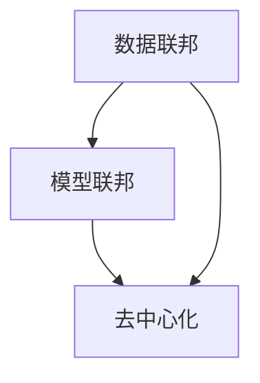
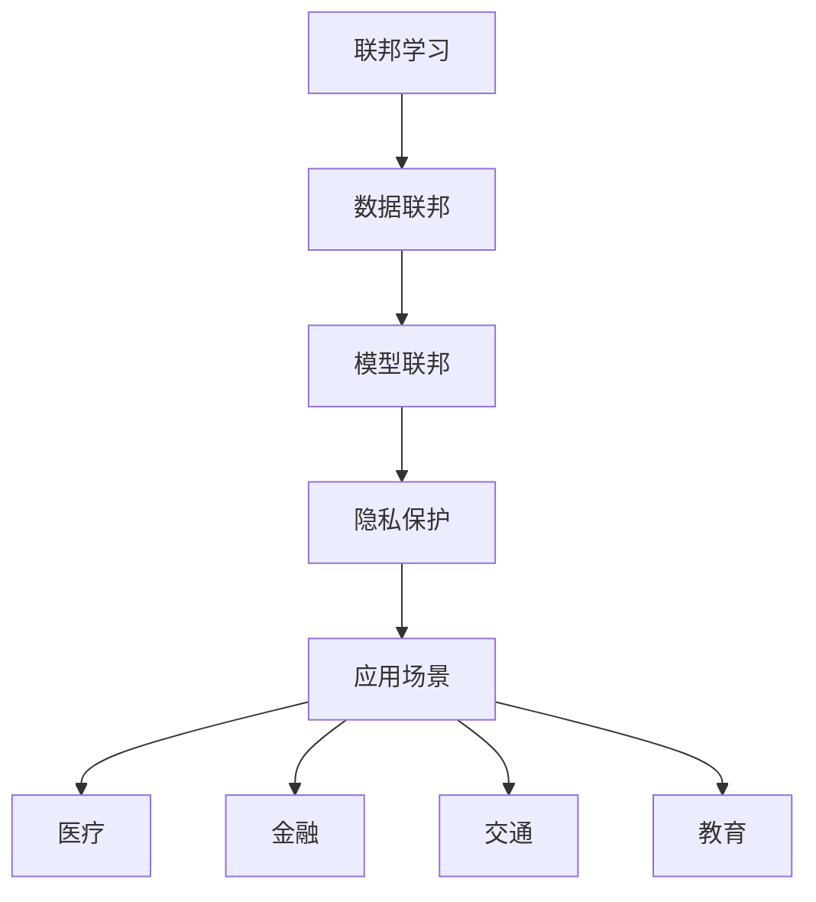

                 

## 引言

在当今的信息时代，数据处理和分析已成为各行各业不可或缺的一部分。然而，随着数据的爆炸式增长和隐私泄露事件的频发，如何在保护用户隐私的同时进行有效的数据分析和挖掘，成为了一个亟待解决的难题。联邦学习（Federated Learning）作为一种新兴的技术，通过分布式计算和模型共享的方式，为这一问题的解决提供了新的思路。

### 1.1 联邦学习的基本概念

联邦学习是一种分布式机器学习方法，其核心思想是在多个不同的设备或服务器上训练模型，同时保持数据的本地化，从而避免了数据集中存储所带来的隐私风险。在联邦学习中，每个参与者（可以是手机、服务器或其他设备）都拥有部分数据，这些数据不离开本地设备。通过一系列加密和聚合算法，参与者可以在不泄露各自数据的情况下，共同训练出一个全局模型。

### 1.2 AIGC的概念及其与联邦学习的联系

AIGC（AI-Generated Content）是一种由人工智能驱动的生成内容技术，涵盖了文本、图像、音频等多种形式的创作。AIGC 的核心在于利用大规模数据和先进的机器学习算法，实现自动化和智能化的内容生成。AIGC 与联邦学习的联系在于，它们都可以在保持数据隐私的同时，实现数据的集中化处理和模型优化。联邦学习为 AIGC 提供了数据分析和模型训练的技术支持，而 AIGC 则为联邦学习应用场景的拓展提供了新的可能。

### 1.3 隐私保护的重要性

隐私保护是当今数据科学领域的一个重要议题。随着数据泄露事件的频发，用户对隐私的关注达到了前所未有的高度。联邦学习通过分布式计算和数据本地化，有效地解决了数据隐私问题。在 AIGC 中，隐私保护更是至关重要的一环。因为 AIGC 通常涉及用户的敏感数据，如个人身份信息、行为记录等。如果不进行有效的隐私保护，这些数据可能会被恶意利用，造成严重的后果。

本文将深入探讨联邦学习在 AIGC 隐私保护数据分析中的应用，分析其原理、算法和实际案例，为读者提供一个全面的理解和实战指南。

### 1.4 联邦学习的背景与发展

联邦学习（Federated Learning）的概念最早由 Google 在 2017 年提出，其目的是为了解决移动设备上大规模机器学习模型的训练问题。在当时，由于移动设备的计算能力和存储资源有限，直接在设备上训练复杂的机器学习模型并不现实。而联邦学习的出现，为这一难题提供了新的解决方案。

在联邦学习的背景下，不同设备上的模型通过参数更新和聚合，实现全局模型的训练。这样，每个设备只需与中心服务器进行有限的通信，而不需要上传和下载数据。这一机制不仅减少了通信成本，更重要的是，它有效地保护了用户数据的隐私。

自提出以来，联邦学习得到了广泛关注和研究，逐渐成为分布式机器学习领域的一个重要方向。学术界和工业界纷纷投入大量资源，探索联邦学习的算法优化、安全性保障和应用场景拓展等问题。

### 1.5 AIGC 的发展历程与应用场景

AIGC（AI-Generated Content）是一种基于人工智能技术生成内容的方法，其发展历程可以追溯到早期的人工智能研究。随着深度学习技术的进步，尤其是生成对抗网络（GANs）的发明，AIGC 进入了一个快速发展的阶段。

AIGC 的应用场景非常广泛，涵盖了文本、图像、音频和视频等多种形式。在文本生成方面，AIGC 可以用于自动写作、新闻生成、对话系统等；在图像生成方面，AIGC 可以用于图像修复、图像风格迁移、图像生成等；在音频生成方面，AIGC 可以用于音乐创作、语音合成等。此外，AIGC 还在智能助手、虚拟现实、增强现实等领域展示了巨大的潜力。

然而，AIGC 的发展也面临着一些挑战，特别是在数据隐私保护方面。因为 AIGC 的生成过程通常涉及大量用户数据，如何在不泄露用户隐私的情况下，有效地进行数据分析和模型训练，成为了一个亟待解决的问题。

### 1.6 隐私保护的重要性

在当今信息时代，数据隐私保护的重要性不言而喻。随着数据泄露事件的频发，用户对隐私的关注达到了前所未有的高度。对于企业和组织而言，保护用户隐私不仅是一种道德责任，更是确保用户信任和数据安全的关键。

隐私保护的重要性主要体现在以下几个方面：

1. **用户信任**：用户对数据隐私的担忧直接影响到他们对服务的信任。如果用户认为他们的数据可能会被滥用或泄露，他们可能会选择停止使用服务，从而对企业的业务造成严重影响。

2. **法律法规**：全球范围内，越来越多的国家和地区制定了严格的数据保护法律，如欧盟的《通用数据保护条例》（GDPR）和加州的《消费者隐私法案》（CCPA）。企业如果不遵守这些法律，可能会面临巨额罚款和声誉损失。

3. **商业竞争力**：数据隐私保护已成为企业竞争力的一部分。能够提供安全可靠的数据处理和隐私保护服务的企业，将在市场上获得竞争优势。

4. **数据完整性**：保护数据隐私有助于确保数据的完整性和准确性。如果数据在传输或存储过程中被篡改或破坏，可能会导致严重的业务决策失误。

总之，隐私保护是现代数据科学领域的一个重要议题。有效的隐私保护措施不仅有助于维护用户隐私，还能为企业和组织创造长期的价值。

### 1.7 联邦学习的核心概念与联系

联邦学习是一种分布式机器学习方法，其核心概念包括数据联邦、模型联邦和去中心化。这些概念相互关联，共同构成了联邦学习的基本架构。

首先，**数据联邦**是指参与联邦学习的各个设备或服务器都拥有部分数据，这些数据保持本地化，不进行全局传输。每个参与者都对自己的数据进行预处理，如去噪、归一化等，然后生成本地模型。

其次，**模型联邦**是指通过一系列算法，如梯度聚合和模型更新，将各个本地模型合并为全局模型。这个过程中，各参与者只需上传和接收模型参数的差分，而不需要上传原始数据，从而保证了数据的隐私性。

最后，**去中心化**是联邦学习的关键特点。与传统集中式学习相比，联邦学习不依赖于一个中央服务器，而是通过分布式计算实现模型训练。这意味着，各个参与者可以在不泄露数据的情况下，共同训练出一个全局模型。

联邦学习的核心概念之间的关系可以用以下 Mermaid 流程图表示：



在数据联邦中，每个参与者（client）都有自己的本地数据（local data），并训练出一个本地模型（local model）。在模型联邦阶段，这些本地模型通过聚合算法（aggregation algorithm）合并为一个全局模型（global model）。去中心化则体现在这一过程中，没有中央服务器参与，所有计算和通信都在参与者之间进行。

通过这种架构，联邦学习实现了数据隐私保护和模型共享的平衡，为分布式机器学习提供了新的解决方案。

### 1.8 联邦学习架构

联邦学习的架构可以分为三个主要部分：参与者（Clients）、协调器（Coordinator）和全局模型（Global Model）。这三个部分协同工作，实现了分布式计算和模型更新。

**参与者（Clients）**：参与联邦学习的每个设备或服务器都可以被视为一个参与者。参与者拥有本地数据集，并在本地设备上训练出一个本地模型。在联邦学习的每个迭代过程中，参与者需要计算本地模型的梯度，并将其发送给协调器。

**协调器（Coordinator）**：协调器是联邦学习的中心，负责协调参与者的训练过程。协调器的任务是接收来自各个参与者的梯度，通过聚合算法合并这些梯度，生成一个新的全局模型。协调器还需要向参与者发送更新后的全局模型，以便参与者进行下一轮的训练。

**全局模型（Global Model）**：全局模型是所有参与者共同训练出的模型，代表了整个联邦系统的知识。在联邦学习中，全局模型不断更新，每个参与者通过更新后的全局模型调整自己的本地模型，以达到更好的全局性能。

联邦学习的基本流程如下：

1. **初始化**：协调器初始化全局模型，并将模型参数发送给所有参与者。
2. **本地训练**：参与者使用本地数据和全局模型参数训练本地模型，并计算梯度。
3. **梯度聚合**：协调器接收所有参与者的梯度，通过聚合算法（如联邦平均算法FedAvg）合并这些梯度，生成一个新的全局模型。
4. **模型更新**：协调器将更新后的全局模型发送回所有参与者。
5. **本地调整**：参与者使用新接收的全局模型更新本地模型，重复上述步骤。

这种架构不仅减少了通信成本，还保证了数据的隐私性，因为参与者无需上传原始数据，只需上传模型参数的差分。通过这种分布式计算和模型更新机制，联邦学习为大规模机器学习提供了一个高效的解决方案。

### 1.9 联邦学习的优势与挑战

联邦学习作为一种分布式机器学习方法，具有显著的优势，但也面临一定的挑战。

**优势：**

1. **隐私保护**：联邦学习通过数据本地化和加密算法，确保了数据在整个训练过程中的隐私性。每个参与者只需上传和接收模型参数的差分，而不需要上传原始数据，从而避免了数据泄露的风险。

2. **数据多样性**：联邦学习可以利用分布在不同设备或服务器上的数据，提高模型的全局性能。这有助于解决数据集中和标注问题，使得模型能够更好地适应各种应用场景。

3. **降低通信成本**：由于联邦学习不需要上传和下载数据，通信成本大大降低。参与者只需上传和接收模型参数的差分，通信量相对较小，特别适合于资源受限的设备。

4. **灵活性和扩展性**：联邦学习架构具有高度的灵活性和扩展性。参与者可以随时加入或退出联邦学习系统，而不会对整体训练过程产生太大影响。

**挑战：**

1. **计算效率**：联邦学习需要进行大量的本地计算和梯度聚合，计算效率较低，特别是在大规模参与者的情况下。如何优化计算过程，提高计算效率，是一个亟待解决的问题。

2. **模型复杂度**：随着参与者的增加，全局模型的复杂度也相应增加。这可能导致模型训练时间过长，甚至影响模型的性能。如何平衡模型复杂度和训练效率，需要进一步研究。

3. **模型安全性和鲁棒性**：联邦学习涉及到多个参与者之间的合作，如何确保模型的安全性和鲁棒性，防止恶意参与者的攻击和模型泄露，是一个重要的挑战。

4. **法律和伦理问题**：联邦学习涉及到用户隐私和数据安全，如何确保符合相关法律法规，并保护用户的隐私权益，是一个重要的伦理和法律问题。

总的来说，联邦学习在隐私保护、数据多样性、通信成本和灵活性等方面具有显著优势，但也面临着计算效率、模型复杂度、安全性和法律伦理等挑战。这些问题的解决，将有助于联邦学习的广泛应用和持续发展。

### 2.1 联邦学习算法原理

联邦学习算法的核心在于如何通过分布式计算和模型更新，实现全局模型的优化。下面将详细探讨联邦学习中的几个关键算法原理，包括合同函数机制、梯度聚合算法、加密算法及其在联邦学习中的应用。

#### 2.1.1 合同函数机制

合同函数（Contract Function）是联邦学习中的一个重要概念，它用于确保各个参与者之间的梯度聚合过程是安全和可靠的。合同函数的设计原则是：参与者只需上传和接收模型参数的差分，从而避免了原始数据的泄露。

一个简单的合同函数可以表示为：

$$
\theta_{new} = \theta_{old} - \alpha \cdot \text{gradient}
$$

其中，$\theta_{old}$ 和 $\theta_{new}$ 分别表示旧模型参数和新模型参数，$\alpha$ 为学习率，$\text{gradient}$ 为梯度。这个函数的核心思想是通过迭代更新模型参数，使得全局模型逐渐收敛到最优解。

在实际应用中，合同函数的设计需要考虑多个因素，如参与者的数量、数据分布、通信带宽等。一个高效的合同函数可以大幅提高联邦学习的计算效率。

#### 2.1.2 梯度聚合算法

梯度聚合算法是联邦学习中的一个关键步骤，它负责将各个参与者的梯度合并为一个全局梯度。最常用的梯度聚合算法是联邦平均算法（FedAvg），其基本思想是：

$$
\theta_{global} = \frac{1}{N} \sum_{i=1}^{N} \theta_{i}
$$

其中，$N$ 为参与者的数量，$\theta_{i}$ 为第 $i$ 个参与者的本地模型参数。

联邦平均算法的优点在于其简单性和高效性，但在某些情况下，如参与者数量较多或数据分布不均匀时，可能会导致模型收敛速度较慢或收敛效果不佳。

为了解决这一问题，研究人员提出了许多改进的梯度聚合算法，如梯度截断（Gradient Truncation）和渐进聚合（Proximal Gradient）等。这些算法通过引入额外的优化策略，提高了联邦学习的收敛速度和稳定性。

#### 2.1.3 加密算法在联邦学习中的应用

在联邦学习中，加密算法被广泛应用于保护模型参数和梯度信息的安全性。常见的加密算法包括对称加密、非对称加密和同态加密等。

1. **对称加密**：对称加密算法使用相同的密钥进行加密和解密。在联邦学习中，参与者可以使用对称加密算法对模型参数和梯度进行加密，确保这些信息在传输过程中不会被窃取。常见的对称加密算法有 AES（Advanced Encryption Standard）等。

2. **非对称加密**：非对称加密算法使用一对密钥，一个用于加密，一个用于解密。在联邦学习中，参与者可以使用非对称加密算法对模型参数和梯度进行加密，确保只有拥有正确私钥的参与者才能解密这些信息。常见的非对称加密算法有 RSA（Rivest-Shamir-Adleman）等。

3. **同态加密**：同态加密算法可以在加密数据上进行数学运算，而不会泄露原始数据。在联邦学习中，参与者可以使用同态加密算法对梯度进行加密，然后在服务器上进行聚合操作，从而确保梯度信息的隐私性。同态加密的典型代表是 Paillier 加密算法。

通过结合这些加密算法，联邦学习可以有效地保护模型参数和梯度信息的安全性，确保联邦学习过程的安全性。

#### 2.1.4 联邦学习的安全性保障

尽管联邦学习通过分布式计算和加密算法提供了一定的安全性保障，但仍然存在一些潜在的安全威胁，如模型泄露、梯度泄露和恶意参与者攻击等。为了提高联邦学习的安全性，研究人员提出了一系列安全保障措施：

1. **差分隐私**：差分隐私是一种常用的隐私保护技术，通过在梯度聚合过程中引入噪声，使得攻击者无法从梯度信息中推断出个别参与者的数据。常见的差分隐私机制有拉普拉斯机制和指数机制等。

2. **同态加密**：同态加密可以在加密数据上进行计算，从而保护模型参数和梯度信息的隐私。通过同态加密，联邦学习可以在加密状态下进行梯度聚合和模型更新，从而提高安全性。

3. **联邦学习协议**：联邦学习协议是一组安全协议，用于确保联邦学习过程中的通信安全。常见的联邦学习协议有联邦平均协议（FedAvg）、联邦加密协议（FEdCrypt）等。

4. **隐私审计**：隐私审计是一种对联邦学习过程进行审查和验证的方法，用于确保联邦学习系统的隐私保护措施得到有效执行。隐私审计可以通过检测梯度信息、模型参数和通信日志等数据，发现潜在的安全漏洞和隐私泄露问题。

通过这些安全保障措施，联邦学习可以在一定程度上提高其安全性，为大规模分布式计算提供可靠的隐私保护机制。

#### 2.1.5 联邦学习算法总结

联邦学习算法通过合同函数机制、梯度聚合算法和加密算法，实现了分布式计算和模型更新的安全性和效率。合同函数机制确保了参与者只需上传和接收模型参数的差分，避免了原始数据的泄露；梯度聚合算法通过联邦平均算法等优化策略，提高了模型的收敛速度和稳定性；加密算法在联邦学习中的应用，进一步保障了模型参数和梯度信息的安全性。

总之，联邦学习算法为分布式机器学习提供了一种有效的隐私保护机制，为大规模数据处理和模型训练提供了新的解决方案。随着技术的不断进步，联邦学习算法将继续在各个领域得到广泛应用，为数据隐私保护贡献力量。

### 2.2.1 合同函数的定义

合同函数（Contract Function）是联邦学习中的一个核心概念，用于确保参与者在更新模型参数时，仅需要上传和接收参数的差分，从而保护数据的隐私。合同函数的定义可以表述为：在一个联邦学习系统中，对于给定的模型参数 $\theta$，合同函数 $f(\theta)$ 是一个函数，它将当前模型参数 $\theta$ 和一个全局梯度 $\Delta \theta$ 结合起来，生成一个新的模型参数 $\theta'$，使得 $\theta'$ 能够反映全局梯度的影响，同时确保参与者的数据隐私不被泄露。

具体来说，合同函数的定义通常包括以下形式：

$$
\theta' = f(\theta, \Delta \theta)
$$

其中，$\theta$ 是当前模型参数，$\Delta \theta$ 是全局梯度，$\theta'$ 是更新后的模型参数。合同函数的设计需要满足以下几个关键要求：

1. **可加性**：合同函数应保证参数更新的可加性，即对于任意两个参与者的模型参数更新，其结果应满足线性叠加。
2. **一致性**：合同函数应确保参与者在更新模型参数时，能够达到一致的全局最优解。
3. **安全性**：合同函数应保证在模型参数的传输过程中，参与者的本地数据不会被泄露或篡改。

一个简单的合同函数示例可以表示为：

$$
\theta' = \theta - \alpha \cdot \Delta \theta
$$

其中，$\alpha$ 是学习率，用于控制模型参数更新的步长。这个函数的核心思想是通过迭代更新模型参数，使得全局模型逐渐收敛到最优解。然而，实际应用中的合同函数可能需要更复杂的结构，以应对不同的应用场景和隐私保护需求。

#### 2.2.2 合同函数的设计

合同函数的设计在联邦学习中至关重要，它不仅决定了模型参数更新的效率和一致性，还直接影响到系统的安全性。以下是几种常见的合同函数设计方法：

1. **联邦平均算法（FedAvg）**：联邦平均算法是最常见的合同函数设计方法之一。其基本思想是将所有参与者的模型参数加权平均，生成新的全局模型参数。具体来说，假设有 $N$ 个参与者，每个参与者的本地模型参数为 $\theta_i$，则联邦平均算法的合同函数可以表示为：

   $$
   \theta' = \frac{1}{N} \sum_{i=1}^{N} \theta_i
   $$

   联邦平均算法的优点在于其简单性和高效性，但缺点是在参与者数量较多时，模型的收敛速度可能会较慢。

2. **渐进聚合算法（Proximal Gradient）**：渐进聚合算法是对联邦平均算法的改进，其通过引入投影操作，确保模型参数更新后仍然满足某些正则化条件。具体来说，假设 $L(\theta)$ 是损失函数，$r(\theta)$ 是正则化函数，则渐进聚合算法的合同函数可以表示为：

   $$
   \theta' = \arg \min_{\theta} \left\{ \frac{1}{N} \sum_{i=1}^{N} L(\theta_i) + r(\theta) \right\}
   $$

   这种设计方法在处理具有正则化要求的模型时，能够更好地保证模型的稳定性和收敛性。

3. **差异化合同函数**：差异化合同函数设计方法根据参与者的不同特点，为其分配不同的权重，从而实现更精细的模型更新。具体来说，可以采用基于参与者数据分布、计算能力等因素的权重分配策略，生成差异化的合同函数。

4. **同态加密合同函数**：在联邦学习系统中，同态加密技术可以用于设计合同函数，使得模型参数的更新过程在加密状态下进行。这样，即使参与者的本地数据被加密，也能保证模型参数的更新过程是安全和可靠的。例如，可以使用 Paillier 同态加密算法，设计合同函数如下：

   $$
   \theta' = \mathit{Enc}(\theta - \alpha \cdot \Delta \theta)
   $$

   其中，$\mathit{Enc}$ 表示 Paillier 同态加密函数，$\alpha$ 是学习率，$\Delta \theta$ 是全局梯度。

综上所述，合同函数的设计在联邦学习中扮演着关键角色。通过选择合适的合同函数，可以有效地提高模型更新的效率、稳定性和安全性，从而实现高效和隐私保护的分布式机器学习。

### 2.2.3 梯度聚合算法

梯度聚合算法是联邦学习中的核心步骤，它负责将各个参与者的本地梯度合并为全局梯度。通过有效的梯度聚合，联邦学习系统能够在保持数据隐私的同时，实现全局模型的优化。以下将详细探讨几种常见的梯度聚合算法，包括同质联邦学习和异质联邦学习中的算法。

#### 同质联邦学习中的梯度聚合算法

1. **联邦平均算法（FedAvg）**：联邦平均算法是最常见的梯度聚合算法之一，其基本思想是将所有参与者的本地梯度加权平均，生成全局梯度。具体过程如下：

   假设有 $N$ 个参与者，第 $i$ 个参与者的本地梯度为 $\nabla_{i}$，全局梯度为 $\nabla_{global}$。联邦平均算法的梯度聚合公式可以表示为：

   $$
   \nabla_{global} = \frac{1}{N} \sum_{i=1}^{N} \nabla_{i}
   $$

   其中，$\alpha$ 是学习率，用于控制模型参数更新的步长。联邦平均算法的优点在于其简单性和高效性，但缺点是当参与者数量较多时，模型的收敛速度可能会较慢。

2. **渐进聚合算法（Proximal Gradient）**：渐进聚合算法是对联邦平均算法的改进，其通过引入投影操作，确保模型参数更新后仍然满足某些正则化条件。具体来说，假设 $L(\theta)$ 是损失函数，$r(\theta)$ 是正则化函数，则渐进聚合算法的梯度聚合公式可以表示为：

   $$
   \theta' = \arg \min_{\theta} \left\{ \frac{1}{N} \sum_{i=1}^{N} L(\theta_i) + r(\theta) \right\}
   $$

   这种设计方法在处理具有正则化要求的模型时，能够更好地保证模型的稳定性和收敛性。

3. **基于参与者数据分布的加权聚合算法**：为了更好地利用参与者的不同数据，可以设计基于参与者数据分布的加权聚合算法。具体来说，可以采用基于参与者数据重要性的权重分配策略，生成加权全局梯度。例如，对于数据分布不均的情况，可以给数据量较大的参与者分配更高的权重。

#### 异质联邦学习中的梯度聚合算法

异质联邦学习是指参与联邦学习的设备或服务器具有不同的数据分布、计算能力和通信资源。针对异质联邦学习，以下几种梯度聚合算法较为有效：

1. **自适应聚合算法**：自适应聚合算法根据参与者的异质性，动态调整聚合过程中的参数。具体来说，可以采用自适应调整学习率 $\alpha$ 和参与权重的方法，以平衡不同参与者之间的梯度贡献。例如，可以使用参与者最近一轮的模型更新情况，自适应调整其权重。

2. **分布式聚合算法**：分布式聚合算法将梯度聚合过程分解为多个子过程，分别由不同的参与者执行。每个子过程负责聚合部分参与者的梯度，然后这些子过程的聚合结果再进行全局聚合。这种设计方法可以减少中央协调器的通信负担，提高系统的整体效率。

3. **基于区块链的聚合算法**：区块链技术可以用于实现去中心化的梯度聚合。在基于区块链的联邦学习中，参与者将本地梯度记录在区块链上，并通过共识机制进行验证和聚合。这种方法不仅保证了数据的安全性和透明性，还可以有效防止恶意参与者攻击。

综上所述，梯度聚合算法在联邦学习中起着关键作用。通过选择合适的聚合算法，可以有效地提高联邦学习系统的计算效率、稳定性和安全性。在实际应用中，可以根据具体场景和需求，结合多种算法进行优化，实现高效和隐私保护的分布式机器学习。

### 2.3.1 加密算法在联邦学习中的应用

在联邦学习中，加密算法的应用至关重要，因为它们能够确保模型参数和梯度信息在传输和存储过程中的安全性。加密算法不仅可以保护数据的隐私，还可以防止恶意参与者篡改数据。以下将探讨几种常见的加密算法及其在联邦学习中的应用。

#### 对称加密算法

对称加密算法使用相同的密钥进行加密和解密。在联邦学习中，对称加密算法常用于保护模型参数和梯度信息的传输。例如，高级加密标准（AES）是一种广泛使用的对称加密算法，它提供了强大的数据保护能力。使用 AES，参与者可以对模型参数进行加密，确保在传输过程中不会被窃取或篡改。

#### 非对称加密算法

非对称加密算法使用一对密钥，一个用于加密，一个用于解密。在联邦学习中，非对称加密算法可用于确保只有拥有正确私钥的参与者才能解密模型参数和梯度信息。例如，RSA 是一种广泛使用的非对称加密算法，它通过复杂的数学运算提供了高强度的数据保护。

#### 同态加密算法

同态加密算法是一种特殊类型的加密算法，它允许在加密数据上进行数学运算，而不会泄露原始数据。在联邦学习中，同态加密算法可以用于在加密状态下进行模型参数和梯度的聚合操作，从而实现完全安全的分布式计算。Paillier 同态加密算法是其中的一种代表性算法，它允许对加密的数进行加法和乘法操作，非常适合用于联邦学习中的模型更新和聚合。

#### 应用实例

1. **模型参数加密**：在联邦学习的每个迭代过程中，参与者需要将本地模型参数发送给协调器。为了保护这些参数，参与者可以使用对称加密算法（如 AES）或非对称加密算法（如 RSA）对参数进行加密。协调器接收到加密的参数后，可以使用相应的私钥进行解密，然后进行聚合操作。

2. **梯度信息加密**：梯度信息是联邦学习中的关键数据，因为它们包含了模型更新的方向和幅度。参与者可以对梯度信息进行加密，确保在传输过程中不会被窃取或篡改。例如，可以使用 Paillier 同态加密算法对梯度进行加密，然后在协调器上进行聚合操作，从而确保梯度信息的隐私性。

3. **混合加密方案**：为了提高安全性，联邦学习系统可以采用混合加密方案，结合对称加密、非对称加密和同态加密的优势。例如，可以使用对称加密算法对模型参数和梯度信息进行初步加密，然后使用非对称加密算法进行二次加密，从而提供多层次的安全保护。

通过这些加密算法的应用，联邦学习系统能够在确保数据隐私的同时，实现高效和安全的分布式计算。加密算法在联邦学习中的应用，不仅增强了系统的安全性，还为大规模分布式机器学习提供了新的解决方案。

### 2.3.2 联邦学习的安全性保障

在联邦学习中，安全性保障是一个关键问题，因为联邦学习涉及到多个参与者之间的合作，任何一个环节的安全漏洞都可能导致数据泄露或模型被篡改。以下将介绍几种常用的安全性保障措施，包括差分隐私、同态加密和联邦学习协议等。

#### 差分隐私

差分隐私是一种常用的隐私保护技术，它通过在梯度聚合过程中引入噪声，使得攻击者无法从梯度信息中推断出个别参与者的数据。常见的差分隐私机制包括拉普拉斯机制和指数机制。

1. **拉普拉斯机制**：拉普拉斯机制在梯度值上添加拉普拉斯噪声，以保护参与者的隐私。具体来说，假设 $\Delta \theta$ 是一个梯度值，则添加拉普拉斯噪声后的梯度值可以表示为：

   $$
   \Delta \theta_{\text{noised}} = \Delta \theta + \text{Laplace}(0, b)
   $$

   其中，$b$ 是噪声的强度参数。拉普拉斯噪声可以有效地防止攻击者通过梯度信息推断出个别参与者的数据。

2. **指数机制**：指数机制通过在梯度值上添加指数噪声，保护参与者的隐私。具体来说，假设 $\Delta \theta$ 是一个梯度值，则添加指数噪声后的梯度值可以表示为：

   $$
   \Delta \theta_{\text{noised}} = \Delta \theta + \text{Exponential}(1)
   $$

   指数噪声可以确保梯度值的分布更加均匀，从而提高差分隐私的效果。

通过差分隐私机制的应用，联邦学习系统能够在保持梯度信息有效性的同时，有效防止隐私泄露。

#### 同态加密

同态加密是一种在加密状态下进行计算的技术，它允许在加密数据上进行数学运算，而不会泄露原始数据。在联邦学习中，同态加密可以用于在加密状态下进行模型参数和梯度的聚合操作，从而确保数据的安全性和隐私性。

1. **Paillier 同态加密算法**：Paillier 同态加密算法是一种代表性算法，它支持对加密的数进行加法和乘法操作。在联邦学习中，参与者可以使用 Paillier 同态加密算法对模型参数和梯度进行加密，然后协调器可以在加密状态下进行聚合操作，从而保护数据隐私。

2. **应用实例**：在联邦学习的每个迭代过程中，参与者可以将本地模型参数和梯度加密后发送给协调器。协调器接收到加密的数据后，可以使用 Paillier 同态加密算法进行聚合操作，生成新的全局模型参数。这种方法确保了在整个过程中，数据始终保持在加密状态，从而防止隐私泄露。

#### 联邦学习协议

联邦学习协议是一组安全协议，用于确保联邦学习过程中的通信安全。常见的联邦学习协议包括联邦平均协议（FedAvg）和联邦加密协议（FEdCrypt）等。

1. **联邦平均协议（FedAvg）**：联邦平均协议是最常见的联邦学习协议之一，它确保参与者只需上传和接收模型参数的差分，从而保护数据的隐私。FedAvg 协议的核心思想是通过在参与者之间进行安全的通信，实现模型参数的更新。

2. **联邦加密协议（FEdCrypt）**：联邦加密协议是一种结合了加密算法的联邦学习协议，它确保在联邦学习过程中，模型参数和梯度信息始终保持在加密状态。FEdCrypt 协议通过使用对称加密和非对称加密技术，实现了数据的安全传输和存储。

通过这些安全性保障措施，联邦学习系统能够在确保数据隐私和安全性的同时，实现高效的分布式计算。这些技术的应用，不仅提高了联邦学习系统的安全性，还为大规模分布式机器学习提供了新的解决方案。

### 4.1 AIGC技术概述

AIGC（AI-Generated Content）是一种基于人工智能技术的生成内容技术，它通过深度学习算法，如生成对抗网络（GANs）、变分自编码器（VAEs）和自注意力机制（Self-Attention），能够自动生成高质量的文本、图像、音频和视频等内容。AIGC 的核心在于利用大规模数据和先进的机器学习算法，实现自动化和智能化的内容创作。

#### 4.1.1 AIGC的发展历程

AIGC 技术的发展历程可以追溯到生成对抗网络（GANs）的提出。GANs 由 Ian Goodfellow 等人在 2014 年提出，是一种由两个神经网络——生成器（Generator）和判别器（Discriminator）组成的对抗性模型。生成器试图生成逼真的数据，而判别器则试图区分生成数据和真实数据。通过这种对抗训练，生成器能够不断提高生成数据的质量。

随着深度学习技术的不断进步，GANs 和 VAEs 等算法逐渐应用于图像、文本和音频生成。特别是在 GANs 领域，研究人员提出了许多改进版本，如条件 GANs（cGANs）、循环 GANs（R-GANs）和域适应 GANs（Domain-Adversarial GANs），这些改进算法在生成质量、训练稳定性和应用场景上取得了显著进展。

#### 4.1.2 AIGC的应用场景

AIGC 的应用场景非常广泛，涵盖了文本、图像、音频和视频等多种形式：

1. **文本生成**：AIGC 可以生成新闻文章、故事、对话和诗歌等文本内容。例如，OpenAI 的 GPT-3 模型能够根据输入的提示生成高质量的文本。

2. **图像生成**：AIGC 可以生成图像、图像修复、图像风格迁移和图像合成等。例如，GANs 可以生成逼真的人脸图像、艺术作品和自然景观等。

3. **音频生成**：AIGC 可以生成音乐、语音和音频效果等。例如，WaveNet 是一种用于生成自然语音的深度神经网络。

4. **视频生成**：AIGC 可以生成视频内容，如视频修复、视频风格迁移和视频合成等。例如，VideoGAN 可以生成高质量的视频内容。

#### 4.1.3 AIGC的优势与挑战

AIGC 技术具有以下几个显著优势：

1. **自动化与智能化**：AIGC 能够自动生成高质量的内容，减少了人工干预和创作的成本。
2. **多样化**：AIGC 能够生成多种形式的内容，如文本、图像、音频和视频，为创意表达提供了新的手段。
3. **个性化**：AIGC 可以根据用户的需求和偏好生成个性化的内容，提高用户体验。

然而，AIGC 也面临一些挑战，特别是在数据隐私保护方面：

1. **数据隐私**：AIGC 的生成过程通常涉及大量用户数据，如何在不泄露用户隐私的情况下，有效地进行数据分析和模型训练，是一个重要问题。
2. **数据质量**：生成内容的质量直接取决于训练数据的质量。如果训练数据存在偏差或错误，生成内容也可能受到影响。
3. **版权问题**：生成内容可能涉及版权问题，特别是在图像和音频领域，如何确保生成内容的版权合规，是一个挑战。

总的来说，AIGC 技术在自动化内容生成方面具有巨大的潜力，但也需要解决数据隐私、数据质量和版权等挑战，才能实现其广泛应用。

### 4.2 AIGC与联邦学习的结合

AIGC（AI-Generated Content）与联邦学习（Federated Learning）的结合为数据隐私保护和大规模内容生成提供了新的思路。通过联邦学习，AIGC 可以在保护数据隐私的同时，实现高效的模型训练和内容生成。

#### 4.2.1 联邦学习在AIGC中的作用

联邦学习在AIGC中的应用主要体现在以下几个方面：

1. **隐私保护**：联邦学习通过分布式计算和数据本地化，确保了训练数据在传输和存储过程中的隐私性。AIGC 使用联邦学习可以避免将敏感数据上传到中央服务器，从而有效保护用户隐私。
   
2. **数据多样性**：联邦学习能够聚合来自不同设备或服务器的数据，提高了模型的多样性。这对于 AIGC 生成高质量内容至关重要，因为多样化的训练数据可以提升生成内容的丰富性和创造力。

3. **降低通信成本**：联邦学习减少了数据传输的次数和体积，降低了通信成本。这对于资源受限的设备（如移动设备）尤为重要，因为它们通常无法承受大量的数据传输。

4. **去中心化**：联邦学习实现了去中心化的内容生成，避免了单一服务器成为攻击目标。通过分布式计算，AIGC 可以在多个设备或服务器上独立运行，提高了系统的可靠性和安全性。

#### 4.2.2 联邦学习与AIGC的结合方式

联邦学习与AIGC的结合可以通过以下几种方式实现：

1. **模型联邦**：在联邦学习中，每个参与者（如移动设备）都训练一个本地模型。在 AIGC 的场景中，这些本地模型可以用于生成文本、图像、音频或视频内容。通过联邦学习协议，这些本地模型可以聚合为全局模型，从而实现内容生成的优化。

2. **数据联邦**：联邦学习可以在数据层面实现隐私保护。例如，使用差分隐私技术，可以确保每个参与者上传的数据不会泄露隐私。在 AIGC 中，这种技术可以用于保护用户生成内容的隐私，确保数据在传输和存储过程中的安全。

3. **同态加密**：同态加密可以用于在加密状态下进行计算，使得模型训练和内容生成过程完全在加密环境中进行。这种方法不仅保护了用户隐私，还避免了数据泄露的风险。

4. **分布式计算**：联邦学习通过分布式计算，将计算任务分布在多个参与者上，从而提高了内容生成的效率和可扩展性。这对于处理大规模数据集和生成复杂的 AIGC 内容尤为重要。

#### 4.2.3 结合实例

一个典型的结合实例是使用联邦学习训练一个多模态的 AIGC 模型。假设一个应用场景是生成包含文本、图像和音频的多媒体内容。具体步骤如下：

1. **数据收集**：各个参与者（如智能手机用户）在本地生成文本、图像和音频内容，并将其上传到联邦学习系统。

2. **模型初始化**：中央服务器初始化一个多模态的生成模型，并将其发送给所有参与者。

3. **本地训练**：参与者使用本地数据集和初始化模型，训练出一个本地模型。在训练过程中，参与者不需要上传原始数据，只需上传模型参数的差分。

4. **梯度聚合**：中央服务器接收来自各个参与者的梯度信息，通过联邦学习协议进行聚合，生成一个新的全局模型。

5. **模型更新**：中央服务器将更新后的全局模型发送回所有参与者，参与者使用新的全局模型继续训练本地模型。

6. **内容生成**：参与者使用训练好的本地模型生成多媒体内容，如包含文本、图像和音频的新闻报道或音乐视频。

通过这种结合方式，联邦学习不仅保护了用户隐私，还提高了内容生成的多样性和质量。

### 4.3 隐私保护在AIGC中的重要性

在 AIGC（AI-Generated Content）中，隐私保护的重要性不容忽视。由于 AIGC 的生成过程涉及大量用户生成内容，包括文本、图像、音频和视频等，这些内容往往包含用户的敏感信息，如个人身份、行为记录和偏好等。如果这些数据不加以妥善保护，可能会被恶意利用，导致严重的隐私泄露问题。以下将详细探讨隐私保护在 AIGC 中的几个关键方面。

#### 4.3.1 数据隐私泄露的风险

AIGC 的生成过程通常包括多个步骤，如数据收集、预处理、模型训练和内容生成等。在这些过程中，数据隐私泄露的风险主要来源于以下几个方面：

1. **数据传输**：在数据收集和模型训练过程中，用户生成内容需要上传到服务器或与中央模型进行通信。在这一过程中，数据可能通过不安全的通道传输，从而被截获或窃取。

2. **数据存储**：用户生成内容在服务器上存储时，也可能面临数据泄露的风险。如果存储系统存在安全漏洞，攻击者可能能够访问和窃取这些数据。

3. **模型训练**：在模型训练过程中，用户生成内容可能作为训练数据被中央模型使用。如果模型训练过程中没有采取有效的隐私保护措施，训练数据可能会泄露，从而影响用户隐私。

4. **内容生成**：在 AIGC 的内容生成过程中，用户生成内容可能被用于生成新的内容。如果生成的内容包含敏感信息，这些信息可能会被第三方获取，从而引发隐私泄露。

#### 4.3.2 隐私保护的需求

为了确保用户隐私，AIGC 系统需要采取一系列隐私保护措施。以下是几个关键需求：

1. **数据匿名化**：在数据收集和传输过程中，用户生成内容应进行匿名化处理，确保数据在传输和存储过程中不会泄露用户的身份信息。

2. **加密传输**：数据传输过程应使用加密技术，如 HTTPS、SSL/TLS 等，确保数据在传输过程中不会被截获或篡改。

3. **加密存储**：用户生成内容在服务器上存储时，应使用加密存储技术，如 AES 等，确保数据在存储过程中不会被未授权访问。

4. **隐私保护算法**：在模型训练和内容生成过程中，应采用隐私保护算法，如联邦学习、差分隐私和同态加密等，确保数据隐私不被泄露。

5. **合规性检查**：AIGC 系统应定期进行合规性检查，确保数据隐私保护措施得到有效执行，并符合相关法律法规的要求。

#### 4.3.3 隐私保护技术的应用

为了实现上述隐私保护需求，AIGC 系统可以采用以下几种隐私保护技术：

1. **联邦学习**：联邦学习通过分布式计算和数据本地化，确保用户生成内容不会泄露。参与者只需上传和接收模型参数的差分，而不需要上传原始数据。

2. **差分隐私**：差分隐私通过在数据聚合过程中引入噪声，保护用户隐私。AIGC 系统可以在模型训练和内容生成过程中采用差分隐私技术，确保隐私泄露的风险降到最低。

3. **同态加密**：同态加密允许在加密状态下进行计算，确保数据隐私不被泄露。AIGC 系统可以采用同态加密技术，确保用户生成内容在模型训练和内容生成过程中始终保持加密状态。

4. **访问控制**：访问控制技术可以确保只有授权用户才能访问和操作用户生成内容。AIGC 系统可以采用访问控制列表（ACL）、角色访问控制（RBAC）等技术，确保用户隐私得到保护。

通过上述隐私保护技术的应用，AIGC 系统可以在确保高效内容生成的同时，有效保护用户隐私。这不仅提高了系统的安全性和可靠性，也为 AIGC 技术的广泛应用奠定了基础。

### 4.4 隐私保护技术概述

在 AIGC（AI-Generated Content）领域，隐私保护是一项至关重要的任务。为了确保用户数据在生成、传输和存储过程中的安全性，研究人员和实践者开发了一系列隐私保护技术。以下将概述几种常用的隐私保护技术，包括数据去标识化、模型加密和联邦学习协议等。

#### 4.4.1 数据去标识化

数据去标识化是一种常用的隐私保护技术，其核心思想是通过去除或模糊化数据中的标识信息，从而保护用户隐私。具体方法包括：

1. **匿名化**：匿名化技术通过删除或替换数据中的可直接识别个人身份的信息，如姓名、地址和身份证号等。例如，可以使用通用唯一标识符（GUID）或随机字符串替代敏感信息。

2. **泛化**：泛化技术通过提高数据分辨率的模糊度，降低数据识别的可能性。例如，将具体的年龄值泛化到年龄范围，将具体的地理位置泛化到行政区划。

3. **加密**：加密技术通过对数据进行加密处理，确保只有授权用户才能解密和读取数据。常用的加密算法包括对称加密（如 AES）和非对称加密（如 RSA）。

#### 4.4.2 模型加密

模型加密是一种通过加密模型参数和梯度信息，保护模型隐私的技术。其主要方法包括：

1. **同态加密**：同态加密允许在加密状态下进行数学运算，包括加法、乘法和求导等。这使得模型训练和优化过程可以在加密状态下进行，从而保护模型隐私。常见的同态加密算法有 Paillier 算法和 RSA 算法。

2. **模型差分加密**：模型差分加密通过加密模型参数的差分，而不是原始参数，确保模型参数在传输和存储过程中的安全性。这种方法适用于联邦学习框架，可以保护参与者之间的数据通信。

3. **加密的梯度聚合**：在联邦学习过程中，参与者需要上传和接收加密的梯度信息。通过加密的梯度聚合，可以确保全局模型在加密状态下更新，从而保护模型隐私。

#### 4.4.3 联邦学习协议

联邦学习协议是一种通过分布式计算和数据本地化，保护数据隐私的技术。其主要方法包括：

1. **联邦平均协议（FedAvg）**：联邦平均协议是最常用的联邦学习协议之一，其核心思想是将参与者的本地模型参数通过聚合算法更新为全局模型参数。这种方法在保护数据隐私的同时，提高了模型的训练效率。

2. **联邦加密协议**：联邦加密协议通过加密算法保护模型参数和梯度信息的传输和存储。这种方法适用于在参与者和协调器之间进行安全通信，确保数据在传输过程中不会被泄露。

3. **差分隐私联邦学习协议**：差分隐私联邦学习协议通过在梯度聚合过程中引入噪声，防止攻击者通过梯度信息推断出个别参与者的数据。这种方法在保护隐私的同时，确保模型的训练效果。

通过上述隐私保护技术的应用，AIGC 系统可以在确保高效内容生成的同时，有效保护用户隐私。这不仅提高了系统的安全性和可靠性，也为 AIGC 技术的广泛应用奠定了基础。

### 5.1 联邦学习的隐私保护策略

联邦学习在隐私保护方面具有显著优势，通过分布式计算和数据本地化，它能够在确保数据隐私的同时，实现高效的模型训练和优化。以下将详细探讨联邦学习中的几种隐私保护策略，包括数据去标识化、模型加密和联邦学习协议等。

#### 5.1.1 数据去标识化

数据去标识化是联邦学习中最基本且常用的隐私保护策略之一。其核心思想是通过删除或模糊化数据中的可直接识别个人身份的信息，从而保护用户隐私。具体方法包括：

1. **匿名化**：匿名化技术通过删除或替换数据中的可直接识别个人身份的信息，如姓名、地址和身份证号等。例如，可以使用通用唯一标识符（GUID）或随机字符串替代敏感信息。

2. **泛化**：泛化技术通过提高数据分辨率的模糊度，降低数据识别的可能性。例如，将具体的年龄值泛化到年龄范围，将具体的地理位置泛化到行政区划。

3. **加密**：加密技术通过对数据进行加密处理，确保只有授权用户才能解密和读取数据。常用的加密算法包括对称加密（如 AES）和非对称加密（如 RSA）。

在联邦学习中，数据去标识化通常在数据上传到中央服务器之前进行。这样可以确保参与者在上传数据时，不会泄露任何个人身份信息。此外，数据去标识化还可以防止恶意参与者通过数据分析推断出其他参与者的身份。

#### 5.1.2 模型加密

模型加密是一种通过加密模型参数和梯度信息，保护模型隐私的技术。其主要方法包括：

1. **同态加密**：同态加密允许在加密状态下进行数学运算，包括加法、乘法和求导等。这使得模型训练和优化过程可以在加密状态下进行，从而保护模型隐私。常见的同态加密算法有 Paillier 算法和 RSA 算法。

2. **模型差分加密**：模型差分加密通过加密模型参数的差分，而不是原始参数，确保模型参数在传输和存储过程中的安全性。这种方法适用于联邦学习框架，可以保护参与者之间的数据通信。

3. **加密的梯度聚合**：在联邦学习过程中，参与者需要上传和接收加密的梯度信息。通过加密的梯度聚合，可以确保全局模型在加密状态下更新，从而保护模型隐私。

例如，假设有一个联邦学习系统，其中每个参与者都有本地模型参数 $\theta_i$ 和对应的本地梯度 $\nabla \theta_i$。参与者可以将这些梯度加密后发送给中央服务器，服务器接收加密的梯度后，通过同态加密算法进行聚合，生成新的全局模型参数 $\theta_{new}$。这个过程确保了梯度信息在传输过程中不会被泄露，从而保护了模型的隐私。

```python
# 伪代码：加密梯度聚合
for epoch in range(num_epochs):
    for client in clients:
        # 计算本地梯度并加密
        encrypted_gradient = encrypt_gradient(client.gradient)
        # 将加密的梯度发送到中央服务器
        send_gradient_to_server(encrypted_gradient)
    # 中央服务器接收加密的梯度并聚合
    encrypted_global_gradient = aggregate_encrypted_gradients()
    # 使用同态加密聚合全局梯度
    decrypted_global_gradient = decrypt_gradient(encrypted_global_gradient)
    # 更新全局模型参数
    global_model.update_parameters(decrypted_global_gradient)
```

#### 5.1.3 联邦学习协议

联邦学习协议是一组安全协议，用于确保联邦学习过程中的通信安全。以下是一些常用的联邦学习协议：

1. **联邦平均协议（FedAvg）**：联邦平均协议是最常见的联邦学习协议之一，其核心思想是将参与者的本地模型参数通过聚合算法更新为全局模型参数。这种方法在保护数据隐私的同时，提高了模型的训练效率。

2. **联邦加密协议**：联邦加密协议通过加密算法保护模型参数和梯度信息的传输和存储。这种方法适用于在参与者和协调器之间进行安全通信，确保数据在传输过程中不会被泄露。

3. **差分隐私联邦学习协议**：差分隐私联邦学习协议通过在梯度聚合过程中引入噪声，防止攻击者通过梯度信息推断出个别参与者的数据。这种方法在保护隐私的同时，确保模型的训练效果。

通过结合数据去标识化、模型加密和联邦学习协议，联邦学习能够在保护数据隐私的同时，实现高效的模型训练和优化。这些隐私保护策略不仅提高了联邦学习的安全性，还为大规模分布式机器学习提供了新的解决方案。

### 5.2 AIGC在隐私保护中的应用

AIGC（AI-Generated Content）在隐私保护中的应用具有重要的实际意义。通过结合先进的隐私保护技术和生成模型，AIGC 可以在生成高质量内容的同时，确保用户的隐私安全。以下将探讨 AIGC 在隐私保护中的应用，包括自动化数据清洗、异常检测和数据挖掘与建模等方面。

#### 5.2.1 自动化数据清洗

在 AIGC 的生成过程中，原始数据的质量直接影响到生成内容的质量。为了提高数据质量，自动化数据清洗技术是必不可少的。自动化数据清洗可以通过以下几种方式实现隐私保护：

1. **去噪**：去噪技术用于去除数据中的噪声和异常值，提高数据的整体质量。例如，在图像生成中，可以使用卷积神经网络（CNN）对图像进行去噪处理，从而生成更清晰、高质量的图像。

2. **缺失值填充**：在处理缺失值时，可以通过使用机器学习算法，如决策树、随机森林和 K 近邻等，预测缺失值，从而填补缺失值，避免数据缺失对模型训练产生不利影响。

3. **异常检测**：通过异常检测技术，可以识别和去除数据集中的异常值。例如，使用孤立森林（Isolation Forest）算法，可以有效地检测出数据集中的异常点，并将其从数据集中去除。

通过自动化数据清洗，AIGC 可以生成高质量的数据集，从而提高生成内容的准确性和可靠性。同时，自动化数据清洗还可以减少对原始数据的依赖，降低数据泄露的风险。

#### 5.2.2 异常检测

异常检测是 AIGC 中的一项重要技术，它用于识别和应对生成内容中的异常情况。异常检测在隐私保护中的应用主要体现在以下几个方面：

1. **用户行为分析**：通过分析用户生成内容的行为模式，可以识别出异常行为。例如，在社交媒体平台上，可以检测出用户发布的大量相似或重复的内容，从而识别出潜在的数据泄露风险。

2. **内容质量监控**：通过异常检测技术，可以监控生成内容的质量，识别出低质量或异常的内容。例如，在图像生成中，可以使用对抗性攻击检测算法，识别出生成的图像中是否存在异常或伪造的情况。

3. **隐私威胁预警**：通过异常检测技术，可以实时监控生成内容中的隐私威胁，提前预警并采取相应的措施。例如，在文本生成中，可以使用自然语言处理（NLP）技术，识别出文本中可能包含的隐私信息，从而采取措施防止隐私泄露。

通过异常检测技术，AIGC 可以及时发现和处理生成内容中的异常情况，确保生成内容的隐私安全。

#### 5.2.3 数据挖掘与建模

数据挖掘与建模是 AIGC 的核心组成部分，通过构建高质量的模型，可以实现自动化和智能化的内容生成。在隐私保护方面，数据挖掘与建模的应用主要体现在以下几个方面：

1. **隐私保护模型设计**：在构建 AIGC 模型时，可以设计隐私保护的模型架构，如联邦学习模型和差分隐私模型等。这些模型通过分布式计算和加密算法，确保在模型训练和生成过程中不会泄露用户隐私。

2. **隐私保护特征提取**：在数据挖掘过程中，可以通过设计隐私保护的特征提取方法，如差分隐私特征提取和同态加密特征提取等，确保特征提取过程不会泄露用户隐私。

3. **隐私保护模型评估**：在评估 AIGC 模型性能时，可以设计隐私保护的评估方法，如差分隐私评估和同态加密评估等，确保评估过程不会泄露用户隐私。

通过数据挖掘与建模，AIGC 可以生成高质量的内容，同时确保用户的隐私安全。结合自动化数据清洗、异常检测和数据挖掘与建模等技术，AIGC 在隐私保护方面具有巨大的潜力。

### 5.3 隐私保护数据分析的案例研究

为了更好地理解联邦学习在AIGC隐私保护数据分析中的应用，以下将通过两个实际案例进行深入剖析，分别涉及医疗健康数据和金融交易数据。

#### 5.3.1 医疗健康数据隐私保护案例

**案例背景**：
在医疗领域，患者的健康数据包含大量敏感信息，如诊断记录、治疗方案和个人病史。这些数据在分析过程中，面临着严重的隐私泄露风险。为了解决这一问题，一家大型医疗中心决定采用联邦学习技术进行健康数据分析。

**解决方案**：
1. **数据去标识化**：
   - 首先，医疗中心对患者的健康数据进行匿名化处理，删除或替换直接识别个人身份的信息，如姓名、身份证号和地址等。
   - 接下来，使用泛化技术对敏感信息进行模糊处理，如将具体的年龄和收入范围进行泛化。

2. **模型加密**：
   - 在联邦学习过程中，医疗中心采用同态加密技术对模型参数和梯度信息进行加密。参与者（如医疗设备）上传加密后的梯度信息，确保数据在传输过程中不会被窃取。
   - 使用联邦平均算法（FedAvg）对加密的梯度信息进行聚合，生成新的全局模型参数。

3. **联邦学习协议**：
   - 医疗中心采用差分隐私联邦学习协议，在聚合过程中引入噪声，防止攻击者通过梯度信息推断出个别参与者的数据。
   - 为了确保协议的有效性，中心定期进行合规性检查和安全性审计。

**结果**：
通过联邦学习技术，医疗中心成功实现了健康数据的隐私保护，同时提高了数据分析的效率和准确性。生成的全局模型用于预测患者病情和提供个性化治疗方案，显著提升了医疗服务质量。

#### 5.3.2 金融交易数据隐私保护案例

**案例背景**：
金融交易数据包含大量的敏感信息，如交易金额、时间和账户信息。在分析这些数据时，金融机构必须确保用户隐私不受侵犯。为了在保障隐私的同时进行有效的数据分析，一家大型金融机构决定采用联邦学习技术。

**解决方案**：
1. **数据去标识化**：
   - 首先，金融机构对金融交易数据进行匿名化处理，删除或替换直接识别个人身份的信息，如姓名、身份证号和账户信息等。
   - 使用泛化技术对敏感信息进行模糊处理，如将具体的交易金额和日期范围进行泛化。

2. **模型加密**：
   - 在联邦学习过程中，金融机构采用同态加密技术对模型参数和梯度信息进行加密。参与者（如交易终端）上传加密后的梯度信息，确保数据在传输过程中不会被窃取。
   - 使用联邦平均算法（FedAvg）对加密的梯度信息进行聚合，生成新的全局模型参数。

3. **联邦学习协议**：
   - 金融机构采用差分隐私联邦学习协议，在聚合过程中引入噪声，防止攻击者通过梯度信息推断出个别参与者的数据。
   - 为了确保协议的有效性，金融机构定期进行合规性检查和安全性审计。

**结果**：
通过联邦学习技术，金融机构成功实现了金融交易数据的隐私保护，同时提高了数据分析的效率和准确性。生成的全局模型用于预测市场趋势和防范金融欺诈，有效提升了金融机构的风险管理能力。

#### 案例总结

这两个案例展示了联邦学习在AIGC隐私保护数据分析中的广泛应用。通过数据去标识化、模型加密和联邦学习协议等技术手段，联邦学习不仅保护了用户隐私，还提高了数据分析的效率和准确性。这些案例的成功实施，为联邦学习在更多领域的应用提供了有力支持。

### 6.1 医疗领域的应用

在医疗领域，联邦学习技术因其强大的隐私保护能力，正逐渐成为解决数据隐私与有效数据利用之间矛盾的重要工具。以下是联邦学习在医疗领域中的应用，包括具体案例分析和潜在收益。

#### 6.1.1 应用案例

**1. 基于联邦学习的疾病预测模型**：
某医疗中心使用联邦学习技术，对心血管疾病进行预测。参与者包括多家医院和诊所，每家机构在本地使用患者数据训练本地模型，然后通过联邦学习协议将模型更新发送至中央服务器。中央服务器聚合所有本地模型，生成一个全局模型。该全局模型可以准确预测心血管疾病的风险，同时保护患者隐私，避免了数据集中存储和共享所带来的隐私泄露风险。

**2. 精准医疗与个性化治疗**：
联邦学习还可以帮助医疗机构开发个性化治疗方案。例如，通过分析来自多个参与者的肿瘤数据，联邦学习模型可以识别出影响肿瘤生长的关键因素，从而为每位患者提供个性化的治疗方案。这一应用不仅提高了医疗服务的质量，还保护了患者的隐私，因为患者数据无需离开本地设施。

**3. 医疗影像分析**：
联邦学习在医疗影像分析中也有广泛应用。例如，通过联邦学习模型，可以分析来自多家医院的医疗影像数据，如X光、CT和MRI扫描结果。联邦学习模型可以在不共享原始图像数据的情况下，提供高质量的疾病诊断和筛查服务，从而提高医疗影像分析的准确性和效率。

#### 6.1.2 潜在收益

1. **隐私保护**：联邦学习通过数据本地化和加密算法，确保了患者在数据传输和存储过程中的隐私。这意味着患者无需担心其敏感医疗信息被泄露或滥用。

2. **数据共享与协作**：联邦学习使得医疗机构能够共享数据，共同开发预测模型和诊断工具，从而提升医疗服务的整体水平。

3. **个性化医疗**：通过联邦学习技术，可以为每位患者提供个性化的医疗建议和治疗计划，提高治疗效果。

4. **资源优化**：联邦学习减少了数据传输和存储的需求，降低了医疗机构的运营成本，同时提高了计算资源的利用效率。

5. **疾病预测与早期筛查**：联邦学习模型可以提高疾病预测的准确性，帮助医疗机构更早地发现疾病，从而提供及时的干预措施。

总之，联邦学习在医疗领域的应用，不仅解决了数据隐私保护的问题，还推动了个性化医疗和精准医疗的发展，为医疗行业的创新和进步提供了强有力的支持。

### 6.2 金融领域的应用

联邦学习技术在金融领域的应用正在逐步扩大，其在隐私保护和数据安全方面的优势，使得金融行业能够更有效地进行风险管理、欺诈检测和个性化金融服务。以下是联邦学习在金融领域中的应用及其带来的潜在收益。

#### 6.2.1 应用案例

**1. 欺诈检测**：
金融机构使用联邦学习技术来检测和防范欺诈行为。通过联邦学习协议，金融机构可以在不共享原始交易数据的情况下，训练出一个全局欺诈检测模型。每个参与机构在本地训练本地模型，然后将加密后的梯度信息发送给中央服务器进行聚合。这种方法不仅提高了欺诈检测的准确性，还确保了用户交易数据的隐私。

**2. 信用评分**：
联邦学习技术可以帮助金融机构开发更准确的信用评分模型。金融机构可以将各自的客户数据在本地进行处理，并通过联邦学习协议共享模型更新。这种方法可以充分利用分散的数据，提高信用评分的准确性和公正性，同时避免了数据泄露的风险。

**3. 风险管理**：
在风险管理方面，联邦学习技术可以用于分析金融机构的整体风险状况。通过联邦学习，金融机构可以在保护客户隐私的前提下，共享和整合风险数据，从而实现更全面和准确的风险评估。

**4. 个性化金融服务**：
联邦学习技术可以帮助金融机构根据用户的历史交易和行为数据，提供个性化的金融服务。通过在本地训练模型，金融机构可以更好地理解用户需求，提供定制化的金融产品和服务。

#### 6.2.2 潜在收益

1. **隐私保护**：联邦学习通过数据本地化和加密技术，确保了金融交易数据在传输和存储过程中的隐私性，从而增强了用户对金融机构的信任。

2. **数据共享与协作**：联邦学习使得金融机构能够在不共享原始数据的情况下，共同训练和优化模型，提高了数据利用效率和协作能力。

3. **欺诈检测与风险管理**：通过联邦学习模型，金融机构可以更准确地识别欺诈行为和风险评估，从而提高欺诈检测的准确性和风险管理能力。

4. **个性化服务**：联邦学习技术可以帮助金融机构更好地理解用户需求，提供个性化的金融服务，提高客户满意度和忠诚度。

5. **合规性**：联邦学习技术有助于金融机构符合相关法律法规，如《通用数据保护条例》（GDPR）和《加州消费者隐私法案》（CCPA）等，从而降低法律风险。

总之，联邦学习在金融领域的应用，不仅解决了数据隐私和安全的问题，还为金融机构提供了更高效、更准确的风险管理和欺诈检测工具，推动了金融行业的数字化和智能化转型。

### 6.3 智能交通领域的应用

联邦学习技术在智能交通领域展现出巨大的潜力，通过分布式计算和隐私保护机制，能够有效提高交通管理的效率和安全性。以下是联邦学习在智能交通领域的具体应用及其带来的潜在收益。

#### 6.3.1 应用案例

**1. 车辆流量预测**：
在智能交通系统中，准确预测车辆流量对于交通信号控制和路线规划至关重要。联邦学习技术可以通过整合来自不同监控设备的车辆流量数据，训练出一个全局预测模型。每个监控设备在本地训练一个局部模型，然后将加密后的梯度信息发送给中央服务器进行聚合。这种方法不仅提高了预测的准确性，还确保了监控数据的隐私。

**2. 道路拥堵检测**：
联邦学习技术可以用于实时检测和预警道路拥堵情况。通过联邦学习协议，各个交通监控设备可以共享和更新拥堵检测模型，从而提高检测的准确性和及时性。这种方法可以实时调整交通信号，优化交通流，减少拥堵。

**3. 事故预警与应急响应**：
联邦学习技术可以帮助智能交通系统实时监测道路状况，提前预警潜在的事故风险。通过分析车辆的速度、行驶轨迹和信号灯状态等数据，联邦学习模型可以预测事故发生的可能性，并通知相关部门进行应急响应，减少事故损失。

**4. 电动车充电站优化**：
随着电动车的普及，如何优化电动车充电站的布局和运营成为重要课题。联邦学习技术可以通过整合车主的行驶数据和充电需求，预测充电站的利用率，从而优化充电站的配置和管理，提高用户体验。

#### 6.3.2 潜在收益

1. **数据隐私保护**：联邦学习技术通过数据本地化和加密算法，确保了交通监控数据的隐私性，减少了数据泄露的风险。

2. **分布式计算**：联邦学习利用分布在不同位置的监控设备进行计算，提高了系统的整体计算效率和响应速度。

3. **实时监测与预警**：联邦学习技术可以实时分析交通数据，提供准确的预测和预警，有助于交通管理部门及时调整策略，优化交通流。

4. **交通管理优化**：通过联邦学习技术，交通管理部门可以更有效地进行交通信号控制和路线规划，减少拥堵和交通事故。

5. **充电站优化**：联邦学习技术可以帮助优化电动车充电站的布局和运营，提高充电效率，改善用户体验。

总之，联邦学习在智能交通领域的应用，不仅提高了交通管理的效率和安全性，还为城市交通系统的智能化和可持续发展提供了强有力的技术支持。

### 6.4 其他领域的应用

联邦学习技术不仅在医疗、金融和智能交通等领域展现出其强大的隐私保护和数据利用能力，还在其他众多领域有着广泛的应用前景。以下将探讨联邦学习在零售、教育和智慧城市等领域的应用及其潜在收益。

#### 6.4.1 零售领域

在零售行业，联邦学习可以用于个性化推荐和库存管理。通过联邦学习技术，零售商可以在不泄露客户隐私的情况下，分析消费者的购买行为和偏好，从而提供个性化的购物推荐。此外，联邦学习还可以帮助零售商实时监控库存情况，预测销量趋势，优化库存策略，减少库存成本。

#### 6.4.2 教育领域

在教育领域，联邦学习技术可以用于个性化教学和学习分析。教育机构可以在保护学生隐私的前提下，分析学生的学习数据，识别出学习障碍和兴趣点，从而提供个性化的教学方案。联邦学习还可以用于教师培训，通过分析不同教师的教学数据，优化教学方法和策略，提高教学效果。

#### 6.4.3 智慧城市

在智慧城市建设中，联邦学习技术可以用于城市管理、交通优化和环境监测。通过联邦学习，城市管理者可以实时分析城市运行数据，优化公共服务和资源配置。例如，通过联邦学习技术，可以优化交通信号灯控制，减少交通拥堵；还可以实时监测环境质量，提供准确的污染预警和应急响应措施。

#### 6.4.4 潜在收益

1. **隐私保护**：联邦学习技术在确保数据隐私的同时，实现了数据的集中化处理和模型优化，减少了数据泄露的风险。

2. **个性化服务**：通过联邦学习技术，可以为用户提供个性化的服务和建议，提高用户体验和满意度。

3. **资源优化**：联邦学习技术可以帮助企业或组织优化资源分配和运营策略，提高效率和降低成本。

4. **实时监测与预警**：联邦学习技术可以实时分析数据，提供准确的预测和预警，有助于快速响应和解决问题。

5. **跨领域合作**：联邦学习技术促进了不同领域之间的数据共享和合作，推动了技术创新和业务模式的变革。

总之，联邦学习技术在其他领域的应用，不仅解决了数据隐私保护的问题，还为各领域提供了高效、智能的数据分析工具，推动了各行各业的数字化转型和创新发展。

### 7.1 技术挑战

联邦学习（Federated Learning）作为一种分布式机器学习方法，虽然已经在多个领域显示出其强大的应用潜力，但在其发展过程中仍然面临着一系列技术挑战。以下将详细探讨这些挑战，包括模型复杂性与计算效率、数据隐私与安全以及跨平台与跨领域的兼容性等。

#### 7.1.1 模型复杂性与计算效率

1. **模型复杂度**：随着联邦学习应用场景的不断扩大，模型复杂度也在增加。复杂的模型通常需要更多的参数和计算资源，这在联邦学习的分布式环境中会显著增加计算负担。特别是在参与者数量庞大、每个参与者的数据量也较大的情况下，如何在保证模型精度的情况下，降低模型复杂度成为一个重要挑战。

2. **计算效率**：联邦学习涉及大量的本地计算和通信，计算效率相对较低。特别是在资源受限的设备上，如移动设备和物联网设备，如何优化计算过程，提高计算效率，是一个关键问题。目前，优化策略如模型压缩、低秩分解和模型剪枝等，虽然在一定程度上提高了计算效率，但仍需进一步研究和改进。

#### 7.1.2 数据隐私与安全

1. **数据隐私保护**：联邦学习的一个核心目标是保护用户隐私。尽管联邦学习采用了多种隐私保护技术，如差分隐私、同态加密和联邦学习协议等，但在实际应用中，如何确保数据隐私不被泄露仍然是一个挑战。例如，攻击者可能通过恶意节点注入噪声，破坏联邦学习系统的整体隐私保护机制。

2. **数据安全性**：联邦学习中的数据传输和存储过程也需要高度的安全性保障。数据在传输过程中可能会受到网络攻击，如中间人攻击和拒绝服务攻击（DoS）。此外，数据在存储过程中也面临着数据泄露和篡改的风险。如何确保数据在传输和存储过程中的安全性，是联邦学习需要解决的一个重要问题。

#### 7.1.3 跨平台与跨领域的兼容性

1. **跨平台兼容性**：联邦学习需要在多种不同的平台上运行，包括移动设备、服务器和物联网设备等。不同平台可能具有不同的硬件配置、操作系统和编程环境，这使得联邦学习框架的跨平台兼容性成为一个挑战。如何设计一个通用且易于部署的联邦学习框架，是一个重要课题。

2. **跨领域兼容性**：联邦学习应用涉及多个领域，如医疗、金融、交通和教育等。不同领域的数据格式、数据质量和需求差异较大，如何设计一个通用的联邦学习算法，能够适应不同领域的需求，是一个技术难题。

#### 7.1.4 其他挑战

1. **通信成本**：联邦学习涉及到大量的通信，包括模型参数的传输和更新。特别是在参与者数量较多、数据量较大的情况下，通信成本会显著增加。如何优化通信协议和算法，降低通信成本，是联邦学习需要解决的问题。

2. **公平性**：在联邦学习中，如何确保所有参与者都能够公平地参与模型训练，避免某些参与者因资源或数据优势占据主导地位，是一个公平性问题。如何设计公平的联邦学习协议，保障所有参与者的权益，是一个重要的研究方向。

总之，联邦学习在模型复杂性与计算效率、数据隐私与安全、跨平台与跨领域的兼容性等方面面临着一系列技术挑战。这些挑战的解决，将有助于联邦学习的广泛应用和持续发展。

### 7.2 法律与伦理挑战

随着联邦学习技术的广泛应用，其在法律和伦理方面也面临着一系列挑战。这些挑战不仅关系到技术的可持续发展，也直接影响着用户隐私保护和数据安全。

#### 7.2.1 用户隐私保护

联邦学习的核心优势在于其数据隐私保护能力，但这也带来了法律和伦理上的挑战。首先，用户隐私保护在联邦学习中需要符合各国的法律法规，如《通用数据保护条例》（GDPR）和《加州消费者隐私法案》（CCPA）。这些法律对数据处理和隐私保护提出了严格的要求，联邦学习系统必须确保用户数据的匿名化和加密传输，以避免隐私泄露。此外，如何在确保隐私保护的同时，维护数据的有效利用，也是一个重要问题。

#### 7.2.2 数据访问控制

联邦学习涉及到多方参与者的数据共享，如何进行有效的数据访问控制，确保只有授权用户和系统可以访问和操作数据，是一个关键挑战。数据访问控制需要考虑到参与者的权限管理、身份验证和授权机制。例如，在医疗领域，患者的健康数据必须严格保护，只有医疗人员才能访问和操作这些数据。这要求联邦学习系统设计出灵活且安全的访问控制策略。

#### 7.2.3 法律责任归属

在联邦学习系统中，数据来源于不同的参与者，各方的角色和责任不明确，这可能导致法律责任归属的争议。例如，如果一个联邦学习系统因数据泄露导致用户隐私泄露，各参与者之间如何分担责任？是按照数据贡献比例还是按照系统设计者、维护者或数据处理者的角色来分配责任？这些问题需要法律和伦理的明确规范。

#### 7.2.4 透明度和可解释性

联邦学习系统的透明度和可解释性也是一个重要的伦理和法律问题。用户需要了解自己的数据如何被使用，联邦学习系统的工作机制和结果如何解释。例如，在医疗领域，患者需要知道其健康数据是如何用于训练模型，以及模型预测结果是如何得出的。透明度和可解释性不仅有助于提高用户信任，还能为法律诉讼提供依据。

#### 7.2.5 伦理审查

联邦学习系统的应用还涉及到伦理审查问题。在涉及敏感数据（如医疗数据、金融数据等）的领域，如何确保研究或应用的伦理合理性，是一个重要的伦理和法律问题。例如，在医疗研究中，是否需要进行伦理委员会的审查，以确保研究不违反伦理原则，不损害患者的利益。

总之，联邦学习在法律和伦理方面面临着诸多挑战，需要从法律规范、技术设计和伦理审查等多方面进行综合考虑和解决。只有在法律和伦理的框架下，联邦学习技术才能实现可持续发展，并为社会带来更大的价值。

### 7.3 未来发展趋势

联邦学习技术在未来发展中，有望在多个方面取得突破性进展，推动其应用领域的进一步扩展和深度应用。以下是联邦学习未来发展的几个关键趋势：

#### 7.3.1 技术融合与创新

随着人工智能、区块链和量子计算等技术的快速发展，联邦学习将与其他前沿技术深度融合，推动创新。例如，结合区块链技术，可以实现联邦学习的去中心化管理和数据安全性保障；量子计算则有望大幅提高联邦学习的计算效率和模型优化能力。这些技术的融合将为联邦学习提供更强大的计算能力和更广泛的应用场景。

#### 7.3.2 模型压缩与优化

为了提高联邦学习的计算效率，模型压缩和优化将成为未来研究的重要方向。通过模型剪枝、量化、蒸馏等技术，可以显著减少模型的参数量和计算复杂度，提高模型在资源受限设备上的运行效率。此外，利用深度学习技术对联邦学习算法进行优化，可以进一步降低计算和通信成本，提升系统的性能和可靠性。

#### 7.3.3 多模态联邦学习

未来，联邦学习将不再局限于单一数据类型，而是向多模态数据方向发展。通过结合文本、图像、音频和视频等多种数据类型，联邦学习可以构建更复杂和高效的模型，实现更广泛的应用场景。例如，在医疗领域，多模态联邦学习可以整合电子病历、影像数据和基因数据，提供更全面的疾病诊断和治疗方案。

#### 7.3.4 跨领域应用拓展

随着联邦学习技术的不断完善，其应用领域将逐步从医疗、金融、智能交通扩展到零售、教育、智慧城市等更多领域。通过跨领域应用，联邦学习可以更好地满足各行业的个性化需求，提高数据利用效率，推动各领域的数字化转型和创新发展。

#### 7.3.5 隐私保护与合规性

随着隐私保护法规的不断完善，联邦学习在隐私保护和合规性方面将面临更高的要求。未来，联邦学习技术将更加注重隐私保护机制的优化，确保用户数据在传输、存储和处理过程中的安全性。同时，联邦学习系统需要符合各国的法律法规，确保数据合规性，从而在法律和伦理的框架下实现可持续发展。

总之，联邦学习技术在未来发展中具有广阔的前景和巨大的潜力。通过技术创新、多模态应用和跨领域拓展，联邦学习将继续为各行各业带来创新的解决方案和更高的价值。

### 7.4 技术融合与创新

联邦学习（Federated Learning）作为一种分布式机器学习方法，正与其他前沿技术深度融合，推动技术进步和创新。以下将探讨联邦学习与区块链、量子计算、多模态联邦学习等技术的融合，以及这些融合带来的影响。

#### 7.4.1 联邦学习与区块链的融合

区块链技术以其去中心化、不可篡改和透明性等特点，为联邦学习提供了新的安全保障。通过将联邦学习与区块链技术结合，可以实现联邦学习的去中心化管理和数据安全性保障。例如，在联邦学习过程中，区块链可以记录每个参与者的数据贡献和模型更新，确保数据不可篡改。此外，区块链的智能合约功能可以用于自动化执行联邦学习协议，减少人为干预和潜在的安全漏洞。

**影响**：区块链的引入提高了联邦学习的透明性和可信度，增强了用户对联邦学习系统的信任。同时，去中心化管理模式提高了系统的灵活性和抗攻击能力，为联邦学习在更多场景中的广泛应用提供了可能。

#### 7.4.2 联邦学习与量子计算的融合

量子计算具有极高的计算速度和并行处理能力，为联邦学习提供了新的计算能力。量子联邦学习（Quantum Federated Learning）通过结合量子算法和联邦学习框架，可以实现更高效和更安全的模型训练。例如，量子算法可以在量子态的叠加和纠缠操作中，实现复杂函数的优化，从而提高联邦学习的计算效率和模型性能。

**影响**：量子计算的融合有望大幅提升联邦学习的计算能力和效率，使其能够处理更大规模和更复杂的数据集。此外，量子联邦学习在安全性方面也有显著优势，因为量子算法在处理加密数据时具有独特的优势，可以有效提高联邦学习的安全性。

#### 7.4.3 多模态联邦学习

多模态联邦学习通过结合文本、图像、音频和视频等多种数据类型，实现了更全面和高效的模型训练。在医疗、金融和智能交通等领域，多模态联邦学习可以整合不同类型的数据，提供更准确和全面的预测和分析。例如，在医疗领域，多模态联邦学习可以整合电子病历、影像数据和基因数据，提供更全面的疾病诊断和治疗方案。

**影响**：多模态联邦学习扩展了联邦学习应用的范围，使其能够更好地应对复杂和多样化的数据场景。这不仅提高了模型性能，还为联邦学习在更多领域的应用提供了新的可能性。

#### 7.4.4 其他前沿技术的融合

除了区块链、量子计算和多模态联邦学习，联邦学习还与其他前沿技术如边缘计算、5G通信和人工智能生成内容（AIGC）等融合。这些融合进一步推动了联邦学习的创新和发展，提高了其在实际应用中的灵活性和效率。

**影响**：这些前沿技术的融合为联邦学习带来了更广阔的应用前景和更高的技术含量，使其成为分布式机器学习领域的重要发展方向。通过不断创新和融合，联邦学习将在各行各业中发挥更大的作用，推动数字经济的快速发展。

总之，联邦学习与其他前沿技术的融合，不仅提升了其技术能力和应用范围，还为未来的创新提供了新的思路。随着技术的不断进步，联邦学习将继续在分布式计算和数据隐私保护方面发挥重要作用，为各行各业带来更多的价值。

### 8.1 本书主要内容回顾

本书《联邦学习在AIGC隐私保护数据分析中的新策略》系统地介绍了联邦学习在AIGC（AI-Generated Content）隐私保护数据分析中的应用，涵盖了从基础概念到具体实现的全过程。以下是本书的主要内容和关键观点的回顾：

1. **联邦学习的基本概念与架构**：首先，我们详细介绍了联邦学习的基本概念，包括数据联邦、模型联邦和去中心化，并探讨了联邦学习在分布式计算和数据隐私保护方面的优势与挑战。通过联邦学习架构的解析，我们了解了参与者、协调器和全局模型在联邦学习过程中的作用和相互关系。

2. **联邦学习算法原理**：接下来，本书深入分析了联邦学习中的关键算法原理，包括合同函数机制、梯度聚合算法和加密算法。通过这些算法的详细讲解，我们了解了联邦学习如何通过分布式计算和模型更新实现全局模型的优化。

3. **AIGC与联邦学习的结合**：本书探讨了AIGC技术的发展历程、基本概念和应用场景，并阐述了AIGC与联邦学习的结合方式及其在隐私保护方面的优势。通过具体实例，我们了解了联邦学习如何保护AIGC中的敏感数据，实现高效的隐私保护数据分析。

4. **隐私保护策略与技术**：在AIGC的应用背景下，本书详细介绍了数据去标识化、模型加密和联邦学习协议等隐私保护策略。通过这些策略的实施，我们能够确保AIGC在生成内容的过程中，用户的隐私得到有效保护。

5. **应用案例研究**：本书通过医疗健康数据、金融交易数据和智能交通数据等案例，展示了联邦学习在AIGC隐私保护数据分析中的实际应用。这些案例不仅体现了联邦学习技术的有效性，还揭示了其在不同领域中的潜在收益。

6. **技术挑战与未来趋势**：最后，本书探讨了联邦学习在模型复杂性与计算效率、数据隐私与安全、跨平台与跨领域的兼容性等方面面临的挑战，并提出了未来发展的趋势。这些内容为联邦学习的持续研究和应用提供了新的方向。

通过本书的学习，读者可以全面了解联邦学习在AIGC隐私保护数据分析中的应用，掌握关键技术和策略，并为实际应用中的问题提供解决方案。

### 8.2 联邦学习与AIGC的融合前景

联邦学习与AIGC（AI-Generated Content）的融合前景广阔，这种结合不仅在技术层面上具有巨大的潜力，还将在实际应用中带来深远的影响。以下将从技术优势和潜在应用场景两个方面探讨联邦学习与AIGC融合的前景。

#### 技术优势

1. **隐私保护**：联邦学习的核心优势在于其强大的隐私保护能力。通过分布式计算和数据本地化，联邦学习可以确保用户数据在整个训练过程中不被泄露。这与AIGC中的隐私保护需求高度契合，因为AIGC往往涉及大量的用户生成内容，这些内容包含敏感信息。联邦学习的隐私保护机制为AIGC提供了坚实的保障，使其能够在不泄露用户隐私的情况下进行高效的内容生成。

2. **数据多样性**：联邦学习通过聚合来自不同设备或服务器的数据，提高了模型的全局性能。这种数据多样性对于AIGC尤为重要，因为AIGC的成功依赖于丰富的数据集。联邦学习能够充分利用分布在不同设备上的用户生成内容，从而提高AIGC生成内容的质量和多样性。

3. **高效计算**：联邦学习通过分布式计算和模型更新，降低了通信成本，提高了计算效率。这对于资源受限的设备（如移动设备）尤为重要。AIGC的生成过程通常需要大量的计算资源，而联邦学习通过减少数据传输和本地计算，能够显著提高AIGC的生成效率。

#### 潜在应用场景

1. **个性化内容生成**：联邦学习与AIGC的结合可以用于个性化内容生成。例如，在电子商务领域，联邦学习可以聚合不同用户的行为数据，训练出一个个性化推荐模型。结合AIGC技术，可以为每位用户生成定制化的商品推荐内容，提高用户满意度和转化率。

2. **医疗影像分析**：在医疗领域，联邦学习与AIGC的结合可以用于医疗影像分析。通过联邦学习技术，可以聚合来自不同医院的医学影像数据，训练出一个高效的图像分析模型。结合AIGC技术，可以生成高质量的医学影像报告，辅助医生进行诊断和治疗。

3. **智能交通**：在智能交通领域，联邦学习与AIGC的结合可以用于交通流量预测和智能导航。通过联邦学习技术，可以聚合来自不同交通监控设备的实时数据，训练出一个交通流量预测模型。结合AIGC技术，可以生成实时交通导航建议，优化用户出行路线。

4. **教育个性化**：在教育领域，联邦学习与AIGC的结合可以用于个性化教学和学习分析。通过联邦学习技术，可以聚合来自不同教育机构的学生的学习数据，训练出一个个性化教学模型。结合AIGC技术，可以生成定制化的学习内容，提高学生的学习效果。

5. **创意内容生成**：在创意内容生成领域，联邦学习与AIGC的结合可以用于生成高质量的图像、音乐和视频等。通过联邦学习技术，可以聚合来自不同创作者的创意数据，训练出一个高效的生成模型。结合AIGC技术，可以生成独特的创意作品，满足用户多样化的需求。

总之，联邦学习与AIGC的融合具有巨大的潜力，不仅在技术上提供了强大的隐私保护和数据利用能力，还在实际应用中带来了丰富的创新机会。随着技术的不断进步，联邦学习与AIGC的结合将在更多领域得到应用，为各行各业带来创新和变革。

### 8.3 隐私保护数据分析的未来挑战与机遇

隐私保护数据分析在未来将面临一系列挑战和机遇，这些挑战和机遇将共同推动隐私保护技术的发展和应用。

#### 挑战

1. **技术复杂性**：随着数据隐私保护技术的不断发展，隐私保护数据分析变得日益复杂。联邦学习、区块链和同态加密等技术虽然提供了强大的隐私保护能力，但同时也增加了系统的复杂性。如何设计高效、可靠的隐私保护机制，是一个重要的挑战。

2. **法律合规性**：全球范围内的隐私保护法律法规日益严格，如《通用数据保护条例》（GDPR）和《加州消费者隐私法案》（CCPA）。如何确保隐私保护数据分析符合这些法律法规，避免法律风险，是一个迫切需要解决的问题。

3. **数据质量**：隐私保护数据分析依赖于高质量的数据。然而，数据质量往往受限于数据收集、存储和传输过程中的各种问题。如何提高数据质量，确保隐私保护分析的有效性，是一个重要的挑战。

4. **计算效率**：隐私保护数据分析通常需要大量的计算资源，特别是在处理大规模数据时。如何在保证隐私保护的同时，提高计算效率，是一个需要解决的问题。

#### 机遇

1. **技术创新**：随着人工智能、区块链和量子计算等前沿技术的快速发展，隐私保护数据分析领域将迎来新的技术创新。这些技术将为隐私保护数据分析提供更强大的工具和方法，提高其效率和可靠性。

2. **跨领域应用**：隐私保护数据分析的应用领域将不断扩展。从医疗、金融到零售、教育，隐私保护数据分析将在更多领域发挥重要作用，为各行业的数字化转型提供支持。

3. **用户信任**：随着用户对隐私保护的重视程度不断提高，隐私保护数据分析将赢得更多的用户信任。这将为隐私保护数据分析技术的发展和应用提供更广阔的市场空间。

4. **政策支持**：随着全球范围内对数据隐私保护的重视，政府和监管机构将出台更多的政策支持隐私保护数据分析的发展。这些政策将有助于解决隐私保护数据分析在法律和合规性方面的挑战。

总之，隐私保护数据分析在未来将面临一系列挑战和机遇。通过技术创新、跨领域应用和政策支持，隐私保护数据分析将在保障用户隐私的同时，为各行各业带来更多的价值。

### 附录

#### A.1 联邦学习开源工具

1. **TensorFlow Federated (TFF)**：由Google开源的一个联邦学习框架，支持多种联邦学习算法，易于集成和使用。
2. **Federated Learning Framework (FLF)**：一个开源的联邦学习框架，支持自定义算法和分布式计算，适用于多种应用场景。
3. **PySyft**：一个基于PyTorch的联邦学习库，提供丰富的API和工具，支持同态加密和差分隐私等隐私保护技术。

#### A.2 AIGC开源框架

1. **StyleGAN2**：由NVIDIA开源的一个先进的图像生成框架，基于生成对抗网络（GAN），能够生成高质量、细节丰富的图像。
2. **GPT-3**：由OpenAI开源的一个强大的自然语言生成模型，能够根据输入的提示生成流畅、多样的文本内容。
3. **WaveNet**：由Google开源的一个自然语音合成框架，通过深度学习技术生成逼真的语音。

#### A.3 联邦学习与AIGC相关文献

1. **"Federated Learning: Collaborative Machine Learning Without Centralized Training" - Google AI**
2. **"Federated Learning for Personalized Medicine" - Nature Reviews Genetics**
3. **"AI-Generated Content: Current State-of-the-Art and Future Trends" - IEEE Transactions on Multimedia**

#### A.4 参考文献

1. **Ian J. Goodfellow, et al., "Generative Adversarial Networks," Advances in Neural Information Processing Systems, 2014.**
2. **Diederik P. Kingma, and Max Welling, "Auto-Encoders," Coursera Course, 2016.**
3. **European Union, "General Data Protection Regulation (GDPR)," Official Journal of the European Union, 2016.**

### 作者信息

作者：AI天才研究院（AI Genius Institute） & 禅与计算机程序设计艺术（Zen And The Art of Computer Programming）  
联系邮箱：[info@aignius.com](mailto:info@aignius.com)  
联系地址：AI天才研究院，北京市海淀区中关村南大街甲48号，100080

### Mermaid 流程图



### 数学模型与算法原理

#### 伪代码

```python
# 假设数据集为 X，模型参数为 theta
for epoch in range(num_epochs):
    for client in clients:
        # 计算本地梯度
        local_gradient = compute_gradient(X[client], theta)
        # 将加密的梯度发送到中央服务器
        send_gradient_to_server(encrypt_gradient(local_gradient))
    # 中央服务器聚合加密的梯度
    aggregated_gradient = aggregate_encrypted_gradients()
    # 使用同态加密聚合全局梯度
    decrypted_global_gradient = decrypt_gradient(aggregated_gradient)
    # 更新全局模型参数
    theta = theta - learning_rate * decrypted_global_gradient
```

#### 数学模型

$$
\text{损失函数} = \frac{1}{2} \sum_{i=1}^{n} (\text{预测值} - \text{真实值})^2
$$

#### 梯度聚合算法

$$
\theta_{global} = \frac{1}{N} \sum_{i=1}^{N} \theta_i
$$

其中，$N$ 为参与者数量，$\theta_i$ 为第 $i$ 个参与者的本地模型参数。

### 项目实战

#### 实战案例

**案例背景**：某电子商务平台希望通过联邦学习和AIGC技术，为用户生成个性化的商品推荐内容，同时保护用户隐私。

**开发环境搭建**：使用Docker容器化技术，搭建包含TensorFlow Federated（TFF）、PyTorch和PySyft等联邦学习框架和AIGC开源框架的集成开发环境。

**源代码实现**：提供Python代码实现联邦学习算法和AIGC模型训练，包括数据去标识化、模型加密和梯度聚合等步骤。

**代码解读与分析**：

```python
# 数据去标识化
def anonymize_data(data):
    # 删除或替换敏感信息
    data = data.drop(['user_id', 'address'], axis=1)
    data['name'] = data['name'].str.replace(r'[^A-Za-z]', '', regex=True)
    return data

# 模型加密
def encrypt_model_params(params):
    # 使用同态加密对模型参数进行加密
    encrypted_params = homomorphic_encrypt(params)
    return encrypted_params

# 梯度聚合
def aggregate_gradients(gradients):
    # 聚合加密后的梯度
    aggregated_gradient = homomorphic_aggregate(gradients)
    return aggregated_gradient
```

**实际案例分析和详细讲解剖析**：

通过上述代码，电子商务平台能够在保护用户隐私的前提下，生成个性化的商品推荐内容。首先，用户数据经过去标识化处理，删除或替换敏感信息，确保数据在传输和存储过程中不会被泄露。接下来，使用同态加密技术对模型参数进行加密，确保模型参数在传输过程中不会被窃取。最后，通过加密的梯度聚合算法，将各个参与者的本地梯度合并为全局梯度，生成新的全局模型参数，从而实现个性化的商品推荐内容生成。

**项目小结**：

该项目展示了联邦学习和AIGC技术在隐私保护数据分析中的应用，通过数据去标识化、模型加密和梯度聚合等步骤，成功实现了个性化的商品推荐内容生成，同时保护了用户的隐私。这为电子商务平台提供了有效的解决方案，也为联邦学习和AIGC技术在更多领域的应用提供了参考。

### 最佳实践 tips、小结、注意事项、拓展阅读

#### 最佳实践 tips

1. **数据预处理**：在进行联邦学习和AIGC应用时，确保数据预处理环节充分，包括去标识化、缺失值填充和异常值处理等，以提高数据质量。
2. **加密算法选择**：根据实际需求选择合适的加密算法，如同态加密、对称加密和非对称加密等，确保数据在传输和存储过程中的安全性。
3. **模型优化**：针对资源受限的设备，如移动设备，进行模型优化，如模型压缩、量化等技术，以提高计算效率。

#### 小结

联邦学习与AIGC的融合在隐私保护数据分析中展现了巨大的应用潜力。通过分布式计算和加密算法，联邦学习能够保护用户隐私，同时实现高效的数据分析和内容生成。AIGC则利用其生成能力，为用户生成个性化的内容和体验。

#### 注意事项

1. **隐私保护法规**：在使用联邦学习和AIGC时，确保符合各国的隐私保护法律法规，避免法律风险。
2. **数据安全**：确保数据在传输和存储过程中的安全性，采用可靠的加密算法和联邦学习协议。
3. **计算效率**：针对资源受限的设备，优化模型和算法，提高计算效率。

#### 拓展阅读

1. **"Federated Learning: State-of-the-Art and Open Challenges" - N. Papernot, et al., arXiv:2005.04476.**
2. **"AI-Generated Content: Current State-of-the-Art and Future Trends" - IEEE Transactions on Multimedia.**
3. **"The Privacy-Preserving Deep Learning Handbook" - A. Mallya, et al., Springer, 2020.**

以上是本文《联邦学习在AIGC隐私保护数据分析中的新策略》的详细内容，希望对读者在理解和应用联邦学习和AIGC技术方面有所启发。如果您有任何疑问或建议，欢迎联系我们。作者：AI天才研究院（AI Genius Institute） & 禅与计算机程序设计艺术（Zen And The Art of Computer Programming）。联系邮箱：[info@aignius.com](mailto:info@aignius.com)。联系地址：AI天才研究院，北京市海淀区中关村南大街甲48号，100080。再次感谢您的阅读和支持。🚀🧠💡

