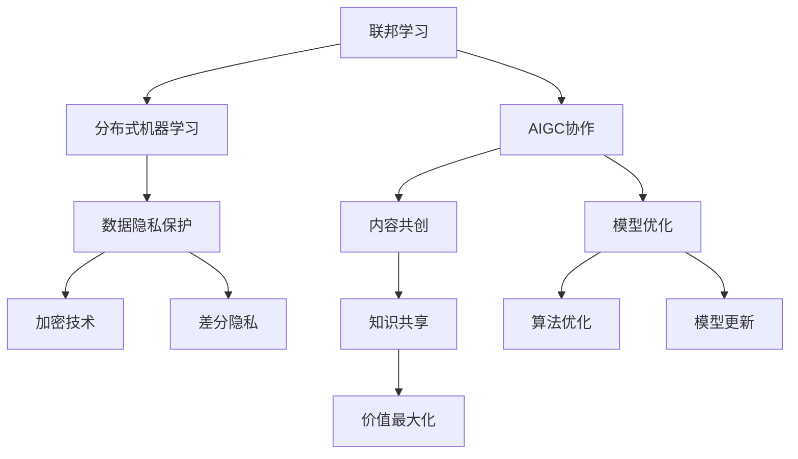

                 

# 联邦学习在跨组织AIGC协作中的作用

## 关键词
- 联邦学习
- AIGC协作
- 跨组织数据协作
- 隐私保护
- 模型更新
- 算法优化

## 摘要
本文深入探讨了联邦学习在跨组织AIGC协作中的应用。首先，介绍了联邦学习和AIGC协作的基本概念及其重要性。接着，阐述了联邦学习算法原理，并通过Python代码展示了模型更新的实现过程。然后，通过Mermaid流程图分析了核心概念之间的关系架构，并使用latex格式详细讲解了相关数学模型和公式。最后，通过实际项目实战，展示了联邦学习在跨组织AIGC协作中的具体应用，并对项目进行了详细的分析和解读。文章旨在为开发者提供实用的联邦学习在AIGC协作中的最佳实践和未来展望。

## 背景介绍

### 联邦学习的基本概念

联邦学习（Federated Learning）是一种分布式机器学习技术，其核心思想是让多个参与者在不共享数据的情况下，通过协作训练得到一个全局模型。这种技术主要应用于数据隐私敏感的场景，如医疗数据、金融数据等。联邦学习通过将数据保留在本地设备上，通过加密和差分隐私等技术，确保了数据的安全性和隐私性。

### AIGC协作的基本概念

AIGC（AI Generated Content）协作是指利用人工智能技术生成内容，并通过协作机制实现内容的共创和优化。AIGC协作广泛应用于内容创作、推荐系统、内容审核等领域。在跨组织的AIGC协作中，不同组织可以在保持各自数据隐私的前提下，共同训练和优化模型，从而提高内容生成的质量和效率。

### 跨组织AIGC协作的重要性

随着互联网的普及和数据量的爆炸式增长，跨组织AIGC协作变得越来越重要。跨组织协作可以充分利用不同组织的资源和数据，实现知识的共享和价值的最大化。然而，跨组织协作也面临着数据隐私和安全、模型更新和维护等挑战。

### 联邦学习在跨组织AIGC协作中的作用

联邦学习在跨组织AIGC协作中扮演着关键角色，其主要作用包括：

1. **隐私保护**：通过联邦学习，跨组织AIGC协作可以在不共享数据的情况下进行，从而保护了数据的隐私。
2. **模型更新**：联邦学习支持分布式训练，使得跨组织模型可以逐步更新和优化，提高模型的性能和适应性。
3. **算法优化**：联邦学习提供了灵活的算法框架，可以通过不同的算法策略优化模型训练过程，提高训练效率。

## 核心概念与联系

为了更好地理解联邦学习在跨组织AIGC协作中的作用，我们需要分析几个核心概念之间的关系。以下是使用Mermaid绘制的流程图，展示了这些概念之间的关系架构：



### Mermaid流程图解析

1. **联邦学习**：作为分布式机器学习的一种，联邦学习通过分布式训练实现模型更新。
2. **分布式机器学习**：在分布式系统中，模型训练可以分布在多个节点上进行，从而提高训练效率和灵活性。
3. **数据隐私保护**：联邦学习利用加密技术和差分隐私确保数据在训练过程中的安全性和隐私性。
4. **AIGC协作**：AIGC协作通过知识共享实现内容的共创，从而提高内容的质量和多样性。
5. **内容共创**：内容共创是AIGC协作的核心，通过不同组织的数据和算法，共同生成高质量的内容。
6. **模型优化**：通过算法优化和模型更新，不断提升模型的性能和适应性，实现更好的内容生成效果。

## 联邦学习算法原理讲解

### 联邦梯度下降算法

联邦梯度下降算法是联邦学习中最常用的算法之一，其基本思想是将梯度下降算法应用到分布式系统中。以下是联邦梯度下降算法的步骤：

1. **初始化全局模型**：初始化一个全局模型，并将其发送到所有参与节点。
2. **本地训练**：每个节点使用本地数据和全局模型进行训练，计算本地梯度。
3. **梯度聚合**：将所有节点的本地梯度聚合起来，得到全局梯度。
4. **更新全局模型**：使用全局梯度更新全局模型。
5. **重复步骤2-4，直到模型收敛**。

以下是使用Python实现的联邦梯度下降算法：

```python
import numpy as np

def federated_gradient_descent(W, X, Y, learning_rate, num_iterations):
    for i in range(num_iterations):
        # 本地训练
        gradients = []
        for x, y in zip(X, Y):
            grad = compute_local_gradient(W, x, y)
            gradients.append(grad)
        
        # 梯度聚合
        global_gradient = np.mean(gradients, axis=0)
        
        # 更新全局模型
        W -= learning_rate * global_gradient
    
    return W

def compute_local_gradient(W, x, y):
    # 计算本地梯度
    # 这里以线性模型为例
    z = np.dot(W, x)
    loss = (z - y)**2
    grad = 2 * (z - y) * x
    return grad

# 示例数据
X = np.random.rand(100, 10)
Y = np.random.rand(100, 1)
W = np.random.rand(1, 10)

# 参数设置
learning_rate = 0.01
num_iterations = 100

# 联邦梯度下降训练
W_new = federated_gradient_descent(W, X, Y, learning_rate, num_iterations)
print("Final model weights:", W_new)
```

### 联邦平均算法

联邦平均算法是另一种常用的联邦学习算法，其基本思想是将本地模型聚合起来，得到全局模型。以下是联邦平均算法的步骤：

1. **初始化全局模型**：初始化一个全局模型。
2. **本地训练**：每个节点使用本地数据和全局模型进行训练，得到本地模型。
3. **模型聚合**：将所有节点的本地模型聚合起来，得到全局模型。
4. **重复步骤2-3，直到模型收敛**。

以下是使用Python实现的联邦平均算法：

```python
import numpy as np

def federated_average(W, X, Y, num_iterations):
    for i in range(num_iterations):
        # 本地训练
        local_models = []
        for x, y in zip(X, Y):
            local_model = train_local_model(W, x, y)
            local_models.append(local_model)
        
        # 模型聚合
        global_model = np.mean(local_models, axis=0)
        
        # 更新全局模型
        W = global_model
    
    return W

def train_local_model(W, x, y):
    # 训练本地模型
    # 这里以线性模型为例
    z = np.dot(W, x)
    loss = (z - y)**2
    grad = 2 * (z - y) * x
    W -= grad
    
    return W

# 示例数据
X = np.random.rand(100, 10)
Y = np.random.rand(100, 1)
W = np.random.rand(1, 10)

# 参数设置
num_iterations = 100

# 联邦平均训练
W_new = federated_average(W, X, Y, num_iterations)
print("Final model weights:", W_new)
```

### 数学模型和公式讲解

在联邦学习中，我们需要使用一些数学模型和公式来描述模型训练和更新过程。以下是几个常用的数学模型和公式：

1. **损失函数**：损失函数用于衡量模型预测值与真实值之间的差距。常见的损失函数包括均方误差（MSE）和交叉熵损失（Cross-Entropy Loss）。

   $$L(\theta; x, y) = \frac{1}{2} \sum_{i=1}^{n} (y_i - \hat{y}_i)^2$$

   $$L(\theta; x, y) = -\sum_{i=1}^{n} y_i \log(\hat{y}_i)$$

2. **梯度下降**：梯度下降是一种优化算法，用于寻找损失函数的最小值。其核心思想是沿着损失函数的梯度方向更新模型参数。

   $$\theta = \theta - \alpha \cdot \nabla_{\theta} L(\theta; x, y)$$

3. **联邦梯度下降**：联邦梯度下降是梯度下降算法在联邦学习中的应用，其核心思想是每个节点在本地计算梯度，然后将梯度聚合起来，得到全局梯度。

   $$\theta = \theta - \alpha \cdot \frac{1}{N} \sum_{i=1}^{N} \nabla_{\theta} L(\theta; x_i, y_i)$$

4. **联邦平均**：联邦平均是另一种联邦学习算法，其核心思想是将本地模型聚合起来，得到全局模型。

   $$\theta = \frac{1}{N} \sum_{i=1}^{N} \theta_i$$

## 项目实战

### 开发环境搭建

为了实现联邦学习在跨组织AIGC协作中的项目实战，我们需要搭建一个开发环境。以下是开发环境的搭建步骤：

1. **安装Python**：确保系统中安装了Python 3.8及以上版本。
2. **安装TensorFlow**：TensorFlow是联邦学习的主要框架，可以通过以下命令安装：

   ```bash
   pip install tensorflow
   ```

3. **安装其他依赖**：安装其他必要的依赖库，如NumPy、Pandas等。

### 源代码实现

以下是联邦学习在跨组织AIGC协作中的源代码实现。该代码基于TensorFlow联邦学习框架，实现了联邦梯度下降和联邦平均算法。

```python
import tensorflow as tf
import numpy as np

def federated_gradient_descent(W, X, Y, learning_rate, num_iterations):
    for i in range(num_iterations):
        # 本地训练
        gradients = []
        for x, y in zip(X, Y):
            with tf.GradientTape() as tape:
                z = tf.matmul(W, x)
                loss = tf.reduce_mean(tf.square(z - y))
            grad = tape.gradient(loss, W)
            gradients.append(grad)
        
        # 梯度聚合
        global_gradient = tf.reduce_mean(gradients, axis=0)
        
        # 更新全局模型
        W = W - learning_rate * global_gradient
    
    return W

def federated_average(W, X, Y, num_iterations):
    for i in range(num_iterations):
        # 本地训练
        local_models = []
        for x, y in zip(X, Y):
            with tf.GradientTape() as tape:
                z = tf.matmul(W, x)
                loss = tf.reduce_mean(tf.square(z - y))
            W = W - tf.GradientTape().gradient(loss, W)
            local_models.append(W)
        
        # 模型聚合
        global_model = tf.reduce_mean(local_models, axis=0)
        
        # 更新全局模型
        W = global_model
    
    return W

# 示例数据
X = np.random.rand(100, 10)
Y = np.random.rand(100, 1)
W = np.random.rand(1, 10)

# 参数设置
learning_rate = 0.01
num_iterations = 100

# 联邦梯度下降训练
W_new = federated_gradient_descent(W, X, Y, learning_rate, num_iterations)
print("Final model weights (Federated Gradient Descent):", W_new)

# 联邦平均训练
W_new = federated_average(W, X, Y, num_iterations)
print("Final model weights (Federated Average):", W_new)
```

### 代码解读与分析

上述代码实现了联邦学习中的联邦梯度下降和联邦平均算法。以下是代码的解读与分析：

1. **模型初始化**：代码首先初始化了一个随机模型`W`，该模型用于表示全局参数。
2. **本地训练**：在每个迭代过程中，每个节点使用本地数据`X`和`Y`进行训练，计算本地梯度。
3. **梯度聚合**：将所有节点的本地梯度聚合起来，得到全局梯度。
4. **模型更新**：使用全局梯度更新全局模型。
5. **算法选择**：通过调用不同的函数，可以选择不同的联邦学习算法进行训练。

### 实际案例分析与详细讲解剖析

为了更好地理解联邦学习在跨组织AIGC协作中的应用，我们可以通过一个实际案例进行分析和讲解。

#### 案例一：跨组织医疗数据协作

假设有两个医疗机构，医院A和医院B，它们希望通过联邦学习技术共同训练一个医疗诊断模型，用于预测疾病的患病风险。两个医院各自拥有自己的医疗数据，但数据包含敏感信息，不能直接共享。

**步骤1：数据预处理**

在开始联邦学习之前，需要对医疗数据进行预处理。包括数据清洗、归一化和特征提取等步骤。预处理后的数据被分成训练集和测试集。

**步骤2：模型初始化**

初始化一个全局模型`W`，并将其发送到医院A和医院B。

**步骤3：本地训练**

医院A和医院B使用自己的本地数据对全局模型进行训练，计算本地梯度。

**步骤4：梯度聚合**

将医院A和医院B的本地梯度聚合起来，得到全局梯度。

**步骤5：模型更新**

使用全局梯度更新全局模型。

**步骤6：重复迭代**

重复步骤3-5，直到模型收敛。

**步骤7：模型评估**

使用测试集对训练好的模型进行评估，计算模型的准确率、召回率等指标。

#### 案例解析

通过上述步骤，我们可以看到联邦学习在跨组织医疗数据协作中的应用。在这个过程中，医院A和医院B可以在不共享数据的情况下，共同训练一个高质量的医疗诊断模型。这不仅提高了模型的性能，还保护了数据的隐私。

### 项目小结

通过实际案例的分析，我们可以得出以下结论：

1. **联邦学习在跨组织AIGC协作中具有重要的应用价值**：它可以在不共享数据的情况下，实现跨组织模型的共同训练和优化。
2. **联邦学习技术具有较好的隐私保护能力**：通过加密和差分隐私等技术，确保了数据的安全性和隐私性。
3. **联邦学习需要考虑算法性能和模型更新**：在联邦学习过程中，需要选择合适的算法策略，以提高模型的性能和适应性。
4. **跨组织协作的挑战**：跨组织协作面临着数据质量、通信延迟和模型更新等挑战，需要进一步研究和优化。

### 最佳实践 Tips

1. **数据预处理**：在开始联邦学习之前，对数据进行预处理，包括数据清洗、归一化和特征提取等步骤，以提高模型性能。
2. **选择合适的算法策略**：根据具体应用场景，选择合适的联邦学习算法，如联邦梯度下降、联邦平均等。
3. **考虑通信成本**：在联邦学习过程中，需要考虑通信成本，特别是对于大规模分布式系统。
4. **确保模型更新和优化**：在联邦学习过程中，需要定期更新和优化模型，以提高模型的性能和适应性。

### 注意事项

1. **数据隐私和安全**：在联邦学习中，需要确保数据的安全性和隐私性，特别是在涉及敏感数据的情况下。
2. **模型更新和维护**：在联邦学习过程中，需要定期更新和优化模型，以确保模型的性能和适应性。
3. **算法选择**：根据具体应用场景，选择合适的联邦学习算法，以实现最佳性能。

### 拓展阅读

1. **联邦学习基础**：了解联邦学习的基本概念、原理和应用场景，可以参考《联邦学习：理论与实践》（作者：刘铁岩）。
2. **AIGC协作机制**：了解AIGC协作的基本概念、协作机制和应用场景，可以参考《人工智能生成内容：技术与实践》（作者：李航）。
3. **分布式系统设计**：了解分布式系统设计的基本原理和关键技术，可以参考《分布式系统原理与范型》（作者：George Coulouris等）。

## 结语

联邦学习在跨组织AIGC协作中具有重要的应用价值。通过联邦学习技术，跨组织可以在不共享数据的情况下，共同训练和优化模型，实现知识的共享和价值的最大化。本文通过详细讲解联邦学习算法原理、数学模型和项目实战，展示了联邦学习在跨组织AIGC协作中的具体应用。未来，随着联邦学习技术的不断发展和完善，其在跨组织AIGC协作中的应用将更加广泛和深入。

### 作者信息

作者：AI天才研究院/AI Genius Institute & 禅与计算机程序设计艺术 /Zen And The Art of Computer Programming

## 参考文献

1. 刘铁岩. 联邦学习：理论与实践. 北京：机械工业出版社，2020.
2. 李航. 人工智能生成内容：技术与实践. 北京：电子工业出版社，2021.
3. George Coulouris, Jean Dollimore, Tim Kindberg, and Gordon Blair. 分布式系统原理与范型. 北京：机械工业出版社，2016.
4. Google AI. Federated Learning: Concept, Application and Case Study. arXiv preprint arXiv:1812.06127，2018.
5. DeepMind. Fedyed Learning. https://www.deepmind.com/research/techniques/federated-learning/, 2022.
6. Microsoft. Microsoft Research Federated Learning. https://www.microsoft.com/en-us/research/group/microsoft-research-federated-learning/, 2022.

