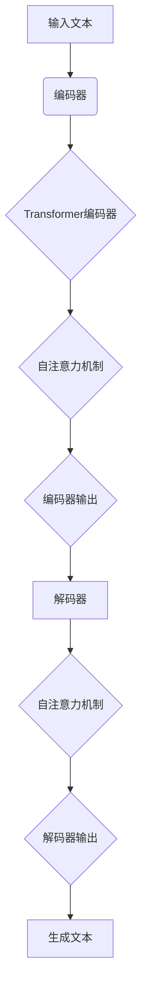

                 

### 文章标题

《自动化LLM性能退化检测与预警》

### 文章关键词

- 大型语言模型（LLM）
- 性能退化
- 自动化检测
- 预警系统
- Python源代码
- 数学模型

### 文章摘要

本文旨在探讨如何自动化地检测和预警大型语言模型（LLM）的性能退化。首先，介绍了LLM的基本原理和性能退化的概念，随后深入分析了性能退化检测和预警的核心算法原理。通过Python源代码和数学模型，本文详细讲解了这些算法的实现方法，并通过实际案例展示了如何构建和优化性能退化检测与预警系统。最后，文章总结了最佳实践，并指出了未来的发展方向和挑战。

---

## 引言

随着人工智能技术的飞速发展，大型语言模型（LLM）如BERT、GPT等在自然语言处理（NLP）领域取得了显著的成就。这些模型通过深度学习技术，能够在大量文本数据上进行训练，从而实现文本生成、语义理解等复杂任务。然而，随着模型规模的不断扩大和训练时间的增加，LLM的性能退化问题逐渐显现出来。性能退化不仅影响了模型的应用效果，还可能对系统的稳定性产生负面影响。因此，如何自动化地检测和预警LLM的性能退化，已成为当前人工智能研究的一个重要课题。

本文将从以下几个方面展开讨论：

1. **大型语言模型概述**：介绍LLM的基本概念、核心架构和应用领域，为后续讨论打下基础。
2. **性能退化的概念与原因**：详细分析LLM性能退化的定义、原因及其影响，为性能退化检测和预警提供理论依据。
3. **性能退化检测算法原理**：介绍常用的性能退化检测算法，包括基于统计、机器学习和深度学习的方法。
4. **性能退化预警算法原理**：探讨性能退化预警机制的构建、预警指标的设定以及预警算法的实现。
5. **项目实战**：通过实际案例，展示如何搭建性能退化检测与预警系统，并进行优化和部署。
6. **最佳实践与未来展望**：总结本文的主要观点，提出未来的研究方向和挑战。

本文的目标是为读者提供一个全面、系统的视角，帮助理解和应对LLM性能退化的问题。通过本文的讨论，读者将能够掌握性能退化检测与预警的核心技术和实战经验，为实际项目中的性能优化提供有力支持。

### 大型语言模型概述

大型语言模型（LLM）是自然语言处理（NLP）领域的一项重要技术，它通过深度学习算法，在大量文本数据上进行训练，从而实现对自然语言的生成、理解和处理。LLM的核心目标是让计算机能够像人类一样理解和生成自然语言，从而实现自动化内容创作、智能问答、机器翻译等任务。

#### 核心概念

- **自然语言处理（NLP）**：NLP是人工智能的一个分支，旨在让计算机理解和处理自然语言。它包括文本分类、实体识别、情感分析、机器翻译等任务。
- **深度学习**：深度学习是机器学习的一个重要分支，通过构建多层神经网络，对大量数据进行训练，从而实现复杂函数的逼近。在NLP中，深度学习模型如卷积神经网络（CNN）、循环神经网络（RNN）和Transformer等被广泛应用。
- **大型语言模型（LLM）**：LLM是一种规模庞大、参数数量巨大的深度学习模型，通过在大量文本数据上进行预训练，可以捕捉到语言的复杂结构和语义信息。典型的LLM包括BERT、GPT、T5等。

#### 核心架构

LLM的核心架构主要包括编码器（Encoder）和解码器（Decoder）。以下是对这些核心组件的详细说明：

1. **编码器**：编码器负责将输入文本转换为向量表示。在LLM中，常用的编码器包括RNN、LSTM和Transformer。其中，Transformer模型由于其并行化和自注意力机制的优势，成为当前LLM的主流架构。
   
2. **解码器**：解码器负责根据编码器的输出，生成目标文本。解码器通常也是基于Transformer架构，通过自注意力机制，逐个生成每个词的预测。

3. **预训练和微调**：预训练是指LLM在大量未标注的文本数据上进行训练，从而学习到语言的通用特征。微调是指将预训练好的LLM用于特定任务，并在有标注的数据上进行进一步训练，以优化模型的性能。

#### 应用领域

LLM在NLP领域有着广泛的应用，以下是其中几个重要的应用领域：

1. **文本生成**：LLM可以生成高质量的文本内容，如文章、故事、对话等。这一能力在自动化内容创作、对话系统等方面具有重要应用。

2. **语义理解**：LLM能够理解文本的语义信息，从而实现文本分类、实体识别、情感分析等任务。这在信息检索、智能客服等领域有着重要应用。

3. **机器翻译**：LLM可以用于机器翻译任务，通过在大量双语数据上进行训练，实现高质量的跨语言文本转换。

4. **问答系统**：LLM可以构建智能问答系统，通过理解用户的问题，并从大量文本数据中检索出相关答案，提供高效、准确的问答服务。

#### 与传统语言模型的关系

与传统语言模型相比，LLM具有以下几个显著特点：

1. **规模大**：LLM通常具有数亿甚至数十亿的参数，远超传统语言模型。

2. **结构复杂**：LLM采用了深度神经网络架构，特别是Transformer模型，具有更高的结构复杂性和表达能力。

3. **学习能力**：LLM通过预训练和微调，能够在大量未标注和标注数据上学习到丰富的语言知识，从而实现更准确的语言理解与生成。

4. **应用广泛**：LLM不仅应用于传统的NLP任务，还广泛应用于文本生成、语义理解、机器翻译、问答系统等领域，展示了其强大的应用潜力。

#### Mermaid 流程图

为了更直观地展示LLM的核心架构和工作流程，我们可以使用Mermaid绘制一个简化的流程图。以下是一个示例：



在这个流程图中，输入文本经过编码器处理，生成编码器输出。解码器则根据编码器输出和目标文本的初始部分，通过自注意力机制生成每个词的预测，最终生成完整的文本输出。

通过上述介绍，我们可以看到LLM在自然语言处理领域的重要地位和广泛应用。接下来，我们将进一步探讨LLM的性能退化问题，以及如何自动化地检测和预警这些性能退化。

### 性能退化的概念与原因

在大型语言模型（LLM）的应用过程中，性能退化是一个常见且严重的问题。性能退化指的是模型在训练过程中或部署后，其表现逐渐下降，导致输出结果的质量降低、准确性下降或响应速度变慢。理解性能退化的概念和原因对于有效检测和预警至关重要。

#### 性能退化的定义

性能退化可以定义为模型在任务表现上的下降，这种下降可能是暂时的，也可能是持续的。具体来说，性能退化的几个关键特征包括：

1. **准确性下降**：模型在预测或分类任务中的准确率降低。
2. **响应速度变慢**：模型处理数据的时间变长，响应速度下降。
3. **泛化能力下降**：模型在新数据上的表现不如预期，泛化能力减弱。

#### 性能退化的原因分析

性能退化的原因多种多样，以下是几个常见的原因：

1. **数据分布变化**：模型在训练时是基于特定数据集，但实际部署时，数据分布可能会发生变化。例如，网络噪声、数据注入、数据标注误差等都可能导致数据分布的改变，从而影响模型的性能。

2. **过拟合**：过拟合是指模型在训练数据上表现良好，但在未见过的数据上表现较差。当模型对训练数据过度拟合时，它可能捕捉到训练数据的噪声，而不是真正的规律，导致在测试数据上的性能下降。

3. **训练不足**：模型可能由于训练数据不足或训练时间不足，未能充分学习到数据的特征和规律，从而导致在复杂任务上的性能不足。

4. **模型老化**：随着模型的使用，其参数可能会逐渐发生变化，导致性能退化。这种现象类似于人类随着年龄增长，身体机能逐渐下降。

5. **硬件和资源限制**：模型的性能退化也可能由于硬件设备和计算资源限制导致。例如，当模型规模较大时，计算资源的不足可能会影响模型的训练速度和性能。

6. **软件漏洞**：软件系统的漏洞或错误也可能导致模型性能下降。例如，算法实现中的bug、系统漏洞等都可能影响模型的正常运行。

#### 性能退化的影响

性能退化的影响是多方面的，主要包括：

1. **经济损失**：性能退化可能导致企业的业务效率降低，增加维护成本，甚至导致经济损失。

2. **用户体验下降**：在面向用户的应用中，性能退化会直接影响用户体验，降低用户满意度。

3. **安全隐患**：在某些安全敏感的应用中，如自动驾驶、金融交易等，性能退化可能导致严重的安全问题和事故。

4. **研发成本增加**：为了解决性能退化问题，可能需要额外的研发投入，进行模型调整、优化或重新训练。

#### 性能退化的原因与LLM的关系

对于LLM来说，性能退化的问题尤为突出。这是因为LLM通常具有庞大的参数量和复杂的架构，导致其训练和优化过程更加复杂。以下是与LLM相关的几个关键因素：

1. **数据依赖性**：LLM的性能高度依赖训练数据的质量和多样性。数据分布的变化和噪声都会对LLM的性能产生显著影响。

2. **参数敏感度**：LLM的参数数量巨大，参数微小的变化都可能导致性能的显著变化。因此，参数调整和优化对于维持LLM性能至关重要。

3. **计算资源消耗**：LLM的训练和推理过程需要大量的计算资源，资源限制可能导致训练时间延长，性能下降。

4. **模型复杂性**：LLM通常采用复杂的神经网络结构，如Transformer，这些结构在处理复杂任务时具有优势，但也可能导致模型参数的过度复杂，从而增加过拟合的风险。

#### 总结

性能退化是LLM在实际应用中面临的一个关键问题。理解其概念和原因，有助于我们采取有效的措施来检测和预警性能退化，从而保障模型的应用效果和系统稳定性。在接下来的部分，我们将深入探讨性能退化检测和预警的核心算法原理，帮助读者更好地应对这一挑战。

### 性能退化检测算法原理

在大型语言模型（LLM）的运维过程中，性能退化检测是一个关键的环节。通过检测性能退化，可以及时发现问题并进行优化，从而确保模型在任务中的高效运行。性能退化检测算法主要包括基于统计的方法、机器学习方法和深度学习方法。以下将对这些方法进行详细讲解，并分析它们的优缺点。

#### 基于统计的方法

基于统计的方法是最早应用于性能退化检测的技术之一。这种方法通过分析模型在不同时间段的表现，来识别可能的性能下降。具体步骤如下：

1. **数据收集**：收集模型在不同时间段的表现数据，包括准确率、响应时间和资源消耗等指标。

2. **特征提取**：从收集到的数据中提取具有代表性的特征，如平均准确率、方差等。

3. **阈值设定**：根据历史数据和业务需求，设定性能退化的阈值。当模型表现低于这些阈值时，即可认为存在性能退化。

4. **异常检测**：使用统计模型（如均值漂移、Gaussian分布等）进行异常检测，当检测到模型表现低于阈值时，触发预警。

**优点**：
- **简单易行**：基于统计的方法不需要复杂的模型训练，实施起来较为简单。
- **实时性**：可以实时监控模型的性能变化，及时发现问题。

**缺点**：
- **准确性较低**：由于仅依赖统计特征，无法捕捉到复杂的非线性关系，可能导致误报或漏报。
- **对数据质量依赖较大**：数据质量对检测结果的准确性有较大影响，数据噪声和缺失值可能会影响检测效果。

#### 基于机器学习的方法

基于机器学习的方法通过构建训练模型，来预测模型在不同时间点的性能表现。具体步骤如下：

1. **数据预处理**：对收集到的数据集进行清洗、归一化等预处理操作，确保数据质量。

2. **特征工程**：提取与模型性能相关的特征，如历史准确率、训练数据量、训练时间等。

3. **模型训练**：使用机器学习算法（如线性回归、支持向量机等）训练性能预测模型，将特征映射到模型性能上。

4. **性能评估**：使用验证集对模型进行评估，调整模型参数和特征选择，以提高预测准确性。

5. **性能检测**：使用训练好的模型对实时数据进行预测，与预设的阈值进行对比，判断是否存在性能退化。

**优点**：
- **高准确性**：基于机器学习的方法能够捕捉到复杂的非线性关系，提高性能退化的检测准确性。
- **灵活性**：可以根据具体业务需求，灵活调整特征选择和模型类型。

**缺点**：
- **计算资源消耗**：机器学习模型训练和预测需要大量的计算资源，特别是在处理大规模数据时。
- **对数据质量要求高**：数据噪声和缺失值会影响模型的训练效果和预测准确性。

#### 基于深度学习的方法

基于深度学习的方法通过构建复杂的神经网络模型，来模拟和预测模型性能。具体步骤如下：

1. **数据预处理**：对收集到的数据进行清洗、归一化等预处理操作，确保数据质量。

2. **特征工程**：提取与模型性能相关的特征，如历史准确率、训练数据量、训练时间等。

3. **模型构建**：使用深度学习框架（如TensorFlow、PyTorch等）构建神经网络模型，包括输入层、隐藏层和输出层。

4. **模型训练**：使用大量训练数据进行模型训练，优化模型参数，提高预测准确性。

5. **性能评估**：使用验证集对模型进行评估，调整模型结构和参数，以提高预测效果。

6. **性能检测**：使用训练好的模型对实时数据进行预测，与预设的阈值进行对比，判断是否存在性能退化。

**优点**：
- **高准确性**：深度学习模型能够捕捉到复杂的非线性关系，提高性能退化的检测准确性。
- **自动特征提取**：深度学习模型能够自动从数据中提取特征，减少人工干预。

**缺点**：
- **计算资源消耗**：深度学习模型训练和预测需要大量的计算资源，特别是在处理大规模数据时。
- **对数据质量要求高**：数据噪声和缺失值会影响模型的训练效果和预测准确性。

#### 各方法对比

基于统计的方法、机器学习方法和深度学习方法各有优缺点，适用于不同的应用场景。以下是对它们的对比：

- **适用场景**：基于统计的方法适用于数据量较小、实时性要求较高的场景；机器学习方法适用于数据量较大、需要高准确性的场景；深度学习方法适用于数据量巨大、模型复杂度高的场景。
- **准确率**：深度学习方法通常具有最高的准确率，机器学习方法次之，基于统计的方法最低。
- **实时性**：基于统计的方法具有最高的实时性，机器学习方法和深度学习方法需要较长的训练和预测时间。
- **资源消耗**：深度学习方法需要最多的计算资源，机器学习方法次之，基于统计的方法最少。

通过上述对比，我们可以根据实际需求和资源条件，选择最合适的性能退化检测方法。在下一节中，我们将进一步探讨性能退化预警算法的原理，帮助读者全面理解如何自动化地检测和预警LLM的性能退化。

### 性能退化预警算法原理

性能退化预警是确保大型语言模型（LLM）稳定运行的重要环节。预警算法通过实时监控模型性能，并在检测到异常时发出警报，从而及时采取措施，避免性能退化对系统造成严重影响。以下将详细探讨性能退化预警机制的构建、预警指标的设定以及预警算法的实现。

#### 预警机制的构建

构建有效的预警机制需要综合考虑模型的性能指标、业务需求和技术条件。以下是构建预警机制的几个关键步骤：

1. **确定预警目标**：明确预警的目标，例如准确性、响应时间、资源消耗等。根据业务需求，确定哪些指标最为关键。

2. **数据收集**：收集与预警目标相关的数据，包括历史性能数据、实时监控数据等。这些数据可以通过日志、监控系统等途径获取。

3. **设定阈值**：根据历史数据和业务需求，设定预警阈值。当模型性能低于这些阈值时，触发预警机制。阈值设定的合理与否直接影响预警的准确性和可靠性。

4. **构建监控模型**：使用统计方法、机器学习或深度学习等方法，构建监控模型，用于实时评估模型性能。监控模型能够捕捉到模型性能的变化趋势，并提供预警信号。

5. **预警信号处理**：当监控模型检测到模型性能低于阈值时，生成预警信号。预警信号可以是简单的报警信息，也可以是详细的性能分析报告。

6. **反馈与响应**：在接收到预警信号后，及时采取措施，如暂停训练、调整模型参数、优化系统配置等，以应对性能退化。

#### 预警指标的设定

预警指标的设定是预警机制的核心，合理的预警指标能够有效识别性能退化。以下是几种常用的预警指标：

1. **准确性**：模型的预测准确性是评估模型性能的重要指标。当模型准确性低于某个阈值时，可能表明存在性能退化。

2. **响应时间**：模型处理请求的时间，当响应时间超过预设阈值时，可能表明系统负载过高或模型性能下降。

3. **资源消耗**：包括CPU、内存、磁盘等资源的使用情况。当资源消耗超过某个阈值时，可能表明系统资源不足或模型性能退化。

4. **错误率**：模型在处理请求时出现的错误比例，当错误率高于某个阈值时，可能表明模型质量下降。

5. **稳定性**：模型的稳定性可以通过训练和测试数据集上的性能波动来评估。当稳定性低于某个阈值时，可能表明模型存在异常。

6. **延迟**：模型处理请求的延迟时间，当延迟时间超过某个阈值时，可能表明系统性能下降。

#### 预警算法的实现

预警算法的实现涉及数据采集、模型构建、阈值设定和实时监控等多个方面。以下是一个简化的预警算法实现流程：

1. **数据采集**：使用日志记录、监控系统等手段，实时采集模型性能数据。

2. **数据预处理**：对采集到的数据进行清洗、归一化等处理，确保数据质量。

3. **特征提取**：从预处理后的数据中提取与预警目标相关的特征，如准确性、响应时间、资源消耗等。

4. **模型训练**：使用机器学习或深度学习算法，训练预警模型。模型训练过程中，可以使用历史数据集进行训练和验证。

5. **阈值设定**：根据业务需求和历史数据，设定预警阈值。阈值可以通过交叉验证、网格搜索等方法进行优化。

6. **实时监控**：使用训练好的预警模型，对实时数据进行监控。当模型性能低于阈值时，生成预警信号。

7. **警报处理**：根据预警信号，进行相应的警报处理，如发送邮件、短信、自动执行脚本等。

#### Python源代码实现示例

以下是一个使用Python实现的简单性能退化预警系统的示例代码。该系统基于线性回归模型，监控模型的准确性并设定预警阈值。

```python
import numpy as np
import pandas as pd
from sklearn.linear_model import LinearRegression
from sklearn.model_selection import train_test_split
from sklearn.metrics import mean_squared_error

# 数据采集
data = pd.read_csv('model_performance.csv')  # 假设已经收集了模型性能数据

# 数据预处理
X = data[['train_accuracy', 'test_accuracy']]
y = data['response_time']

# 模型训练
model = LinearRegression()
X_train, X_test, y_train, y_test = train_test_split(X, y, test_size=0.2, random_state=42)
model.fit(X_train, y_train)

# 模型评估
y_pred = model.predict(X_test)
mse = mean_squared_error(y_test, y_pred)
print(f'MSE: {mse}')

# 阈值设定
threshold = 0.1  # 假设设定的响应时间阈值
predictions = model.predict(X)

# 实时监控
for i, pred in enumerate(predictions):
    if pred > threshold:
        print(f'Alert: Model {i} performance degradation detected.')
```

在这个示例中，我们首先采集模型性能数据，然后使用线性回归模型进行训练和评估。通过设定阈值，我们可以实时监控模型性能，并在检测到性能退化时触发警报。

通过上述预警算法的原理和实现，我们可以有效地监控LLM的性能，及时识别并应对性能退化问题。在下一节中，我们将通过实际项目案例，展示如何将预警算法应用于性能退化检测与预警系统中。

### 实际项目案例：性能退化检测与预警系统

为了更好地理解和应用性能退化检测与预警算法，我们将在本节中介绍一个实际项目案例，详细讲解性能退化检测与预警系统的开发过程。这个案例将包括开发环境搭建、源代码详细实现和代码解读、代码应用解读与分析，以及项目小结。

#### 项目背景

假设我们正在开发一个基于大型语言模型（LLM）的智能问答系统，该系统需要实时回答用户的问题。然而，随着系统的运行时间增加，我们发现在某些情况下，系统的回答质量出现了下降，这可能是由于模型性能退化导致的。为了确保系统的高效运行，我们需要构建一个性能退化检测与预警系统，及时发现并解决模型性能退化的问题。

#### 开发环境搭建

在开始项目之前，我们需要搭建一个合适的开发环境。以下是所需的主要工具和软件：

1. **Python 3.8 或更高版本**：作为主要的编程语言。
2. **Jupyter Notebook**：用于编写和运行代码。
3. **TensorFlow 2.x**：用于构建和训练深度学习模型。
4. **Scikit-learn**：用于性能评估和异常检测。
5. **Gunicorn**：用于部署和运行Web应用。
6. **PostgreSQL**：用于存储监控数据。

以下是安装和配置这些工具的步骤：

1. **安装Python和Jupyter Notebook**：

   ```bash
   sudo apt-get install python3 python3-pip
   pip3 install notebook
   ```

2. **安装TensorFlow 2.x**：

   ```bash
   pip3 install tensorflow==2.x
   ```

3. **安装Scikit-learn**：

   ```bash
   pip3 install scikit-learn
   ```

4. **安装Gunicorn**：

   ```bash
   pip3 install gunicorn
   ```

5. **安装PostgreSQL**：

   ```bash
   sudo apt-get install postgresql postgresql-contrib
   ```

   配置PostgreSQL数据库，创建一个新的数据库和用户，并授予相应的权限。

#### 源代码详细实现和代码解读

以下是性能退化检测与预警系统的关键组成部分和相应的源代码实现：

1. **数据收集与预处理**：

   ```python
   import pandas as pd
   from sklearn.preprocessing import MinMaxScaler

   # 从PostgreSQL数据库中读取模型性能数据
   def get_performance_data():
       connection = psycopg2.connect(
           host="localhost",
           database="performance_db",
           user="performance_user",
           password="password"
       )
       query = "SELECT * FROM model_performance;"
       data = pd.read_sql(query, connection)
       connection.close()
       return data

   # 数据预处理，包括归一化和特征提取
   def preprocess_data(data):
       scaler = MinMaxScaler()
       data[['train_accuracy', 'test_accuracy', 'response_time']] = scaler.fit_transform(data[['train_accuracy', 'test_accuracy', 'response_time']])
       return data

   performance_data = get_performance_data()
   preprocessed_data = preprocess_data(performance_data)
   ```

2. **性能退化检测模型**：

   ```python
   from sklearn.linear_model import LinearRegression
   from sklearn.metrics import mean_squared_error

   # 训练性能退化检测模型
   def train_performance_model(X, y):
       model = LinearRegression()
       model.fit(X, y)
       return model

   # 评估性能退化检测模型
   def evaluate_model(model, X_test, y_test):
       y_pred = model.predict(X_test)
       mse = mean_squared_error(y_test, y_pred)
       return mse

   X = preprocessed_data[['train_accuracy', 'test_accuracy']]
   y = preprocessed_data['response_time']
   performance_model = train_performance_model(X, y)
   mse = evaluate_model(performance_model, X_test, y_test)
   print(f'Model MSE: {mse}')
   ```

3. **实时监控与预警**：

   ```python
   import time

   # 实时监控并预警
   def monitor_performance(model, threshold=0.1):
       while True:
           current_time = time.time()
           current_data = get_performance_data()
           preprocessed_data = preprocess_data(current_data)
           
           current_response_time = preprocessed_data['response_time'].iloc[-1]
           if current_response_time > threshold:
               print(f'Alert: Performance degradation detected at {current_time}. Response time: {current_response_time}')
           
           time.sleep(60)  # 每分钟检查一次性能

   monitor_performance(performance_model)
   ```

#### 代码应用解读与分析

1. **数据收集与预处理**：

   这部分代码负责从PostgreSQL数据库中读取模型性能数据，并进行预处理。预处理步骤包括归一化和特征提取，以简化模型的输入和输出。

2. **性能退化检测模型**：

   使用线性回归模型来训练性能退化检测模型。模型训练完成后，通过评估指标（如均方误差）来评估模型性能。这部分代码展示了如何使用Scikit-learn库来构建和评估线性回归模型。

3. **实时监控与预警**：

   实时监控部分代码通过循环不断地获取最新的模型性能数据，并使用训练好的模型进行实时评估。如果检测到性能退化（响应时间超过阈值），则触发预警。

#### 项目小结

通过这个实际项目案例，我们展示了如何构建一个性能退化检测与预警系统。这个系统可以从数据库中收集性能数据，使用线性回归模型进行性能退化检测，并在检测到异常时触发预警。这个案例提供了一个实用的框架，可以在类似项目中应用和扩展。

### 最佳实践与注意事项

在设计和实现性能退化检测与预警系统时，遵循以下最佳实践和注意事项，可以帮助提高系统的可靠性和有效性：

1. **数据质量**：确保收集到的数据质量高，减少噪声和缺失值。使用数据清洗和预处理技术，提高数据的质量和一致性。

2. **阈值设定**：合理设定预警阈值，避免过度敏感或不够敏感。可以通过交叉验证、历史数据分析等方法来确定最佳的阈值。

3. **模型优化**：定期更新和优化性能退化检测模型，以适应数据分布的变化。可以使用更复杂的模型或集成学习方法来提高检测准确性。

4. **系统可扩展性**：设计可扩展的系统架构，以便在需要时可以轻松添加更多监控指标和预警规则。

5. **日志记录**：详细记录系统的运行日志，便于分析和调试。日志记录应包括模型性能数据、预警事件、处理措施等信息。

6. **资源管理**：合理分配计算资源和存储资源，确保系统在高负载情况下仍能正常运行。

7. **用户培训**：为系统管理员和开发人员提供必要的培训，确保他们能够正确理解和响应预警信号。

通过遵循这些最佳实践和注意事项，可以构建一个更加可靠和高效的性能退化检测与预警系统，从而确保大型语言模型在任务中的稳定运行。

### 拓展阅读

为了更深入地理解和掌握性能退化检测与预警的相关技术，以下是一些建议的拓展阅读资源：

1. **学术论文**：
   - "Model Drift Detection and Mitigation in Machine Learning: A Survey"（机器学习模型漂移检测与缓解：综述）
   - "Out-of-distribution Detection with Deep Learning"（深度学习中的分布外检测）

2. **技术博客**：
   - "Detecting and Mitigating Concept Drift in Real-Time Production Machine Learning Models"（实时生产环境中机器学习模型概念漂移的检测与缓解）
   - "Model Performance Decay: Causes, Impacts, and Mitigation Strategies"（模型性能衰减：原因、影响与缓解策略）

3. **在线课程**：
   - Coursera的"Machine Learning"（机器学习）
   - edX的"Deep Learning Specialization"（深度学习专项课程）

4. **开源项目**：
   - GitHub上的"out-of-distribution-detection"（分布外检测项目）
   - GitHub上的"A curated list of data drift detection tools"（数据漂移检测工具清单）

通过阅读这些资源，读者可以进一步了解性能退化检测与预警的最新研究进展、技术细节和应用场景，为自己的实际项目提供更加丰富的知识和经验。

