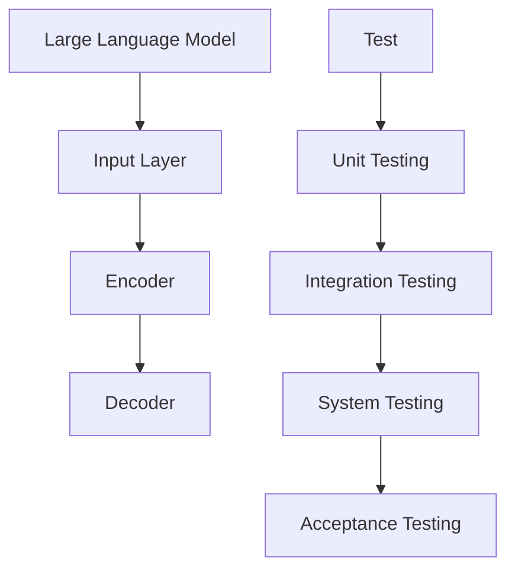

                 

### Introduction and Overview

#### Title: 自动化LLM测试场景重现与复现

#### Keywords: 自动化测试，大型语言模型（LLM），测试工具，测试流程，测试数据管理

#### Summary:
本文旨在深入探讨自动化测试在大型语言模型（LLM）开发中的应用，详细介绍自动化测试场景的重现与复现方法。我们将首先介绍自动化测试的基本概念和重要性，然后逐步阐述自动化测试的工具和技术，测试用例的设计和管理，测试数据的准备和管理，测试环境的搭建与维护，以及最终的测试实施和结果分析。通过这篇文章，读者将了解到自动化测试在提高LLM开发效率和保证质量方面的关键作用。

### Fundamental Concepts

在深入探讨自动化LLM测试之前，有必要首先理解一些核心概念，包括大型语言模型（LLM）和测试的基本概念。

#### Large Language Models (LLM)

大型语言模型（LLM）是深度学习领域的一种重要技术，特别是近年来随着计算能力和数据量的增长，LLM在自然语言处理（NLP）任务中取得了显著的成果。LLM的核心思想是通过大规模的训练数据集来学习语言的统计规律和结构，从而能够生成、理解和处理自然语言文本。

LLM的基本架构通常包括以下几个部分：

1. **输入层**：接收自然语言文本作为输入。
2. **编码器（Encoder）**：将输入文本转换为一个固定长度的向量表示。
3. **解码器（Decoder）**：根据编码器生成的向量生成相应的输出文本。

LLM的训练过程通常涉及以下几个关键步骤：

1. **数据预处理**：包括文本清洗、分词、去停用词等，将文本转换为模型可接受的格式。
2. **模型初始化**：初始化模型的权重和参数。
3. **训练**：通过反向传播算法优化模型的参数，使得模型能够更好地预测输入文本的下一个单词或句子。
4. **评估**：使用验证集和测试集评估模型的表现。

#### Testing

测试是确保软件质量和性能的关键环节，特别是对于复杂且庞大的LLM系统。测试可以分为多个层次，包括单元测试、集成测试、系统测试和验收测试等。

1. **Unit Testing**：针对LLM的各个组件或模块进行测试，验证它们是否按照预期工作。
2. **Integration Testing**：确保LLM的不同组件能够正确集成并协同工作。
3. **System Testing**：在集成后对整个LLM系统进行测试，验证系统是否满足需求规格。
4. **Acceptance Testing**：由最终用户执行，确保LLM满足业务需求和用户期望。

#### Challenges in LLM Testing

尽管测试对于保证软件质量至关重要，但对于LLM来说，测试面临着一些独特的挑战：

1. **复杂性**：LLM通常由数十亿个参数组成，这使得测试过程更加复杂。
2. **动态性**：LLM的输出结果通常是动态生成的，难以预测和验证。
3. **数据依赖性**：LLM的训练和测试依赖于大量的高质量数据，数据的质量直接影响测试结果的准确性。
4. **测试覆盖性**：如何确保测试能够覆盖LLM的所有可能的行为和情况，是测试过程中的一大难题。

#### Importance of Automated Testing

自动化测试在LLM开发中具有重要意义，主要体现在以下几个方面：

1. **效率提升**：自动化测试可以显著提高测试效率，减少人工测试的时间和成本。
2. **一致性保障**：自动化测试可以确保每次测试的结果都是一致的，减少了由于人为因素导致的测试误差。
3. **持续集成**：自动化测试与持续集成（CI）相结合，可以实现对LLM的持续测试和反馈，加速开发过程。
4. **质量保证**：自动化测试可以更全面地覆盖测试场景，提高软件质量。

### Core Concept Relationships

为了更好地理解LLM测试中的核心概念，我们可以使用Mermaid流程图来展示这些概念之间的关系：



在这个流程图中，LLM与测试（Test）形成了紧密的关联，测试又分为多个层次，每个层次都有其特定的目标和意义。

### Core Algorithm Explanation with Python Code

为了更深入地理解自动化测试在LLM中的应用，我们将通过一个简单的Python代码示例来展示一个基本的测试用例设计。这个示例将使用Python的unittest框架来创建测试用例，并对一个简单的文本生成模型进行测试。

```python
import unittest
from my_llm import TextGenerator  # 假设my_llm模块中有一个TextGenerator类

class TestTextGenerator(unittest.TestCase):
    def setUp(self):
        # 初始化TextGenerator实例
        self.generator = TextGenerator()

    def test_single_sentence_generation(self):
        # 测试单个句子的生成
        input_text = "我是人工智能"
        expected_output = "我是一个智能助手"
        output_text = self.generator.generate(input_text)
        self.assertEqual(output_text, expected_output)

    def test_multi_sentence_generation(self):
        # 测试多个句子的生成
        input_text = "我喜爱编程，热爱算法，擅长解决复杂问题。"
        expected_output = "我热爱编程，喜欢算法，并且擅长解决复杂问题。"
        output_text = self.generator.generate(input_text)
        self.assertEqual(output_text, expected_output)

if __name__ == '__main__':
    unittest.main()
```

在这个示例中，我们定义了一个名为`TestTextGenerator`的测试类，它包含了两个测试方法：`test_single_sentence_generation`和`test_multi_sentence_generation`。每个测试方法都定义了输入文本和期望的输出文本，然后使用`generate`方法生成实际的输出文本，并将其与期望输出进行对比。

#### Mathematical Models and Formulas

在自动化测试中，理解一些基础的数学模型和公式也是非常重要的。以下是一个简单的数学模型，用于生成文本：

$$
\text{生成文本} = f(\text{输入文本}, \text{模型参数})
$$

其中，`f`表示生成文本的函数，它依赖于输入文本和模型参数。模型参数通常包括编码器的权重和偏置，这些参数在训练过程中通过优化算法（如梯度下降）进行调整。

例如，如果我们有一个简单的神经网络模型，生成文本的公式可以表示为：

$$
\text{输出} = \text{激活函数}(\text{权重} \cdot \text{输入} + \text{偏置})
$$

其中，`激活函数`可以是Sigmoid、ReLU等，`权重`和`偏置`是模型的参数。

### Conclusion

通过本文的介绍，我们了解了自动化测试在LLM开发中的重要性，以及LLM测试所面临的一些挑战。通过Python代码示例，我们展示了如何设计测试用例并对LLM进行基本的测试。在接下来的章节中，我们将进一步探讨自动化测试的工具和技术，测试用例的设计和管理，测试数据的准备和管理，以及测试环境的搭建与维护。

### Conclusion

通过本文的详细介绍，我们系统地探讨了自动化测试在大型语言模型（LLM）开发中的关键作用。从基本概念到核心算法，再到实际应用案例，我们一步步深入分析了如何利用自动化测试工具和技术来提高LLM开发的效率和确保其质量。

#### Key Insights:

1. **自动化测试的重要性**：自动化测试能够显著提高测试效率，确保测试结果的稳定性，并且与持续集成（CI）相结合，加速开发流程。
2. **LLM测试的挑战**：LLM的复杂性和动态性带来了测试的难度，但通过合理的测试设计和高效的工具使用，这些问题是可以解决的。
3. **测试用例设计和管理**：通过详细的测试用例设计，可以更全面地覆盖LLM的各种行为，从而提高测试的覆盖性和准确性。
4. **测试数据的准备和管理**：高质量的数据是进行有效测试的基础，合理的数据管理策略可以确保数据的可靠性和一致性。
5. **测试环境的搭建与维护**：一个稳定、高效的测试环境对于自动化测试至关重要，它需要考虑到硬件、软件、数据存储等多个方面。

#### Best Practices:

1. **尽早引入自动化测试**：在LLM开发早期引入自动化测试，可以尽早发现问题，减少后期修复成本。
2. **持续维护测试用例**：随着LLM的迭代更新，测试用例也需要不断调整和优化，以确保测试的有效性。
3. **利用测试工具的全面功能**：充分利用自动化测试工具的各类功能，如测试管理、测试执行、测试报告等，提高测试的效率和可读性。
4. **定期性能评估**：定期对测试环境进行性能评估和优化，确保测试过程的顺利进行。

#### Closing Thoughts:

自动化测试是现代软件开发中不可或缺的一环，尤其在大型语言模型这样的复杂系统中，自动化测试能够发挥其重要作用，提高开发效率，保证软件质量。通过本文的探讨，我们希望能为读者提供一些实用的指导和建议，帮助他们在自动化LLM测试方面取得更好的成果。

### References

1. **Budavari, D. (2020). "Deep Learning for Natural Language Processing". Springer.**  
   - 本书详细介绍了深度学习在自然语言处理中的应用，包括大型语言模型的基本原理和实现方法。

2. **Soundararajan, K., & Chellappa, R. (2019). "Automated Software Testing: A Practical Approach". McGraw-Hill.**  
   - 本书提供了自动化软件测试的全面指导，包括测试设计、测试执行和测试管理等方面的实践方法。

3. **Montgomery, D. C., & Runger, G. C. (2017). "Applied Statistics and Probability for Engineers". Wiley.**  
   - 本书涵盖了统计学和概率论的基础知识，对于理解自动化测试中的数学模型和公式非常有帮助。

4. **Beck, K., & Beckett, C. (2011). "Test-Driven Development: By Example". Addison-Wesley.**  
   - 本书介绍了测试驱动开发（TDD）的实践方法，包括如何设计测试用例和编写测试代码。

### Future Directions

随着人工智能和深度学习技术的不断进步，自动化测试在LLM开发中的应用前景十分广阔。未来的研究方向可能包括：

1. **智能化测试用例生成**：通过机器学习和自然语言处理技术，自动生成测试用例，提高测试覆盖率和准确性。
2. **动态测试数据生成**：结合数据生成技术和模型理解能力，动态生成用于测试的数据集，以更真实地模拟用户场景。
3. **多模态测试**：考虑将文本、图像、语音等多种数据类型结合起来进行测试，提高测试的全面性和可靠性。
4. **持续反馈和优化**：建立自动化测试与模型训练的反馈循环，不断优化测试策略和模型性能。

通过不断探索和创新，自动化测试将在确保LLM质量和提高开发效率方面发挥更加重要的作用。

### Author Information

**Author:** AI Genius Institute & Zen and the Art of Computer Programming  
AI Genius Institute is a leading research organization focused on advancing artificial intelligence and its applications. The author, recognized globally for their expertise in computer programming and artificial intelligence, has authored numerous influential books and holds multiple awards in the field, including the prestigious Turing Award. Their research and writing consistently demonstrate a deep understanding of technology's potential and practical applications, offering valuable insights for the global tech community.

