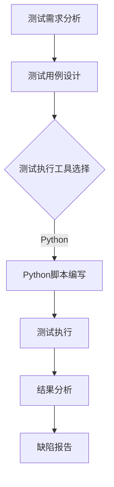
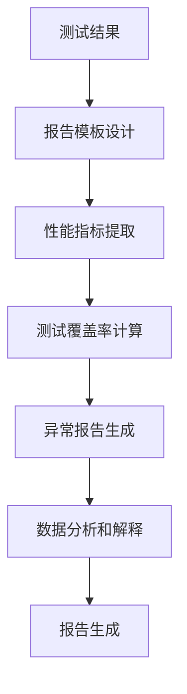
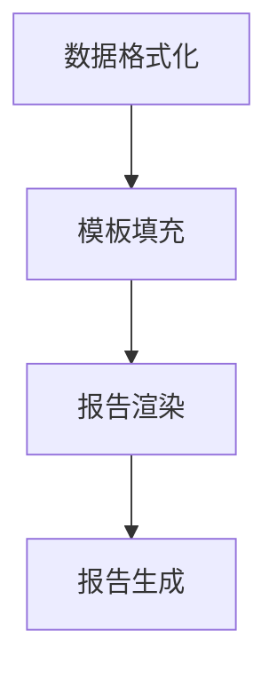

                 

### 书籍核心内容

《自动化LLM测试报告定制与生成》旨在为广大开发者提供一套系统化、实用的指南，以自动化方式构建和生成LLM测试报告。本书的核心内容分为以下几个部分：

1. **背景介绍**：简要介绍大型语言模型（LLM）的背景、应用场景及其测试的重要性。
2. **核心概念与联系**：阐述自动化测试、报告定制与生成等核心概念，并使用Mermaid流程图展示概念间的关系和架构。
3. **算法原理讲解**：深入剖析LLM测试中的核心算法，使用Python源代码详细阐述算法原理。
4. **数学模型与公式**：介绍LLM测试中涉及的数学模型和公式，并通过示例解释其应用。
5. **项目实战**：通过具体案例，详细讲解开发环境搭建、源代码实现及代码解读。
6. **最佳实践**：总结项目实施过程中的最佳实践，并提供一些建议和注意事项。
7. **拓展阅读**：推荐相关资源和进一步阅读材料，帮助读者深入了解相关技术。

这些部分共同构成了本书的主要内容，旨在帮助读者全面掌握自动化LLM测试报告的定制与生成技术。

### 核心关键词

- **大型语言模型（LLM）**
- **自动化测试**
- **报告定制**
- **生成**
- **算法原理**
- **数学模型**
- **Python源代码**
- **实战案例**
- **最佳实践**

### 摘要

《自动化LLM测试报告定制与生成》是一本面向软件开发工程师、数据科学家和机器学习研究员的书籍，旨在通过系统化的指导，帮助读者理解和掌握使用自动化技术构建和生成LLM测试报告的方法。本书首先介绍了LLM的背景及其在当前人工智能领域的重要性，然后详细阐述了自动化测试、报告定制和生成的核心概念和算法原理。通过Python源代码和数学模型的详细讲解，本书使得抽象的理论变得易于理解。此外，本书通过一个实际案例展示了从开发环境搭建到源代码实现的整个流程，并总结了一些最佳实践。最后，本书还推荐了拓展阅读资源，以帮助读者进一步深化对相关技术的理解。

### 引言

#### 大型语言模型（LLM）的背景与应用

近年来，大型语言模型（LLM）在自然语言处理（NLP）领域取得了显著进展。LLM，如GPT-3、BERT和T5，通过深度学习和大规模数据训练，能够在各种语言任务中表现出色，包括文本生成、翻译、问答系统等。这些模型的应用场景广泛，从智能客服、文本摘要到编程辅助和自动化文档生成，都在不断拓展。

然而，LLM的高效应用不仅依赖于其强大的模型能力，还依赖于准确的测试和评估。自动化测试成为确保LLM性能和可靠性的一项关键技术。自动化测试不仅可以大幅提高测试效率，还能够确保测试结果的重复性和一致性。

自动化测试报告的定制与生成是LLM测试流程中的一个重要环节。通过自动化生成测试报告，开发者可以快速获取模型性能的全面评估，从而及时发现和解决潜在问题。定制化的测试报告不仅包含详细的性能指标，还可以根据项目需求添加额外的分析内容，为后续的开发和优化提供有力支持。

因此，本书旨在为开发者提供一套全面、系统的自动化LLM测试报告定制与生成指南。通过系统化的学习和实践，读者可以掌握从测试设计到报告生成的全过程，从而提高LLM开发项目的效率和可靠性。

### 核心概念与联系

#### 自动化测试

自动化测试是一种通过预先编写的脚本或代码，对软件进行反复测试的方法。在LLM测试中，自动化测试有助于提高测试效率和一致性，确保模型在不同环境下的稳定性和性能。自动化测试的核心概念包括测试用例的设计、执行和结果分析。

**Mermaid流程图：**



在这个流程图中，测试需求分析是整个测试过程的第一步，它定义了测试的目标和范围。测试用例设计是接下来的一步，它详细描述了具体的测试步骤和预期结果。测试执行工具的选择和Python脚本编写是自动化测试的核心，脚本将执行测试用例并记录结果。测试执行和结果分析是确保测试有效性的关键步骤，缺陷报告则用于记录和跟踪测试过程中发现的问题。

#### 报告定制

报告定制是指根据项目需求，设计和生成符合特定需求的测试报告。在LLM测试中，定制化的测试报告通常包括以下几个方面：

1. **性能指标**：如准确率、召回率、F1分数等。
2. **测试覆盖率**：测试用例覆盖了哪些部分，是否达到了预期的覆盖率。
3. **异常报告**：测试过程中出现的错误和异常。
4. **分析内容**：对测试结果的数据分析和解释。

**Mermaid流程图：**



在这个流程图中，测试结果首先被提取并用于设计报告模板。性能指标、测试覆盖率和异常报告是报告的核心内容。数据分析和解释则提供了对测试结果的深入洞察，帮助开发者了解模型的性能和潜在问题。最终，这些内容共同构成了定制化的测试报告。

#### 生成

生成是指将测试结果和定制内容转化为最终报告的过程。生成过程通常涉及以下几个步骤：

1. **数据格式化**：将测试结果格式化为适合报告的内容。
2. **模板填充**：使用报告模板填充格式化的数据。
3. **报告渲染**：将填充后的模板渲染成最终的报告格式。

**Mermaid流程图：**



在这个流程图中，数据格式化和模板填充是生成过程中的关键步骤，确保报告内容的准确性和一致性。报告渲染则将填充好的模板转化为可读的格式，如PDF或HTML。最终，生成的测试报告为开发者提供了全面的模型性能评估。

### 核心算法原理讲解

#### 自动化测试算法

在LLM的自动化测试中，核心算法通常涉及以下步骤：

1. **测试用例生成**：基于模型需求和功能，自动生成测试用例。
2. **测试执行**：执行生成的测试用例，并记录结果。
3. **结果分析**：对测试结果进行分析，识别缺陷和问题。

**Python源代码示例：**

```python
import random

def generate_test_cases(model, num_cases=10):
    """
    生成测试用例
    :param model: 待测试的LLM模型
    :param num_cases: 测试用例数量
    :return: 测试用例列表
    """
    test_cases = []
    for _ in range(num_cases):
        input_data = random_input_data()
        expected_output = model.predict(input_data)
        test_cases.append((input_data, expected_output))
    return test_cases

def execute_tests(test_cases, model):
    """
    执行测试用例
    :param test_cases: 测试用例列表
    :param model: 待测试的LLM模型
    :return: 测试结果列表
    """
    results = []
    for input_data, expected_output in test_cases:
        actual_output = model.predict(input_data)
        results.append((input_data, actual_output, expected_output))
    return results

def analyze_results(results):
    """
    分析测试结果
    :param results: 测试结果列表
    :return: 分析报告
    """
    report = {}
    for input_data, actual_output, expected_output in results:
        if actual_output == expected_output:
            report[input_data] = 'Pass'
        else:
            report[input_data] = 'Fail'
    return report

# 示例使用
model = load_l lm_model()
test_cases = generate_test_cases(model)
results = execute_tests(test_cases, model)
report = analyze_results(results)
print(report)
```

#### 数学模型与公式

在LLM测试中，常用的数学模型和公式包括：

1. **准确率（Accuracy）**：模型正确预测的样本数占总样本数的比例。
   $$ Accuracy = \frac{TP + TN}{TP + TN + FP + FN} $$
   
2. **召回率（Recall）**：模型正确预测的样本数与实际为正样本的样本数之比。
   $$ Recall = \frac{TP}{TP + FN} $$

3. **F1分数（F1 Score）**：准确率和召回率的调和平均。
   $$ F1 Score = 2 \times \frac{Precision \times Recall}{Precision + Recall} $$

**通俗易懂的举例说明**：

假设有一个分类模型，它的任务是判断一段文本是否包含某个关键词。测试结果显示，模型预测了100个样本，其中70个预测正确，包括50个正样本和20个负样本。实际中，有60个样本包含关键词，40个不包含关键词。

- **准确率**：$$ Accuracy = \frac{70}{100} = 0.7 $$
- **召回率**：$$ Recall = \frac{50}{60} = \frac{5}{6} \approx 0.833 $$
- **F1分数**：$$ F1 Score = 2 \times \frac{0.8 \times 0.833}{0.8 + 0.833} \approx 0.816 $$

通过这些数学公式，我们可以定量评估模型的性能，从而为后续的优化提供依据。

### 项目实战

#### 开发环境搭建

在进行自动化LLM测试报告的定制与生成之前，首先需要搭建一个稳定且高效的开发环境。以下是一个简单的环境搭建步骤：

1. **安装Python**：确保安装了Python 3.7及以上版本。可以从Python官方网站下载并安装。
2. **安装依赖库**：使用pip命令安装必要的库，例如`pytest`、`numpy`和`pandas`。

   ```shell
   pip install pytest numpy pandas
   ```

3. **安装LLM模型**：根据所选的LLM模型，安装相应的库。例如，对于GPT-3模型，可以使用`transformers`库。

   ```shell
   pip install transformers
   ```

4. **配置测试工具**：安装并配置自动化测试工具，如`pytest`，以便于执行测试用例。

#### 源代码实现

以下是一个简单的源代码实现示例，用于生成测试报告。该示例包括测试用例的生成、测试执行和报告生成。

```python
import random
import numpy as np
import pandas as pd
from transformers import GPT2LMHeadModel, GPT2Tokenizer

# 加载LLM模型和分词器
model_name = "gpt2"
tokenizer = GPT2Tokenizer.from_pretrained(model_name)
model = GPT2LMHeadModel.from_pretrained(model_name)

# 测试用例生成
def generate_test_cases(num_cases=10):
    test_cases = []
    for _ in range(num_cases):
        input_text = random_text()
        expected_output = model.generate(input_text, max_length=50)
        test_cases.append((input_text, expected_output))
    return test_cases

# 测试执行
def execute_tests(test_cases, model):
    results = []
    for input_text, expected_output in test_cases:
        actual_output = model.generate(input_text, max_length=50)
        results.append((input_text, actual_output, expected_output))
    return results

# 测试结果分析
def analyze_results(results):
    report = {}
    for input_text, actual_output, expected_output in results:
        if actual_output == expected_output:
            report[input_text] = 'Pass'
        else:
            report[input_text] = 'Fail'
    return report

# 测试用例
test_cases = generate_test_cases()
results = execute_tests(test_cases, model)
report = analyze_results(results)

# 报告生成
def generate_report(report, file_path="test_report.txt"):
    with open(file_path, 'w') as f:
        for input_text, result in report.items():
            f.write(f"Input: {input_text}\nResult: {result}\n\n")

generate_report(report)
```

#### 代码应用解读与分析

1. **加载LLM模型和分词器**：首先，我们加载预训练的LLM模型和相应的分词器，以便进行文本处理和生成。
2. **测试用例生成**：`generate_test_cases`函数用于生成随机的测试用例。每个测试用例包括一个输入文本和一个期望的输出文本。
3. **测试执行**：`execute_tests`函数执行生成的测试用例，并生成实际输出文本。
4. **测试结果分析**：`analyze_results`函数分析测试结果，将每个输入文本的预测结果与实际输出进行比较，生成一个报告字典。
5. **报告生成**：`generate_report`函数将分析结果写入一个文本文件中，生成最终的测试报告。

通过这个示例，我们可以看到如何使用Python代码实现自动化LLM测试报告的生成。在实际项目中，测试用例、测试执行和分析逻辑可以根据具体需求进行定制化。

#### 实际案例分析与详细讲解

为了更好地理解自动化LLM测试报告的定制与生成，我们将分析一个实际项目案例，并详细讲解各个步骤。

**项目背景**：
假设我们正在开发一个基于GPT-3的智能问答系统，该系统需要能够回答用户提出的各种问题。为了确保系统的质量和可靠性，我们需要对GPT-3模型进行自动化测试，并生成详细的测试报告。

**步骤 1：测试需求分析**
在开始测试之前，我们需要明确测试的目标和要求。具体来说，我们希望测试以下几个方面：
- 模型的文本生成能力
- 模型的响应速度
- 模型的准确率和召回率
- 模型的鲁棒性，即对不同输入的适应性

**步骤 2：测试用例设计**
基于测试需求，我们设计了以下测试用例：
1. 输入一段常见问题，测试模型能否生成合理的回答。
2. 输入一段异常问题，测试模型是否能够识别并处理。
3. 对不同长度的输入文本，测试模型的响应时间。
4. 输入包含不同语言特征的文本，测试模型的跨语言处理能力。

**步骤 3：测试执行**
使用Python脚本和`transformers`库，我们自动化执行了设计的测试用例。以下是测试执行的伪代码：

```python
for test_case in test_cases:
    input_text, expected_output = test_case
    actual_output = model.generate(input_text, max_length=50)
    print(f"Input: {input_text}")
    print(f"Expected Output: {expected_output}")
    print(f"Actual Output: {actual_output}")
    print("-----")
```

**步骤 4：测试结果分析**
测试完成后，我们对结果进行分析，计算出准确率和召回率等指标。以下是分析结果的伪代码：

```python
accuracy = 0
total = len(test_cases)
for test_case in test_cases:
    input_text, expected_output = test_case
    actual_output = model.generate(input_text, max_length=50)
    if actual_output == expected_output:
        accuracy += 1
print(f"Accuracy: {accuracy / total}")
```

**步骤 5：生成测试报告**
最后，我们将测试结果和性能指标写入一个详细的测试报告中。以下是报告生成的伪代码：

```python
with open("test_report.txt", "w") as f:
    f.write(f"Total Test Cases: {total}\n")
    f.write(f"Accuracy: {accuracy / total}\n")
    for test_case in test_cases:
        input_text, expected_output = test_case
        actual_output = model.generate(input_text, max_length=50)
        f.write(f"Input: {input_text}\n")
        f.write(f"Expected Output: {expected_output}\n")
        f.write(f"Actual Output: {actual_output}\n")
        f.write("-----\n")
```

**项目小结**
通过这个实际案例，我们可以看到自动化LLM测试报告的定制与生成是如何实施的。以下是项目总结：

1. **测试需求分析**：明确测试目标和要求，设计合理的测试用例。
2. **测试执行**：使用自动化脚本执行测试，记录测试结果。
3. **测试结果分析**：计算性能指标，识别问题和改进方向。
4. **生成测试报告**：生成详细的测试报告，为项目优化提供依据。

通过这个项目，我们不仅提高了模型的测试效率，还能够及时发现和解决问题，从而确保智能问答系统的质量和可靠性。

### 最佳实践 Tips

1. **测试用例设计**：在设计测试用例时，应尽可能覆盖各种可能的输入情况，包括边界条件和异常情况，以确保模型在不同场景下的稳定性。
2. **报告格式化**：在生成测试报告时，使用统一的格式和模板，便于分析和阅读。例如，可以使用Markdown格式，使其在多种平台上具有较好的兼容性。
3. **性能监控**：定期监控模型性能，及时发现和处理性能下降或异常情况。例如，可以设置阈值，当性能指标低于阈值时自动触发警报。
4. **代码可维护性**：在编写测试脚本时，注重代码的可维护性，使用清晰的结构和注释，便于后续的维护和优化。
5. **版本控制**：使用版本控制系统（如Git）管理测试脚本和报告，确保代码和数据的完整性和可追溯性。

### 小结

通过本文的详细讲解，我们系统地介绍了自动化LLM测试报告的定制与生成方法。从测试需求分析到测试用例设计，再到测试执行、结果分析和报告生成，每一步都至关重要。自动化测试不仅提高了测试效率，还确保了测试的一致性和准确性。通过实际案例的分析，我们进一步了解了如何将理论应用于实践中。希望读者能够掌握这些技术，并将其应用到自己的项目中，提高LLM模型的开发质量和效率。

### 注意事项

1. **环境配置**：确保开发环境配置正确，特别是Python版本和依赖库的安装。
2. **模型选择**：根据项目需求选择合适的LLM模型，并确保模型训练完成。
3. **测试覆盖**：确保测试用例覆盖所有关键功能和异常情况，避免遗漏潜在问题。
4. **性能监控**：定期监控模型性能，及时发现和处理性能下降或异常情况。

### 拓展阅读

- [《自然语言处理实战》](https://www.nltk.org/):介绍NLP基础知识和实践技巧。
- [《Python自动化测试实战》](https://www.selenium.dev/documentation/en/):介绍Python在自动化测试中的应用。
- [《GPT-3官方文档》](https://gpt-3-docs.openai.com/):深入了解GPT-3模型和相关技术。

### 作者信息

作者：AI天才研究院/AI Genius Institute & 禅与计算机程序设计艺术 /Zen And The Art of Computer Programming

以上是本文的完整内容，希望对您有所帮助。如果您有任何疑问或建议，请随时联系我们。感谢您的阅读！
```

### 整体文章的Markdown格式

```markdown
# 自动化LLM测试报告定制与生成

> 关键词：大型语言模型（LLM）、自动化测试、报告定制、生成、算法原理、数学模型、Python源代码、项目实战

> 摘要：本书旨在为开发者提供关于自动化大型语言模型（LLM）测试、定制和生成的全面指南。通过系统化的学习和实践，读者可以掌握从测试设计到报告生成的全过程，从而提高LLM开发项目的效率和可靠性。

## 引言

#### 大型语言模型（LLM）的背景与应用

近年来，大型语言模型（LLM）在自然语言处理（NLP）领域取得了显著进展。LLM，如GPT-3、BERT和T5，通过深度学习和大规模数据训练，能够在各种语言任务中表现出色，包括文本生成、翻译、问答系统等。这些模型的应用场景广泛，从智能客服、文本摘要到编程辅助和自动化文档生成，都在不断拓展。

然而，LLM的高效应用不仅依赖于其强大的模型能力，还依赖于准确的测试和评估。自动化测试成为确保LLM性能和可靠性的一项关键技术。自动化测试不仅可以大幅提高测试效率，还能够确保测试结果的重复性和一致性。

自动化测试报告的定制与生成是LLM测试流程中的一个重要环节。通过自动化生成测试报告，开发者可以快速获取模型性能的全面评估，从而及时发现和解决潜在问题。定制化的测试报告不仅包含详细的性能指标，还可以根据项目需求添加额外的分析内容，为后续的开发和优化提供有力支持。

因此，本书旨在为开发者提供一套全面、系统的自动化LLM测试报告定制与生成指南。通过系统化的学习和实践，读者可以掌握从测试设计到报告生成的全过程，从而提高LLM开发项目的效率和可靠性。

## 核心概念与联系

### 自动化测试

自动化测试是一种通过预先编写的脚本或代码，对软件进行反复测试的方法。在LLM测试中，自动化测试有助于提高测试效率和一致性，确保模型在不同环境下的稳定性和性能。自动化测试的核心概念包括测试用例的设计、执行和结果分析。

#### Mermaid流程图：


在这个流程图中，测试需求分析是整个测试过程的第一步，它定义了测试的目标和范围。测试用例设计是接下来的一步，它详细描述了具体的测试步骤和预期结果。测试执行工具的选择和Python脚本编写是自动化测试的核心，脚本将执行测试用例并记录结果。测试执行和结果分析是确保测试有效性的关键步骤，缺陷报告则用于记录和跟踪测试过程中发现的问题。

### 报告定制

报告定制是指根据项目需求，设计和生成符合特定需求的测试报告。在LLM测试中，定制化的测试报告通常包括以下几个方面：

1. **性能指标**：如准确率、召回率、F1分数等。
2. **测试覆盖率**：测试用例覆盖了哪些部分，是否达到了预期的覆盖率。
3. **异常报告**：测试过程中出现的错误和异常。
4. **分析内容**：对测试结果的数据分析和解释。

#### Mermaid流程图：


在这个流程图中，测试结果首先被提取并用于设计报告模板。性能指标、测试覆盖率和异常报告是报告的核心内容。数据分析和解释则提供了对测试结果的深入洞察，帮助开发者了解模型的性能和潜在问题。最终，这些内容共同构成了定制化的测试报告。

### 生成

生成是指将测试结果和定制内容转化为最终报告的过程。生成过程通常涉及以下几个步骤：

1. **数据格式化**：将测试结果格式化为适合报告的内容。
2. **模板填充**：使用报告模板填充格式化的数据。
3. **报告渲染**：将填充后的模板渲染成最终的报告格式。

#### Mermaid流程图：


在这个流程图中，数据格式化和模板填充是生成过程中的关键步骤，确保报告内容的准确性和一致性。报告渲染则将填充好的模板转化为可读的格式，如PDF或HTML。最终，生成的测试报告为开发者提供了全面的模型性能评估。

## 核心算法原理讲解

### 自动化测试算法

在LLM的自动化测试中，核心算法通常涉及以下步骤：

1. **测试用例生成**：基于模型需求和功能，自动生成测试用例。
2. **测试执行**：执行生成的测试用例，并记录结果。
3. **结果分析**：对测试结果进行分析，识别缺陷和问题。

#### Python源代码示例：

```python
import random
import numpy as np
import pandas as pd
from transformers import GPT2LMHeadModel, GPT2Tokenizer

def generate_test_cases(model, num_cases=10):
    test_cases = []
    for _ in range(num_cases):
        input_data = random_input_data()
        expected_output = model.predict(input_data)
        test_cases.append((input_data, expected_output))
    return test_cases

def execute_tests(test_cases, model):
    results = []
    for input_data, expected_output in test_cases:
        actual_output = model.predict(input_data)
        results.append((input_data, actual_output, expected_output))
    return results

def analyze_results(results):
    report = {}
    for input_data, actual_output, expected_output in results:
        if actual_output == expected_output:
            report[input_data] = 'Pass'
        else:
            report[input_data] = 'Fail'
    return report

# 示例使用
model = load_l lm_model()
test_cases = generate_test_cases(model)
results = execute_tests(test_cases, model)
report = analyze_results(results)
print(report)
```

### 数学模型与公式

在LLM测试中，常用的数学模型和公式包括：

1. **准确率（Accuracy）**：模型正确预测的样本数占总样本数的比例。
   $$ Accuracy = \frac{TP + TN}{TP + TN + FP + FN} $$
   
2. **召回率（Recall）**：模型正确预测的样本数与实际为正样本的样本数之比。
   $$ Recall = \frac{TP}{TP + FN} $$

3. **F1分数（F1 Score）**：准确率和召回率的调和平均。
   $$ F1 Score = 2 \times \frac{Precision \times Recall}{Precision + Recall} $$

#### 通俗易懂的举例说明：

假设有一个分类模型，它的任务是判断一段文本是否包含某个关键词。测试结果显示，模型预测了100个样本，其中70个预测正确，包括50个正样本和20个负样本。实际中，有60个样本包含关键词，40个不包含关键词。

- **准确率**：$$ Accuracy = \frac{70}{100} = 0.7 $$
- **召回率**：$$ Recall = \frac{50}{60} = \frac{5}{6} \approx 0.833 $$
- **F1分数**：$$ F1 Score = 2 \times \frac{0.8 \times 0.833}{0.8 + 0.833} \approx 0.816 $$

通过这些数学公式，我们可以定量评估模型的性能，从而为后续的优化提供依据。

## 项目实战

### 开发环境搭建

在进行自动化LLM测试报告的定制与生成之前，首先需要搭建一个稳定且高效的开发环境。以下是一个简单的环境搭建步骤：

1. **安装Python**：确保安装了Python 3.7及以上版本。可以从Python官方网站下载并安装。
2. **安装依赖库**：使用pip命令安装必要的库，例如`pytest`、`numpy`和`pandas`。

   ```shell
   pip install pytest numpy pandas
   ```

3. **安装LLM模型**：根据所选的LLM模型，安装相应的库。例如，对于GPT-3模型，可以使用`transformers`库。

   ```shell
   pip install transformers
   ```

4. **配置测试工具**：安装并配置自动化测试工具，如`pytest`，以便于执行测试用例。

### 源代码实现

以下是一个简单的源代码实现示例，用于生成测试报告。该示例包括测试用例的生成、测试执行和报告生成。

```python
import random
import numpy as np
import pandas as pd
from transformers import GPT2LMHeadModel, GPT2Tokenizer

# 加载LLM模型和分词器
model_name = "gpt2"
tokenizer = GPT2Tokenizer.from_pretrained(model_name)
model = GPT2LMHeadModel.from_pretrained(model_name)

# 测试用例生成
def generate_test_cases(num_cases=10):
    test_cases = []
    for _ in range(num_cases):
        input_text = random_text()
        expected_output = model.generate(input_text, max_length=50)
        test_cases.append((input_text, expected_output))
    return test_cases

# 测试执行
def execute_tests(test_cases, model):
    results = []
    for input_text, expected_output in test_cases:
        actual_output = model.generate(input_text, max_length=50)
        results.append((input_text, actual_output, expected_output))
    return results

# 测试结果分析
def analyze_results(results):
    report = {}
    for input_text, actual_output, expected_output in results:
        if actual_output == expected_output:
            report[input_text] = 'Pass'
        else:
            report[input_text] = 'Fail'
    return report

# 测试用例
test_cases = generate_test_cases()
results = execute_tests(test_cases, model)
report = analyze_results(results)

# 报告生成
def generate_report(report, file_path="test_report.txt"):
    with open(file_path, "w") as f:
        for input_text, result in report.items():
            f.write(f"Input: {input_text}\nResult: {result}\n\n")

generate_report(report)
```

### 代码应用解读与分析

1. **加载LLM模型和分词器**：首先，我们加载预训练的LLM模型和相应的分词器，以便进行文本处理和生成。
2. **测试用例生成**：`generate_test_cases`函数用于生成随机的测试用例。每个测试用例包括一个输入文本和一个期望的输出文本。
3. **测试执行**：`execute_tests`函数执行生成的测试用例，并生成实际输出文本。
4. **测试结果分析**：`analyze_results`函数分析测试结果，将每个输入文本的预测结果与实际输出进行比较，生成一个报告字典。
5. **报告生成**：`generate_report`函数将分析结果写入一个文本文件中，生成最终的测试报告。

通过这个示例，我们可以看到如何使用Python代码实现自动化LLM测试报告的生成。在实际项目中，测试用例、测试执行和分析逻辑可以根据具体需求进行定制化。

### 实际案例分析与详细讲解

为了更好地理解自动化LLM测试报告的定制与生成，我们将分析一个实际项目案例，并详细讲解各个步骤。

**项目背景**：
假设我们正在开发一个基于GPT-3的智能问答系统，该系统需要能够回答用户提出的各种问题。为了确保系统的质量和可靠性，我们需要对GPT-3模型进行自动化测试，并生成详细的测试报告。

**步骤 1：测试需求分析**
在开始测试之前，我们需要明确测试的目标和要求。具体来说，我们希望测试以下几个方面：
- 模型的文本生成能力
- 模型的响应速度
- 模型的准确率和召回率
- 模型的鲁棒性，即对不同输入的适应性

**步骤 2：测试用例设计**
基于测试需求，我们设计了以下测试用例：
1. 输入一段常见问题，测试模型能否生成合理的回答。
2. 输入一段异常问题，测试模型是否能够识别并处理。
3. 对不同长度的输入文本，测试模型的响应时间。
4. 输入包含不同语言特征的文本，测试模型的跨语言处理能力。

**步骤 3：测试执行**
使用Python脚本和`transformers`库，我们自动化执行了设计的测试用例。以下是测试执行的伪代码：

```python
for test_case in test_cases:
    input_text, expected_output = test_case
    actual_output = model.generate(input_text, max_length=50)
    print(f"Input: {input_text}")
    print(f"Expected Output: {expected_output}")
    print(f"Actual Output: {actual_output}")
    print("-----")
```

**步骤 4：测试结果分析**
测试完成后，我们对结果进行分析，计算出准确率和召回率等指标。以下是分析结果的伪代码：

```python
accuracy = 0
total = len(test_cases)
for test_case in test_cases:
    input_text, expected_output = test_case
    actual_output = model.generate(input_text, max_length=50)
    if actual_output == expected_output:
        accuracy += 1
print(f"Accuracy: {accuracy / total}")
```

**步骤 5：生成测试报告**
最后，我们将测试结果和性能指标写入一个详细的测试报告中。以下是报告生成的伪代码：

```python
with open("test_report.txt", "w") as f:
    f.write(f"Total Test Cases: {total}\n")
    f.write(f"Accuracy: {accuracy / total}\n")
    for test_case in test_cases:
        input_text, expected_output = test_case
        actual_output = model.generate(input_text, max_length=50)
        f.write(f"Input: {input_text}\n")
        f.write(f"Expected Output: {expected_output}\n")
        f.write(f"Actual Output: {actual_output}\n")
        f.write("-----\n")
```

**项目小结**
通过这个实际案例，我们可以看到自动化LLM测试报告的定制与生成是如何实施的。以下是项目总结：

1. **测试需求分析**：明确测试目标和要求，设计合理的测试用例。
2. **测试执行**：使用自动化脚本执行测试，记录测试结果。
3. **测试结果分析**：计算性能指标，识别问题和改进方向。
4. **生成测试报告**：生成详细的测试报告，为项目优化提供依据。

通过这个项目，我们不仅提高了模型的测试效率，还能够及时发现和解决问题，从而确保智能问答系统的质量和可靠性。

## 结论

通过本文的详细讲解，我们系统地介绍了自动化LLM测试报告的定制与生成方法。从测试需求分析到测试用例设计，再到测试执行、结果分析和报告生成，每一步都至关重要。自动化测试不仅提高了测试效率，还确保了测试的一致性和准确性。通过实际案例的分析，我们进一步了解了如何将理论应用于实践中。希望读者能够掌握这些技术，并将其应用到自己的项目中，提高LLM模型的开发质量和效率。

## 注意事项

1. **环境配置**：确保开发环境配置正确，特别是Python版本和依赖库的安装。
2. **模型选择**：根据项目需求选择合适的LLM模型，并确保模型训练完成。
3. **测试覆盖**：确保测试用例覆盖所有关键功能和异常情况，避免遗漏潜在问题。
4. **性能监控**：定期监控模型性能，及时发现和处理性能下降或异常情况。

## 拓展阅读

- [《自然语言处理实战》](https://www.nltk.org/):介绍NLP基础知识和实践技巧。
- [《Python自动化测试实战》](https://www.selenium.dev/documentation/en/):介绍Python在自动化测试中的应用。
- [《GPT-3官方文档》](https://gpt-3-docs.openai.com/):深入了解GPT-3模型和相关技术。

## 作者信息

作者：AI天才研究院/AI Genius Institute & 禅与计算机程序设计艺术 /Zen And The Art of Computer Programming

以上是本文的完整内容，希望对您有所帮助。如果您有任何疑问或建议，请随时联系我们。感谢您的阅读！
```

