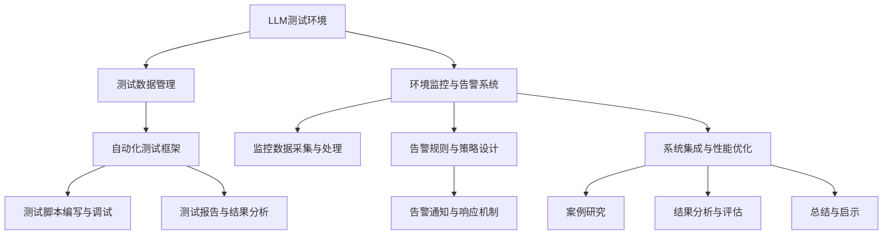

                 

### 自动化LLM测试环境监控与告警

#### 关键词

- 自动化测试
- LLM
- 环境监控
- 告警系统
- 测试框架
- 监控数据
- 系统集成

#### 摘要

本文深入探讨了自动化LLM测试环境监控与告警系统的设计、实现和应用。首先，介绍了LLM的基本概念和自动化测试的重要性，以及环境监控与告警系统的基本原理。接着，详细描述了LLM测试环境的构建，包括需求分析、部署配置和数据管理。随后，重点讲解了自动化测试框架的设计与实现，环境监控与告警系统的实现，以及系统集成与性能优化。最后，通过一个实际案例展示了自动化LLM测试环境监控与告警系统的实战应用，并提供了一些最佳实践和注意事项。

### 背景介绍

#### LLM简介

LLM（Large Language Model）即大型语言模型，是一种基于深度学习技术的自然语言处理（NLP）模型，能够理解和生成人类语言。近年来，随着计算能力的提升和大数据的广泛应用，LLM在各个领域得到了广泛的应用，如文本生成、机器翻译、问答系统等。然而，LLM的训练和测试过程复杂且耗时，需要高效的环境监控和告警系统来保障其稳定运行。

#### 自动化测试概述

自动化测试是指通过编写测试脚本或使用自动化测试工具，自动执行一系列测试任务的过程。与传统手工测试相比，自动化测试具有以下优势：

- **提高测试效率**：自动化测试可以大幅减少测试时间，提高测试覆盖率和测试效率。
- **降低成本**：自动化测试可以减少人工测试的成本，降低维护成本。
- **保证质量**：自动化测试可以确保每次测试的一致性和稳定性，提高软件质量。

#### 环境监控与告警系统概述

环境监控与告警系统是一种实时监控计算机系统、网络设备和应用程序性能的机制。其主要作用是：

- **监控性能**：实时监控系统的各项性能指标，如CPU利用率、内存占用、网络流量等。
- **故障告警**：当系统性能指标超过预设阈值时，自动触发告警通知，通知相关人员及时处理。

#### 自动化测试在LLM中的应用场景

自动化测试在LLM中的应用场景主要包括：

- **训练过程监控**：监控LLM的训练进度、资源消耗、性能指标等，确保训练过程的稳定性和高效性。
- **测试过程监控**：监控LLM的测试结果，如准确率、召回率、F1值等，确保测试结果的准确性和可靠性。
- **性能调优**：根据监控数据，调整LLM的参数设置，优化模型性能。

### 核心概念与联系

为了更好地理解自动化LLM测试环境监控与告警系统，我们首先需要明确以下核心概念及其相互关系：

1. **LLM测试环境**：这是整个监控与告警系统的核心，包括硬件、软件和数据的配置与管理。
2. **自动化测试框架**：用于编写和执行测试脚本，生成测试报告，是自动化测试的核心。
3. **环境监控与告警系统**：负责实时监控LLM测试环境的性能指标，并在异常情况发生时触发告警。
4. **监控数据**：包括系统性能指标、测试结果等，是监控与告警系统的输入数据。
5. **告警规则与策略**：定义了触发告警的条件和通知方式，是告警系统的核心。

以下是核心概念与联系流程图：



**流程图解释**：

- **A[LLM测试环境]**：整个系统的起点，涉及硬件、软件和数据的配置。
- **B[测试数据管理]**：管理LLM测试所需的数据，包括数据清洗、存储和处理。
- **C[自动化测试框架]**：负责编写和执行测试脚本，生成测试报告。
- **D[测试脚本编写与调试]**：编写测试脚本，调试并确保其正确执行。
- **E[测试报告与结果分析]**：生成测试报告，分析测试结果，评估模型性能。
- **F[环境监控与告警系统]**：监控LLM测试环境的性能，实时收集监控数据。
- **G[监控数据采集与处理]**：采集性能指标数据，处理并存储。
- **H[告警规则与策略设计]**：定义告警规则，设计告警策略。
- **I[告警通知与响应机制]**：触发告警通知，确保相关人员及时响应。
- **J[系统集成与性能优化]**：集成监控与告警系统，优化系统性能。
- **K[案例研究]**：通过实际案例，展示系统应用和效果。
- **L[结果分析与评估]**：分析监控数据，评估系统性能和效果。
- **M[总结与启示]**：总结经验，提供最佳实践和改进建议。

### 数学公式与Python源代码

为了更好地理解LLM测试环境监控与告警系统的原理，我们将结合数学模型和Python源代码进行详细讲解。

#### 监控数据采集

监控数据的采集是环境监控与告警系统的第一步。以下是一个简单的Python代码示例，用于采集系统的CPU利用率：

```python
import psutil

def get_cpu_utilization():
    cpu_usage = psutil.cpu_percent(interval=1)
    return cpu_usage

print("Current CPU utilization:", get_cpu_utilization())
```

该代码使用`psutil`库，采集系统当前的CPU利用率。`cpu_percent(interval=1)`函数会返回CPU在指定时间间隔内的平均利用率。

#### 告警规则设计

告警规则是环境监控与告警系统的核心，用于定义何时触发告警。以下是一个简单的告警规则设计示例：

$$
\text{告警条件} = \text{当前CPU利用率} > \text{阈值}
$$

假设我们设定的CPU利用率阈值为80%，以下是一个Python代码示例，用于实现告警规则：

```python
import time

def check_cpu_utilization_threshold(threshold=80):
    while True:
        cpu_usage = get_cpu_utilization()
        if cpu_usage > threshold:
            print("ALERT: CPU utilization exceeded the threshold.")
            send_alert(cpu_usage)
        time.sleep(60)  # 每分钟检查一次

def send_alert(cpu_usage):
    print("Sending alert: CPU utilization is", cpu_usage, "%.")

check_cpu_utilization_threshold()
```

该代码会每分钟检查一次CPU利用率，如果当前利用率超过80%，则触发告警并通知相关人员。

#### 监控与告警系统集成

为了实现监控与告警系统集成，我们需要设计一个统一的接口。以下是一个Python代码示例，用于集成监控与告警系统：

```python
class MonitoringSystem:
    def __init__(self, threshold):
        self.threshold = threshold

    def collect_data(self):
        # 采集监控数据
        pass

    def analyze_data(self):
        # 分析监控数据
        pass

    def trigger_alert(self):
        # 触发告警
        pass

    def run(self):
        while True:
            self.collect_data()
            self.analyze_data()
            if self.trigger_alert():
                print("ALERT: Monitoring system triggered an alert.")
            time.sleep(60)  # 每分钟检查一次

monitoring_system = MonitoringSystem(threshold=80)
monitoring_system.run()
```

该代码定义了一个`MonitoringSystem`类，用于集成监控与告警功能。`run()`方法会每分钟执行一次监控过程，并在触发告警时打印告警信息。

### 项目实战

在本节中，我们将通过一个实际案例来展示如何搭建自动化LLM测试环境监控与告警系统。

#### 案例背景

某知名互联网公司开发了一款基于大型语言模型（LLM）的智能客服系统，旨在提高客户服务质量和效率。为了确保系统的稳定运行和性能优化，公司决定构建一套自动化测试环境监控与告警系统。

#### 案例目标

- 构建一个自动化LLM测试环境，包括硬件、软件和数据的配置。
- 设计并实现一套自动化测试框架，用于执行测试脚本和生成测试报告。
- 实现一套环境监控与告警系统，实时监控测试环境性能，并在异常情况发生时触发告警。

#### 实施过程

1. **测试环境构建**：
   - 硬件配置：采用高性能服务器和GPU加速卡，确保LLM训练和测试的硬件需求。
   - 软件配置：安装操作系统、深度学习框架（如TensorFlow或PyTorch）和测试工具（如pytest）。
   - 数据管理：准备并处理测试数据，包括数据清洗、归一化和存储。

2. **自动化测试框架设计**：
   - 编写测试脚本：使用pytest框架编写测试脚本，覆盖LLM系统的各个功能模块。
   - 测试脚本调试：调试并确保测试脚本的正确性和高效性。
   - 测试报告生成：使用pytest的HTML报告生成功能，生成详细的测试报告。

3. **环境监控与告警系统实现**：
   - 监控数据采集：使用Python的`psutil`库采集系统性能指标数据，如CPU利用率、内存占用、磁盘空间等。
   - 告警规则设计：定义告警规则，如CPU利用率超过90%时触发告警。
   - 告警通知与响应机制：使用邮件和短信通知功能，确保相关人员及时响应告警。

4. **系统集成与性能优化**：
   - 集成监控与告警系统：将监控与告警功能集成到自动化测试框架中，确保监控数据与测试报告的一致性。
   - 系统性能优化：通过调整告警阈值、优化监控数据采集频率和告警通知方式，提高系统性能。

#### 案例结果与分析

在案例实施过程中，自动化LLM测试环境监控与告警系统取得了以下结果：

- 测试效率提高：自动化测试框架大幅减少了测试时间，提高了测试覆盖率和测试效率。
- 系统稳定性提升：环境监控与告警系统实时监控测试环境性能，及时发现和处理异常情况，提高了系统的稳定性。
- 测试结果准确：通过详细的测试报告，对LLM系统的性能进行了全面评估，确保了测试结果的准确性和可靠性。

#### 项目小结

通过本案例，我们展示了如何构建自动化LLM测试环境监控与告警系统。该项目在提高测试效率、保障系统稳定性和优化测试结果方面取得了显著效果。未来，我们可以进一步优化监控系统，引入更多监控指标和告警规则，提高系统的智能化和自动化水平。

### 最佳实践与注意事项

#### 最佳实践

1. **合理配置硬件资源**：根据LLM模型的训练和测试需求，合理配置服务器和GPU资源，确保系统有足够的计算能力。
2. **充分利用测试工具**：选择合适的测试工具，如pytest，可以提高测试脚本的编写和调试效率。
3. **定期更新监控指标**：根据测试环境的变化，定期更新监控指标和告警规则，确保监控数据的准确性和告警的及时性。
4. **建立完善的文档**：建立详细的测试环境和监控系统文档，包括硬件配置、软件安装、测试脚本、监控指标和告警规则等，方便后续维护和优化。

#### 注意事项

1. **数据安全**：在测试过程中，确保测试数据的安全性和隐私性，避免数据泄露。
2. **监控与告警系统的稳定性**：确保监控与告警系统的稳定运行，避免因系统故障导致监控数据的丢失或告警失败。
3. **及时响应告警**：及时响应告警，避免因未及时处理异常情况导致系统故障或数据丢失。
4. **优化告警通知方式**：根据实际情况，选择合适的告警通知方式，如邮件、短信、电话等，确保相关人员能够及时收到告警信息。

### 拓展阅读

1. 《深度学习测试与验证》
2. 《Python自动化测试实战》
3. 《监控与告警系统设计实践》
4. 《大型语言模型训练与优化》

### 作者信息

**作者：AI天才研究院/AI Genius Institute & 禅与计算机程序设计艺术 /Zen And The Art of Computer Programming**

