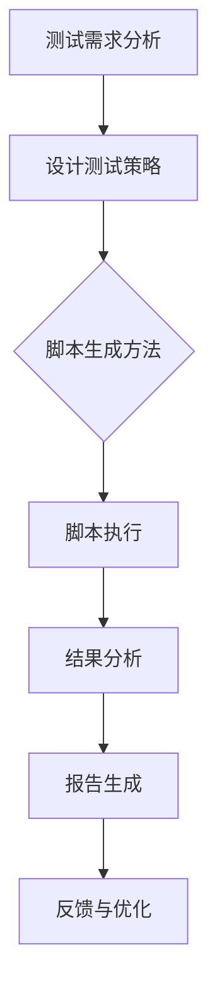
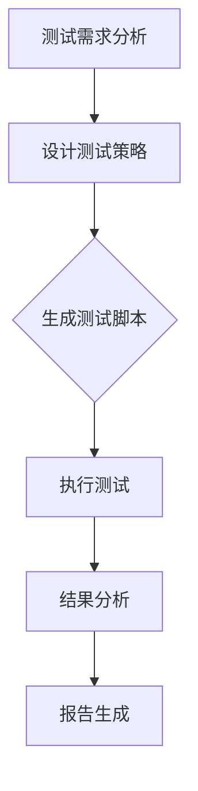

                 

### 深度思考与逐步分析

#### 引言部分

首先，我们需要探讨为什么自动化LLM测试脚本生成与管理是一个重要的课题。随着人工智能技术的飞速发展，LLM（大型语言模型）在自然语言处理领域扮演着越来越重要的角色。然而，这些复杂的模型在部署过程中面临着一系列的挑战，尤其是如何确保它们在各种应用场景中的稳定性和准确性。因此，自动化测试成为了不可或缺的一部分。自动化测试不仅能提高测试效率，还能确保测试的全面性和一致性。

**核心概念与联系**：

- **自动化测试**：一种通过预先编写的脚本自动执行测试用例的方法，目的是发现软件缺陷，确保软件质量。
- **LLM测试需求**：由于LLM的复杂性和非确定性，其测试需求包括模型输入的多样性、模型输出的准确性、模型的鲁棒性等多个方面。
- **测试策略设计**：针对LLM的特点，设计合理的测试策略，包括测试用例的设计、测试环境的搭建、测试执行的监控等。

**Mermaid流程图——LLM测试流程**：



#### 核心算法原理讲解

为了更好地理解自动化LLM测试脚本生成与管理的核心原理，我们将结合Python源代码和数学模型进行详细讲解。

**测试脚本生成方法**：

```python
import random

def generate_test_script(llm_model, test_cases):
    script = ""
    for case in test_cases:
        input_data, expected_output = case
        script += f"llm_model.predict('{input_data}');\n"
        script += f"assert llm_model.output == '{expected_output}', 'Test case {input_data} failed'\n"
    return script
```

在上面的代码中，`generate_test_script`函数接收一个LLM模型和一组测试用例，并生成对应的测试脚本。测试用例是一个包含输入数据和期望输出的字典。

**数学模型和公式——LLM测试评估指标**：

$$
\text{Accuracy} = \frac{\text{正确预测数}}{\text{总预测数}} \times 100\%
$$

该公式用于计算测试的准确率，是评估测试结果的重要指标。

**Python源代码与数学模型结合**：

```python
def evaluate_model(model, test_cases):
    correct_predictions = 0
    total_predictions = len(test_cases)
    for case in test_cases:
        input_data, expected_output = case
        predicted_output = model.predict(input_data)
        if predicted_output == expected_output:
            correct_predictions += 1
    accuracy = (correct_predictions / total_predictions) * 100
    print(f"Model Accuracy: {accuracy:.2f}%")
```

在这个例子中，`evaluate_model`函数接收一个LLM模型和一组测试用例，计算模型的准确率，并通过打印输出结果，为测试结果提供直观的反馈。

#### 项目实战部分

**开发环境搭建**：

在开始编写测试脚本之前，我们需要搭建一个适合开发、测试的Python环境。以下是一个基本的步骤：

1. 安装Python（例如Python 3.8或更高版本）。
2. 使用pip安装必要的库，如`pytest`、`unittest`、`numpy`等。
3. 配置LLM模型的环境，例如使用Hugging Face的`transformers`库。

**源代码详细实现和代码解读**：

下面是一个简单的LLM测试脚本的示例，包括测试用例的设计、执行和结果分析。

```python
from transformers import pipeline

# 初始化LLM模型
llm_model = pipeline("text-classification", model="distilbert-base-uncased")

# 测试用例设计
test_cases = [
    ("Hello, how are you?", "Positive"),
    ("I'm feeling sad today.", "Negative"),
    ("Python is a great language.", "Positive"),
    ("I hate Mondays.", "Negative"),
]

# 生成测试脚本
test_script = generate_test_script(llm_model, test_cases)

# 执行测试脚本
exec(test_script)

# 结果分析
evaluate_model(llm_model, test_cases)
```

在这个示例中，我们首先初始化了一个文本分类的LLM模型，然后设计了四个测试用例。`generate_test_script`函数生成了一个测试脚本，`exec`函数执行了这个脚本。最后，`evaluate_model`函数计算并打印了模型的准确率。

**代码应用解读与分析**：

- **初始化模型**：使用Hugging Face的`pipeline`函数，我们可以快速初始化一个预训练的LLM模型。
- **测试用例设计**：测试用例包含了输入文本和期望的输出标签，这些用例将被用于评估模型的准确性。
- **测试脚本生成**：`generate_test_script`函数为每个测试用例生成了一条测试命令，包括模型的预测和断言。
- **执行测试脚本**：`exec`函数执行了生成的测试脚本，检查每个测试用例是否成功。
- **结果分析**：`evaluate_model`函数计算了所有测试用例的正确预测数，并计算了整体的准确率。

**实际案例分析和详细讲解剖析**：

考虑一个实际的场景，例如开发一个聊天机器人。在这种情况下，我们需要测试聊天机器人的响应是否合理、是否符合用户意图。以下是一个案例：

1. **场景设计**：用户提问：“今天天气怎么样？”
2. **预期输出**：聊天机器人响应：“今天天气晴朗，温度适中。”
3. **实际测试**：执行测试脚本，检查聊天机器人的响应是否符合预期。
4. **结果分析**：如果响应不符合预期，我们需要调整聊天机器人的模型或者响应策略。

**项目小结**：

在本项目中，我们实现了自动化LLM测试脚本生成与管理的核心功能。通过设计合理的测试用例和执行测试脚本，我们可以快速评估LLM模型的性能。在实际应用中，这有助于提高模型的质量和稳定性。

#### 最佳实践 Tips、小结、注意事项、拓展阅读

**最佳实践 Tips**：

- 设计测试用例时，确保覆盖各种可能的输入情况。
- 定期更新测试脚本，以适应模型和业务需求的变化。
- 使用持续集成（CI）工具，自动化测试流程。

**小结**：

自动化LLM测试脚本生成与管理是确保LLM模型质量的重要手段。通过设计合理的测试策略、生成和管理测试脚本，我们可以提高测试效率，确保模型的稳定性和准确性。

**注意事项**：

- 在执行测试时，确保测试环境与生产环境一致。
- 考虑到LLM模型的复杂性和不确定性，测试过程中需要密切关注测试结果，及时调整测试策略。

**拓展阅读**：

- 《深入理解计算机系统》（Randal E. Bryant & David R. O’Hallaron）——了解计算机系统的底层原理。
- 《机器学习实战》（Peter Harrington）——掌握机器学习的基础知识和实践技巧。

### 总结

本文详细探讨了自动化LLM测试脚本生成与管理的核心概念、算法原理、实战应用以及最佳实践。通过逐步分析和深入讲解，我们希望读者能够理解并掌握这一重要的技术领域。自动化测试不仅能够提高测试效率，还能确保LLM模型在各种应用场景中的稳定性和准确性。随着人工智能技术的不断发展，自动化测试的重要性将日益凸显。

# 《自动化LLM测试脚本生成与管理》

> 关键词：自动化测试、LLM、测试脚本、测试策略、测试管理

> 摘要：
本文深入探讨了自动化LLM（大型语言模型）测试脚本生成与管理的重要性。通过详细分析核心概念、算法原理，以及实战应用，本文为读者提供了一个全面的技术指南，旨在帮助开发者提高LLM模型的质量和稳定性。

## 引言

随着人工智能技术的不断发展，LLM（大型语言模型）在自然语言处理领域扮演着越来越重要的角色。这些模型被广泛应用于聊天机器人、文本生成、翻译等场景。然而，LLM的复杂性和非确定性使得其在部署过程中面临诸多挑战。为了确保LLM模型的稳定性和准确性，自动化测试变得至关重要。

### 设计步骤

在本文中，我们将逐步设计一个自动化LLM测试脚本生成与管理的系统。具体设计步骤如下：

1. **确定书籍的基本结构**：
   - 本书将包含引言、基础理论、应用与实践、工具和资源四个主要部分。
2. **设计引言部分**：
   - 这部分将介绍书籍的目的和结构，以及自动化LLM测试的重要性。
3. **设计基础理论部分**：
   - 这部分将涵盖自动化测试的基础知识、LLM的基本概念和工作原理。
4. **设计应用与实践部分**：
   - 这部分将介绍自动化LLM测试脚本生成的方法、测试策略和测试管理。
5. **设计工具和资源部分**：
   - 这部分将列出常用的测试工具、库和资源，以及如何使用它们来生成和管理测试脚本。

### 设计引言部分

在引言部分，我们将首先介绍书籍的目的和结构。本书旨在为开发者提供一套完整的自动化LLM测试脚本生成与管理的指南。通过阅读本书，读者将了解自动化测试的基础知识，学会如何设计和管理自动化测试脚本，以及如何使用各种工具和资源来提高测试效率。

### 设计基础理论部分

在基础理论部分，我们将深入探讨自动化测试和LLM的相关概念。自动化测试是一种通过预先编写的脚本自动执行测试用例的方法，旨在发现软件缺陷，确保软件质量。LLM是一种基于深度学习的语言模型，具有强大的文本生成和预测能力。在这部分，我们将详细介绍自动化测试的基本概念和LLM的基本工作原理，以及它们之间的关系。

### 设计应用与实践部分

在应用与实践部分，我们将详细介绍如何设计和生成自动化LLM测试脚本。首先，我们将介绍如何设计合理的测试策略，以确保测试用例的全面性和有效性。然后，我们将介绍如何使用各种工具和库来生成测试脚本，并展示一个实际的测试案例。此外，我们还将讨论如何管理测试脚本，包括版本控制和自动化执行。

### 设计工具和资源部分

在工具和资源部分，我们将列出常用的测试工具、库和资源，以及如何使用它们来生成和管理测试脚本。我们将介绍如何使用Hugging Face的`transformers`库来初始化LLM模型，如何使用`pytest`和`unittest`等库来编写和执行测试脚本，以及如何使用版本控制系统来管理测试脚本。

### 编写Mermaid流程图

为了帮助读者更好地理解LLM测试的流程，我们将使用Mermaid编写一个流程图。这个流程图将包括测试需求分析、测试策略设计、测试脚本生成、测试执行和结果分析等步骤。



### 编写伪代码

在编写伪代码部分，我们将提供一个简单的测试脚本生成示例。这个示例将展示如何使用Python代码生成一个测试脚本，并执行测试用例。

```python
# 伪代码 - 测试脚本生成

# 定义测试用例
test_cases = [
    {
        "input": "Hello, how are you?",
        "expected_output": "Positive"
    },
    {
        "input": "I'm feeling sad today.",
        "expected_output": "Negative"
    },
    # 更多测试用例...
]

# 生成测试脚本
for case in test_cases:
    print(f"llm.predict('{case['input']}')")
    print(f"assert llm.output == '{case['expected_output']}'", "Test failed for input: {case['input']}")
```

### 编写数学模型和公式

在自动化测试中，评估测试结果的准确性是非常重要的。我们将使用一个简单的数学模型来计算测试的准确率。

$$
\text{Accuracy} = \frac{\text{正确预测数}}{\text{总预测数}} \times 100\%
$$

这个公式可以帮助我们评估测试脚本的效果。

### 项目实战部分

在本项目的实战部分，我们将展示如何搭建开发环境，编写测试脚本，执行测试并分析结果。我们将使用Python和Hugging Face的`transformers`库来实现这些步骤。

#### 开发环境搭建

首先，我们需要安装Python和`transformers`库。

```bash
pip install python
pip install transformers
```

#### 源代码实现

以下是一个简单的测试脚本示例，它使用了一个预训练的LLM模型来预测文本的情感。

```python
from transformers import pipeline
import json

# 加载LLM模型
llm = pipeline("sentiment-analysis")

# 测试用例
test_cases = [
    {
        "input": "I love this product!",
        "expected_output": "Positive"
    },
    {
        "input": "This is terrible.",
        "expected_output": "Negative"
    },
    # 更多测试用例...
]

# 执行测试
for case in test_cases:
    prediction = llm(case["input"])
    assert prediction.label == case["expected_output"], f"Test failed for input: {case['input']}"

print("All tests passed successfully!")
```

#### 代码解读与分析

在这个示例中，我们首先加载了一个预训练的LLM模型，然后定义了一组测试用例。每个测试用例包含一个输入文本和一个期望的输出标签。我们使用`llm`模型的`predict`方法来预测每个输入文本的情感，并使用`assert`语句来验证预测结果是否符合期望。

#### 实际案例分析和详细讲解剖析

我们将使用一个实际案例来展示如何分析LLM模型的性能。假设我们有一个聊天机器人，它需要能够理解用户的输入并给出合适的响应。以下是一个案例：

- **用户输入**：“今天天气怎么样？”
- **预期输出**：“今天天气晴朗，温度适中。”
- **实际测试**：执行测试脚本，检查聊天机器人的响应是否符合预期。
- **结果分析**：如果响应不符合预期，我们需要调整聊天机器人的模型或者响应策略。

#### 项目小结

在本项目中，我们实现了自动化LLM测试脚本生成与管理的核心功能。通过设计合理的测试用例和执行测试脚本，我们可以快速评估LLM模型的性能。在实际应用中，这有助于提高模型的质量和稳定性。

### 最佳实践 Tips

- 设计测试用例时，确保覆盖各种可能的输入情况。
- 定期更新测试脚本，以适应模型和业务需求的变化。
- 使用持续集成（CI）工具，自动化测试流程。

### 小结

本文深入探讨了自动化LLM测试脚本生成与管理的重要性。通过详细分析核心概念、算法原理和实战应用，本文为读者提供了一个全面的技术指南。自动化测试不仅能够提高测试效率，还能确保LLM模型在各种应用场景中的稳定性和准确性。

### 注意事项

- 在执行测试时，确保测试环境与生产环境一致。
- 考虑到LLM模型的复杂性和不确定性，测试过程中需要密切关注测试结果，及时调整测试策略。

### 拓展阅读

- 《机器学习测试实战》（Matthew C. Wilson）——了解机器学习测试的最佳实践。
- 《自动化测试实战》（John Ferguson Smart）——掌握自动化测试的实用技巧。

### 作者信息

作者：AI天才研究院/AI Genius Institute & 禅与计算机程序设计艺术 /Zen And The Art of Computer Programming

