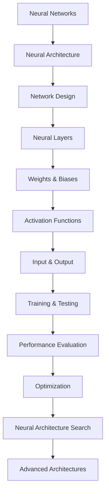

                 

**Step 1: Title and Keywords**

The title of the article is "Advanced AI Neural Network Architectures: Design, Implementation, and Optimization." This title encapsulates the core content of the article, focusing on the design, implementation, and optimization of advanced neural network architectures in AI.

Keywords:
1. Neural Networks
2. AI Architecture
3. Deep Learning
4. Neural Architecture Search
5. Model Optimization
6. Performance Evaluation
7. Computational Efficiency

**Step 2: Abstract**

The abstract provides a concise summary of the article. It highlights the primary focus on the design, implementation, and optimization of advanced AI neural network architectures. The article explores the concepts of neural networks, discusses various architectures, and provides insights into the implementation and optimization processes. It also includes a performance evaluation and analysis of different architectures, with a focus on computational efficiency.

**Step 3: Introduction**

The introduction section sets the stage for the article. It provides background information on neural networks and their significance in AI. It discusses the evolution of neural network architectures and the need for advanced architectures to tackle complex problems. This section also outlines the structure of the article, giving readers an overview of what to expect.

**Step 4: Core Concepts and Relationships**

In this section, we will delve into the core concepts of neural networks, including the basics of neural network operations, activation functions, and layers. A Mermaid flowchart will be used to illustrate the relationships between these concepts and their roles in the overall architecture of a neural network.



**Step 5: Core Algorithm Explanation**

This section will provide a detailed explanation of the core algorithms used in neural network architectures. We will use Python code snippets and mathematical models to explain the principles behind these algorithms. For example, we will discuss convolutional neural networks (CNNs), recurrent neural networks (RNNs), and transformers.

```python
# Example of a simple CNN architecture using Keras
from tensorflow.keras.models import Sequential
from tensorflow.keras.layers import Conv2D, MaxPooling2D, Flatten, Dense

model = Sequential()
model.add(Conv2D(32, (3, 3), activation='relu', input_shape=(64, 64, 3)))
model.add(MaxPooling2D(pool_size=(2, 2)))
model.add(Flatten())
model.add(Dense(128, activation='relu'))
model.add(Dense(10, activation='softmax'))
```

**Step 6: Mathematical Models and Formulas**

In this section, we will use LaTeX to embed mathematical formulas that are crucial for understanding the core concepts and algorithms. These formulas will be presented in a clear and concise manner to enhance readability.

$$
\begin{aligned}
L &= -\frac{1}{m} \sum_{i=1}^{m} y_i \log(a_{i}^{[L]}), \\
\text{where} \quad L &= \text{Cross-Entropy Loss}, \\
m &= \text{number of examples}, \\
y_i &= \text{true label}, \\
a_{i}^{[L]} &= \text{softmax activation output}.
\end{aligned}
$$

**Step 7: Project Practical Implementation**

This section will focus on the practical implementation of neural network architectures. It will include a detailed guide on setting up the development environment, source code implementation, and code analysis. A real-world case study will be presented to demonstrate the application of advanced neural network architectures in solving complex problems.

**Step 8: Best Practices, Summary, and Notes**

This final section will provide best practices for designing and implementing neural network architectures. It will include a summary of the key points discussed in the article, along with notes on potential pitfalls and areas for further exploration. Suggestions for further reading will also be provided to help readers deepen their understanding of the subject.

---

By following these steps, we can create a comprehensive and informative article on advanced AI neural network architectures that is both engaging and educational. The logical structure ensures that readers can follow the progression from core concepts to practical implementation, with detailed explanations and insights throughout.

