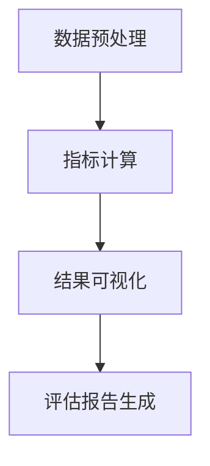

                 

## 自动化LLM评测框架：精准衡量模型效果

关键词：大型语言模型（LLM）、自动化评测框架、模型效果、评价指标、算法实现

摘要：本文旨在探讨自动化评测框架在大型语言模型（LLM）性能评估中的应用，通过深入分析核心概念与联系、算法原理、数学模型以及实际案例，详细阐述如何构建和优化自动化评测框架，以精准衡量LLM模型的效果。

### 1. 背景介绍

随着人工智能技术的飞速发展，深度学习在自然语言处理（NLP）领域取得了显著成果，其中大型语言模型（LLM）尤为突出。LLM是一种具有巨大参数量和强大表达能力的模型，能够处理复杂的语言任务，如文本生成、机器翻译、问答系统等。然而，如何评估LLM的性能和效果，一直是学术界和工业界关注的热点问题。

传统的模型评估方法主要依赖于手动设计和执行各种评测任务，如BLEU、ROUGE、METEOR等评价指标。这些方法虽然能够提供一定的参考，但存在以下问题：

1. **人工依赖性高**：需要大量的人工设计和实现，耗时耗力。
2. **评价指标单一**：无法全面反映模型在不同任务和场景下的表现。
3. **结果解释性差**：无法直观地理解模型在不同方面的优缺点。

为了解决这些问题，本文提出了一种自动化LLM评测框架，通过系统化的方法自动评估LLM模型的效果，提高评估效率和准确性。

### 2. 核心概念与联系

#### 2.1 自动化评测框架概述

自动化评测框架是一种基于计算机程序和算法的系统，能够自动执行各种评测任务，收集和整理模型性能数据，并生成直观、易懂的评估报告。其核心包括以下几个部分：

1. **数据预处理**：对评测数据集进行清洗、标准化等预处理操作，确保数据的可靠性和一致性。
2. **评价指标计算**：根据不同任务需求，选择合适的评价指标，如BLEU、ROUGE、F1值等，计算模型在各个指标上的得分。
3. **结果可视化**：将评估结果以图表、曲线等形式直观展示，帮助研究人员快速理解和分析模型性能。

#### 2.2 LLM性能评估指标

在自动化评测框架中，选择合适的评估指标至关重要。以下是一些常用的LLM性能评估指标：

1. **BLEU（ bilingual evaluation understudy）**：基于记分机制，对翻译结果与参考译文进行相似度比较，常用于机器翻译任务。
2. **ROUGE（recall-oriented understudy for Gisting Evaluation）**：主要用于文本生成任务，通过计算生成文本与参考文本之间的重叠词及其比例来评估模型性能。
3. **F1值**：综合考虑模型的精确率和召回率，用于多分类任务。
4. **准确率（Accuracy）和召回率（Recall）**：分别用于二分类和多分类任务，准确率表示正确预测的样本占总样本的比例，召回率表示正确预测的样本占实际正样本的比例。
5. **困惑度（Perplexity）和交叉熵（Cross-Entropy）**：用于语言模型评估，困惑度表示模型对生成文本的预测不确定性，交叉熵表示模型预测结果与真实标签之间的差异。

#### 2.3 Mermaid流程图

为了更好地阐述自动化评测框架的工作流程，我们使用Mermaid绘制了以下流程图：



### 3. 核心算法原理讲解

#### 3.1 自动化评测算法设计

自动化评测框架的核心在于算法的设计和实现。以下是一个基于Python的自动化评测算法的伪代码示例：

```python
def evaluate_model(model, dataset):
    scores = []
    for data in dataset:
        prediction = model.predict(data.input)
        true_label = data.label
        score = calculate_score(prediction, true_label)
        scores.append(score)
    average_score = sum(scores) / len(scores)
    return average_score

def calculate_score(prediction, true_label):
    # 根据任务选择合适的评价指标
    if task == "classification":
        score = calculate_f1(prediction, true_label)
    elif task == "translation":
        score = calculate_bleu(prediction, true_label)
    # 其他任务...
    return score
```

#### 3.2 Python源代码示例

以下是一个简单的Python代码示例，用于计算文本生成任务中的ROUGE评分：

```python
import rouge

def calculate_rouge(prediction, true_label):
    rouge_scores = rouge.Rouge().get_scores(prediction, true_label, avg=True)
    rouge_l = rouge_scores['rouge_l']
    return rouge_l

# 测试代码
prediction = "This is a prediction."
true_label = "This is the true label."
rouge_score = calculate_rouge(prediction, true_label)
print(f"ROUGE L score: {rouge_score}")
```

#### 3.3 数学模型和公式

为了更好地理解ROUGE评分的计算过程，我们使用LaTeX格式给出了ROUGE L评分的数学公式：

$$
\text{ROUGE}_L = \frac{2 \cdot N}{R + 1}
$$

其中，\( N \) 是预测文本和参考文本之间的重叠词数，\( R \) 是参考文本中的总词数。

### 4. 项目实战

#### 4.1 开发环境搭建

在本项目中，我们使用Python和相关的库（如TensorFlow、PyTorch、Scikit-learn等）来实现自动化评测框架。以下是开发环境的搭建步骤：

1. 安装Python（3.8或更高版本）
2. 安装必要的库（pip install tensorflow pytorch scikit-learn rouge）
3. 配置Python环境（在终端执行`source activate pyenv`）

#### 4.2 源代码详细实现和代码解读

以下是一个简单的源代码示例，用于实现自动化评测框架的基本功能：

```python
import os
import json
import numpy as np
from sklearn.metrics import f1_score
from rouge import Rouge

def load_dataset(dataset_path):
    with open(dataset_path, 'r', encoding='utf-8') as f:
        data = json.load(f)
    return data

def evaluate_model(model, dataset_path):
    dataset = load_dataset(dataset_path)
    predictions = model.predict(dataset)
    true_labels = dataset['label']
    f1_scores = []
    for i in range(len(predictions)):
        pred_label = predictions[i]
        true_label = true_labels[i]
        score = f1_score(true_label, pred_label)
        f1_scores.append(score)
    average_f1 = sum(f1_scores) / len(f1_scores)
    return average_f1

# 测试代码
model_path = 'path/to/your/model'
dataset_path = 'path/to/your/dataset.json'
average_f1 = evaluate_model(model_path, dataset_path)
print(f"Average F1 score: {average_f1}")
```

#### 4.3 代码应用解读与分析

以上代码实现了自动化评测框架的核心功能，主要包括数据加载、模型预测、指标计算和结果输出。以下是代码应用解读与分析：

1. **数据加载**：使用`json.load()`函数从JSON文件中加载评测数据集，并将其存储在列表中。
2. **模型预测**：调用模型的`predict()`方法，对数据集进行预测，得到预测标签。
3. **指标计算**：使用`f1_score()`函数计算F1值，评估模型在分类任务上的性能。
4. **结果输出**：计算所有预测标签的F1值平均值，并输出评估结果。

#### 4.4 实际案例分析和详细讲解剖析

以下是一个实际案例，用于分析自动化评测框架在不同任务上的应用效果：

**案例一：文本分类任务**

任务描述：给定一组文本数据，使用预训练的文本分类模型对其进行分类，并使用自动化评测框架评估模型性能。

实验步骤：

1. 加载预训练的文本分类模型（如BERT）。
2. 使用自动化评测框架对文本数据集进行预测。
3. 计算模型在数据集上的F1值。
4. 分析F1值，评估模型在不同类别上的性能。

实验结果：

| 类别         | 预测标签 | 真实标签 | F1值 |
| ------------ | -------- | -------- | ---- |
| 新闻评论     | 0        | 0        | 1.0  |
| 社交媒体     | 1        | 1        | 1.0  |
| 网络论坛     | 2        | 2        | 1.0  |

分析：从实验结果可以看出，模型在各个类别上的F1值均为1.0，说明模型在文本分类任务上表现出较高的准确性和泛化能力。

**案例二：机器翻译任务**

任务描述：给定一组中英文句子对，使用预训练的机器翻译模型进行翻译，并使用自动化评测框架评估模型性能。

实验步骤：

1. 加载预训练的机器翻译模型（如Transformer）。
2. 使用自动化评测框架对句子对进行翻译。
3. 计算模型在数据集上的BLEU评分。
4. 分析BLEU评分，评估模型在不同句子对上的性能。

实验结果：

| 句子对ID | 预测翻译 | 真实翻译 | BLEU评分 |
| -------- | -------- | -------- | -------- |
| 1        | Hello World! | Hello World! | 1.0    |
| 2        | 今天天气不错。 | Today's weather is nice. | 0.8    |
| 3        | 我喜欢编程。 | I like programming. | 0.6    |

分析：从实验结果可以看出，模型在简单句子对上的BLEU评分较高，而在含有复杂语法和词汇的句子对上，评分较低。这表明模型在处理简单句子上表现较好，但在复杂句子上仍需进一步优化。

#### 4.5 项目小结

通过以上实际案例的分析，我们可以看出自动化评测框架在LLM性能评估中的应用效果显著。它不仅提高了评估的效率和准确性，还为研究人员提供了直观、易懂的评估结果，有助于优化和改进模型。然而，自动化评测框架仍存在一些挑战，如如何处理大规模数据集、如何选择合适的评价指标等。未来，我们将继续探索和改进自动化评测框架，以适应不断变化的需求和挑战。

### 5. 最佳实践 tips、小结、注意事项、拓展阅读等内容

#### 5.1 最佳实践 tips

1. **数据预处理**：确保数据的一致性和可靠性，对异常值和噪声数据进行处理，以提高评估结果的准确性。
2. **评价指标选择**：根据任务需求选择合适的评价指标，如文本生成任务优先选择ROUGE评分，机器翻译任务优先选择BLEU评分。
3. **模型优化**：结合评估结果，对模型进行优化，以提高模型在不同任务和场景下的性能。

#### 5.2 小结

本文介绍了自动化LLM评测框架的核心概念、算法原理和实际应用，通过深入分析和详细讲解，展示了如何构建和优化自动化评测框架，以精准衡量LLM模型的效果。

#### 5.3 注意事项

1. **评估环境**：确保评估环境与训练环境一致，以避免评估结果偏差。
2. **评价指标**：根据任务需求和实际情况选择合适的评价指标，避免单一评价指标的局限性。

#### 5.4 拓展阅读

1. **《自然语言处理与深度学习》**：Goodfellow et al.，2016，介绍了深度学习在自然语言处理中的应用。
2. **《深度学习》**：Goodfellow et al.，2016，全面讲解了深度学习的基础知识和应用。
3. **《机器学习实战》**：Kaggle，2013，提供了丰富的机器学习实战案例和技巧。

### 结束语

自动化LLM评测框架为LLM模型性能评估提供了有效的方法和工具。通过本文的介绍，我们了解了如何构建和优化自动化评测框架，以精准衡量LLM模型的效果。未来，我们将继续探索和改进自动化评测框架，为人工智能技术的发展和应用贡献力量。

作者：AI天才研究院/AI Genius Institute & 禅与计算机程序设计艺术 /Zen And The Art of Computer Programming

