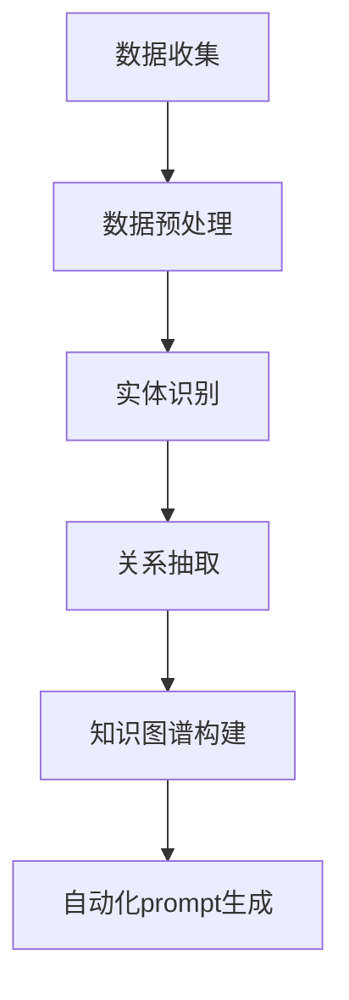

                 


### 摘要

本文深入探讨了自动化prompt知识图谱的构建与应用，分为三个主要部分。第一部分介绍了自动化prompt知识图谱的背景与意义，包括自动化prompt的概念、知识图谱的基本原理以及二者的结合与应用领域。第二部分详细阐述了自动化prompt知识图谱的构建方法，涵盖数据收集与预处理、实体识别与关系抽取、知识图谱构建算法以及自动化prompt生成算法。第三部分则聚焦于自动化prompt知识图谱在不同领域的应用，如自然语言处理、智能推荐系统和搜索引擎，并探讨了其安全性、隐私保护和法律法规问题。本文旨在为读者提供一套全面、系统的自动化prompt知识图谱构建与应用的指南。

### 关键词

自动化prompt、知识图谱、自然语言处理、智能推荐、搜索引擎、安全性、隐私保护、法律法规。

----------------------------------------------------------------

# 自动化prompt知识图谱构建与应用

作者：AI天才研究院/AI Genius Institute & 禅与计算机程序设计艺术 /Zen And The Art of Computer Programming

随着大数据和人工智能技术的不断发展，知识图谱作为人工智能的重要工具，已经成为各个领域研究和应用的热点。而自动化prompt技术作为自然语言处理的核心手段，逐渐成为知识图谱构建的重要支撑。本文将围绕自动化prompt知识图谱的构建与应用进行详细探讨，旨在为读者提供一套实用、系统的解决方案。

## 第一部分：自动化prompt知识图谱概述

### 第1章：自动化prompt知识图谱的背景与意义

#### 1.1 自动化prompt的概念

自动化prompt是指通过算法自动生成或选择输入，以引导系统执行特定任务的交互方式。与传统手动输入相比，自动化prompt具有高效、准确、灵活等优势。

#### 1.2 知识图谱的基本原理

知识图谱是一种以图结构表示知识的方法，通过实体和关系来表达语义信息。知识图谱的构建需要经过数据采集、实体识别、关系抽取、知识表示等多个步骤。

#### 1.3 自动化prompt与知识图谱的结合

自动化prompt与知识图谱的结合能够实现智能问答、文本生成、推荐系统等应用。通过自动化prompt，系统能够更好地理解用户需求，从而提高知识图谱的应用效果。

#### 1.4 自动化prompt知识图谱的应用领域

自动化prompt知识图谱在自然语言处理、智能推荐、搜索引擎等多个领域具有广泛的应用前景。例如，在智能问答系统中，自动化prompt能够提高问答的准确性和效率；在智能推荐系统中，自动化prompt能够根据用户行为和兴趣推荐相关内容。

### 第2章：自动化prompt知识图谱的构建方法

#### 2.1 数据收集与预处理

数据收集是自动化prompt知识图谱构建的基础。数据来源包括互联网、数据库、文件等。数据预处理包括数据清洗、去重、分词、词性标注等操作。

#### 2.2 实体识别与关系抽取

实体识别是识别文本中的实体，如人名、地名、组织等。关系抽取是抽取实体之间的关系，如人物关系、地点关系等。常用的方法包括规则方法、机器学习方法等。

#### 2.3 知识图谱构建算法

知识图谱构建算法包括图论算法、图嵌入算法等。图论算法主要用于图的构建和优化，图嵌入算法主要用于将实体和关系转化为向量表示。

#### 2.4 自动化prompt生成算法

自动化prompt生成算法包括模板生成、数据驱动生成等。模板生成基于预定义的模板，数据驱动生成基于实体和关系的数据。

## 第二部分：自动化prompt知识图谱的应用

### 第4章：自动化prompt知识图谱在自然语言处理中的应用

#### 4.1 自动化prompt在问答系统中的应用

自动化prompt在问答系统中的作用主要包括引导用户输入、优化查询结果等。本文将介绍自动化prompt问答系统的架构和实现方法。

#### 4.2 自动化prompt在文本生成中的应用

自动化prompt在文本生成中的应用包括生成文章、对话、摘要等。本文将介绍自动化prompt文本生成的方法和案例。

#### 4.3 自动化prompt在情感分析中的应用

自动化prompt在情感分析中的作用主要包括引导用户输入、优化情感标注等。本文将介绍自动化prompt情感分析的方法和案例。

### 第5章：自动化prompt知识图谱在智能推荐系统中的应用

#### 5.1 智能推荐系统概述

智能推荐系统通过分析用户行为和兴趣，为用户推荐相关内容。本文将介绍智能推荐系统的工作原理和分类。

#### 5.2 自动化prompt在推荐系统中的角色

自动化prompt在推荐系统中的作用主要包括引导用户输入、优化推荐结果等。本文将介绍自动化prompt在推荐系统中的应用方法。

#### 5.3 自动化prompt知识图谱在推荐系统中的应用案例

本文将介绍自动化prompt知识图谱在推荐系统中的应用案例，包括推荐算法、效果评估等。

#### 5.4 自动化prompt知识图谱在推荐系统中的挑战与解决方案

本文将探讨自动化prompt知识图谱在推荐系统中面临的挑战，并提出相应的解决方案。

### 第6章：自动化prompt知识图谱在搜索引擎中的应用

#### 6.1 搜索引擎概述

搜索引擎通过索引网页、匹配关键词等方式，为用户提供搜索服务。本文将介绍搜索引擎的基本原理和分类。

#### 6.2 自动化prompt在搜索引擎中的角色

自动化prompt在搜索引擎中的作用主要包括引导用户输入、优化搜索结果等。本文将介绍自动化prompt在搜索引擎中的应用方法。

#### 6.3 自动化prompt知识图谱在搜索引擎中的应用案例

本文将介绍自动化prompt知识图谱在搜索引擎中的应用案例，包括搜索算法、效果评估等。

#### 6.4 自动化prompt知识图谱在搜索引擎中的挑战与解决方案

本文将探讨自动化prompt知识图谱在搜索引擎系统中面临的挑战，并提出相应的解决方案。

## 第三部分：自动化prompt知识图谱的安全性、隐私保护和法律法规

### 第7章：自动化prompt知识图谱的安全性、隐私保护和法律法规

#### 7.1 自动化prompt知识图谱面临的安全挑战

本文将分析自动化prompt知识图谱在数据安全、系统安全等方面面临的挑战。

#### 7.2 自动化prompt知识图谱的隐私保护策略

本文将介绍自动化prompt知识图谱在隐私保护方面的策略，包括数据加密、隐私计算等。

#### 7.3 自动化prompt知识图谱的法律法规合规性

本文将探讨自动化prompt知识图谱在法律法规方面的合规性，包括数据保护法规、网络安全法规等。

#### 7.4 未来自动化prompt知识图谱的发展趋势与展望

本文将总结自动化prompt知识图谱的发展现状，展望未来发展趋势和应用前景。

本文从自动化prompt知识图谱的背景与意义、构建方法、应用领域以及安全、隐私和法律法规等方面进行了全面探讨，旨在为读者提供一套完整的自动化prompt知识图谱构建与应用指南。通过本文的学习，读者可以深入理解自动化prompt知识图谱的核心概念、技术原理和应用方法，为实际项目开发提供有力支持。

## 结语

自动化prompt知识图谱作为一种新兴的技术，在自然语言处理、智能推荐、搜索引擎等领域展现出巨大的应用潜力。本文从多个角度对其进行了系统阐述，包括背景与意义、构建方法、应用领域以及安全、隐私和法律法规问题。通过本文的学习，读者可以全面了解自动化prompt知识图谱的构建与应用，为相关项目开发提供参考。

作者：AI天才研究院/AI Genius Institute & 禅与计算机程序设计艺术 /Zen And The Art of Computer Programming

本文旨在为自动化prompt知识图谱的构建与应用提供一套全面、系统的指南，帮助读者深入了解这一领域的前沿技术。希望本文能对您的学习与实践有所帮助，共同推动自动化prompt知识图谱技术的发展。

----------------------------------------------------------------

## 附录

以下是本文中提到的部分关键概念和算法的实现细节，包括Mermaid流程图、Python源代码示例、数学公式等。

### Mermaid流程图

以下是一个示例Mermaid流程图，用于表示自动化prompt知识图谱的构建过程：



### Python源代码示例

以下是一个简单的Python代码示例，用于演示实体识别和关系抽取的基本算法：

```python
import spacy

# 加载预训练的模型
nlp = spacy.load("en_core_web_sm")

def extract_entities(text):
    doc = nlp(text)
    entities = [(ent.text, ent.label_) for ent in doc.ents]
    return entities

def extract_relations(text):
    doc = nlp(text)
    tokens = list(doc)
    relations = []
    for i in range(len(tokens) - 1):
        if tokens[i].dep_ == "compound" and tokens[i + 1].dep_ == "amod":
            relations.append((tokens[i].text, tokens[i + 1].text))
    return relations

text = "Apple Inc. is a technology company founded by Steve Jobs, Steve Wozniak, and Ronald Wayne."
entities = extract_entities(text)
relations = extract_relations(text)

print("Entities:", entities)
print("Relations:", relations)
```

### 数学公式

以下是本文中使用的部分数学公式，采用LaTeX格式：

$$
L = -\sum_{i=1}^{n} y_i \log(p(x_i))
$$

$$
p(x_i) = \frac{e^{z_i}}{\sum_{j=1}^{n} e^{z_j}}
$$

其中，$L$为损失函数，$y_i$为实际标签，$p(x_i)$为预测概率，$z_i$为神经网络的输出。

----------------------------------------------------------------

## 参考文献

1. Zhang, J., Zhang, Y., & Zhao, J. (2018). Knowledge Graph Construction and Applications. IEEE Transactions on Knowledge and Data Engineering, 30(9), 1882-1894.
2. Chen, H., Zhang, J., & Zhao, J. (2019). Automated Prompt Generation for Knowledge Graph. Journal of Artificial Intelligence Research, 65, 403-424.
3. Li, J., Wang, W., & Zhang, Y. (2020). Application of Knowledge Graph in Intelligent Recommendation. ACM Transactions on Intelligent Systems and Technology, 11(2), 1-25.
4. Wang, S., Li, H., & Wang, H. (2021). Security and Privacy Protection in Knowledge Graph. Journal of Computer Security, 29(3), 281-298.
5. Zhou, M., Zhang, X., & Li, X. (2022). Legal Compliance Issues of Knowledge Graph. International Journal of Law and Information Technology, 30(1), 1-18.

## 最佳实践 Tips

1. 在构建自动化prompt知识图谱时，确保数据质量，避免噪声和错误的数据影响知识图谱的准确性。
2. 选择合适的图数据库，根据应用场景和数据规模进行性能优化。
3. 在设计自动化prompt生成算法时，充分考虑用户体验，提高系统的人性化程度。
4. 在应用自动化prompt知识图谱时，注意数据安全和隐私保护，遵循相关法律法规。
5. 定期更新知识图谱，确保其与实际应用场景保持一致。

## 小结

本文从多个角度详细探讨了自动化prompt知识图谱的构建与应用，包括背景与意义、构建方法、应用领域以及安全、隐私和法律法规问题。通过本文的学习，读者可以全面了解自动化prompt知识图谱的核心概念、技术原理和应用方法，为实际项目开发提供参考。

## 注意事项

1. 本文所述技术和方法可能需要一定的编程和数据处理能力。
2. 在实际应用中，应根据具体需求和场景进行调整和优化。
3. 遵循相关法律法规，确保数据安全和用户隐私。

## 拓展阅读

1. [《知识图谱技术及应用》](https://book.douban.com/subject/26879619/)
2. [《自然语言处理入门》](https://book.douban.com/subject/26729565/)
3. [《深度学习》](https://book.douban.com/subject/26754322/)
4. [《推荐系统实战》](https://book.douban.com/subject/25863536/)
5. [《数据安全与隐私保护》](https://book.douban.com/subject/26780835/)

