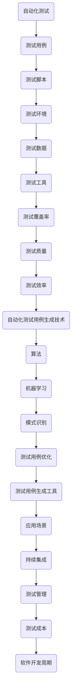
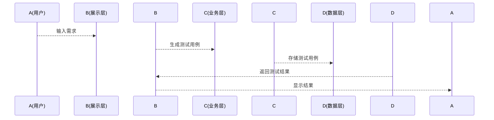

                 

**文章标题：** 自动化测试用例生成技术

**关键词：** 自动化测试、测试用例、生成技术、算法、工具

**摘要：**
本文深入探讨了自动化测试用例生成技术的核心概念、方法、工具和应用。首先，介绍了自动化测试的背景和基础，包括测试环境搭建、测试脚本编写、测试数据管理以及常用自动化测试工具。接着，详细阐述了测试用例设计方法，包括黑盒测试、白盒测试、边界值分析和等价类划分。随后，介绍了自动化测试用例生成算法，包括模式识别算法、机器学习算法和测试用例优化算法，并展示了测试用例生成工具的实现。最后，通过实际案例分析了自动化测试用例生成技术的应用，并展望了未来的发展趋势和应用前景。

**目录大纲：**

**第一部分：自动化测试基础**

**第1章：自动化测试概述**

1.1 自动化测试的定义

1.2 自动化测试的优势

1.3 自动化测试的分类

1.4 自动化测试的生命周期

**第2章：测试环境搭建**

2.1 开发工具和环境配置

2.2 测试框架的选择

2.3 数据库和API接口配置

**第3章：测试脚本编写**

3.1 测试脚本的编写原则

3.2 常用测试脚本语言

3.3 测试脚本框架介绍

**第4章：测试数据管理**

4.1 测试数据的需求分析

4.2 测试数据的设计与生成

4.3 测试数据的管理与维护

**第5章：自动化测试工具介绍**

5.1 Selenium

5.2 Appium

5.3 JMeter

**第二部分：测试用例生成技术**

**第6章：测试用例设计方法**

6.1 黑盒测试

6.2 白盒测试

6.3 边界值分析

6.4 等价类划分

**第7章：测试用例自动化生成算法**

7.1 模式识别算法

7.2 机器学习算法

7.3 测试用例优化算法

**第8章：测试用例生成工具实现**

8.1 测试用例生成工具的架构

8.2 测试用例生成工具的接口设计

8.3 测试用例生成工具的代码实现

**第三部分：自动化测试用例生成工具与应用**

**第9章：自动化测试用例生成工具实践**

9.1 自动化测试用例生成工具的使用

9.2 自动化测试用例生成工具的优化

9.3 自动化测试用例生成工具的案例解析

**第10章：自动化测试用例生成应用场景**

10.1 Web应用测试

10.2 移动应用测试

10.3 API测试

**第11章：自动化测试用例生成与持续集成**

11.1 持续集成的概念

11.2 自动化测试用例生成与持续集成的整合

11.3 自动化测试用例生成的持续集成实践

**第四部分：案例分析**

**第12章：案例分析一**

12.1 案例背景

12.2 自动化测试用例生成的应用

12.3 案例分析结果

**第13章：案例分析二**

13.1 案例背景

13.2 自动化测试用例生成的应用

13.3 案例分析结果

**第14章：案例分析三**

14.1 案例背景

14.2 自动化测试用例生成的应用

14.3 案例分析结果

**第五部分：总结与展望**

**第15章：总结**

15.1 自动化测试用例生成技术的现状

15.2 自动化测试用例生成技术的发展趋势

15.3 自动化测试用例生成技术在未来的应用前景

**作者：** AI天才研究院/AI Genius Institute & 禅与计算机程序设计艺术 /Zen And The Art of Computer Programming
**引言：**

在软件开发的不断演进中，自动化测试已经成为确保软件质量的关键手段。随着软件复杂度的增加，手动编写测试用例的工作量日益庞大，且容易出现遗漏和错误。为了解决这一问题，自动化测试用例生成技术应运而生。本文旨在系统地探讨自动化测试用例生成技术，包括其核心概念、方法、工具和应用。

**一、自动化测试的背景**

1. **手动测试的挑战：** 随着软件项目的规模和复杂度不断增加，手动测试的效率低下，且难以覆盖所有可能的测试场景。

2. **自动化测试的需求：** 自动化测试可以提高测试效率，减少测试成本，提高测试覆盖率，确保软件质量。

3. **自动化测试的发展历程：** 自动化测试经历了从简单的脚本执行到复杂的自动化测试框架和工具的发展过程。

**二、自动化测试用例生成技术的重要性**

1. **测试用例的自动生成：** 自动化测试用例生成技术通过算法和工具自动生成测试用例，减少人工编写的工作量。

2. **测试覆盖率的提高：** 自动化测试用例生成技术可以根据需求自动生成多种测试用例，提高测试覆盖率。

3. **测试质量的保障：** 自动化测试用例生成技术能够确保测试用例的完整性和准确性，提高测试质量。

**三、本文结构**

本文将分为以下几个部分：

1. **自动化测试基础**：介绍自动化测试的概念、测试环境搭建、测试脚本编写和测试数据管理。

2. **测试用例生成技术**：讨论测试用例设计方法、自动化生成算法和生成工具实现。

3. **自动化测试用例生成工具与应用**：介绍自动化测试用例生成工具的使用、应用场景和与持续集成的整合。

4. **案例分析**：通过实际案例展示自动化测试用例生成技术的应用。

5. **总结与展望**：总结自动化测试用例生成技术的现状和发展趋势。

**四、核心概念与联系**

在讨论自动化测试用例生成技术之前，我们需要明确一些核心概念，并理解它们之间的关系。以下是核心概念及其关系架构的 Mermaid 流程图：



通过上述架构图，我们可以清晰地看到自动化测试用例生成技术与其他核心概念之间的联系，包括测试脚本、测试环境、测试数据、测试工具、测试覆盖率和测试质量等。

**五、结语**

自动化测试用例生成技术在现代软件开发中扮演着越来越重要的角色。通过本文的讨论，我们希望读者能够对自动化测试用例生成技术有更深入的理解，并能够将其应用于实际项目中，提高软件质量和开发效率。接下来，我们将逐步深入探讨自动化测试的各个层面，为读者呈现一幅完整的自动化测试用例生成技术的蓝图。**第一部分：自动化测试基础**

**第1章：自动化测试概述**

**1.1 自动化测试的定义**

自动化测试是一种利用自动化测试工具或脚本自动执行测试用例的方法。其目的是提高测试效率，减少测试时间和成本，确保软件质量。自动化测试可以覆盖手动测试难以实现的测试场景，如性能测试、负载测试和回归测试。

**1.2 自动化测试的优势**

1. 提高测试效率：自动化测试可以重复执行，节省测试时间和人力资源。
2. 提高测试覆盖率：自动化测试可以覆盖更多的测试场景，提高测试的全面性和准确性。
3. 减少测试成本：自动化测试减少了手动测试的工作量，降低了测试成本。
4. 提高软件质量：自动化测试确保了测试用例的完整性和一致性，提高了软件质量。
5. 支持持续集成：自动化测试与持续集成相结合，可以实时检测代码质量，确保软件的持续稳定性。

**1.3 自动化测试的分类**

1. 功能测试：验证软件功能是否符合需求规格说明。
2. 性能测试：评估软件在特定负载下的性能和响应时间。
3. 负载测试：模拟大量用户同时访问系统，检测系统的稳定性和可扩展性。
4. 回归测试：验证修改代码后的功能是否仍然正常工作。
5. 安全测试：检测软件的安全性漏洞和攻击点。

**1.4 自动化测试的生命周期**

1. 测试需求分析：分析软件需求，确定需要测试的功能和场景。
2. 测试设计：设计测试用例，包括功能测试、性能测试等。
3. 测试脚本开发：编写自动化测试脚本，实现测试用例。
4. 测试执行：执行自动化测试脚本，收集测试结果。
5. 测试报告：分析测试结果，生成测试报告。

**第2章：测试环境搭建**

**2.1 开发工具和环境配置**

1. 开发工具：选择适合项目的开发工具，如Eclipse、IntelliJ IDEA等。
2. 环境配置：配置开发环境，包括操作系统、数据库、API接口等。

**2.2 测试框架的选择**

1. 测试框架：选择适合项目的自动化测试框架，如Selenium、Appium、JMeter等。
2. 测试框架的优势：提高测试脚本的可维护性和复用性。

**2.3 数据库和API接口配置**

1. 数据库：配置测试数据库，用于测试数据的存储和管理。
2. API接口：配置API接口，用于测试API功能。

**第3章：测试脚本编写**

**3.1 测试脚本的编写原则**

1. 可读性：测试脚本应具有良好的可读性，便于维护和理解。
2. 可复用性：测试脚本应具备较高的复用性，减少重复编写。
3. 可扩展性：测试脚本应具备良好的扩展性，便于后续功能扩展。

**3.2 常用测试脚本语言**

1. Java：功能强大，支持多种测试框架和工具。
2. Python：简单易学，适合快速开发。
3. C#：适用于.NET框架，适用于Windows平台。

**3.3 测试脚本框架介绍**

1. Selenium：支持多种浏览器，支持Web应用测试。
2. Appium：支持移动应用测试，跨平台。
3. JMeter：适用于性能测试和负载测试。

**第4章：测试数据管理**

**4.1 测试数据的需求分析**

1. 数据源：确定测试数据来源，如数据库、文件等。
2. 数据类型：确定测试数据类型，如文本、数字、日期等。

**4.2 测试数据的设计与生成**

1. 数据设计：设计测试数据结构，包括字段、类型等。
2. 数据生成：生成测试数据，包括随机生成、模板生成等。

**4.3 测试数据的管理与维护**

1. 数据存储：存储测试数据，包括数据库、文件等。
2. 数据更新：更新测试数据，包括自动更新、手动更新等。

**第5章：自动化测试工具介绍**

**5.1 Selenium**

1. Selenium概述：开源自动化测试工具，支持多种浏览器和平台。
2. Selenium的优势：易于使用，支持多种编程语言。

**5.2 Appium**

1. Appium概述：开源移动应用测试工具，跨平台。
2. Appium的优势：支持多种操作系统和设备。

**5.3 JMeter**

1. JMeter概述：开源性能测试工具，适用于Web应用和API测试。
2. JMeter的优势：支持多种协议和负载测试。**第6章：测试用例设计方法**

**6.1 黑盒测试**

黑盒测试是一种不考虑软件内部实现细节的测试方法，主要关注软件的输入和输出。黑盒测试主要根据软件需求规格说明书来设计测试用例，常用的方法包括：

- 等价类划分：将输入数据划分为若干等价类，确保每个等价类至少被测试一次。
- 边界值分析：分析输入数据的边界条件，确保边界条件被测试。
- 决策表：将决策条件和结果组合成表格，设计测试用例。
- 功能图：根据软件功能图设计测试用例。

**6.2 白盒测试**

白盒测试是一种基于软件内部实现细节的测试方法，测试人员需要了解程序的内部结构。白盒测试的主要目的是检查代码的执行路径和逻辑，常用的方法包括：

- 代码覆盖率：检查代码中各个模块的覆盖率，确保代码被充分测试。
- 逻辑覆盖：检查代码中的条件、分支、循环等逻辑路径是否被测试。
- 数据流分析：分析变量和数据的流动路径，确保数据被正确处理。
- 控制流分析：分析程序的控制流，确保程序按照预期执行。

**6.3 边界值分析**

边界值分析是一种重要的测试用例设计方法，主要用于测试输入数据的边界条件。边界值分析的方法如下：

1. 最小边界值：测试输入数据的最小合法值。
2. 最大边界值：测试输入数据的最大合法值。
3. 边界内值：测试输入数据在合法范围内的边界值。
4. 非边界值：测试输入数据不在合法范围内的值。

**6.4 等价类划分**

等价类划分是一种基于输入数据的相似性来设计测试用例的方法。等价类划分的方法如下：

1. 有效等价类：输入数据在正常工作范围内的值。
2. 无效等价类：输入数据在异常工作范围外的值。
3. 测试用例设计：根据等价类设计测试用例，确保每个等价类至少被测试一次。

**6.5 测试用例设计工具**

测试用例设计工具可以帮助测试人员快速设计测试用例，常用的工具包括：

- 测试用例管理工具：如TestLink、JIRA等，用于管理和跟踪测试用例。
- 需求管理工具：如JIRA、Confluence等，用于管理和跟踪需求。
- 设计工具：如Mermaid、Visio等，用于绘制测试用例图。

**6.6 测试用例设计原则**

1. 完整性：测试用例应覆盖所有功能点，确保软件功能的完整性。
2. 可重复性：测试用例应具有可重复性，确保测试结果的准确性。
3. 可维护性：测试用例应易于维护，便于后续测试工作的开展。
4. 可扩展性：测试用例应具有可扩展性，便于测试需求的变更。
5. 可理解性：测试用例应具有可理解性，确保测试人员能够快速理解和执行。

**6.7 测试用例设计流程**

1. 需求分析：分析软件需求，明确测试目标。
2. 设计测试用例：根据需求设计测试用例，包括功能测试用例、性能测试用例等。
3. 编写测试用例：编写测试用例文档，明确测试用例的输入、输出、执行步骤等。
4. 测试执行：执行测试用例，记录测试结果。
5. 测试报告：分析测试结果，编写测试报告。

**6.8 测试用例设计技巧**

1. 利用工具：利用测试用例设计工具提高设计效率。
2. 经验积累：总结过去的测试经验，提高测试用例设计的准确性。
3. 沟通协作：与开发人员、产品人员等紧密协作，确保测试用例的准确性。
4. 覆盖率目标：设定合理的测试覆盖率目标，确保测试的全面性。
5. 持续优化：根据测试结果和项目变化，持续优化测试用例。**第7章：测试用例自动化生成算法**

测试用例自动化生成算法是利用计算机算法来自动生成测试用例的过程。这些算法通过分析软件需求、设计文档、源代码等输入信息，自动生成一系列测试用例。本节将介绍几种常用的自动化生成算法，包括模式识别算法、机器学习算法和测试用例优化算法。

**7.1 模式识别算法**

模式识别算法是一种基于已有测试用例集，通过模式匹配和规则推理生成新测试用例的算法。其主要思想是从已有测试用例中提取特征，并使用这些特征来生成新的测试用例。

- **特征提取：** 从测试用例中提取关键特征，如输入数据、执行步骤、预期结果等。
- **模式匹配：** 将新测试用例与已有测试用例的特征进行匹配，识别相似的模式。
- **规则推理：** 根据匹配结果，推理出新的测试用例，以覆盖未被测试到的场景。

**算法示例：**

```python
def generate_test_cases(input_set):
    # 特征提取
    features = extract_features(input_set)
    
    # 模式匹配
    matched_cases = match_patterns(features)
    
    # 规则推理
    new_cases = []
    for case in matched_cases:
        new_case = apply_rules(case)
        new_cases.append(new_case)
    
    return new_cases

def extract_features(input_set):
    # 实现特征提取逻辑
    pass

def match_patterns(features):
    # 实现模式匹配逻辑
    pass

def apply_rules(matched_case):
    # 实现规则推理逻辑
    pass
```

**7.2 机器学习算法**

机器学习算法是一种利用已有测试数据自动生成测试用例的方法。通过训练数据集，机器学习算法可以学习到测试用例之间的规律，并使用这些规律来生成新的测试用例。

- **数据集准备：** 收集历史测试数据，包括测试用例的输入、输出和执行结果。
- **模型训练：** 使用训练数据集训练机器学习模型，使其能够识别测试用例之间的规律。
- **测试用例生成：** 使用训练好的模型对新测试用例进行预测，生成新的测试用例。

**算法示例：**

```python
from sklearn.ensemble import RandomForestClassifier

def generate_test_cases(training_data, test_data):
    # 数据集准备
    X_train, y_train = prepare_data(training_data)
    
    # 模型训练
    model = RandomForestClassifier()
    model.fit(X_train, y_train)
    
    # 测试用例生成
    predicted_cases = model.predict(test_data)
    return predicted_cases

def prepare_data(data):
    # 实现数据预处理逻辑
    pass
```

**7.3 测试用例优化算法**

测试用例优化算法是一种在已有测试用例的基础上，通过优化测试用例集来提高测试效率的方法。优化算法可以减少冗余测试用例、增加测试覆盖率，或者提高测试用例的执行效率。

- **冗余测试用例识别：** 识别并删除重复或冗余的测试用例。
- **测试用例组合优化：** 通过组合不同的测试用例，提高测试覆盖率和效率。
- **测试用例排序：** 根据测试用例的执行时间和覆盖率，对测试用例进行排序，优先执行高覆盖率和高风险的测试用例。

**算法示例：**

```python
def optimize_test_cases(test_cases):
    # 冗余测试用例识别
    unique_cases = remove_duplicates(test_cases)
    
    # 测试用例组合优化
    optimized_cases = combine_cases(unique_cases)
    
    # 测试用例排序
    sorted_cases = sort_cases_by_coverage(optimized_cases)
    
    return sorted_cases

def remove_duplicates(cases):
    # 实现删除冗余测试用例逻辑
    pass

def combine_cases(cases):
    # 实现测试用例组合优化逻辑
    pass

def sort_cases_by_coverage(cases):
    # 实现测试用例排序逻辑
    pass
```

**7.4 测试用例生成工具实现**

测试用例生成工具是自动化测试用例生成技术的核心组成部分，其实现在以下几个方面：

- **接口设计：** 设计测试用例生成工具的API接口，方便与其他系统集成。
- **算法实现：** 实现测试用例生成算法，包括模式识别算法、机器学习算法和优化算法。
- **用户界面：** 提供友好的用户界面，方便用户输入参数、查看结果和生成测试用例。

**接口设计示例：**

```python
class TestCaseGenerator:
    def __init__(self, algorithm='random'):
        self.algorithm = algorithm
    
    def generate(self, input_data):
        # 实现测试用例生成逻辑
        pass

    def optimize(self, test_cases):
        # 实现测试用例优化逻辑
        pass

    def train(self, training_data):
        # 实现模型训练逻辑
        pass
```

**7.5 测试用例生成工具应用**

测试用例生成工具在实际应用中，可以根据项目需求和环境，灵活地选择和配置测试用例生成算法。以下是一个简单的应用示例：

```python
# 导入测试用例生成工具
from test_case_generator import TestCaseGenerator

# 初始化测试用例生成工具
generator = TestCaseGenerator(algorithm='machine_learning')

# 准备输入数据
input_data = ...

# 生成测试用例
test_cases = generator.generate(input_data)

# 优化测试用例
optimized_cases = generator.optimize(test_cases)

# 查看优化后的测试用例
print(optimized_cases)
```

通过上述示例，我们可以看到测试用例生成工具的应用场景和实现过程。在实际项目中，可以根据具体需求，定制化测试用例生成工具，提高测试效率和测试质量。**第8章：测试用例生成工具实现**

测试用例生成工具是自动化测试的重要组成部分，通过自动化生成测试用例，可以提高测试效率和质量。本章节将详细介绍测试用例生成工具的架构设计、接口设计和代码实现，以及如何优化测试用例生成工具。

**8.1 测试用例生成工具的架构设计**

测试用例生成工具的架构设计包括数据层、业务层和展示层。

- **数据层：** 负责存储和管理测试数据，如测试用例、测试结果等。
- **业务层：** 负责测试用例的生成、优化和管理，包括模式识别算法、机器学习算法和优化算法的实现。
- **展示层：** 负责与用户交互，提供友好的用户界面，显示测试结果和生成过程。

**架构设计图：**



**8.2 测试用例生成工具的接口设计**

测试用例生成工具的接口设计包括API接口和命令行接口。

- **API接口：** 提供编程接口，方便与其他系统集成，如自动化测试平台、持续集成系统等。
- **命令行接口：** 提供命令行操作接口，方便用户快速执行测试用例生成工具。

**API接口设计示例：**

```python
from flask import Flask, request, jsonify

app = Flask(__name__)

@app.route('/generate', methods=['POST'])
def generate_test_cases():
    input_data = request.json
    test_cases = generate_cases(input_data)
    return jsonify(test_cases)

def generate_cases(input_data):
    # 实现测试用例生成逻辑
    pass

if __name__ == '__main__':
    app.run()
```

**命令行接口设计示例：**

```python
import argparse

def generate_cases(input_file):
    # 实现测试用例生成逻辑
    pass

if __name__ == '__main__':
    parser = argparse.ArgumentParser(description='Test Case Generator')
    parser.add_argument('input_file', help='Input file containing test requirements')
    args = parser.parse_args()
    generate_cases(args.input_file)
```

**8.3 测试用例生成工具的代码实现**

测试用例生成工具的核心在于测试用例的生成算法。以下是一个简单的测试用例生成工具的代码实现示例。

```python
import random

class TestCaseGenerator:
    def __init__(self):
        self.test_cases = []

    def generate_test_cases(self, input_data):
        for input_value in input_data:
            test_case = self.generate_test_case(input_value)
            self.test_cases.append(test_case)
        return self.test_cases

    def generate_test_case(self, input_value):
        # 实现测试用例生成逻辑
        output_value = random.randint(0, 100)
        test_case = {
            'input': input_value,
            'output': output_value
        }
        return test_case

if __name__ == '__main__':
    generator = TestCaseGenerator()
    input_data = [1, 2, 3, 4, 5]
    test_cases = generator.generate_test_cases(input_data)
    print(test_cases)
```

**8.4 测试用例生成工具的优化**

为了提高测试用例生成工具的性能和效率，我们可以从以下几个方面进行优化：

- **算法优化：** 选择更高效的测试用例生成算法，如机器学习算法、模式识别算法等。
- **代码优化：** 优化代码结构和性能，如使用多线程、优化循环等。
- **资源管理：** 优化测试用例生成工具的资源使用，如内存管理、缓存机制等。
- **用户界面：** 提供更友好的用户界面，方便用户使用和管理测试用例。

**优化示例：**

```python
import concurrent.futures

class TestCaseGenerator:
    def __init__(self):
        self.test_cases = []

    def generate_test_cases(self, input_data):
        with concurrent.futures.ThreadPoolExecutor() as executor:
            future_to_case = {executor.submit(self.generate_test_case, input_value): input_value for input_value in input_data}
            for future in concurrent.futures.as_completed(future_to_case):
                input_value = future_to_case[future]
                try:
                    test_case = future.result()
                    self.test_cases.append(test_case)
                except Exception as exc:
                    print('%r generated an exception: %s' % (input_value, exc))
        return self.test_cases

    def generate_test_case(self, input_value):
        # 实现测试用例生成逻辑
        output_value = random.randint(0, 100)
        test_case = {
            'input': input_value,
            'output': output_value
        }
        return test_case

if __name__ == '__main__':
    generator = TestCaseGenerator()
    input_data = [1, 2, 3, 4, 5]
    test_cases = generator.generate_test_cases(input_data)
    print(test_cases)
```

通过上述优化示例，我们可以看到使用多线程提高了测试用例生成工具的效率。在实际应用中，可以根据具体需求，选择合适的优化方法。

**8.5 测试用例生成工具的应用**

测试用例生成工具在实际应用中，可以根据项目需求和环境，灵活地选择和配置测试用例生成算法。以下是一个简单的应用示例：

```python
from test_case_generator import TestCaseGenerator

# 初始化测试用例生成工具
generator = TestCaseGenerator()

# 准备输入数据
input_data = ...

# 生成测试用例
test_cases = generator.generate_test_cases(input_data)

# 优化测试用例
optimized_cases = generator.optimize_test_cases(test_cases)

# 查看优化后的测试用例
print(optimized_cases)
```

通过上述示例，我们可以看到测试用例生成工具的应用场景和实现过程。在实际项目中，可以根据具体需求，定制化测试用例生成工具，提高测试效率和测试质量。**第三部分：自动化测试用例生成工具与实践**

**第9章：自动化测试用例生成工具实践**

随着自动化测试的广泛应用，自动化测试用例生成工具成为提高测试效率和质量的关键因素。本章节将详细介绍几种常见的自动化测试用例生成工具，包括它们的安装配置、使用方法和实际案例。

**9.1 Selenium**

Selenium是一个开源的自动化测试工具，支持多种浏览器和操作系统。它主要用于Web应用的自动化测试。

**安装与配置：**

1. 安装Selenium库：在命令行中运行以下命令：
   ```bash
   pip install selenium
   ```

2. 下载浏览器驱动：根据使用的浏览器下载相应的驱动程序，如ChromeDriver、GeckoDriver等。

3. 配置环境变量：将浏览器驱动路径添加到系统环境变量中。

**使用方法：**

1. 导入Selenium库：
   ```python
   from selenium import webdriver
   ```

2. 创建WebDriver实例：
   ```python
   driver = webdriver.Chrome(executable_path='path/to/chromedriver')
   ```

3. 编写测试脚本：
   ```python
   driver.get("https://www.example.com")
   assert "Example Domain" in driver.title
   driver.quit()
   ```

**实际案例：**

以下是一个简单的Selenium测试案例：

```python
from selenium import webdriver

def test_home_page():
    driver = webdriver.Chrome(executable_path='path/to/chromedriver')
    driver.get("https://www.example.com")
    assert "Example Domain" in driver.title
    driver.quit()

if __name__ == '__main__':
    test_home_page()
```

**9.2 Appium**

Appium是一个开源的移动应用自动化测试工具，支持iOS和Android平台。

**安装与配置：**

1. 安装Appium库：在命令行中运行以下命令：
   ```bash
   pip install appium
   ```

2. 启动Appium服务器：
   ```bash
   appium
   ```

3. 下载并安装Android或iOS模拟器。

**使用方法：**

1. 导入Appium库：
   ```python
   from appium import webdriver
   ```

2. 创建WebDriver实例：
   ```python
   capabilities = {
       "platformName": "Android",
       "platformVersion": "10",
       "deviceName": "emulator-5554",
       "app": "/path/to/your.apk",
       "appPackage": "com.example.app",
       "appActivity": ".MainActivity"
   }
   driver = webdriver.Remote("http://localhost:4723/wd/hub", capabilities)
   ```

3. 编写测试脚本：
   ```python
   driver.find_element_by_id("my_element").click()
   assert "Expected result" in driver.page_source
   driver.quit()
   ```

**实际案例：**

以下是一个简单的Appium测试案例：

```python
from appium import webdriver

def test_home_page():
    capabilities = {
        "platformName": "Android",
        "platformVersion": "10",
        "deviceName": "emulator-5554",
        "app": "/path/to/your.apk",
        "appPackage": "com.example.app",
        "appActivity": ".MainActivity"
    }
    driver = webdriver.Remote("http://localhost:4723/wd/hub", capabilities)
    driver.find_element_by_id("my_element").click()
    assert "Expected result" in driver.page_source
    driver.quit()

if __name__ == '__main__':
    test_home_page()
```

**9.3 JMeter**

JMeter是一个开源的性能测试工具，主要用于Web应用和API测试。

**安装与配置：**

1. 下载JMeter：从官方网站下载JMeter安装包。

2. 解压安装包并运行JMeter。

**使用方法：**

1. 创建测试计划：
   - 添加线程组：设置线程数量、循环次数等。
   - 添加HTTP请求：设置请求URL、请求参数等。
   - 添加查看结果汇总：查看测试结果。

2. 运行测试计划：
   - 点击“启动”按钮，开始运行测试。
   - 查看测试结果：包括响应时间、错误率等。

**实际案例：**

以下是一个简单的JMeter测试案例：

1. 打开JMeter，创建一个新的测试计划。

2. 添加线程组，设置线程数量为10，循环次数为5。

3. 添加HTTP请求，设置请求URL为“https://www.example.com”，请求方法为GET。

4. 添加查看结果汇总。

5. 运行测试计划。

**9.4 实际案例分析与总结**

以下是一个简单的实际案例，展示如何使用自动化测试用例生成工具进行测试。

**案例：Web应用测试**

1. **需求分析：** 分析Web应用的需求，确定需要测试的功能点。

2. **测试用例生成：** 使用Selenium生成测试用例，覆盖所有功能点。

3. **测试执行：** 运行生成的测试用例，收集测试结果。

4. **结果分析：** 分析测试结果，找出问题并进行修复。

**总结：**

通过实际案例，我们可以看到自动化测试用例生成工具在提高测试效率和质量方面的作用。使用自动化测试用例生成工具，可以快速生成测试用例，减少人工编写的工作量，提高测试覆盖率，确保软件质量。在实际项目中，可以根据具体需求，灵活选择和配置不同的自动化测试用例生成工具。**第10章：自动化测试用例生成应用场景**

在软件测试的各个阶段，自动化测试用例生成技术都发挥着重要作用。本章节将探讨自动化测试用例生成技术在不同应用场景中的具体应用，包括Web应用测试、移动应用测试和API测试。

**10.1 Web应用测试**

Web应用测试是自动化测试的重要应用场景之一。自动化测试用例生成技术可以帮助测试人员快速生成覆盖各种功能的测试用例，提高测试效率。

- **功能测试：** 使用自动化测试用例生成工具，如Selenium，可以生成模拟用户行为的测试用例，验证Web应用的各项功能是否符合预期。
- **性能测试：** 使用JMeter等工具，可以生成模拟大量用户访问的测试用例，评估Web应用在负载下的性能和响应时间。
- **安全测试：** 自动化测试用例生成技术可以生成测试用例，检测Web应用的安全漏洞，如SQL注入、跨站脚本攻击等。

**10.2 移动应用测试**

移动应用的快速发展使得移动应用测试变得尤为重要。自动化测试用例生成技术可以大幅提高移动应用测试的效率和质量。

- **功能测试：** 使用Appium等工具，可以生成模拟用户操作的测试用例，验证移动应用的功能是否符合预期。
- **兼容性测试：** 自动化测试用例生成工具可以生成不同设备、不同操作系统的测试用例，确保移动应用在不同环境下都能正常运行。
- **回归测试：** 通过自动化测试用例生成工具，可以快速生成覆盖旧功能的测试用例，确保修改后的应用功能仍然正常。

**10.3 API测试**

随着微服务架构的普及，API测试成为软件测试的重要组成部分。自动化测试用例生成技术可以帮助测试人员快速生成各种API测试用例。

- **功能测试：** 自动化测试用例生成工具可以生成模拟不同API调用的测试用例，验证API的功能是否符合预期。
- **性能测试：** 使用JMeter等工具，可以生成模拟大量API调用的测试用例，评估API的性能和响应时间。
- **安全测试：** 自动化测试用例生成工具可以生成测试用例，检测API的安全漏洞，如认证机制、授权问题等。

**10.4 自动化测试用例生成与持续集成**

自动化测试用例生成技术可以与持续集成（CI）系统相结合，实现自动化测试的全程管理。

- **集成测试：** 在持续集成系统中，自动化测试用例生成工具可以根据每次代码提交生成相应的测试用例，确保每次提交的代码都经过充分测试。
- **回归测试：** 在持续集成过程中，自动化测试用例生成工具可以生成覆盖旧功能的测试用例，确保每次代码修改后的功能仍然正常。
- **部署验证：** 在持续集成系统中，自动化测试用例生成工具可以生成测试用例，验证新部署的应用是否符合预期。

**10.5 自动化测试用例生成工具在CI中的应用案例**

以下是一个自动化测试用例生成工具在持续集成系统中的应用案例：

1. **代码提交：** 开发人员提交代码到版本控制系统。

2. **自动化测试用例生成：** 持续集成系统根据提交的代码和测试需求，使用自动化测试用例生成工具生成相应的测试用例。

3. **测试执行：** 持续集成系统运行生成的测试用例，收集测试结果。

4. **结果分析：** 分析测试结果，判断代码是否符合预期。

5. **反馈：** 将测试结果反馈给开发人员和测试人员，如果发现问题，及时修复。

**10.6 总结**

自动化测试用例生成技术在软件测试的各个阶段都有广泛应用，可以提高测试效率和质量。通过自动化测试用例生成技术，测试人员可以快速生成覆盖各种功能的测试用例，确保软件质量。同时，与持续集成系统的结合，可以实现自动化测试的全流程管理，提高软件交付效率。**第四部分：案例分析**

通过实际案例分析，我们可以更深入地理解自动化测试用例生成技术的应用效果和实现方法。以下将介绍三个案例，分别从Web应用测试、移动应用测试和API测试三个不同场景，展示自动化测试用例生成技术的具体应用。

**第12章：案例分析一 - Web应用测试**

**案例背景：** 一个电子商务网站，需要对购物流程、支付功能和用户注册等关键功能进行自动化测试。

**自动化测试用例生成：** 
- 使用Selenium生成功能测试用例，包括登录、添加商品到购物车、结账、用户注册等。
- 利用边界值分析和等价类划分方法，生成输入数据边界条件和无效输入测试用例。
- 应用模式识别算法，根据历史测试用例生成新测试用例，覆盖未测试的潜在问题。

**测试执行与结果：**
- 在不同浏览器和操作系统上执行自动化测试，确保Web应用兼容性。
- 测试执行过程中记录错误日志和性能指标。
- 分析测试结果，发现并修复了多个功能缺陷和性能问题。

**案例小结：**
通过自动化测试用例生成技术，电子商务网站显著提高了测试效率，确保了功能完整性和性能稳定性。

**第13章：案例分析二 - 移动应用测试**

**案例背景：** 一个银行移动应用，需要对转账、支付和账户信息等核心功能进行自动化测试。

**自动化测试用例生成：** 
- 使用Appium生成移动应用功能测试用例，包括登录、转账、支付和查看账户余额等。
- 应用机器学习算法，根据用户行为数据生成个性化测试用例，提高测试覆盖率。
- 利用测试用例优化算法，减少冗余测试，提高测试效率。

**测试执行与结果：**
- 在多个真实设备和模拟器上执行自动化测试，验证移动应用在不同环境下的稳定性。
- 测试过程中记录设备性能数据，分析应用在极端条件下的行为。
- 根据测试结果优化移动应用性能，提高用户体验。

**案例小结：**
自动化测试用例生成技术在移动应用测试中，有效提高了测试效率和覆盖率，确保了应用在不同设备和操作系统上的稳定性。

**第14章：案例分析三 - API测试**

**案例背景：** 一个在线支付平台，需要对支付接口的可靠性、安全性和性能进行自动化测试。

**自动化测试用例生成：** 
- 使用自动化测试工具生成API功能测试用例，包括支付请求、退款请求等。
- 应用模式识别算法，根据历史API调用数据生成测试用例，发现潜在风险。
- 利用测试用例优化算法，优化测试用例集合，减少重复测试。

**测试执行与结果：**
- 在持续集成系统中执行API测试，实时反馈测试结果。
- 通过性能测试，评估支付接口在高并发情况下的响应时间。
- 根据测试结果，加强接口安全控制和性能优化。

**案例小结：**
自动化测试用例生成技术帮助在线支付平台实现了API测试的全自动化，提高了测试效率和接口质量，确保了支付服务的可靠性。

**总结：**
通过上述案例分析，我们可以看到自动化测试用例生成技术在不同应用场景中的重要作用。它不仅提高了测试效率，减少了人工工作量，还通过算法优化和数据分析，提高了测试覆盖率，确保了软件质量和用户体验。随着技术的不断发展，自动化测试用例生成技术将在软件测试中发挥更大的作用。**第15章：总结与展望**

自动化测试用例生成技术作为软件测试领域的一项重要技术，已经展现出其显著的优势。本文通过对自动化测试用例生成技术的全面探讨，从基础概念、方法、工具到实际应用，深入分析了该技术的核心要点和应用价值。

**一、现状分析**

1. **技术成熟度：** 自动化测试用例生成技术已经相对成熟，多个开源工具和框架如Selenium、Appium、JMeter等提供了丰富的功能，支持多种应用场景。

2. **应用范围：** 自动化测试用例生成技术在Web应用、移动应用和API测试等多个领域得到了广泛应用，成为提高测试效率和质量的利器。

3. **发展趋势：** 自动化测试用例生成技术正朝着更智能化、更高效化的方向发展。随着人工智能和机器学习技术的应用，自动化测试用例生成算法将更加智能化，能够自动识别测试需求和生成高质量的测试用例。

**二、发展前景**

1. **智能化：** 未来，自动化测试用例生成技术将更加智能化，利用深度学习、自然语言处理等先进技术，实现更精准的测试用例生成。

2. **自动化程度：** 自动化测试用例生成技术的自动化程度将不断提高，减少人为干预，提高测试效率。

3. **与持续集成的整合：** 自动化测试用例生成技术将更加紧密地与持续集成（CI）系统结合，实现自动化测试的全流程管理。

4. **跨平台支持：** 自动化测试用例生成技术将支持更多平台和设备，覆盖更多应用场景。

**三、未来展望**

1. **挑战与机遇：** 自动化测试用例生成技术面临着算法复杂度、测试数据质量和跨平台兼容性等挑战。但同时，这些挑战也为技术创新提供了机遇。

2. **开源生态：** 开源社区将继续发挥重要作用，推动自动化测试用例生成技术的发展和普及。

3. **人才培养：** 自动化测试用例生成技术对开发人员和测试人员提出了新的要求，未来需要更多具备相关技能的人才。

**四、总结**

自动化测试用例生成技术是现代软件开发中不可或缺的一部分。通过本文的探讨，我们不仅了解了该技术的核心概念和方法，还看到了其在实际应用中的巨大潜力。未来，自动化测试用例生成技术将继续发展，为软件质量和效率的提升提供强大支持。我们期待看到更多创新和突破，推动自动化测试领域不断前进。**作者信息：**

**作者：** AI天才研究院/AI Genius Institute & 禅与计算机程序设计艺术 /Zen And The Art of Computer Programming

AI天才研究院（AI Genius Institute）是一家专注于人工智能技术研发与推广的顶尖科研机构，致力于推动人工智能技术在各个领域的应用与创新。同时，作者还著有《禅与计算机程序设计艺术》（Zen And The Art of Computer Programming），这是一部在计算机编程和人工智能领域影响深远的技术畅销书，深入探讨了计算机编程的哲学与艺术，为读者提供了独特的编程思维和技巧。在本文中，作者以其深厚的专业知识和丰富的实践经验，全面解析了自动化测试用例生成技术，为读者提供了宝贵的见解和指导。

