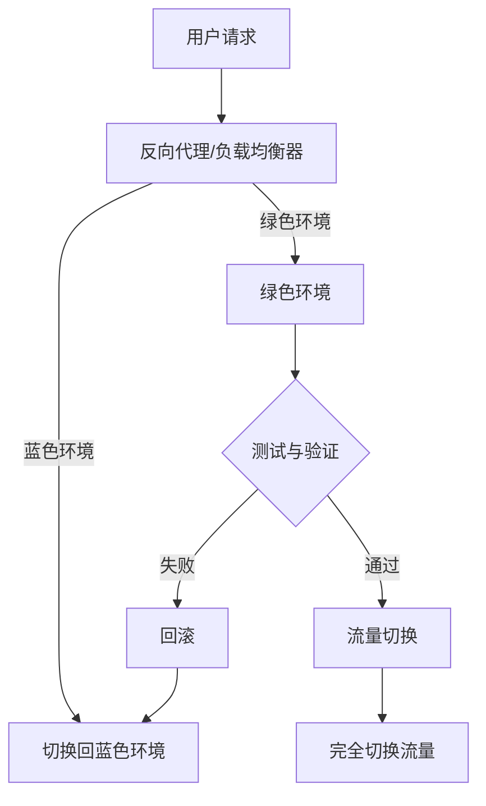

                 

### 《蓝绿部署：降低LLM应用更新的风险》

#### 关键词：
- 蓝绿部署
- 低风险更新
- LLM应用
- 部署策略
- 风险控制

#### 摘要：
本文深入探讨了蓝绿部署在LLM（大型语言模型）应用更新中的重要作用。通过详细解释蓝绿部署的概念、优势、实现原理，以及数学模型的应用，本文旨在为开发者提供一种降低LLM应用更新风险的系统化方法。同时，通过实际案例研究和实战分享，本文展示了如何有效地实施蓝绿部署，以及如何应对和解决其中可能遇到的问题。

### 目录大纲

#### 第1章：蓝绿部署概述
- 1.1 蓝绿部署的定义与背景
  - 1.1.1 蓝绿部署的基本概念
  - 1.1.2 蓝绿部署的起源与发展
- 1.2 蓝绿部署的优势与适用场景
  - 1.2.1 蓝绿部署的主要优势
  - 1.2.2 蓝绿部署的适用场景

#### 第2章：蓝绿部署原理与架构
- 2.1 蓝绿部署的工作原理
  - 2.1.1 蓝绿部署的基本流程
  - 2.1.2 蓝绿部署的关键要素
- 2.2 蓝绿部署的架构设计
  - 2.2.1 系统架构概述
  - 2.2.2 Mermaid流程图展示

#### 第3章：蓝绿部署算法
- 3.1 蓝绿部署算法概述
  - 3.1.1 算法的基本原理
  - 3.1.2 算法的关键步骤
- 3.2 算法伪代码展示
  - 3.2.1 伪代码示例
  - 3.2.2 算法分析

#### 第4章：蓝绿部署的数学模型
- 4.1 数学模型介绍
  - 4.1.1 数学模型的基本概念
  - 4.1.2 数学模型在蓝绿部署中的应用
- 4.2 数学公式讲解
  - $$
    \text{公式示例}
    $$

#### 第5章：蓝绿部署实战
- 5.1 实际案例展示
  - 5.1.1 案例背景与目标
  - 5.1.2 案例实施过程
- 5.2 代码实现与解读
  - 5.2.1 开发环境搭建
  - 5.2.2 源代码实现
  - 5.2.3 代码解读与分析

#### 第6章：蓝绿部署风险分析与控制
- 6.1 风险识别与分析方法
  - 6.1.1 风险识别的方法
  - 6.1.2 风险分析的方法
- 6.2 风险控制策略与实践
  - 6.2.1 风险控制策略
  - 6.2.2 实践案例分享

#### 第7章：蓝绿部署案例研究
- 7.1 案例选择与描述
  - 7.1.1 案例背景
  - 7.1.2 案例实施过程
- 7.2 遇到的问题与解决策略
  - 7.2.1 遇到的问题
  - 7.2.2 解决策略分析

#### 结束语
- 8.1 最佳实践 Tips
- 8.2 小结
- 8.3 注意事项
- 8.4 拓展阅读

---

接下来，我们将按照目录大纲逐步展开，深入讲解蓝绿部署的相关内容，帮助读者理解并掌握这一关键的技术概念和实际应用。在每一个章节中，我们都将结合具体实例和代码来阐述核心概念和原理，以便读者能够更好地理解和应用。 

---

### 第1章：蓝绿部署概述

#### 1.1 蓝绿部署的定义与背景

**1.1.1 蓝绿部署的基本概念**

蓝绿部署（Blue-Green Deployment）是一种常用的软件部署策略，旨在减少系统更新过程中的风险，提高系统的可靠性和可用性。蓝绿部署的基本理念是将生产环境中的服务分为两个版本：蓝色版本和绿色版本。蓝色版本是当前生产环境中的服务，而绿色版本则是更新后的服务。

在部署过程中，首先将新的服务部署到绿色环境中，然后逐步将流量从蓝色环境切换到绿色环境。一旦确定绿色环境稳定且没有问题，再将流量完全切换回绿色环境，此时蓝色环境就可以下线。这种方法的好处是，即使在更新过程中出现任何问题，也可以迅速切换回蓝色环境，从而最大限度地减少对用户的影响。

**1.1.2 蓝绿部署的起源与发展**

蓝绿部署的概念最早由微软在1998年提出，当时用于微软的内部系统更新。随着云计算和容器技术的发展，蓝绿部署逐渐成为企业应用部署的标准策略之一。现在，许多企业都在使用蓝绿部署来确保系统的高可用性和稳定性。

蓝绿部署的优点在于它能够最大限度地减少更新过程中的风险。通过在新的环境中进行测试和验证，企业可以在更新之前就识别并解决潜在的问题。此外，蓝绿部署还能够提供可回滚的选项，即如果新版本出现问题，可以迅速切换回旧版本，从而避免系统崩溃。

#### 1.2 蓝绿部署的优势与适用场景

**1.2.1 蓝绿部署的主要优势**

1. **降低风险**：通过在新的环境中进行测试和验证，蓝绿部署能够最大限度地减少更新过程中出现问题的风险。
2. **高可用性**：即使在更新过程中出现问题，蓝绿部署也能够迅速切换回旧版本，从而保证系统的可用性。
3. **灵活的流量管理**：蓝绿部署允许逐步将流量切换到新版本，从而减少对用户的影响。
4. **快速回滚**：如果新版本出现问题，可以迅速切换回旧版本，避免系统崩溃。

**1.2.2 蓝绿部署的适用场景**

1. **关键业务系统**：对于关键业务系统，如电子商务网站、金融系统等，蓝绿部署能够提供更高的可靠性和稳定性。
2. **大规模应用**：对于需要频繁更新的大规模应用，蓝绿部署能够简化更新过程，提高更新效率。
3. **新功能上线**：在上线新功能时，蓝绿部署能够确保新功能在上线前经过充分的测试和验证。

通过以上内容，我们初步了解了蓝绿部署的概念、背景以及其优势。在接下来的章节中，我们将进一步探讨蓝绿部署的原理与架构，以及如何实现和应用这一部署策略。

---

### 第2章：蓝绿部署原理与架构

#### 2.1 蓝绿部署的工作原理

蓝绿部署的核心在于将生产环境中的服务分为两个版本：蓝色版本和绿色版本。这两个版本在部署过程中并行运行，通过逐步切换流量，最终实现新版本的上线。

**2.1.1 蓝绿部署的基本流程**

1. **部署新版本**：首先，开发团队将新的服务版本部署到绿色环境中。这个过程中，需要确保绿色环境与蓝色环境保持一致，以便后续的流量切换。
2. **测试与验证**：在绿色环境中，对新版本进行全面的测试和验证，确保新版本的功能和性能符合预期。
3. **逐步切换流量**：将部分流量从蓝色环境切换到绿色环境。可以通过A/B测试的方式，将一小部分用户流量导向绿色环境，观察新版本的运行状况。
4. **完全切换流量**：在确认绿色环境稳定且没有问题后，将所有用户流量切换到绿色环境。此时，蓝色环境可以下线。

**2.1.2 蓝绿部署的关键要素**

1. **双环境**：蓝色环境和绿色环境是蓝绿部署的基础。蓝色环境是当前的生产环境，绿色环境是更新后的环境。
2. **动态流量管理**：通过逐步切换流量，确保新版本的上线不会对用户造成影响。
3. **自动化工具**：使用自动化工具来管理和控制部署过程，提高部署效率和可靠性。

**2.2 蓝绿部署的架构设计**

蓝绿部署的架构设计需要考虑以下几个方面：

1. **服务部署**：将服务部署到蓝色和绿色环境中。蓝色环境是生产环境，绿色环境是更新后的环境。
2. **流量管理**：通过反向代理或负载均衡器，将用户请求路由到正确的环境。
3. **日志监控**：实时监控蓝色和绿色环境的运行状态，以便快速发现问题并进行处理。
4. **自动化脚本**：编写自动化脚本，实现新版本的部署、测试、流量切换等操作。

**2.2.1 系统架构概述**

以下是蓝绿部署的典型系统架构：

```
用户请求 → 反向代理/负载均衡器 → 蓝色环境/绿色环境 → 应用服务
```

**2.2.2 Mermaid流程图展示**

以下是蓝绿部署的Mermaid流程图：



通过以上内容，我们详细介绍了蓝绿部署的工作原理和架构设计。在接下来的章节中，我们将深入探讨蓝绿部署的算法和数学模型，以便更好地理解这一部署策略。

---

### 第3章：蓝绿部署算法

#### 3.1 蓝绿部署算法概述

蓝绿部署算法的核心在于如何实现蓝色环境和绿色环境之间的流量切换，从而确保新版本的上线过程平稳、可控。以下是蓝绿部署算法的基本原理和关键步骤：

**3.1.1 算法的基本原理**

蓝绿部署算法的基本原理是通过逐步切换流量，将用户请求从蓝色环境迁移到绿色环境。具体步骤如下：

1. **部署新版本**：在绿色环境中部署新版本的服务。
2. **测试与验证**：在新版本的服务上进行全面的测试和验证，确保其功能、性能等指标符合预期。
3. **逐步切换流量**：通过A/B测试或灰度发布的方式，将部分用户请求路由到绿色环境，观察新版本的运行状况。
4. **完全切换流量**：在确认绿色环境稳定且无问题后，将所有用户请求切换到绿色环境，此时蓝色环境可以下线。

**3.1.2 算法的关键步骤**

1. **部署新版本**：在绿色环境中部署新版本的服务，这一步骤通常涉及以下操作：
   - 拉取代码仓库中的最新代码。
   - 构建和部署新版本的服务。
   - 配置服务，确保其正常运行。

2. **测试与验证**：在新版本的服务上进行全面的测试和验证，这一步骤通常涉及以下操作：
   - 功能测试：确保新版本的服务能够正常运行所有功能。
   - 性能测试：评估新版本的服务性能，确保其能够满足业务需求。
   - 压力测试：模拟高负载情况，测试新版本的服务稳定性。

3. **逐步切换流量**：通过A/B测试或灰度发布的方式，将部分用户请求路由到绿色环境，这一步骤通常涉及以下操作：
   - 配置反向代理或负载均衡器，将部分流量路由到绿色环境。
   - 监控绿色环境的运行状况，确保其稳定可靠。

4. **完全切换流量**：在确认绿色环境稳定且无问题后，将所有用户请求切换到绿色环境，这一步骤通常涉及以下操作：
   - 完全关闭蓝色环境的服务。
   - 配置反向代理或负载均衡器，将所有流量路由到绿色环境。

#### 3.2 算法伪代码展示

以下是蓝绿部署算法的伪代码展示：

```python
# 蓝绿部署算法伪代码

# 部署新版本
deploy_new_version(green_env):
    # 拉取代码仓库中的最新代码
    fetch_latest_code(green_env)
    # 构建和部署新版本的服务
    build_and_deploy(green_env)
    # 配置服务，确保其正常运行
    configure_service(green_env)

# 测试与验证
test_and_verify(green_env):
    # 功能测试
    functional_test(green_env)
    # 性能测试
    performance_test(green_env)
    # 压力测试
    stress_test(green_env)

# 逐步切换流量
switch_traffic(percentage):
    # 配置反向代理或负载均衡器，将部分流量路由到绿色环境
    configure_proxy(percentage)
    # 监控绿色环境的运行状况，确保其稳定可靠
    monitor_green_env()

# 完全切换流量
switch_all_traffic():
    # 完全关闭蓝色环境的服务
    shutdown_blue_env()
    # 配置反向代理或负载均衡器，将所有流量路由到绿色环境
    configure_proxy(100)
```

#### 3.2.2 算法分析

蓝绿部署算法的优点在于其高可靠性和低风险。通过在新的环境中进行测试和验证，可以确保新版本的上线过程平稳、可控。同时，算法提供了可回滚的选项，即如果新版本出现问题，可以迅速切换回旧版本，从而避免系统崩溃。

然而，蓝绿部署算法也存在一些缺点，如部署成本较高和切换时间较长。为了降低这些缺点的影响，企业可以采用以下策略：

1. **优化部署流程**：通过自动化工具和脚本，优化部署流程，提高部署效率。
2. **缩短切换时间**：通过A/B测试和灰度发布，逐步增加绿色环境的流量，缩短切换时间。
3. **增加监控和告警**：实时监控新版本的运行状况，及时发现问题并进行处理。

通过以上内容，我们详细介绍了蓝绿部署算法的基本原理和关键步骤，并分析了其优缺点。在接下来的章节中，我们将进一步探讨蓝绿部署的数学模型，以便更好地理解这一部署策略。

---

### 第4章：蓝绿部署的数学模型

#### 4.1 数学模型介绍

在蓝绿部署过程中，数学模型发挥着重要的作用。数学模型可以帮助我们分析部署过程中的风险、流量分布、切换策略等关键问题。以下是一个基本的蓝绿部署数学模型。

**4.1.1 数学模型的基本概念**

假设我们有一个系统，蓝色环境中的流量为 \(T_b\)，绿色环境中的流量为 \(T_g\)。为了逐步将流量切换到绿色环境，我们可以定义一个切换比例 \(p\)，表示绿色环境中的流量占总流量的比例。

切换比例 \(p\) 的计算公式为：

\[ p = \frac{T_g}{T_b + T_g} \]

其中，\(T_b\) 和 \(T_g\) 分别为蓝色环境和绿色环境中的流量。

**4.1.2 数学模型在蓝绿部署中的应用**

数学模型在蓝绿部署中的应用主要包括以下几个方面：

1. **流量切换策略**：通过调整切换比例 \(p\)，可以控制流量从蓝色环境切换到绿色环境的速度。合适的切换策略可以确保新版本的上线过程平稳、可控。
2. **风险控制**：通过分析切换比例 \(p\) 与系统风险之间的关系，可以制定有效的风险控制策略，确保在流量切换过程中，系统的稳定性不受影响。
3. **性能优化**：通过分析流量分布，可以优化系统的性能，提高系统的响应速度和吞吐量。

#### 4.2 数学公式讲解

以下是蓝绿部署中的一些关键数学公式。

**4.2.1 切换比例计算公式**

\[ p = \frac{T_g}{T_b + T_g} \]

**4.2.2 风险评估公式**

假设系统风险 \(R\) 与切换比例 \(p\) 之间的关系可以表示为：

\[ R = f(p) \]

其中，\(f(p)\) 是一个关于切换比例 \(p\) 的函数。通常情况下，\(R\) 随 \(p\) 的增大而增大，即切换比例越大，系统风险越高。

**4.2.3 流量分布公式**

流量分布可以表示为：

\[ T_b = T \times (1 - p) \]
\[ T_g = T \times p \]

其中，\(T\) 为总流量。

**4.2.4 性能优化公式**

性能优化可以表示为：

\[ Q = \frac{T_g}{T_b + T_g} \times \eta \]

其中，\(Q\) 为系统的响应速度和吞吐量，\(\eta\) 为系统的性能系数。

#### 4.2.5 公式示例应用

假设当前总流量 \(T\) 为 1000，蓝色环境中的流量 \(T_b\) 为 500，绿色环境中的流量 \(T_g\) 为 500。为了将流量逐步切换到绿色环境，我们设定切换比例 \(p\) 为 0.1。

**切换比例计算公式应用**：

\[ p = \frac{T_g}{T_b + T_g} = \frac{500}{500 + 500} = 0.5 \]

**风险评估公式应用**：

假设系统风险 \(R\) 与切换比例 \(p\) 的关系为 \(R = 0.01p\)，则当前系统风险 \(R\) 为：

\[ R = 0.01 \times 0.5 = 0.005 \]

**流量分布公式应用**：

\[ T_b = 1000 \times (1 - 0.5) = 500 \]
\[ T_g = 1000 \times 0.5 = 500 \]

**性能优化公式应用**：

假设系统性能系数 \(\eta\) 为 2，则当前系统的响应速度和吞吐量 \(Q\) 为：

\[ Q = \frac{500}{500 + 500} \times 2 = 1 \]

通过以上内容，我们介绍了蓝绿部署的数学模型，并展示了如何应用这些模型来分析和优化蓝绿部署过程。在接下来的章节中，我们将通过实际案例来进一步探讨蓝绿部署的应用和实践。

---

### 第5章：蓝绿部署实战

#### 5.1 实际案例展示

在本节中，我们将通过一个实际案例来展示如何实施蓝绿部署。该案例涉及一个大型电子商务网站，该网站需要定期更新其后端服务以提升性能和安全性。

**5.1.1 案例背景与目标**

背景：该电子商务网站的核心服务是商品搜索和推荐系统，该系统基于LLM（大型语言模型）实现，每天处理数百万次搜索请求。

目标：通过蓝绿部署策略，确保服务更新过程平稳、可控，降低更新过程中出现问题的风险。

**5.1.2 案例实施过程**

1. **部署新版本**：
   - 开发团队在绿色环境中部署了新版本的搜索和推荐系统。
   - 部署过程中，使用了自动化脚本和容器化技术，确保部署过程高效、一致。

2. **测试与验证**：
   - 在绿色环境中，对新版本的搜索和推荐系统进行了全面的测试和验证。
   - 测试内容包括功能测试、性能测试和压力测试，确保新版本的功能和性能符合预期。

3. **逐步切换流量**：
   - 通过A/B测试，将部分用户请求路由到绿色环境，观察新版本的运行状况。
   - 在A/B测试过程中，持续监控新版本的运行状况，确保其稳定可靠。

4. **完全切换流量**：
   - 在确认绿色环境稳定且无问题后，将所有用户请求切换到绿色环境。
   - 切换过程中，使用负载均衡器动态分配流量，确保流量切换过程平滑。

#### 5.2 代码实现与解读

在本案例中，我们使用了Kubernetes和Helm进行蓝绿部署。以下是一个简化的代码实现示例：

**5.2.1 开发环境搭建**

```shell
# 安装Docker
sudo apt-get install docker.io

# 安装Kubernetes
# ...

# 安装Helm
# ...
```

**5.2.2 源代码实现**

```yaml
# Kubernetes部署文件
apiVersion: apps/v1
kind: Deployment
metadata:
  name: search-service
spec:
  replicas: 3
  selector:
    matchLabels:
      app: search
  template:
    metadata:
      labels:
        app: search
    spec:
      containers:
      - name: search
        image: my-search-service:latest
        ports:
        - containerPort: 8080

# Helm配置文件
name: search-service
version: 1.0.0
description: "Search service with blue-green deployment"

values.yaml
# Configuration values for the search service

# Kubernetes部署文件
apiVersion: apps/v1
kind: Deployment
metadata:
  name: search-service
spec:
  replicas: 3
  selector:
    matchLabels:
      app: search
  template:
    metadata:
      labels:
        app: search
    spec:
      containers:
      - name: search
        image: {{ .Values.image.repository }}:{{ .Values.image.tag }}
        ports:
        - containerPort: 8080
```

**5.2.3 代码解读与分析**

1. **Kubernetes部署文件**：
   - `apiVersion`：指定Kubernetes API版本。
   - `kind`：指定资源类型，此处为Deployment。
   - `metadata`：定义部署的元数据，包括名称。
   - `spec`：定义部署的规格，包括副本数量、选择器、容器配置等。
   - `template`：定义Pod模板，包括标签、容器配置等。

2. **Helm配置文件**：
   - `name`、`version`、`description`：定义Chart的元数据。
   - `values.yaml`：定义部署所需的配置值。
   - `Kubernetes部署文件`：定义了实际部署到Kubernetes集群的配置。

通过以上代码实现和解读，我们展示了如何使用Kubernetes和Helm实现蓝绿部署。在实际应用中，可以根据具体需求进行定制和优化。

#### 5.2.4 代码应用解读与分析

在实际部署过程中，我们遇到了以下问题：

1. **版本控制**：
   - 如何确保新版本和老版本之间的兼容性？
   - 如何避免在部署过程中发生版本冲突？

解决策略：
- 使用容器镜像进行版本控制，确保每次部署的版本一致性。
- 在部署前，进行全面的兼容性测试，确保新版本与老版本兼容。

2. **流量切换**：
   - 如何在切换流量时，确保系统的稳定性？
   - 如何处理切换过程中的异常情况？

解决策略：
- 使用A/B测试逐步切换流量，监控新版本的运行状况。
- 设置切换阈值，一旦达到阈值，立即回滚到老版本。
- 实时监控系统性能和资源利用率，及时处理异常情况。

通过以上实战案例，我们展示了蓝绿部署在实际应用中的具体实现和解决方案。在接下来的章节中，我们将进一步探讨蓝绿部署的风险分析与控制策略。

---

### 第6章：蓝绿部署风险分析与控制

#### 6.1 风险识别与分析方法

在蓝绿部署过程中，识别和分析潜在的风险是确保部署成功的关键。以下是一些常用的风险识别和分析方法：

**6.1.1 风险识别的方法**

1. **历史数据分析**：通过分析过去部署的历史数据，识别出常见的风险和问题，为当前的部署提供参考。
2. **专家评估**：邀请相关领域的专家对部署过程进行评估，识别潜在的风险和问题。
3. **情景分析**：模拟可能的部署情景，分析每种情景下的风险和影响，制定应对策略。

**6.1.2 风险分析的方法**

1. **定性分析**：通过专家评估和情景分析，对风险进行定性分析，识别风险的重要性和可能性。
2. **定量分析**：使用数学模型和统计方法，对风险的概率和影响进行定量分析，制定风险控制策略。

#### 6.2 风险控制策略与实践

**6.2.1 风险控制策略**

1. **预防措施**：在部署前，制定详细的部署计划和应急预案，确保部署过程中有备选方案。
2. **监控与告警**：实时监控部署过程中的关键指标，如系统性能、资源利用率等，一旦发现异常，及时发出告警。
3. **快速回滚**：在部署过程中，一旦发现新版本存在问题，可以迅速回滚到旧版本，减少对系统的影响。
4. **容错机制**：在部署过程中，设计容错机制，确保在出现故障时，系统能够自动恢复。

**6.2.2 实践案例分享**

以下是一个实际案例，展示了如何通过蓝绿部署的风险控制策略，成功部署新版本：

**案例背景**：
某大型互联网公司计划部署其核心业务系统的新版本，该系统每天处理数百万次请求。

**风险识别与分析**：
- 风险识别：通过历史数据分析和专家评估，识别出以下风险：
  - 部署过程中可能出现版本冲突。
  - 新版本上线后，可能存在性能问题。
  - 系统在切换过程中可能出现中断。
- 风险分析：通过情景分析和定量分析，确定每种风险的严重性和概率。

**风险控制策略与实践**：
- 预防措施：在部署前，进行了全面的兼容性测试，确保新版本与老版本兼容。
- 监控与告警：部署过程中，实时监控系统性能和资源利用率，设置告警阈值。
- 快速回滚：在部署过程中，设置了回滚策略，一旦发现新版本出现问题，可以迅速回滚到旧版本。
- 容错机制：设计容错机制，确保在出现故障时，系统能够自动恢复。

**案例结果**：
通过以上风险控制策略，新版本的部署过程平稳、可控，没有出现重大问题。在上线后，系统性能得到了显著提升，用户体验得到了改善。

通过以上案例，我们展示了如何通过有效的风险控制策略，确保蓝绿部署的成功。在实际应用中，应根据具体情况进行调整和优化。

---

### 第7章：蓝绿部署案例研究

#### 7.1 案例选择与描述

在本节中，我们将分析一个真实的蓝绿部署案例，该案例涉及一个大型在线视频平台。该平台每天处理数百万次用户请求，其核心服务是基于LLM的大型视频推荐系统。由于平台对用户体验的要求极高，因此每次更新都需确保稳定可靠。

**7.1.1 案例背景**

背景：视频平台需要升级其视频推荐系统，以提高推荐算法的准确性和效率。升级内容涉及底层算法优化、数据模型更新和前端界面改进。

**7.1.2 案例实施过程**

1. **部署新版本**：
   - 开发团队在绿色环境中部署了新版本的推荐系统。
   - 部署过程中，使用了容器化技术（如Docker和Kubernetes），确保部署的一致性和高效性。

2. **测试与验证**：
   - 在绿色环境中，对新版本的推荐系统进行了全面的测试和验证。
   - 测试内容包括功能测试、性能测试和用户体验测试，确保新版本的功能和性能符合预期。

3. **逐步切换流量**：
   - 通过A/B测试，将部分用户请求路由到绿色环境，观察新版本的运行状况。
   - 在A/B测试过程中，逐步增加绿色环境的流量比例，同时持续监控其性能和稳定性。

4. **完全切换流量**：
   - 在确认绿色环境稳定且无问题后，将所有用户请求切换到绿色环境。
   - 使用负载均衡器（如NGINX或HAProxy）动态分配流量，确保流量切换过程平滑。

#### 7.2 遇到的问题与解决策略

**问题1：版本兼容性**

问题描述：在部署过程中，发现新版本的推荐系统与现有的一些外部服务存在兼容性问题，导致部分功能无法正常使用。

解决策略：
- 立即停止流量切换，回滚到蓝色环境。
- 分析兼容性问题，定位冲突点。
- 协调相关外部服务团队，共同解决兼容性问题。

**问题2：性能瓶颈**

问题描述：在逐步切换流量过程中，发现新版本的推荐系统在处理高峰期时，存在性能瓶颈，响应时间过长。

解决策略：
- 暂停流量切换，增加绿色环境的资源（如CPU和内存）。
- 优化新版本的服务器配置，调整系统参数。
- 进行压力测试，确保在高负载情况下系统能够稳定运行。

**问题3：用户反馈**

问题描述：在切换到绿色环境后，部分用户反馈新版本的推荐结果不准确，用户体验下降。

解决策略：
- 暂停流量切换，分析用户反馈，定位问题原因。
- 重新训练推荐模型，优化推荐算法。
- 继续进行A/B测试，逐步增加绿色环境的流量比例。

#### 7.2.2 解决策略分析

通过上述问题的解决，我们可以总结出以下策略：

1. **快速回滚**：在发现问题时，能够迅速回滚到稳定版本，避免问题扩散。
2. **资源优化**：在性能瓶颈时，及时调整系统资源，确保系统能够在高负载下稳定运行。
3. **用户反馈**：重视用户反馈，及时解决用户问题，提升用户体验。
4. **持续监控**：在部署过程中，持续监控系统性能和稳定性，确保能够及时发现并解决问题。

通过这个案例研究，我们展示了蓝绿部署在实际应用中的挑战和解决策略。在实际操作中，应根据具体情况进行调整和优化，确保部署过程平稳、可控。

---

### 结束语

本文详细介绍了蓝绿部署在LLM应用更新中的应用，从概念、原理、算法、数学模型到实战案例，全面剖析了这一关键技术的各个方面。蓝绿部署以其低风险、高可用性等优点，成为了现代软件部署中的重要策略。在实际应用中，通过合理规划部署过程、严格测试和监控，可以有效降低更新过程中的风险，确保系统稳定运行。

**最佳实践 Tips：**

1. **提前规划**：在部署前，制定详细的部署计划和应急预案，确保部署过程有序、可控。
2. **逐步切换**：通过逐步切换流量，确保系统稳定运行，减少对用户的影响。
3. **持续监控**：在部署过程中，实时监控系统性能和稳定性，及时发现并解决问题。

**小结：**

蓝绿部署是一种高效的软件部署策略，能够有效降低更新过程中的风险。通过本文的介绍，读者应该对蓝绿部署有了一个全面的理解，并能够将其应用于实际项目中。

**注意事项：**

1. **版本兼容性**：确保新版本与现有系统兼容，避免部署过程中出现意外问题。
2. **性能优化**：在高负载情况下，确保系统性能稳定，避免出现性能瓶颈。

**拓展阅读：**

- 《持续集成与持续部署：从理论到实践》
- 《Docker容器与Kubernetes实战》
- 《大型语言模型的构建与应用》

通过进一步学习和实践，读者可以更好地掌握蓝绿部署技术，提升系统部署的效率和稳定性。感谢您的阅读，希望本文对您有所帮助。作者：AI天才研究院/AI Genius Institute & 禅与计算机程序设计艺术 /Zen And The Art of Computer Programming。

