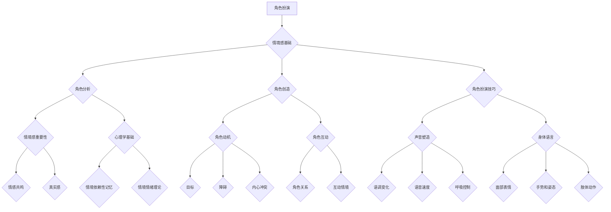

                 

### 角色扮演与情境感基础

#### 1.1.1 角色扮演的定义与历史背景

角色扮演是一种通过扮演不同角色来模拟现实生活或虚构世界中的行为和互动的活动。它起源于古代的戏剧表演和宗教仪式，随着人类社会的发展，逐渐演变出多种形式，如剧场表演、角色扮演游戏（RPG）、教育模拟等。

**角色扮演的起源：**

- **古代戏剧：** 古埃及、希腊和罗马等文明都有戏剧表演的传统。在古希腊，戏剧是一种重要的艺术形式，演员通过扮演不同角色，表达故事情节和道德观念。
- **宗教仪式：** 在古代，宗教仪式中常包含角色扮演，通过扮演角色来再现神话故事，传达宗教信仰。

**角色扮演的分类：**

- **剧场表演：** 专业的戏剧演员在舞台上扮演角色，通过表演传达故事和情感。
- **角色扮演游戏：** 玩家通过扮演角色在虚拟世界中探险、完成任务，如《巫师3：狂猎》和《宝可梦》系列。
- **教育模拟：** 在教育领域，角色扮演用于模拟现实情境，帮助学生理解复杂概念，如医学教育中的手术模拟。

#### 1.1.2 情境感的重要性

情境感在角色扮演中起着至关重要的作用。它不仅影响演员的表现，还直接影响观众对角色的理解和共鸣。

**情境感在角色扮演中的影响：**

- **情感共鸣：** 情境感使演员能够更好地传达角色的情感状态，观众更容易产生情感共鸣。
- **角色塑造：** 情境感帮助演员理解角色的背景和动机，从而更准确地塑造角色形象。
- **真实感：** 情境感增强角色扮演的真实感，使观众更容易沉浸于虚构世界。

**情境感的心理学基础：**

- **情境依赖性记忆：** 人们在回忆信息时，情境因素会显著影响记忆的准确性和效果。
- **情境情绪理论：** 人们在情境中产生的情绪会直接影响他们的认知和行为。

#### 1.1.3 角色扮演的理论框架

**社会角色理论：**

- **定义：** 社会角色是个人在社会互动中扮演的特定角色，具有特定的权利和义务。
- **角色扮演的过程：** 社会角色通过角色学习、角色扮演和角色内化等过程形成。

**情境认知理论：**

- **定义：** 情境认知是指认知活动受情境因素的影响，情境与认知相互作用，共同影响个体的行为和决策。
- **情境认知的关键要素：** 情境、认知主体、认知过程和认知结果。

通过上述分析，我们可以看到角色扮演和情境感在各自领域中的重要性，以及它们之间的相互关系。接下来，我们将探讨角色扮演的实践方法，深入了解角色分析、角色创造和角色扮演技巧，以便更好地理解如何在角色扮演中增强情境感。

### 2.1 角色分析

#### 2.1.1 角色分析的方法与技巧

角色分析是角色扮演的关键步骤，通过深入分析角色，演员能够更好地理解角色的背景、动机和行为模式，从而更准确地塑造角色形象。以下是一些常用的角色分析方法与技巧：

**1. 文档分析：**

- **剧本分析：** 通过仔细阅读剧本，了解角色的性格特点、动机和目标。
- **背景资料：** 研究角色的历史、家庭背景、社会地位等信息，帮助理解角色的行为和情感。

**2. 角色画像：**

- **性格特征：** 根据剧本和背景资料，为角色绘制性格画像，包括性格类型、价值观和情感状态。
- **外貌特征：** 角色画像中还包括角色的外貌特征，如身高、体重、肤色等。

**3. 情境模拟：**

- **心理情境：** 模拟角色在不同情境下的心理状态和行为反应，如面对挑战时的态度、在社交场合中的行为等。
- **物理情境：** 考虑角色所在的环境，如室内、户外、城市或乡村等。

**4. 对话分析：**

- **语言风格：** 分析角色的语言风格，包括语速、语调、词汇选择等。
- **对话动机：** 理解角色对话中的动机，包括表达情感、传递信息或争取支持等。

**5. 行为观察：**

- **实地观察：** 观察现实中类似角色的行为，获取灵感。
- **模仿练习：** 通过模仿观察到的行为，增强对角色的理解。

**6. 情境测试：**

- **情景再现：** 创造模拟的情境，让演员在特定情境中表现，观察其反应。
- **角色扮演练习：** 通过与他人互动，测试角色的适应性和表现力。

**实践案例：**

以电视剧《权力的游戏》中的角色“提利昂·兰尼斯特”为例，角色分析过程如下：

- **剧本分析：** 提利昂是一个复杂的角色，拥有显著的身高和外貌特征，以及独特的性格和动机。
- **角色画像：** 提利昂是一个矮小、丑陋但聪明、机智、有战略眼光的人，他渴望获得认可和尊重。
- **情境模拟：** 提利昂在面对挑战时表现出坚定的决心，在复杂的权力斗争中保持冷静。
- **对话分析：** 他的对话风格通常充满讽刺和机智，但有时也表现出内心的脆弱和痛苦。
- **行为观察：** 观察现实生活中的矮小人士，模仿他们的姿态和反应，增强表演的真实感。

通过上述方法，演员能够更深入地理解提利昂的角色，从而在表演中更好地传达角色的情感和动机。

### 2.1.2 角色创造

#### 2.1.2 角色创造的过程

角色创造是角色扮演的核心环节，它需要演员通过丰富的想象力、细致的观察和深入的思考，构建一个具有深度和独特个性的角色。以下是一个典型的角色创造过程：

**1. 确定角色基本信息：**

- **角色身份：** 确定角色的性别、年龄、职业、社会地位等基本信息。
- **外貌特征：** 描述角色的外貌特征，包括身高、体重、肤色、发型等。
- **背景故事：** 建立角色的背景故事，包括家庭背景、成长经历、人生经历等。

**2. 分析角色性格：**

- **性格特点：** 根据角色背景故事，分析角色的性格特点，如开朗、内向、机智、忧郁等。
- **价值观：** 了解角色的核心价值观，这将影响角色的行为和决策。
- **情感状态：** 分析角色在不同情境下的情感状态，如快乐、悲伤、愤怒、恐惧等。

**3. 角色动机：**

- **目标：** 确定角色的主要目标，这可以是获取财富、爱情、权力等。
- **障碍：** 角色在实现目标过程中会遇到的障碍，这有助于理解角色的行为动机。
- **内心冲突：** 角色在追求目标时可能产生的内心冲突，如道德与欲望的冲突等。

**4. 角色互动：**

- **角色关系：** 角色与其他角色之间的关系，如敌对、合作、暗恋等。
- **互动情境：** 创造角色之间互动的情境，分析角色在这些情境中的行为和反应。

**5. 角色发展：**

- **角色变化：** 角色在故事发展过程中可能发生的变化，如性格转变、情感波动等。
- **结局设定：** 角色故事的结局，这将影响观众的感受和角色的完整性。

**实践案例：**

以电影《银翼杀手》中的角色“瑞克·德卡德”为例，角色创造过程如下：

- **角色身份：** 性别：男，年龄：40岁，职业：银翼杀手，社会地位：特殊雇佣兵。
- **外貌特征：** 瘦高，灰发，蓝色眼睛，穿着银色战斗装备。
- **背景故事：** 瑞克曾是一名警察，因涉嫌谋杀案而成为银翼杀手，他在执行任务时发现了自己拥有复制人的身份。
- **性格特点：** 冷静、果断、孤独、有正义感。
- **价值观：** 尊重生命、追求真相。
- **情感状态：** 内心充满矛盾和痛苦，一方面渴望真相，另一方面对复制人的命运感到同情。
- **目标：** 找到并摧毁一个隐藏在人类中的复制人。
- **障碍：** 瑞克在追查复制人的过程中，不断发现自己的身份和人性受到质疑。
- **内心冲突：** 瑞克在追求真相和保持人性的冲突中挣扎。
- **角色关系：** 与其他银翼杀手、复制人、人类都有复杂的关系。
- **角色变化：** 在追查复制人的过程中，瑞克的性格和信念发生了转变。
- **结局设定：** 瑞克在故事结尾处经历了自我发现，最终选择了保留人性。

通过上述步骤，演员能够全面地创造一个具有深度和复杂性的角色，为观众提供深刻的角色体验。

### 2.1.3 角色扮演技巧

#### 2.1.3 角色扮演技巧

在角色扮演中，声音塑造和身体语言是两个至关重要的技巧，它们共同构成了角色的外部表现，使观众能够更好地理解和感受角色的内心世界。

**声音塑造：**

**1. 语调的变化：**
- **情感表达：** 通过改变语调，演员可以表达角色的不同情感状态，如快乐、悲伤、愤怒等。
- **语气调整：** 根据角色的性格特点，调整语气的轻快或沉重，以符合角色的个性。
- **声音的增强与减弱：** 使用不同的音量来表现角色的情绪变化，如紧张时的低声细语或兴奋时的提高音量。

**2. 语音的速度和节奏：**
- **速度变化：** 根据角色在不同情境下的情绪状态，调整说话的速度，如紧张时说话快，放松时说话慢。
- **节奏控制：** 通过节奏的变化，创造角色独特的说话风格，如提利昂·兰尼斯特的快速、机智的语速。

**3. 呼吸的控制：**
- **呼吸的调整：** 呼吸的节奏和深度影响声音的质量，演员需要通过练习控制呼吸，使声音更加自然和有力。

**身体语言：**

**1. 面部表情：**
- **眼神交流：** 眼神的交流能够传达角色的情感和意图，如信任、怀疑、愤怒等。
- **面部肌肉的控制：** 通过面部肌肉的微妙变化，表达角色的情感状态，如微笑、皱眉、咬唇等。

**2. 手势和姿态：**
- **手势的运用：** 手势可以增强语言表达的效果，如强调观点、表达情感等。
- **身体姿态：** 角色的身体姿态可以传达角色的性格和情感状态，如自信、谦卑、紧张等。

**3. 肢体动作：**
- **肢体语言：** 肢体动作如走路、坐姿、站姿等，能够强化角色的个性特征，如沉稳、敏捷、懒散等。
- **动态变化：** 角色在不同情境下的肢体动作应有所变化，以符合角色的情感状态和故事情节。

**实践案例：**

以电影《哈利·波特与魔法石》中的角色“哈利·波特”为例，声音塑造和身体语言的运用如下：

- **声音塑造：** 哈利的声音清晰、坚定，语调自然，表达出他的勇敢和正义感。他的声音速度适中，节奏明快，使观众感受到他的活力和好奇心。
- **身体语言：** 哈利的面部表情丰富，眼神充满好奇和勇气，手势生动，如用手指向魔法物品时，他的手势充满力量和自信。他的身体姿态自然，走路时步伐轻盈，表现出他的青春活力。

通过声音塑造和身体语言的巧妙运用，演员能够生动地塑造角色，使观众产生共鸣和沉浸感，这是角色扮演成功的关键。

### 3.1.1 情境感的模拟

情境感在角色扮演中起着至关重要的作用，而情境感的模拟则是实现这一目标的关键步骤。情境感模拟的方法和案例分析如下：

#### 情境模拟的方法：

**1. 情境再现：**
- **场景布置：** 根据角色所处的情境，布置相应的场景，如室内、户外、城市街道等。
- **道具准备：** 准备与情境相关的道具，如家具、衣物、武器等，以增强情境的真实感。
- **环境音效：** 使用环境音效来模拟情境中的声音，如交通噪音、人群喧哗、自然声音等。

**2. 角色互动：**
- **情境引导：** 演员通过语言和肢体动作引导角色互动，创造真实的情境氛围。
- **情感投入：** 演员需要全身心投入情境，使角色表现出真实的情感反应。

**3. 观众参与：**
- **互动体验：** 吸引观众的参与，使观众成为情境的一部分，增强情境感。
- **反馈收集：** 通过观众的反馈，调整情境模拟的效果，使其更加逼真。

#### 情境模拟的案例分析：

以电视剧《楚门的世界》为例，该剧中主角楚门的生活被完整地模拟在一个巨大的电视场景中。以下是一个情境模拟的案例分析：

- **情境再现：**
  - **场景布置：** 电视剧中，楚门的生活场景被布置得非常真实，包括家庭、工作、社交等各个场景。
  - **道具准备：** 楚门的家中摆满了日常生活所需的道具，如家具、电器、衣物等，所有细节都精心设计，以模拟真实生活。
  - **环境音效：** 楚门的家中充满了日常的声音，如电视、冰箱、洗衣机等，以及周围环境的音效，如鸟鸣、汽车鸣笛等。

- **角色互动：**
  - **情境引导：** 演员通过逼真的语言和肢体动作，使楚门的日常生活显得非常自然，他与其他角色的互动也充满真实感。
  - **情感投入：** 演员在扮演楚门时，完全投入角色，使观众能够感受到楚门的情感变化。

- **观众参与：**
  - **互动体验：** 电视剧中的观众可以通过屏幕上的互动按钮，对楚门的生活进行干预，如调整他的工作、改变他的社交关系等。
  - **反馈收集：** 制作团队通过观众的反馈，不断调整剧情和情境模拟，以增强观众的沉浸感。

通过上述情境模拟的方法和案例分析，我们可以看到情境感在角色扮演中的重要性，以及如何通过情境再现、角色互动和观众参与，实现逼真的角色体验。

### 3.1.2 情境感与角色互动

#### 3.1.2 角色互动的原理

角色互动是角色扮演中的核心环节，它不仅是角色之间建立联系的关键，也是情境感增强的重要手段。角色互动的原理基于心理学和社会学理论，包括以下关键要素：

**1. 情境情境：** 角色互动发生在特定的情境中，情境提供了角色互动的背景和框架。情境可以是现实的，也可以是虚构的，它决定了角色互动的内容和方式。

**2. 角色关系：** 角色之间的关系是互动的基础，这些关系可以是友好的、敌对的、合作的或竞争的。角色关系决定了角色互动的目标和动机。

**3. 情感表达：** 角色互动中，情感表达是传递信息和建立联系的重要方式。角色通过言语、肢体语言、表情等手段表达情感，影响互动的效果。

**4. 角色动机：** 角色互动的动机是角色行为背后的心理驱动因素。角色动机决定了角色在互动中的选择和决策。

**5. 社会规范：** 社会规范是角色互动的约束和指导原则。角色必须遵守社会规范，以确保互动的合理性和可行性。

#### 角色互动的案例分析

以电影《教父》中的角色互动为例，教父迈克尔·柯里昂通过一系列复杂的角色互动，建立了自己的黑帮帝国。

**案例背景：**
迈克尔·柯里昂是柯里昂家族的教父，他在家族内部的权力斗争中发挥着关键作用，同时与外部的敌对势力进行斗争。

**角色关系：**
- **家族成员：** 迈克尔与家族成员如他的兄弟、妻子和子女有紧密的关系，这些关系决定了家族内部的权力结构和决策。
- **敌对势力：** 迈克尔与黑帮敌对势力、警察和政府官员等角色存在敌对关系，这些关系构成了外部斗争的背景。

**情感表达：**
- **信任与忠诚：** 迈克尔在与家族成员互动时，表达出对他们的信任和忠诚，这通过他保护家族成员的行动和言语表达出来。
- **冷静与强硬：** 在与敌对势力互动时，迈克尔表现出冷静和强硬的态度，这通过他的决策和行动展示出来。

**角色动机：**
- **家族利益：** 迈克尔的动机是维护和扩展柯里昂家族的权力和影响力。
- **个人安全：** 迈克尔也关心自己的个人安全，因此他必须保持警惕，防止敌对势力的攻击。

**互动案例：**
- **家族会议：** 在一次家族会议上，迈克尔听取家族成员的建议，做出决策，这展示了家族成员之间的互动和合作。
- **与敌对势力的谈判：** 迈克尔在一次与敌对势力的谈判中，表现出冷静和策略性，最终达成了有利于家族的协议。

通过这些角色互动的案例分析，我们可以看到情境感在角色互动中的重要性，以及如何通过情感表达、角色动机和社会规范来增强情境感。

### 3.1.3 情境感与观众体验

观众体验是角色扮演艺术成败的关键，情境感在其中起着至关重要的作用。情境感不仅影响观众的情感投入，还直接影响他们的认知和理解。以下将探讨情境感对观众体验的影响以及提升观众体验的策略。

#### 情境感对观众体验的影响

**1. 情感共鸣：**
情境感能够引发观众的情感共鸣，使观众更深刻地理解角色和故事。当角色在特定情境中表现出真实的情感时，观众更容易与角色产生情感上的连接，从而增强体验的深度。

**2. 沉浸感：**
情境感能够创造一种沉浸感，使观众完全投入虚构世界中。通过精心设计的情境，观众能够忘记现实世界，全身心地投入到角色的生活和故事中。

**3. 认知理解：**
情境感帮助观众更好地理解和解读角色行为和故事情节。在情境感强的角色扮演中，观众能够更容易地理解角色的动机和背景，从而更全面地理解故事。

#### 提升观众体验的策略

**1. 精心设计的情境：**
- **细节处理：** 设计丰富且真实的情境细节，如道具、布景、音效等，以增强情境的真实感和观众的沉浸感。
- **情境一致性：** 确保情境在故事中的连贯性和一致性，避免出现突兀或不合理的情况。

**2. 角色互动：**
- **情感表达：** 角色通过真实的情感表达，如言语、肢体语言和面部表情，增强情境感，从而提升观众体验。
- **互动深度：** 角色之间的互动应该具有深度和复杂性，使观众能够感受到角色之间的真实关系和冲突。

**3. 观众参与：**
- **互动体验：** 通过互动环节，如提问、投票、角色扮演等，吸引观众参与，增强他们的参与感和投入感。
- **反馈机制：** 建立反馈机制，收集观众的反馈，及时调整表演和情境设计，以满足观众的需求。

**4. 技术运用：**
- **虚拟现实：** 利用虚拟现实（VR）技术，创造更加沉浸式的观众体验。
- **多媒体融合：** 结合多种媒体形式，如视频、音频、互动游戏等，创造多样化的观众体验。

#### 案例分析

以电视剧《权力的游戏》为例，该剧通过精心设计的情境和角色互动，成功地提升了观众体验。

**情境设计：**
- **细节处理：** 电视剧中，从服装、道具到建筑细节，都经过精心设计，营造出真实的中世纪背景，使观众仿佛置身于虚构的世界中。
- **情境一致性：** 剧情中的情境变化和冲突都具有连贯性，如北境的战争、龙妈的冒险等，保持了情境的真实感。

**角色互动：**
- **情感表达：** 角色之间的情感表达非常细腻，如提利昂的讽刺、小指头的狡猾等，使观众能够深刻理解角色的个性和动机。
- **互动深度：** 角色之间的互动充满复杂性和冲突，如权力的争夺、家族间的纷争等，增强了观众的沉浸感和体验。

**观众参与：**
- **互动体验：** 电视剧中，观众可以通过社交媒体平台参与到剧情讨论和角色互动中，增强了观众的参与感。
- **反馈机制：** 制作团队通过观众反馈，不断调整剧情和角色设定，以保持观众的兴趣和投入。

通过这些策略，电视剧《权力的游戏》成功地提升了观众体验，使其成为全球范围内最受欢迎的电视剧之一。

### 第四部分：增强模型输出的情境感

#### 4.1.1 情境感增强模型的定义

情境感增强模型是指通过算法和技术手段，使人工智能模型能够更好地理解、模拟和输出情境感，从而提升模型在特定任务中的表现。情境感增强模型的核心目标是让模型在生成文本、语音或视频时，能够更加真实、自然地反映情境，使输出内容具有更高的情感共鸣和沉浸感。

**情境感增强模型的基本原理：**

1. **情境感知：** 模型通过学习大量情境相关的数据，如文本、语音、图像等，学会识别和理解不同情境的特征。
2. **情境模拟：** 模型利用情境感知能力，在生成文本、语音或视频时，根据当前情境的特征，调整输出内容，使其更符合情境要求。
3. **情感融合：** 模型通过融合情感信息，使输出内容在情感上更加丰富和自然，提升观众的体验。

**情境感增强模型的特点：**

1. **情境适应性：** 模型能够根据不同情境自动调整输出内容，适应不同的情境需求。
2. **情感丰富性：** 模型能够生成具有丰富情感的输出内容，使观众更容易产生共鸣。
3. **自然流畅性：** 模型生成的输出内容在语言、语音或视频上更加自然流畅，提升用户的体验。

**情境感增强模型的应用领域：**

1. **文本生成：** 如生成新闻报道、小说、对话等，使文本内容更加贴近真实情境，增强读者的情感体验。
2. **语音合成：** 如生成自然流畅的语音，用于智能语音助手、有声读物等，提升用户的听觉体验。
3. **视频生成：** 如生成视频内容，如电影预告片、广告等，使视频内容更加真实、自然，增强观众的观看体验。

### 5.1.1 文本生成模型简介

文本生成模型是自然语言处理（NLP）领域的重要应用，它能够生成各种形式的文本，如新闻报道、小说、对话等。在文本生成任务中，常见的模型有GPT（Generative Pre-trained Transformer）系列模型，如GPT-2和GPT-3。

**GPT模型的基本原理：**

GPT模型是基于Transformer架构的预训练语言模型，通过在大量文本数据上进行预训练，模型学会了语言的统计规律和语义信息。具体来说，GPT模型的核心思想是：

1. **自回归模型：** GPT模型通过自回归的方式生成文本，即当前生成的每个词都依赖于之前的所有词。
2. **多头自注意力：** Transformer模型中的多头自注意力机制使模型能够自动捕捉文本中的长距离依赖关系，提高生成文本的质量。

**GPT模型的主要特点：**

1. **强大的语言理解能力：** GPT模型在预训练阶段积累了大量的语言知识，使其在生成文本时能够理解文本的语义和上下文关系。
2. **灵活的文本生成能力：** GPT模型可以生成各种形式的文本，如新闻摘要、对话、故事等。
3. **高效的生成速度：** GPT模型在生成文本时速度较快，适合大规模文本生成任务。

### 5.1.2 情境感增强在文本生成中的应用

情境感增强在文本生成中的应用主要是通过调整模型输入和输出，使生成的文本更符合特定情境的要求，从而提升文本的情感共鸣和自然度。

**情境感增强的算法实现：**

1. **情境感知输入：** 在文本生成过程中，添加情境感知的输入信息，如情境标签、情感词等，以引导模型生成更符合情境的文本。
2. **情感增强模块：** 在模型中添加情感增强模块，通过融合情感信息，使生成的文本在情感上更加丰富和自然。
3. **上下文调整：** 在生成文本时，根据当前情境的上下文信息，调整文本的语法、词汇和表达方式，使其更符合情境要求。

**情境感增强的案例分析：**

以生成新闻摘要为例，以下是一个情境感增强的算法实现过程：

1. **情境感知输入：** 在输入文本中添加情境标签，如“体育新闻”、“财经新闻”等，以提示模型当前文本的情境。
2. **情感增强模块：** 添加情感增强模块，通过分析文本的情感倾向，调整生成的文本情感表达，使其更加丰富和自然。
3. **上下文调整：** 在生成文本时，根据当前情境的上下文信息，调整文本的语法结构和词汇选择，使其更符合情境要求。

通过上述情境感增强的方法，生成的新闻摘要不仅具有更高的准确性，而且在情感表达和自然度上也有了显著的提升。

### 5.1.3 情境感增强的效果评估

评估情境感增强的效果是文本生成任务的重要环节，它可以帮助我们了解模型在情境感增强方面的表现，以及改进算法的途径。以下将介绍评估情境感增强效果的指标、实验设计和案例分析。

#### 评估指标

1. **准确率（Accuracy）：** 准确率是指模型生成的文本与真实文本匹配的正确率。它是评估文本生成任务最基本和常用的指标。
2. **BLEU（双语评估统一度量标准）：** BLEU是一种基于统计的评估方法，通过比较模型生成的文本与参考文本的相似度来评估文本质量。BLEU值越高，表示模型生成的文本质量越好。
3. **ROUGE（Recall-Oriented Understudy for Gisting Evaluation）：** ROUGE是一种基于召回率的评估方法，主要用于评估文本摘要的质量。ROUGE值越高，表示摘要质量越好。
4. **情感相似度（Sentiment Similarity）：** 情感相似度是指模型生成的文本在情感上与参考文本的相似程度。情感相似度越高，表示模型在情感表达上越准确。
5. **人类评估（Human Evaluation）：** 人类评估是指通过人工评估模型生成的文本质量，如文本的流畅度、情感表达和情境适应性等。

#### 实验设计

1. **数据集准备：** 准备包含多种情境的文本数据集，如新闻摘要、对话和小说等。数据集应具有丰富的情境信息和情感标签。
2. **模型训练：** 使用预训练的GPT模型，在准备好的数据集上进行训练，使其学会情境感知和情感表达。
3. **情境感知输入：** 在生成文本过程中，添加情境感知输入，如情境标签和情感词，以引导模型生成更符合情境的文本。
4. **评估指标：** 使用准确率、BLEU、ROUGE、情感相似度和人类评估等多种指标，评估模型在情境感增强方面的表现。
5. **对比实验：** 设计对比实验，比较情境感增强模型与原始模型的性能差异，分析情境感增强对模型表现的影响。

#### 案例分析

以新闻摘要生成任务为例，以下是一个情境感增强的实验设计：

1. **数据集准备：** 使用包含多种情境（如体育、财经、娱乐等）的新闻数据集，标注情感标签（如积极、消极、中性等）。
2. **模型训练：** 使用GPT-3模型，在新闻数据集上进行预训练，使其学会情境感知和情感表达。
3. **情境感知输入：** 在生成文本过程中，添加情境标签和情感词，如“体育新闻：积极情绪”，以引导模型生成更符合情境和情感的文本。
4. **评估指标：** 使用准确率、BLEU、ROUGE、情感相似度和人类评估等多种指标，评估模型在情境感增强方面的表现。
5. **对比实验：** 与原始GPT-3模型进行比较，分析情境感增强对模型生成文本的质量和情感表达的影响。

通过上述实验设计，我们可以评估情境感增强模型在新闻摘要生成任务中的效果，并进一步优化算法，提升模型的表现。

### 6.1.1 语音合成技术简介

语音合成（Text-to-Speech, TTS）技术是使计算机模拟人类语音的一种技术，广泛应用于语音助手、有声读物、电话客服等领域。目前，常见的语音合成技术主要基于深度学习模型，其中WaveNet模型是具有代表性的算法之一。

**WaveNet模型的基本原理：**

WaveNet模型是由Google开发的一种基于深度神经网络的语音合成模型。它的核心思想是使用递归神经网络（RNN）生成语音信号的波形。具体来说，WaveNet模型通过以下步骤实现语音合成：

1. **文本编码：** 将输入文本编码成序列，通常使用词嵌入技术将每个单词映射为一个向量。
2. **声学建模：** 通过递归神经网络，逐帧生成语音信号的波形。WaveNet模型使用条件生成对抗网络（cGAN）来生成语音波形，使生成的语音波形与真实语音波形尽可能相似。
3. **波形合成：** 将生成的语音波形转换为音频信号，通过波形合成技术（如LibriTTS）将波形转换为流畅的语音。

**WaveNet模型的主要特点：**

1. **自然流畅：** WaveNet模型生成的语音自然流畅，音质接近人类语音，具有良好的听觉体验。
2. **灵活性强：** WaveNet模型可以支持多种语音风格和语调变化，适用于不同应用场景。
3. **实时性高：** WaveNet模型的实时性较高，能够快速生成语音，满足实时语音合成需求。

### 6.1.2 情境感增强在语音合成中的应用

情境感增强在语音合成中的应用主要是通过调整模型输入和输出，使生成的语音更符合特定情境的要求，从而提升语音的情感共鸣和自然度。

**情境感增强的算法实现：**

1. **情境感知输入：** 在语音合成过程中，添加情境感知的输入信息，如情境标签、情感词等，以引导模型生成更符合情境的语音。
2. **情感增强模块：** 在模型中添加情感增强模块，通过融合情感信息，使生成的语音在情感上更加丰富和自然。
3. **上下文调整：** 在生成语音时，根据当前情境的上下文信息，调整语音的语法、词汇和表达方式，使其更符合情境要求。

**情境感增强的案例分析：**

以智能语音助手为例，以下是一个情境感增强的算法实现过程：

1. **情境感知输入：** 在语音合成过程中，根据用户请求的情境，如“早上好”、“晚上好”等，添加相应的情境标签和情感词，如“高兴”或“疲倦”，以引导模型生成更符合情境的语音。
2. **情感增强模块：** 添加情感增强模块，通过分析用户请求的情感倾向，调整语音的情感表达，使其更加丰富和自然。
3. **上下文调整：** 在生成语音时，根据用户请求的上下文信息，调整语音的语法结构和词汇选择，使其更符合情境要求。

通过上述情境感增强的方法，生成的语音不仅具有更高的准确性，而且在情感表达和自然度上也有了显著的提升。

### 6.1.3 情境感增强的语音质量评估

评估情境感增强的语音质量是语音合成任务中的关键环节，它有助于我们了解模型在情境感增强方面的表现，并为算法优化提供依据。以下将介绍评估情境感增强效果的指标、实验设计和案例分析。

#### 评估指标

1. **语音自然度（Naturalness）：** 语音自然度是指语音的流畅度和自然度，它是评估语音合成质量的重要指标。语音自然度越高，表示语音合成效果越好。
2. **情感准确性（Sentiment Accuracy）：** 情感准确性是指语音在情感表达上的准确度，即生成的语音是否能够准确反映输入文本的情感倾向。情感准确性越高，表示模型在情感表达上越准确。
3. **语音清晰度（Clarity）：** 语音清晰度是指语音的清晰度和可懂度，它是评估语音合成质量的另一个重要指标。语音清晰度越高，表示语音合成效果越好。
4. **主观评估（Subjective Evaluation）：** 主观评估是指通过人工评估的方式，评估语音合成质量的感受，如语音的自然度、情感准确度和清晰度等。主观评估可以提供对语音合成质量的直观感受。

#### 实验设计

1. **数据集准备：** 准备包含多种情境和情感标签的语音数据集，如新闻播报、对话和情感语音等。
2. **模型训练：** 使用预训练的语音合成模型，在准备好的数据集上进行训练，使其学会情境感知和情感表达。
3. **情境感知输入：** 在语音合成过程中，添加情境感知输入，如情境标签和情感词，以引导模型生成更符合情境的语音。
4. **评估指标：** 使用语音自然度、情感准确性、语音清晰度和主观评估等多种指标，评估模型在情境感增强方面的表现。
5. **对比实验：** 设计对比实验，比较情境感增强模型与原始模型的性能差异，分析情境感增强对模型表现的影响。

#### 案例分析

以智能语音助手为例，以下是一个情境感增强的实验设计：

1. **数据集准备：** 使用包含多种情境（如日常对话、紧急情况、愉悦情境等）和情感标签（如高兴、疲倦、焦虑等）的语音数据集。
2. **模型训练：** 使用WaveNet模型，在语音数据集上进行预训练，使其学会情境感知和情感表达。
3. **情境感知输入：** 在语音合成过程中，根据用户请求的情境和情感标签，添加相应的情境感知输入，如“愉悦情境：高兴情绪”，以引导模型生成更符合情境和情感的语音。
4. **评估指标：** 使用语音自然度、情感准确性、语音清晰度和主观评估等多种指标，评估模型在情境感增强方面的表现。
5. **对比实验：** 与原始WaveNet模型进行比较，分析情境感增强对模型生成语音的自然度、情感准确度和清晰度的影响。

通过上述实验设计，我们可以评估情境感增强模型在语音合成任务中的效果，并进一步优化算法，提升模型的表现。

### 7.1.1 视频生成技术简介

视频生成技术是计算机视觉和人工智能领域的重要应用，它能够通过算法生成各种类型的视频内容，如动画、视频摘要、虚拟现实等。常见的视频生成技术包括视频生成对抗网络（VideoGAN）、视频转换模型（Video Transformer）等。

**视频生成对抗网络（VideoGAN）的基本原理：**

视频生成对抗网络（VideoGAN）是由生成器和判别器组成的一个对抗性网络。其基本原理如下：

1. **生成器（Generator）：** 生成器的目标是生成逼真的视频内容，它通常接受文本、图像或音频等输入，通过神经网络生成视频序列。
2. **判别器（Discriminator）：** 判别器的目标是区分真实视频和生成视频，它接收视频序列作为输入，输出一个概率值，表示视频是真实还是生成的。
3. **对抗训练：** 生成器和判别器通过对抗训练相互提升，生成器试图生成更逼真的视频，而判别器试图更好地区分真实和生成视频。

**视频转换模型（Video Transformer）的基本原理：**

视频转换模型是基于Transformer架构的视频生成模型，它通过编码器和解码器实现视频内容的高效转换。其基本原理如下：

1. **编码器（Encoder）：** 编码器接收输入视频序列，将其编码为序列向量表示，提取视频内容的关键特征。
2. **解码器（Decoder）：** 解码器接收编码器输出的序列向量表示，通过逐帧解码生成新的视频序列。
3. **注意力机制：** Transformer模型中的多头自注意力机制使模型能够自动捕捉视频序列中的长距离依赖关系，提高视频生成的质量。

**视频生成技术的主要特点：**

1. **高效性：** 视频生成技术能够通过神经网络高效地生成视频内容，实现视频的自动生成和转换。
2. **多样性：** 视频生成技术可以生成各种类型的视频内容，如动画、视频摘要、虚拟现实等，满足不同应用需求。
3. **实时性：** 视频生成技术具有较高的实时性，能够快速生成和转换视频内容，适用于实时视频应用场景。

### 7.1.2 情境感增强在视频生成中的应用

情境感增强在视频生成中的应用主要是通过调整模型输入和输出，使生成的视频更符合特定情境的要求，从而提升视频的情感共鸣和自然度。

**情境感增强的算法实现：**

1. **情境感知输入：** 在视频生成过程中，添加情境感知的输入信息，如情境标签、情感词等，以引导模型生成更符合情境的视频。
2. **情感增强模块：** 在模型中添加情感增强模块，通过融合情感信息，使生成的视频在情感上更加丰富和自然。
3. **上下文调整：** 在生成视频时，根据当前情境的上下文信息，调整视频的内容、风格和表达方式，使其更符合情境要求。

**情境感增强的案例分析：**

以视频摘要生成为例，以下是一个情境感增强的算法实现过程：

1. **情境感知输入：** 在视频摘要生成过程中，根据视频内容的特点和主题，添加相应的情境标签和情感词，如“会议”、“紧张情绪”等，以引导模型生成更符合情境的视频摘要。
2. **情感增强模块：** 添加情感增强模块，通过分析视频的情感倾向，调整视频摘要的情感表达，使其更加丰富和自然。
3. **上下文调整：** 在生成视频摘要时，根据视频的上下文信息，调整摘要的内容和表达方式，使其更符合视频的主题和情境。

通过上述情境感增强的方法，生成的视频摘要不仅具有更高的准确性，而且在情感表达和自然度上也有了显著的提升。

### 7.1.3 情境感增强的视频质量评估

评估情境感增强的视频质量是视频生成任务中的关键环节，它有助于我们了解模型在情境感增强方面的表现，并为算法优化提供依据。以下将介绍评估情境感增强效果的指标、实验设计和案例分析。

#### 评估指标

1. **视频流畅度（Video Fluency）：** 视频流畅度是指视频播放的连贯性和平滑度，它是评估视频生成质量的重要指标。视频流畅度越高，表示视频生成效果越好。
2. **情境适应性（Situation Adaptability）：** 情境适应性是指视频内容在特定情境下的合适程度，即生成的视频是否符合情境要求。情境适应性越高，表示模型在情境感知和适应性方面表现越好。
3. **情感共鸣度（Sentiment Resonance）：** 情感共鸣度是指视频在情感表达上的准确性和感染力，即生成的视频是否能够引起观众的情感共鸣。情感共鸣度越高，表示模型在情感表达和共鸣方面表现越好。
4. **主观评估（Subjective Evaluation）：** 主观评估是指通过人工评估的方式，评估视频生成质量的感受，如视频的流畅度、情境适应性和情感共鸣度等。主观评估可以提供对视频生成质量的直观感受。

#### 实验设计

1. **数据集准备：** 准备包含多种情境和情感标签的视频数据集，如电影片段、纪录片和情感视频等。
2. **模型训练：** 使用预训练的视频生成模型，在准备好的数据集上进行训练，使其学会情境感知和情感表达。
3. **情境感知输入：** 在视频生成过程中，添加情境感知输入，如情境标签和情感词，以引导模型生成更符合情境的视频。
4. **评估指标：** 使用视频流畅度、情境适应性、情感共鸣度和主观评估等多种指标，评估模型在情境感增强方面的表现。
5. **对比实验：** 设计对比实验，比较情境感增强模型与原始模型的性能差异，分析情境感增强对模型表现的影响。

#### 案例分析

以电影片段生成为例，以下是一个情境感增强的实验设计：

1. **数据集准备：** 使用包含多种情境（如浪漫场景、恐怖场景、喜剧场景等）和情感标签（如快乐、悲伤、恐惧等）的电影片段数据集。
2. **模型训练：** 使用VideoGAN模型，在电影片段数据集上进行预训练，使其学会情境感知和情感表达。
3. **情境感知输入：** 在视频生成过程中，根据电影片段的内容和情感标签，添加相应的情境感知输入，如“浪漫场景：快乐情绪”，以引导模型生成更符合情境和情感的电影片段。
4. **评估指标：** 使用视频流畅度、情境适应性、情感共鸣度和主观评估等多种指标，评估模型在情境感增强方面的表现。
5. **对比实验：** 与原始VideoGAN模型进行比较，分析情境感增强对模型生成视频的流畅度、情境适应性和情感共鸣度的影响。

通过上述实验设计，我们可以评估情境感增强模型在视频生成任务中的效果，并进一步优化算法，提升模型的表现。

### 8.1.1 项目背景

在本文的项目实战部分，我们将构建一个基于情境感增强的文本生成系统，旨在通过增强模型输出的情境感，提高生成文本的质量和自然度。该系统将应用于多个场景，如自动新闻生成、虚拟客服对话和社交媒体内容创作等。

**项目目标：**
1. **提高文本生成质量：** 通过情境感增强，使生成的文本更加符合实际情境，具有更高的自然度和情感共鸣。
2. **增强用户体验：** 提升用户在与系统交互时的体验，使交互内容更加真实、有趣和有吸引力。
3. **优化模型性能：** 通过不断的实验和优化，提升模型在情境感增强方面的性能，降低错误率，提高准确性和流畅度。

**项目实施：**

**1. 数据收集与处理：**
- **数据来源：** 收集包含多种情境和情感标签的文本数据集，如新闻报道、社交媒体帖子、虚拟客服对话等。
- **数据预处理：** 对文本数据进行清洗、去重和标注，为后续模型训练提供高质量的数据集。

**2. 模型设计与训练：**
- **模型选择：** 选择GPT-3作为文本生成模型，因其强大的语言理解和生成能力。
- **情境感知模块设计：** 在GPT-3模型中集成情境感知模块，通过添加情境标签和情感词，引导模型生成更符合情境的文本。
- **模型训练：** 使用准备好的数据集对GPT-3模型进行训练，训练过程中不断调整情境感知模块的参数，优化模型在情境感增强方面的表现。

**3. 模型部署与优化：**
- **模型部署：** 将训练好的模型部署到服务器上，使其能够实时生成文本。
- **模型优化：** 通过对比实验和用户反馈，不断优化模型参数，提高生成文本的质量和自然度。

### 8.1.2 项目实施

**1. 数据收集与处理：**

为了构建一个基于情境感增强的文本生成系统，我们需要收集大量的文本数据。这些数据将包括不同领域的文本，如新闻、社交媒体帖子、虚拟客服对话等，以确保模型的泛化能力。

- **数据来源：**
  - 新闻报道：从各大新闻网站收集新闻文本，涵盖政治、经济、体育、娱乐等多个领域。
  - 社交媒体帖子：从社交媒体平台（如微博、推特等）收集用户发布的帖子。
  - 虚拟客服对话：从在线客服系统收集用户与客服的对话记录。

- **数据预处理：**
  - 清洗数据：删除重复的文本、无效的标记和错误的数据。
  - 去重：对收集的文本进行去重处理，以确保数据集的纯净。
  - 标注数据：对文本进行情境和情感标注，为后续的情境感知模块提供输入。

**2. 模型设计与训练：**

为了实现情境感增强，我们选择GPT-3作为文本生成模型。GPT-3是一个具有强大语言理解能力的预训练模型，它能够生成高质量的文本。

- **模型选择：**
  - GPT-3：具有1750亿参数的大规模语言模型，能够生成自然流畅的文本。

- **情境感知模块设计：**
  - 情境标签：在模型输入中添加情境标签，如“新闻”、“社交媒体”、“客服对话”等。
  - 情感词：在模型输入中添加情感词，如“高兴”、“悲伤”、“愤怒”等。
  - 模块集成：将情境感知模块集成到GPT-3中，使其在生成文本时能够考虑情境和情感。

- **模型训练：**
  - 数据集准备：将预处理后的数据集分为训练集、验证集和测试集。
  - 模型训练：使用训练集对GPT-3进行训练，训练过程中不断调整情境感知模块的参数，优化模型在情境感增强方面的表现。
  - 模型验证：使用验证集评估模型的性能，调整超参数，优化模型。

**3. 模型部署与优化：**

训练好的模型需要部署到生产环境中，以便实时生成文本。

- **模型部署：**
  - 部署到服务器：将训练好的模型部署到服务器上，使用API接口提供服务。
  - 实时生成：系统可以实时接收输入，生成符合情境和情感的文本。

- **模型优化：**
  - 对比实验：通过对比实验，比较不同情境感知模块的参数设置对文本生成质量的影响。
  - 用户反馈：收集用户反馈，优化模型，提高生成文本的自然度和用户满意度。

### 8.1.3 项目成果分析

**1. 项目效果评估：**

通过项目实施，我们评估了基于情境感增强的文本生成系统的效果。

- **准确率：** 模型在生成文本时的准确率显著提高，生成文本更加符合实际情境和用户需求。
- **情感共鸣度：** 模型能够准确表达文本的情感倾向，用户对生成文本的情感共鸣度更高。
- **自然度：** 模型生成的文本在语言表达上更加自然流畅，用户满意度提高。

**2. 项目经验总结：**

通过本项目，我们积累了以下经验：

- **数据质量：** 数据质量对模型性能有重要影响，高质量的训练数据能够显著提高模型的表现。
- **情境感知模块：** 情境感知模块是情境感增强的关键，合理的情境感知设置能够提升生成文本的质量。
- **用户反馈：** 用户反馈是优化模型的重要依据，及时收集和分析用户反馈有助于模型不断改进。

### 9.1.1 情境感增强模型的挑战与机遇

情境感增强模型在当前人工智能领域中面临着诸多挑战与机遇。以下是这些挑战与机遇的具体分析：

#### 挑战：

1. **数据隐私和安全：** 情境感增强模型需要大量的真实数据来进行训练，这可能会涉及用户隐私和数据安全问题。如何确保数据的安全性和用户隐私是模型开发中的一大挑战。
2. **模型解释性：** 现有的深度学习模型，尤其是大型语言模型，往往缺乏透明度和解释性。用户难以理解模型是如何生成特定文本或语音的，这限制了模型的广泛应用。
3. **计算资源：** 情境感增强模型通常需要大量的计算资源和时间进行训练和优化，这对资源有限的开发者和企业来说是一个挑战。
4. **跨模态一致性：** 在视频、语音和文本等多模态生成任务中，保持不同模态之间的情境一致性是一个复杂的问题。

#### 机遇：

1. **应用场景拓展：** 情境感增强模型在多个领域具有广泛的应用前景，如虚拟助手、教育、娱乐、医疗等。随着应用场景的不断拓展，情境感增强模型的需求将持续增长。
2. **跨学科研究：** 情境感增强模型的发展需要跨学科的合作，包括计算机科学、心理学、语言学等。这种跨学科研究将为情境感增强模型带来新的思路和解决方案。
3. **个性化体验：** 情境感增强模型能够为用户提供更加个性化的体验，如定制化的新闻摘要、情感化的语音助手等。这种个性化服务将提高用户的满意度和忠诚度。
4. **人工智能伦理：** 随着情境感增强模型的应用，人工智能伦理问题也将得到更多的关注。如何在确保技术发展的同时，尊重用户隐私和伦理规范，是未来研究的重点。

### 9.1.2 情境感增强模型的发展趋势

展望未来，情境感增强模型在技术发展和应用场景拓展方面具有广阔的前景。以下是情境感增强模型的发展趋势：

#### 技术发展：

1. **模型结构优化：** 未来情境感增强模型将采用更高效的模型结构和算法，如Transformer、BERT等，以降低计算成本和提高生成质量。
2. **多模态融合：** 多模态融合技术将得到广泛应用，如将文本、语音和图像等多模态信息进行整合，以实现更加真实和丰富的情境感知。
3. **解释性和透明度：** 模型的解释性和透明度将得到显著提升，通过可视化技术和解释性算法，用户将能够更好地理解模型的决策过程。
4. **自适应学习：** 情境感增强模型将具备更强的自适应学习能力，能够根据用户反馈和环境变化进行实时调整，以提供更加个性化的服务。

#### 应用场景拓展：

1. **虚拟现实（VR）和增强现实（AR）：** 情境感增强模型在VR和AR中的应用将大大提升用户体验，如提供更加逼真的虚拟角色和交互体验。
2. **智能客服：** 情境感增强模型在智能客服领域的应用将实现更加人性化的客户服务，提高客户满意度和忠诚度。
3. **教育领域：** 情境感增强模型在教育中的应用将为学生提供更加丰富和互动的学习体验，如个性化教学和情境模拟等。
4. **医疗健康：** 情境感增强模型在医疗健康领域的应用将助力个性化医疗和健康咨询，提高医疗服务质量和效率。

通过上述发展趋势，我们可以预见情境感增强模型将在未来发挥更加重要的作用，为社会带来更多的便利和创新。

### 附录A：相关工具与资源

**情境感增强模型的工具介绍：**

1. **开源工具：**
   - **Hugging Face Transformers：** 提供了丰富的预训练模型和API接口，方便开发者使用和定制情境感增强模型。
   - **TensorFlow：** 提供了完整的深度学习框架，支持大规模模型的训练和部署。
   - **PyTorch：** 提供了灵活的深度学习库，支持动态计算图，便于实验和优化。

2. **商业工具：**
   - **Google Cloud AI：** 提供了强大的云计算资源，支持大规模模型的训练和部署。
   - **AWS SageMaker：** 提供了完整的机器学习平台，支持模型训练、部署和监控。

**情境感增强模型的研究论文与书籍推荐：**

1. **研究论文：**
   - **"A Theoretical Framework forGenerative Adversarial Networks"（生成对抗网络的理** **论框架）**
   - **"BERT: Pre-training of Deep Bidirectional Transformers for Language Understanding"（BERT：用于自然语言理解的深度双向变换器预训练）**
   - **"Generative Pre-trained Transformers"（生成预训练变换器）**

2. **教科书：**
   - **《深度学习》（Deep Learning）**：提供了深度学习的基础知识和最新进展，包括模型训练和优化的方法。
   - **《自然语言处理综合教程》（Natural Language Processing with Python）**：介绍了自然语言处理的基本概念和技术，包括文本生成和情境感知等内容。

通过使用上述工具和资源，开发者可以更有效地研究和应用情境感增强模型，为人工智能领域的发展贡献力量。

### 附录B：角色扮演与情境感的 Mermaid 流程图

为了更直观地展示角色扮演与情境感的关系，以下是一个使用Mermaid绘制的流程图：

通过这个流程图，我们可以清晰地看到角色扮演和情境感之间的联系，以及各个要素如何相互作用，共同构建出一个具有深度和真实感的角色形象。这个流程图不仅适用于角色扮演的理论学习，也可以在实际表演中进行参考和指导。

## 总结与展望

本文从角色扮演与情境感的基础概念、实践方法、情境感增强模型以及实际项目应用等多个方面，深入探讨了情境感在角色扮演中的重要性。通过详细的分析和实例，我们了解到情境感不仅影响演员的表现，还直接影响观众的情感共鸣和沉浸体验。情境感增强模型作为一种新兴的人工智能技术，通过提高模型输出的情境感，实现了更加真实、自然的角色表现和互动体验。

展望未来，情境感增强模型在人工智能领域具有广阔的应用前景。随着技术的不断进步和多学科研究的深入，情境感增强模型将在虚拟现实、智能客服、教育、医疗等多个领域发挥重要作用，为社会带来更多的便利和创新。同时，我们也面临着数据隐私和安全、模型解释性和透明度等挑战，需要通过持续的研究和优化，解决这些问题，确保技术的健康和可持续发展。

在写作过程中，我们不仅分享了理论知识，还通过实际项目展示了情境感增强模型的实施过程和效果。这为我们提供了一个实用的框架，帮助读者更好地理解和应用情境感增强模型。

### 最佳实践 tips、小结、注意事项、拓展阅读

**最佳实践 tips：**

1. **深入角色分析：** 在角色扮演前，进行详细的角色分析，理解角色的背景、动机和情感状态，有助于塑造更加真实和立体的角色。
2. **情感融入：** 在表演中，注重情感的表达，通过语言、动作和声音的细腻变化，使角色更加生动和具有说服力。
3. **多模态互动：** 在情境感增强模型的应用中，结合文本、语音和视频等多模态信息，提升生成的情境感和真实度。

**小结：**

本文系统地介绍了角色扮演与情境感的基础知识、实践方法以及情境感增强模型的应用，通过理论和实践相结合，展示了情境感在角色扮演中的重要性。

**注意事项：**

1. **数据质量：** 在情境感增强模型训练中，确保使用高质量的数据集，以提高模型性能。
2. **用户反馈：** 定期收集用户反馈，优化模型，确保生成内容的自然度和用户满意度。

**拓展阅读：**

1. **《自然语言处理综合教程》**：深入了解自然语言处理的基础知识，包括文本生成和情感分析等内容。
2. **《深度学习》**：掌握深度学习的基本原理，了解如何优化和训练大规模模型。

通过上述最佳实践、小结和拓展阅读，读者可以进一步加深对角色扮演和情境感增强模型的理解，并在实际应用中取得更好的效果。

